CHAPTER

# 분석결과 해석 및 활용
솜 댑느 ㅂ 흡＇ -` ..

c驪 .

분석결과 표현 및 해석에 중요하게 사용되는 데이터 시각화에 대해서 학습합니다 . 시 각화 유형（시간 , 공간. 관계 , 분포 비교 시각화）에 적합한 시각화 도구들의 특징과 장 단점을 비교해서 이해하는 것이 중요합니다 . 분석모형전개 단계의 역할과 필요 작업 들도 정확하게 알아야 합니다． 출제 빈도 SECㄲ아J 01 SECTION 02 SECTION 03

> 15%
> 60%
> 25%

# SECTION 01
# 분석결과해석
빈출 태그 모델별 해석 · 기여도 평가 · 모델별 시각화

#### .I 분석 모델별 결과 해석
### r헴 기적의 ㄲP
1) 분석모형 해석 분석 후 적합한 모형을 도출하는데 지표가 사용되며 각 모델마다 평가되는 해석 모델마다 다른 해석 지표를 짚고 넘어가자． 지표들이 다르다． ① 회귀 모델

#### · 회귀 모델의 평가를 위한 지표는 일반적으로 잔차 , 결정계수 등이． 있다．
- 잔차는 회귀모형으로 실제 값과 예측 값의 차이를 의미하는 것이며 , 잔차에는
패턴이나 추세가 있어서는 안 된다．

- 결정계수는 추정된 회귀식이 변동을 얼마나 잘 설명했는가에 대한 지표로 , 값
이 1에 가까울수록 실제 관측값이 회귀선상에 정확히 일치함을 의미한다．

#### ．잽 기적의 지P
모델의 평가지표에 관한 문 제가 자주 출제돠므로 각 평

# ㅣ ·． 굽.-
-.S I S l.AAE S 가지표의 의미와 수식을 정 L잔차1 MAE(Mean Absolute Error) 확하게 이해하자． 예측값과 실제값 차이를 절대값으로 변환 , 더한 뒤의 평균 … Inpots 수 》／ (잔F] MSE(Mean Squared Error)

# !／섭
예측값과 실제값 차이를 저居 , 더한 뒤의 펑균 .

… hpots 一 y- y z" I -7- I MAPE= 〃 x 100% 7z [잔F1 MAPE(Mean Absolute Percentage Error) MAE를 퍼센트로 변환한 값 1-476 PART 04. CHAPTER 02분석결과해석및활용

> 八rA/r= ＞긔〃－끼
## MSE= " ' 蓼").’ 
.

> ' 
.

MSE에 루트를 씌운 값 RMSE='/ 刀(y- (진F] RMSE(Root Mean Squared Error) 계 7z E잔차] RMSLE(Root Mean Square Logarithmic g (公+  1) )2 (Iog RMSLE= y+ i) Error) RMSE에 로그를 적용한 값

# 총저庭｝합（SST）에 대한 회귀제곱합（SSR) 
R2- SSR(OlI홀鎰륄 izF) -1

- SST(i5.1! F) - 縕
［결정계수脾2(R squared, Coefficient of Determination) ［결정) I.수］ 수정된 R2(adjusted R squared) 표본크기（n）와 독립변수 개수《p) 추가 고려（학습 데이터

#### R2)
(n-p) 또는 독립변수가 많아질수록 모형 예측능력과 상관없이 결정계수가 커지는 경향 방지） ② 분류 모델

- 모델이 클래스 별로 속할 확률을 얼마나 정확하게 예측하는지 평가한다．
실제 답 Positive Negative Positive True Positive False Positive 예측 결과 Negative False Negative True Negative 정확도（Accuracy) 예측 값이 실제 값과 동일 , 정답인 비율 T／격 T2v Aαz‘γαc〃＝ TP+FP+T〃＋F〃 정밀도（Precision)

### Positive(True）인 비율 
Precision- T치P- FP 예측 값이 Positive(True）로 분류한 것 중 실제 값이 재헌율《Recall) Recalz= TP TP+FN 실제 값이 Positive(True）인 것 중에 Positive(True）로 예측 분류한 비율 , TPR F1 驪α欠．=2>< 夕γ媤2눙z길？粉，欠αc낟z// Fl-score 力γx 台zb' z＋γαα／/ 정밀도와 재현도의 조화펑균

#### 。。ㄹF 난/ 
- . 4,; . , ／市ndom chance 
, 려 /r'「 1 ROC(Receiver Operating Characteristics) & 8 AUC(Area Under Curve) o之璜。

ROC는 FPR(Fatse Positive Rate）이 변할 때 ㄸ00 TPR(True Positive Rate, Sensitivity）이 어떻게 변하 는지 보여주는 곡산으로 AUC는 ROC 곡선 밑의 면적 『 `7蠟 · 'F ． o o.i Fals. P。sitive Hate 1

> 각 지표는 특정한 관점에서 
모델의 성능을 평가하므로，

> 다양한 지표를 함께 고려하여
> 종합적인 판단을 내리는 것이
> 필요하다．
> FP 
FP꾜 = FP+ T〃 실제값 Negative( ）을 Positive（양성）으로 찰못 예측ㅎ隱

> 7'P
> 7잴기구＝ 
" FN+ 7'P 실제값 Positive（양성）이

> 정확하게 예측되어야 하는 수준
#### 실제Ne'a1:
鐘丁

#### 값 
촌）

## 실제 Pos珹v. 값
砲 T

> 분석결과해석 SECTION 01 1-477

③ 군집분석 모델

- 군집그룹의 통계량을 요약하고 관측치의 공통점과 변동성을 확인한다．
- 연속형 변수의 경우 평균 또는 중앙값을 계산하고 범주형 변수가 있는 경우 범 
주별로 각 군집의 분포를 사용한다． 외부평가（External Evaluation) . .

一 .

b今n끼 7`／〕 /(A, 〃）= AU끼 = TP+FP+FN 얼마나 유사하게 군집화가 되었는지 확인 자카드지수《집합 간의 유사도 측정）

### 일반계산＝
7=14＝층데이터개수） 내부평가(Internal Evaluation) z가‘flwww In .'l。w= 刪z蚣1드r` - -/(f, /) ’媤α maxl<k<fla 적절한군집（클러스터링） 개수 결정 Dunn Index（군집 간 거리가 멀수록 군집 내부 분산값이 :

군집간거리최소값 군집내 요소간 거리 최대값 작을수록 좋은 군집화 결과 반영） 2毓） 팔꿈치 기법（Elbow Method) 15（》 팔꿈치（eLbow) 모습을 나타내는 곳 값을 적절한 군집（클 튼 믄 쨍開 러스터링 개수） K값으로 지정

# 0 
C

5. 
실루엣 기법（Silhouette Method) 다른 군집과의 거리는 띨어져 있고 동일 군집끼리의 데 이터는 서로 가깝게 잘 뭉쳐 있다는 의미로 ㅢ∼1의 값을 가지며 1에 가까울수록 최적화가 잘 되어 있음으로 해석 ④ 연관분석 모델

- 두 개 또는 그 이상의 품목들 사이의 상호 관련성으로 해석한다．
- 지지도 , 신뢰도 및 향상도가 높은 구칙들을 찾되 최소 기준점을 적용하며 빈발
집합을 고려하여 연관규칙을 생성하는 Apriori 알고리즘을 사용한다． 지지도（Supp鹹） 전쳬 거래에서 품목 A와 B가 동시에 포함된 거래의 수 (N = 전체 거래수） 신뢰도《Confidence) 품목 A가 구매되었을 때 품목 B가 추가로 구매될 확률 （조건부확률）

### 을 파악하는 비율 
Lift =A딧BxN >1 x B ：양의상관관계 =1 : 독립적인 관계 <1 : 음의 상관관계 힝상도（u비 품목 A를 구매할 때 B도 추가로 구매하는 지의 연관성 ㅑ 78 PART 04. CHAPTER 02분석결과해석및활용

#### SSE=E (y-ui)2
> The Elbow Method osinE Inertia
> of K 
5 翩 Vo!

> b(i) -a(n 
S` z ' = max(r쟈Z), I가사7 a(i)＝데이터 응집도를 나타낸값

> 배）＝클러스터 간의 분리도
> ∼ 
』4n끄 Support= ., lv

> - 
-. .

AflB C.onrzaence= A

2) 비즈니스 기여도 평가 데이터 분석은 비즈니스에 도입 활용함으로써 의사결정 , 운영 프로세스의 효율 화 , 개선을도출하게 되며 이에 대한 기여도 평가가 필요하다． ① 빅데이터 분석 목적 : 빅데이터 분석의 근본적인 목적은 과거의 데이터를 토대 로 미래를 분석하는 것이다． 빅데이터 분석의 목적

- 고객 인사이트（Customer Insi助t)
- 제품 및 절차효율성（Product & Process Efficiency)
- 디지털 제품 및 서비스（Digital Products & Service)
- 운영의 탁월성（Operational Excellence)
- 디지털 마케팅（Digital Marketing) 
- 위기 관리시스템（Risk Management and Compliance)
일반적으로 데이터분적이 성과로 연계되기 위해서는 다음과 같은 분석기획 접근 방법이 사용된다．

- 의사결정을 위한 분석기획 발굴
- " 질문 먼저（question first) " 방식으로 질문의 구쳬화, 과제의 추진 시급성，
분적모델의 구현 가능성으로 과제를 선정 또는 정립한다．

- 분석기획의 목적은 필요데이터 정의 , 데이터 확보 역량 , 분석 프로세스 등 전
반에 걸친 구쳬화된 방안의 수립에 있다．

- 분석 활용시나리오와 분석쳬계를 분적정의서를통해 상세하게 정의하며 전략 
적 중요도와 실행 용이성 또는 투자가치（재무 , 비재무）로 우선순위를 평가 , 마 스터플랜을수립한다． ② 분석 결과의 기여도 펑가 : 일반적으로 분석 결과의 기여도 평가는 ROI(Return Of Investment , 투자수익률） 또는 업무 효율성 향상에 대한 비율로 측정한 다．

#### · RO!（투자수익률） : 투자한지본에패화수익Z손쇱계읔이다．
#### ∼→ 
총처］'적인 금전지 이익－소요된 ㅂ〕용 . ∼ ROI= u ' "  ㄴ 닐 ㄴ . ' . " . ^ ---- ' u xlOO 소요된. 빅．용

#### · 업무 효율성 향상에 대한 비율 : 분석 과제와 연관된 업무효율성 향상 항목의 측 
정지표 기준 수립을 통해 산정한다 .

- 그 외 투자 이후 회수기간과 전략적 기여도 기준 IT ROI 평가로비용－효과 분
석（Cost-benefit analysis) , 정보경제학（Information economics) 기반 방 법론 등으로 기여도를 평가할 수 있다．

> 분석결과해석 SECTION 01 1 -479

다음 분석 결과를 해석하는 설명으로 올바르지 않은 것은？

>>>p 
metrics.ciassification_report(y.test, y- pred. tar〔｛et; names=iris.target_names) precision recall fl-score support setosa

1. 00 
1. 00 
1. 00 
8 versicolor 以38

0. 27 
0. 32 
11 피rginica

0. 64 
0. 74 
0. 68 
19 avg/total 064

0. 66 
0. 64 
38 @ setosa의 경우 분류기는 1.0인 정밀도와 재현율을 보인다． ②versicolor의 경우 versicolor로 분류한 인스턴스의 38％가 실제 versicolor임을 보 여준다． ③virginica의 경우 virginica로 분류한 인스턴스의 74％가 실제 virginica임을 보여준 다． ④versicolor의 경우 versicolor 인스턴스의 27％가 versicolor로 분류됨을 나타낸다． virgir4ca의 강우 ,tirginics로 분류한 인스턴스의 64％가 실제 virginica임을 보여주며 이는 정밀도를 의미한다． 재한율은 74％이여 virgreca 인스턴스의 74％가virginica.a 분류왐율 나타낸다． 2 다음 중 분석 결과의 기여도 평가와 관련된 것은？ ① ROI ② Support 垣） Confidence @ Lift R이（Return of Investment）는 투자 대비 수익으로 기《）逗 평가에 사鱗」다． 지자도《Suppo비 . 신롸도（Confidence). 향상도（Li硼＝ 연괸분석 모델을 평가하는 ㅈ凶ㅌ이다． .

분석 모델별 시각화 1) 회귀 모델

- 변수들 간의 관계 분적을 위해 히트맵（Heat Map）과 산점도（Scatter Plot）를
활용한다．

- 회귀 모델은 여러가지 변수들을 동시에 비교 , 전쳬에서 식별이 되는 부분에 대
한 수치 , 정도를 표현하는 비교 시각화 기법으로 표현한다 . 또한 각기 다른 변 수들과의 관계를 표현하는 관계 시각화 기법으로도 시각화를 표현할 수 있다． 1 -480 PART 04· CHAPTER 02분석결과해석및활용

> “쨉③
> “째 ①

o55 완 ㅌ 松 힐 ㄲ 己 － o 85 o.85 8

- 。
〃

- E
一 締 늠 읫 〔138 cylinders hp 01000-10-60 year mpg ▲ 단순선형회귀분석의 히트맵 시각화 예시 ~ ~ ~ .

200. `s凹
洲 4【I

# ri
-0.09

0. 25 
0. 12 
0. 50 
0. 16 
-0.47

0. 07 
0. 04 
-0.06 -0.09

0. 08
竇

## 0.09 
-0.05 0.07 0.04 ＇꿱 驪」

## 職
## 0ThcnSpa e 
蠟蔘．一． 璵』 ..，緣「．

0. 03 
0. 15 
0. 00
。

。

。

。

。

＂

### 쿠驪온． 翩l래 
0.10 -0.11

## 騶 輟
#### 騶 
癰룅

### 〕磯 
戚챔 -0.05

## …
緇 ：醫．零，

## 10 
28 欌 【 . 】 룁 . 1 2 3 4 .

4 8 1 2 ▲ 다중회귀분석의 산점도 시각화 예시 2) 분류 모델l ①SVM : 산점도와 구분선을 통한 비교시각화 기법으로 활용 범위와 영역을 구분 한다． 4 6 8 10 A SVM 시각화 예시

> SVM
> 서포트벡터머신
> 분석결과해석 SECTION 01 1 -4l꾀

#### ②KNN : 비교시각화의 평행좌표계로써 변수들과의 연관성 및 그룹데이터의 경
KNN K-Nearest Neighbor 향성을 파악한다． Parallel Coordinates Plot ■■－ I『i`t`...｀· --.

Iris兜“k히미 -- 1"`-a,힛n紛 요 그 恪 山 “ 눗f닐［ ＇뱃， 《m F.at나렌‘ A KNN시각화 예시

#### ③ 의사결정나무 : 관계시각화 기법의 트리 다이어그램（Tree Diagram）으로 시각
화한다． 딤＂ t"`` ' 매 15 어헬『여찧 씸 0977 ．흽밥｀，한． ' 195 vke ·l80 11듸 시쵸．솥 1 楸漱 43 -I II) ■ .

▲ 의사결정나무의 시각화 예시 3) 딥러닝 모델 딥러닝 모델은 모델 아키텍처에서 파라미터 , 가중치 시각화 및 특징 차원감소를 통해 시각화할 수 있다． ①Node-link Diagrams for Network Architectures（네트워크 구조를 위한 노드－링크 다이어그램） : 뉴런과 연결 가중치를 표현하는 Node로 시각화한다．

#### ②Dimensional Reduction & Scatter Plots（차원 축소， 산점도） : t- SNE 또는 PCA
t-SNE(t분포 확를적 이옷 임베딩）

- 비선형 차원 축소 기법 
- 고차원 데이터의 구조와 패턴을
를 이용하여 차원을 축소하여 데이터를 2차원으로 표현할 수 있다． 유지하면서 차원 축소 가능

- PCA（주성분 분석）와 목적과 방 
식이 달라 보완해서 사용 ③Line Charts for Temporal Metrics（측정을 위한 선도표） : 진행상황에 따른 결과를 선도표로 나타낸다． 刪nstance-based Analysis & Exploration（객체 기반 분석 및 탐색） : 객체 그룹을 분석하고 분류 정확도를 확인한다． 1 -482 PART 04. CHAPTER 02분석결과해석및활용

> 柚，-（驪
> '닒,Ir0p5 盆 0985' 
脯＂ㄲr눼驪 '- % vnkie ' [ 41, 551 da棚』 ' /

. . ㄷㅍhar& a " " , M " " 섭 숴 이 섭 一

## 拭
曦 ∼ ㄴ → - 뻥 l l c

## 큰
e d b g

# 幽
f － 一 ＝ ∼ 一 一 錢 － 一 m｀험d`．떼＇ ㅡ ` ` ` ` ` , ` ` , ∼ ∼ → ∼ → 令 눔 졉 닙 驢 搖 - ＝ 섰 b , ．

- “
裙 勸

- 뻐
- 
一→ ＊ 7 놂 嫩 一 ∼ 쭈 縱 ∼ ∼ 一 → 一 一 媤 脈 ▲ 딥러닝의 시각화 예시 4) 군집분석 모델 다수의 객쳬를 군집으로 나누는 군집분적은 그룹 클러스터별 단위로 산점도로 시 각화한다． S S 4- .

＇일 ● ●

- ，
, ●

- - 
- - `
b ㅓ ● 2 .

- 
.

## . 
● · ．·‘，玖 , . . . 척’．S ．·‘，玖 , . . . .'. S

- 
S #S$S 55.1... S S 0 ● .2 -4 ' .

' -2 〔） 2 4 ▲ 군집분석 시각화의 예시 5) 연관분석 모델 각 연관규칙 별로 연관성 있는 항목（item）끼리 묶여서 관계시각화 기법인 네트 워크 그래프를 활용하여 시각화한다． md巾【［塔hwine Uquor

## / /
weet쑤옅 ri , boor hard cheese margarine \! ey 촹T꼬a fr。picaifruit , , shopping bags dsmesh毓幽傘釀hvegetahfrs sugar ▲ 연관분석 시각화의 예시

> 분석결과해석 SECTION 01 1-483

## 예상문제
01 분석모델별 결과해석 설명 중 틀린 것은？ 04 분석모델별 시각화에서 회귀분석모델에서 활용 하지 않는 시각화 기법은？ ① 딥러닝 모델 해석에 사용하는 오차율은 절 대오차가 활용된다． ②회귀분석모델의 잔차에는 패턴이나 추세 가 있어서는 안된다． ③군집분적모델은 연속형 변수의 경우 평균 또는 중앙값을 계산한다． (D 연관분석모델은 지지도 , 신뢰도 및 향상도 가 높은 규칙들을 찾되 최소 기준점을 적 ① 비교시각화 ②시간시각화 ③관계시각화 ④공간시각화 05 다수의 객체를 군집으로 나누어 그룹 클러스터별 용한다． 단위로 분석하는 군집분석에서 적용되는 시각화 기법은？ ① 히트맵 ②막대그래프 02 빅데이터 분석의 주요 목적과 거리가 멋 항목은？ ③다이어그램 ④산점도 ① 제품 및 절차 효율성 ② 고객 인사이트 ③ 위기 관리시스템 ④ 서비스 가이드라인 제정 06 분석모델마다 평가되는 해석지표들이 다잉한데 회귀모델에서의 해석지표로 추정된 회귀식이 변 동을 얼마나 잘 설명했는가에 대한 지표는？ 03 일반적으로분석 결과의 기여도 평가는（ ）또는 업무 효율성 향상에 대한 비율로 측정한다 . 괄호 ① 상대오차 ② 평균 제곱근 편자 에 적합한 것은？ ③ 향상도 ① 정확도 ④ 결정계수 ② 매출증대 ③ROI ④ 비용관리 ㅏ 84 PART04· CHAPTER 02분석결과해석및활용

09 딥러닝모델에 대한 시각화 방법과 거리가 옅 것 07 분석과제 선정을 위해 고려하는 항목과 거리가 먼 것은？ 은？ ①산포도 ②차원축소 ③ 노드－링크 다이어그램 ④산점도 ① 과제의 추진 시급성 ② 분석모델의 구현 가능성 ③ 분적결과의 기여도 평가 ④ 분석기회 발굴 위한 질문 구쳬화 10 연관분석 모델의 경우 두 개 또는 그 이상의 품 목들 사이의 특정 요소로 해석하는데 이에 맞는 08 분석모델별 활용되는 시각화 기법 설명에서 돝릿 것은？ 요소는？ ①SVM : 비교시각화 기법의 산점도 ②KNN : 관계시각화 기법의 평행좌표계 ③의사결정나무 : 관계시각화 기법의 트리 다이어그램 ④ 회귀모델 : 관계시각화 기법의 히트맵 ①동질성 ②공통성 ③관련성 ④ 이질성

> 합격을다지는예상문제 ㅏ 85
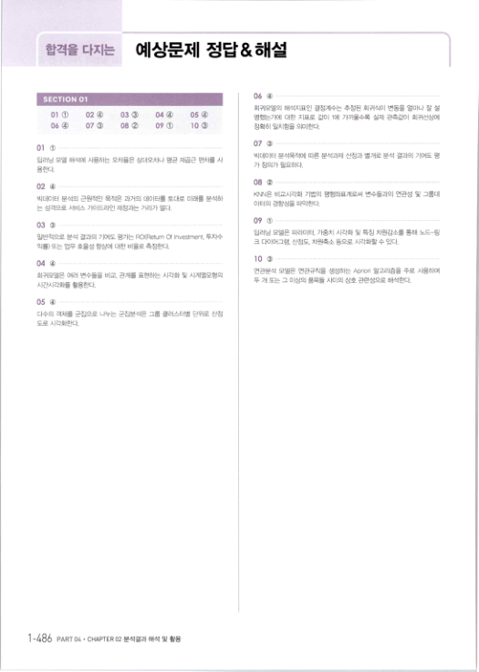
## 예상문제 정답＆해설
#### 합격을 다지는
06 ④ …… … … ……… ……… ………………………∼…… SECTION 01 회귀모델의 해석자표인 결정계수는 추정된 회귀식이 변동을 얼마나 잘 설 04 ④ 02 @) 01 (D 03 .:) 05 ④ 명했는가0ㅔ 대한 지표로 값이 10ㅔ 가까울수록 실제 관측값이 회귀선상에 07 （軫 06 ④ 08 ② 1 0 ③：) 09cD 정확히 일치함을 의미한다， 07 (a:l 01 <j:) 빅데이터 분석목적에 따른 분석과제 선정과 별개로 분석 결과의 기여도 평 가 정의가 필요하다． 딥러닝 모델 해석에 사용하는 오치율은 상대오차나 평균 제곱근 편차를 사 용한다． 08 ② …………………… ……………………………… ……………… …… 02 ④ ……………－一…………………………………………………∼…… KNN은 비교씨각화 기법의 평행좌표계로쩌 변수들과의 연관성 및 그룹데 빅데이터 분석의 근원적인 목적은 과거의 데이터를 토대로 미래를 분석하 는 성격으로 서비스 개기드라인 제정과는 거리가 멀다． 이터의 경향성을 파악한다． 09 《〕 ：> ………………………………∼… ………… …… ……… 03 c) … 딥러닝 모델은 파라미터 . 가중치 시각화 및 특징 차원감소를 통해 노드－링 크 다이어그램． 산점도， 차원축소 둥으로 시각화할 수 있다． 일반적으로 분석 결과의 기여도 펑가는 ROl(Return Of Investment . 투자수 익률） 또는 업무 효율성 향상에 대한 비율로 측정한다． 10 ③ ………∼…… ……………………… 04 c) …… ………………………………………… 연관분석 모델은 연관규칙을 생성하는 Apriori 알고리즘을 주로 사용하며 두 개 또는 그 이상의 품목들 사이의 상호 관련성으로 해석한다． 회귀모델은 여러 변수들을 비괴 관7升를 표현하는 시각화 및 시계열모형의 시간시각화를 활용한다． 05 ④ …… ……… ………………… 다수의 객체를 군집으로 나누는 군집분석은 그룹 클러스터별 단위로 산점 도로 시각화한다． 1 -486 PART UI. . CHAPTER 02분석결과해석및활용

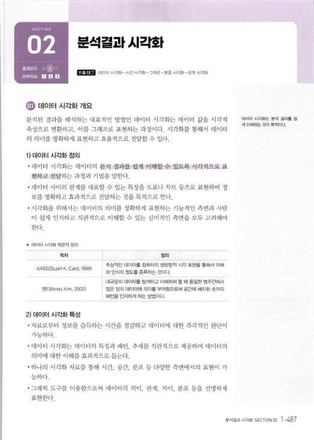
SECTION

# 분석결과 시각화
출제빈도 厓） 빈출 Eㅐ그 데이터 시각화 · 시간 시각화 · 그래프 · 분포 시각화 · 관계 시각화 반복학습 E~ .

.

#### .I 데이터 시각화 개요
분석된 결과를 해석하는 대표적인 방법인 데이터 시각화는 데이터 값을 시각적 속성으로 변환하고 , 이를 그래프로 표현하는 과정이다 . 시각화를 통해서 데이터 의 의미를 명확하게 표현하고 효율적으로 전달할 수 있다． 1) 데이터 시각화 정의

- 데이터 시각화는 데이터의 분석 결과를 쉽게 이해할 수 있도록 시각적으로 표
현하고 전달하는 과정과 기법을 말한다．

- 데이터 사이의 관계를 대표할 수 있는 특징을 도표나 차트 등으로 표현하여 정
보를 명확하고 효과적으로 전달하는 것을 목적으로 한다．

- 시각화를 위해서는 데이터의 의미를 정확하게 표현하는 기능적인 측면과 사람
이 쉽게 인지하고 직관적으로 이해할 수 있는 심미적인 측면을 모두 고려해야 한다． 卜 데이터 시각화 학문적 정의 학자 정의 추상적인 데이터를 컴퓨터의 쌍방향적 시각 표현을 통해서 이해 스터드（Stuart K. Card, 1999) 와 인식의 정도를 증폭하는 것이다． 대규모의 데이터를 탐색하고 이해하려 할 때 동일한 범주인k게서 많은 양의 데이터에 의미를 부여함으로써 공간에 배치된 숫자의 앤디（Andy Kirk, 2002) 패턴을 인지하게 하는 방법이다． 2) 데이터 시각화 특성

- 자료로부터 정보를 습득하는 시간을 절감하고 데이터에 대한 즉각적인 판단이
가능하다．

- 데이터 시각화는 데이터의 특징과 패턴 , 추세를 직관적으로 제공하여 데이터의
의미에 대한 이해를 효과적으로 돕는다．

- 하나의 시각화 자료를 통해 시간 , 공간 , 분포 등 다양한 측면에서의 표현이 가
능하다．

- 그래픽 도구를 이용함으로써 데이터의 의미 , 관계 , 차이 , 분포 등을 선명하게
표현한다．

> 데이터 시각화는 분석 결과를 쉽 
게 이해하는 것이 목적이다．

> 분석결과시각화SECTION 02 ㅏ 
87

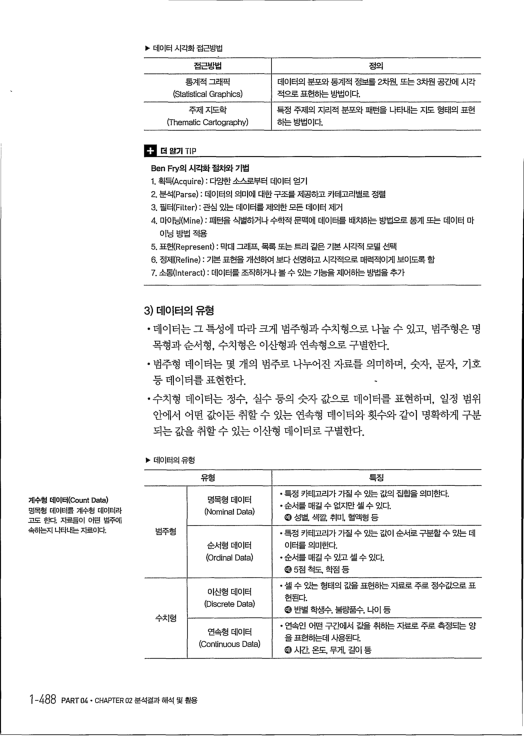
》 데이터 시각화 접근방법 倪방법 정의 통계적 그래픽 데이터의 분포와 통계적 정보를 2차원 . 또는 3차원 공간에 시각 적으로 표현하는 방법이다． (Statistical Graphics) 주제 자도학 특정 주제의 지리적 분포와 패턴을 나타내는 지도 형태의 표현 하는 방법이다． (Thematic Cartography) .

더 알기 ㄲP Ben Fry의 시z慟 절차와 기법 1 . 획득《Acquire) : 다임逆上소스로부터 데이터 얻기 2 . 분석（Parse) : 데이터의 의미에 대한구조를 저rn하고 카테고리별로 정렬 3 . 필터（Filter) : 관심 있는 데이터를 제외한모든 데이터 제거 4 . 마이닝.41ne) : 패턴을 식별하거나 수학적 문맥에 데이터를 배치하는 방법으로 통계 또는 데이터 마 이닝 방법 적용 5 . 표헌（Represent) : 막대 그래프 목록 또는 트리 같은 기본시각적 모델 선택 6 . 정제（Refine) : 기본 표현을 개선하여 보다 선명하고 시각적으로 매력적이게 보이도록 함 7 . 소통窈nteract) : 데이터를 조작하거나볼 수 있는 기능을 제어하는 방법을 추가 3) 데이터의 유형

- 데이터는 그 특성에 따라 크게 범주형과 수치형으로 나눌 수 있고 , 범주형은 명
#### 목형과 순서형 , 수치형은 이산형과 연속형으로 구별한다．
#### · 범주형 데이터는 몇 개의 범주로 나누어진 자료를 의미하며 , 슷자 , 문자 , 기호
등 데이터를 표현한다．

#### ·수치형 데이터는 정수 , 실수 등의 숫자 값으로 데이터를 표현하며 , 일정 범위
안에서 어떤 값이든 취할 수 있는 연속형 데이터와 횟수와 같이 명확하게 구분 되는 값을 취할 수 있는 이산형 데이터로 구별한다． 유형 특징

- 특정 카테고리가 가질 수 있는 값의 집합을 의미한다． 
- 순서를 매길 수 없지만 셀 수 있다． 
clI 성별 . 색깔, 취미 . 혈액형 등 겨［수형 데이터（Count Data) 명목형 데이터를 계수형 데이터라 고도 한다. 자료들이 어떤 범주에 속하는지 나타내는 차료이다． 명목형 데이터 (Nominal Data) 범주형

- 특정 카테고리가 가질 수 있는 값이 순서로 구분할 수 있는 데
순서형 데이터 이터를 의미한다．

- 순서를 매길 수 있고 셀 수 있다． 
- l 5점 척도， 학점 등
(Ordinal Data)

- 셀 수 있는 형태의 값을 표헌하는 자료로 주로 정수값으로 표
이산형 데이터 현된다． .l 반별 학생수, 불량품수. 나이 등 (Discrete Data) 수치형

- 연속인 어떤 구간에서 값을 취하는 차료로 주로 측정되는 양 
을 표현ㅎ階데 사용된다． 연속형 데이터 (Continuous Data) 0 시간, 온도， 무게 , 길이 등 1-488 PART 04. CHAPTER 02분석결과해석및활용

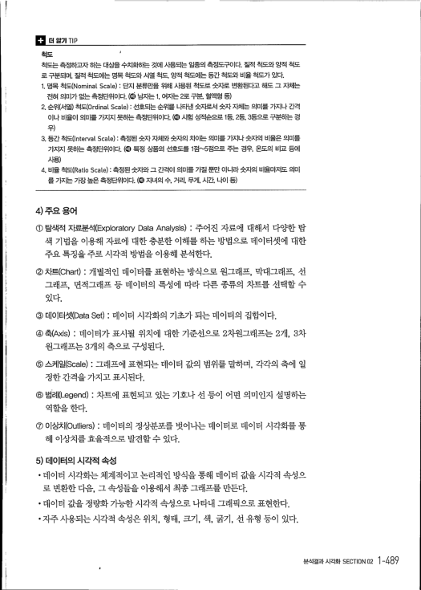
척도 척도는 측정하고자 하는 대상을 수치화하는 것에 사용되는 일종의 측정도구이다. 질적 척도와 양적 척도 로 구분되며 . 질적 척도에는 명목 척도와 서열 척둑 양적 척도에는 등간 척도와 비율 척도가 있다． 1 . 명목 척도（Nominal Scale) : 단지 분류만을 위해 사용된 척도로 숫자로 변환된다고 해도 그 자처는 전혀 의미가없는측정단위이다 . 吻l 남자는1 . 여자는2로구분. 혈액형 등） 2 . 순위（서열） 척도（0rdinal Scale) " 선호되는 순위를 나타낸 숫자롸l 숫자 자체는 의미를 가지나 간격 이나 비율이 의미를 가지지 못하는 측정단위이다. 幟 시험 성적순으로 1등 , 2등. 3등으로 구분하는 경 우） 3 . 등간 척도.ntervat Scale) : 측정된 숫자 자체와숫자의 차이는 의미를 가지나 숫자의 비율은 의미를 가지지 못하는 측정단위이다. （口l 특정 상품의 선호도를 1점∼5점으로 주는 경우. 온도의 비교 등에 사용） 4 . 비율 척도（Ratio Scale) : 측정된 숫자와 그 간격이 의미를 가질 뿐만 아니라숫자의 비율마저도 의미 를 가지는 가장높은 측정단위이다. 幟 자녀의 수． 거리 , 무게 . 시간, 나이 등） 4) 주요 용어 ① 탐색적 자료분석（Exploratory Data Analysis) : 주어진 자료에 대해서 다양한 탐 색 기법을 이용해 자료에 대한 충분한 이해를 하는 방법으로 데이터셋에 대한 주요 특징을 주로 시각적 방법을 이용해 분석한다．

#### ②차트（Chart) : 개별적인 데이터를표현하는 방식으로 원그래프 , 막대그래프 , 선
그래프 , 면적그래프 등 데이터의 특정에 따라 다른 종류의 차트를 선택할 수 있다． ③ 데이터셋（Data Set) : 데이터 시각화의 기초가 되는 데이터의 집합이다． ④축(Axis) : 데이터가 표시될 위치에 대한 기준선으로 2차원그래프는 2개 , 3차 원그래프는 3개의 축으로 구성된다． ⑤ 스케일（昌cale) : 그래프에 표현되는 데이터 값의 범위를 말하며 , 각각의 축에 일 정한 간격을 가지고 표시된다． ⑥ 범례（Legend) : 차트에 표현되고 있는 기호나 선 등이 어떤 의미인지 설명하는

#### 역할을 한다 .
#### ⑦ 이심찌(Outliers) : 데이터의 정상분포를 벗어나는 데이터로 데이터 시각화를 통
해 이상치를 효율적으로 발견할 수 있다 .

5) 데이터의 시각적 속성

- 데이터 시각화는 쳬계적이고 논리적인 방식을 통해 데이터 값을 시각적 속정으
로 변환한 다음 , 그 속정들을 이용해서 최종 그래프를 만든다．

- 데이터 값을 정량화 가능한 시각적 속정으로 나타내 그래픽으로 표현한다．
- 자주사용되는시각적 속성은위치 , 형태 , 크기 , 색 , 굵기 , 선유형 등이 있다．
> 분석결과시각화SECTION 02 ㅑ 
89

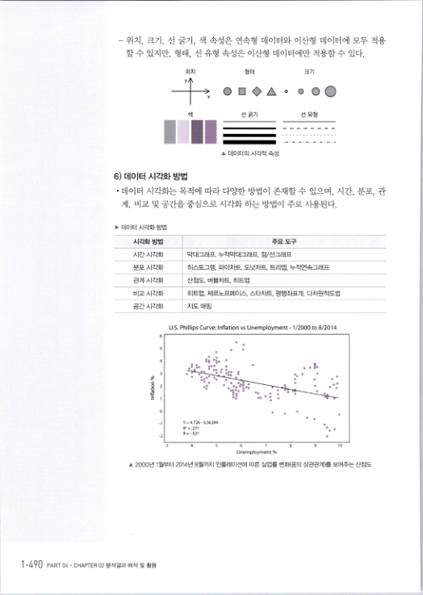
- 위치 , 크기 , 선 굵기 , 색 속정은 연속형 데이터와 이산형 데이터에 모두 적용 
할 수 있지만 , 형태 , 선 유형 속성은 이산형 데이터에만 적용할 수 있다．

# 위치 
큭ㅊ 형태

## ●U ◇Ao
선 굵기 색 ▲ 데이터의 시각적 속성 6) 데이터 시각화 방법

- 데이터 시각화는 목적에 따라 다양한 방법이 존재할 수 있으며 , 시간 , 분포 , 관
계 , 비교 및 공간을 중심으로 시각화 하는 방법이 주로 사용된다． 》 데이터 시각화 방법

#### 시z纖방법 
묘 翹 시간시각화

- 막대그래프． 누적막대그래프점／선그래프
분포시각화

- 히스토그램， 파이차트． 도넛차트，
산점도， 버블차트， 관계 시각화 비교 시각화

- 히트맵 처隱노프페이스， 스타차트， 평행좌표계， 다차원척도법
공간 시각화 U.S. Phillips Curve: Inflation vs Unemployment - 1/2000 to 8/2014 6 5 4 1 구 ` z 本 ㄷ 。

＝ 끈 드 0 -1 -2 3 4 5 6 7 Unemployment % A 2000년 1월부터 2014년 8윌까지 인플레이션（게 따른 실업률 변화（음의 상관관계＞를 보여추는 산점도 1-490 PART04. CHAPTER 02분석결과해석및활용

# 크기 
○O

> 0
> 선 유형
> 누적연속그래프
> 8 
9 10

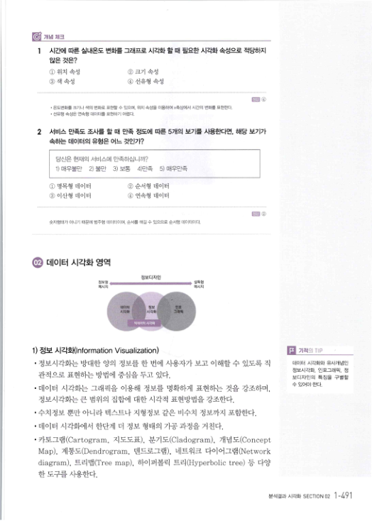
】 시간에 따른 실내온도 변화를 그래프로 시각화 할 【Iㅐ 필요한 시각화 속성으로 적당하지 않은 것은？ ① 위치 속성 ② 크기 속성 ③ 색 속정 ④ 선유형 속성

- 온도변화를 크기나 색의 변화로 표현할 수 있의겨． 위치 속성을 이욕하여 ×축상에서 시간의 변화를 표현흐“가
- 선유형 속상은 연속형 데이터를 표현하기 어렵다．
2 서비스 만족도 조차를 할 때 만족 정도에 따른 5개의 보기를 사용한다면 , 해당 보기가 속하는 데이터의 유형은 어느 것인가？ 당신은 현재의 서비스0ㅔ 만족하십니까？ 1) 매우불만 2) 불만 3) 보통 4）만족 5) 매우만족 ② 순서형 데이터 ① 명목형 데이터 ④ 연속형 데이터 ③ 이산형 데이터 숫자형태가 아니기 때문에 범주형 데이티이며 . 순서를 애길 수 있으므로 순서형 데이터이다． .

데이터 시각화 영역 1) 정보 시각화.nformation Visualization)

- 정보시각화는 방대한 양의 정보를 한 번에 사용자가 보고 이해할 수 있도록 직
관적으로 표현하는 방법에 중심을 두고 있다．

- 데이터 시각화는 그래픽을 이용해 정보를 명확하게 표현하는 것을 강조하며，
정보시각화는 큰 범위의 집합에 대한 시각적 표현방법을 강조한다．

- 수치정보 뿐만 아니라 텍스트나 지형정보 같은 비수치 정보까지 포함한다．
- 데이터 시각화에서 한단계 더 정보 형태의 가공 과정을 거친다．
- 카토그램（Cartogram , 지도도표） , 분기도（Cladogram) , 개념도（Concept 
Map) , 계통도（Dendrogram , 덴드로그램） , 네트워크 다이어그램（Network diagram) , 트리맵（Tree map) , 하이퍼볼릭 트리（Hyperbolic tree) 등 다양 한 도구를 사용한다．

> - 텝．②
> .
기적의 지p

> 데이터 시각화와 유사개념인
> 정보시각화 . 인포그래픽 . 정
> 보디자인의 특징을 구별할
> 수 있어야 한다．
> 분석결과시각화SECTION 02 1 -4이
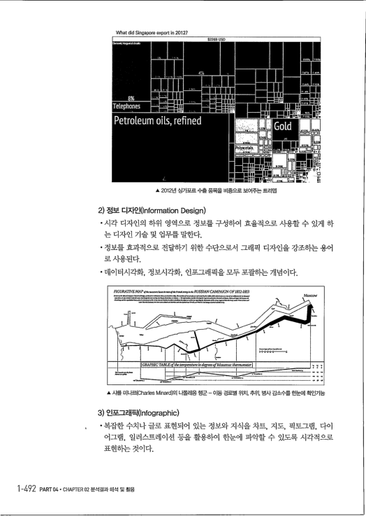
# S226B u5【》 
轍크 What did Singapore export in 2012?

#### A 2012년 싱가포르 수출 품목을 비중으로 보여주는 트리맵 
I Go띠 TeLephones

# ■■■■■굶，■를뺑쥰會＝濁믐羈＝ 
기柵 …顚 스，: 凸ㅂ ’們 !- LJUU饍!

.

### Petroleum oils, refined
2) 정보 디자인onformation Design)

- 시각 디자인의 하위 영역으로 정보를 구성하여 효율적으로 사용할 수 있게 하 
는 디자인 기술 및 업무를 말한다．

- 정보를 효과적으로 전달하기 위한 수단으로서 그래픽 디자인을 강조하는 용어 
로 사용된다．

#### ·데이터시각화, 정보시각화 , 인포그래픽을모두포괄하는개념이다．
押cURAmEMAP『驢‘，휘긔긔洲”‘－뉼－軾경놀＇눕밉‘』 젼鮮．‘4'r心SSIduvcAM1'녈／cN0f섶柳2-182크 `*＊눙漱＊．굼｀"` ‘∼今∼닐～． 놈． ．뻐＇``．겨．.．빻令｀－·＊六＊ 聊님놉 － 녘－활〃붜낟＊－令·－ .．敞戚＊뻐멨눕＊＊·넓“- -＇뻑닐눕－ “샅· 랄＊--＇놈－ 놀“》－·떼－빼→．·눋＊ -.．걀｀ ｀벎‘，崗＊s．〃＊-* --' 뻐“` ＾글 4-

- 
..,,* ．崙’ 畔』

* 
-

#### 요6aumurthennurn 
→ 鱗＜==-'- - ：듯푸’덟＝' ▲ 샤를 미나르（Charles Minard）의 나폴레옹 행군－ 이동 경로별 위치 , 추위 . 병사 감소수를 한눈에 확인가능 3) 인포그래픽(Infographic)

#### ·복잡한수치나글로 표현되어 있는 정보와 지식을 차트 , 지도 , 픽토그램 , 다이
#### 어그램 , 일러스트레이션 등을 활용하여 한눈에 파악할 수 있도록 시각적으로
표현하는 것이다． ㅑ 92 PART 04. CHAPTER 02분석결과해석및활용

> 曾윈 
th ㄷ그긔OOD

> MOSCI기v 
`

> =
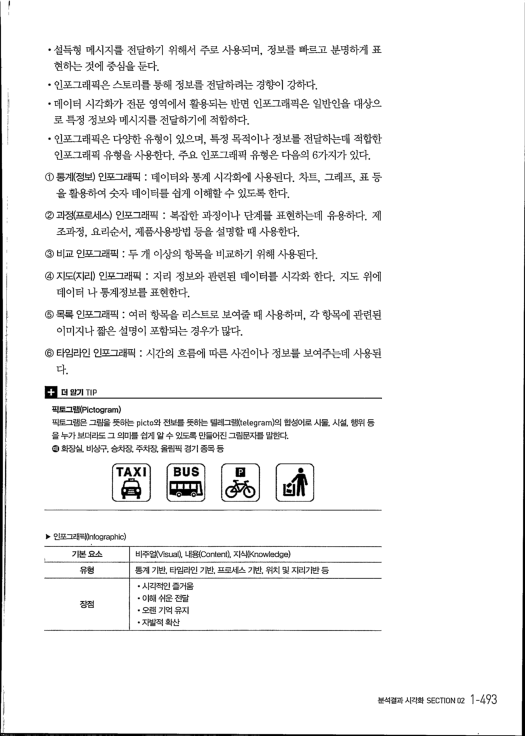
- 설득형 메시지를 전달하기 위해서 주로 사용되며 , 정보를 빠르고 분명하게 표
현하는 것에 중심을 둔다．

- 인포그래픽은 스토리를 통해 정보를 전달하려는 경향이 강하다．
- 데이터 시각화가 전문 영역에서 활용되는 반면 인포그래픽은 일반인을 대상으
로 특정 정보와 메시지를 전달하기에 적합하다．

- 인포그래픽은 다양한 유형이 있으며 , 특정 목적이나 정보를 전달하는데 적합한
인포그래픽 유형을 사용한다 . 주요 인포그래픽 유형은 다음의 6가지가 있다．

#### ①통계（정보） 인포그래픽 : 데이터와통계 시각화에 사용된다 . 차트 , 그래프 , 표 등 
을 활용하여 슷자 데이터를 쉽게 이해할 수 있도록 한다 .

② 과정（프로세스） 인포그래픽 : 복잡한 과정이나 단계를 표현하는데 유용하다 . 제 조과정 , 요리순서 , 제품사용방법 등을설명할때 사용한다． ③ 비교 인포그래픽 : 두 개 이상의 항목을 비교하기 위해 사용된다．

#### ④지도（지리） 인포그래픽 : 지리 정보와 관련된 데이터를 시각화 한다 . 지도 위에
데이터 나 통계정보를 표현한다． ⑤ 목록 인포그래픽 : 여러 항목을 리스트로 보여줄 때 사용하며 , 각 항목에 관런된 이미지나 짧은 설명이 포함되는 경우가 많다． ⑥ 타임라인 인포그래픽 : 시간의 흐름에 따른 사건이나 정보를 보여주는데 사용된 다． ..

더 알기 지P 픽토그램（Pictogram) 픽토그램은 그림을 뜻하는 picto와 전보를 뜻하는 텔레그램（teLegram）의 합성어로 사물. 시설 . 행위 등 을 누가 보더라도 그 의미를 쉽게 알 수 있도록 만들어진 그림문자를 말힌다． c[l 화장실 , 비상구. 승차장, 주차장, 올림픽 경기 종목 등

# TAXI 
膏

> 인포그래픽.ntographic)
기본요소 비주얼（Visual) , 내용（Content) , 지식（Knowledge) 유형 통계 기반, 타임라인 기반, 騙l세스 기반. 위치 및 지리기반 등

- 시각적인 즐거움
- 이해 쉬운 전달
장점

- 오랜 기억 유지
- 자발적 확산
> 분석결과시각화SECTION 02 1 -493
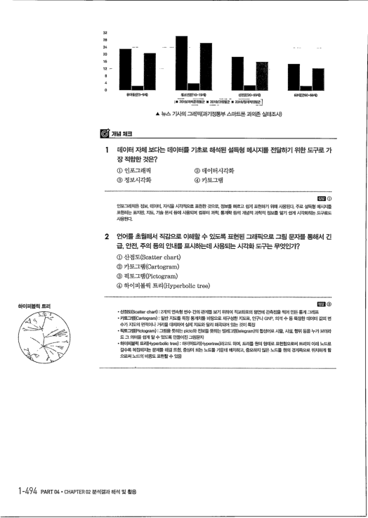
# ▲ 뉴스 기사의 그래픽（과기정통부 스마트폰 과의존 실태조사） LI
--- --- 챵소넌반10-19새；I 섬인〔민20-59切 藁·灌5크9尸펍兩石묜 .2019羈 I9J2. 209祈적뮈험군걍 1 데이터 자체 보다는 데이터를 기초로 해석된 설득형 메시지를 전달하기 위한 도구로 가 장 적합한 것은？ ① 인포그래픽 ② 데이터시각화 ③ 정보시각화 ④ 카토그램 인포그래픽은 정보， 데이터 . 지식을 시각적．으로 표현한 것으로， 정보를 삐르고 쉽게 표현하기 위해 사驪l다 . 주로 설득형 메시ㅈ隱 표헌ㅎ階 표지판. 지도， 기술 문서 OlI A隱되며 컴퓨터 고樽f . 통계학등의 개념적 고樽f적 정．보를 알기 쉽게 시z杉타ㅎ는 도구로도 사용된다． 2 언어를 초월해서 직감으로 이해할 수 있도록 표현된 그래픽으로 그림 문자를 통해서 긴 급 , 안전 , 주의 등의 안내를 표시하는데 사용되는 시각화 도구는 무엇인가？ ① 산점도（Scatter chart) ② 카토그램（Cartogram) ③ 픽토그램（Pictogram) ④ 하이퍼볼릭 트리（Hyperbolic tree) 하이퍼볼릭 트리

- 산점도（Scatter chart) :2개의 연속형 변수 간의 관겨屠 보기 위하여 직교좌표의 펑면에 관촉점을 찍어 만든통계 그라陣 
- 카ㅁ램（cartogram) : 일반 지도를 특정 통계치틀 바탕으로 재구성한 자도로， 인구나 GNP , 의석 수 등 특정한 데이터 값의 변 
수가 지도의 면적이나 거리를 대체하여 실제 지도와 달리 왜곡되어 오（는 것이 특징

- 픽토그램（Pictogram) : 그림을 뜻하는 pictㅇ와 전보를뜻하는 텔레그램（telegram）의 합성어로 사물. 시설 . 행위 등을 누가보더라 
도 그 의미를 쉽게 알수 있도록 안들어진 그림문자

- 하이퍼볼릭 트리（Hyperbolic tree) = 하이퍼트리（Hypertree）라고도 하며 . 트리를 원의 형태로 표현힘으로써 트리의 아래 노드로 
갈수록 복잡해ㅈ는 문저隱 해결 또한, 중심0I 되는 노드를 가운데 배치하그긱 중요하지 않은 노드를 원의 경겨쪽으로 위치하게 함 으로쩌 노드의 비중도 표현할수 있음 1 -494 PART 04. CHAPTER 02분석결과해석및활용

> 6伊戮만60-69세；I
> Q 
@

> 뎐미③
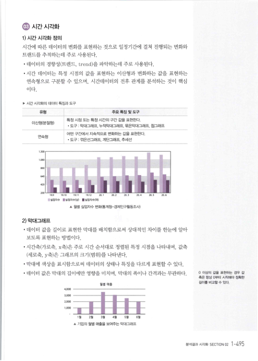
### o 시간 시각화
1) 시간 시각화 정의 시간에 따른 데이터의 변화를 표현하는 것으로 일정기간에 걸쳐 진행되는 변화와 트랜드를 추적하는데 주로 사용된다．

- 데이터의 경향성（트렌드 , trend）을 파악하는데 주로 사용된다．
- 시간 데이터는 특정 시점의 값을 표현하는 이산형과 변화하는 값을 표현하는
연속형으로 구분할 수 있으며 , 시간데이터의 전후 관계를 분석하는 것이 핵심 이다． ' 시간 시각화의 데이터 특징과 도구 유형 주요 특징 및 도구 이산형（분절형） 특정 시점 또는 특정 시간의 구간 값을 표헌한다．

- 도구 : 막대그래프， 누적막대그래프， 묶은막대그래프， 정그래프
연속형 어떤 구간에서 ㅈ嘴적으로 변화하는 값을 표현한다．

- 도구 : 꺾은선그래프， 계단그래프， 추세선
1,300 L080 85o 640 420 200

19. 9 
1 910

19. 11 
19. 12 
20. 1
고臥 2 2o'3 2〔〕‘ 4

20. 5 
20. 6
실업자수 실업자수《남》 ·실업자수（여） ▲ 뭘별 실업자수 변화（통계청－경제인구흴동조사） 2) 막대그래프

- 데이터 값을 길이로 표현한 막대를 배치함으로써 상대적인 차이를 한눈에 알아
보도록 표현하는 방법이다．

- 시간축（가로축 , x축）은 주로 시간 순서대로 정렬된 특정 시점을 나타내며 , 값축
（세로축 , y축）은 그래프의 크기（범위）를 나타낸다．

- 막대에 색상을 표시함으로써 데이터의 상태나 특징을 다르게 표현할 수 있다．
- 데이터 값은 막대의 길이에만 영향을 미치며 , 막대의 폭이나 간격과는 무관하다．
월별 매출 4,000 3,000

# 1,000 I 'll
' ' 1월 2월 3월 4월 5월 6월 2,000 ▲ 기업의 월별 매출을 보여주는 막대그래프

> 0 이상의 값을 표현하는 경우 값 
축은 항상 0부터 시작해야 정확한 갈기를 비교할 수 있다．

> 분석결과시각화 SEC지0N02 1-495

3) 누적막대그래프

- 막대그래프가 하나의 변수어］ 따라 달라지는 형태를 보이는 반면에 누적막대그
래프는 두 개 이상의 변수를 동시에 다루는 경우에 막대의 영역을 구분하여 나 머지 변수의 값을 표현한다．

- 하나의 막대를 구성하는 세부항목 각각의 값과 전쳬의 합을 함께 표현할 때 유
므ㄱ脾Il으t 세부 항목은 질감이나 색 상으로 구별한다． 용하다． 월별 매출 4,000 3,000

# I 
2월 3월 4월 5월 6월 2,000

## I
1월 1,000 ■식품 ．의류 ·가전 ▲ 기업의 월별 매출을 보여주는 누적막대그래프 4) 묶은막대그래프

- 묶은막대그래프는 누적막대그래프와 같이 두 개 이상의 변수를 동시어］ 다루는
경우에 사용하며 첫번째 변수（x축）의 각 위치에 나머지 변수의 값을 각각의 막 대로 표현한다．

- 그래프를 구성하는 세부항목의 값의 변화를 표현할 수 있지만 , 변수의 누적합
계나 추이를 파악하기는 어렵다． 월별 매출 2,000 L500 1,000 500 1월 2월 3월 4월 5월 6월 ■식품 ■ 의류 ·가전 ▲ 기업의 월별 매출을 보여주는 묶음므건거그래프 5) 점그래프

- 가로축에 대응하는 세로축의 값을 점으로 표시한 그래프로 면적을 표시할 필요
가없기 때문에 적은 공간에 표현할 수 있으며 , 점의 집중 정도와 배치에 따라 흐름을 파악하기가 용이하다．

- 가로축을 시간으로 세로축의 값을 점으로 표시하는 경우 시간의 흐름에 따른
값의 변화를 표현할 수 있다． 1 -496 PART 04. CHAPTER 02분석결과해석및활용

4,000 3,000 2,000 1,000 1월 2월 3월 4월 5월 6월 ▲ 기업의 월별 매출을 보여주는 정그래프 6) 꺾은선그래프（연속 시계열그래프）

- 점그래프에서 점과 점 사이를 선으로 연결한 그래프로 데이터의 연속된 특성을
표현한다．

- 경향성을 뚜렷하게 보여주기 위해서 주로 사용한다．
- 세로축의 길이를 늘리거나 가로축의 길이를 짧게 줄이면 변화가 급격하게 보여
지며 , 가로축의 길이를 너무 길게하면 변화의 패턴이 잘 나타나지 않는다．

- 경우에 따라 그래프에서 점을 표시하지 않을 수도 있다．
월별 매출 4,000 3자沁 2,000 L珖）0 1월 2월 3월 4월 5월 6월 ▲ 기업의 월별 매출을 보여주는 꺾은선그래프 7) 계단그래프

- 계단그래프는 점과 점사이를 직접 연결하는 것이 아니라 , 변화가 생길 때까지
일정한 선을 유지하다가 다음 값으로 바뀌는 지점에서 급격하게 변화하는 것을 표현한다．

- 꺾은선그래프는 데이터의 연속된 변화를 표현하기에 적합하고 , 특정 시점에서
의 변화를 표현하는 데에는 계단그래프가 유리하다．

- 연도별 법인세율 변화 , 연도별 최저임금 변화등에 이용한다．
월별 매출 4,000 3자【l0 ` - 괴毓)0 1,000 1월 2월 3월 4월 5월 6월 ▲ 기업의 월별 매출을 보여주는 계단그래프

> 점들을 선으로 연결하면 연속성
> 《추세）을 표현할 수 있다（꺾은선그
> 래프》
．

> 세로축이 0부터 시작하지 않는 경 
우 데이터 값들의 차이를 더 잘 나

> 타낼 수 있지만 , 값의 철대적인 크
> 기를 표현하지 않기 때둔뻬 해석 
의 부작용을 일으킬 수 있다．

> 분석결과시각화SECTION醱 ㅏ 97

8）추세선

- 추세선은 데이터 값의 즉각적인 변화보다는 변화하는
또는 곡선을 말한다．

- 추세선의 데이터에 대해 다양한 함수를 적용해서 구할
형 , 선형 , 이동평균형 등이 있다． 4000 3,000

# I ' l l
2,000 1,000 3월 4월 5월 6월 ▲ 현재월과 전월의 이동평균값을 보여주는 추세선이 포함된 막대그래프 1 다음 중 그래프에 대해 올바르게 설명하는 것은？ ① 두 변수 값의 비교를 위해서는 막대그래프를 사용하는 것이 좋다． ② 세로막대그래프의 x축은 값축이다． （亘） 막대그래프의 면적은 그래프의 값과 연관이 없다． ④ 꺽은선그래프에서 세로축의 길이를 늘리면 데이터 값의 변화가 완만하게 보여진다． 막대그래프는 그래프의 높이（데이터를 환산）로 판단하며 , 막대의 면적과는 연관이 없다， 2 다음 그래프에 대한 설명 중 맞지 않는 것은？ 궐별 매출

# 1渗畛 
ft 긔毓0 2J刪 灌윔 2퀄 3윌 4월 5월 6훨 ① 1월의 매출보다 2월의 매출이 2배 증가했다． ② 4월과 6월의 매출 평균은 2.500이다． ③ 3월 이후 월별 매출이 감소한다． ④ 추세선을 이용하여 분기별 매출액 함계를 구할 수 있다． 그래프에서 추쎄선은 이동팡균 값을 보여주며， 분기별 매출액 합계 둥은 별도로 구한다』 1 -498 PART Oi ' CHAPTER 02분석결과해석및활용

> 경향성을 보여주는 직선
#### 수 있으며 , 지수형 , 로그
> Q ③
> “미 ④

.

분포 시각화 1) 분포 시각화 정의 데이터의 분포를 시각적으로 표현하는 기법을 말하며 , 특정 변수의 값들이 어떻 게 분포되어 있는지를 파악하기 위해 사용한다．

#### · 원그래프와 같이 비율로 영역을 표현하는 경우 각 영역을 모두 합치면 1 또는
100％가 되는 특징을 가진다．

- 분포 데이터의 시각화는 최대 , 최소 , 전체분포를 나타내는 그래프로 표현하며，
전체의 관점에서 각 부분이 차지하는 정보를 히스토그램 , 파이차트 , 도넛차트， 누적연속그래프 , 트리맵 등으로 시각화한다． 2) 히ㅅ두ㄱ램어istogram) 막대그래프의 일종으로 세로축은 데이터의 분포 정도를 표현하고 , 가로축은 특 정 변수의 구간 폭을 의미한다．

- 데이터셋 안에서 특정 변수의 값이 어떻게 분포되어 있는지를 파악해야 하는
경우（도수분포） 주로 사용한다．

#### · 도수분포표 : 데이터 값의 다양한산출 분포를 보여주는 목록이나 표이다 . 일정한
범위를 기준（계급이라고 함）으로 데이터 값의 발생 건수를 요약해서 보여준다． 》 도수분포표와 히스토그램 인원（명） 연령 11 '--' 20 35 연령대별 인원＜명） 21 "-'30 54 31 "-'40 98 41 "-'50 129 " 긋익존밌근％'心 51 "-'60 77 , 61 "-'70 43

- 구간을 설정해서 데이터를 표현하기 때문에 , 적절한 구간 폭을 선택하고 각각
의 막대가 동일한 폭을 갖도록 설정해야 시각적으로 정확하게 표현된다．

- 구간폭을 좁게 하는 경우 데이터 분포 차이를 잘 표현할 수 있지만 전쳬적인
흐름을 파악하기 어려울 수 있고 , 구간폭을 넓게 하는 경우는 데이터 분포의 급격한 변화를 표현하기가 어렵다．

- 히스토그램이 왼쪽으로 치우쳐 있다면 데이터의 값이 낮은 구간에 몰려 있으
며 , 반대로 오른쪽에 치우쳐 있다면 데이터의 값이 높은 구간에 몰려 있음을 의 미한다．

- 누적히스토그램（Cumulative Histogram）은 히스토그램의 각 구간의 값을
누적하여 표현한다 . 따라서 , 데이터의 출현 빈도를 오른쪽으로 누적하면서 표 시하며 마지막 막대는 전쳬 데이터의 총 수를 나타낸다 .

> 【철 기적의 ㄲp
> 시각화 방법들의 장단점을
> 구분하자．
> 분석결과시각화SECTION 02 1 -499

。

ㅇ 。

。

ㅇ 。

ㅇ 山 ㅇ 。

。

c 。

。

ㅇ 쟈 ㅇ 。

。

여 。

ㅇ ㅇ ㅇ 히 。

o 뗘 ∼ ㅇ ㅇ ㅇ 。

ㅇ m - - 뻐 그＂`

#### e》 
!

· .

· 2 4 ;

- ㅓ
▲ 히스토그램（좌）과 누적히스토그램（우） 2) 원그래프（파이차트 , Pie 에art) 하나의 원을 구성하는 데이터의 비율에 따라 조각으로 나누어서 데이터의 분포를 표현한다．

- 데이터의 값을 비율（%）로 환산하여 표현하며 , 각 비율을 합하면 100％가 된다．
- 원을 구성하는 각각의 요소의 비율을 한눈에 보여주지만 , 막대그래프와 같이
데이터의 값을 정확하게 표현하기 어렵다는 단점이 있다．

- 하나의 분류에 대한 값의 분포를 표현하기 때문에 , 여러 분류에 대한 값을 표현
그래프의 조각안으로는 서로 간의 크기를 비교하기 어렵기 때문에． 하기 위해서는 각각의 차트가 필요하다． 실제 데이터 값이나 점유율 등 추 가정보틀 그래프에 포함시켜서 표 현하는 것이 좋다． ▲ 파이차트 3) 도넛차트 막대그래프를 누적하고 도넛 모양으로 만든 형태이며 , 원그래프가 면적으로 분 포비율을 표현하는데 반해 도넛차트는 면적이 아닌 길이로 데이터 값의 정도를 표현한다．

- 같은 성격의 데이터인 경우 여러 개의 차트를 겹쳐서 보여줄 수 있다．
#### · 중첩도넛차트 : 도넛차트 여러 개를 겹쳐서 표현하는 것으로 , 여러 분류에 대한
값을 하나의 차트로 표현할 수 있다． 판매 대수 2020`2022년 판매 ㄷ洲놈 ▲ 도넛차트와 중첩도넛차트 1-500 PART06* CHAPTER 02분석결과해석및활용

4) 트리맵（Tree Map) 트리맵은 전쳬 데이터를 표현하는 하나의 사각형 영역에 세부 사각형들의 크기로 데이터의 분포를 시각화하여 표현한다．

- 하나의 대분류에 속한 세부 분류 데이터들의 분포를 영역의 크기를 이용하여
효과적으로 보여준다．

- 내부의 사각형도 하위 분류를 적용해서 다시 맵을 구성할 수 있기 때문에 , 계층
형／트리 구조를 가진 데이터를 표현하는데 유용하다． 183 전남 80 섀주 1묘 ▲ 시도별 인구 분포 트리맵 5) 누적연속그래프（누적영역차트） 시간 변화에 따른 값의 변화를 선그래프의 영역으로 표현한다 . 가로축은 시간을 나타내며 세로축은 데이터 값을 표시한다．

- 누적막대그래프와 유사하지만 , 시간에 따라 변화하는 값의 흐름을 더 잘 보여 
준다 . 또한 , 세로 영역의 한 단면만 보여주면 그 시점의 분포를 볼 수 있다．

- 누적연속그래프는 아래 부분의 데이터 값이 윗부분의 위치에 영향을 주기 때문
에（값이 누적됨） , 값의 분포를 표현하는 데 적합하며 한 집단의 경향성을 알아 보기는 어렵다． 연간 매출액 추이 9,000 8,000 7,000 5,0沁 5,γ）0 4,000 3,000 2,000 1,000 202이크 2021년 2022년 2023년

- 노트북 
- ㄲ／ 
- 에어컨
▲ 누적연속그래프

> 각각의 사각형은 하위 분류도 세 
분화할 수 있다． 예를 들어 . 서울은 구별 인구 분포를 나타내는 사각 형으로 서腱화할 수 있다．

> 각 연도별 어떤 제품이 얼마나 팔
> 렸는지 알 수 있다．
> 분석결과시각화SECTION02 1-501

6) 파레토차트（Pareto Chart) 파레토차트는 막대그래프와 선그래프를 결합한 형태이다 . 개별 항목의 데이터 값은 막대의 내림차순으로 표현되고 , 오름차순 누적 총계는 선그래프（누적선그 래프）의 형태로 표현된다．

- 결과의 80％가 20％의 원인으로부터 나온다는 파레토 법칙에 근거하여 , 결과
에 영향을 미치는 중요한 요인들을 찾는데 사용된다．

- 명목형 변수 값들의 개수를 사용하는 데이터에 적합하며 연속형 변수에 대한
값을 갖는 데이터에는 적합하지 않다．

- 범주형 데이터 중에서 순서형 데이터에는 적합하지 않은데 , 파레토차트에서는
변수에 정의된 순서가 아닌 빈도 수로 데이터가 정렬되기 때문이다． 자동차고장원인 횟：수 ㄷ ㅓ.

31) 변속기 브레이크 타이어 ▲ 파레以 트

### 陸개념체크
1 원그래프에서 조각을 이루는 데이터 값의 크기와 비례하는 것은？ ① 그래프 조각의 각도 ② 그래프 조각의 수 ③ 그래프 조각의 반지름 ④ 그래프 조각의 색상 원그래프는 전체 데이터 값에 대한 부분 긺鸞』 비율을 원율 구성하는 부차쁠 조각으로 표현하는 것으로 조각의 데이터 값이 커지면 부차읕의 각도와 면적이 따라서 커진다． 2 다음 설명 중 맞는 것은？ ① 누적히스토그램은 오른쪽으로 갈수록 막대의 크기가 작아진다． ② 도넛차트는 하나의 차트에 여러 분류의 값을 표현하기가 어렵다． ③ 전국의 인구분포를 표현할 때 트리맵을 사용하면 시도별 , 구별 , 동별 단위까지 한 번에 표현할 수 있다． ④ 데이터세트의 크기가 2배가 되면 원그래프의 전쳬 면적도 2배가 된다． 트리맵은 겨曦구조를 갖는 데이터의 분포를 표현하는데 적합하다． “凹．③ 1-502 PART04. CHAPTER 02분석결과해석및활용

# z 
2α％ U.

엔친

> - 미 <:()

.

관계 시각화 1) 관계 시각화 정의

#### 데이터 사이의 관계를 시각적으로 표현하는 것을 말한다 . 데이터셋에 변수가 2개
#### 이상이 있을 때 , 이 변수들의 상관관계를 표현한다． 
.I 편의점에서 우유와 빵의 판매량 사이의 관계를 표현 , 키와 뚜느게 사이의 관계를 표현

- 관계시각화를 위한 대표적인 도구로는산점도 , 버블차트 , 히트맵 등이 있다．
2) 산점도《스캐터플롯 , Scatter 더ot) 두 변수의 값을 2차원（또는 3차원） 좌표계를 활용하여 점으로 표시한 것으로 점 들의 집합이 모여서 두 변수 사이의 관계를 표현한다．

- 두 변수 사이의 다양한 관계를 표현할 수 있다．
#### ① 양의 상관관계（비례） : 점이 오른쪽 위로 올라가는 추세
#### ② 음의 상관관계（반비례） : 점이 오른쪽 아래로 떨어지는 추세
③ 직선관계 , 지수곤몌 , 로그관계 등 다양한 상관관계 함수로 유추될 수 있는 관계

- 점들의 분포에 따라 집중도（강도 , 영향력）를 확인할 수 있으며 , 관계 추정을 위
해 추세선을 추가할 수 있다．

#### · 점의 크기 , 형태 , 색상 등을 다르게 하여 하나의 산점도에 다양한 데이터의 특 
징을 표현할수 있다 .

60 50 헌 40

### 4 
.

◆ .

◆tJ 30 20 10 0 .

. ｀◆ ◆＊ ◆ ＊◆ 솟 ． 50 10 20 30 40 50 ▲ 산점도의 예（음의 상관관계） 엡로우스톤 국립공원 간헐천의 분출 시간 g - ," o 0 。。g。

o l 出 。

卜 。

떵 。

m 믹．．흐"夕l면＝甥l孑齧온 뜁 一 輜 一 쯔 ＜ 尸 纛 騶 功

# 臟：";:"""”
「"o"d oo 4。

.

.* .

.

.

1. 5 
j ` l i l l

2. 0 
2. 5 
3. 0 
3. 5 
4. 0 
4. 5
5. '0
분춥 시간《분） ▲ 관계의 집중도를 보여주는 산점도（추세선 포함）

> 상관관계(correlation) 
- 두 가지 가운데 흰賢이 변화하 
면 다른 흔賢도 따라서 변화하 는관계

- 한쪽0I 증가하면 다른 한쪽도 
증가하거나（양의 상관관계） . 반 대로 감소하는（음의 상관관계） 경향을보이는 관계

> 산점도 행렬
> 다변량 데이터에서 변수 쌍 간의 
산점도를 그린 그래프

> 분석결과시각화SECTION 02 1-503

3) 버블차트（Bubble Chart) x, y값의 위치를 표시하는 산점도에 점의 위치에 해당하는 제3의 변수값을 원의 크기로 표현한 그래프로 한 번에 3개의 변수를 비교해볼 수 있다．

- 제3의 값을 표시하는 원（버블）은 면적으로 표현되어야 하며 , 반지름이나 지름
으로 표현되면 실제 값보다 너무 크게 원이 그려질 수 있어서 주의해야 한다．

- 도시별 인구밀집도 , 도시별 우유 판매량 등 국가나 지역에 따른 값의 분포를 표
현하는데 매우 유리하다． x축과 y축은 각 요소의 위치 , 원 6000 의 넓이는 각 요소의 크가를 표현 5000 한다． 4000 3000 2000 1000 0 0 5 10 15 20 25 30 35 40 ▲ 버블차트 4) 하트맵꺼eat Map) 데이터 분포와 관계에 대한 정보를 색（Heat）으로 표현한 그래프이다 . 데이터를 식별하기 위해 각각의 칸마다 색으로 수치의 정도를 표현한다．

- 믈.聳 
.

#### 닐 己 , 
드 드 ) 떽 ．닐～ ]iE.0 lli튤］il曇l톨 F戾 9 C F$1-

0. 6781 
0. 3227
0 ▲ 국가간 유전殲의 유사도를 표현한 ㅎ隱맵 1 -504 PART 04. CHAPTER 02분석결과해석및활용

> 45
> Denmark 
Netherlands ermany

> ItalyEngland
> Lezghins 
entral Armenia Eastern Armenia 5히mast Van Lebanon urkey estem Armenia asun sets-Digor

5) 모자이크플롯（Mosaic Plot) 모자이크플릇은 두 개 이상의 범주형 데이터의 상관관계를 보여주고자 할 때 사

#### 용된다 . 모자이크플릇을 구성하는 각 타일의 가로 , 세로 길이가 각 변수의 값을
표현한다．

- 모자이크플롯에서 사각형 평면의 너비는 가로축에 표시된 관측치의 수에 비례
#### 하며 , 높이는세로 축에 표시된 관측치의 수에 비례한다．
선원 1등실 2등실 3등실 여 ▲ 타이타닉 호의 탑승객 구성을 보여주는 도따이크플롯 1 두 변수사이의 상관관계를 알아보기 위한 시각화도구로 적합하지 않은 것은？ ① 산점도 ② 히트맵 ③ 트리맵 ④ 버블차트 트리맵은 변수 값의 분포를표현하는데 적합하며 , 두 변수 사이의 상관관계를 표헌하기는 어렵다． 2 변수x와변수y값의관겨．와함께해당위치의크기까지표현할수．았는시각화도구는？ ① 스캐터 플롯 ② 히스토그램 ③ 파이차트 ④ 버블차트 버블차트는 한 번에 3개의 값을 비교할 수 있다．

> 묘미 ④
> 분석결과시각화SECTION 02 1 -505

.

비교 시킥慟 1) 비교 시각화 정의 .

기적의 ㄲP 비교 시각화는 하나 이상의 변수에 대해서 변수 사이의 차이와 유사성 등을 표현 시각화의 종류들과 방법을 일하두자． 하는 방법이다．

- 하나의 변수가 아닌 둘 이상의 변수를 비교하는 경우 대상의 수와 비교하려는
변수의 수만큼 다양한 경우가 존재하기 때문에 , 하나 또는 그 이상의 그래프를 통하여 전쳬를 비교 분석할 수 있어야 한다． c[l 자동차를 구매할 때 처陣：사나 모델에 따라 크기 , 엔진출력 , 색상, 가격 , 편의성 등 여 러가지 변수를 비교하는 경우 c[l 컴퓨터를 구매함때 , 노트북 , 데스크탑 , 태블릿 등의 유형에 따라 C門성능 , 메모리 용량 , 화면 크기 등 여러 변수를 비교하는 경우 2) 히트맵伯eat Map) 여러 변수와 다수의 대상에 대해 하나의 표 형태로 표현할 수 있는 도구로 관계시 각화뿐만 아니라 비교시각화 도구로도 유용하게 사용된다．

- 먼저 표를 작성하고 , 표의 숫자 대신에 색상으로 값의 높고 낮은 관계를 표현하
면 한눈에 파악할 수 있다．

- 하나의 행은 하나의 대상 또는 관측 단위를 표현하며 , 하나의 열은 비교를 위한
변수를 표현한다．

- 데이터 값의 크기를 색상을 달리하거나 명도 , 채도를 달리하는 방법으로 표현
한다．

- 지역의 온도 변화나 주파수 수신 범위와 같이 연속된 데이터 값의 변화를 표현
하기에 적합하다． 엔진성능 차량크기 가격 소나타 제ㅖ시스 카니발

#### 夔휼 
鱗 모닝 ▲ 비교씨각화를 위한 히트맵의 예 1 -506 PART 04. CHAPTER 02분석결과해석및활용

▲ 드론의 주파수 수신 범위을 표시한 히트맵 3) 쳬르노프 페이스（ （가，ernoff Faces) 실생활에서 사람의 얼굴을 쉽게 구분한다는 점에 착안하여 , 뎨"이터驪盆에－따리품 랄라지튼＝차이륵－혈쿰의－모핫으로＝다타ㅙ는－밧법으로 사람의 얼굴 모양에서 귀， 머리카락, 눈 , 코등을 각각의 변수에 대응하여 달리해서 표현하는 방법이다． 쳬르노프 폐이스에서 얼굴을 표현할 때 사용되는 요소는 다음과 같다． ①얼굴형 : 얼굴길이 , 얼굴너비 , 얼굴윤곽

#### ②입 : 입의 높이 , 입의 너비 , 입모양
③눈 : 눈의 높이 , 눈의 너비

#### ④ 머리7돨 : 머리카락높이 , 머리카락너비 , 머리카락모양
⑤ 코 : 코의 높이 , 코의 너비 ⑥ 귀 : 귀의 높이 시찮ㅌNT.．ㅅㅗ Bㅁ죠ㅉ걀．ㅐ』． ＾ㄸx＾∥nㅌㅐ』J1' ㅆI췽며냐糊익Lㅐ． 며』n＇낼텨En.

.〃＇＾ㅐ시낼」u.

c《HEN.』’ 8R〃가《.댔JJ' 嶼궁거卄． .ㅌ탕걍r시 ㅗ 0시《ㅐㅁ YㅛF` ▲ 체르노프 페이스

> 미국의 통계학자 Herman Cher-
> 以개가제안하였다．
> 분석결과시각화SECTION 02 1-507

4) 쵸타차트（쵸1珊：c1亘甦) .기적의ㄲP 하나의 공간에 각각의 변수를 표현하는 몇 개의 축을 그리고 , 축에 표시된 해당 스타차트는 레이더차트라고 도 한다． 변수의 값들을 연결하여 별 모양（또는 거미줄 모양）으로 표현하는 그래프이다．

#### · 하나의 변수마다 축이 시작되는 시작점（충점）은 최소값을 , 가장 먼 끝점은 최대
값을 나타낸다．

#### · 값이 적은 축에 해당하는 부분이 다른 부분에 비해 들어가 보이기 때문에 , 여러 
변수 값들을 비교하여 투족하거나 넘치는 변수를 표현하는데 적합하다．

- 연결된 선의 모양이나 색을 다르게 하는 경우 여러 속성을 한 번에 표현할 수
있다． Sales S5cL Administrflti6g- ／多瑤琳，＞쑈，><\ Marketing h110 Technology.

Development Customer Support ▲ 스타차트

- 아래 그림은 1979년 미국에서 판매되고 있는 자동차의 장단점을 스타차트로
#### 표현한 것이다 . 9개의 축은 각각 1 . 가격 , 2 . 연비 , 3 . 수리이력（1978년） .4 . 수리
#### 이력（1979년） '5 . 앞좌석공간, 6 . 뒷자석공간 , 7 . 트렁크 크기 , 8 . 중량 , 9 . 길이를
표현한다． 1979 AUTOMOBILE ANALYSIS

## →
… 橄 → 긱 →

# 朱
# 氷
AUDI 5000 AMC SPIRIT ANC PACER AUDI FOX .BMW 3201 BUICK CENTURY B내디<I.E SABRE BUICK OP티． BUICK REGAL CAD. ELDORADO BUICK SKYLARK CAD. DEVILLE ▲ 차종별 특징을 보여주는 스타 차트 1-508 PART04· CI-IAPTER02분석결과해석및활용

> - 
Allocated Budget

- 
Actual Spending

# ㅏ
> B내다(ELECTRA
> B네다<RIVIERA

5) 평행좌표계（Par헤히 Coordinates)

#### 쳬ㄹ누ㅍ페이스는 한 대상의 특징을 명확하게 보여주지만 , 여러 대상을 한 번에
#### 보여주기는 힘들다 . 평행좌표계는 스타차트의 여러 축을 평행으로 배치하고 , 축
#### 의 윗부분을 최대값 , 아래부분을 최소값으로 하여 값들을 선으로 연결해서 표현
한다．

- 하나의 대상이 변수 값에 따라 위아래로 이어지는 연결선으로 그려지는 특징이
있다． Parallel coordinate plot, Fisher's Iris data

4. 5- 
8-

2. 5
7

3. 5 -
2. 5
∼1，길 2- 4- 0- Sepal Width Sepal Length Petal Width

- 
setosa

- 
versicolor - virginica Petal Length ▲ 평행좌표계 6) 다차원척도법（M미ti-Dimensional Scaling, MDS) 다차원 척도법은 객쳬 간 근접성을 시각화하는 통계기법으로 모든 변수를 비교해 서 비슷한 대상을 그래프 상에 가깝게 배치하는 방법이다．

- 대상들 간 거리 또는 유사성을 이용하여 원래의 차원（변수의 수）보다 낮은 차원
(2차원 또는 3차원）의 공간상에 위치시킴으로써 대상들 사이의 상대적 위치를 통해 유사성을 쉽게 파악할 수 있다．

#### · 유사성이 높은 데이터들은 서로 가까운 곳에 위치시키고 , 유사성은 낮은 데이
터들은 서로 먼 곳에 위치시킨다． 다차원척도법은 대상 간 유사성 측정척도에 따라 다음의 두 종류로 나눌 수 있다． ① 계량형 다차원척도법（metric MDS) : 대상 간 실제 측정거리 값이나 유클리드 거 리로 나타낸다． ② 비계링형 다차원척도법（non-metric MDS) : 대상 간 실제 측정거리 값이나 유클

#### 리드 거리의 절대적인 크기는 무시하고 , 크기 순서 등의 순위에 관한 정보만을
이용하여 나타낸다．

> 분석결과시각화SECTION 02 1-509

데이터 사이의 거리를 2차원 (C1 ,C2) 공간에 퐈 하였다 . 동일 국가으l 데이터들이 가깝게 분포된 것을 볼 수 있으며 . 국가별 유사성 도 파악할 수 있다． U ． 。

， 。

- 
r 】

0. 08 
0. 10 
,0.04 Cl ▲ 다차원척도법 유클리드 거리 두 점사이의 최단거리를 구하는 식으로 대상 간의 유사도 측정에 주로 사용된다． 두점 P. Q가 P(p1. P2. … . pa). Q(q1. q2. … . qn)2, 정의된다면， P와 Q사이의 유클리드 거리（d）는 다음과 같이 구할 수 있다． d(P, Q)=d(Q, p)=J(qi_pi)2+(q2_p2)2+...+(q ,_p ,)2 " Z 너 九 吼 1 두 변수 사이의 상관관계를 알아보기 위한 시각화 도구로 적합하지 않은 것은？ ① 산점도 ② 히트맵 ③ 트리맵 ④ 버블차트 트리맵은 변수 값의 분포를 표현하는데 적합하며， 두 변수 사이의 상관관겨灑 표현하기는 어렵다． 2 모든 변수의 유사성을 비교해서 유사성이 높은 데이터들은 서로 가까운 곳에 위치시키 고 , 유사성은 낮은 데이터들은 서로 먼 곳에 위치시키는 시각화 도구는？ ① 스캐터 플롯 ② 히스토그램 ③ 트리맵 ④ 다차원척도법 다차원척도법은 대상돌 간 거리 또는 유사상을 이용하여 원래의 차원（반수의 수）보다 낮은 차원（2차원 또는 3차원）의 공간상에 위치 시킹으로쩌 대상돌 사이의 상대적 위차를 톰해 유사상을 쉽게 파악할 수 있다． ㅏ 0 PART04. CHAPTER 02분석결과해석및활용

# /
> - 
（珍

### ·n ④
r

3 대상 P. O가 다음과 같이 정의될 때 두 대상 사이의 유클리드 거리를 구하면 얼마인가？ P=(3, 5. 9 , 10). Q= (4. 7. 5, 8) @3 @5 @4 @6 유클리드거리d(Q, P）솩（α1－夕l）햅＋（α3－力．）댑＋…＋（α，:－久）" 7(3-4) ' +(5-7）』＋(9-5）요＋(10-8) ' =7《-i)"+( -2) '+(4)앱+(2) =5 0lEL .

공간시귁彎 1) 공간 시각화 정의 장소나 지역에 따른 데이터의 분포를 표현하는 것을 공간 시각화라고 하며 , 실제 지도나 지도모양의 다이어그램을 배경으로 데이터의 위치를 시각화한다．

#### .l 생태조사 데이터는 특정 식물이나 동물이 서식하는 장소가 나열되어 있다．
#### .l 인구분포 데이터는 시／군／구에 따른 인구 집중도를 시각적으로 보여줄 수 있다．
- 위치와 거리 또는 색상을 이용하여 정보를 표현할 수 있으며 , 정확한 투영
(projection）이 필요하다．

- 공간시각화는 지형코드화 과정과 매핑과정을 거친다 .
① 지형코EKGeocoding) : 래스터 이미지를 고쳐 실세계 지도 투영이나 좌표계 에 일치시키는 처리과정으로 위도와 경도를 활용하여 지도상의 위치를 표현 한다． ② 매핑（Mapping) : 좌표값을 가진 데이터를 다양한 방법으로 지도에 표시한다． l5미만 ' L5^'i.8미만 ' i . 8"2.t미만 ' 2'i "2.5미만

2. 5"3미만
3"5미만 5이상 A 2020년 국가별 출산율《국가통계포털）

> El③
> 래스터 이미지는 작은 점을 무수 
히 여러 번 찍어 만들어낸 이미지 를 말한대 비트맵 이미지와 같은

> 의미이며 . 디지털캐게라로 촬영된
> 사진 . 위성 사진 등이 해당한다．
> L-
> 분석결과시각화SECTION 02 1 -51 1

2) 단계구분도（Choro이e小 Map)

#### 여러 지역에 걸친 정량 정보를 나타낼 때 , 데이터가 분포된 지역별로 색을 다르 
게 칠한 지도를 단계구분도라고 한다．

- 색으로 밀도를 표현할 때 가장 효과적이며 , 보통 밀도가 높은 영역을 진하게 표
현하고 밀도가 낮은영역을 연하게 표현한다． 영／k리 Person/ks El 15,000 0j하or Under El 15,000-20,000 El 20,000-25,000 l, 25,000-30,000 ■30,000-35,000 ■ 35.000 초과 醜er . 인구민도．얀구／자가화면적 ' 시가화연척욘2이이크도시섕태현횡도에있는 시가화면적기준에따븅 ▲ 서울특별시 구별 인구밀도를 표현한 단계구분도 3) 카토그램（Cartogram) 데이터 값의 변화에 따라 지도의 면적을 인위적으로 왜곡（확대 또는 축소）하여 데이터 값에 대한 직관적인 이해가 가능하도록 한 다이어그램이다．

#### · 단계구분도가 지도상의 데이터 값을 정확하게 표현하는데 반해 , 면적이 넓은
비슷한 시각적 왜곡이 단계구분도 에서도 발생할 수 있다. 예를 들어． 강릉시가1단계 . 강원도가2단계라 고 색이 칠해져 있을 때 . 강원도의 지역이 넓기 ［대문어I 전체가 2단계 로 왜곡되어 보일 수 있다． 지역의 값이 전쳬를 지배하는 것처럼 보이는 시각적 왜곡이 발생할 수 있다． 인구밀도가 높은 국가는 더 크게 표현하고， 밀도가 착은 국가는 상 대적으로 작게 표현했다． ▲ 유럽국가의 인구밀도를 표헌한 카토그램 1-512 PARTU4. CHAPTER02분석결과해석및활용

> 1333
> 0■ 
Inhabitants perlㄷn7

#### 7

1 단계구분도에서 면적이 넓은 지역의 값이 전체를 지배하는 헌상을 막기 위해 지묘 면 적을 인위적으로 확대 또는 축소한 도표는？ ① 카토그램 ② 히스토그램 ③ 버블차트 ④산점도 카토그린은 단계구분도에서 발생함수 있는 시각적 와曆주 현상을 줄여준다． 2 A국가의 2020년도 범죄율을 지역별로 비교해서 보여주고차 할 때 적합한 시각화 도구 는？ ① 다차원척도법 ② 단계구분도 ③ 평행좌표계 ④ 스타차트 단까구분도를통해서 국가지도위에서 지역별 범조隱율표시할수 있다． 다차원척도법은 두 대상 간의 거리를 표헌한 것이고， 펑행좌표계나 스타치트는 대상의 여러 속성을 한눈에 보일 수 있도록 표현하 는시각화도구이다． 3 다음중카뢰L램（Cartogram）에 대한설명으로가장옳은것은？ ① 각 지역의 면적을 실제 지리적 면적에 따라 표현하는 지도이다． ② 각 지역의 면적을 특정 데이터 값에 비례하여 변형한 지도이다． ③ 데이터의 변화를 시간에 따라 시각적으로 표현한 그래프이다． ④ 지리적 경계를 사용하지 않고 데이터 포인트 간의 관계를 시각적으로 표현한 그래프이 다． 카토그랭은 데이터 값을 시각적으로 강조하기 위해 각 지역의 면견을 그 값에 비례하여 변형한 ㅈ匠이다．

> -
#### El
> 塔n②
> 目昌睡）
> 분석걸과시각화SECTION02 1-513

## 예상문제
0】 데이터 시각화에 대한 설명 중 가장 거리가 먼 04 다양한 통계적 방법이나 시각화 기법을 통해 자 료에 대한 주요 특징을 이해를 하는 방법은？ 것은？ ①데이터 시각화는 데이터의 특징을 직관적 으로 제공한다． ② 탐색적 데이터 분적에서 주로 사용된다． ③데이터 사이의 연관관계는 표현하기 어렵 ① 의사결정트리 ② 탐색적 데이터 분적（EDA) ③ 연관분석 ④ 랜덤 포레스트 다． ④수치정보뿐만 아니라 텍스트나 지형정보 의 표현도 모두 포함하는 개념이다． 05 다음 산점도의 세로축은 인플레이션 , 가로축은 실업률 ％이다 . 이 그림을 통해서 알 수 없는 것 은？ (J 데이터 시각화 접근 방법 중 특정 주제의 지리적 분포와 패턴을 나타내는 방법은？ U.S. PhimPS Curve: Inflation vs Ursemployme能 1/2이）0 to 8/2014 ① 주제 지도학 ② 통계적 그래픽 ③ 인포그래픽 ④ 스캐터플롯 , ，

- 
手 ㄷ 으 분 ， .

'· . · Y 늬 `7교6 弘，6松x ㅐ』 侈 』7` 크 4 톰 .

7 8 L衲enn한｀ymenr% ① 인플레이션과 실업률은 음의 상관관계가 있다． 03 다음의 개념이 설명하는 것은？ ／堧） 대상 기간은 2000년 1월부터 2014년 8월 까지다． ③ 시간에 따른 실업률 변화를 알 수 있다． ④ 대상 기간동안 발생한 실업률의 대략적인 범위를 알 수 있다．

- 복잡한 수치나 글로 표현되어 있는 정보와 지식을 차
트， 지도 . 다이어그램 등을 활용하여 한눈에 파악할 수 있도록 표현

- 스토리를 통해 정보를 전달하려는 경향이 강함
① 인포그래픽 ② 탐색적 데이터 분석 ③ 시각적 속성 ④ 데이터 추상화 1-引 4 PART 04 . CHAPTER 02 분석결과 해석 및 활용

# ＊
。

… 粃 吟

> ㅑ
- - *
- 
> `.

10 다음 중 연속형 데이터와 이산형 데이터에 모두 0c 다음과 같이 사물이나 시설에 대한 안내를 목적 으로 단순한 그림을 사용하여 제작한 시각화 도 구를 무엇이라고 하는가？ 적용할 수 없는 데이터의 시각적 속성은 어느 것 인가？ ① 위치 속성 ② 색 속성 ③ 크기 속성 ④ 형태 속성

## TAXI BUS 
U 硼 ①） 인포그래픽 ② 픽토그램 ③ 하이퍼볼릭 트리 ④ 카토그램 1 1 다음의 특징을 갖는 시각화 방법은 무엇인가？

- 일정 기간에 걸쳐 진행되는 변화를 표현하기에 적합 
- 특정 기업의 매출을 월별로 구분해서 표현
07 다음 데이터 유형에 대한 설명 중 맞지 것 은？ ① 막대그래프 ① 범주형 데이터는 값의 범위가 있는 데이터 유형을 말하며 , 값의 집합 형태로 표현된 ② 색누적막대그래프 ③ 히스토그램 ④파이차트 다． ②숫자를 표현하는 수치형 데이터는 이산형 과 연속형으로 구별할 수 있다． ③ 빅데이터 분적은 이산형 데이터를 대상으 로 하기 때문에 연속형 데이터는 이산형 데이터로 변환해 주어야 한다． ④ 명목형 데이터에 순서를 매길 수 있을 때 순서형 데이터가 된다． 1 2 다음 누적 막대그래프에 대한 설명으로 가장 거 리가 먼 것은？ ① 값을 표현하는 하나의 막대에 2개 이상의 변수 값으로 구성된다． ②시간의 변화에 따른 각각의 변수의 값의 변화를 파악할 수 있다． ③막대의 면적이 값을 표현하기 때문에 , 굵 은 막대를 사용하면 높이를 낮출 수 있다． ④ 막대를 구성하는 각각의 변수는 색이나 패 턴 등으로 구별해서 표현한다． 08 다음 중 그래프에서 표현되는 데이터 값의 범위 는 무엇인가？ ①축 ③ 스케일 ② 범례 ④ 스코프 13 다음 시각화 도구 중 지속적으로 변화하는 값을 09 차트에 표현되는 기호나 선 등이 어떤 의미인지 표현하기 가장 적합한 것은？ 설명하기 위해 사용하는 것은 무엇인가？ ①산점도 ②파이차트 ③ 히스토그램 ④ 꺽은선 그래프 ①제목 ② 범례 ③스케일 ④축

> 합격을다지는예상문제 ㅏ 
5

14 기업의 월별 매출을 보여주는 꺽은선 그래프이 다음 데이터 시각화 도구 중 데이터 값의 분포를 표현하는 데 적합하지 않은 것은？ 다 . 다음 중 그래프를 통해서 알 수 없는 것은 무 엇인가？ ① 히스토그램 ②파이차트 000 ③트리맵 ④ 평행좌표계 3,。。。

2,000 1윌 2윌 3월 4웜 5월 6뭘 ① 1월 매출보다 2월 매출이 증가하였다． ② 3월 매출은 3,000 이상이다． ③ 1월부터 6월까지 매출의 평균은 1,000 이 18 다음 ( ）안에 들어갈 말로 맞게 짝지어진 것 은？ 상이다． ④3월 이후에는 매출이 일정 비율로 줄어들 고 있다． ( ）는 데이터 값의 다양한산출 분포를 보여주는 목 록이나 표이다 . 주어진 자료를 몇 개의 ( ）으로 나누 고 데이터 값의 발생 건수를 요약해서 보여준다． ① 히스토그램 - 축 ② 도수분포표 - 계급 ③ 히스토그램 - 계급 ④ 도수분포표 - 축 螺 현재월과 전월의 이동평균값을 보여주는 추세선 이 포함된 막대그래프에서 설명이 틀린 것은？ 월별 매출 4,000

# "000 . 11111
2웜 3윌 4욀 5뭘 6웜 3,000 2,000 1 9 다음은 어떤 데이터 시각화 도구에 대한 설명인 가？ ① 3월 매출보다 4월 매출이 감소하였다． ② 4월과 5월 매출액이 같을 경우 4월과 5월

- 데이터의 출현 빈도를 오른쪽으로 누적하면서 퐈
사이의 추세선은 평행선이 된다． ③3월－4월 이동평균값보다 4월－5월 이동

- 마지막 막대는 전체 데이터의 충 수를 나타냄
①누적막대그래프 ②누적히스토그램 ③도수분포표 평균값이 더 낮다． ④ 막대보다 추세선이 위에 있는 경우 전월보 다 매출이 감소되었음을 알 수 있다． ④ 계단그래프 1 6 다음은 무엇을 설명하는 개념인가？

- 막대그래프에서 데이터 값의 변화하는 경향성을 보여 
주는 직선 또는 곡선

- 다양한 함수를 적용해서 구할 수 있다．
①추세선 ② 이동선 ③꺽은선 ④ 경향선 1-516 PARTOI+ *CHAPTER02분석결과해석및활용

23 다음 트리맵에 대한 설명으로 가장 거리가 먼 것 20 다음 히스토그램에 대한 설명으로 맞지 않는 것 은？ 은？ ①하나의 사각형 영역에 세부 사각형들의 크 기로 데이터 분포를 시각화하여 표현한다． ② 계층형 구조를 가진 데이터를 표현하는 데 연령대별 인원（명》 1501。。

#### 。L , L毓， 
I 유용하다． ③ 사각형을 채우는 색의 밝기를 이용하여 데 ``＊驪＞ 1"_ 닒＊즌익，근닒，' " ① x축은 기준이 되는 데이터 값의 범위를 표 이터 값을 표현한다． ④시도별 인구분포 , 취업자분포 등분포 데 이터를 표현하는데 유용하다． 시한다． ② 각각의 막대가 동일한 색을 갖도록 설정해 야 한다． ③41- 50 사이에는 데이터가 100개 이상 존 재한다． ④10 이하의 값을 갖는 데이터는 무시된다． 24 다음 트리맵에 대한 설명으로 잘못된 것은？ 21 다음 원그래프에 대한 설명 중 맞는 것은？ ① 시간에 따른 추세의 변화를 표현하는데 적 합하다． ② 하나의 원을 구성하는 데이터들 사이의 크 기를 직관적으로 비교할 수 있다． ③ 전쳬 원의 크기가 커지면 표현하는 데이터 의 값도 커진다． ④ 막대그래프를 누적하여 도넛 모걍으로 만 든 형태이다． ①각 시도별 인구의 크기와 박스의 크기는 비례한다． ②가장 크기가 큰 값을 가로 직사각형으로 우선 배치한다． ③전체 데이터에서 특정 영역의 값이 차지하 는 비중을 직관적으로 보여준다． ④ 트리맵은 계층형 구조를 표현할 수 있다． 22 다음 시각화도구에 대한 설명으로 틀린 것은？ 25 2개 이상의 변수사이의 관계를 표현하는데 적합 ① 원그래프는 데이터의 값을 비율로 환산하 여 표현한다． ②누적히스토그램이 오른쪽으로 치우쳐져 있는 경우 데이터는 값이 큰 구간에 몰려 하지 않은 시각화도구는？ ①산점도 ② 버블차트 ③ 히트맵 ④ 히스토그램 있다． ③ 도넛차트는 조각의 길이로 데이터 값의 크 기를 표현한다． ④중첩도넛차트는 스타차트로 변환이 가능 하다．

> 졍낡
> 十
> ▲ 시도별 인구 분포 트리맵
> 합격을다지는예상문제 ㅏ 
7

다음 산점도（스캐터플롯）에 대한 설명으로 거리 다음 데이터 시각화 도구에 대한 설명으로 맞지 않는 것은？ 가 먼 것은？ ①누적영역차트는 값의 분포를 표현하는데 적합하지만 한 집단의 경향성을 알아보기 는 어렵다． ② 막대그래프는 시간에 흐름에 따른 데이터 의 변화를 보여주는데 적합하다． ③ 히스토그램은 일정한 간격으로 구분된 구 간에 대해 데이터의 분포를 표현하는데 적 요 8 。

｀ 딩 伊 ｀ 崙 7 ∼ 卜 戚 。

｀

1. 5 
2끄

2. ` 
，尨 二5 4』 45 5力 합하다． ④ 산점도는 시간축（x）과 값축（y）으로 구성되 며 연속형 데이터를 표현하는데 적합한다． ① 분출 대기시간이 클수록 분출 시간이 길어 진다． ②추세선은 분출시간과 분출대기시간 간에 양의 상관관계가 있음을 보여준다． ③x축과 y축을 바꾸면 그래프가 음의 상관 관계로 변경된다． ④ 분출시간과 분출대기시간 간에 특정 구간 다음 중 산점도（스캐터플롯）에 대한 설명으로 거 리가 먼 것은？ 에서 집중도가 있음을 보여준다． ① 점들의 분포에 따라 집중도를 확인할 수 있다． ② 점의 크기 , 형태 , 색상 등을 다르게 할 수 있다． ③2차원으로 표현되기 때문에 2개 이상의 변수에 대한 비교는 어렵다． ④ 관계 추정을 위해 추세선을 추가할 수 있다． 3(〕 버블차트에 대한 설명으로 거리가 먼 것은？ ①가로축 , 세로축 , 버블의 크기 등 3개 변수 값을 하나의 그래프로 표현한다． ② 버블의 면적은 값의 크기에 비례한다． ③ 국가나 지역에 따른 값의 분포를 표현하는 데 매우 유리한다． ④ 버블이 서로 겹치지 않도록 표현해야 한다． 28 다음 산점도（스캐터플롯）0ㅔ 대한 설명으로 거리 가 먼 것은？ （가로 축은 기온 , 세로 축은 습도를 나타냄） 印 恥 卯 和 珊 m 31 히트맵에 대한설명으로 거리가멉 것은？ ①2차원 평면에서 2개 변수 사이의 관계를 온도（색）으로 표현한 그래프이다． .

.* .

..

, 0 o ②관계시각화나 비교시각화를 위한 도구로 ① 기온과 습도를 여러 번 측정한 결과를 표현 사용된다． ③데이터 값의 크기를 색 , 명도 , 채도를 달리 하는 방법으로 표현한다． ④주로 이산형 데이터의 관계 표현에 적합하 한다． ② 여러 장소에서 동시에 측정한 결과를 표현 한다． ③기온이 높흘수록 습도가 낮아짐을 알 수 며 , 연속형 데이터 값의 변화를 표현하기는 있다． ④ 시간의 변화에 따른 습도의 변화를 표현하 어렵다． 지는 못한다． 1-518 PART04. CHAPTER 02분석결과해석및활용

> 얠로우스톤 국랍공원 간헒천의 분춤 시간

35 데이터 시각화 도구 중 공간시각화와 가장 거리 가 먼 것은？ 32 체르노프 페이스에서 데이터 표현을 위해 사용되 는 요소로 거리가 먼 것은 무엇인가？ ① 단계구분도 ②카토그램 ① 얼굴형 ② 눈동자 색 ③ 코의 크기 ④ 귀의 높이 ③ 버블차트 ④ 히ㅅ두 ㅋ램 36100명의 고객의 특성을 분석하여 서로 유사한 33 다음 보기에서 설명하는 데이터 시각화 도구는 고객을 2차원 평면에 가까이 배치하여 보여주고 자 한다 . 이때 고객사이의 유사도를 가장 잘 보여 줄 수 있는 것은？ 무엇인가？

- 모든 변수를 비교해서 비슷한 대상을 그래프 상에서
가깝게 배치

- 대상들 사이의 상대적 위치를 통해 유사성을 쉽게 파 
악할 수 있음 ① 다차원척도법 ②산점도 ③ 버블차트 ① 다차원척도법 ②산점도 ③ 평행좌표계 ④ 스타차트 ④ 평행좌표계 37 다차원척도법에 대한 설명으로 틀린 것은？ ① 대상이 10개인 경우 50개의 거리 값이 존 34 다음 스타차트에 대한 설명으로 틀린 것은？ 재한다． ② 대상들을 2차원 또는 3차원 평면상에 위 sa'es 치시킨다． ③ 대상들 사이의 집단화 경향을 파악할 수 Adrrnn긔s甘ation 벨r,，■ㄴ Markebng 있다． ④실제 측정거리 값이 없어도 대상들 간의 순서를 이용해서 위치를 표시할 수 있다．

- 
시ca油d Budget

- 
MtooJ Spoothng hf鹹 Tb아1n出.9y Dov히opment cu＄功m.r Suppo't ① 배정된 예산（Budget）과 실제 지출＜Spend- ing）을 항목별로 비교해서 보여준다． ② 예산과 지출의 차이가 없는 항목은 고객 지원（Customer Support）이다． ③ 예산 표현하는 육각형의 내부 면적을 구하 면 예산 총액을 알 수 있다． ④Sales 부서의 예산 대비 지출은 증가하였 38 시각화 도구와 방법이 잘못 연결된 것은？ ① 비교시각화 - 히트맵 ② 공간시각화 - 카토그램 ③ 관계시각화 - 산점도 ④ 시간시각화 - 파이차트 다．

> 합격을 다지는 예상문제 1-引 ?

여러 지역에 걸친 정량정보를 표현할 때 , 데이터 가 분포된 지역별로 색을 다르게 칠한 지도를 무 42 데이터 시각화에 대한 다음 설명 중 가장 거리가 먼 것은 어느 것인가？ 엇이라고 하는가？ ① 데이터 시각화는 분적된 결과를 해석하는 ① 단계구분도 ② 카토그램 ③ 히트맵 ④파이차트 대표적인 방법이다． ② 데이터 값을 시각적 속성으로 변환하고 그 래프로 표현한다． ③누적막대그래프는 연속형 데이터를 표현 하는데 적합하다． ④데이터 시각화를 통해서 데이터의 이상치 를 효율적으로 발견할 수 있다． 40 다음 데이터 시각화 방법에 대한 설명 중 맞지 않는 것은？ ①단7碼L분도는 면적이 넓은 지역의 값이 전 쳬를 지배하는 것처럼 보이는 시각적 왜곡 이 발생할 수 있다． ②공간시각화는 실제 지도나 지도모양의 다 이어그램을 배경으로 데이터의 위치를 시 4뿌 다음 그림은 제21대 총선에서 지역구별 선출된 정당 분포를 보여주는 카토그램이다 . 해당 설명 으로 옳지 않은 것은？ 각화한다． ③ 스타차트가 하나의 대상에 대해 표현하는 반면에 평행좌표계는 여러 개의 대상을 한 번에 표현할 수 있다． ④ 히트맵은 여러 변수와 다수의 대상에 대해 하나의 표 형태로 표현할 수 있다． 4】 다음 데이터 시각화 방법과 대표적 도구의 연결 중에서 가장 거리가 먼 것은 어느 것인가？ ① 지도의 면적을 인위적으로 왜곡하여 직관 ① 시간시각화 - 파이차트 ② 분포시각화 - 누적연속그래프 ③ 비교시각화 - 히트맵 ④ 공간시각화 - 카토그램 적 이해를 돕는다． ②단계구분도의 단점을 보완한 다이어그램 이다． ③값이 없는 지역은 지도에서 표시되지 않을 수도 있다． ④득표율이 높은 지역의 크기가 더 크게 표 현된다． 1-520 PART 04. CHAPTER 02분석결과해석및활용

## 예상문제 정답＆해설
09 (2) …………………………………………………… …………………………… SECTION 02 범례는 차트에 표현돠고 있는 기호나 선 등이 어떤 의미인지 설명하는 역할 을 한다． 01 ③ 02D 03@ 04 ② 05 （그） 06 ② 07 （亘；l 08 c) 09 ② 104 11D 12 c) 13 ④ 14 ④ 15 ② 16 <D 17 ④ 18 ② 19 ② 20 ② lO ④ …………∼ …………………………… …………∼………………∼ 형태 속성은 삼각형． 원． 사각형 등 각각의 독립된 모양으로 데이터를 표현 하는 것으로 연속형 데이터를 표현하기에 적합하지 않다， 21 ② 22 ② 23 （효） 24 ② 25 ④ 26 ④ 27 《효） 28 ② 29 ③ 30 ④ 31 ④ 32 ② 33D 34 旺） 35 ④ 36D 37D 38 ④ 39 ① 40 ③ 41D 42 （휼： ) 43 ④ il <,:> ……… ………………… … …… 막대그래프는 시간축과 값축으로 구성되며 . 일정 기긴뻬 걸쳐 진행돠는 값 의 변화를 표현하기에 적합하다， 12 ③ ............ .... .. ..... ........ ............. .... ... .... ... ... .... ... .

막대그래프에서 굵기는 데이터 값과 상관이 없다． 01 （③ .................................. ..................................................................................................................

데이터 시각화는 그래픽적인 도구를 이용하여 데이터의 의미 , 관계 , 차이， 분포 등을 선영하게 표현한다』 13 ④ . .................................................. ........ .... ........ .... ... .... ...........................................................

깍은선 그래프는 시간에 따라 변화하는 데이터를 비교해서 표현하는데 적 합한 시각화도구이다． 산점도는 두 변수간의 관계를 표현하기에 적합하고， 파이차트는 데이터의 각 값들이 차지하는 비율． 히스토그램은 구간별 데이 터 분포를 표현하는데 적합하다． 02 ＜〕 ：> .............................................................................. .................. ............. ..........................

주제 자도학은 특정 주제의 지리적 분포와 패턴을 지도 형태로 표헌하는 방 법이다． 14 ④ →………，……………………………… 03 ①  .

①.

①........... ................................................................ .... ........ ........ .... ........ ..........................

3월 이후부터 매출이 일정한 값안큼 줄＜거들고 있다』 인포그래픽은 복잡한 수치나 글로 표현되어 있는 정보와 지식을 차트， 지 도， 픽토그램． 다이어그램． 일러스트레이션 등을 활용하여 한눈에 파악할 수 있도록 시각적으로 표현하는 것으로， 설득형 메시지를 전달하기 위해서 주 로 사용되며 , 정보를 빠르고 분명하게 표현하는 것0ㅔ 중심을 둔다， 데이터 시각화가 전문 영역에서 활용되는 반면 인포그래픽은 일빈燈」을 대 상으로 특정 정보와 메시지를 전달하기에 적합하다， 15 ② 4월의 이동평균값은 3월과 4월 매출의 평균이D, 5월의 이동평균값은 4월 과 5월 매출의 평균이기 때문에 추세선이 평행선으로 나타나기 위해서는 3 윌. 4월. 5월의 매출이 동일해야 한다． 16 ① .................................................... ................... ..........................................................................

04 ② ...................................

추세산은 데이터 값의 즉각적인 변화보다는 변화하는 경향성을 보여주는 직선 또는 곡선을 말한다． 탐색적 데이터 분석은 주어진 자료0ㅔ 대해시 통계나 시각화 도구 등 다일한 탐색기법을 이용해 자료에 대한 충분한 이해를 하는 방법이다． 17 ④ ......... ........ .... .... ... .... ... .... .... ............................................. ... ... .. ... .. ... ... .... .... .... ...

05 旺）  .

旺） .

旺） .

旺） ... .... .... ... .... ... .... ... ................... ..................... .... ...................... ....................................

평행좌표계는 스타차트처럼 하나 이상의 대상에 대한 특징을 보여주는 것 으로 데이터 값을 분포를 표현하기에는 적합하지 않다． 산점도는 두 변수 간의 관련성을 보여주는 것으로 시간oh 따른 각 변수 값 의 변화를 보여주지 못한다 . 시긴뻬 따른 실업률 변화를 보여주기 위해서는 가로伶 시간. 세로축을 실업률로 하는 막대그래프， 선그래프， 산점도 등을 사용해야 한다. ×축의 가장 왼쪽 점이 실업률의 최소값， 가장 오른쪽 점이 실업률 최고값을 보여주고 이를 바탕으로 실업률의 대략적인 범위를 알 수 18 ② ……………·……∼……………………－…4 …………………－∼∼ 도수분포표는 주어진 차료의 범위를 몇 개의 구긴K계급）으로 나누고 해당 구간의 데이터 값의 빈도를 표시하는 표이다， 있다． 19 （軫 … …… 누적히스토그램은 히스토그램의 각 구간의 값을 누적시켜서 표현한다． 따 라서 . 데이터의 출현 빈도를 오른쪽으로 누적하면서 표시하며 마지막 막대 는 전체 데이터의 총 수를 나타낸다． 픽토그램（Pictogram) : 그림을 뜻하는 pictㅇ와 전보를 뜻하는 텔레그램 (telegram）의 합성어로 사물. 시설 . 행위 등을 누가 보더라도 그 의미를 쉽 게 알 수 있도록 만들어진 그림문자이다， 20 ② … ……… …………………… ∼ … ………… 07 @)  .

@) .

@) .

@) ........................................ ... .... .... ........ ........ ......... .... ....... . .. ... .... ........ ..................

히스토그램은 동일한 폭을 갖도록 하는 것이 중요하며． 색을 통일할 필요는 이산형과 연속형은 수치형 데이터의 유형을 구분하는 것이며 . 빅데이터 분 석은 모든 데이터를 분석 대상으로 한다， 없다． 08 ③ ………………∼……………………∼………………－…∼6 ……… 스케일은 그래프에 표현되는 데이터 값의 범위를 말하며 . 각각의 축에 일정 한 간격을 가지고 표시된다．

> 합격을다지는예상문제 1-5기

32 ② ............................................................................

21 ② －·……，一．.--.,－……4∼‘··……→…∼…－……．∼－－…→∼…… 쳬르노프 페이스에서 눈은 높이와 네ㅖ를 사용한다． 원그래프《파이차트）는 구성하는 데이터들 사이의 비율로 원을 조킥짇il어 표 현하기 때뮌게 구성요소 사이의 직관적인 비교가 가능하다 . 원의 크기와 데 33 (j:> .................................................................................................................U .......U .....................

이터의 값은 두뫈하며 , 막대그래프를 누적하여 도넛 모양으로 만든 형태는 도넛 차트이다． 다차원 척도법은 모든 변수를 비교해서 비슷한 대상을 그래프 상에 가깝게 배치하는 방법으로 대상들 간의 거리 또는 유사성을 이용하여 원래의 차원 22 （변수의 수）보다 낮은 차원의 공간싣뻬 위치시킴으로쩌 대상 간의 유사성을 누적히스토그램은 데이터 값의 분포에 상관없이 항상 오른쪽으로 치우쳐있 다 . 중첩도넛차트는 2개 이상의 변수《게 대해서 구성하는 값의 비율을 여러 개의 도넛을 겹친 형태로 표현한 것으로， 변수를 구성하는 값의 분류를 축 으로 하는 스타차뜨 변환할수 있다． 쉽게 파악할 수 있다． 34 ③ .......................................................................................................

- ∼…．
예산 총액은 6개 항목에 대응하는 예산 값을 모두 더한 것이다． 23 ③ ,--－……一…·…－∼∼．·………………《 35 ④ ........................................................................................................................................－· 사각형의 크기를 이용해서 데이터 값을 표현한다． 버블차트는 관계시각화의 대표적인 도구이지만, 지도와 함께 사용될 때 공 간시각화 도구로 사용될 수 있다. 히스토그램은 변수의 구간 쫙게 대해서 데이터의 분포정도를 표현하는 도구로 분포시각화에 주로 사용된다． 오답 피하기

- 색의 밝기를 이용하는 것은 히트맵이다．
36 《j:) ................................................................................U ...............................................................

24 ② ·…∼…－…∼…·－…·…………·－………·…一一一……－……·…·…∼－… .

다차원 척도법은 객체간 근접성을 시각화하는 통계기법으로 모든 변수를 트리맵은 사각형의 크기를 이용해서 데이터 값을 표현하며 . 사각형의 모양 과 샥상은 값과 관련이 없다. 또한, 하나의 박스 내에 하위 분류를 적용해서 맵을구성할수 있기 때문에 . 계층형／트리 구조를 표현하는 데 유용ㅎ阡． 비교해서 비슷한 대상을 그래프 상에 가깝게 배치하는 방법이다． 37 (j:> ......U .............................................................................................................................................

25 （죠》 ........................................................................................................................................

다차원척도법에서 대상이 n개인 경우 거리 값은 n(n-1)/2 개가 존재한다． 대상이 10개인 경우 10*9/2=45 즉, 45개가 존재한다． 관계 시각화는 데이터 사이의 관계를 시각적으로 표헌한다. 데이터 집합에 존재하는 2개 이상의 변수 사이의 관계를 산점도， 버블차특히트맵 등의 그 래프를사용해서 표현한다. 히스토그램은 분포 시각화 도구이다． 38 ④ ..............................................................................................................UUU ..........U .....

26 ④ ........................................................................................................................................

파이차트는 분포시각화를 위한 도구로 시갠게 따른 데이터의 변화를 보여 주지는못한다． 산점도는 두 변수의 값을 2차원 좌표계를 횔용하여 점으로 표시한 것으로 이산적 분포를 보이는 점들의 집합이 모여서 두 변수 사이의 관계를 표현한 39 D U ...............................................................................................................................UU-U ........

다． 여러 지역에 걸친 정량 정보를 나타낼 때 , 데이터가 분포된 지역별로 색을 다르게 칠한 자도를 단계구분도라고 한다． 27 ③ .................-........................................

산점도는 3차원으로 표현할 수도 있다． 40 ③ ............................................................................................................................

28 ② ........................................................................................................................................

스타차뜨 여러 개의 대상을 하나의 차트에 동시에 표현할수 있다． 보기의 그래프는 장소에 대한 구별이 어려우며 , 장소에 따라 점의 색이나 모얻을 다르게 하면 여러 장소에서 측정한 걸과값을 구별하여 표현할 수 있 41 (j:) ................................................U ......................................... ............一U· ..............

시간시각화의 대표적인 도구는 막대그래프， 젱선그래프이며 , 파이차트는 다． 분포시각화의 대표적인 도구이다． 29 ③ ........................................................................................................................................ " " 』· " " -" 42 ③ ....................................................................................................................

×축과 y축을 바꾸더라도 오른쪽 및 위쪽에 큰 값이 위치하기 때튄게 . 그래 프가보여주는 상관관계를 변하지 않는다． 누적막대그래프는 이산형（분절형） 데이터를 표현하는데 적합ㅎ降． 43 ④ ........................U ...........................................................................................................................

30 ④ .....................................................................................................................U .......................

지역의 크기는 투표권이 많은 지역을 크게 표현하고 있으며 . 영역의 크기는 × . y 값이 유사하여 서로 근접하게 위치하는 경우 버블이 겹칠 수도 있다． 득표율과 상곤뒤기 없다． 31 ④ ........................................................................................................................................

히트맵은 관계시각화 및 비교시각화를 위한 도구이며 . 이산형 데이터나 연 속형 데이터 모두 표현이 가능하다． 1-522 PART04* CHAPTER 02분석결과해석및활용

# SECTION 03
# 분석결과 활용
출제빈도 （하， 빈 출 태그 분석 방법론 · 계획수립 · 적용 · 보고서 작성 · 모니터링 · 리모델링 반복학습 E~ .

.

.

분석모형 전개 1) 빅데이터 분석 방법론 빅데이터 분석을 위한 방법론은 데이터마이닝을 위한 방법론을 프로젝트 특정에

#### 맞추어 적용한다 . 대표적인 데이터마이닝 방법론으로는CRISP-DM, SEMMA,
KDD 등이 있으며 , 한국데이터산업진흥원에서는 빅데이터 분적 프로젝트를 위 한 참조모델을 제시하고 있어 , 이 모델을 각 프로젝트의 상황에 맞추어 적용할 수 있다．

- 빅데이터 분석 방법론 참조모델（데이터산업진흥원）은 데이터 분석 프로젝트를
위해 표준적으로 적용할 수 있는 프로세스를 5단계로 정리해서 보여준다 .

#### ① 분석기획（F기anning) : 분석하려는 비즈니스를 이해하고 분석 목표와 범위를 설
정하는 단계이다 . 비즈니스 이해 및 범위 설정 , 프로젝트 정의 및 계획 수립，

#### 프로젝트 위험계획 수립 등의 작업을 수행한다 .
② 데이터 준비（Preparing) ' 프로젝트에 필요한 데이터의 범위와 요건을 정의하고

#### 기준에 맞도록 데이터를수집 , 가공 , 준비한다 . 필요데이터 정의 , 데이터 스토
어 설계 , 데이터 수집 및 정합성 점검 등의 작업을수행한다．

#### ③ 데이터 분석（Analyzing) : 준비단계에서 확보된 데이터를 이용하여 다양한 분석
작업을 수행한다 . 분석용 데이터 준비 , 텍스트 분석 , 탐색적 분석 , 모델링 , 모 델 평가 및 검증 , 모델적용 및 운영방안 수립 등의 작업을 수행한다．

#### ④ 시스템 구현（Developing) : 개발된 분석 모델을 운영중인 시스템에 적용하거나
프로토타입을 구현할 필요성이 있는 경우 이 단계를 진행한다 . 단순한 분석과 제에서는 생략할 수 있다 . 설계 및 구현 , 시스템 테스트 및 운영 등의 작업을 수행한다． ⑤ 평가 및 전개（De이0妙幼 : 모델의 성능을 유지하고 주기적으로 개선하는 노력 을 하기 위해 모델발전계획을 수립하고 프로젝트의 성과를 정량적 , 정성적으 로 평가하고 최종 보고서를 작성한 후 프로젝트를 종료한다 .

> .
기적의 TIP

> 앞서 나왔던 내용들을 바탕 
으로 쉽게 이해하자．

### r잽 기적의 지P
> 빅데이터 분석 방법론 참조 
모델과 아IsP-[가il. KDD.

SEMMA 분석방법론에 대한

> 자세한 내용은 PART 01 -
> CHAPTER 02 데이터 분석 
계획 부분을 참고한다．

> 분석결과활용 SECTION 03 1 -523

2) CRISP-DM CRISP-DM(Cross Industry Standard Process for Data Mining) 방법론 은 1996년 유럽연합의 ESPRIT 프로젝트에서 시작한 방법론으로 총 6단계로 구 성되며 , 빅데이터 프로젝트에서 보편적으로쓰인다． ① 비즈니스 이해（Business Understanding) : 비즈니스 관점에서 프로젝트의 목적 과 요구사항을 이해하기 위한 단계이다． ② 데이터 이해（Data Understanding) : 분석을 위한 데이터를 수집하고 분석 대상 이 되는 데이터의 족정을 이해하고 인사이트를 발견하는 단계이다． ③ 데이터 준비（Data Preparation) : 수집된 데이터에서 분석기법에 적합한 데이터 셋을 편성하는 단계이다． ④ 모델링（Modeling) : 분적을 위한 다양한 모델링 기법과 알고리즘을 선택하고 테 스트를 통해 최적화해 나가는 단계이다． ⑤ 평가（Evaluation) : 모델링 단계에서 만들어진 분적모델이 프로젝트의 목적에 부합하는지를 평가하는 단계이다． ⑥ 전개（De이oyment) : 완성된 모델을 실제 업무 현장에 적용하는 단계로 전개 계 획 수립 , 모니터링과 유지보수 계획 수립 , 프로젝트 종료 관련 프로세스로 구 성된다 .

- SEMMA(Sathpling Exploration Modification Modeling Assessment)
방법론은 SAS사의 주도로 통계적 분석에 중심을 두고 있는 방법론으로 샘플링 (Sample) , 탐색（Explore) , 전처리（Modify) , 모델링（Model) , 평가（Assess) 의 총 5단계로 구성된다．

#### · KDD(Knowledge Discovery in Database) 방법론은 1996년 Fayyard가
정리한 데이터마이닝 프로세스로 , 주로 데이터베이스 중심 시스템을 대상으로 적용퇸다 . 데이터 추출（Select) , 전처리（Preprocessing) , 변환（Transfor- mation) , 데이터마이닝（Data Mining) , 해석／평가（Interpretation/Evalu- ation）의 5단계로 구성된다． 3) 전개（Deployment) 단계의 역할 모델의 전개는 개발된 모델을 적용하여 결과를 확인하고 계속적인 관리를 위한 방법을 제시하는 단계로 방법론에 따라 명확하게 포함되지 않는 경우도 있지만 빅데이터 분석 프로젝트가 성공적으로 완료되기 위해 꼭 필요한 프로세스이다．

- 개발된 모델의 성능은 실제 동작하는 운영 데이터의 특정과 품질에 따라 많은
영향을 받기 때문에 이를 주기적으로 모니터링하고 성능 개선을 위한 노력을 기울여야한다． 1-524 PART 04. CHAPTER 02분석켤과해석및활용

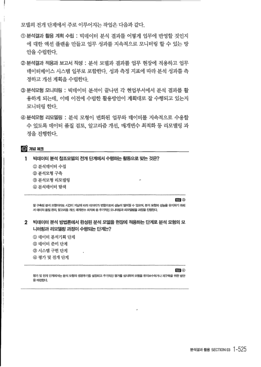
모델의 전개 단계에서 주로 이루어지는 작업은 다음과 같다．

#### ① 분석결과 활용 계획 수립 : 빅데이터 분석 결과를 어떻게 업무에 반영할 것인지
에 대한 액션 플랜을 만들고 업무 성과를 지속적으로 모니터링 할 수 있는 방 안을 수립한다． ② 분석결과 적용과 보고서 작성 : 분적 모델과 결과를 업무 현장에 적용하고 업무 데이터베이스 시스템 일부로 포함한다 . 성과측정 지표에 따라분석 성과를측 정하고 개선 계획을 수립한다． ③분석모형 모니터링 : 빅데이터 분석이 끝나면 각 현업부서에서 분석 결과를 활 용하게 되는데 , 이때 이전에 수립한 활용방안이 계획대로 잘 수행되고 있는지 모니터링 한다 .

#### ④분석모형 리모델링 : 분석 모형이 변화된 업무와 데이터를 지속적으로 수용할 
수 있도록 데이터 품질 검토 , 알고리즘 개선 , 매개변수 최적화등 리모델링 과 정을 진행한다． 1 빅데이터 분석 참조모델의 전개 단계에서 수행하는 활동으로 맞는 것은？ ① 분석데이터 수집 ② 분석모형 구축 ③ 분석모형 리모델링 ④ 분석데이터 탐색 잘 구粲l 분석 모형이라도 시간이 지남에 따라 데이터가 변함으로쩌 성능이 떨어칠 수 있으며 . 분셕 모형의 성능을 유지하기 위해 서 데이터 품질 관리 , 알고리즘 개선 . 애개변수 최적화등 주기적인 모니터링과 리모델랑을 과장을 진행한다． 2 빅데이터 분석 방법론에서 완성된 분석 모델을 현장에 적용하는 단계로 분석 모형의 모 니터링과 리모델링 과정이 수행되는 단겨는？ ① 데이터 분석기획 단계 (D 데이터 준비 단계 ③ 시스템 구현 단계 ④ 평가 및 전개 단계 펑가 및 전개 단계에서는 분석 모형의 생영주기를 설정하고 주기적인 평가를 실시하여 모항을 유자보수하거나 차l구축을 위한 방안 을 마련힌다．

> 텬레 ③
> 郞脛）
> 분석결과활용SECTION 03 1-525

분석결과 활용 계획 수립 1) 분석결과 활용 계획 수립 개요 빅데이터 분적 결과를 어떻게 업무에 반영할 것인지에 대한 액션 플랜을 만들고 업무 성과를 지속적으로 모니터링 할 수 있는 방안을 수립한다．

- 활용 계획의 경우 분석 목표를 설정할 때 함께 고려되지만 , 분석 모델과 결과가
어느정도 완성되면 구쳬화된 활용계획을 수립하고 적용한다．

- 빅데이터 분석 모델을 성공적으로 도입하더라도 지속적으로 모니터링하고 분
석결과를 현업에서 적극적으로 활용해야 하며 계획대로 잘 수행되고 있는지 모 니터 링해야 한다 .

#### · 빅데이터 관련 정보화 부서와 현업 부서 구성원의 빅데이터 분적 및 활용에 대 
한 이해를 제고하기 위해 내 · 외부 교육 훈련 방안을 수립한다．

- 분석모델을 기관 내외부에서 지속적으로 활용하고 발전시킬 수 있도록 기관간
#### 데이터 연계 , 데이터 통합 , 분적 결과 활용 내용을 포함한 확산 계획도 고려하
여 방안을 수립한다． 2) 분석결과 활용 시나리오 개발

#### 빅데이터 분석 과제를 계획하는 단계에서 활용 방안을 미리 수립하게 되며 , 전개
단계에서는 계획단계에서 수립된 활용 방안을 시나리오 수준까지 구쳬화한다．

- 과제 수행 후 분적 결과를 즉시 적용할 수 있는 단계 활용계획을 제시할 수 있
#### 어야하며 , 중장기 활용계획도수립하고상세화해야한다．
- 정류장 접근거리와 인근 거주인구를 분석하여 대중교통 이용이 
어려운 사각지대 후보지 동램（= 인근 아파트 단지 둥 기）곳 선정 → 공공운수사업개선사업위원회의 신규 노선 변경계획에 반영 1 . 마읕버스 신규노선 선정을 위한 대충교통 사각지대 분석 정류장 편의시설 확충

- 환승객이 많고 환승시간히 비교적 짧은 정류장으로 경신여고 등 
14굿 선정

2. 환숭 편의시설 섧치 위치 선정
今 정류장 편의시설《LED 장비 등） 확충

## →
- 시간대별． 요일별． 정류장별 숭하차 인원을 분석하여 
탄력배차제가 필요한 일곡 28번 등 19개 후보노선 선정 → 노선개편안에 포함하여 추진

# 3 탄력배차제 확대 적용 노선 선정 
L ___- 저상버스 도입

- 교통약자의 주거 및 유동인구와 병원 등 주 이용시섧 위치률 
분석하여 교통약자가 많이 이용하는 송졍 19번 동 16개 노선 선정 .* 저상버스 23대 확대 도입

### 0
4. 저상 버스 우선도입 노선 선정
▲ 빅데이터 결과 활용빙단 예시 1-526 PART 04 . CHAPTER 02 분석결과해석 및 활용

3) 업무 적용 및 효과 검증 빅데이터 분석 결과 활용 시 기대되는 성과를 조직 내에서 충분히 공유하여 빅데 이터 활용에 대한 분위기를 조성한다．

- 실무자들에게 분석 결과에 대한 전반적인 내용을 이해시키고 , 빅데이터 분적을
통해 도출된 결과물을 제시한다．

- 실무자는 실제 업무를 수행하는 과정에서 분적 결과를 업무에 활용한다．
#### · 조직의 빅데이터 활용 효과를 지속적으로 검증하기 위해 빅데이터 장 · 단기 활
용 계획이 우선적으로 수립되어 있어야 하며 , 활용효과 측정을 위한 성과지표 도 마련되어 있어야 한다．

#### · 분적 결과가 조직의 성과 향상을 위해 활용되는지 , 분석 결과 활용 전후로 업무
가 개선되었는지 등 빅데이터 분석 효과성을 점검한다． 근로강독업무의 효욜화 근로환경 개선

## - 
鴦：喫，∼壑－…－i… ．畔l藻 JA)f藁 ( : 2016 65%궁iiiㅌ拓i意 2018볕 50%) 0PI1% 7ICI )1% XI !}O iut + 6'4. 5t + 6% fl%, 6XI XI5Ji *% 6 IEOIA1 Wr10IE1 。)5) 。)。)I。) LfI 11Q AI。

)

- 
L크표에서제뫼하였뮴 『 뻬岬椎새놋 장기 활용계획 중기 활용계획 단기 활용계획 사업완료 후 도출된 취약지수를 근로감독 대상 사업장 선정 시 일부 적용（10%) 근로강독 대상 사업장 선정 시 적용범위 확대 (30%-50%) 모든 근로감독 대상 사업장 선정 시 활용 ▲ 분석모델 장단기 활용계획의 예（출처： 공공 빅데이터 업무적용 가이드 , 한국정보화진홍원） 1 분석결과 활용 계획 수립 시 고려하지 않아도 되는 것은？ ① 분석결과 활용 시 기대되는 성과를 조직 내에서 공유한다． ② 기관간 데이터 연계 , 데이터 통합 , 분석 결과 활용 내용을 포함한 확산 계획도 고려한다． ③ 현업 부서를 포함한 내외 · 부 교육방안을 수립한다． ④ 차기 분석 프로젝트 주제를 도출한다． 분석결과 활용계확은 해당 프로젝트의 성과를 극대화하는 방안에 장중한다． 2 빅데이터 분석 방법론의 전개 단계에서 분석결과활용 시나리오를 구체화하는 과정은？ ① 분석결과 활용 계획 수립 ② 분석결과 적용과 보고서 작성 ③분석모형 모니터링 ④분석모형 리모델링 분석결과 왔용 계획 수립 과정에서는 빅데이터 분석 결과를 어떻게 업두뻬 반영할 것인지에 대한 액션 퓰랜을 만들고 업무 성과쁠 ㅈ降적으로 모니티링 할 수 있는 방안을 수립한다 . 또한． 빅데이터 분석 과저灌 계획하는 단계에서 수립된 활용 방안을 시나리오 수 준까지 구체화힌다．

> 데이터 기반 의사결정 문화를 바
> 탕으로 명확한 목표와 전략 , 지속
> 적인 검증 및 개선 노력이 필요하
> 다．
# 。
> 擢 ④
> El
> 분석결과활용SECTION 03 1-527
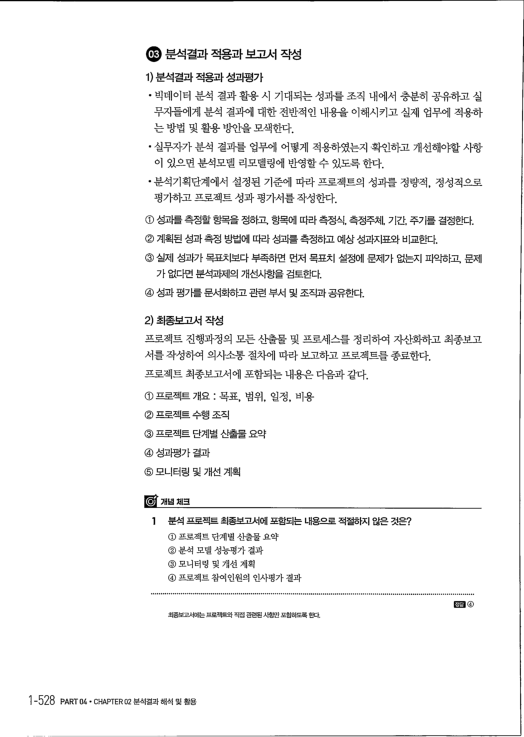
.

분석결과적용과보고서 작성 1) 분석결과 적용과 성과평가

- 빅데이터 분석 결과 활용 시 기대되는 성과를 조직 내에서 충분히 공유하고 실
무자들에게 분석 결과에 대한 전반적인 내용을 이해시키고 실제 업무에 적용하 는 방법 및 활용 방안을 모색한다．

- 실무자가 분석 결과를 업무에 어떻게 적용하였는지 .확인하고 개선해야할 사항 
이 있으면 분석모델 리모델링에 반영할 수 있도록 한다． ' 분석기획단계에서 설정된 기준에 따라 프로젝트의 성과를 정량적 , 정성적으로 평가하고 프로젝트 성과 평가서를 작성한다． ① 성과를 측정할 항목을 정하괴 항목에 따라 측정식 , 측정주체 , 기간, 주기를 결정한다， ② 계획된 성과 측정 방법에 따라 성과를 측정하고 예상 성과지표와 비교한다~ ③ 실제 성과가 목표치보다 부족하면 먼저 목표치 설정에 문제가 없는지 파악하고， 문제 가 딥〕［다면 분석과제의 개선사항을 검토한다.

④ 성과 평가를 문서화하고 괸尾크 부서 및 조직과 공유한다， 2) 최종보고서 작성 프로젝트 진행과정의 모든 산출물 및 프로세스를 정리하여 자산화하고 최종보고 서를 작성하여 의사소통 절차에 따라 보고하고 프로젝트를 종료한다． 프로젝트 최종보고서에 포함되는 내용은 다음과 같다． ①프로젝트개요 : 목표 , 범위 , 일정 , 비용 ② 프로젝트 수행 조직 ③ 프로젝트 단계별 산출물 요약 ④ 성과평가 결과 ⑤ 모니터링 및 개선 계획 1 분석 프로젝트 최종보고서에 포함되는 내용으로 적철하지 않은 것은？ ① 프로젝트 단계별 산출물 요약 ② 분석 모델 성능평가 결과 ③ 모니터링 및 개선 계획 ④ 프로젝트 참여인원의 인사평가 결과 최종보고서어는프로젝트와 직접 관련된 사항만포함하도록 한다． 1 -528 PART 04. CHAPTER 02분석결과해석및활용

> El @

2 프로젝트성과평가를위해고려해야하는사항과거리가먼 것은？ ① 성과 홍보 방안 ② 성과 측정 주쳬 ③ 성과 측정 기간 ④ 성과 측정 항목 En① 성과를 측정할 항목을 정하고 항목에 미뱝측정식 , 측정주처L 기간. 주기를 결정한다． .분석모형모니터링 1) 분석 모니터링 필요성 주변 환경과 데이터의 변화를 빅데이터 분석 모델에 지속적으로 반영히씨 위해 분석 모형을 지속적으로 모니터링하고리모델링 해야 한다．

- 빅데이터 분석이 끝나면 각 현업부서에서 분석 결과를 활용하게 되는데 , 이때
이전에 수립한 활용방안이 계획대로 잘 수행되고 있는지 모니터링 한다．

- 분적 서비스의 안정적안운영과 현행화된 데이터의 수집 , 저장 , 관리 , 분석 결
과의 활용 및 성과 공유 등을 위해 유지관리가 필요하다．

- 조직의 담당자는 과제 종료 이후 제공되는 서비스 내용을 기반으로 유지관리
쳬크리스트를 활용하여 세부 유지관리 사항을 구쳬화하여 점검한다． 2) 분석 모니터링 대상

- 빅데이터 분석은 한 번에 끝나는 프로젝트가 아니라 지속적인 모니터링과 유지
관리가 매우 중요하다．

- 조직은 모니터링 및 유지관리를 위한 목표를 수립하고 필요한 활동을 도출한
후 각 활동별 투입공수를 산정하여 유지관리 예산을 수립／집행한다． ① 분석 모니터링의 주요 대상

- 서비스 : 분석과제 발굴 , 활용방안 마련 , 성과관리 등
- 분석모델 : 분석 알고리즘주기 , 변수 , 소스（데이터 원천） 등
- 데이터 : 현 시점의 현행화 데이터 확인
② 분석 서비스 유지관리의 주요 대상

#### · 정책／제도 : 조직의 정책／제도 개발 및 적용
#### · 업무 : 쵸脯予 업무 반영 , 기존 업무 업그레이드
#### · 관련 시스템 : 관련 시스템 변경 사항 반영
- 인력 : 업무역량 , 책임과 역할 , 교육훈린 등
> 분석결과활용SECTION 03 ㅑ 29

】 분석 서비스의 안정적인 운영과 현행화된 데이터의 수집 , 저장 , 관리 , 분석 결과의 활용 및 성과 공유 등을 위해 유지관리 하는 활동은？ ① 데이터 분석기획 ② 빅데이터 모델링 ③ 모니터링 및 개선 계획 수립 ④ 분석 결과해석 주변 환경과 데이터의 변화를 빅데이터 분석 모델에 ㅈ嘴적으로 빈영하기 위해 분석 모형을 ㅈH적으로 모니터링하고 리모델링 해）가 한다． 2 분석 모니터링의 주요 대상으로 적절하지 않은 것은？ ① 분석 과제 발굴 ③ 분석알고리즘 성능 ③ 현 시점의 현행화 데이터 ④ 분석 참여 인력 분석 모니터링은 분석 목표 과제 . 성능． 데이터 등을 집중해서 관찰하며 . 정책 및 처匡 . 인력의 변화 등은 서비스 유자보수 횔동 포 함된다． α 분석모형 리모델링 1) 분석모형 리모델링 과정

- 분석 서비스 운영과정에서 지속적으로 새로운 데이터가 들어오고 정책이나 환
경이 변화함으로써 분적 모델의 성능이 떨어질 수 있으며 , 최악의 경우 전혀 다 른 결과를 생성하기도 한다．

- 분적 모형 리모델링을 위해서 데이터의 수집 , 전처리 , 분석 방법론 , 분적 결과
까지 과제 전반에 대하여 보완하거나 새롭게 추가할 사항을 정리하여 개선방안 을 도출한다．

- 도출된 개선 방안을 기반으로 리모델링을 위한 계획을 수립하고 수립된 계획에
따라 분석모델 리모델링을 수행한다． 2) 분석모형 리모델링 방법

- 분석 모형이 변화된 업무와 데이터를 지속적으로 수용할 수 있도록 다음과 같 
은 리모델링 과정을 진행한다． ① 분석 목적에 기반한 가설 및 추정방법에 대한 재검토 ② 분석용 데이터의 범위 및 품질 검토 ③ 과대적합과 과소적합 방지를 위한 알고리즘 개선 ④ 분석알고리즘과 매개 변수 최적화 ⑤ 분석 모형 융합과 재결합 ㅏ 30 PART 04. CHAPTER 02분석결과해석및활용

> U取 ③
> U④
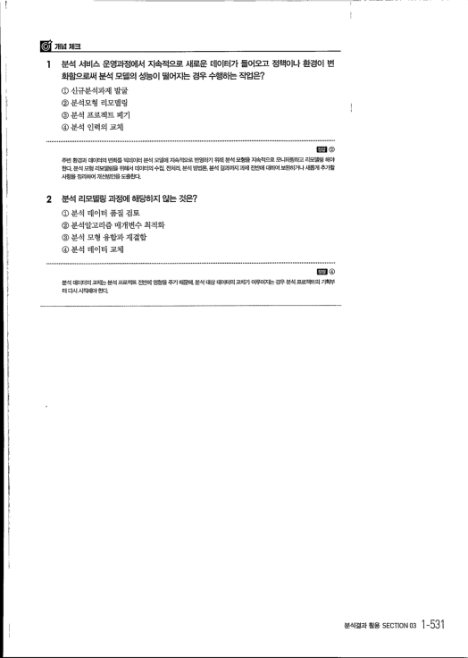
1 분석 서비스 운영과정에서 지속적으로 새로운 데이터가 들어오고 정책이나 환경이 변 화함으로쩌 분석 모델의 성능이 떨어지는 경우 수행하는 작업은？ ① 신규분석과제 발굴 ② 분석모형 리모델링 ③ 분석 프로젝트 폐기 ④ 분석 인력의 교쳬 주션1 환경과 데이터의 변화를 빅데이터 분석 모델에 ㅈ峰적으로 반영하기 위해 분석 모항을 ㅈ陰적으로 모니터링하고 리모델링 해야 한다. 분석 모형 리모델링을 위해서 데이터의 수집 . 전처리． 분석 방법론． 분석 결과까지 과제 전반에 대하여 보완하거나 사屠게 추가할 사항을 정리하여 개선방안을도출한다． 2 분석 리모델링 과정에 해당하지 않는 것은？ ① 분석 데이터 품질 검토 ② 분석알고리즘 매개변수 최적화 ③ 분석 모형 융합과 재결합 ④ 분석 데이터 교쳬 분석 데이터의 」ㅉ｛＂큐분석 프로젝트 전빈더에 영향을주기 따晨에． 분석 대상 데이터의 교페가 0際L01ㅈ는 경우분석 프로전樽의 기획부 터 다시 시작하駭갸 한다．

> El
> E距
> 분석결과활용SECTION 03 1-531
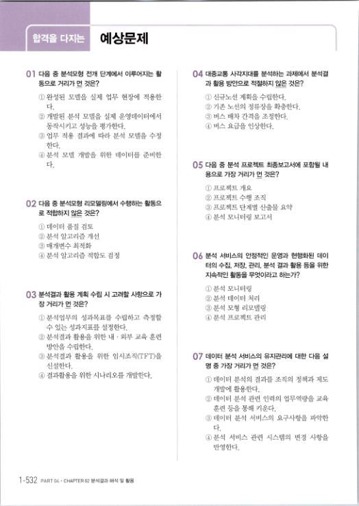
## 예상문제
04 대중교통 사각지대를 분석하는 과제에서 분석결 01 다음 중 분석모형 전개 단계에서 이루어지는 활 동으로 거리가 먼 것은？ 과 활용 방안으로 적절하지 않은 것은？ ①완성된 모델을 실제 업무 현장에 적용한 ① 신규노선 계획을 수립한다． ② 기존 노선의 정류장을 확충한다． ③ 버스 배차 간격을 조정한다． ④ 버스 요금을 인상한다． 다． ② 개발된 분석 모델을 실제 운영데이터에서 동작시키고 성능을 평가한다． ③ 업무 적용 결과에 따라 분적 모델을 수정 한다． ④분적 모델 개발을 위한 데이터를 준비한 05 다음 중 분석 프로젝트 최종보고서에 포함될 내 다． 용으로 가장 거리가 먼 것은？ ① 프로젝트 개요 ② 프로젝트 수행 조직 ③ 프로젝트 단계별 산출물 요약 ④ 분적 모니터링 보고서 02 다음 중 분석모형 리모델링에서 수행하는 활동으 로 적합하지 않은 것은？ ① 데이터 품질 검토 ② 분석 알고리즘 개선 ③ 매개변수 최적화 ④ 분적 알고리즘 적합도 검정 0c 분석 서비스의 안정적인 운영과 현행화된 데이 터의 수집 , 저장 , 관리 , 분석 결과 활용 등을 위한 지속적인 활동을 무엇이라고 하는가？ ①분석 모니터링 ②분석 데이터 처리 ③분석 모형 리모델링 ④ 분적 프로젝트 관리 03 분석결과 활용 계획 수립 시 고려할 사항으로 가 장 거리가 먼 것은？ ①분석업무의 성과목표를 수립하고 측정할 수 있는 성과지표를 설정한다． ② 분적결과 활용을 위한 내 · 외부 교육 훈련 방안을 수립한다． ③분석결과 활용을 위한 임시조직（TFT）을 07 데이터 분석 서비스의 유지관리에 대한 다음 설 명 중 가장 거리가 먼 것은？ 신설한다． ④ 결과활용을 위한 시나리오를 개발한다． ① 데이터 분석의 결과를 조직의 정책과 제도 개발에 활용한다． ② 데이터 분적 관련 인력의 업무역량을 교육 훈련 등을 통해 키운다． ③데이터 분석 서비스의 요구사항을 파악한 다． ④분석 서비스 관련 시스템의 변경 사항을 반영한다． 1-532 PART04 ' CHAPTER 02분석결과해석및활용

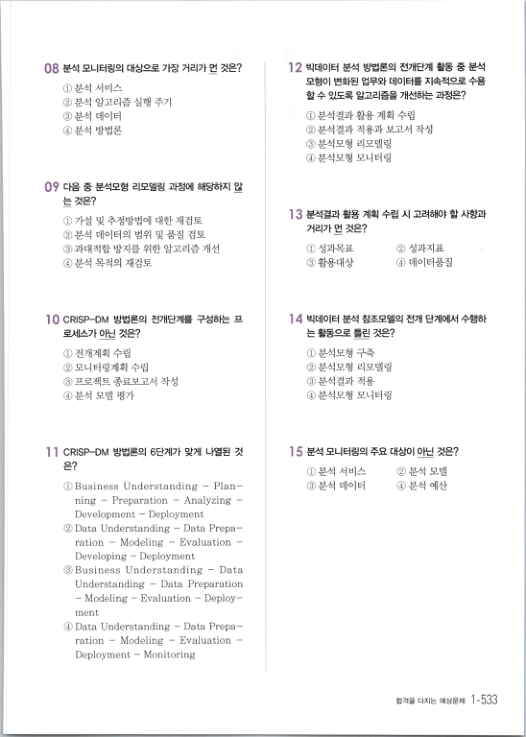
빅데이터 분석 방법론의 전개단계 활동 중 분석 08 분석 모니터링의 대상으로 가장 거리가멉 것은？ 모형이 변화된 업무와 데이터를 지속적으로 수용 ①분석 서비스 ② 분적 알고리즘 실행 주기 할 수 있도록 알고리즘을 개선하는 과정은？ ① 분적결과 활용 계획 수립 ② 분석결과 적용과 보고서 작성 ③분석 데이터 ④ 분석 방법론 ③분석모형 리모델링 ④분석모형 모니터링 0오 다음 중 분석모형 리모델링 과정에 해당하지 않 는 것은？ 13 분석결과 활용 계획 수립 시 고려해야 할 사항과 ① 가설 및 추정방법에 대한 재검토 거리가 먼 것은？ ②분적 데이터의 범위 및 품질 검토 ③ 과대적합 방지를 위한 알고리즘 개선 ①성과목표 ② 성과지표 ③활용대상 ④ 데이터품질 ④분적 목적의 재검토 14 빅데이터 분석 참조모델의 전개 단계에서 수행하 1 0 CRISP-DM 방법론의 전개단계를 구성하는 프 는 활동으로 틀린 것은？ 로세스가 아닌 것은？ ① 분석모형 구축 ②분석모형 리모델링 ③ 분석결과 적용 ④분석모형 모니터링 ① 전개계획 수립 ② 모니터링계획 수립 ③ 프로젝트 종료보고서 작성 ④ 분석 모델 평가 11 CRISP-DM 방법론의 6단계가 맞게 나열된 것 1 5 분석 모니터링의 주요 대상이 아닌 것은？ 은？ ①분적 서비스 ②분적 모델 ①Business Understanding - Plan- ning - Preparation - Analyzing - Development - Deployment ②Data Understanding - Data Prepa- ration - Modeling - Evaluation - Developing - Deployment ③Business Understanding - Data Understanding - Data Preparation Modeling - Evaluation - Deploy- ment ④Data Understanding - Data Prepa- ration - Modeling - Evaluation - Deployment - Monitoring ③분적 데이터 ④분적 예산

> 합격을다지는예상문제 ㅑ 33
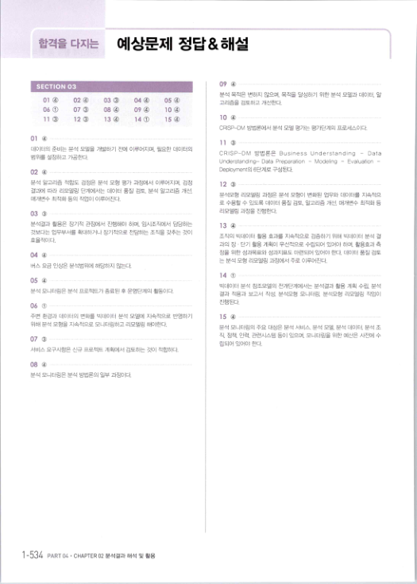
## 예상문제 정답＆해설
#### 학격읔 다지
09 ④ －………………－……－………………………………∼…－……………………… SECTION 03 분석 목적은 변하지 않으며 . 목적을 달성하기 위한 분석 모델과 데이터 , 알 고리즘을 검토하고 개선한다． 02 （軫 07 c) 12 ③ 01 ④ 03 ③ 04 ④ 05 ④ lo ④ 06 (D 08 ④ 09 ④ lO ④ …………－………………………………………………………… U ③ 13 （④ 14 ① 15 ④ CRISP-DM 방법뢴게서 분석 모델 평가는 평가단계의 프로세스이다． 01 ④ 11 ③  .

③.

③.

③ . ............................... ........................... .... ........ ............. .................................................

데이터의 준비는 분석 모델을 개발하기 전에 이루어지며． 필요한 데이터의 범위를 설정하고 가공한다． CR1 S P-D M 방법론은 Business Understanding - Data Understanding- Data Preparation - Modeling - Evaluation Deployment의 6단계로 구성된다． 02 C) ……………………… …………·……… … … … 분석 알고리즘 적합도 검장은 분석 모형 평가 과정에서 이루어지며 . 검정 결과에 따라 리모델링 단계에사는 데이터 품질 검토， 분석 알고리즘 개선． 12 ③ … 분석모형 리모델링 과정은 분석 모형이 변화된 업무와 데이터를 ㅈ旨적으 로 수용할 수 있도록 데이터 품질 검토， 알고리즘 개선． 매개변수 최적화 등 리모델링 과정을 진행한다． 매개변수 최적화 등의 작업이 이루어진다． 03 ③ 」…………∼……………… ………………… ………………………『 분석결과 활용은 장기적 관점에서 진행해야 하며． 임사조직에서 담당하는 것보다는 업무부서를 확대하거나 장기적으로 전담하는 조직을 갖추는 것이 13 ④ 」 4 ……… .

. .….…. . .

.

……… ……… 조직의 빅데이터 활용 효과를 지속적으로 검증하기 위해 빅데이터 분석 결 효율적이다． 과의 장 · 단기 활용 계획이 우선적으로 수립되어 있어야 하며 . 활용효과 측 장을 위한 성과목표와 성과지표도 마련되어 있어야 한다 . 데이터 품질 검토 는 분석 모형 리모델링 과정에서 주로 이루어진다， 04 ④ －…－………………一………∼……一……∼…………… 버스 요금 인상은 분석범위에 해당하지 않는다， 14 （力 05 ④ 빅데이터 분석 참조모델의 전개단계에서는 분석결과 활용 계획 수립 . 분석 결과 적용과 보고서 작성 , 분석모형 모니터링． 분석모형 리모델링 작업이 분석 모니터링은 분석 프로젝트가 종료된 후 운영단켸의 활동이다． 진행된다． 06 D … …… … ……－… … … 주변 환경과 데이터의 변화를 빅데이터 분석 모델에 지속적으로 반영하기 15 ④ … …… …… ……」 위해 분석 모형을 지속적으로 모니터링하고 리모델링 해야한다』 분석 모니터링의 주요 대상은 분석 서비스． 분석 모델， 분석 데이터． 분석 조 직 . 정책 . 인력． 관련시스템 등이 있으며． 모니터링을 위한 예산은 사전에 수 07 c) ………… … …………………………………………………－……∼ 립되어 있어야 한다． 서비스 요구사항은 신규 프로젝트 계획에서 검토하는 것이 적합하다． 08 ④ …… …………∼………」……∼∼……4 분석 모니터링은 분석 방법론의 일부 과정이다． 1 -534 PART 06 . CHAPTER 02 분석결과 해석 및 활용

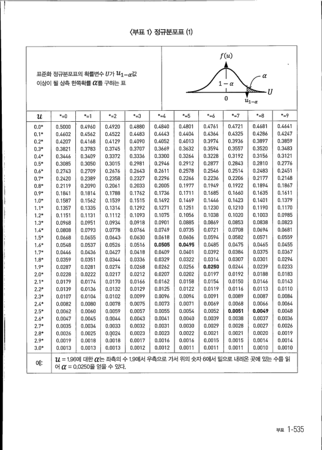
〈부표 1> 정규분포표 (1) 표준화 정규분포표의 확률변수 【／가 U1-α값 이상이 될 상측 한쪽확률 α롤 구하는 표 zz *=0 *==1 *=2 *==3 *=4 *..5 *=6 *=7 *_8 *=9

0. 4761
0. 5000
0. 4920
0. 4880 
0. 4483 
0. 4090 
0. 3707 
0. 3336 
0. 298 1 
0. 2643
0. 496〔〕 
0. 4562 
0. 4168
0. 0* 
0. 1* 
0. 2* 
0. 3*
0. 4364 
0. 3974 
0. 3594 
0. 3228 
0. 2877 
0. 2546
0. 4522 
0. 4 129 
0. 3745
0. 4602 
0. 4207 
0. 3821 
0. 3446 
0. 3085 
0. 2743 
0. 2420 
0. 21 1 9 
0. 1841 
0. 1587 
0. 1357 
0. 1151 
0. 0968 
0. 0808 
0. 0668 
0. 0548 
0. 0446 
0. 0359 
0. 0287 
0. 0228 
0. 0 179 
0. 0139 
0. 0107 
0. 0082 
0. 0062 
0. 0047 
0. 0035 
0. 0026 
0. 00 19 
0. 00 13
00000000

0. 3783
44433

0. 3409 
0. 3050 
0. 2709 
0. 2389 
0. 2090 
0. 1814 
0. 1562 
0. 1335 
0. 1131
0. 3372 
0. 30 15 
0. 2676 
0. 2358 
0. 206 1 
0. 1788
0. 4* 
0. 5*
。000

0. 6* 
0. 7* 
0. 8* 
0. 9* 
1. 0* 
1. 1* 
1. 2* 
1. 3*
8

0. 2236 
0. 1949 
0. 1685 
0. 1446 
0. 1230 
0. 1038 
0. 0869 
0. 072 1
0. 2327 
0. 2033 
0. 1762 
0. 1515 
0. 1292 
0. 1093 
0. 09 18 
0. 0764 
0. 0630 
0. 05 16 
0. 0418 
0. 0336 
0. 0268 
0. 02 12
222

0. 1539 
0. 1314 
0. 1112 
0. 0934
。00000000 40629529742087644322 .l.―

0. 095 1 
0. 0793
며 어 22560258229471544。

沁 96

0. 0778 
0. 0643. 
0. 0526 
0. 0427 
0. 0344 
0. 0274 
0. 02 17 
0. 0 170
1 . 4*

1. 5* 
1. 6* 
1 . 7*

1. 8* 
1 . 9*

2. 0* 
2. 1* 
2. 2* 
2. 3* 
2. 4* 
2. 5* 
2. 6* 
2. 7* 
2. 8* 
2. 9* 
3. 0*
409625340 1640 。691 729635 。571 1 새 18 05。9 가 62076225967355 시 3123 枋 12

0. 0594 
0. 0485 
0. 0392 
0. 03 14 
0. 0250 
0. 0 197 
0. 0 154 
0. 0119
0. 0655 
0. 0537 
0. 0436 
0. 035 1 
0. 028 1 
0. 0222 
0. 0 174 
0. 0136 
0. 0 104
0413 貶6412786677116951568535。

2216 " 5 。。。。。。。。。。。。。U 。。。。。。。。

0 .0 166

0. 0 129 
0. 0099 
0. 0075 
0. 0057 
0. 0043 
0. 0032 
0. 0023 
0. 0017 
0. 00 12
"-"-.-.-1

0. 0 132 
0. 0 102 
0. 0078
0. 009 1 
0. 0069 
0. 0052 
0. 0039 
0. 0029 
0. 002 1 
0. 00 15 
0. 0011
。。。。。。。。。。。。。U

0. 0080 
0. 0060 
0. 0045 
0. 0034 
0. 0025 
0. 00 18 
0. 00 13
0. 0059 
0. 0044 
0. 0033 
0 .0024

0. 00 18 
0. 00 13
0il:

U =1.96에 대츤ta는 좌측의 4니 .9에서 우측으로 가서 위의 숫자 6에서 밑으로 내려온 곳에 있는 수를 읽 어 α = 0.0250을 얻을 수 있다．

## f(D
> a 
1- a

> --
> 0 
Ul_α

> 4433
> 〔〕 . 4641
> 0. 4681 
0. 4286 
0. 3897
> 0. 4247 
0. 3859 
0. 3483
> 00000
> 0. 3520 
0. 3 156 
0. 28 10
> 0. 3121 
0. 2776 
0. 2451 
0. 2148 
0. 1867 
0. 1611
> 7395
〃― 85

> 0. 2483 
0. 2177 
0. 1894 
0. 1635 
0. 1401
> 〃
> 223
495

> UU0UU000U
> U. 1379 
0. 1170
> 0. 1190 
0. 1003 
0. 0838
> 3222
> 0262
쎄· 。878U52·

> 0. 0985 
0. 0823 
0. 068 1 
0. 0559 
0. 0455 
0. 0367 
0. 0294 
0. 0233 
0. 0 183 
0. 0143 
0. 0110 
0. 0084 
0. 0064 
0. 0048 
0. 0036 
0. 0026 
0. 0019 
0. 00 14 
0. 0010
> ..·.··
> 〔1 .06?4 
0. 057 1 
0. 0465 
0. 0375 
0. 030 1 
0. 0239
> 2964208754332
> 495
눼―

> ..·■··..뀁
룝

> 。U。
> 0UU。
。UU。

> 865322
> UU0U。
> 。U
> 쎄I
ㅐ―쎄I 괘I ㅐI

> 。。U
> 。24745283003026432765료
698 88I 괘．

5. ㅓI
> 0. 0188 
0. 0146 
0. 0 113 
0. 0087
> 쎄―
쎄― ㅓ― 。。。U。

> 1
> 。。U
> 0. 0066
> ......··졈
> 。U
UUUUU

> 〔긔 , 〔m4' 
0. 0037 
0. 0027 
0. 0020 
0. 0014 
0. 00 10
> 。U
UUUU。

> - ·■··
> ．ㅏ
> 부표 1-535
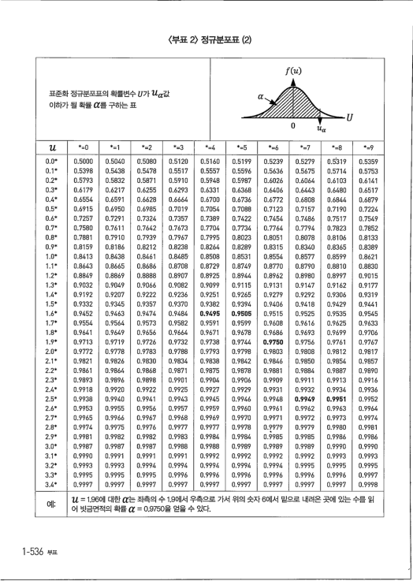
〈부표 2> 정규분포표 (2)

# 』瀟皺ㄴ，
표준화 정규분포표의 확률변수 【／가 2zα값 이하가 될 확률 α를 구하는 표 2z *＝〔〕 *=1 *.2 *..3 *=4 *=5 *굶 *7 씽8 *=9

0. 0* 
0. 1* 
0. 2* 
0. 3* 
0. 4* 
0. 5* 
0. 6* 
0. 7* 
0. 8* 
0. 9* 
1. 0* 
1. 1* 
1. 2* 
1 . 3* 1 . 4* 1 . 5*

1. 6* 
1 . 7*

1. 8* 
1 . 9*

2. 0* 
2. 1* 
2. 2* 
2. 3* 
2. 4* 
2. 5* 
2. 6* 
2. 7* 
2. 8*
0. 5040 
0. 5438 
0. 5832
015080

0. 5478 
0. 5871 
0. 6255 
0. 6628 
0. 6985 
0. 7324 
0. 7642 
0. 7939 
0. 8212 
0. 846 1 
0. 8686 
0. 8888 
0. 9066 
0. 9222 
0. 9357
0. 5120
0. 5160 
0. 5557 
0. 5948 
0. 633 1 
0. 6700 
0. 7054 
0. 7389 
0. 7704 
0. 7995 
0. 8264 
0. 8508 
0. 8729 
0. 8925 
0. 9099 
0. 9251 
0. 9382 
0. 9495
0. 5199 
0. 5596 
0. 5987 
0. 6368 
0. 6736 
0. 7088 
0. 7422 
0. 7734 
0. 8023 
0. 8289 
0. 8531
0. 5239 
0. 5636 
0. 6026
0. 55 17 
0. 5910 
0. 6293 
0. 6664 
0. 70 19 
0. 7357 
0. 7673 
0. 7967 
0. 8238 
0. 8485' 
0. 8708 
0. 8907 
0. 9082 
0. 9236 
0. 9370 
0. 9484 
0. 9582
0. 62 17 
0. 659 1 
0. 6950 
0. 729 1 
0. 7611 
0. 79 10 
0. 8 186 
0. 8438 
0. 8665 
0. 8869 
0. 9049 
0. 9207 
0. 9345
0. 6406 
0. 6772 
0. 7123 
0. 7454 
0. 7764 
0. 8051 
0. 83 15 
0. 8554 
0. 8770
0. 8749 
0. 8944 
0. 9115 
0. 9265 
0. 9394
0. 8962 
0. 9131 
0. 9279
0. 94〔〕6 
0. 95 15 
0. 9608 
0. 9686 
0. 9750 
0. 9803 
0. 9846 
0. 988 1 
0. 9909 
0. 993 1 
0. 9948 
0. 996 1 
0. 997 1 
0. 9979 
0. 9985
989379 54155780815913 43493292325254 411372216193 657481 90939597 〔〕 . 9463 〔〕 . 9474

0. 9573 
0. 9656 
0. 9726 
0. 9783 
0. 9830 
0. 9868 
0. 9898 
0. 9922 
0. 9오41 
0. 9956 
0. 9967 
0. 9976 
0. 9982 
0. 9987 
0. 999 1 
0. 99?4 
0. 9995 
0. 9997
〔｀ . 9505

0. 9599 
0. 9678 
0. 9744 
0. 9798 
0. 9842 
0. 9878 
0. 9906 
0. 9929
38 5053576165697275 9394959697979898 98999999 艸 99999999999999 〔〕 . 9564 〔〕 . 9591

0. 967 1 
0. 9738 
0. 9793 
0. 9838 
0. 9875 
0. 9904 
0. 9927 
0. 9945 
0. 9959 
0. 9969 
0. 9977 
0. 9984 
0. 9988 
0. 9992 
0. 9994 
0. 9996 
0. 9997
메 炤 78818486889。

이 貂 邵 〔〕 . 964?

0. 9719 
0. 9778 
0. 9826 
0. 9864 
0. 9896 
0. 9920 
0. 9940 
0. 9955 
0. 9966 
0. 9975 
0. 9982 
0. 9987 
0. 999 1
〔〕 . ?664

0. 9732 
0. 9788 
0. 9834 
0. 987 1 
0. 990 1 
0. 9925 
0. 9943 
0. 9957 
0. 9968 
0. 9977 
0. 9983 
0. 9988 
0. 999 1
〔〕 . 오946

0. 9960 
0. 9970 
0. 9978
0. 9984 
0. 9989 
0. 9992 
0. 9?94
2. 9* 
3. 0* 
3. 1* 
3. 2* 
3 .3* 〔〕 . 9989

0. 9992
〔〕 . 9993

0. 9995
〔〕 . 9994 〔〕 . 9?94 〔〕 . 9?96

0. 9997
〔〕 . 99?6

0. 9997
〔〕 . 9?96

0. 9997
3．샨 〔〕 . 9997 예： U =1.96에 대한 α는 좌측의 수 1.9에서 우촉으로 가서 위의 숫자 6에서 밑으로 내려온 곳에 있는 수를 읽 어 빗금면적의 확률 α = 0.9750을 얻을 수 있다． 1-536 부표

> f (u)
> 0 
7￡α

> 0. 5279 
0. 5675 
0. 6064
> 0. 5319 
0. 5714 
0. 6 103
> 〔〕 . 6443 
0. 6808 
0. 7157 
0. 7486 
0. 7794 
0. 8078 
0. 8340 
0. 8577 
0. 8790 
0. 8980 
0. 9147 
0. 9292 
0. 9418 
0. 9525
> 0. 6480
> 108631852851
> 〔〕 . 6844 
0. 7190 
0. 75 17 
0. 7823 
0. 8106 
0. 8365 
0. 8599 
0. 88 10
> '··...
> '
> '믐
> 9
> JI7949239
1,

> 0. 8997
> 〔〕 . 9162 
0. 9306 
0. 9429 
0. 9535 
0. 9625
> 37
> 3
> 9750
1,536777。

> 〔〕 . 오616
> 455
328354271 "-7 ㅒI46U34' 괘· 95，

> 899
。／。／。／

> 567
> 〔〕 . 9693 
0. 9756 
0. 9808 
0. 9850 
0. 9884 
0. 9911 
0. 9932 
0. 994, 
0. 9962 
0. 9972 
0. 9979 
0. 9985 
0. 9989
> 〔〕 . ?699 
0. 976 1 
0. 9812
> 9999999999998887765끅／
> - '
> 999999999999999999999998888
> 0. 9854 
0. 9887 
0. 9913 
0. 9934 
0. 9951 
0. 9?6;3 
0. 9973 
0. 9980 
0. 9986
> 。0UUUUUU00000000UUU
> ㅒI6U3578
> 솥,,·.·*··,··.
'

> ㅓ료
^d

> 8
> UUUUUU。
> d^
> - .*...·。..
> 。U。
> 。。。。U。
> 0. 9990
> 44266
> 〔〕 . 99오2
> 0. 9993 
0. 9995 
0. 9996
> 〔〕 . 9995
> 〔〕 . 오9오6
> 〔〕 . 99오7
> 0. 9997
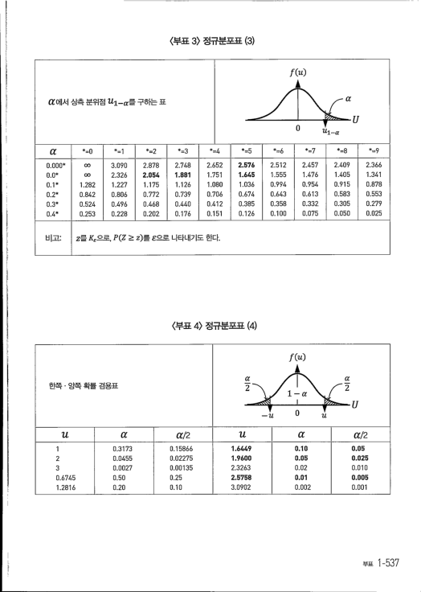
〈부표 3> 정규분포표 (3)

# f (u) 
l44IlI,;, a, 0 1」．1－α α에서 상측 분위점 1z1－α를 구하는 표

### a 
*=0 *=1 *=2 *=3 *_4 *5 *-6 *=7 *=8 *=9 m m

2. 748 
1. 881 
1. 126
2. 512 
1. 555 
0. 994 
0. 643 
0. 358
2. 652 
1. 75 1 
1. 080 
0. 706 
0. 412
2. 878 
2. 054 
1. 175
0. 000* 
0. 0* 
0. 1* 
0. 2* 
0. 3* 
0. 4*
3. 090 
2. 326 
1. 227 
0. 806 
0. 496 
0. 228
b6 743

- ·
1. 282 
0. 842 
0. 524
■..* 2I1。

063 "- 656456

0. 739 
0. 440 
0. 176
0. 772 
0. 468
782 。。

0. 100
0. 151
0. 202,
0. 253
비고： z를 KE으로 , P(z ）를 ￡으로 나타내기도 한다． 〈부표 4> 정규분포표 (4) a a 한쪽 · 양쪽 확률 겸용표

#### 2 
1－α 2 1- a -漱瞭 沅∼ 【／ －끄 0 끄

### tL 
a cc12 zI a cc/2

1. 644, 
1. 9600 
2. 3263 
2. 5758 
3. 0902
0. 3173 
0. 0455 
0. 0027 
0. 50
0. 15866 
0. 02275 
0. 00 135
1 2 3

0. 25 
0. 10
0. 6745 
1. 2816
0. 20
> 2. 409 
1. 405
> 2. 366 
l .341

0. 878 
0. 553 
0. 279 
0. 025
> 2. 457 
1. 476 
0. 954 
0. 61;3 
0. 332, 
0. 075
> 0. 915
> 0. 583 
0. 305 
0. 050
> f (u)
> 0. 05 
0. 025 
0. 0 10 
0. 005
> 0. 10 
0. 05 
0. 02 
0. 01
> 0. 002
> 0. 001
> 부표 1-537
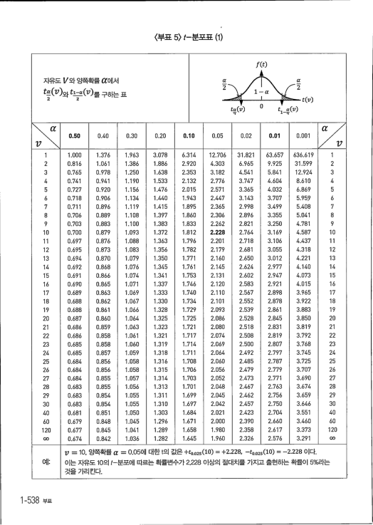
〈부표 5> t－분포표 (1) a a 자유도 '／와 양쪽확률 α에서 2 1－α 2 1- a

### 雩(v）와ti-c(V）를구ㅎ階표
-,，礪 '- - t(v)

# 옇（D 
0 t1_뜩(v) 섯，

# 0.50 
0.40 0.30 0.20 0.10 0.05 0.02 0.01 0.001 2:

刪

1. 886 
1. 638 
1. 533 
1. 476 
1. 440 
1. 4 15 
1. 397 
1. 383 
1. 372 
1. 363
2. 920 
2. 353 
2. 132 
2. 015 
1 . 943

1. 895 
1. 860 
1. 833
1. 386 
1. 250 
1. 190 
1 . 156 1 . 134 1 . 1 1오

1. 108 
1. 100 
1 .09;3

1. 088 
1. 083 
1. 079 
1. 076 
1. 074 
1. 071 
1. 069 
1. 067 
1. 066 
1 .064

1. 063 
1. 061 
1. 060 
1. 059 
1. 058 
1. 058 
1. 057 
1. 056 
1. 055 
1. 055 
1. 050 
1. 045 
1. 04 1
821 965541747365 143 998 ,.,0000UUUUU 쎄― 8 ,.· 륭,· 를..

76742U988777 UUUUUUUUUU00000。

0괘― 624' 쎄I 쎄― 00 8 ^d 。UU 쎄I

1. 356 
1. 350 
1. 345 
1. 34 1 
1. 337 
1. 333 
1. 330 
1. 328 
1. 325 
1. 323 
1. 32 1 
1. 319 
1. 318 
1. 316 
1. 315 
1. 3 14 
1. 313 
1. 311 
1. 310 
1. 303 
1. 296 
1. 289
1. 782 
1. 771 
1. 761 
1. 753 
1. 746 
1. 740 
1. 734 
1. 729 
1. 725 
1. 72 1 
1. 7 17 
1 .714

1. 711 
1. 708 
1. 706
303182776571447365306262228201 179 160 145 131 120

124. 
087777777766666666666666666 0U0U000。

3. 2. 2. 2. 2. 2. z2.z
6 괘l 06693963U86532 4455667889 06571 쎄요 6 075 2슥＇ ^-09887 3334445566 4791 ㄲ以 蠟&&& z z z

- ·.■····..·..
12。

1 11。

1。1 。

93 。

86 。

8。

。。。UUUU。

솥**.· 198765432 10。291817161514131211 2122232425262728293。

4。

6。

z z z 099999988888888888888 7666666655555555 444555 UUUUUUU。

*.·.··...* 8968217647186816506246025835675525395285185。

z2z2 。U "I Lt 。74。

69 。

64 。

6。

..·..■ 。58 "I。

。56。

52 。

48 。

45 。

42 。

21

1. 70 1
■·■...·····., 3U99998888888888888888888888888888

1. 697 
1 . 684

1. 671
UUUU。

UU。

324娜264764374974584294。

刪 6666666 8777 ■.·■.....졈 .■ 2581 UU。

刪刪刪 358326 1 . 645 여， V =10 , 양쪽확률 α = 0.05에 대한 t의 값은 +t。

.。25(10) = +2.228, -t。

．。25(10) = -2.228 이다． 이는 자유도 10의 t－분포에 따르는 확률변수가 2.228 이상의 절대치를 가지고 출현하는 확률이 5％라는 것을 가리킨다． ㅑ 3〕 부표

> f (t)
> 636 . 61오
> 棚
925

> 12. 924 
8. 610 
6 .86?

> 841
> 604032707
> 5. 04 1 
4. 781 
4. 587 
4. 437 
4. 3 18 
4. 221 
4. 140 
4. 073 
4. 015
> 499355250
169 106

> 5. 
> 4. 4.
3. 3. 3. 3. 3. 3. 3. 
> 639. 
> 3. 2. 2. 2. 2. 2. 
> :3 . 965 
3. 922 
3. 883 
3. 850 
3. 819 
3. 792 
3. 768 
3. 745 
3. 725 
3. 707 
3. 690 
3. 674 
3. 659 
3. 646 
3. 55 1 
3. 460 
3. 373
> 12。
> 1
> 2. z
> 198765432
10。291817161514131211 2122232425262728293。

4。

6。

> 0550129779479218988788618458318198。
> 779777877977
> 。576573671
7。

> 664
。

> 617576
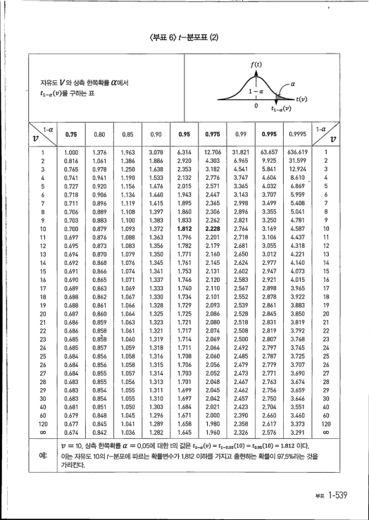
〈부표 6> /－분포표 (2) 자유도 L／와 상측 한쪽확률 α에서

# a 
1- a 恥∼ t(17) 0 t1－α（미 b< 0.75 0.80 0.85 0.90 0.95 0.975 0.99 0.995 0.9995 2< t1－α（17）를 구하는 표 1` 刪 303 182 821

1. 886 
1. 638 
1. 533 
1 . 476

1. 440 
1. 4 15 
1. 397 
1. 383 
1. 372 
1. 363 
1. 356 
1. 350 
1. 345 
1. 34 1 
1. 337 
1. 333 
1. 330 
1. 328 
1. 325 
1. 323 
1. 32 1 
1. 319 
1. 3 18 
1. 316 
1. 315
2. 920 
2. 353 
2. 132 
2. 015 
1. 943 
1 . 畔5

1. 860 
1. 833 
1. 812 
1 .7오6

1. 782 
1. 77 1 
1. 761 
1. 753 
1. 746 
1. 740 
1. 734 
1. 729 
1. 725 
1. 72 1
0. 816 
0. 765 
0. 741 
0. 727 
0. 718 
0. 711 
0. 706 
0. 703 
0. 700 
0. 697 
0. 695 
0. 694 
0. 692
.,..

965541747 365 143 35 1,ㅒ―괘― 000 932 3 34679 4693830 7765714473653062622282。

1 179 00000。

。ㅎ 。。

16。

145 131 344555555556666666777788900 6859 76742098877776 `555555555444 000000UU00UUUUUUUUU。

。U。

9988968217647186816506246。

〔〕 . 691

0. 690 
0. 689 
0. 688 
0. 688 
0. 687
괘료 〃l 〃l

124. 3. 2. 2. 2. 2. z
2. 
。UUUUU。

체I 〃l852 괘― 06693963086532 ㅓ― 쎄l。

6UU6498 .-

316. 4.3.3.3.2.2.2.2.2.2.2.2.2.2.2.2.2.2.2.2.2.2.2.2,2.2.2.2.2.2.2.2.
653852 12。

11。

0刪 93

2. 2. 2. 2. 2. 2. 2. 2. 2. 2. 2. 2. 2. 2. 2. 2. 2. 2. 2. 2. 2. 2. 
.·,........·......·*.·.··.··., 1 。。

198765432 10。291817161514131211 2122232425262728293。

4。

6。

12。

괘― "l ㅐ―괘요 ㅓ료 〃료 ㅓ료 ㅓ―"l ㅓ―4l1 Jl 괘， ,4l 괘― ㅒ―쎄― ,l ㅓl 쎄l 괘· ．쎄I 쎄I ^-괘I ㅒ―,-JI ㅓl ^I

1. "I
쎄I

2. 1. 1. 
68I 4455667889。

3099998888888888888888888888888888 .- 。58158259352557

0. 686 
0. 685 
0. 685 
0. 684 
0. 684 
0. 684 
0. 683
9887655。

5ㅓI6 66666655

1. 711 
1. 708 
1. 706 
1. 703 
1. 701
。58 84294。

。。。。。。。。。。。。。

1 . ;314

1. 3 13 
1. 3 11 
1. 310 
1. 303 
1. 296 
1. 289
086080074069064060056。

52 。

48 。

45 。

42 。

21

0. 683 
0. 68 1 
0. 679 
0. 677
1 . 684

1. 67 1
。

。。

98。

96。

1 . 645 623853093324娜264娜3749745 V =10 , 상측 한쪽확률 α = 0.05에 대한 t의 값은 ti_a(V) = t1..。

．。瑤(10) = t。

．95(10) = 1.812 이다． 예 이는 자유도 10의 /－분포에 따르는 확률변수가 1.812 이하를 가지고 출현하는 확률이 97.5％라는 것을 가리킨다．

> f (t)
> 糊
> 3 1.599 
12. 924 
8. 6 10 
6 .86?

5. 959 
5. 408 
5. 04 1 
4. 781 
4. 587 
4. 437 
4. 3 18 
4. 221 
4. 140 
4. 073 
4. 015 
3. 965 
3. 922 
3. 883 
3. 850 
3. 819 
3. 792 
3. 768 
3. 745 
3. 725 
3. 707 
3. 690
> 925841604032707
> 499355250
169 106

> 198765
10

> 055012977947921
> 212223242526272829
> 639. 5. 4. 4. 3. 3. 毓
&&&&&z zz zz zZzzzzzZz

> 1
> 12。
C。

> 432
> 3。
4。

> 。291817161514131211
> 8988788618458318198。
> 6。
> 779777877977
> 3. 646
3. 55 1
3. 46。
3. 373
> 。576573671
7。

> 664
。

> 枏576
> 부표 1-539
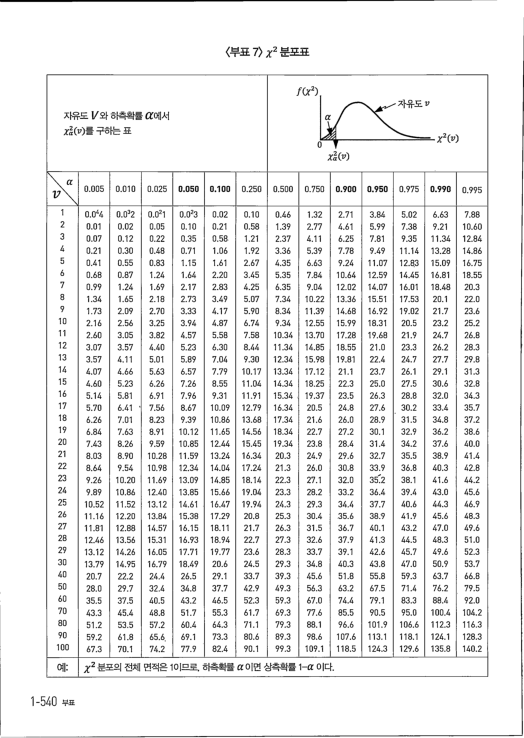
〈부표 7> x2 분포표

# 綴（v）를 구하는 표 
'"’壓즈끄x20) 자유도 L／와 하쭤률 α에서

# x (v) 
×

0. 005 
0. 0 10 
0. 025 
0. 050 
0. 100 
0. 250 
0. 500 
0. 750 
0. 900 
0. 950 
0. 975 
0. 990 
0. 995
祉0.0:

0. 1:
0. 33
0. 53
0. 8:
1. 21
04

0. 01
0. 07
0. 21
0. 41
0. 68
0. 99
1. 34
1. 73
2. 16
2. 60
3. 07
3. 57
4. 07
4. 60
5. 14
5. 70
6. 26
6. 84
7. 43
8. 。3
8. 64
9. 26
9. 89
1。

0. 05
0. 22
0. 48
0. 83
1. 24
1. 69
2. 18
2. 70
3. 25
3. 82
4. 40
5. 01
5. 63
6. 26
6. 91
7. 56
8. 23
8. 91
9. 59
1。

0. 10
0. 35
0. 71
1. 15
1. 64
2. 17
2. 73
3. 33
3. 94
4. 57
5. 23
5. 89
6. 57
7. 26
7. 96
8. 67
9. 39
10. 12
1。

1. 61
2. .20
.3501

3. 5W
4. 1'
4. .56
.528'

6. 4'
7. 0'
7. .86
.8293

9. 5
1。.2 1。.8

11. 5
12. 2
12. 8
13. 5
14. 2
14. 922.:
29. :
37. 3
45. 53. 3
61. 1
7。.' 局.

.0 .3 .6 .9 .2 .58 .13131313333 .3 .3 .3 .3.3.3 .3 .3 .3 8191 ID

9. 
,65 34(3:

33 44444444444

0. .02
.15 .10 .26 .22 .38 .44 .41 .58 .65 鹹7..3:.7:.7:.7:.7:.7:.7:.7:.7::

.7。

.87 .953 212223 .76 。I91 Ii 昭'.7 加 "珊

82. 凡
冊 끼 )3.:

있ㄷ

3. 軾:
덞 ㄴH ＂… U.1 괴 〃．ㄴU αI.

z3.

3. 7.).I.
3z 히7.8.

44268985I 3 ,0 3, 2057 4 5?,57 4525079。

7458 3

9. 
.41嘲:

1 I 5.

16. 1
12. 1
2754 5 8 1 매2.

.2心:

327 口9344 及39557。

3578127537567 3 90 。3687654321 616 .79 .68 .56 .45 .

.

.04 .

.

17. :
18. '
I8.

).

.

1. .171 
0. 0. 1. 1. 2. 3. 4.
5. 5. 6. 7. 8. 9. D
(819192 2(:2' 2213:

4:

5:

6'7, 89( 1 44 ㅉ3.6 輛3.7 9267 1 3582。

4 8,2。

4 ,79 1 니 )2 꺽86 "0397780495 n。98665 "ㅉ嶼3556 驟 79 "74 "6 ㅓ7.

335 34 M .

`2.

α7.7.3.

3. 9
以2.

7. 
1 1

0. 1. 2. 3.
4. 5.6.7.
8. 
z4.

6. 7. 9. m
121314I51718192 :2' 2:

222:

212 3:3( 3:

3i3133:

34( 5(.

6:

78' I0Il121314I516171819232 :22' 212122:

212 34'67 98( 51 8 5

19. 。2:.29.
37. 鹹
55. 64. 73. 
14 .04 24 94 34 17 .73 r 1 阻 m

13. 
91 7 ㅓ3680 3 82 4 I0Ii121314I51718192 2(:2' 2:

2'22:

212 3(, 3:

丁 34' 156:

7:

2L .

4. 5. 6. 7.
11. 59
12. 34
13. 。9
13. 85
14. 61
15. 38
16. 15
16. 93
17. 71
18. 49
26. 
(1 口121314I516 (7 198765432 10 。291817161514131211 ).7,1 앗 ' 忽 .5聊:

1 2425262728293。

4。

5。

6。

7。

8。

,97,5 4 .71 하:

외).l 기3.

r3.1 1。

3. :
1. .31
7121 3

11. 69
12. 4。
13. 12
13. 84
14. 57
15. 31
16. 。5
16. 79
24. 
2 9。

1。。

4。

62。

8665

11. 16
11. 81
12. 46
13. 12
13. 79
2。

.234 .435 .348

28. .53。
。44

48. 
.152 .345 .758 。67 .1532

59. 
.562

69. 1
77. 9
.7623

74. 2
예： /2 분포의 전체 면적은 1이므로 , 하측확률 α이면 상측확률 1-α 이다． 1-540 부표

> 5. 0:
7. 
> 31
9. 33
> 31. 1
> 12. 
> 14. 4
> 16. 0
> 17. 5
> 19. 
> 020. 1
21. 23. :
24. :
26. '
27. 1
28. 1
30. :
31. 1
32. 34. :
35. 1
36. 1
38. '
39. 
> 543ㅑ
5 n32

> 06
ㅓ6

> 391759
ㅁ5

> .51.9
.13

> 3785。
.2..3 .32

> B
727271 。6396284061

> 刃
> 8503436755530628383837
> 3
> 1
> 16. 1
18. 
> 021
.

21. 23. 24. 26. 27. 29. 30. 32. 33. 34. 36. 37. 38. 4。
.41.

43. 44. 45. 47. 48. 49. 皿
63. 76. 鰍
> 7. 8
I 0.

12. 3
14. 3
16. :
18. 1
20. 22. 23. 25. 26. 28. 29. 31. 32. 34. 35. 37. 38. 4。
.41.

42. 44. 45. 46. 48. 49. 51. 52. 53. 66. 79. 92. 1。4
ㅃ128 14。

> 3. .58
.79 .984

11. 3
12. 1
M15.1 I6.

18. :
I 9.

21. 22. 23. 25. 26. 27. 28. 30. 31. 32. 33. 35. 36. 37. 38. 4。.41.
42. 43. 55. 67. 79. 9。.
1。1 113 124 2 8

> 5B2
5 9258 14 ,92570 343

> 49
> 96307408513271
97429741 588631

> 6. .962
ii.:

13. :
I 5.3

> 59
3 7

> IOU
112 124 135

> 36U369724.
.4

> .3
.18

> 314
> "31
> 4。
> 43. :
44. 1
45. :
47. (
59. :
71. 
> 83. :
95. 。3
6. 118. 129. 
( J C,) s C ( s s J s ( OS 0 C) J s J C() Cs) s s 9 s J0) J J) 0 C) 0 Os J J J Cs) ( s b J J 0 J s J J 0 Js J U J 0J p J 9 J s J 0s J J0 s 0 J 0Cs) J s Cs) as Cs)J s J s 0 s J ss s J J

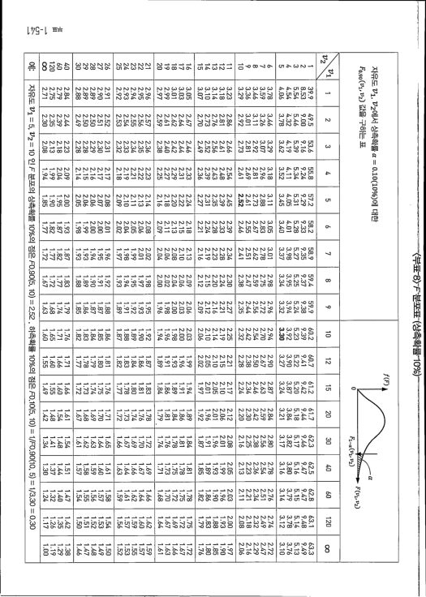
요 쀼 0 난. o- ', . ，」 '- `

- 
` '

- 
- 
∼ --

- 
넋 口 짊 싱 N→ '→-。

01 4 '. (`) Ni - 닙 닉그 m '- 0-.

01 4: '- () NJ - 出 驢 →。-.

→".l →m NS-i (B N 'Si N SO NSO (B NJ.

0) "O Cs) Cs) Cs) Cs) Cs) NJ N.) () () Cs) .

흽 ■ .

.

'0 '0 (B (B (B '-1 '0 - C.) 01 Cs)

- 。
' NJ NJ NJ NJ NJ

- ■ 
■

- . 
-0 -0 '0 -.0 '0 NJ (J .P' 010 '

- . 
.

- - c. 뺘」 －」 
－ㅗ 『，〕 '-i (B .r5- ．Q 밍 P→→ N '0NJ 枋 Cs) ．。' NJ N.) NJ NJ NJ .

.

.

■ .

*,01010101 ,. c그 ㄷ그 －』 NJ NJ N-i NJ N) NJ .

■ ■

- ■ 
01 01 01 01 01 Cs) 4겸｀ 010' '-) NJ NJ.s) '。

N0'- NJ NC-ii。

NJ NJ NJ NJ NJ .

' .

.

.

'5) -1 -』 0) 0) (B Cs) 0 ' -'0 ' N0' '5) NJ.Cs) Cii N， 따NJ N 。

' N (B N． 님 N0s01 N (BNJ N-。

P NJ '。

NJ· '0NJ ，→OS N (B。

) NJ NJ NJ NJ C-) ■ .

.

.

.

NJ NJ Ni Cs) C.) . 山 ,. cD －놉 NC .B() P0 JN' 山 P→ 。) NJ.

-.0。' N (B。

N (B ..'-0 。

N→-。

NC.) 0 ．11 。) ,NJ 尸 山0 JN1 拓 N(B NJ NJ NJ NJ NJ NJ .

- * 
- . 
*,010'. 'i -』 NJNJ (B NJ.

NJ-J N→ 。' NJ NJ C-,) NJ NJ

- - - . 
* 
NJ Cs) Cs) C.) is-.

｀』-'01 '001 P → → NciiN) 입 N-i -o·NJ '。

PS' CB( -TI →N) → N→ (B N (B-。

NJ NJ NJ NJ NJ .

- . 
.

.

(B (B (B (B (B 010' 0' -5) 0) Cs)

- is
-' (B 녜 →．' 。01 →'0 (B →.0) 。1 눋」 ．ㅗNJ Ni NJ .

■ ■

- ■ 
'0 '0 (B (B (B 0) -o (B (B -' N 딤 N． 무 NJ NJ Ni NJ NJ .

졈 .

.

.

NJ NJ NJ C,) Cs) -' is' 0) Cs) '0 NJ·01 (B NJ is- 。' ' NJ NJ NJ NJ NJ .

- - ■ 
.

P(B (B ■■ㅗ ■■」

- ■ㅗ 
→ N0 '- S-i

- - . 
.

-q 0) 0) -.0 55) NJ `  - `I ` Cs) ㄷ그 －」 －』 －」 -5 `o 눋」 《p 《．11 m * N． →'。

N。'.

SN -。i ) -'- '- 'NJ NJ

* 
.

- * 
' "0 '-O '0  (B (B '-.10) '0 - ' NJ J1III11 's1 Cs)

- '0。
) 山． 山-J 덟 '11 ■

* 
.

'

- '0 '0- 0- 0 -.0 
Cs) Cs) is' 01 0' ．·띰 .．咫 →．-.1 S-i →．NJ

- . 
'

* 
' ｀닉. `.'0 'O 'O Cs) is' 01 '-.10) N (B'。

N '0。

) N- 。11 N0Os1 Ni.S_i 미 '0.is' "0Cs) 이． NJ (B Cs) is' m .－ㅗ '－ㅗ ㅑ → Cs) 21C프J 쵱 졈

- ■ 
0'- '-1 ·， i 0) -1 NJ - C.) ■ .

- . 
- 0) 0) '0- 0- 0 
0) '0  (B -'  NJ NNJ.

1:-.

10Hi탭 H∥01 ． 一늙ㅇ

- 0ㅇ
ㅇ○．이∼ →＂ ＼縕ㅇ 닝．ㅇ∥ "C우 1。

必r i。

겨ㅇ ～CD。

。1

- 
JlMIIIC鮮J2必ri。

거ㅇ 1-Il N탭 닙C。

놀1 一C∥ 一C→ ∥.N 01N) .oh' ii ' 臘01iH' JI II -'- 'NJI 'iNJ

* 
- 솔 
.

.

'0 'O (B (B (B 0'- 0) (B C.) 0 ' NJ NJ NJ NJ NJ

- . 
- * 
- (B - '-'NJNJ 
'O N) 0 '- ' -.1

>:h
N '0。

'- N- JN1 N010S ■■」 ■■ㅗ ■■」 → NJ.

C') (TI

- . 
.

.

.

c. m0) 010' , J '-.1 0) .

' ■

- * 
0) '0 '0 , 0 'O '0- ' NJ C.) 01

- - * 
- 0 ' 0 "5) - 
(p 山 *' `c -' -'- 'NJ NJ .

.

* 
.

- ｀딩. ｀녹. ｀닉. cD ㅇ 
is-' 0 ' 0) (B Cs) NNJ (B N→'。

ㅑ ㅑ *－ㅗ →

* 
.

- . 
- . α》 m m m 
NJ Cs) is- 01 0'

- - ■ 
.

- 0) 0) 0) 'O 'O 
'5) 0) '0  (B NJ .

* 
- - 0- 0' 
S-i '-i (B 01- ' 0 ' N '0is' N01is' NJ Ni NJ NJ NJ .

쵱

- . 
- NJ Cs) CBO' 
0 0) 0) C) -1 (B 鱗 NJ NJ NJ NJ NJ

- . 
.

.

.

(B (B -'- 'NJ NJ Cii (B 01-' ．·a ■■J ■■」 →

- ■ 
.

- . 
0) '0 '0- ' Cs) 0"0 .

.

.

뀁 010' 0 '- - 01 (B 0'- ' .

.

- . 
- 닉 시 ,q m m 
｀』0) '0 (B -'

- . 
.

.

* 
0) 0) 0) 0) 0) NJ Cs) is' 0-"- ) -'NJ NJ NJ NJ

- . 
.

* 
- 'O (B (B -'  -'
,q- '01 (B -그 Cs) 눕－흩 눕．J ■·ㅗ → 큉 .

.

흼 .

｀』 ｀』 山 m m -i 0) (B -'  Cs) .

- . 
- - 0) 0) 0) -O '0
is- a ' '-0- ' is-' .

- - . 
* 
'-i -5) --) -J - NJ Cs) is' 010- .

졈 .

- is-. 01 0' 
0' '0 01 (B 0 ' NCs) is' NJ.15-' → 미 →．'。

→．。) →-' NJ NJ NJ .*a

- ㅂ」 
- ．」 
→ ..-1 ∼닝 N01 '。

→·-J → 5 ] 。) →．- 。1- 꼴- si1' →．Cs) ..NJ .

.

- . 
청 -.10) 0) 0) 0) '0 - ' is-. 0 '- 'O ,

- . 
.

- `. '0 C9 C그 . 
NJ 0- '-' 0- NJ .

.

■

- is' is- 010' 
r,. m *-. - 솥 o 염 -'- '- 'NJ NJ .

.

.

■

- 0) '0 '0 (B (B
` -'0 '- ' (is ．」 → ㅑ .

N0 。1 '.

- . 
.

- ' 
,,J ，그 ｀』 m m is- C' 0) -' is-.

- . 
.

.

Cs) is-. is- Cl *-' → c. is-' .

- 흽 
.

- 0 '- 0 ' 0 ' c'` 0 ' 
－」NJ C,) is- Cl

- - . 
■ .

0 ' 0 ' 0 ' -1 '-1 0 ' S-iSO (B NJ 。JNN)。

1 -' -'- '- 'Ni

- - . 
■

- 0) 0) 'O '0  (B
01 'O Cs) '0 01 NCsil'

- '。
- . 
.

* 
'

- 
'-.1 si ,.i 0) -' Cs) 010) .

■ ■ .

.

01 01 010' 0 ' `，』0) '0  (B - ' →·山 '.1 →·(B →·Cl →·S-i ..is-, 눋』 ·－』-' -' NJ

- - 룁 
.

.

0) 0) '0 '0  (B NJ 0'- (B C' Cs) N -S01 .

‘닒」 → → .

.

■ .

.

0 '- -) S-i - -.i 0) (B NJ 010)

* 
- - ■ 
NJ Cs) is- is' is-' NJ (B '-) ■ .

- . 
- 01 01 01 01 01
is-' 010"5.10) .

- . 
- - (Ba- CT- 0' 
0' '-0- ' NJ is-' 0 ' 느N →．。) →．Cs) 닝．→ 乙 →～ → 심

- - . 
.

.

0 ' a- C' '..J -5) is- 5.5) ` 0 NJ 01 ．拐 .

- ■ 
■

- 01 01 01 01 01
(B -'NJ Cs) is' .

■

- - . 
(B (B (B 0 ' 0- 0 ' ` -5) '0 (B NJ

- C)l 
→·C' →·→-1

#### 솔 
.

· .

· ，』 m c. ,. 幻 c', ㄷ〕 《．n c. ,,｀그 ．며 닉楙 尸→ 。

8 .

- - ■ 
■ cI, c'` c'` cN `< 뇰」 《“. c., ``. 『넙

- . 
- . 
- *, 4:, 串：, *, （」1 
., 놈＜ c. `. .

- . 
' .

- (.n 《．n 《．n ㄴn 《J1 
',. ㄴ．. 《．n ｀』 `c →·딩

- →乙
→． 딤

> S
> Cs)J
> J
b J

> 0)
> J
> Cs
> J
#### /
> >
> 이．
01 →

> N탭난탭
'-1111멨I 。

큅。

> 孕．
。ㅇ凸

> 우
> NJ
> 뙤。1 
幻졈 。

ㅁ

> 슥∥
> (B
.s) '。

拓． '。

> III祈h
> =토木B(
벧

> 쑈으JN닌텁iH011
> pHㅇ
p

> 楙
> '0·Cs)
Cs)

> 이
＇NJ

> 9흴s)
> C-fl
> ＾
細 벼 8 굻 前 병 벼 碣 獅 廻

- 倻
＇ㅛ ㅇ 瑤

> P'0
(B

> 0 1
'0·'。

'0Cs) 。)

> 미
> '0.'。
> →(B
> '0
.is-' 尸NJNJ

> NJ
> P-J
#### `’, 
8

> fflNJ
(B

> 쑈
> ．시
> ' 
이。

→-.5)

> '0쵭
> '0·S-i 
終 (B

> 암
> 谷．。)
'5) 尸→ Ci 0 S 0 S ) ] 0 S ) 0 0 5) 0 0 0 0 0) 0 ) 0 )C ) ) ) ) 5) 0 0 0 ) ) C) )5) ) C 0 ) ) ) ) 0 05 0 C) 0 C ) 0 C) 0 ) 0 5 ) ) ) )) 0 S ) ) 0 0 C) ) 0 C 0 UC ) C ) ) ) ) ) 5 ) C ) ) ) J ) ) ) C ) ) C) )5 S C) C ) ) C) ) )3 ) C) 0 ) ) C ) ) ) ) C ) 0) ) ) ) ) C ) 5) )

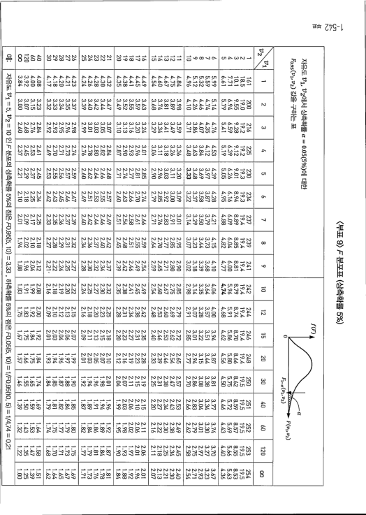
#### 요
－ 曄엄섬 CJ`) N) N) N) N) c그-o c. -. 0, 口 )N) N) 。1 →。- →닉 →m →-。

N) 01 了： - C-) N) -, 섬-o α》 .) 0-. 01 了：, C-) N) - *, 4쑈- *, * - * - 恪 미 죤

- 1
N) 終． -o。- 卜 →尸。

1 →P→ → 恪 。

mㅁ C- )N0.-*)

- -o-0 
尸0-1 O .

' 뀀

- . 
01 0- 0- -.) *, □ -) 01 子첩｀

- 谷)
N) 茁·烙 C- )N)

- -0
## *,4- 4- * - 01
■ · ■ ' · -1 r9 *, ,,. -J .0- 0-. * - 4 - 01琵盤 N) CA) C-) 0) C- ) C- ) .

■ .

- - C-) * ..
-o ㅁ N) * - - 므얹

- 山
媤 P-。

C-) 山

- 
C- ．山 뜨 山-:1 ．山 앎 。므) 1 )0.) 。1 山·拐) 닉山

### 이Li 
01 z; N):- :-

- 
-O c. N) 山 N) N) N) N)

- - - . 
0, 0- -J m c. 山0- 4= - N) N) N) N) N)

* 
.

- . 
- -O .O -o -o -c 
N) C-) 01 0- 印 P。

1 Pㅁ → N--o。

山·→。-.

終

- -:1。-
恪·C- iiC)

- 山
섬

#### 山石m
010-藷 N) -。 -。 N) N)。1 恪 NS.-。) N) N) N) N) (A) .

.

* 
.

- c. -0- 0 `0 ㅁ 
- 
ㄷ〕 0) 0-- - P→ N) N) N) N) N) .

- . 
- . 
0- -』 -.) -1 -) -o □

- 
C- ) * - C -。．)- N。

1 拓m～山

### P0-
-O " 010- .O慇 m N5.

.S) NS.) P→ -N 。0- N 。10N) - N)Cm T]

>
211 )。1 uN (71群ho 必rio겨o.

(0 -I沔1

### 簾粲慇 
楙 N C-) )N)

- 。-.
N·5) N- 。I 1 -N )No N山C T] Pm-.1 P잃 N S10 -i N0iiC1 N임 N)

- -D
N→ m

- 。。1
(71 N) ．。1 10쓰 - 01 ， N) N) N) N.) N) .

- . 
■

- 01 01 01 0- 0-
- 
4:), m - 0-.

N-。

N-S.5。] N5') ．山 겅 N) N) N) N) ■

- - * 
c그 ㄷ그 －」 r.

- 
0 -.) CT] N) N) N) N) N)

- * 
- - . 
C- ) C-) C-) C-) C-) C-) 01 0- -J -o N) N)·-。

C탭 ') ∥潗n f?, 므， m 난 『｀.

앓 딩 -。 - -료 덟 (71 →01一0 IILP～ PJ 。1群1 胞r i。

겨ㅇ 。uhilf!

r-臘迪I 獅迦 ∼∥ 。·。

A() 。h' ' J1!

긺。

→＂ I

## 騙 co慇 
m

- 
N) N) N)

- . 
* 
.

'001 - -` 孑：5 N) 01 N) N) N) N) N) .

.

.

.

.

N) N) N) C-) C-) ,.i co .O - N) N) N) N) N) N)

- ■ 
.

■ .

0- , ) -.) *,01 -.i 01 01 스 → 。1 며) p .

1。→.

N) N) N) N) N) .

- . 
- . 
N) N) N) N) N)

- 
N) * - 01 -) P01N) 勺 = = ＝芯 N) N01 )N。

．。-.

。-.

→．염 N:1:

)N- -S_i 01 - 」 ':, - 乙 N→Ni N님 N。

1 烙山N) `

### C-
SC),)] P→ .。-.

N'0 鰕鑿 N) . 。- 。 - N) →。1 N→ -。

N·→。-.

NN) .。- N.0- -。

C- 。)1 N 。

1 N.5- iiCi N0--S.i N엉 －→ ■뻐」 －춈 『，〕 N) .

.

- . 
co `-0 001 C-) -"0 co

## N암 
．N 枋 :

0- 딤 ．山 잉 PN) ID P01.5-i 羅版 N) ID - .。- .。- .。- →N) N→ 。- N- :3 -。

N山→ NN) CS] N→ 。1 →。5 .

1。) →·N) →．C-)

## 驪飾 N)
N) 。-. .。-.。- →미 →N) → N)

- 。
- 山 妙 '－」 ' ＇ㅗ ．·」 →

- . 
* 
.

cN ,` c. 幻 .5) 01 .0- N) N- .1 N) N0- )N.

.幻～ 。- N→ 。1

- ■」 ■．a .｀」 →
## 山·.0-
.。

- →P 。1 N-.0 。- N5.-S)-i 羅 ID N) 。-。1。

- .。- ID
.

■ .

■ Cr10-. S.) CO S.) 0- CT] .0- .Li '。

→＊- -0:3 →Li。

-.

- Li.
。- Li 。) N → 。1 N'。

N→ 。- N01.

。- N.0- 。-.

* 
.

'

* 
.

ID ID ID ID -o .0- 01 S.1 ID 01 N01 Li 。..

→Li.

。- N → -O N→ 。1 N→ → N 01S_-i N)

- .0-.S.
) →

- ■ㅗ 
→ →

- . 
- . 
.0- 01 0- 5-.] 0- 01 01 .0- N．엾 01 S- -i 。

1。1＝ 。1 N.

0- C-)

- . 
- - ' 
-:3 CO CO ID ID ｀ㅢ.-」 N) .0- 01 →Li.

。- →Li ..ID-。

..ID

- 
N) N) N) N) .

.

■

- . 
-00101- 1 - .00) 0- 01 01 山 .5--i:3

- ■‘ 
■■ㅗ ■■a → 宅， 。1 .1

5. )N)
枋． .0- 。- 終 。

1 N0- 。-.

■

- . 
- C-) 01 01 0 ' 
'001 .0- 0

## 뀁 
.

졈 · · 0-. , .1 01 C- ) 5-) N) 《

- 
.

* 麗 ID譴 
엄 .

■ .

■ .

ID ID ID ID -0 N) .0- 0- -ON) N→ → →＊ID →놉。

1 N.0- N． 님 N． →。5 N) N) C-) C-) C-)

- - - - ■ 
-:3 · 5) S.

) -.) ID .0- 01 -] -001 → ．驪.

。- 粉．.) 니． N)

### N→
→ N) N) N) C-)C-) .

· .

.

· 01 S_) .ON) -그 ID 01 ` _i S.) 01 驪01譴

- . 
- . 
- S.
) S_-i ID ID ID ，』 놀닉. → .0- 닉 뀁 -0S--i →．C .) 졈召 N.0- 。1 ■■」 ■■」 ■■」 →

- . 
.

.

N) C-) .0- 01 N) 01 S.] ID .

- . 
- 흴 
0. . ` .) S.3 -.1 -< 
ID 01 - C- ) 01 →．엾 →．祗 →．조 艸 騙 口． 있 七〕鄂甥＝s驪 8 口 ．。

ㅑ 눕－」 ㅑ →

- . 
- . 
- 0- 0- 0- 0- 0-
r``. *, 《．n ` `.

- . 
- . 
ㄷ. Ni 《』」 （」1 01 01 -0 - ■ .

.

.

■ `q ``q ｀』 `,q 山 驪」 《』 ） c', c. →

> )0
> )
> 孕
＇0며오， D벴닢N탭 u。

큅。

> in'hu
> >
> ix
> -I沔1
> 1. 2!!
> n∥
PCii 門。

=n요닢木1

> )N탭닌텁n
르노倦 ∼J

> '
J

> llI祈h
> ＾
被 山 우 겨 敞 山 劇 벼 一 叱 刪 迦 ． 嶼 이 鱗 ∼

## .5,' s
C) 0 8 9 03 0JC) J 8 9 9 0 8 8 9 9 9 0 C J ) ) J J J )J 0) 08 C ) ) 03 3 J ) 0 C J0) 0 C ) 0)J J 0 0 J 0 0) 0c 0 J J J J J J ) J 8 0 J3 J )3 8 0 ) b 03 ) 8 0 )3 ) J J J J J

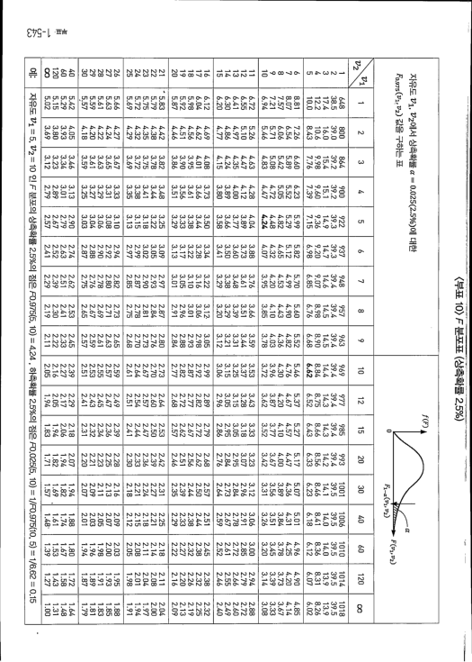
# N 
Cii *, C-) N.) - s-o 03 -40- 01 4. 0) NJ -` 51 요 쀼 0 ZTO-.4- .

7- ` ~ ｀〃 ＇■，

- 
` 』

- 
- 
- 
-- 一 넋 D- 1 딩 며 N) NJ NJ N.) NJ (.31 4C'. C-) N) - →。-.

→- 1 →m JN4 lii0- 9 - →N J 9- 미· -0。

3 01 01 (7101 .

.

- - ㄷ그 －ㅗ h｀〕 x첩-
NJ 01 .0 N) J1 .Cii-。

- 1
01-.4

- 1
-.4 (71 -1 i .i0- 。- 0-) F - 卜·-0 난 t근 뗀 으？ ., 므 r，구 ｀니 ㄵ』 죤 .NJ

* - 01 W
닉． -4NJ F-

- 이)
쑈 Cii-J Cii。1

#### Cii．
。- 03 s 5 0) 03 0) 0- N 終． 。

1 P。) 枋· 01。- 죤 F-

01. 12-
죤。

3 스 .12- NJ NJ。-

- 朴ㅁ→
＜-J 죤03。- 終·-4 NJ-4

## *- (4101010-
· .

.

* 
.

03 □ .12- 03 0- 0) 03 N) .0 . 輾殲03 1-0 。

- 。3 N) 48 
山 0) 0) 0) 04 0)

* 
* 
- . 
- (710- 0- 0- 0-
,.- 《．^) 《J1 ，』 0) 04 04 0) 0) ■

- . 
.

- 0- `` .) -4 - 403 
,0 N.) 0103 N.) 므스 P-o (71 拓． -4 谷． 枋． →C ii C-17()

### 谷·.1
8- -4 唜彧毫 烙 山

- 苾 
N-4 04 0) 04 04 04 ■

* 
- . 
- NJ 1') NJ 0) 0) 
ㄴy1 ,q `o 눋』 (p 0) 04 0) 0) 04

* 
.

■

- . 
01 (410- 0- -4

- 
0- - 0- C-) 恪· -4NJ 죤→ NJ

## :12.
咫- 卦。

3 羅莞-)N0 N) 이 N □ N0- -.4 NCii-4 P→ Cii P→ 。) Q 0) 0) 0) 04 04 ■ .

.

.

■ c. C9 ㄷ9 C그 -` C-) * - 0- 03 P N) (71 終 1 -0 山 ＇닉-4 ，.12-.

## - * - 4= - 01 (41 
· ·

* 
* 
.

ㅁ0) 0- - 03 -4 NJ 01 NJ NJ 擁莞 - 驪 N-4 N01NJ N -0 N-JN0 PNJNJ P→ -4 P。) P 띰 N) NJ (-)C-)C2)

- . 
흽 ■ .

`. ,. ㄷ． c. .

-4 0 NJ 01 `0 Nm-4 r.-2 NJ N.) NJ NJ N)

* 
- * 
■

- -4 - 4-40303 
(410- 03 c그 N) N -4 N-。0) N.

0) 04 04 0) 0)

* 
.

.

.

.

N) 0) *, 0- -4 ｀ㅢ. cㅇ .- 0- 枋· -0-。

恪． 엥 P-iiC0 p, ?c ，ㅗ (? 《 03 (71 묵 ; : 枋 니 0) 0) 0) 0) 0) .

■ .

- ■ 
ㄷ그 c그 -- －쵸 『｀，〕

- 
Cii ㄷ그 0- NJ N (71 N． -山 0 m-4 H탭iH邪1 。＂

- 1
### 0) 0) 0) 04 0)
· .

.

· · NJ NJ 0) 010- c그.0 -O -10- :12- 띰 9- 0-03煮 ..o 。-。3。1 - - m NJ N) N) NJ N)

- . 
- . 
- 0- 0- 0- ,` -.4 
(71-) .0 -,0) N) NJ NJ NJ NJ

- . 
■ ■ .

-.4-4030303 (73 m －놉

- 니
N.) NJ 0) 0) 0) .

■

- - . 
0 `0 ㄷ. c. -

- 
0- -2 0- NJ 12必ri。

거ㅇ ．。NJ。

。1 1一。

一∥ ＜경· ．0只띄 。1릎0 ) N.。p∥) 1

- 겅oir必01甲10pulluD1J"
→이띄 맥이 一o∥ N탭 .ㅇ프) JImillNJ· N→→ NJ N) N) NJ N) .

.

- . 
- 01 (730- 0- 0-
-4 ,. －ㅗ c.. (1 Hn IJ0ohIHa 0) 0) 04 04 0) N) N.) NJ NJ NJ ■ .

■ ■ .

0- .-4 ` -4 40) 03 ㄷ그 0) 0- N) NJ NJ N) C-) .

.

- - . 
c. c. ,. 놀닉. .

ii - m 0) c. 01 1

- 
p, m 7」 《권？ -0 앎 님 ;ii - z〕 乙 CYi∥

>
N J·.18- Cii

- - . 
- * 
-AN) C-) *, (71 『，〕 －ㅗ －」 *, `.

(71NJ :12- 0) 。-

- 谷
｀!。h Ji)1'

### 群鍔毫 
→。

-JNN) 4 N。- NCii 0 ．1 。- 9- -1。

- -p 。0 - 04 04 0) 04 04 NJ N) NJ NJ NJ

- - . 
.

.

(7301010101

- 
04 01 , 4- O N0- -4 NJ NJ N) NJ NJ .

- * 
* 
- ,q m m ,`. 幻 
-3 NJ -4 N.) .0 흴 '

* 
.

.

c그- NJ 0) 01 0- 01 Cii 헴 -3 C-)

## P03-4 
P0- N.) 0-箭劈 →NJ N01-4 NCiiii- N--4.1 N-JN4 NJ 04 040) 0)

- - - 습 
.

`o ㅁ- NJ * - 0- 01 01 03 04 9 )01 -.1 9- 0- -4 N NJ N． →-.4 N。1 .2 NJ ＇枋-4 N) ．。1

# 山·-3-3 
P01Ni 0-03盤.Q 。)。-C-) 。1 → 미 仄 七낭층抄 N → 。3 拓b→ →跡。

) NJ NJ NJ N.) NJ 뀁 .

- ■ 
- 010- 0- -4 - ) 
-4 NJ ) NJ -0 P。1 N-iiC0 終． →□ :18- 01-4 N山烙 NJ0 변 NCii N恪-4 쑈N NJ-4 ) N.)

## -4 
P0- -4 0) :18- NJ 0-03詩 -o 。

)。- NJ C-) 님 N-:1 。

- 미 :18- NJ N) N) NJ NJ ■

- - . 
.

NJ N) NJ NJ N.) ㄷ그 －』C-) (7103 口

- 拓N
J -' -

- 
NJ .

.

.

■ `< c. `. .

- 
NJ

- -4
N0- N) N) :18- 。-

- →-3
#### NJ N) NJ NJ C_) 
.

.

.

.

.

0- '-403_C - 18- 0) 18- 0- NJ :18- 0) 。- PC。ii - 0) .) 0-03盤즐 님 010- 咫-0 N 戚 N·→山 N→→ Nㅁ -。

NJ NJ NJ NJ N) ■ .

.

■ .

-AN) NJ NJ 0) 山 -4 18- `< → N NJ.-。

艸0 ) 。1 Cii-3 N01

### 이
(73 PNJ。

- 0-03-a 0)Cii蒙 烙 NJ NJ NJ NJ NJ

- ■ 
- . 
■ －」 －」 驪」 r`｀》NJ NJ 0103- 1 (71 NJ N) NJ NJ 0) .

* 
.

- . 
010- '-4 "C .

.0 ·-403- - 0- 山·m18- ■■」 ■■」 ■■‘ → .

.

.

.

18- 0- '-4 (0 m → *-. .

N-4 Nㅁ (71 N) 0) 。) 이뙤． Cii →9- m·-。) .．미- 0 N。

。

→．乙。

3 "＇뙤。

- ．·18- .．。) N'-JN1 쑈N NCJNii 終

- -0。
- .12-

- N)
Cii 山·걺 山:12- Cii NJ NJ NJ NJ NJ

- ■ 
■ .

■ ㄷ그 ㄷ그 －」 －」 → Cii03- 18- 03 N) .Cii .．염 ．·0- -a NN) -.4 NJ N) N) NJ NJ .

- . 
■

* 
-,NJ NJ 0) 0) 0- ㄷ. 0- NJ 03 N-81o- F- → 팀 ■■」 ■■」 －뻐ㅗ → NC 。ii1 .

.

■

- NJ 32- 01 -4 
,. 'p m r.

.

- * 
- . 
m m 幻 `o `o ,J ,.- 04 (41 3。．→→ ＊山 겁 山～山- o 『｀ ｀》 『， ，〕 『，〕 r`｀》 『.

■

- ■ 
- ■ 
.

-, -1 『9 （』〕 `. 《．｀〕 엡 (.)1 『넙 －ㅗ ·－ㅗ 눋』 h`. ',.

■ .

.

' .

｀ㅢ. ｀』. ,. ㄷ그 ㅇ －」 *, 덟 .

*, →＇ ) → 拐 『，〕 『넙 『넙 r,. 鬱9 ■ .

■

* 
- *, *, ., ，』 m 
ㄷ그 ｀」. c〕 『｀`) ㅁ 卜， 。口 8 .

■ ■ .

■ -4 03 03 03 03 ｀』. ．」04 (7103 →:18 - 。3 ．얹 → □→m

> C)
> ．午
> →
> >
> ix
> 。
> 141rFh
> JI1111111n∥
pㅇ NJ (.31 ^N (.31 옷닐木 =n r

> -3A텁낭텁N닢史Fib-
tJ

> - H텁nE011
NJ 르뇨蘚 ∼J

> '
> ＾
被 山 “ ㅇ v 겨 前 덥 峀 一 叱 刪 皿 吻 N 柚 鮮 ∼

> ,＊뺙， 
-4

> 닢
> .` 
∼

> 엄
> →
므ㅁ

> 닝．ii
> ．山
。

9 9 S J ) 0(9 J 0 ) 9 .

C ) C)J 5 0)J (9 0 C) J ) J J J J C C ) ) C) ) C ) 0) 0 0 C) JC) 5 CJ ) CJ ) C)JC ) J J 0 C) 0 C) C) C ) C 0)) J J Ja J J 0 0 Js J Q C)J J 0J (9a 0J J5] C) 0 0-。

0 Q Q 0 J (9 J J J J 0 b J J 0S J , J Jp 。.

9 0 0

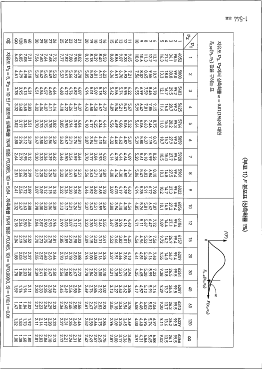
요 ” 8 엄섬 섟 D-J D 딩 山。

口 緇 脯 뵤 驢 →。

→덟 →m →-。

졈 → N 山 烙 섬 -0 . -J 0' 01 * - C.

) NJ - S.

) 'S. ) S.) 'S .) (9 .

.

■ .

- ,J m m `. . 
-J NJ (9 01 N.

) c. m m . .

.

- 졈 
- - - 
- 
NJ 4경 - 01 c그(9 -0 ㄷ그 C.

) .

m- o -o -o

- . 
' .

.

0' (9 c그 C.

) 0- (9 0- -그 C.

) 01 山 'S.) NJ C.

) -1 .0.

，엄 →· ) P。

' pㅁ ，。(9 C.

) N.) 。1 NJ

>
(.n LnJ ㄴn r」

- 흴 
- . 
- 010- 0 ' S..) '.J 
S_I - 0 ' NJ (9 01010 ' 0. O' .

.

- . 
.

(9 -0 .

- 
NJ 01C.

)-"- C.

) 0' 0 ' 0 '. 0 '. '.)

- ■ 
- . 
.

《』. (J1 '-.) -0 NJ 0'. - cn ( ') - →P '.。

9·(71 (71 뎨· 닉． 01。

' C.

) (9 山So inIlni 211

#### → - 
『，. `. g1

- '-.1繇掠 
이 () C) 47' 47` ■ .

■ ■ '-.1 '.0 - C.

) (9 (71 C.

) - *, 4:, * - 수- *- .

.

.

.

.

01 (71010' 0 '.

-' 추功｀S_I .

47. .
엡 47- 47- 47- 47- *'

- . 
- . 
.

0 ' -.1 '..) (9 (9 (9 NJ 0- NJ , .) 이

- 
9101。

- 山.47 - (71 닉01 '.。

p.

0-.

'.。

9- 01 (71 N-0 미． 茁 ㅁ1 → 終． -0 ．'5) m 므 巴 0·).

- 。1 終 ，C.

S) .) *. 47. 수. 47. *..

.

- . 
- . 
47- 01 01 0- S.) (D (D m ，』 ,J 9 10- S.) 네． 。7- 91-0 '.。

- 
- 
NJ '0 －」0' (9 -0 J논 죤→ ㅡ .47' b ＝』 NJ [：옭 烙 終· ㅁNJ '5) 므 谷． 띵 ，→(71 rlaHi10 07".

→ - 『9 刃 (I〕 －욥 (71 m ,. 견ㅢ U ` = ㅍ ` ' u, (J 나 괘 ^ 니.' .17- m

5. 11
C.

) C') C') () .

.

.

- c〕뻐」 C') 01 
NJ -J 47.

(`) C) C.

) C') C') .

.

■ .

- `q `q ，』 `q m 
ㅁC') 01 (9 NJ P.

'0 '.。

P-70- P 47- *-47- *- *-

- - - - . 
-` -` 『9 （』. *, ㅁ'- .10147- 47- -J.

-。.

m 910S (9。1

- -.1
(71 (0

### 恪．
0JN" 스C')NJ (1 ㄴn c鸞， ,J m · ·

* 
* 
.

C') (9 C.

) - 7- -0 c. S.) -0- .) 義 NJ '001 pC.71S..10 '._I NJ .O C) -。

楙 C ') .47- S.) P-。I..

PS.) 山0- ".1 恪． →ㅁ ...으 -P .0 17- P (9S.) 미 N-。0- 。10P。

- P01

- 딤
∥琿iH011 。1 ． -'- 'NJ- 00〕 .

《J1 덟 《 y근 (71 b 써 」겊， ［겸 덟 *, *. *.. *.. ㅑ .

- . 
흴

* 
- 
NJ 47- 0- (9 *- m 47.. *. `.

山01 따 山 (71 '.。

NJ NJ NJ C) .

- . 
.

0- -'1-0 -」 47- 001 NJ ㄴ11 (.n c·， ㅇ，(9

* 
* 
■

- . 
NJ 0 '. - '.0 NJ ㄷ그- (9 -00- ＇拐 PS--IJ ．山 경

- 잇
#### 91。'. 
-' → 『｀. 心 q1 = (9。

147- 奎 m C'`IC.) C.) C.

) C.)

- . 
■

* 
- (710
'. S.) S.

) (9 0- C.

) -」 놈닉. .

47 475 47. 47- 47.

룁

- 흴 
' .

ㅁ- 0) 01 .-1 .47- ㄷ그 .

.17.

9ㅁ→ '.

.m

0. . 
5_ Il NJ NJ NJ NJ '

* 
'

* 
010- (9 -0 -2 O"NJ O i。

겨ㅇ ．(。

(。

5. TI
鱗 勻 P→ '-.1 山粉。1 흙C (0C i。

으0 鱗JnM廻輛'

## (71 
谷·'-.0 。- s - NJ o0 47- .._I -。

NJ :< 논，. 뇨， 1-_i

47. N.) 
。

一ㅇ ∥ r0쑈JN볍 으p" 1。

必r N0 。1 - N-C- 0) 0) C.

) C.

) C') .

- . 
* 
솔 c그 ㄷ그 ．」 -- → -. 헴 O NJ (71 (9 0) C.

) 0) C.

) 0)

- . 
- - ■ 
NJ NJ C`) C.) 7- NJ 0 '. cD 01 (J`)C.) C.) C') (^) .

.

.

.

.

47- 01 0- 0- -.1 0, NJ ㄷ그 (9 (9 덟 :17- →'。

＊-o (9 네山 恪， -山 0 h。

必r 0刪J 恪·B

- (71
∼∥ ＞“·。

oh

## .17.. (71010- -.1 
· ■

* 
' ' 0) NJ 0) 0- 0) 01 0- - NJ -.1 - (71注騙 = NJ C.) 0) C') C.

) .

뢸

- - * 
-0 ㄷ. ㄷ그 ㄷ그 ㅁ (9 ㅇ 0) 0- '.0 山 （』) 《.

) *-47- *- ■ .

■

- 솔 
CO O -놉 C') 01 ㅁ475 .

ㅁ 47- N.47- -J ∥一C1 N乙

5. 브)
- 느
N -。o- N-.C0 ) N (9-J N .9( 。- NJ NJ NJ NJ .

■ '

- - 
C.) 010- m -C- □ ., b｀〕 c.〕 《J｀〕 c.〕 《』〕 .

■ .

- . 
-0 c그 ㄷ그 -

- 
.0 C') S.) NJ -) .P 0- 。- 47- 01 01 0- -.1

- - . 
뀁

- 닉 －」 ., -C- 닉
拓． →。-' :山 。. - P0- -I NJ '-.1 →:7- 幻·띵 →NJ r`.

－→ －」 ,.

N 01NJ NJ·(11 N-。

(`) (D C.) 47- 수..

- . 
.

.

.

010- cD cD NJ NJ 0 ' N.)-- (71 47- 47- (710 ) 01 '.0 (710) 01 0- C'. NJ -

0. . 
쑈 01-1 N-J N-0 (9 N(9 '.。

N(9 -0-0 幻． S- JNI →(71 (71 P山→ 。흴→ m P→ 。- N'.70- 卦 →。

NJ NJ NJ N.) NJ .

.

- * 
- S.)..) -J 0) 0)
.

475 m ') m .17.. 47- (710'. -1

- . 
- * 
- .17' 0) C.) - 
.17- －ㅗ －」 c'` c', .

#### '.0 - 
r`,) `. p논 。1섭PS-.) :NJ-。 NJ 이． N C.-)1 N0 。") N0 .S1) N01。1 ．山 엾 이-I --'NJ NJ .

.

.

■ S.) (9 (＝그 NJ ㄷ.0' 0) .

N0- NJ N01.

。- NJ NJ NJ C.) C.) .

■

- ■ 
.

-J (9 ..O c〕

- 
m

47. r`. . 
ㅇ P-70- PC .()7!

#### -0 - 
『｀〕 -0 p논 桃；。1。

1 - 염 시

- NJ。) 
91-o '.。

91NJ 拓． 0 。'1 。JN·..1 NJ4 NS- JNI 7'.

-J

- 
- 
-ㅗ NJ .

- . 
.

(71 '-1 '-0 - '0 0.. 47- -, (71.-。

'-0 -' NJ -0 P논 NJ-P 。 S.)＝。1 恪 C-

74. ).
N-。J '.

N0 ' 'C) 스0 1 '-I 恪． →--I N0.

47' N01.

。- NJ山。

1 - 。1 ．미 →NJ .I7- NJ NJ N.) NJ NJ .

.

.

.

- NJ NJ NJ NJ C.) 
눕」C.) 0- -C C.) NJ NJ NJ NJ NJ

- - ■ 
- ■ 
0- 0 ' -.1 (9 -0 -ㅗ S.) (71 C.) C.) P0-71 C.

)0.) 7- N □。

.

乙 →P5) :남 엄 N47 .11(.

N． 섬 .b→.

'。.

→＊J-..

(71。1 → 山 -o.(7!

.

.

■ ■ C.

) (715) -C) NJ C') C.) NJ N병 N→ S.) N→→ 4:, 4결， *, 《」1 ., .

.

뀁 ■ .

ㄷ. *, ,. 덟 .

ㄷ〕 ㅁ ㄷ」1 *, 헴，그 N.

0) (71 JNJN 'S.) iiC닒N.

N0- OS NCii (9 N0 JN1 NJ C') C') C.) C')

- . 
- ' 
- `. ㅁNJ 47- 0-
.', `. (.n 《．n `.

'. → 『. 《 ？논 노없듭＝；締 N ㅁ ■■‘ ■■」 ■■」 -

#### 9 －쵸 『，) 刃 9논 
綸［繼；塔 8 《』 ） 4》 ， *, （」1 .,

* 
- - ■ 
.

｀ㅢ. （』J m ., m 니 －」 c'` （』1 m ．띰

- 암 
“·님 →， 딤 N． →ㅁ N넋

> 표台 妙9- L
> →
> ＊午
> 。
> NJ
> >.l
沔Hi텁 난탭NJ온노蘚∼JIXI J1MIII典 。＂ ．딥I- =n온닢木딛'

> 'C탭낭덕N닐뼜nib-
IJ

> iil祈h
> ＾
艇 山 쑈 v 거 敞 巴 H 一 叱 獅 迦 吻 驢 ∼

> 0 -
→' 。"

> `｀갸， 
쑥 一 ., `

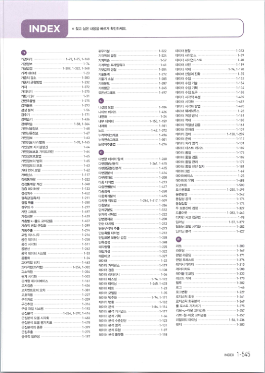
※ 찾고 싶은 내용을 빠르게 확인하서臘 귀무가설 1-322 데이터 분할 1-353 기각역의 결정 1-324 데이터 사이언스 1-39 --－∼ 가영처리 '-73, 1-75, 1-168 기계학습 1-57 데이터 사이언티스트 1-40 가명정보 1-74 기계학습프레임워크 1-61 데이터 사전 1-119 가설검정 1-30위 1-322, ㅏ 48 기댓값의 성질 1-284 데이터 삭제 ㅑ 4,1-170 가역 데이터 ㅏ 3 기술통계 1-272 데이터 산업의 진화 1-35 가중치 감소 1-383 기울기 소실 1-385 데이터 수집 1-152 가중치 균형벋뻠 1-232 기하분포 1-287 데이터 수집 기술 1-154 가지 ㅑ 72 기하평균 1-245 데이터수집 기획 1-134 가지치기 1-375

### 꺾은선그래프 
1-497 데이터수집 도구 니88 ● 빎oI힉섭： 羈속서" ;［蠶： 가트너 3v 1-31 간편추출법 1-275 감마분포 1-293 나선형모형 씨4 데이터시각화방법

1. 4＇〔〕
감성분석 1-56 나이브베0陸 1-426 데이터 웨어하우스 1-28 감추기 1-171 내면화 1-24 데이터 저장방식 1-161 강학슴기 1-436 먀부 데이터 1-153. 1-159 데이터 적재 1-188 강화학습 1-58, ㅏ 64 내재화 1-101 데이터 적절성 검중 1-161 개인식별정보 ㅑ 8 노드 1-47, 1-372 데이터 전처리 1-137 개인신용정보 1-67 누적악대그ㄹ驪뜨 1-496 데이터 징제 1-138, 1-209 개인정보 1-63 누적연속그래프 1-5이 데이터준비 1-113 개인정보 비식별화 1-70, 1-165 눈덩이추출법 1-276 데이터 처리 영역 1-131 개인정보자기결정권 ㅑ 4 데이터 테스트 케이스 1-189

## 데이터 품질 검증 
1-182 0 개인정보보호가이드라인 1-64 데이터 품질 1-178 개인정보보호법 1-65 다변량 데이터 탐색 ㅏ 60 개인정보의 범위 1-65 데이터 품질 관리 다변량분산분석 ㅑ 61,1-415 개인정보의 보호 1-63 데이터 품질 진단 절차 다변량공분산분석 1-415 거대 언어 모델 1-62 데이터 3법 데이터베이스 다변량분석 1- 14 거버넌스 씨17 검瑪계량 ㅑ 22 다변량자료 ㅑ 08 데이터의 유형 도넛치트 도수분포표 다중 대치법 1-2 13 검장통계량 계산 ㅑ 48 다중판별분석 1-417 검증 데이터셋 1-133 다중회귀 1-260 결정계수 1-452 동변량성 동질성 공격 동질집합 두 모분산비 검정 드롭아웃 다중회구＋분석 1-415 결측값（결측치） ㅑ 11 다차원 척도법 1-264,1-417,1-509 결합확률 1-280 다항분포 '-286 경우의 수 1-277 계단그래프 ㅑ 97 단7퓨구분도 '- 512 단계적 선택법 '-222 계절성분 1-419 디자인 사고 접근법 단변량차료 '-208 계층별 k폴드교차검증 1·457 딥러닝 딥러닝 모델 시각화 단순 대치법 1-212 계층적 병합군집화 1-399 단순무작위 추출 ㅏ 73 계통추출 1-274 딥러닝 분석 단순확률 대치법 ㅏ 12 고립 의사나무 ㅑ 16

## 獨모분산검정 
::;:: .

공간 데이터 ㅏ 58 공간시각화 ㅏ 11 대각행렬 1-225 라쏘 1-383 공분산 1-262 대립가설 1-322 라운딩 1-169 공유 데이터 사스템 1-53 대믐비교 1-327 랜덤 라운딩 1-171 공통화 ㅏ 4 데이터 1-22 랜덤포레스툐 1-376 과대적합방지 1-463 데이터 거버넌스 ㅑ11?

레거시 데이터 1-210 과대적합（과적합） ㅑ 54,1-382 데이터 검중 ㅑ138 레이더차트 1-508 과소적합 1-354 데이터 리터러시 1-36 레이불인코딩 1-233 관계 시각화 1-503 데이터 마스킹 "4. 1-172 레코드삭제 1-170 관계형 데이터베이스 씨61 데이터 마이닝 1-265, 1-433 렐루 1-382 교차검증 ㅑ 56 데이터 마트 1-23 로그 1-46 고l吹I언」트로피 오차 ㅑ 81 교호작용 ㅑ 27 데이터 모델링 1-35 로그변환 1-229 데이터 범주화 1-74. 1-171 로자스틱 회귀 1-26 1 구간자료 ㅏ o' 데이터 변환 1-162 로지스틱 회귀분석 1-369 구간추정 1-316 데이터 분석 1-84. 1-114 룰포스트가지치기 1-375 구글 파일 사스템 1-192 데이터 분석 거버넌스 1-117 리브-pㅢ가웃교차검중 1-457 군집분석 1-264, 1-397, 1-416 데이터 분석 기획 1-86 리브－원ㅢ가웃ㅍ톼검중 1-457 군집분석 모델 시각화 1-483 데이터 분석수준진단 1-123 리얼리티 마이닝 1-56,1-436 군집분석 모델 평가자표 1-478 데이터분석 영역 1-13 1 릿지 1-383 군집분석의 종류 1-399 데이터 분석유형 1-87 군즌琫출 1-275 데이터 분석 플랫폼 ㅏ 18 궁극적 일관성 1-197

> 177
1-181 1-69 1-25 1-488 1-500 ㅏ 50 , 1.499 1-242 ㅑ 74 ㅑ 74 1-329 1-383, 1-463 1-98 1-57,1-379 1-482 1-427

> INDEX 1-545
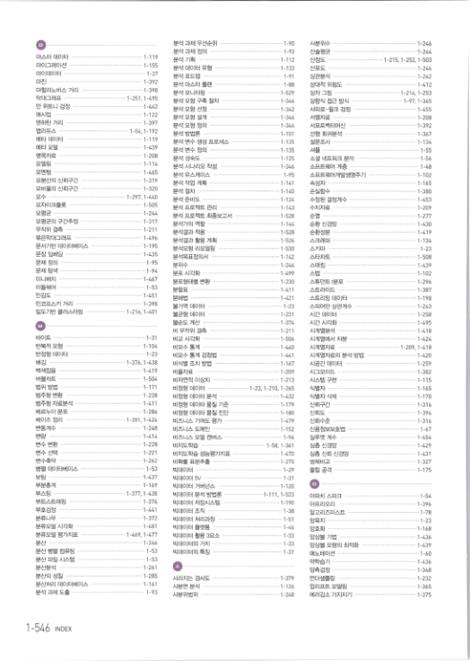
### 0
분석 과제 우선순위 1-90 분석 과제 정의 1-93 분석 기획 ㅐ12 분석 데이터 유형 1-133 분석 로드맵 1-,1 분석 마스터 폴랜 1-88 분석 모니터링 1-529 분석 모형 구축 절차 ㅑ 46 분석 모형 선정 1-342 분석 모형 설계

- ㅑ 46 
분석 모형 정의 1-3" 분석 방법론 1-10 1 분석 변수 생성 璧세．스 1-135 분석 변수정의 1-135 분석 상숙도 1-125 분석 시나리오작성 ＇·346 분석 유스케이스 1-95 분석 작업 계획 1-141 분석 절차 → 너4｀〕 분석 준비도 1-124 분석 프로저＇트 관리 ㅏ 43 분석 프로젝트 최종보고서 1-528 사분위수 1-246 산술평균

1. 244 
산점도 ㅑ 15.1-252.1-503 산포도 1-246 상관분석 1-242 상대적 위험도 1-412 상자그림 1-214. 1-253 상향식 접근 방식 1-97, 1-345 샤피로－윌크검정 ㅑ 55 서열차료 1-208 서포트벡터머신 1-392 선형 회귀분석 1-367 설문조사 1-134 ㅅ픔 1-55 소셜 네트워크 분석 1-56 소프트웨어 계충 1-48 소프트웨어개발생명주기 1-102 속성자 一 1-165 손실함수 ㅏ 80 수정된 결정계수 1-453 수치자료 ㅑ 09 순열 1-277 순환신경망 ㅑ 3〔· 순환성분 ㅑ 19 스크래퍼 1-134 스키마 · ㅑ 3 스타차트 ㅑ 凹 스태킹 4 1-439 스텝 씨02 스튜던트t분포 1-296 스트라이드 1-387 스트리밍 데이터 1-198 스피어만상관계수 1-243 시간 데이터 1-258 시간시각화 ㅏ 95 시계열분석 1-418 마스터 데이터 1-119 마이그레이션 1-155 마이데이터 ㅑ 7 마진 1-392 마할라노비스 거리 1-398 막대그래프 1-251, 1-495 만 위트니 검정 1-442 매시업 1-122 맨하탄 거리 1-397 맵리듀스

- 1-54, 1-192 
메타 데이터 1-119 메타모델 1-439 명목자료 ㅑ 08 모델링 씨｀4 모멘텀 1-465 모분산의 신롸구간 ㅑ 19 모비율의 신뢰구간 1-320 모수 1떼297, ㅑ 4.

모자이크푤롯 ㅏ 05 모팡균 1-244 모팡균의 구간추정 1-317 무작위 裝 1-2 11 묶은막대그괘프 1-496 문서기반 데이터베이스 1-195 문장 임베딩 ㅑ 35 문제 정의 1-95 문제 탐색 1-94 분석가의 역할 더44 분석결과적용 1-528 분석결과 활용 계획 1-526 분석모형 리모델링 1-530 분석목표정의서 1-142 분위수 1-246 분포 시각화 ㅑ 9, 분포형태별 변환 1-230 분할표

1. 411 
분해법 1-421 불가역 데이터 '-23 불균형 데이터 1-23 1 불순도 계산 1-374 비 무작위 결측 1-211 비교 시각화 1-506 비모수 통계 ㅑ 40 비모수 통계 검정법 1-441 비식별 조치 방법 씨67 비율자료 1-2醜 미니배치 1-467

### 미들웨어  
1-53 민감도 1-45 1 인코프스키 거리 1-398 밀도기반클러스터링 ㅑ 16,1-4이 0 배기트 1-31 시계열에서 차분 ㅑ 24 반복적 모형 1-104 반정형 데이터 1-23

### 시계열자료 
1-209. 1-418 시계열차료의 분석 방법 ㅑ 20 ㅅ님간 데이터 ㅑ 59 사그모이드 1-382 시스템 구현 1-115 식별자 1-165 식별자삭제 1-170 신뢰구간 1-316 신뢰도 뺨-394 신롸수준 1-316 신용정보보호법 1-67 실루엣 7侶놈 1-454 상충신경망 1-429 심충신뢰 신경망 ㅑ 31 쌍체비교 1-327 쏠림 공격 1-175 0 배깅 1-376.1-438 백색잡음 1-419 버블차트 ㅑ 04 비자연적 이상치 ㅑ 13 비정형 데이터 1-23, 1-21이 1-265 비정형 데이터 분석 1-432 비정형 데이터 품질 가준 1-179 비정형 데이터 품질 진단 1-180 비즈니스 기여도평가 1-679 비즈니스도메인 1-152 비즈니스모델 캔버스 1-96 비자도학습 1-58.1-361 범위 방법 1-171 범주형 변환 1-228 범주형 자료분석 ㅑ 11 베르누이 분포 1-286 베이즈 정리 1-281. 1-424 변동7쮸수 1-248 변량

1. 414
변수 변환 1-228 변수 선택 1-221 변수축약 찧-262 병렬 데이터베이스 1-53 보팅 1-437 비지도학습성능펑가ㅈ區 1-47D 비확룔표본추츌 ㅑ 75 빅데이터 1-29 빅데이터 SV 1-31 부분총계 씨6' 부스팅 1-377, ㅑ 38 빅데이터 거버넌스 1-120 빅데이터 분석 딛［법론 1-111. 1-523 아파치 스파크 1-54 부트스트래핑 1-376 빅더I이터 저장시스템 1-190 아프리오리 1-396 알고리즈미스트 1-78 부호검정 1-641 빅데이터 조직 ㅑ 8 분류나무 1-372 빅데이터 처리과정 1-51 암묵지 1-23 암호화

1. 168 
앙상블 기법 1-436 앙상블모형의 최적화 1-439 애노테이션 1-60 분류모델 시각화 ㅏ 81 빅데이터 플랫퐁 1-46 분류모델 평가ㅈ匯 1-46익 1-477 분산 1-246 빅데이터 활용 3요소 1-33 빅데이터의 가치 1-33 분산 병렬 컴퓨팅 1-53 분산 파일 사스템 1-53

## 빅데이터의 특징 
ㅑ 1 0 악학습기 1-436 양측검정 1-348 분산분석 1-26 1 분산의 성질 1-285 사라ㅈ는 경사도 1-379 언더샘퓰링 ㅏ 32 업리프트모델링 1-365 분산처리 데이터베이스 1-161 사분연 분석 (-126 분석 과제 도출 1-93 사분위범위 1-248 에러감소 가지치기 1-375 1-546 INDEX

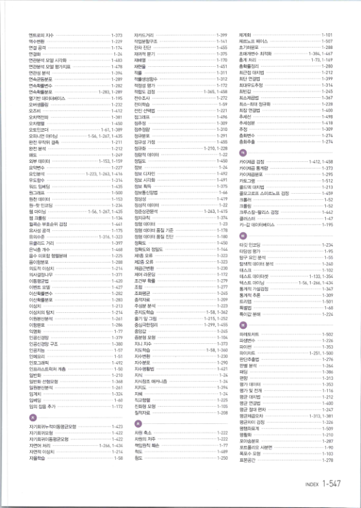
체계화 너01 처隍노프페이스 1-507 초기하분포 1-288 자카드거리 ㅏ 9' 엔트로피 자수 ㅑ 73 역수변환 ㅏ 29 작업분할구조 1-141 잔차진단 ㅑ 55 연결공격 1-174 초매개변수 최적화 1-386, 1-467 ㅈ卜체적 분기 1-375 연결화 1-24 총계 처리 ㅏ 3, 1ㅢ6' 재배열 1-170 연관분석 모델 시각화 ㅏ 83 총확률정리 1-280 재현을 1-451 연관분석 모델 평가ㅈ匯 1-478 최근접 대치법 ㅑ 12 적률 ㅏ 11 연관성 분석 1-394 최단 연결법 1-399 적률생성함수 1-3 12 연속균등분포 1-289 최대우도추정 1-314 적정성 평가 1-172 연속확률변수 1-282 최빈값 1-245 적합도검정 1-365, 1-458 연속확률분포 ㅑ 83. 1-289 최소차곱법 1-367 잔수조사 1-272 열기반 데이터베이스 1-195 오버생꿇 1-232 최소－최대 騙구화 1-228 전이학습 1-59 최장연결법 1-6에 전진 선택법 1-22 1 오즈비 1-4 12 추세선 1-498 정그래프 1-4% 오차역전파 1-381 추세성분 1-418 점추정 1-309 도차행렬 1-45o 오토인코더 1-61, 1-389 추정 ㅏ 09 점추정량 1-310 충화변수 1-274 정규분포 1-29 1 오피니언 마이닝 1-56, 1-267, 1-635 완전무작위 결측 ㅑ 11

### 충화추출 
ㅑ 74 0 장규성 가정 1-455 정규화 ㅑ 1이 ㅑ 28 완전 분석 1-212 정량적 데이터 1-22 왜도 1- 49 정밀도 ㅑ 50 외부 데이터 1-153, 써5?

카이제곱 검정 ㅏ 12,1-458 정보 1-26 요약변수 1-227 요인분석 1-223, 1-263, 1-416 우도함수 ㅑ 14 카이제곱 통계량 1-373 정보 디자인 1-492 카이제곱분포 ㅑ 95 정보시각화 1-4이 카匕느램 ㅑ 12 정보획득 ㅏ 75 워드임베딩 1-435 콜드덱 대치법 1-213 콜모고로프스미르노프검정 1-459 정보통신망법 1-66 원그래프 1-500 정상성 1-419 원천 데이터 1ㅢ53 크롤러 1-52 정성적 데이터 1-22 韆상관분석 ㅑ 63, ㅏ 15 원－핫인코딩 1-234 크롤링 ㅑ 2 크루스칼∼왈리스검정 ㅑ 42 웹 마이닝 1-56, 1-267, 1-435 웹 크롤링 1-134 윌콕슨부호순위 검정 ㅑ 41 정자규칙 ㅏ 74 클러스터 1-47 정형 데이터 ㅑ 3

### 키－값 데이터베이스 
1-195 0 정형 데이터 품질 기준 1-178 유사성 공격 1-175 정형 데이터 품질 진단 1-180 유의수준 1-316, 1-323 정확도 1·45｀〕 유클리드 거리 1-397 타깃 인코딩 1-234 정확도와 정밀도 1-144 제종오류 ㅑ 23 제2종오류 1-323 은닉층 개수 1-468 음수 미포함행렬분해 1-225 음이힝분포 ㅏ 88 타당성 평가 1-95 탐구요인 분석 1-55 탐색적 데이터 분석 1-240 태스크 씨02 테스트 데이터셋 1-133. 1-354 텍스트 마이닝 1-56, 1-266, 1-434 제곱근변환 1-230 의도적 이상치 1-2 14 제어 라운딩 1-172 조건부확률 1-279 조합 1-277 의사결정나무 ㅏ 7' 이동평균법 1-420 이벤트모델 ㅑ 27 톰계적 가설검정 1-347 이산확률변수 1-282 조화평균 1-245 종적지료 1-209 주성분분석 1-223 통계적 추론 1-309 이산확률분포 ㅏ 83 트리맵 1-501 이상치 ㅑ213

### 특별법  
1-68 특이값분해 ㅑ 24 0 준자도학습 1-58. 1-362 이상치의 탐지 ㅑ 14 줄기 잎 그림 .

1-215, 1-252 이원분산분석 1-261 중심극한정리 ㅑ 胛 , 1-455 이항분포 1-286 익명화 1-77 중앙값 1-245 파러L토차트 1-502 증분형 모형 1-104 인공신경망 1-379 파생변수 1-226 파《새쓰 1-353 파이차트 1-251, 1-500 판단추출법 1-276 지니 자수 1-373 인공신경망구조 1-380 자도학습 1-58, 1-360 인공ㅈ능 1-57 자수변환 ，· 1-230 자수椒 1-290 인메모리 1-51 인포그래픽 1-492 판별 분석 ㅑ 64 패딩 1-386 자수평활법 1-421 인프라스트럭처 겨隱 ㅑ o 일반화 1-2 10 지식 1-24 편향 ㅑ 13 평가 데이터 ㅑ 53 지식칭조 매커니즘 ㅑ 4 지지도 1-394 지혜 1-24 일반화 선형모형 ㅏ 68 일원분산분석 ㅑ 61 임계치 1-324 평가 및 전개 1-116 평균 대치법 1-2 12 평균연결법 ㅑ f〕 〔〕 펑균절대 편차 1-247 임베딩 1-60 직교행렬 ㅏ 25 진화형모형 1-105

### 임의 잡음추가 
1-172 0

### 칠적자료 
1-208 0 평균제곱오차 · 1-313. 1-381 평균차이 검정 1-326 평행똬표계 1-509 평활화 1-2 10 포아戮븐포 1-287 포트폴리오 사분면 1．위〕 폭포수 모형 1-103 표본공간 1-278 자기회귀누적이동평균모형 1-623 차원 축소 1-222 자기회귀모형 1-422 차원의 챠주 1-222 자기회귀이동평균모형 1-422 책임원칙 훼손 1-77 자연어 처리 1-266.1-434 척도 1-489 1-250 첨도 자연적 이상치 ㅏ 14 자율학습 ㅑ 8

> INDEX 1-547
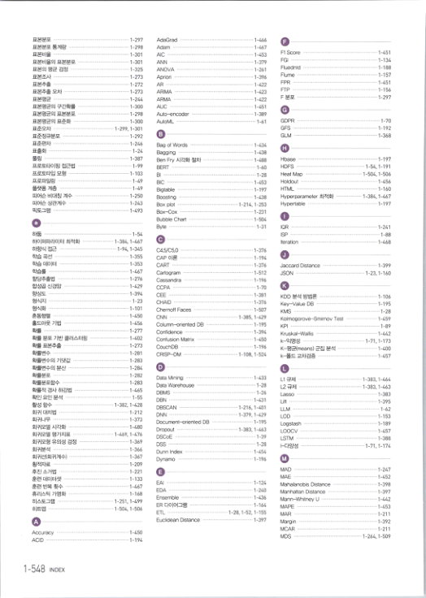
### 0 
Fl Score 1-451 F더 ㅑ 34 Fluedntd 1-188 Flume 1-157 FPR 1-451 FTP 1-156 F분포 ㅑ 97 0

### 표본분포 
ㅑ ?7 표본분포통계량 1-298 표본비율 ㅑ 이 표본비율의 표본분포 1-301 표본의 평균 검정 1-325 표본조사 1-273 표본추출 1-272 표본추출도차 ㅏ 73 표본평균 ㅑ 44 표본평균의 구간확률 1-300 표본평균의 표본분포 1-298 표본평균의 표준화 1-300 표준오차 1-299, ㅏ 01 표준장규분포 1-292 표준편차 ㅑ 46 표출화 1-24 풀링 1-387 프로토타이핑 접근법 1-99 프로토타입 오형 1-103 프로파일링 1-4, 플랫폼겨隱 ㅑ ' 피어슨 비대칭 계수 1-250 피어슨상관계수 1-243 픽토그램 1-493 0 AdaGrad 1-466 Adam 1-467 시C 1-453 ANN 1-379 ANOVA 1-261 Apriori 1-396 AR 1-422 ARIMA 1-423 ARMA 1-422 AUC 1-451 Auto-encoder 1-389

### AutoML  
1-61 GDPR 1-70 0

### GFS  
1-192 GLM 1-368 0 Bag of Words 1-434 Bag騈ng 1-438 Ben Fry 시z掛절차 '-488 Hbase 1-197 BERT 1-60 HDFS 1-54, 1뻐191 BI 1-28 Heat Map 1-504. 1-506 BIC 1-453 Holdout 1-456 Bigtable 1-197 HTML 1-160 Boosting 1-438 Hyperparamefer 최적화 1-384. 1-467

### Box plot  
1-214, 1-253 Hypertable 1-197 Box-Cox 1-231 Bubble 아，arf 1-504 Byte 1-31 IQR 1-241 0

### 0
하둡 1-54 하이퍼파라미터 최적화 ㅑ 84. 1- 67 하향식 韶 1-96. 1-345 학습곡선 1-355 학습 데이터 1-353 학습률 1-467 힐딩추출법 ㅑ 76 합성곱신경망 ㅑ 29 향상도 ㅑ 弘 ISP 1-88 Iteration 1-468

### C4.5/C5.0  
1-376 CAP 。i 1-194 0 CART 1-376 Jaccard Distance 1-399 Cartogram 1-512 JSON 1-23, 1-160 Cassandra 1-196 CCPA 1-70 CEE 1-381 아 쇠D ㅑ 76 Chernoff Faces 1-507 CNN 1-385. 1-429 Column-oriented DB 1-195 Confidence 1-394 Contusion Matrix 1-450 CouchDB 1-196 CRISP-DM 1-108, 1-524 0

### 0
### KDt〕 분석 방법론 
1-106 Key-Value D0 1-195 KMS 1-28 Kolmogorove-Smirnov Test 1-659 KPI 1-89 Kruskal-Wallis 1-462 k－익명성 1-71. 1-173 K－평균（means）군집 분석 1-400 k－폴드교차검증 ㅑ 57 0------- Li 규제 ㅑ 83. 1-464 L2규제 ㅑ 83.1-463 Lasso ㅑ 83 Lift 1-395 LLM 1-62 LOD 1-153 Logstash 1-189 LOOCV 1-457 LSTM 1-388 I-다양성 1-71, 1ㅢ74 0 형식지 1-23 형식화

1. 101 
혼동행렬 1-450 훌드아웃 기법 ㅑ 56 확률 1-277 확률분포 기반클러스터링 1-402 확률 표본추출 1-273 확률변수 ㅑ 81 확률변수의 기댓값 1-283 확률변수의 분산 1-284 확률분포 1-282 확률분포함수 ㅑ 83 확률적 깅사하강법 1-465 확인 요인 분석 1-55 활성 힘수 ㅑ 82. 1-428 회귀 대치법 '-212 회귀나무 1-373 회 시모델 시각화 1-480 회귀모델 펑가지표 ㅏ 6' , ㅑ 76

### Data Mining  
1-433 Data Warehouse 1-28 DBMS 1-26 DON 1-431 DBSCAN 1-216, 1-401 DNN 1-379,1-429 Document-oriented DB 1-195 Dropout 1-383.1-463 DSC0E 1-39 DSS 1-28 Dunn Index 1-454 Dynamo 1-196 0 회귀모형 유의성 검정 1-369 회귀분석 ㅏ 66 회귀선（회귀7侶놉) 1-367 횡적자료 1-2醜 후진소거법 1-22 1 훈련 데이터셋 1-133 훈련 반복횟수 ㅑ 67 휴리스틱 가명화 1-168 히스토그램 1-251, ㅏ ' ' 하트맵 ㅏ 04, ㅑ 恥 MAD 1-247 MAE 1-452 Mahalanobis Distance 1-398 Manhattan Distance 1-397 Mann-Whitney U 1-462 MAPE 1-453 MAR ㅑ 11 Margin 1-392 MCAR ㅑ 11 MDS 1-264,1-509 E씨 1-124 EDA 1-240 Ensemble 1-436 ER 다이어그램 1-164 ETL 1-28.1-52,1-155 Euclidean Distance 1-397 -- Accuracy 1-450 ACID 1-194 1-548 INDEX

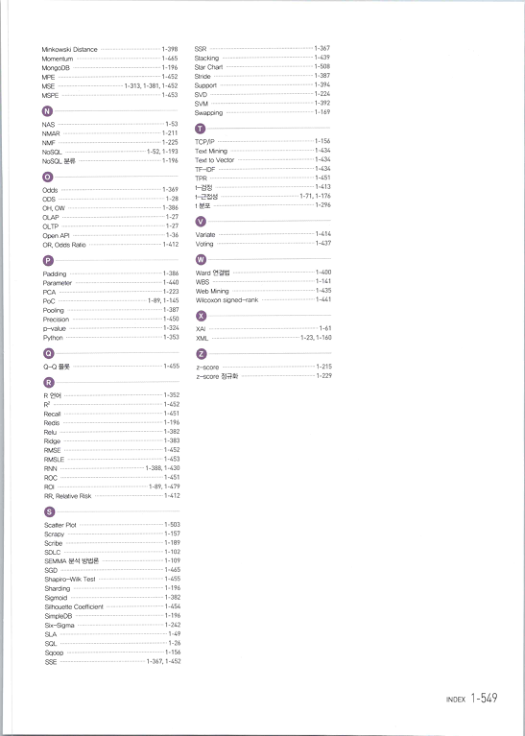
Minkowski Distance 1-398 SSR 1-367 Momentum 1-465 Stacking 1-439 MongoDB 1-196 Star Chart 1-508 MPE 1-452 Stride 1-387 MSE 1-313. 1-381, 1-452 Support 1-394

### MSPE  
1-453 SVD 1-224 0 SVM 1-392 1-169 Swapping NAS 1 1-53 NMAR 1-211 NMF 1-225 TCPIIP 1-156 N0SQL 1-52, 1-193 Text Mining 1-434

### N0SQL 분류  
1-196 Text to Vector 1-434 .

TF-IDF 1-434 0 TPR 1-451 0dds 1-369 t－검정 1-413 0DS 1-28 t-2 성 1-71.1-176 0H. OW 1-386 1 분포 1-296

### 0R. Odds Ratio  
1-412 Voting 1-437 0 0LAP 1-27 0LTP 1-27 0pen API 1-36 Variate 1-414

### 0 
0 Padding 1-386 Ward 연결법 1-400 Parameter 1-440 WBS 1-141 PCA 1-223 Web Mining 1-435 PoC 1-89, 1-145 Wilcoxon signed-rank 1-441 Pooling 1-387

### 0
Precision 1-450 p-value 1-324 XAI 1-61

### Python  
1-353 XML  · 4 1-23,1-160 0

### 0 
0-0 플롯 1-455 z-score 1-215 z-score 장규화 1-229

### 0
R 언어 1-352 R2 1-452 Rec헤 1-451 Redis 1-196 Relu 1-382 Ridge 1-383 RMSE 1-452 RMSLE 1-453 RNN 1-388, 1-430 ROC 1-451 ROI 1-891-479

### RR. Relative Risk  
1-412 0 Scatter Plot 1-503 Scrapy 1-157 Scribe 1-189 SDLC 1-102 SEMMA 분석 딛［뻘론 '-109 SOD 1-465 Shapiro-Wilk Test 1-455 Sharding 1-196 Sigmoid 1-382 Silhouette Coefficient 1-454 SimpleDB 1-196 Six-Sigma 1-242 SLA 1-49 SQL 1-26 Sqoop 1-156 SSE 1-367,1-452

> INDEX 1-549