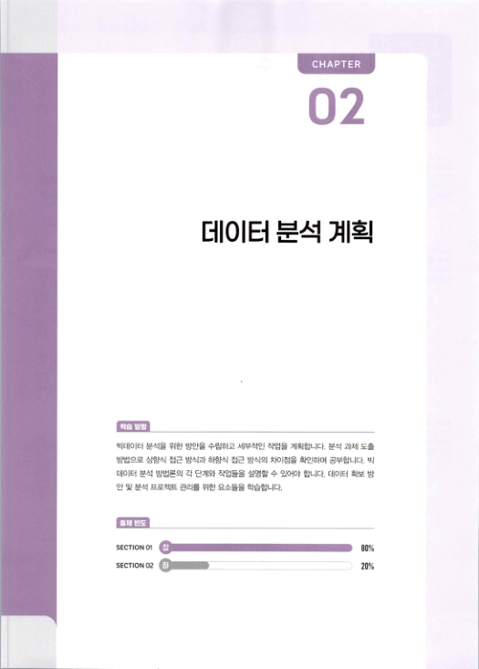
# CHAPTER 
02

# 데이터 분석 계획
빅데이터 분석을 위한 방안을 수립하고 세부적인 작업을 계획합니다 . 분석 과제 도출 방법으로 상향식 접근 방식과 하향식 접근 방식의 차이점을 확인하며 공부합니다 . 빅 데이터 분석 방법론의 각 단계와 작업들을 설명할 수 있어야 합니다 . 데이터 확보 방 안 및 분석 프로젝트 관리를 위한 요소들을 학습흗시다． 출제 빈도 SECTION 01 11I1U1 SECTION 02

> 80%
> 2미｀
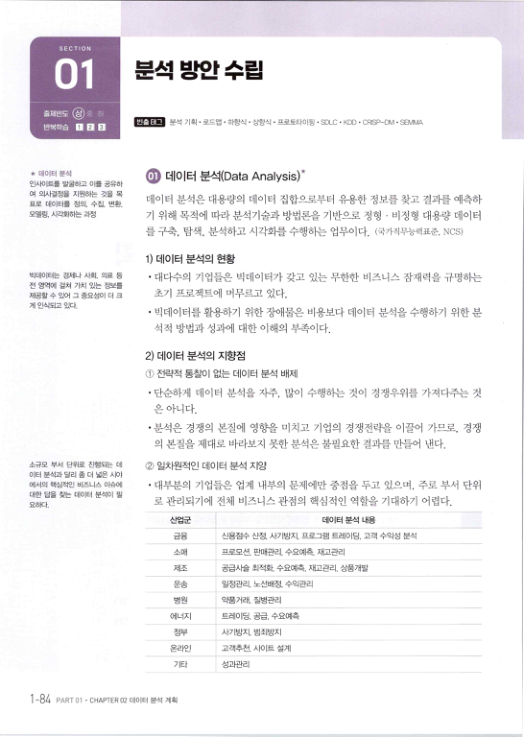
SECTION

# 분석 방안 수립
출제빈도 빈츨 태그 분석 기획 · 로드앱 · 하향식 · 상향식 · 프로토타이핑 · SDLC · KDD · CRsP-DM · SEMMA 반복학습 태 댜 때

#### 屯， 데이터 분석（Data Analysis)*
★ 데이터 분석 인사이트를 발굴하고 이를 공유하 여 의사결정을 지원하는 것을 목 표로 데이터를 정의 . 수집 , 변환， 데이터 분적은 대용량의 데이터 집합으로부터 유용한 정보를 찾고 결과를 예측하 기 위해 목적에 따라 분석기술과 방법론을 기반으로 정형 · 비정형 대용량 데이터 모델링 , 시각화하는 과정 를구축 , 탐색 , 분석하고 시각화를수행하는 업무이다 . （국가직무능력표준 , NCS) 1) 데이터 분석의 현황

- 대다수의 기업들은 빅데이터가 갖고 있는 무한한 비즈니스 잠재력을 구명하는
빅데이터는 경제나 사회 . 의료 등 전 영역에 걸쳐 가치 있는 정보를 초기 프로젝트에 머무르고 있다． 처꼼할 수 있어 그 중요성이 더 크 게 인식돠고 있다．

- 빅데이터를 활용하기 위한 장애물은 비용보다 데이터 분적을 수행하기 위한 분
석적 방법과 성과에 대한 이해의 부족이다． 2) 데이터 분석의 지향점 ① 전략적 통찰이 없는 데이터 분석 배제

- 단순하게 데이터 분적을 자주 , 많이 수행하는 것이 경챙우위를 가져다주는 것 
은 아니다．

- 분석은 경쟁의 본질에 영향을 미치고 기업의 경쟁전략을 이끌어 가므로 , 경쟁
의 본질을 제대로 바라보지 못한 분석은 불필요한 결과를 만들어 낸다． ② 일차원적인 데이터 분석 지양 소규모 부서 단위로 진행돠는 데 이터 분석과 달리 좀 더 넓은 시야

- 대부분의 기업들은 업계 내부의 문제에만 중점을 두고 있으며 , 주로 부서 단위
에서의 핵심적인 비즈니스 이슈에 대한 답을 찾는 데이터 분석이 필 로 관리되기에 전쳬 비즈니스 관점의 핵심적인 역할을 기대하기 어렵다． 요하다． 산업군 데이터 분석 내용 금융 신용점수 산정 , 사기방지． 프로그램 트레이딩 , 고객 수익성 분석 소매 프로모션 판매관리， 수요예측 . 재고관리 제조 공급사슬 최적화 . 수요예측， 재고관리 . 상품개발 운송 일정관리 . 노선배정， 수익관리 병원 약품거래 , 질병관리 에너지 트레이딩， 공급 . 수요예측 정부 사기방지， 범죄방지 온라인 고객추천， 새기트 설계 기타 성과관리 H4 PART01 . CHAPTER02 데이터 분석 계획

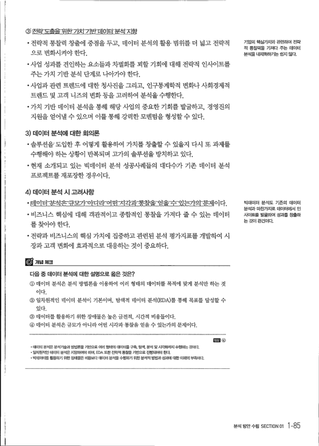
③ 전르「도춤을위한“7岡기l寸데이터‘부석“지학

- 전략적 통찰력 창출에 중점을 두고 , 데이터 분석의 활용 범위를 더 넓고 전략적
으로 변화시켜야 한다．

- 사업 성과를 견인하는 요소들과 차별화를 꾀할 기회에 대해 전략적 인사이트를
주는 가치 기반 분석 단계로 나아가야 한다．

- 사업과 관련 트렌드에 대한 청사진을 그리고 , 인구통계학적 변화나 사회경제적
트렌드 및 고객 니즈의 변화 등을 고려하여 분석을 수행한다．

- 가치 기반 데이터 분석을 통해 해당 사업의 중요한 기회를 발굴하고 , 경영진의
지원을 얻어낼 수 있으며 이를 통해 강력한 모멘텀을 형성할 수 있다． 3) 데이터 분석에 대한 회의론

- 솔루션을 " 도입한 후 어떻게 활용하여 가치를 창출할 수 있을지 다시 또 과제를
수행해야 하는 상황이 반복되며 고가의 솔루션을 방치하고 있다．

- 현재 소개되고 있는 빅데이터 분석 성공사례들의 대다수가 기존 데이터 분석
프로젝트를 재포장한 경우이다． 4) 데이터 분석 시 고려사항

- 뎨"이더甕트석우＝규모가’아디라E의輿＝끽각과鴦횔＝읔－벋흘＝격r오螺＝가의- 페이다．
- 비즈니스 핵심에 대해 객관적이고 종합적인 통찰을 가져다 줄 수 있는 데이터 
를 찾아야 한다．

- 전략과 비즈니스의 핵심 가치에 집중하고 관런된 분석 평가지표를 개발하여 시
장과 고객 변화에 효과적으로 대응하는 것이 중요하다． 다음 중 데이터 분석에 대한 설명으로 옳은 것은？ ① 데이터 분석은 분석 방법론을 이용하여 여러 형태의 데이터를 목적에 맞게 분석만 하는 것 이다． ② 일차원적인 데이터 분석이 기본이며 , 탐색적 데이터 분석（EDA）를 통해 목표를 달성할 수 있다． ③ 데이터를 활용하기 위한 장애물은 높은 금전적 , 시간적 비용들이다． ④ 데이터 분석은 규모가 아니라 어떤 시각과통찰을 얻을 수 있는가의 문제이다．

- 데이터 분석은 분석기술과 방법론을 기반으로 여러 형태의 데이터를구축. 탐색 . 분석 및 시각화까지 수행하는 것이다． 
- 일차원적인 데이터 분석은 지양하여야 하며 . EDA 또한 전략적 통칠을 기반으로 진행되어야 한다．
- 빅데이터를 활용하기 위한 장애물은 비용보다 데이터 분삭을 수행하기 위한분석적 방법과성과에 대한 이해의 부족이다．
> 기업의 핵심가치와 관련하여 전략 
적 통찰력을 가져다 주는 데이터 분석을 내재화하기는 쉽지 않다．

> 빅데이터 분석도 기존의 데이터 
분석과 마찬가지로 데이터에서 인

> 사이트를 발굴하여 성과를 창출하 
는 것이 관건이다．

> 腿卽 ④
> 분석방안수립 SECTION 01 1 -85
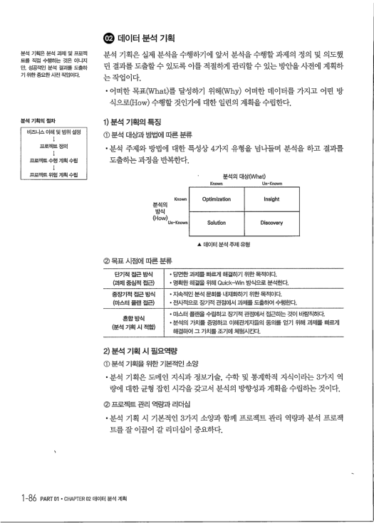
.

데이터 분석 기획 분석 기획은 분석 과제 및 프로젝 트를 직접 수행하는 것은 아니지 만 , 성공적인 분석 결과를 도출하 기 위한 중요한 사전 작업이다． 분석 기획은 실제 분석을 수행하기에 앞서 분석을 수행할 과제의 정의 및 의도했 던 결과를 도출할 수 있도록 이를 적절하게 관리할 수 있는 방안을 사전에 계획하 는작업이다．

- 어떠한 목표（What）를 달성하기 위해（Why) 어떠한 데이터를 가지고 어떤 방
식으로（How) 수행할 것인가에 대한 일런의 계획을 수립한다． 분석 기획의 절차 1) 분석 기획의 특징 비즈니스 이해 및 범위 설정 ① 분석 대상과 방법에 따른 분류 프로젝트 정의

- 분석 주제와 방법에 대한 특정상 4가지 유형을 넘나들며 분석을 하고 결과를
도출하는 과정을 반복한다． 프로젝트 수행 계획 수립 프로젝트 위험 계획 수립 분석의 대상《What) Known Un-Known Kflown 분석의 방식 (How)Un-Kn。wn Optimization Insi助t Solution Discovery ▲ 데이터 분석 주제 유형 ② 목표 시점에 따른 분류 （과제 줌심적 접근）

- 당면한 과저隱 빠르게 해결하기 위한 목적이다．
단기적 접근 방식

- 명확한 해결을 위해 Quick-Win 방식으로 분석한다．
- 지속적인 분석 문화를 내재화하기 위한 목적이다． 
- 전사적으로 장기적 관점에서 과제를 도출하여 수행한다．
쥣f기적 접근 방식 （마스터 플랜 접근）

- 마스터 플랜을 수립하고 장기적 관점에서 접근하는 것이 바람직하다．
혼합 방식

- 분석의 가치를 증명하고 이해관계자들의 동의를 얻기 위해 과제를 빠르게
（분석 기획 시 적합） 해결하여 그 가치를 조기에 체험시킨다． 2) 분석 기획 시 필요역량 ① 분석 기획을 위한 기본적인 소양

- 분석 기획은 도메인 지식과 정보기술 , 수학 및 통계학적 지식이라는 3가지 역
량에 대한 균형 잡힌 시각을 갖고서 분석의 방향성과 계획을 수립하는 것이다． ② 프로젝트 관리 역량과 리더십

- 분석 기획 시 기본적인 3가지 소양과 함께 프로젝트 관리 역량과 분석 프로젝
트를 잘 이끌어 갈 리더십이 중요하다． 1-86 PART01 . CHAPTER02 데이터 분석 계획

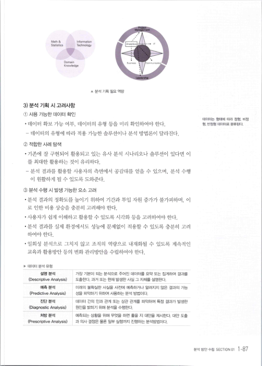
Math & Information Statistics …： Technology Domain Knowledge A 분석 기획 필요 역량 3) 분석 기획 시 고려사항 ① 사용 가능한 데이터 확인

- 데이터 확보 가능 여부 , 데이터의 유형 등을 미리 확인하여야 한다．
- 데이터의 유형에 따라 적용 가능한 솔루션이나 분석 방법론이 달라진다．
② 적합한 사례 탐색

- 기존에 잘 구현되어 활용되고 있는 유사 분적 시나리오나 솔루션이 있다면 이 
를 최대한 활용하는 것이 유리하다．

- 분적 결과를 활용할 사용자의 측면에서 공감대를 얻을 수 있으며 , 분석 수행
이 원활하게 될 수 있도록 도와준다． ③ 분석 수행 시 발생 가능한 요소 고려

- 분적 결과의 정확도를 높이기 위하여 기간과 투입 자원 증가가 불가피하며 , 이 
로 인한 비용 상승을 충분히 고려해야 한다．

- 사용자가 쉽게 이해하고 활용할 수 있도록 시각화 등을 고려하여야 한다 .
- 분석 결과를 실제 환경에서도 성능에 문제없이 적용할 수 있도록 충분히 고려
하여야 한다 .

- 일회성 분석으로 그치지 않고 조직의 역량으로 내재화될 수 있도록 계속적인
교육과 활용방안 등의 변화 관리방안을 수립하여야 한다．

* 데이터 분석 유형
설명 분석 가장 기본이 되는 분석으로 주어진 데이터를 요약 또는 집계하여 결과를 도출한다 . 과거 또는 현재 발생한 사실 그 자처屠 설명한다． (Descriptive Analysis) 예측 분석 미래의 불확실한 사실을 사전에 예측하거나 알려지지 않은 결과의 가능 (Predictive Analysis) 성을 파악하기 위하여 사용하는 분석 방법이다＝ 진단 분석 데이터 간의 인과 관계 또는 상관 관계를 파악하여 특정 결과가 발생한 (Diagnostic Analysis) 원인을 밝히기 위해 분석을 수행한다． 처방 분석 예측되는 상황을 위해 무엇을 하연 좋을 지 대안을 제시한다 . 대안 도출 (Prescriptive Analysis) 과 의사 결정은 물론 일부 실행까지 진행하는 분석방법이다．

> 데이터는 형태에 따라 정형 . 비정 
형 , 반정형 데이터로분류된다．

> 분석빈띤土수립 SECTION 01 1 -87
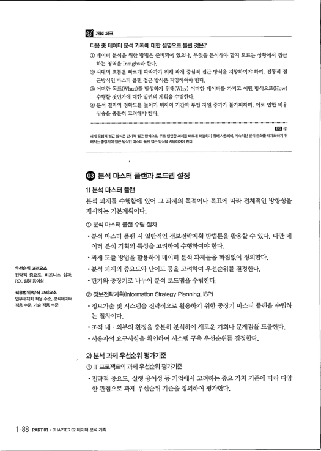
다음 중 데이터 분석 기획에 대한 설명으로 틀린 것은？ ① 데이터 분석을 위한 방법은 준비되어 있으나 , 무엇을 분석해야 할지 모르는 상황에서 접근 하는 영역을 Insight라 한다． ② 시대의 흐름을 빠르게 따라가기 위해 과제 중심적 접근 방식을 지향하여야 하며 , 전통적 접 근방식인 마스터 플랜 접근 방식은 지양하여야 한다． ③ 어떠한 목표《What）를 달성하기 위해（Why) 어떠한 데이터를 가지고 어떤 방식으로（How) 수행할 것인가에 대한 일련의 계획을 수립한다． ④ 분석 결과의 정확도를 높이기 위하여 기간과 투입 자원 증가가 불가피하며 , 이로 인한 비용 상승을 충분히 고려해야 한다． 과제 중심적 접근 방삭은 단기적 잡근 방식으로， 주로 당연한 과저屠 빠르게 해결하기 위해 사용되며 . 지속적인 분석 문화를 내재화하기 위 해서는 褻土기적 접근 방식인 마스터 플랜 접근 방식을 사용하여아 한다． .

분석 마스터 플랜과로드맵 설정 1) 분석 마스터 플랜 분석 과제를 수행함에 있어 그 과제의 목적이나 목표에 따라 전쳬적인 방향성을 제시하는 기본계획이다． ① 분석 마스터 플랜 수립 절차

#### · 분석 마스터 플랜 시 일반적인 정보전략계획 방법론을 활용할 수 있다 . 다만 데
이터 분석 기획의 특정을 고려하여 수행하여야 한다．

- 과제 도출 방법을 활용하여 데이터 분석 과제들을 빠짐없이 정의한다．
- 분석 과제의 중요도와 난이도 등을 고려하여 우선순위를 결정힌다．
우선순위 고려요소 전략적 중요도 , 비즈니스 성과．

- 단기와 중장기로 나누어 분석 로드맵을 수립한다 .
RO! . 실행용이성 적용범위／방식 고려요소 ② 정보전략계획ㅇnformation Strategy Planning. ISP) 업무내재화 적용 수준. 분석데이터 적용수준, 기술 적용수준

- 정보기술 및 시스템을 전략적으로 활용하기 위한 중장기 마스터 플랜을 수립하
는 절차이다．

#### · 조직 내 · 외부의 환경을 충분히 분석하여 새로운 기회나 문제점을 도출한다．
#### · 사용자의 요구사항을 확인하여 시스템 구축 우선순위를 결정한다 .
2) 분석 과제 우선순위 평가기준 (j기T 프로젝트의 과제 우선순위 평가기준

- 전략적 중요도 , 실행 용이성 등 기업에서 고려하는 중요 가치 기준에 따라 다양
한 관점으로 과제 우선순위 기준을 정의하여 평가한다． 1-88 PART01 . CHAPTER02 데이터분석 계획

> El ②
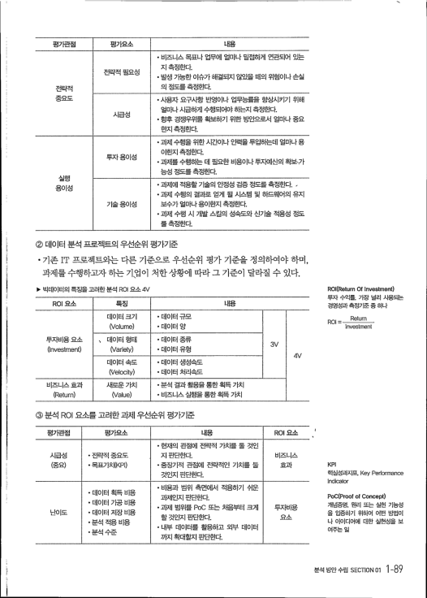
평가관점 평가요소 내용

- 비즈니스 목표나 업무에 얼마나 밀접하게 연관되어 있는
지 측정한다．

- 발생 가능한 이슈가 해결되지 않았을 때의 위험이나 손실
전략적 필요성 의 정도를 측정힌다．

# 鎣
- 사용자 요구사항 반영이나 업무능률을 향상시키기 위해
얼마나 시급하게 수행되어야 하는지 측정한다． 시급성

- 향후 경젱우위를 확보하기 위한 방안으로人I 얼마나 중요
한지 측정한다．

- 과제 수행을 위한 시간이나 인력을 투입하는데 얼마나 용
이한지 측정한다．

- 과제를 수행하는 데 필요한 비용이나 투자예산의 확보아
투자용이성 능성 정도를 측정한다．

# 鎰
- 과제에 적용할 기술의 안정성 검증 정도를 측정한다. ,
- 과제 수행의 결과로 얻게 될 시스템 및 하드웨어의 유지
보수가 얼마나 용이한지 측정힌다．

- 과제 수행 시 개발 스킬의 성숙도와 신기술 적용성 정도
기술용이성 를 측정한다． ② 데이터 분석 프로젝트의 우선순위 평가기준

- 기존 IT 프로젝트와는 다른 기준으로 우선순위 평가 기준을 정의하여야 하며，
과제를 수행하고자 하는 기 업이 처한 상황에 따라 그 기준이 달라질 수 있다．

> 빅데이터의 특징을 고려한 분석 R() 요소 4V
R(긔 요소 특징 내용 데이터 크기

- 데이터 규모
- 데이터 양
(Volume) 투자비용 요소

- 데이터 종류 
- 데이터 유형
, 데이터 형태 3V (Investment) (Variety) 데이터 속도

- 데이터 생성속도
- 데이터 처리속도
(Velocity) 비즈니스 효과 새로운 가치

- 분석 결과 횔용을 통한 획득 가치 
- 비즈니스 실행을 통한 획득 가치
(Return) (Value) ③ 분석 ROI 요소를 고려한 과제 우선순위 평가기준 평가관점 평가요소 내용 R이 요소

- 현재의 관점에 전략적 가치를 둘 것인 
지 판단힌다.

- 중장기적 관점에 전략적인 가치를 둘
비즈니스 （충요）

- 전략적 중요도
시급성

- 목표가치α(P1)
효과 것인지 판단한다．

- 비용과 범위 측면에서 적용하기 쉬운
- 데이터 획득 비용 
- 데이터 7긍 비용
과제인지 판단한다．

- 과제 범위를 PoC 또는 처음부터 크게
투자비용 난이도

- 데이터 저장 비용
할 것인지 판단한다．

- 내부 데이터를 활용하고 외부 데이터
`＝구가｀

- 분석 적용 비용 
- 분석 수준
까지 확대할지 핀단힌다．

> ROI(Return Of Investment) 
투자 수익률. 가장 널리 사용되는 경영성과 측정기준 중 하나

> ROI=  
Return Investment

> 4V
> K의
> 핵심성과지표， Key Performance 
Indicator

> PoC(Proof of Concept) 
개념증명 . 원리 또는 실현 가능성 을 입증하기 위하여 어떤 방법이 나 아이디어에 대한 실현성을 보 여주는 일

> 분석방안수립 SECTION 01 1 -89
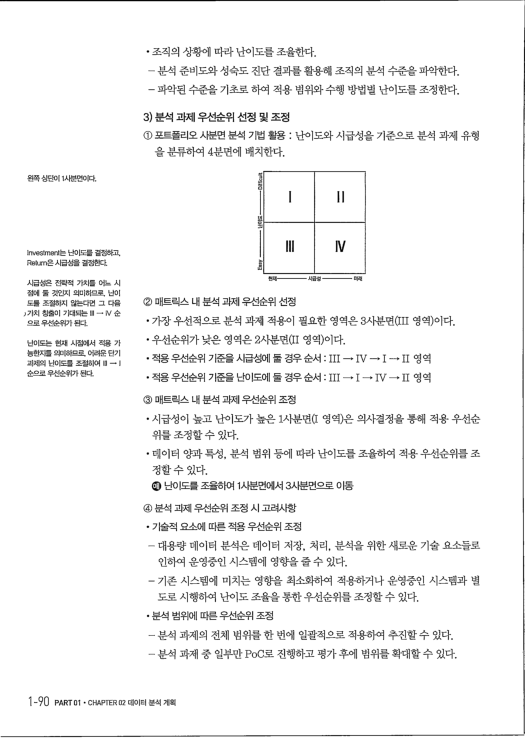
- 조직의 상황에 따라 난이도를 조율한다．
- 분적 준비도와 성숙도 진단 결과를 활용해 조직의 분적 수준을 파악한다．
- 파악된 수준을 기초로 하여 적용 범위와 수행 방법별 난이도를 조정한다．
3) 분석 과제 우선순위 선정 및 조정

#### ① 포트폴리오 사분면 분석 기법 활용 : 난이도와 시급성을 기준으로 분석 과제 유형 
을 분류하여 4분면에 배치한다． 왼쪽 싣단이 1사분면이다． 쌥 긍 ∼ ∼ ㅄ 石 머 긍 m 締 出 -

## II
### m
#### 'V
Investment는 난이도를 결정하고， Return은 시급성을 결정한다． 현재 시급성 미래 시급성은 전략적 가치를 어느 시 점에 들 것인지 의미하므로， 난이 도를 조절하지 않는다면 그 다음 , 가치 창출이 기대되는 III - I\/ 순 으로 우선순위가 된다． ② 매트릭스 내 분석 과제 우선순위 선정

- 가장 우선적으로 분석 과제 적용이 필요한 영역은 3사분면（m 영역）이다．
- 우선순위가 낮은 영 역은 2사분면（II 영역）이다．
난이도는 현재 시점에서 적용 가 능한지를 의미하므로， 어려운 단기

#### · 적용 우선순위 기준을 시급성에 둘 경우 순서 : III- IV--*I--II 영역
과제의 난이도를 조절하여 ∥ -

- 
순으로 우선순위가 된다．

#### · 적용 우선순위 기준을 난이도에 둘 경우 순서 : III -'J-
IV--II 영 역 ③ 매트릭스 내 분석 과제 우선순위 조정

- 시급성이 높고 난이도가 높은 1사분면（1 영역）은 의사결정을 통해 적용 우선순
위를 조정할 수 있다 .

- 데이터 양과특정 , 분석 범위 등에 따라 난이도를 조율하여 적용 우선순위를 조
정할 수 있다． 硼I 난이도를 조율하여 1사분면에서 3사분면으로 이동 ④ 분석 과제 우선순위 조정 시 고려사항

- 기술적 요소에 따른 적용 우선순위 조정
- 대용량 데이터 분석은 데이터 저장 , 처리 , 분석을 위한 새로운 기술 요소들로
인하여 운영중인 시스템에 영향을 줄 수 있다．

- 기존 시스템에 미치는 영향을 최소화하여 적용하거나 운영중인 시스템과 별
도로 시행하여 난이도 조율을 통한 우선순위를 조정할 수 있다 .

- 분석 범위에 따른 우선순위 조정
- 분석 과제의 전쳬 범위를 한 번에 일괄적으로 적용하여 추진할 수 있다．
- 분석 과제 중 일부만 PoC로 진행하고 평가 후에 범위를 확대할 수 있다．
1-90 PART이 · CHAPTER02 데이터분석계획

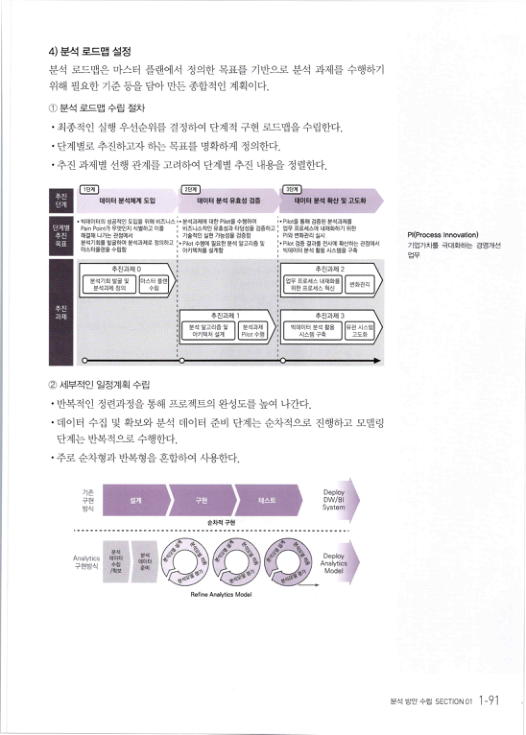
4) 분석 로드맵 설정 분석 로드맵은 마스터 플랜에서 정의한 목표를 기반으로 분석 과제를 수행하기 위해 필요한 기준 등을 담아 만든 종합적인 계획이다． ① 분석 로드맵 수립 절차

- 최종적인 실행 우선순위를 결정하여 단계적 구현 로드맵을 수립한다．
- 단계별로 추진하고자 하는 목표를 명확하게 정의한다．
- 추진 과제별 선행 관계를 고려하여 단계별 추진 내용을 정렬한다．
蠅．l■ 데이터 분석 확산 및 고도화 데이터 분석체계 도입 데이터 분석 유효성 검증

- 빅데이터의 성공적인 도입을 위해 비즈니스 
Pain Point가 무엇인지 식별하고 이를 해결해 나가는 관점에서 분석기회를 발굴하여 분석과제로 정의하고 마스터푤랜을 수립함

- 분석과제에 대한 「Riot율 수행하여 
비즈니스적인 유효성과 타당성을 검증하고 기술적인 실현 가능성을 검증함 Pilot 수행에 필요한 분석 알고리즘 및 아키텍처를 설계함 Pilot올 통해 검증된 분석과제률 업무 프로세스에 내재화하기 위한 「기와 변화관리 실시 . 「게ot 검증 결과를 전사에 확산하는 관점에서 빅데이터 분석 활용 시스템을 구축 저 고 진 추 분석 알고리즘 및 아키텍처 설계 분석과제 Pilot 수행 0 ② 세부적인 일정계획 수립

- 반복적인 정련과정을 통해 프로젝트의 완성도를 높여 나간다．
- 데이터 수집 및 확보와 분석 데이터 준비 단계는 순차적으로 진행하고 모델링
단계는 반복적으로 수행한다．

- 주로 순차형과 반복형을 혼합하여 사용한다．
기존 구현 방식 Deploy DVw톄 System 순차적 구현 Deploy Analytics Model Analytics 구현방식 Refine Anafteics Model

> Pl(Process innovation)
> 기업가치를 극대화하는 경영개선 
01= L」ㄱ－

> 분석 벋［빤수립 SECTION 01 1 -이 
．

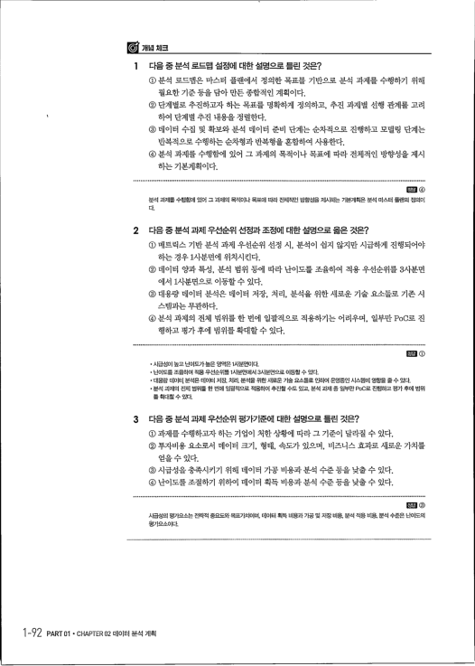
다음 중 분석 로드맵 설정에 대한 설명으로 틀린 것은？ ① 분석 로드맵은 마스터 플랜에서 정의한 목표를 기반으로 분석 과제를 수행하기 위해 필요한 기준 등을 담아 만든 종합적인 계획이다． ② 단계별로 추진하고자 하는 목표를 명확하게 정의하고 , 추진 과제별 선행 관계를 고려 하여 단계별 추진 내용을 정렬한다． ③ 데이터 수집 및 확보와 분석 데이터 준비 단계는 순차적으로 진행하고 모델링 단계는 반복적으로 수행하는 순차형과 반복형을 혼합하여 사용한다． ④ 분석 과제를 수행함에 있어 그 과제의 목적이나 목표에 따라 전쳬적인 방향성을 제시 하는 기본계획이다． 분석 과저隱 수행함에 있어 그 과제의 목적이나 목표에 따라 전쳬적인 방향성을 제시하는 기본계획은 분석 마스터 폴랜의 정의이 다． 2 다음중분석과제우선순위 선정과조정에 대한설명으로옳은것은？ ① 매트릭스 기반 분석 과제 우선순위 선정 시 , 분석이 쉽지 않지만 시급하게 진행되어야 하는 경우 1사분면에 위치시킨다． ② 데이터 양과 특정 , 분석 범위 등에 따라 난이도를 조율하여 적용 우선순위를 3사분면 에서 1사분면으로 이동할 수 있다． ③ 대용량 데이터 분석은 데이터 저장 , 처리 , 분석을 위한 새로운 기술 요소들로 기존 시 스템과는 무관하다． ④ 분석 과제의 전쳬 범위를 한 번에 일괄적으로 적용하기는 어려우며 , 일부만 PoC로 진 행하고 평가 후에 범위를 확대할 수 있다 .

- 시급성이 높고 난이도가높은 영역은 1사분면이다．
- 난이도를 조율하여 적용 우선순위를 1사분면에서 3사분면으로 이등할 수 있다．
r대용량 데이타 분석은 데이터 저장 , 처리 . 분석을 위한 사隍운 기술 요소돌로 인하여 운영중인 사스템에 영향을 줄수 있다．

- 분석 과제의 전쳬 범위를 한 번에 일괄적으로 적용하여 추진할 수도 있고 . 분석 과제 중 일부만 PoC로 진행하고 펑가 후에 범위
를 확대할 수 있다． 3 다음중분석 과제 우선순위 평가기준에 대한설명으로틀린 것은？ ① 과제를 수행하고자 하는 기업이 처한 상황에 따라 그 기준이 달라질 수 있다． ② 투자비용 요소로서 데이터 크기 , 형태 , 속도가 있으며 , 비즈니스 효과로 새로운 가치를 얻을 수 있다． ③ 시급성을 충족시키기 위해 데이터 가공 비용과 분석 수준 등을 낮출 수 있다． ④ 난이도를 조절하기 위하여 데이터 획득 비용과 분석 수준 등을 낮출 수 있다． 시급성의 평가요조돈 전략적 중요도와 목표가치이며 . 데이터 획득 비용과 가공 및 저장 비용 , 분석 적용 비용, 분석 수준은 낸기도의 평가요소이다． 1-92 PART 01 . CHAPTER 02 데이터 분석 계획

> j 
④

> 덛미 ①
> 目勵 ③
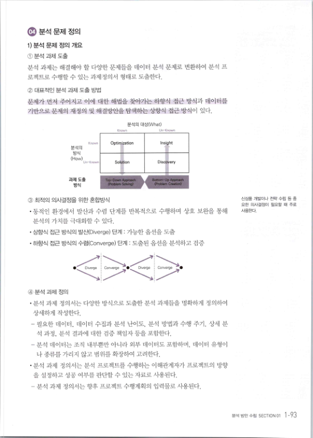
.

분석 문제 정의 1) 분석 문제 정의 개요 ① 분석 과제 도출 분석 과제는 해결해야 할 다양한 문제들을 데이터 분석 문제로 변환하여 분석 프 로젝트로 수행할 수 있는 과제정의서 형태로 도출한다． ② 대표적인 분석 과제 도출 방법 문제가 먼저 주어지고 이에 대한 해법을 찾아가는 하향식 접근 방식과 데이터를 기반으로 문쟤의 재정의 및 해결방안을 탐색하는 상향식 접근 방식이 있다． 분석의 대상（VVhat) Known Un-Known Optimization Insight Known 분석의 방식 (How) Un-Known

# Solution 
Discovery -- 과제 도출 방식 ③ 최적의 의사결정을 위한 혼힙빰식

- 동적인 환경에서 발산과 수렴 단계를 반복적으로 수행하며 상호 보완을 통해
분석의 가치를 극대화할 수 있다．

#### · 상향식 접근 방식의 발'!(Diverge) 단계 : 가능한 옵션을 도출
#### · 하향식 접근 방식의 수렴（Converge) 단계 : 도출된 옵션을 분석하고 검증
# 盤鷺·
# ·즛〔
④ 분석 과제 정의

- 분석 과제 정의서는 다양한 방식으로 도출한 분석 과제들을 명확하게 정의하여
상세하게 작성한다．

- 필요한 데이터 , 데이터 수집과 분석 난이도 , 분석 방법과 수행 주기 , 상세 분
석 과정 , 분석 결과에 대한 검증 책임자 등을 포함한다．

- 분적 데이터는 조직 내부뿐만 아니라 외부 데이터도 포함하며 , 데이터 유형이
나 종류를 가리지 않고 범위를 확장하여 고려한다．

- 분적 과제 정의서는 분석 프로젝트를 수행하는 이해관계자가 프로젝트의 방향
을 설정하고 성공 여부를 판단할 수 있는 자료로 사용된다 .

- 분석 과제 정의서는 향후 프로젝트 수행계획의 입력물로 사용된다．
> 신상품 개발이나 전략 수립 등 중
> 요한 의사결정이 필요할 때 주로
> 사용한다．
> 분석 넌［단수립 SECTION 01 1 -93
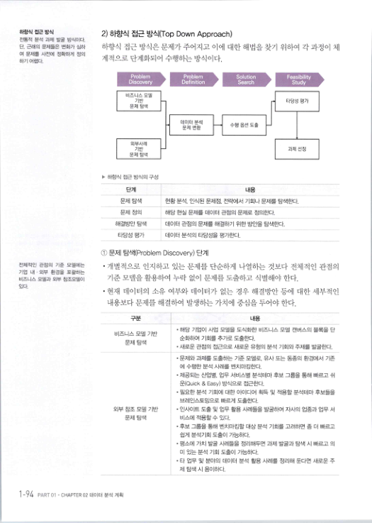
하향식 접근 방식 2) 하향식 접근 방식（Top Down Approach) 전통적 분석 과제 발굴 방식이다． 단 . 근래의 문제들은 변화가 심하 여 문처喝 사전에 정확하게 정의 하기 어렵다． 하향식 접근 방식은 문제가 주어지고 이에 대한 해법을 찾기 위하여 각 과정이 쳬 계적으로 단계화되어 수행하는 방식이다． Problem Discovery Problem Definition Solution Search 비즈니스 모델 기반 문제 탐색 데이터 분석 문제 변환 수행 옵션 도출 외부사례 기반 문제 탐색

> 하향식 접근 방식의 구셩
단계 내용 문제 탐색 현황 분석 . 인식된 문제점， 전략에서 기회나 문제를 탐색한다． 문제 정의 해당 현실 문제를 데이터 관점의 문제로 정의한다． 해결방안탐색 데이터 관점의 문제를 해결하기 위한 방안을 탐색한다． 타당성 펑가 데이터 분석의 타당성을 평가한다． ① 문제 탐색（Problem Discovery) 단계 전체적인 관점의 기준 모델에는 기업 내 · 외부 환경을 포괄하는 비즈니스 모델과 외부 참조모델이

- 개별적으로 인지하고 있는 문제를 단순하게 나열하는 것보다 전쳬적인 관점의
기준 모델을 활용하여 누락 없이 문제를 도출하고 식별해야 한다． 있다．

- 현재 데이터의 소유 여부와 데이터가 없는 경우 해결방안 등에 대한 세부적인
내용보다 문제를 해결하여 발생하는 가치에 중심을 두어야 한다． 구분 L卜욤

- 해당 기업이 사업 모델을 도식화한 비즈니스 모델 캔버스의 블록을 단
비즈니스 모델 기반 순화하여 기회를 추가로 도출한다． 문제 탐색

- 새로운 관점의 접근으로 새로운 유형의 분석 기회와 주저屠 발굴한다．
문제와 과제를 도출하는 기준 모델로 유사 또는 동종의 환경에서 기존 0ㅔ 수행한 분석 사례를 벤치마킹한다．

- 저공되는 산업별 . 업무 서비스별 분석테마 후보 그룹을 통해 ＂바뢰l 쉬
운《Quick & Easy) 방식으로 접근한다．

- 필요한 분석 기회에 대한 아이디어 획득 및 적용할 분석테마 후보들을
브레인스토밍으로 빠르게 도출한다． 외부 참조 모델 기반 인사이트 도출 및 업무 횔용 사례들을 발굴하여 자사의 업종과 업무 서 비스에 적용할 수 있다． 문제 탐색 후보 그룹을 통해 벤치마킹할 대상 분석 기회를 고려하면 좀 더 빠르고 쉽게 분석기회 도출이 가능하다 .

펑소에 가치 발굴 사례들을 정리해두면 과제 발굴과 탐색 시 빠르고 의 미 있는 분석 기회 도출이 가능하다． 타 업무 및 분야의 데이터 분석 활용 사례를 정리해 둔다면 새로운 주 제 탐색 시 용이하다． 1 -94 PART 01 . CHAPTER 02 데이터 분석 계획

> Feasibility 
Study

> 타당성 평가
> 과제 선정
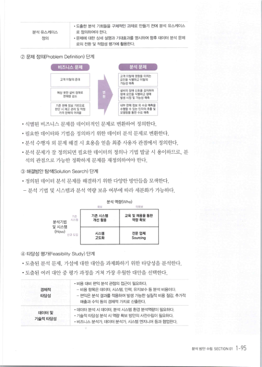
- 도출한 분석 기회들을 구체적인 과제로 만들기 전에 분석 유스케이스
분석 유스케이스 로정의하여야 한다． 정의

- 문제에 대한상세 설명과 기대효과를 명시하여 향후 데이터 분석 문제
로의 전환 및 적합성 펑가에 활용한다． ② 문제 정의（Problem Definition) 단계 분석 문제 비즈니스 문제 ㅣ 고객 이탈의 증대 「고객 이탈에 영향을DㅍF 요인올 식별하고 이탈의 가능성 예측

#### 예상못한설비 장애로 ㄱ
설비의 장애 신호를강지하여 ` 장애 요인을 식별하고 장애 발생 시점 및 가능성 예측 판매량 감소

# 기존 판매 정보 기반으로 
판단 시 재고 관리 및 적정 가격 판애의 어려움 뺙「 내부 판에 정보 외 수요 예측을 수행할 수 있는 인자의 추출 및 모델링을 통한 수요 예측

- 식별된 비즈니스 문제를 데이터적 인 문제로 변환하여 정의한다．
- 필요한 데이터와 기법을 정의하기 위한 데이터 분적 문제로 변환한다．
- 분적 수행자 외 문제 해결 시 효용을 얻을 최종 사용자 관점에서 정의한다．
- 분석 문제가 잘 정의되면 필요한 데이터의 정의나 기법 발굴 시 용이하므로 , 분
석의 관점으로 가능한 정확하게 문제를 재정의하여야 한다． ③ 해결방안 탐색（Solution Search) 단계

- 정의된 데이터 분석 문제를 해결하기 위한 다양한 방안들을 모색한다．
- 분적 기법 및 시스템과 분석 역량 보유 여부에 따라 세분화가 가능하다 .
분석 역량《Who) AI 기존 시스탬 개선 활용 교육 및 채용을 통한 역량 확보 분석기법 및 시스템 (How) 신규 도입 시스템 고도화 전문 업체 Sourcing ④ 타당성 평가（Feasibility Study) 단계

- 도출된 분석 문제 , 가설에 대한 대안을 과제화하기 위한 타당성을 분적한다．
- 도출된 여러 대안 중 평가 과정을 거쳐 가장 우월한 대안을 선택한다．
- 비용 대비 편익 분석 관점의 접ㅌ즈《기 필요하다．
경제적 비용 항목은 데이터 , 시스템 . 인력 , 유자보수 등 분석 비용이다． 타당성

- 편익은 분석 결과를 적용하여 발생 가능한 실질적 비용 절감 , 추가적
매출과 수익 등의 경제적 가차로 산출한다．

- 데이터 분석 시 데이터 , 분석 사스템 환경 분석역량이 필요하다．
데이터 및

- 기술적 타당성 분석 시 역량 확보 방안의 사전수립이 필요하다．
기술적 타당성

- 비즈니스 분석가 , 데이터 분석가 . 시스템 엔지니어 등과 협업한다．
> 분석벋빤수립 SECTION 01 1 -95
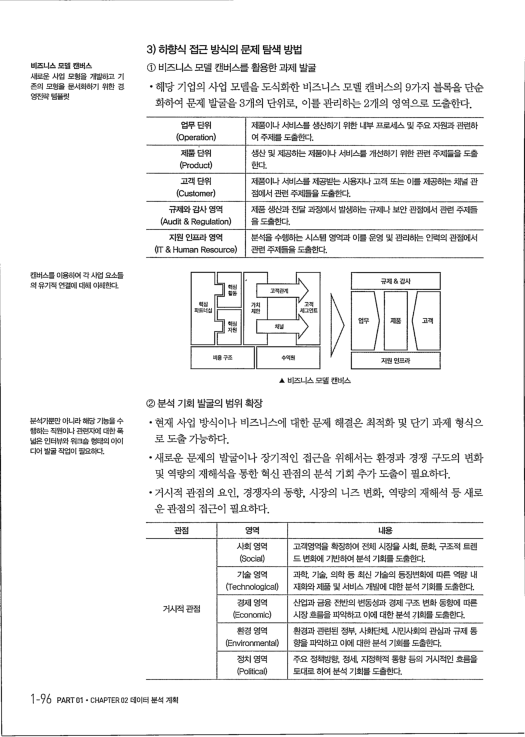
3) 하향식 접근 방식의 문제 탐색 방법 비즈니스 모델 캔버스 새로운 사업 모형을 개발하고 기 존의 모형을 문서화하기 위한 경 영전략 템플릿 ① 비즈니스 모델 캔버스를 활용한 과제 발굴

- 해당 기업의 사업 모델을 도식화한 비즈니스 모델 캔버스의 9가지 블록을 단순
화하여 문제 발굴을 3개의 단위로 , 이를 관리하는 2개의 영역으로 도출한다． 처居이나 서비스를 생산하기 위한 내부 프로세스 및 주요 차원과 관련하 업무 단위 (Operation) 여 주제를 도출한다． 저푿 단위 (Product) 생산 및 ㅈI隧줅하는 제품이나 서비스를 개선하기 위한 관련 주저隱을 도출 한다． 얘 (Cust 저曆이나 서비스를 저居받는 사용자나 고객 또는 이를 저居하는 채널 관 점에서 관련 주처隱을 도출한다． 규제와 감사 영역 저曆 싣多산과 전달 과정에서 발생하는 규제나 보안 관점에서 관련 주제들 을 도출한다． (Audit & Regulation) 지원 인프라 영역 분석을 수행하는 시스템 영역과 이를 운영 및 관리하는 인력의 관점에서 곤븟크 주제들을 도출힌다． (IT & Human Resource) 캔버스를 이용하여 각 사업 요소들 의 유기적 연결에 대해 이해한다． 고객관계 ;l짚 세그먼트 LL 핵심 자원 채널

## r
비용 구조 수익원 ▲ 비즈니스모델 캔버스 ② 분석 기회 발굴의 범위 확장 분석가뿐만 아니라해당 기능을 수 행하는 직원이나 괸텬자에 대한 폭 넓은 인터뷰와 워크숍 형태의 아이 디어 발굴 작업이 필요하다．

- 현재 사업 방식이나 비즈니스에 대한 문제 해결은 최적화 및 단기 과제 형식으 
로 도출 가능하다．

- 새로운 문제의 발굴이나 장기적인 접근을 위해서는 환경과 경챙 구도의 변화 
및 역량의 재해석을 통한 혁신 관점의 분석 기회 추가 도출이 필요하다．

#### · 거시적 관점의 요인 , 경챙자의 동향 , 시장의 니즈 변화, 역량의 재해석 등 새로 
운 관점의 접근이 필요하다． 관점 영역 내용 고객영역을 확장하여 전체 시장을 사회 , 문화, 구조적 트렌 드 변화에 기반하여 분석 기회를 도출힌다． 사회 영역 (Social) 기술 영역 과학. 기술, 의학 등 최신 기술의 등장변화에 따른 역량 내 재화와제품 및 서비스 개발에 대한분석 기회를 도출한다． (Technological) 경제 영역 산업과 금융 전반의 변동성과 경제 구조 변화 동향에 따른 시장흐름을 파악하고 이에 대한분석 기회를 도출한다． 거시적 관점 (Economic) 환경 영역 환경과 곤봇크된 정부， 사회단쳬 , 시민사회의 관심과 규제 동 향을 파악하고 이에 대한 분석 기회를 도출한다． (Environmental) 정치 영역 주요 정책방향, 정세 , 지정학적 동향 등의 거시적인 흐름을 토대로 하여 분석 기회를 도출한다． (Political) 1-?6 PART01 . CHAPTER 02 데이터분석계획

> 규저l & 감사
> 제풍
> 고객
> 지원 인프라
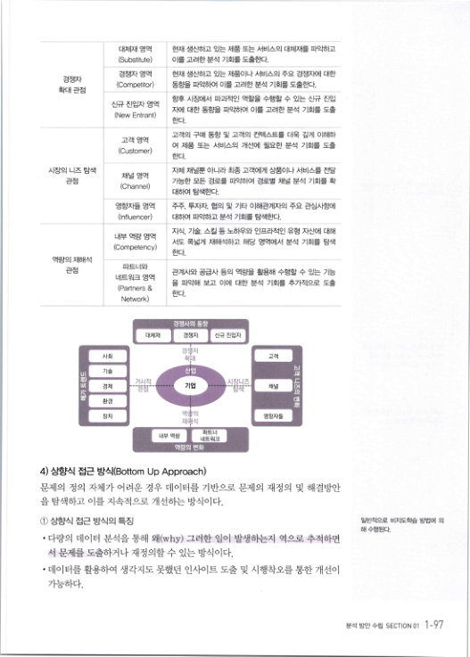
현재 생신同고 있는 제품 또는 서비스의 대체재를 파악하고 대체재 영역 이를 고려한 분석 기회를 도출한다． (Substitute) 현재 생산하고 있는 저픔이나 서비스의 주요 경쟁자에 대한 경쟁자 영역 경쟁자 동향을 파악하여 이를 고려한 분석 기회를 도출한다． (Competitor) 확대관점 향후 시장에서 파괴적인 역할을 수행할 수 있는 신규 진입 신규 진입자 영역 자에 대한 동향을 파악하여 이를 고려한 분석 기회를 도출 (New Entrant) 한다． 고객의 구매 동향 및 고객의 컨텍스트를 더욱 깊게 이해하 고객 영역 여 저픔 또는 서비스의 개선에 필요한 분석 기회를 도출 (Customer) 핸가． 시장의 니즈 탐색 자체 채널뿐 아니라 최종 고객에게 상품이나 서비스를 전달 채널 영역 가능한 모든 경로를 파악하여 경로별 채널 분석 기회를 확 관점 (Channel) 대하여 탐색한다． 주주 , 투자자 . 협의 및 기타 이해관계자의 주요 관심사항에 영힁짜들 영역 대하여 파악하고 분석 기회를 탐색힌빠． (Intluencer) 지식 . 기술 . 스킬 등 노하우와 인프라적인 유형 자신뻬 대해 내부 역량 영역 서도 폭넓게 자后ㅐ석하고 해당 영역에서 분석 기회를 탐색 (Competency) 한다． 역량의 재해석 파트너와 관점 관7卄사와 공급사 등의 역량을 활용해 수행할 수 있는 기능 을 파악해 보고 이에 대한 분석 기회를 추가적으로 도출 네트워크 영역 (Partners & 힌ㅐ각． Network)

#### 경쟁사의 동향 
ㅁ逈■驪皿· 신규 진입자 고객 경주）자 확！：거 사회 ㅂ 窪 ㅍ 拐 쑈 阻 攣 채널 시장니즈 탐색 거시적 -－칸청· 비 網 삐 ｀ 苦 환경 정치 역랑의 ㅈㅐ혜석 영향자들 4) 상향식 접근 방식（Bottom Up Approach) 문제의 정의 자쳬가 어려운 경우 데이터를 기반으로 문제의 재정의 및 해결방안 을 탐색하고 이를 지속적으로 개선하는 방식이다． ① 상향식 접근 방식의 특징

- 다량의 데이터 분석을 통해 왜（why) 그러한 일이 발생하는지 역으로 추적하면
서 문제를 도출하거나 재정의할 수 있는 방식이다．

- 데이터를 활용하여 생각지도 못했던 인사이트 도출 및 시행착오를 통한 개선이
가능하다．

## -
> 일반적으로 비자도학습 방법에 의 
해 수행된다．

> 분석덛［빤수립 SECTION 01 1 -97
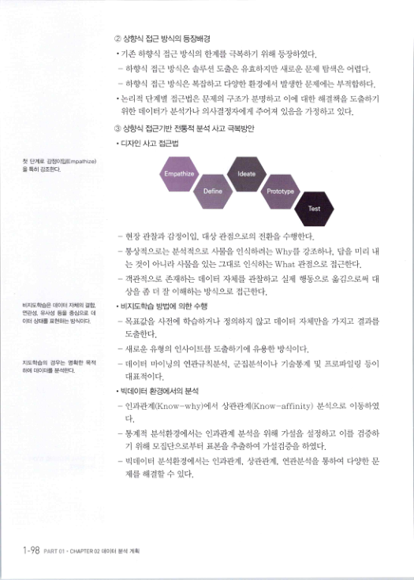
② 상향식 접근 방식의 등장배경

- 기존 하향식 접근 방식의 한계를 극복하기 위해 등장하였다．
하향식 접근 방식은 솔루션 도출은 유효하지만 새로운 문제 탐색은 어렵다．

- 하향식 접근 방식은 복잡하고 다양한 환경에서 발생한 문제에는 부적합하다．
- 논리적 단계별 접근법은 문제의 구조가 분명하고 이에 대한 해결책을 도출하기
위한 데이터가 분석가나 의사결정자에게 주어져 있음을 가정하고 있다． ③ 상향식 접근기반 전통적 분석 사고 극복방안

- 디자인 사고 접근법
첫 단계로 감정이입（Empathize) 을 특히 강조한다． 현장관찰과감정이입 , 대상관점으로의 전환을수행한다．

- 통상적으로는 분석적으로 사물을 인식하려는 ￦hy를 강조하나 , 답을 미리 내 
는 것이 아니라 사물을 있는 그대로 인식하는 What 관점으로 접근한다．

- 객관적으로 존재하는 데이터 자체를 관찰하고 실제 행동으로 옮김으로써 대
상을 좀 더 잘 이해하는 방식으로 접근한다．

- 비지도학습 방법에 의한 수행
비자도학습은 데이터 자체의 결합． 연관성 , 유사성 등을 중심으로 데

- 목표값을 사전에 학습하거나 정의하지 않고 데이터 자쳬만을 가지고 결과를
이터 상태를 표현하는 방식이다． 도출한다．

- 새로운 유형의 인사이트를 도출하기에 유용한 방식이다．
- 데이터 마이닝의 연관규칙분적 , 군집분석이나 기술통계 및 프로파일링 등이
지도학습의 경우는 명확한 목적 하에 데이터를 분석한다． 대표적이다．

- 빅데이터 환경에서의 분석
- 인과관계（Know-why）에서 상관관계（Know-affinity) 분적으로 이동하였
다．

- 통계적 분적환경에서는 인과관계 분적을 위해 가설을 설정하고 이를 검증하
기 위해 모집단으로부터 표본을 추출하여 가설검증을 하였다．

- 빅데이터 분석환경에서는 인과관계 , 상관관계 , 연관분적을 통하여 다양한 문
제를 해결할 수 있다． ㅏ 8 PART01 · CHAPTER02데이터분석계획

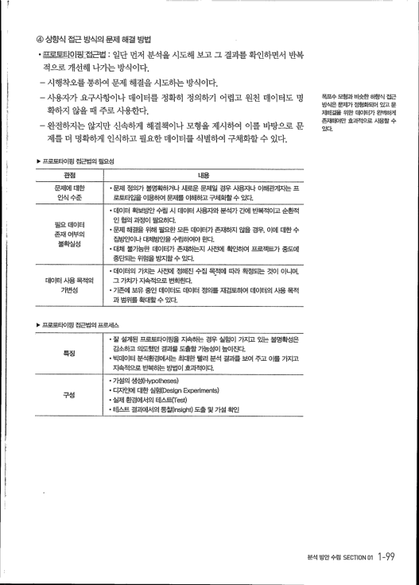
④ 상향식 접근 방식의 문제 해결 방법

#### · 些토타이핑뜨접근법 : 일단 먼저 분석을 시도해 보고 그 결과를 확인하면서 반복
적으로 개선해 나가는 방식이다．

- 시행착오를 통하여 문제 해결을 시도하는 방식이다．
- 사용자가 요구사항이나 데이터를 정확히 정의하기 어렵고 원천 데이터도 명
확하지 않을 때 주로 사용한다．

- 완전하지는 않지만 신속하게 해결책이나 모형을 제시하여 이를 바탕으로 문
제를 더 명확하게 인식하고 필요한 데이터를 식별하여 구쳬화할 수 있다．

> 프로토타이핑 접근법의 필요성
관점 내용 문제에 대한 인식 수준

- 문제 정의가 불명확하거나 새로운 문제일 경우 사용ㅈ빠 이해관계자는 프
로토타입을 이용하여 문제를 이해하고 구체화할 수 딧』［다．

- 데이터 확보방안 수립 시 데이터 사용자와 분석가 간에 반복적이고 순환적 
인 협의 과정이 필요하다．

- 문제 해결을 위해 필요한 모든 데이터가 존재하지 않을 경우, 이에 대한 수
필요 데이터 존재 여부의 집방안이나 대체방안을 수립하여야 한다．

- 대체 불가능한 데이터가 존재하는지 사전에 확인하여 프로젝트가 중도에
불확실성 중단되는 위험을 방지할 수 있다．

- 데이터의 가치는 사전에 정해진 수집 목적에 따라 확정되는 것이 아니며． 
그 가치가 지속적으로 변화한다．

- 기존에 보유 중인 데이터도 데이터 정의를 재검토하여 데이터의 사용 목적 
과 범위를 확대할 수 있다． 데이터 시용 목적의 가변성

> 프로토타이핑 잡근법의 프로세스
- 잘 설계된 프로토타이핑을 지속하는 경우 실험이 가지고 있는 불명확성은 
감소하고 의도했던 결과를 도출할 가능성이 높아진다．

- 빅데이터 분석환경에서는 최대한 빨리 분석 결과를 보여 주고 이를 가지고
특징 지속적으로 반복하는 방법이 효과적이다．

- 가설의 생성(Hypotheses) 
- 디자인에 대한 실험（Design Experiments) 
- 실제 환경에서의 테스트（ㅜest) 
- 테스트 결과에서의 통칠.nsic牀） 도출 및 가설 확인
구성

> 폭포수 모형과 비슷한 하향식 접근 
방식은 문제가 정형화되어 있고 문 제해결을 위한 데이터가 완벽하게 존재해야만 효과적으로 시용할 수

> 있다．
> 분석방안수립 SECTION01 1-99
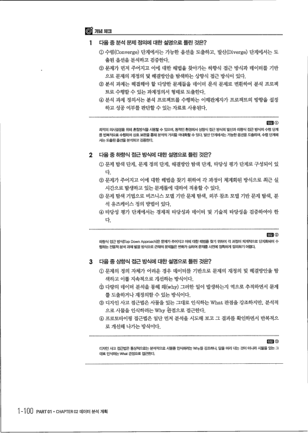
1 다음 중 분석 문제 정의에 대한 설명으로 틀린 것은？ ① 수렴（Converge) 단계에서는 가능한 옵션을 도출하고 , 발산（Diverge) 단계에서는 도 출된 옵션을 분석하고 검증한다． ② 문제가 먼저 주어지고 이에 대한 해법을 찾아가는 하향식 접근 방식과 데이터를 기반 으로 문제의 재정의 및 해결방안을 탐색하는 상힝칙 접근 방식이 있다． ③ 분석 과제는 해결해야 할 다양한 문쳬들을 데이터 훈석 문제로 변환하여 분석 프로젝 트로 수행할 수 있는 과제정의서 형태로 도출한다． ④ 분석 과제 정의서는 분석 프로젝트를 수행하는 이해관계자가 프로젝트의 방향을 설정 하고 성공 여부를 판단할 수 있는 자료로 사용된다． 최적의 의사결정율 위해 혼蓉彪식을 사용할 수 있요며 , 동적인 환경에서 상향식 접근 방식의 발산과 하항식 잡근 방식의 수렴 단계 를 반복적으로 수행하며 상호보완을통해 분석의 가치를 극대화할 수 있다 . 발산 단계에서는 가능한 옵션을 도출하며 . 수렴 단계에 서는 도춥된 옵션을 분석하고 검증한다． 2 다음 중 하향식 접근 방식에 대한 설명으로 틀린 것은？ ① 문제 탐색 단계 , 문제 정의 단계 , 해결방안 탐색 단계 , 타당성 평가 단계로 구성되어 있 다． ② 문제가 주어지고 이에 대한 해법을 찾기 위하여 각 과정이 쳬계화된 방식으로 최근 실 시간으로 발생하고 있는 문제들에 대하여 적용할 수 있다． ③ 문제 탐색 기법으로 비즈니스 모델 기반 문제 탐색 , 외부 참조 모델 기반 문제 탐색 , 분 석 유즈케이스 정의 방법이 있다． ④ 타당성 평가 단계에서는 경제적 타당성과 데이터 및 기술적 타당성을 검증하여야 한 다． 하항식 잡근 방식（rop Down Approach）은 문제가 주어자고 이에 대한 해법을 찾기 위하여 각 과정이 체계적으로 단계화되어 수 행하뇬 전통적 분석 과제 발굴 방식으로근래의 문제들은 변화가 심하여 문저喝 사전에 정확하게 정의하기 어렵다． 3 다음중상향식 접근 방식에 대한설명으로틀린 것은？ ① 문제의 정의 자쳬가 어려운 경우 데이터를 기반으로 문제의 재정의 및 해결방안을 탐 색하고 이를 지속적으로 개선하는 방식이다． ② 다량의 데이터 분석을 통해 왜（why) 그러한 일이 발생하는지 역으로 추적하면서 문제 를 도출하거나 재정의할 수 있는 방식이다． ③ 디자인 사고 접근법은 사물을 있는 그대로 인식하는 What 관점을 강조하지만 , 분석적 으로 사물을 인식하려는Why 환점으로 접근한다． ④ 프로토타이핑 접근법은 일단 먼저 분석을 시도해 보고 그 결과를 확인하면서 반복적으 로 개선해 나가는 방식이다． 디자인 사고 잡근법은 통상적으로는 분석적으로 사器 인식ㅎ罔는 Why룰 강조하나. 답을 미리 내는 것이 아니라 사뚫 있는 그 대로 인식하는WIat 관점으로 球焚〕 다． 1-100 PARTD1 * CHAPTER02 데이터분석 계획

> ㅁ래①
> ㅁ 3 ②
> 輞 
③ l

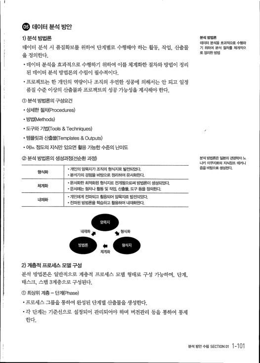
.

데이터 분석 빙빤 1) 분석 방법론 데이터 분석 시 품질확보를 위하여 단계별로 수행해야 하는 활동 , 작업 , 산출물 을 정의한다．

- 데이터 분석을 효과적으로 수행하기 위하여 이를 쳬계화한 절차와 방법이 정리 
된 데이터 분석 방법론의 수립이 필수적이다．

- 프로젝트는 한 개인의 역량이나 조직의 우연한 성공에 의해서는 안 되고 일정
품질 수준 이상의 산출물과 프로젝트의 성공 가능성을 제시해야 한다． ① 분석 방법론의 구성요건

- 상세한 절차（Procedures)
- 방법（Methods)
- 도구와 기법（Tools & Techniques)
- 템플릿과산출물《Tern이ates & Outputs)
- 어느 정도의 지식만 있으면 활용 가능한 수준의 난이도
② 분석 방법론의 생성과정（선순환 과정） 형식화

- 개인의 암묵지가 조직의 형식지로 발전되었다． 
- 분석가의 경험을 바탕으로 정리하여 문서화한다．
체계화

- 문서화한 최적화된 형식지로 전개됨으로쩌 방법론이 생성되었다． 
- 문서에는 절차나 활동 및 작업 , 산출을 . 도구 등을 정의힌다．
내재화

- 개인에게 전파되고 횔용되어 암묵지로 발전되었다． 
- 전파된 방법론을 학습하고 횔용하여 내재화한다．
2) 계층적 프퇘스 모델 구성 분석 방법론은 일반적으로 계층적 프로세스 모델 형태로 구성 가능하며 , 단계， 태스크 , 스텝 3계층으로 구성된다． ① 최상위 계층 - 단계（Phase)

- 프로세스 그룹을 통하여 완성된 단계별 산출물을 생성한다．
- 각 단계는 기준선으로 설정되어 관리되어야 하며 버전관리 등을 통하여 통제
한다．

> 분석 방법론
> 데이터 분석을 효과적으로 수행하 
기 위하여 분석 절차를 체계적으 로 정리한 방법

> /
> 분석 방법론은 일본의 경영학자노 
나카 이쿠지로의 지식창조 매커니 즘을 바탕으로 생성된다．

> 분석방안수립 sEcㄲ0N01 1-101
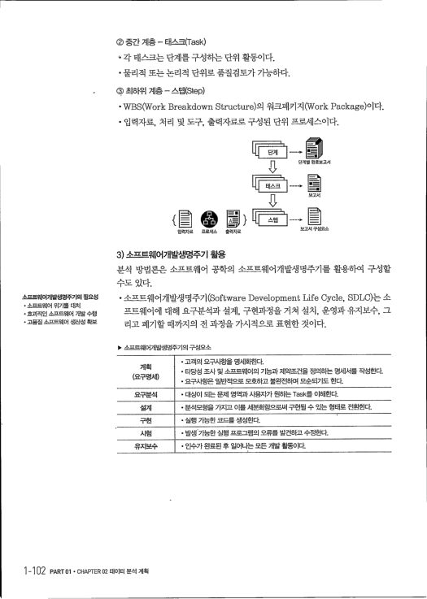
② 중간 계층 - 태스크（Task) , 각 태스크는 단계를 구성하는 단위 활동이다．

- 물리적 또는 논리적 단위로 품질검토가 가능하다．
③ 최하위 계층 - 스텝（Step)

- WBS(Work Breakdown Structure）의 워크패키지（Work Package）이다．
- 입력자료 , 처리 및 도구 , 출력자료로 구성된 단위 프로세스이다．
단계 ∼∼＞ 태스크 스텝 －→ 트」 보고서 구성요소 입력자료 프로세스 출력자료 3) 소프트웨어개발생명주기 활용 분석 방법론은 소프트웨어 공학의 소프트웨어개발생명주기를 활용하여 구성할 수도 있다．

- 소프트웨어개발생명주기（Software Development Life Cycle, SDLC）는 소
소프트웨어개발생명주기의 필요성

- 소프트뭬어 위기를 대처 
- 효과적인 소프트웨어 개발 수행 
- 고품질 소프트웨어 생산성 확보
프트웨어에 대해 요구분석과설계 , 구현과정을 거쳐 설치 , 운영과유지보수 , 그 리고 폐기할 때까지의 전 과정을 가시적으로 표현한 것이다． 》 소프트웨어개발생명주기의 구성요소

- 고객의 요구사항을 명세화한다．
계획

- 타당성 조사 및 소프트웨어의 기능과 제약조건을 정의하는 명세서를 작성한다．
（요구명세）

- 요구사항은 일반적으로 모호하고 불완전하며 모순되기도 힌다．
요구분석

- 대상이 되는 문제 영역과 사용자가 원하는 ㅜas（를 이해한다．
설계

- 분석모형을 가지고 이를 세분화함으로쩌 구현될 수 있는 형태로 전환한다．
구현

- 실행 가능한 코드를 생성한다．
시험

- 발생 " 가능한 실행 프로그램의 오류를 발견하고 수정한다．
유지보수

- 인수가 완료된 후 일어나는 모든 개발 횔동이다．
1 -102 PART 01 . CHAPTER 02데이터분석 계획

## i111
> 단계별 완료보고서
> 보고서
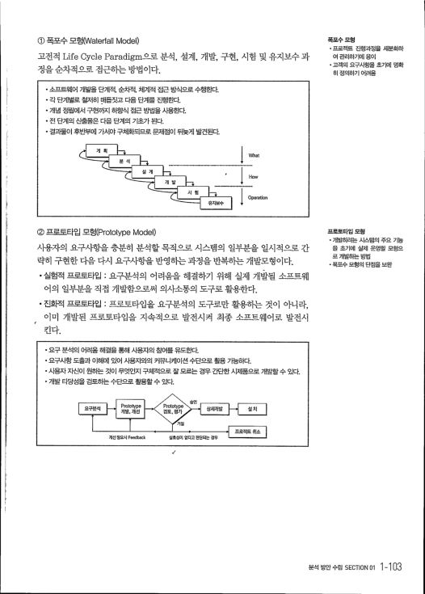
① 폭포수 모형（Waterfall Model) 고전적 Life Cycle Paradigm으로분적 , 설계 , 개발 , 구현 , 시험 및 유지보수과 정을 순차적으로 접근하는 방법이다．

- 소프트뭬어 개발을 단계적 , 순차적 , 체계적 접근 방식으로 수행한다．
- 각 단계별로 철저히 매듭짓고 다음 단계를 진행한다．
- 개념 정립에서 구현까지 하향식 접근 방법을 사용힌다．
- 전 단계의 산출물은 다음 단계의 기초가 된다．
- 결과물이 후반부에 가서야 구체화되므로 문제점이 뒤늦게 발견된다．
What How

# bperation
② 프로토타입 모형（Prototype Model) 사용자의 요구사항을 충분히 분석할 목적으로 시스템의 일부분을 일시적으로 간 략히 구현한 다음 다시 요구사항을 반영하는 과정을 반복하는 개발모형이다．

- 실험적 프로토타입 : 요구분석의 어려움을 해결하기 위해 실제 개발될 소프트웨
어의 일부분을 직접 개발함－으로써 의사소통의 도구로 활용한다．

- 진화적 프로토타입 ' 프로토타입을 요구분석의 도구로만 활용하는 것이 아니라， 
, 이미 개발된 프로토타입을 지속적으로 발전시켜 최종 소프트웨어로 발전시 킨다．

- 요구 분석의 어려움 해결을 통해 사용자의 참여를 유도한다．
- 요구사항 도출과 이해에 있어 사용자와의 커뮤니케이션 수단으로 흴용 가능하다．
- 사용자 자신이 원하는 것이 무엇인지 구체적으로 잘 모르는 경우 긴단한 시제품으로 개발할 수 있다．
- 개발 타당성을 검토하는 수단으로 활용할 수 있다．
개선필요시 Feedback 실효성이 없다고판딘되는 경우 4,

> 폭포수 모형 
- 프로젝트 진행과정을 세분화하 
여 관리하기에 용이

- 고객의 요구사항을 초기에 명확 
히 정의하기 어려움

> 프로토타입 모형 
- 개발하려는 시스템의 주요 기능 
을 초기에 실제 운영할 모형으 로 개발하는 방법

- 폭포수 모형의 단점을 보완
> 분석방안수립 SECTION 01 1 -103
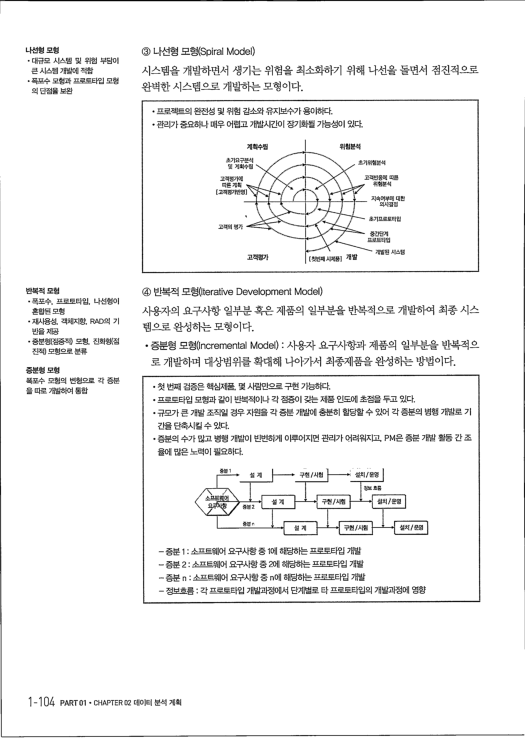
③ 나선형 모형（S兩ral Model) 나선형 모형

- 酬구모 시스템 및 위험 부담이 
큰 시스템 개발에 적합

- 폭포수 모형과 프로토타입 모형
시스템을 개발하먼서 생기는 위험을 최소화하기 위해 나선을 돌면서 점진적으로 완벽한 시스템으로 개발하는 모형이다． 으I 단점을 보완

- 프로젝트의 완전성 및 위험 감소와 유지보수가 용이하다．
- 관리가 중요ㅎ瞬 매우 어렵고 개발시간이 장기화될 가능성이 있다．
계획수립

- 
위헙분석

# J2 1\,,,/.'·”:.：ㅍ： 
I 'NY .--t.-"."..:"··，,,/! I4醍1 【뺙漱죠I2 0 a2A ‘∼쟉캬憐크7IEII 고객평가 鬧번째ㅅ；제풍】 개발 ∼ ' ＂발된 ' ！스템 ④ 반복적 모형(Iterative Development Model) 반복적 모형

- 폭포수 . 프로토타입 . 나선형이 
혼합된 모형

- 재사梁 , 객체지향. RAD의 기 
반을 제공

- 증분형（점蔘1) 모형 . 진화형（점
사용자의 요구사항 일부분 혹은 제품의 일부분을 반복적으로 개발하여 최종 시스 템으로 완성하는 모형이다．

#### · 증분형 모형ㅇncremental Model) : 사용자 요구사항과 제품의 일부분을 반복적으
진적） 모형으로 분류 로 개발하며 대상범위를 확대해 나아가서 최종제품을 완성하는 방법이다． 증분형 모형 폭포수 모형의 변형으로 각 증분 을 따로 개발하여 통합

- 첫 번째 검증은 핵심제품, 몇 사람만으로 구현 가능하다．
- 프로토타입 모형과 같이 반복적이나 각 점증이 갖는 제품 인도에 초점을 두고 있다．
- 규모가 큰 개발 조직일 경우 자원을 각 증분 개발에 충분히 할당할 수 있어 각 증분의 병행 개발로 기
간을 단축시킬 수 있다．

- 증분의 수가 많고 병행 개발이 빈번하게 이루어지면 관리가 어려워지고， PM은 증분 개발 활동 간 조
웹게 많은 노력이 필요하다．

# 증분 1 
'騙스｝－루쁘｝－섬； :' 즛 틀 뙈

# 嶽
중분 n 샬 계 卜 구현J시헐 －증분1 " 소프트웨어 요구사항중1에 해당하는프로토타입 개발

- 증분 2 " 소프트웨어 요구사항 중 2에 해당하는 프로토타입 개발
－증분 n " 소프트웨어 요구사항중 n에 해당하는프로토타입 개발

- 정보흐름 " 각프로토타입 개발과정에서 단계별로 타 프로토타입의 개발과정에 영향
H 04 PART 01 · CHAPTER 02 데이터 분석 계획

> I 
▼ 卜 설치／운영

> - l
#### I
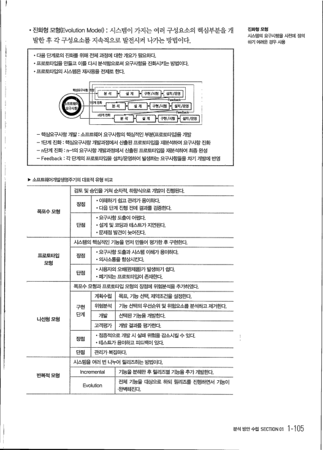
- 진화형 모형（Evolution Model) : 시스템이 가지는 여러 구성요소의 핵심부분을 개
발한 후 각 구성요소를 지속적으로 발전시켜 나가는 방법이다．

- 다음 단계로의 진화를 위해 전체 과정에 대한 개요가 필요하다．
- 프로토타입을 만들고 이를 다시 분석함으로쩌 요구사항을 진화시키는 방법이다．
- 프로토타입의 시스템은 재사麗 전저匣 한다．
- 핵심요구사항 개발 " 소프트웨어 요＝r【사항의 핵심적인 부분＜프로토타입）을 개발 
-i단계 진화 : 핵심요구사항 개발과정에서 산출된 覡토타입을 재隧：석하여 요구사항 진화 -n단계 진화 : n-i의 요구사항 개발과정에서 산출된 프로토타입을 자隧：석하여 최종 완성

- Feedback : 각 단계의 프로토타입을 설치／운영하여 발생하는 요구사항들을 차기 개발에 반영
> 소프트웨어개발생명주기의 대표적 유형 비교
검토 및 승인을 거쳐 순차적 , 하향식으로 개발이 진행된다． 장점

- 이해하기 쉽고 관리가 용이하다．
- 다음 단계 진행 전에 결과를 검증힌다．
폭포수 모형

- 요구사항 도출이 어렵다． 
- 설계 및 코딩과 테스트가 지연된다．
路

- 문제점 발견이 늦어진다．
시스템의 핵심적인 기능을 먼저 만들어 평가한 후 구현한다． 장점

- 요구사항 도출과 시스템l 이해가 용이ㅎ阡 
- 의사소통을 향상시킨다．
프로토타입 모형 단점

- 사용자의 오해（완제품）가 발생하기 쉽다． 
- 폐기되는 프로토타입이 존재힌다．
폭포수 모형과 프로토타입 모형의 장점에 위험분석을 추가하였다． 계획수립 목표， 기능 선택 . 제약조건을 설정힌다． 위험분석 기능 선택의 우선순위 및 위험요소를 분석하고 제거한다． 권 '21711 개발 선택된 기능을 개발힌다． 고객평가 개발 결과를 펑가힌다． 장점

- 점증적으로 개발 시 실패 위험을 감소시킬 수 있다． 
- 테스트가 용이하고 피드백이 있다．
단점 관리가복잡하다． 시스템을 여러 번 나누어 릴리즈하는 방법이다． Incremental 기능을 분해한 후 릴리즈별 기능을 추가 개발한다． 반복적 모형 Evolution 전체 기능을 대상으로 하되 릴리즈를 진행하면서 기능이 ，완벽해진다．

> 진화형 모형
> 시스템의 요구사항을 사전에 정의 
하기 어려운 경우 사용

> 분석방안수랍SECTION01 1-105
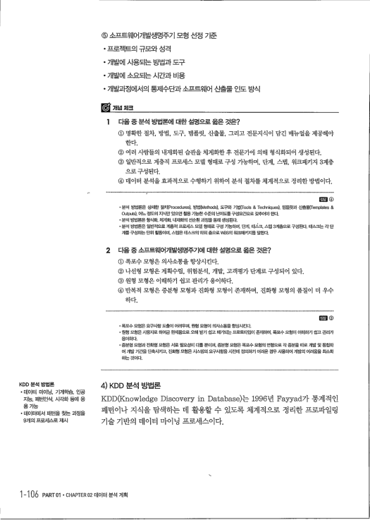
⑤ 소프트웨어개발생명주기 모형 선정 기준

- 프로젝트의 규도뫄 성격
- 개발에 사용되는 방법과 도구
- 개발에 소요되는 시간과 비용
- 개발과정에서의 통제수단과 소프트웨어 산출물 인도 방식
1 다음중분석 방법론에 대한설명으로옳은것은？ ① 명확한 절차 , 방법 , 도구 , 템플릿 , 산출물 , 그리고 전문지식이 담긴 매뉴얼을 제공해야 한다． ② 여러 사람들의 내재화된 습관을 체계화한 후 전문가에 의해 형식화되어 생성된다． ③ 일반적으로 계층적 프로세스 모델 형태로 구정 가능하며 , 단계 , 스텝 , 워크패키지 3계층 으로구정된다． ④ 데이터 분석을 효과적으로 수행하기 위하여 분석 절차를 쳬계적으로 정리한 방법이다．

- 분석 방법론은 상세한 철차（Procedures). 방법（Methods), 도구와 기법（Tools & Techdques). 템플릿과 산출물《Templates & 
Outputs) , 어느정도의 지식만 있으면 횔용 가능한수준의 난이도를구성요건으로 갖추어야 한다．

- 분석 방법론은 형식화 . 체계화. 내재화의 선순환과정을 통해 생성된다． 
- 분석 방법론은 일반적으로 겨隱적 프뢰 I스 모델 형태로 쩡 가능하며． 단계． 태스크， 스텝 3계충으로 구성된다 . 태스크는 각 단
계를 구성하는 단위 활동이며 . 스텝온 태스크와하위 충으로w33의 워크패키지를 말힌빠． 2 다음중소프트웨어개발생명주기에 대한설명으로옳은것은？ ① 폭포수 모형은 의사소통을 향상시킨다． ② 나선형 모형은 계획수립 , 위험분석 , 개발 , 고객평가단계로구성되어 있다． ③ 원형 모형은 이해하기 쉽고 관리가 용이하다． ④ 반복적 모형은 증분형 모형과 진화형 모형이 존재하며 , 진화형 모형의 품질이 더 우수 하다．

- 폭포수 모형은요구사항 도출이 어려우며 , 원형 모형이 의사소통을 항상시킨다． 
- 원형 모형은 사용자로 하여금 완저居으로 오해 받기 쉽고 폐기되는 프르토타입이 존재하며 . 폭포수 모헝이 이해하기 쉽고 관리가
용이ㅎ阡． . 증분형 모형과 진화형 모형은 서로 필요성이 다를 뿐이며 , 韆형 모형온 폭포수모형의 변형으로 각 증분을 따로 개발 및 통합하 여 개발 기간을 단축시키고， 진화형 모형은 시스템의 요구사항을 사전에 정의하기 어려운 경우 사용하여 개발의 어려움을 최소화 하는 것이다． 4) KDD 분석 방법론 KDD 분석 방법론

- 데이터 마이닝 , 기계학습 , 인공
#### KDD(Knowledge Discovery in Database）는 1996년 Fayyad가 통계적인
지능. 패턴인식 . 시각화 등에 응 용 가능 패턴이나 지식을 탐색하는 데 활용할 수 있도록 쳬계적으로 정리한 프로파일링

- 데이터에서 패턴을찾는 과정을
기술 기반의 데이터 마이닝 프로세스이다． 9개의 프롸 스로 제시 1-106 PART이 . CHAPTER 02 데이터 분석 계획

> 尸目· ④
> ．레 ②
「

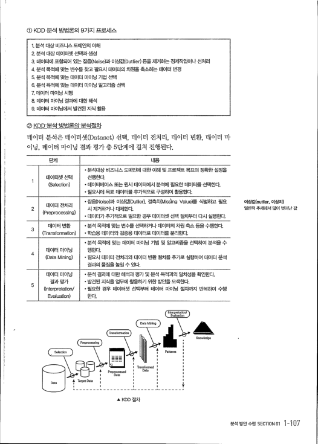
①KDD 분석 방법론의 9가지 뜨쎄스 1 . 분석 대상 비즈니스 도메인의 이해 2 분석 대상 데이터셋 선택과 생성 3 . 데이터에 포함되어 있는 잡음《Noise）과 이상값（Outtier) 등을 제거하는 정제작업이나 선처리 4 . 분석 목적에 맞는 변수를 찾고 필요시 데이터의 차원을 축소하는 데이터 변경 5 . 분석 목적에 맞는 데이터 마이닝 기법 선택 6 . 분석 목적에 맞는 데이터 마이닝 알고리즘 선택

7. 데이터 마이닝 시행
8 . 데이터 마이닝 결과에 대한해석 9 . 데이터 마이닝에서 발견된 지식 횔용 ② KDDE분咨t그방법론의湟점절차 데이터 분석은 데이터셋（Dataset) 선택 , 데이터 전처리 , 데이터 변환 , 데이터 마

#### 이닝 , 데이터 마이닝 결과평가총5단계에 걸쳐 진행된다．
단계 내용

- 분석대상 비즈니스 도메인에 대한 이해 및 프로젝트 목표의 정확한 설정을
선행한다．

- 데이터베이스 또는 원시 데이터에서 분석에 필요한 데이터를 선택한다． 
- 필요시에 목표 데이터를 추가적으로 구성하여 활용한다．
데이터셋 선택 (Selection)

- 잡음《Noise）과 이상값《Outlier) , 결측치（Mising Value）를 식별하고 필요
^z 데이터 전처리 시 제거하거나 대체한다．

- 데이터가 추가적으로 필요한 경우 데이터셋 선택 절차부터 다시 실행한다．
(Preprocessing) (Transformation)

- 분석 목적에 맞는 변수를 선택하거나 데이터의 차원 축소 등을 수행힌다．
^d 데이터 변환

- 학습용 데이터와 검증용 데이터로 데이터를 분리한다．
- 분석 목적에 맞는 데이터 마이닝 기법 및 알고리즘을 선택하여 분석을 수
乙 ＇ 데이터 마이닝 행한다．

- 필됴치 데이터 전처리와 데이터 변환 절차를 추가로 실행하여 데이터 분석
(Data Mining) 결과의 품질을 높일 수 있다． 데이터 마이닝

- 분석 결과에 대한 해석과 평가 및 분석 목적과의 일치성을 확인한다．
- 발견된 지식을 업무에 활용하기 위한 방안을 모색한다． 
- 필요한 경우 데이터셋 선택부터 데이터 마이닝 절차까지 반복하여 수행
결과 평가 (Interpretation!

ㄸ u Evaluation) 한다． Knawladge Patteflis Transformed Dta Preprocessed Data ▲ KDD 절차

> 이상값(outlior , 이상치） 
일반적 추세에서 않이 벗어난 값

> 분석방안수립 SECTION 01 H07
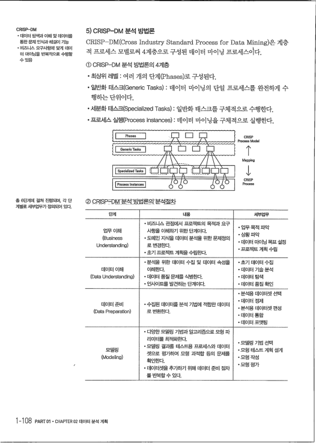
CRISP-DM

- 데이터 탐색과 이해 및 데이터를 
통한문제 인식과해결이 가능

- 비즈니스 요구사항에 맞거l 데이 
터 마이닝을 반복적으로 수행할 수 있음 5) CRISP-DM 분석 방법론 CRJSP-DM(Cross Industry Standard Process for Data Mining)은 계 적 프로세스 모델로써 4계층으로 구성된 데이터 마이닝 프로세스ㅇl다． ①CRISP-DM 분석 방법론의 4계층

- 최상위 레벨 : 여러 개의 단계（Phases）로 구성된다．
- 일반화 태스크（Generic Tasks) : 데이터 마이닝의 단일 프로세스를 완전하게 수
행하는 단위이다．

- 세분화 태스크（Specialized Tasks) : 일반화 태스크를 구쳬적으로 수행한다．
- 프퇘스 실행（Process Instances) : 데이터 마이닝을 구쳬적으로 실행한다．
총 6단계어r 걸쳐 진행되며 . 각 단 계별로 세부업무가 정의되어 있다． ② 【〕 RISPFDM湟석드방법론의뷘넉절차 단겨l 내용 세부업무

- 비즈니스 관점에서 프로젝트의 목적과 요구
업무 이해 사항을 이해하기 위한 단계이다．

- 도메인 지식을 데이터 분석을 위한 문제정의 
로 변경한다．

- 초기 프로젝트 계획을 수립한다．
(Business Understanding)

- 분석을 위한 데이터 수집 및 데이터 속성을
데이터 이해 이해츤따.

(Data Understanding)

- 데이터 품질 문제를 식별한다．
- 인사이트를 발견ㅎ怜크 단계이다．
데이터 준비

- 수집된 데이터를 분석 기법에 적합한 데이터 
로 변환한다． (Data Preparation)

- 다양한 모델링 기법과 알고리즘으로 모형 파
라미터를 최적화한다．

- 모델링 결과를 테스트용 프로세스와 데이터
모델링 셋으로 평가하여 모형 과적합 등의 문제를 (Modeling) 확인한다． /

- 데이터셋을 추가하기 위해 데이터 준비 절차 
를 반복할 수 있다． 1-108 PART며 . CHAPTER 02 데이터 분석 계획

> CRISP 
Process Model

# Mapping 
l CRISP Process

> - 업무목적 파악
> - 상황 파악
> - 데이터 마이닝 목표 설정 
- 프로젝트 계획 수립
> - 초기 데이터 수집
> - 데이터 기술 분석
> - 데이터 탐색
> - 데이터 품질 확인
> - 분석용 데이터셋 선택
> - 데이터 정제
> - 분석용 데이터셋 편성
> - 데이터 통합
> ' 데이터 포맷팅
> - 모델링 기법 선택 
- 모형 테스트 계획 설계
> - 모형 작성
> - 모형 평가
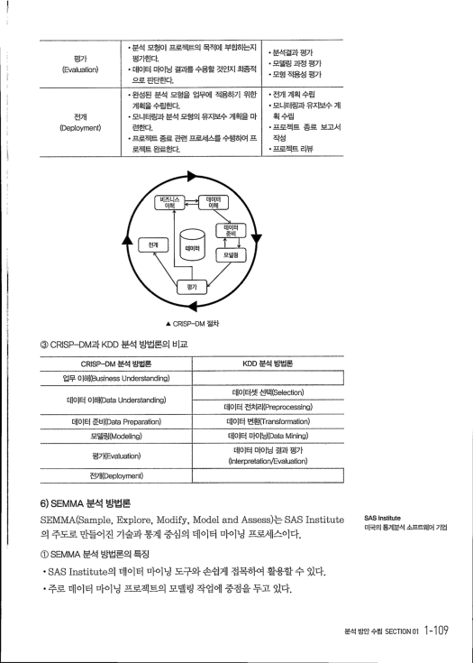
- 분석 모형이 프로젝트으l 목적에 부합하는지
- 분석결과 평가 
- 모델링 과정 평가 
- 모형 적용성 평가
평가한다．

- 데이터 마이닝 결과를 수용할 것인지 최종적
평가 (Evaluation) 으로 판단한다．

- 완성된 분석 모형을 업무에 적용하기 위한
- 전개 계획 수립 
- 모니터링과 유지보수 계
계획을수립한다．

- 모니터링과 분석 모형의 유지보수 계획을 마
획 수립

- 프로젝트 종료 보고서
전개 련한다．

- 프로젝트 종료 관련 璽l세스를 수행하여 프
(Deployment) 작성

- 프로젝트 리뷰
로젝트 완료힌다． ▲ CRISP-DM 절차 ③CRISP-DM과〈DD 분석 방법론의 비교 CRISP-DM 분석 방법론 KDD 분석 방법론 업무 이해（Business Understanding) 데이터 이해（Data Understanding) 데이터셋 선택（勻election) 데이터 전처리（Preprocessing) 데이터 준비（Data Preparation) 데이터 변환（Transformation) 모델링曲odeling) 데이터 마이닝（Data Mining) 펑가（Evaluation) 데이터 마이닝 결과 평가 (Interpretation/Evaluation) 전개（Deployment) 6) SEMMA 분석 방법론 SEMMA(Sample, Explore, Modify, Model and Assess)는 SAS Institute 의 주도로 만들어진 기술과 통계 중심의 데이터 마이닝 프로세스이다． DSEMMA 분석 방법론의 특징

- SAS Institute의 데이터 마이닝 도구와손쉽게 접목하여 활용할 수 있다．
- 주로 데이터 마이닝 프로젝트의 모델링 작업에 중점을 두고 있다．
> SAS Institute 
미국의 통:1糾분석 소프트웨어 기업

> 분석방안수립 SECTION 01 1-109
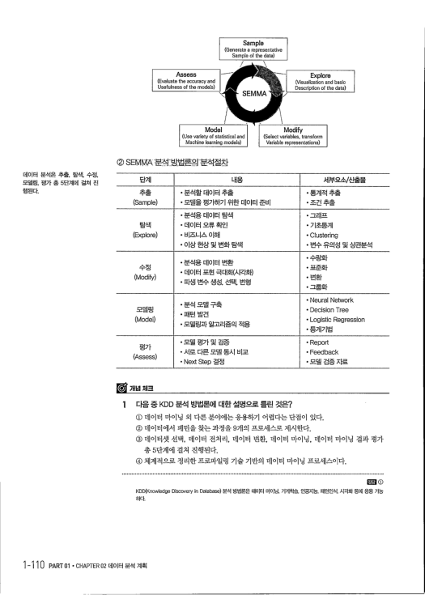
Sam이e (Generate a representative Sample of the data) Assess (Evaluate the accuracy and Usefulness of the models) Model (Use variety of statistical and Machine learning models) Modify (Select variables, transform Variable representations) ② SEMM.분석［방법론와분석절차 데이터 분석은 추출 . 탐색 , 수정， 단계 내용 세부요소／산출물 모델링 , 평가 총 5단계에 걸쳐 진 행된다． (Sample)

- 분석할 데이터 추출 
- 모델을 평가하기 위한 데이터 준비 
- 통계적 추출 
- 조건 추출
주줄

- 분석용 데이터 탐색 
- 데이터 오류 확인 
- 비즈니스 이해
탐색 (Explore)

- 이상 현상 및 변화 탐색
- 분석용 데이터 변환 
- 데이터 표현 극대호「（시각화） 
- 파생 변수 생성 , 선택 . 변형
수정 (Modify)

- 분석 모델 구축 
- 패턴 발견 
- 모델링과 알고리즘의 적용
모델링 (Model)

- 모델 펑가 및 검증 
- 서로 다른 모델 동시 비교
평가 (Assess)

- Next Step 결정
1 다음 중 (DD 분석 방법론에 대한 설명으로 틀린 것은？ ① 데이터 마이닝 외 다른 분야에는 응용하기 어렵다는 단점이 있다． ② 데이터에서 패턴을 찾는 과정을 9개의 프로세스로 제시한다． ③ 데이터셋 선택 , 데이터 전처리 , 데이터 변환 , 데이터 마이닝 , 데이터 마이닝 결과 평가 총 5단계에 걸쳐 진행된다． ④ 쳬계적으로 정리한프로파일링 기술 기반의 데이터 마이닝 프로세스이다． KDD(Knowledge Discovery in Database) 분석 방법론은 데이터 마이닝 . 기계학습. 인공지능 . 패턴인식． 시각화 뒀체 응용 가능 tll가． H 10 PART01 . CHAPTER02 데이터 분석 계획

> Explore 
(Visualization and ba轍〕 Description of the data)

> - 그래프
> - 기초통계
> - Clustering 
- 변수 유의성 및 상관분석
> - 수량화
> - 표준화 
- 변환
> - 그룹화
> - Neural Network 
- Decision Tree 
- Logistic Regression
> - 통계기법
> - Report 
- Feedback 
- 모델 검증 자료
> “麗①
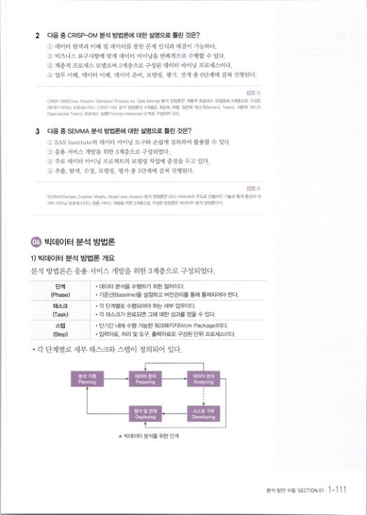
2 다음 중 CRISP-DM 분석 방법론에 대한 설명으로 틀린 것은？ ① 데이터 탐색과 이해 및 데이터를 통한 문제 인식과 해결이 가능하다． ② 비즈니스 요구사항에 맞게 데이터 마이닝을 반복적으로 수행할 수 있다． ③ 계층적 프로세스 모델로써 3계층으로 구성된 데이터 마이닝 프로세스이다． ④ 업무 이해 , 데이터 이해 , 데이터 준비 , 모델링 , 평가 , 전개 총 6단계에 걸쳐 진행된다． CRISP-DM(Cross Indus瞰 Standard Process for Data Mining) 분석 방법론은 계李 프로세스 모델로써 4741충으로 구성된 데이터 마이닝 프로제스이다 . CRISP-GM 분석 방법론의 4겨l층은 최상위 레벨． 일반화 태스크(Generic Tasks). 세분화 태스크 (Specialized Tasks), 끄로서L스 실행（Process Instances) 단겨建 구성되어 있다』 3 다음 중 SEMMA 분석 방법론에 대한 설명으로 틀린 것은？ @ SAS Institute의 데이터 마이닝 도구와 손쉽게 접목하여 활용할 수 있다． ② 응용 서비스 개발을 위한 3계층으로 구성되었다． ③ 주로 데이터 마이닝 프로젝트의 모델링 작업에 중점을 두고 있다． ④추출 , 탐색 , 수정 , 모델링 , 평가총5단계에 걸쳐 진행된다． SEMMA(Sample, Explore. Modify, Model and Assess) 분석 방법론은 SAS Institute의 주도로 안들《거진 기술과 퉁계 중심의 데 이터 마이닝 珊쬔서l쇼이다． 응용 서비스 개발을 위한 3계층으로 구성된 빙썹론은 빅데이터 분석 빙뻘론이다， .

빅데이터 분석 방법론 1) 빅데이터 분석 방법론 개요 분석 방법론은 응용 서비스 개발을 위한 3계층으로 구성되었다．

- 데이터 분석을 수행하기 위한 절차이다． 
- 기준선（Baseline）을 설정하고 버전관리를 통해 통제되어야 한다．
단계 (Phase) 태스크

- 각 단계별로 수행되어야 하는 세부 업무이다． 
- 각 태스크가 완료되면 그에 대한 성과를 얻을 수 있다．
(Task)

- 단기간 내에 수행 가능한 워크패키지（Work Package）이다． 
- 입력차료， 처리 및 도구， 출력자료로 구성된 단위 프로세스이다．
스텝 (Step)

- 각 단계별로 세부 태스크와 스텝이 정의되어 있다．
데이터 준비

- 
데이터 분석 Preparing

- 
Analyzing ▲ 빅데이터 분석을 위한 단계

> l③
> “째 ②
> 분석 방안수립 SECTION 01 H 11
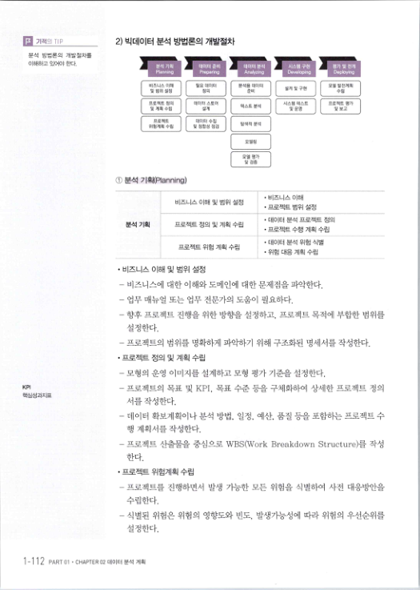
2) 빅데이터 분석 방법론의 개발절차 기적의 TI P 분석 방법론의 개발절차를 이해하고 있어야 한다． r 데이터준비 Preparing 분석 기획 Planning 데이터 분석 Analyzing 비즈니스 이해 및 범위 설정 필요 데이터 정의 분석용 데이터 준비 프로젝트 정의 및 계획 수립 데이터 스토어 설겨l 프로젝트 위험계획 수립 데이터 수집 및 정합성 점검 탐색적 분석 ① 분석 기획α긔anning)

- 비즈니스 이해
비즈니스 이해 및 범위 설정

- 프로젝트 범위 설정
- 데이터 분석 프로젝트 정의
분석 기획 프로젝트 정의 및 계획 수립

- 프로젝트 수행 계획 수립
- 데이터 분석 위험 식별
프로젝트 위험 계획 수립

- 위험 대응 계획 수립
- 비즈니스 이해 및 범위 설정
- 비즈니스에 대한 이해와 도메인에 대한 문제점을 파악한다．
- 업무 매뉴얼 또는 업무 전문가의 도움이 필요하다．
- 향후 프로젝트 진행을 위한 방향을 설정하고 , 프로젝트 목적에 부합한 범위를
설정한다．

- 프로젝트의 범위를 명확하게 파악하기 위해 구조화된 명세서를 작성한다．
- 프로젝트 정의 및 계획 수립
- 모형의 운영 이미지를 설계하고 모형 평가 기준을 설정한다．
- 프로젝트의 목표 및 KPI , 목표 수준 등을 구체화하여 상세한 프로젝트 정의
K더 핵심성과지표 서를 작성한다．

- 데이터 확보계획이나분석 방법 , 일정 , 예산 , 품질 등을포함하는 프로젝트수
행 계획서를 작성한다．

- 프로젝트 산출물 을 중심으로 WBS(Work Breakdown Structure）를 작성
한다．

- 프로젝트 위험계획 수립
- 프로젝트를 진행하면서 발생 가능한 모든 위험을 식별하여 사전 대응빙솬을
수립한다．

- 식별된 위험은 위험의 영향도와 빈도 , 발생가능성에 따라 위험의 우선순위를
설정한다． ㅏ 12 PART01 . CHAPTER02 데이터분석계획

> 시스템 구현 
Developing

> 평가 및 전개 
Deploying

> 모델 발전계획 
수립

> 설계 g( 구현
> 시스템 테스트 
및 운영

> 프로젝트 평가 
및 보고

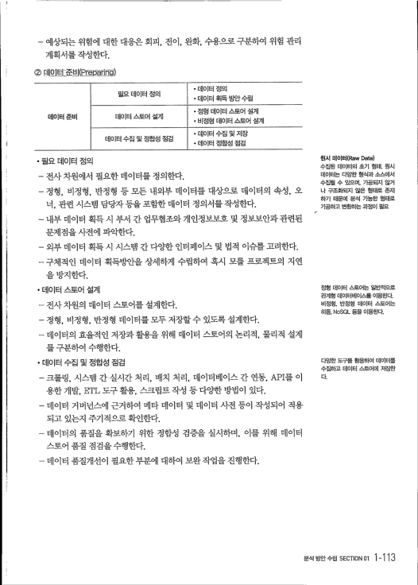
#### - 예상되는 위험에 대한 대응은 회피 , 전ㅇ1 , 완화, 수용으로 구분하여 위험 관리
계획서를 작성한다． ② 데희터ㅍ준희(E吟醵顚히 필요 데이터 정의

- 데이터 정의
- 데이터 획득 방안 수립
데이터 스토어 설계

- 정형 데이터 스토어 설계
데이터 준비

- 비정형 데이터 스토어 설계
데이터 수집 및 정합성 점검

- 데이터 수집 및 저장
- 데이터 정합성 점검
- 필요 데이터 정의
- 전사 차원에서 필요한 데이터를 정의한다．
- 정형 , 비정형 , 반정형 등 모든 내외부 데이터를 대상으로 데이터의 속정， 오
#### 너 , 관련 시스템 담당자등을포함한 데이터 정의서를작성한다．
- 내부 데이터 획득 시 부서 간 업무협조와 개인정보보호 및 정보보안과 관련된
문제점을 사전에 파악한다．

- 외부 데이터 획득 시 시스템 간 다양한 인터페이스 및 법적 이슈를 고려한다．
- 구쳬적인 데이터 획득방안을 상세하게 수립하여 혹시 모를 프로젝트의 지연
을 방지한다．

- 데이터 스토어 설계
- 전사 차원의 데이터 스토어를 설계한다 .
#### - 정형 , 비정형 , 반정형 데이터를모두저장할수 있도록설계한다 .
- 데이터의 효율적인 저장과 활용을 위해 데이터 스토어의 논리적 , 물리적 설계
를 구분하여 수행한다．

- 데이터 수집 및 정합성 점검
#### －크롤링 , 시스템 간 실시간 처리 , 배치 처리 , 데이터베이스 간 연동 , API를 이
#### 용한 개발 , ETL 도구 활용 , 스크립트 작성 등 다양한 방법이 있다 .
- 데이터 거버넌스에 근거하여 메타 데이터 및 데이터 사전 등이 작성되어 적용
#### 되고 있는지 주기적으로 확인한다 .
#### - 데이터의 품질을 확보하기 위한 정합성 검증을 실시하며 , 이를 위해 데이터
스토어 품질 점검을수행한다．

- 데이터 품질개선이 필요한 부분에 대하여 보완 작업을 진행한다．
> 원시 데이터（Raw Data)
> 수집된 데이터의 초기 형태 . 원시
> 데이터는 다양한 형식과 소스에서
> 수집될 수 있으며 . 가공되지 않거 
나 구조화되지 않은 형태로 존재

> 하기 때문에 분석 가능한 형태로
> 가공하고 변환하는 과정이 필요
> 정형 데이터 스토어는 일반적으로
> 관계형 데이터베이스를 이용한다．
> 비정형 , 반정형 데이터 스토어는
> ㅎ曆.NoSQI- 등을 이용한다．
> 다양한 도구를 활용하여 데이터를
> 수집하고 데이터 스토어에 저장한
> 다．
> 분석방안수립 SECTION 01 1-113
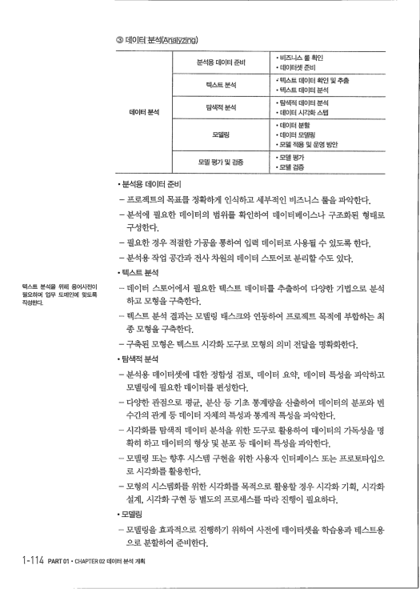
（戮데이터분점（跛頂上i啣反j) 분석용 데이터 준비

- 비즈니스 룰 확인
- 데이터셋 준비
텍스트분석 ' 텍스트 데이터 확인 및 추출

- 텍스트 데이터 분석
탐색적 분석

- 탐색적 데이터 분석
데이터 분석

- 데이터 시각화 스텝
모델링

- 데이터 분할 
- 데이터 모델링 
- 모델 적용 및 운영 방안
모델 평가 및 검증

- 모델 펑가 
- 모델 검증
- 분석용 데이터 준비
- 프로젝트의 목표를 정확하게 인식하고 세부적인 비즈니스 룰을 파악한다．
- 분석에 필요한 데이터의 범위를 확인하여 데이터베이스나 구조화된 형태로
구성한다．

- 필요한 경우 적절한 가공을 통하여 입력 데이터로 사용될 수 있도록 한다．
- 분석용 작업 공간과 전사 차원의 데이터 스토어로 분리할 수도 있다．
- 텍스트 분석
텍스트 분석을 위해 용어사전이 필요하며 업무 도메인에 맞도록

- 데이터 스토어에서 필요한 텍스트 데이터를 추출하여 다양한 기법으로 분석 
하고 모형을 구축한다． 작성힌빠．

- 텍스트 분석 결과는 모델링 태스크와 연동하여 프로젝트 목적에 부합하는 최 
종 모형을 구축한다．

- 구축된 모형은 텍스트 시각화 도구로 모형의 의미 전달을 명확화한다．
- 탐색적 분석
- 분석용 데이터셋에 대한 정함성 검토 , 데이터 요약 , 데이터 특성을 파악하고
모델링에 필요한 데이터를 편성한다．

- 다양한 관점으로 평균 , 분산 등 기초 통계량을 산출하여 데이터의 분포와 변
수간의 관계 등 데이터 자쳬의 특정과 통계적 특성을 파악한다．

- 시각화를 탐색적 데이터 분석을 위한 도구로 활용하여 데이터의 가독성을 명
확히 하고 데이터의 형상 및 분포 등 데이터 특정을 파악한다．

- 모델링 또는 향후 시스템 구현을 위한 사용자 인터페이스 또는 프로토타입으
로 시각화를 활용한다． －모형의 시스템화를위한시각화를목적으로활용할경우시각화기획 , 시각화 설계 , 시각화구현 등 별도의 프로세스를 따라 진행이 필요하다．

- 모델링
#### - 모델링을 효과적으로 진행하기 위하여 사전에 데이터셋을 학습용과 데스트용 
으로 분할하여 준비한다 .

1-114 PART01 .CHAPTER02 데이터 분석 계획

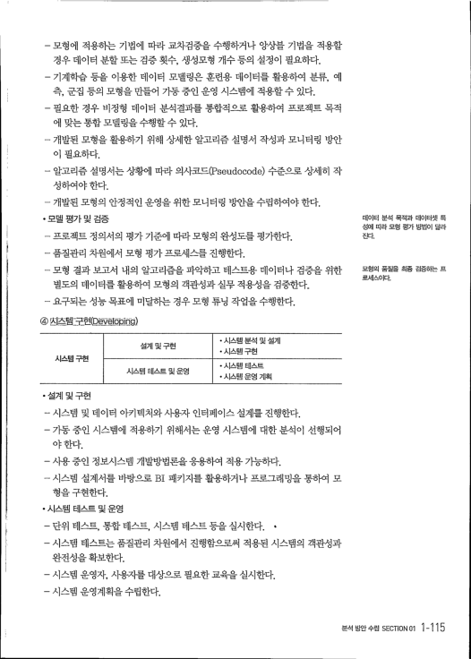
- 모형에 적용하는 기법에 따라 교차검증을 수행하거나 앙상블 기법을 적용할
경우 데이터 분할 또는 검증 횟수 , 생성모형 개수 등의 설정이 필요하다．

- 기계학습 등을 이용한 데이터 모델링은 훈런용 데이터를 활용하여 분류 , 예 
측 , 군집 등의 모형을 만들어 가동 중인 운영 시스템에 적용할 수 있다．

- 필요한 경우 비정형 데이터 분적결과를 통합적으로 활용하여 프로젝트 목적
에 맞는 통합 모델링을 수행할 수 있다．

- 개발된 모형을 활용하기 위해 상세한 알고리즘 설명서 작성과 모니터링 방안
이 필요하다．

- 알고리즘 설명서는 상황에 따라 의사코드（Pseudocode) 수준으로 상세히 작
성하여야한다．

- 개발된 모형의 안정적인 운영을 위한 모니터링 방안을 수립하여야 한다 .
- 모델 평가 및 검증
- 프로젝트 정의서의 평가 기준에 따라 모형의 완성도를 평가한다．
- 품질관리 차원에서 모형 평가 프로세스를 진행한다．
- 모형 결과 보고서 내의 알고리즘을 파악하고 테스트용 데이터나 검증을 위한
별도의 데이터를 활용하여 모형의 객관성과 실무 적용정을 검증한다눕．

- 요구되는 성능 목표에 미달하는 경우 모형 튜닝 작업을 수행한다．
@) 최스템ㅌ근현(Dev히百Jng)

- 시스템 분석 및 설계
설계 및 구현

- 시스템 구현
시스템 구현

- 시스템 테스트
시스템 테스트 및 운영

- 시스템 운영 계획
- 설계 및 구현
- 시스템 및 데이터 아키텍처와 사용자 인터페이스 설계를 진행한다．
- 가동 중인 시스템에 적용하기 위해서는 운영 시스템에 대한 분석이 선행되어
야한다．

- 사용 중인 정보시스템 개발방법론을 응용하여 적용 가능하다．
- 시스템 설계서를 바탕으로 BI 패키지를 활용하거나 프로그래밍을 통하여 모
형을 구현한다．

- 시스템 테스트 및 운영
- 단위 테스트 , 통합 테스트 , 시스템 데스트 등을 실시한다．
- 시스템 테스트는 품질관리 차원에서 진행함으로써 적용된 시스템의 객관성과
완전성을 확보한다．

- 시스템 운영자 , 사용자를 대상으로 필요한 교육을 실시한다．
- 시스템 운영계획을 수립한다．
> 데이터 분석 목적과 데이터셋 특 
성에 따라 모형 평가 방법이 달라

> 진다．
> 모형의 품질을 최종 검증하는 프 
롸 스이다．

> 분석방안수립 SECTION01 1-1巧
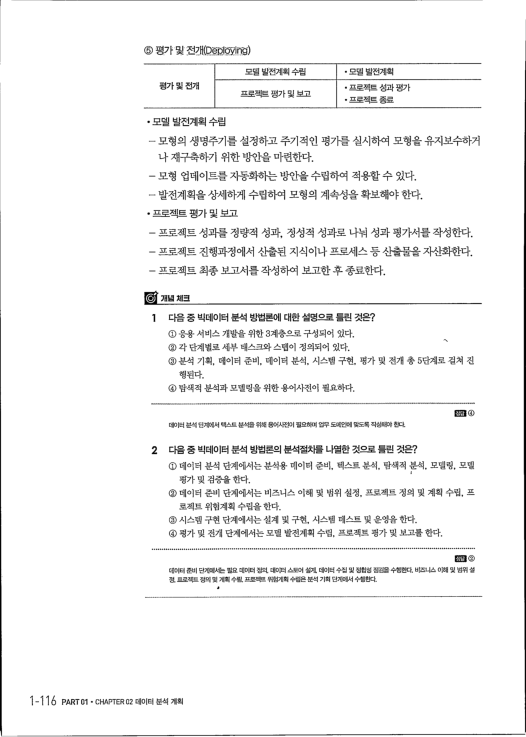
⑤ 평가및전개（D亘財切曲D) 모델 발전계획 수립

- 모델 발전계획
평가 및 전개

- 프로젝트 성과 평가 
- 프로젝트 종료
프로젝트 평가 및 보고

- 모델 발전계획 수립
- 모형의 생명주기를 설정하고 주기적인 평가를 실시하여 모형을 유지보수하거
나 재구축하기 위한 방안을 마런한다．

- 모형 업데이트를 자동화하는 방안을 수립하여 적용할 수 있다．
- 발전계획을 상세하게 수립하여 모형의 계속성을 확보해야 한다．
- 프로젝트 평가 및 보고
- 프로젝트 성과를 정량적 성과 , 정성적 성과로 나눠 성과 평가서를 작성한다．
- 프로젝트 진행과정에서 산출된 지식이나 프로세스 등 산출물을 자산화한다．
- 프로젝트 최종 보고서를 작성하여 보고한 후 종료한다．
1 다음 중 빅데이터 분석 방법론에 대한 설명으로 틀린 것은？ ① 응용 서비스 개발을 위한 3계층으로 구성되어 있다． ② 각 단계별로 세부 태스크와 스텝이 정의되어 있다． ③분석 기획 , 데이터 준비 , 데이터 분석 , 시스템 구현 , 평가 및 전개 총 5단계로 걸쳐 진 행된다． ④ 탐잭적 분석과 모델링을 위한 용어사전이 필요하다． 데이터 분석 단계에서 텍스트 분삭을 위해 용어사전이 필요하며 업무 도메인에 맞도록 작성해야 한다． 2 다음 중 빅데이터 분석 방법론의 분석절차를 나열한 것으로 틀린 것은？ ① 데이터 분석 단계에서는분석용 데이터 준비 , 텍스트분석 , 탐색적 분석 , 모델링 , 모델 평가 및 검증을 한다． ② 데이터 준비 단계에서는 비즈니스 이해 및 범위 설정 , 프로젝트 정의 및 계획 수립 , 프 로젝트 위험쳬획 수립을 한다． ③ 시스템 구현 단계에서는 설계 및 구현 , 시스템 테스트 및 운영을 한다． ④ 평가 및 전개 단계에서는 모델 발전계획 수립 , 프로젝트 평가 및 보고를 한다． 데이터 준비 단계에서는 필요 데이터 정의 . 데이터 스토어 설겨I . 데이터 수집 및 정합성 점검을 수행한다． 비즈니스 이해 및 범위 설 정 . 프로젝트 정의 및 계획 수립 . 프로젝트 위험계획 수립은 분석 기획 단계에서 수행한다． ' 1ㅢ拓 PART 01· CHAPTER 02데이터분석계획

> El @
> 덤國②
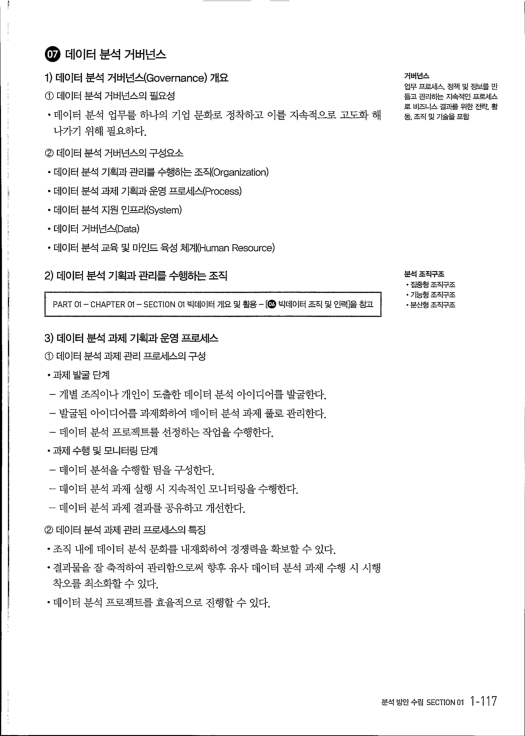
.

데이터 분석 거버넌스 1) 데이터 분석 거버넌스（Governance) 개요 ① 데이터 분석 거버넌스의 필요성

- 데이터 분석 업무를 하나의 기업 문화로 정착하고 이를 지속적으로 고도화 해
나가기 위해 필요하다． ② 데이터 분석 거버넌스의 구성요소

- 데이터 분석 기획과관리를 수행하는 조직（Organization)
- 데이터 분석 과제 기획과운영 뜨쎄스（Process)
- 데이터 분석 지원 인프라（System)
- 데이터 거버넌스（Data)
- 데이터 분석 교육 및 마인드 육성 체계（Human Resource)
2) 데이터 분석 기획과 관리를 수행하는 조직 PART 01 - CHAPTER 01 - SECTION 01 빅데이터 개요 및 흴용 - [. 빅데이터 조직 및 인력澧 침陸 3) 데이터 분석 과제 기획과 운영 覡쎄스 ① 데이터 분석 과제 관리 覡느세스의 구성

- 과제 발굴 단계
- 개별 조직이나 개인이 도출한 데이터 분석 아이디어를 발굴한다．
- 발굴된 아이디 어를 과제화하여 데이터 분석 과제 풀로 관리한다．
- 데이터 분석 프로젝트를 선정하는 작업을 수행한다．
- 과제 수행 및 모니터링 단계
- 데이터 분적을 수행할 팀을 구성한다．
- 데이터 분석 과제 실행 시 지속적인 모니터링을 수행한다．
- 데이터 분석 과제 결과를 공유하고 개선한다 .
② 데이터 분석 과제 관리 騙쎄스의 특징

- 조직 내에 데이터 분석 문화를 내재화하여 경갱력을 확보할 수 있다．
- 결과물을 잘 축적하여 관리함으로써 향후 유사 데이터 분석 과제 수행 시 시행
착오를 최소화할 수 있다 .

- 데이터 분적 프로젝트를 효율적으로 진행할 수 있다．
> 거버넌스
> 업무 프롸 스， 정책 및 정보를 만 
들고 관리하는 지속적인 프로서降 로 비즈니스 결과를 위한 전략. 활 동 . 조직 및 기술을 포함

> 분석 조직구조
> - 집중형 조작구조
> - 기능형 조작구조
> - 뷘낟형 조쟉구조
> 분석 빈단수립 SECTION 01 1-117
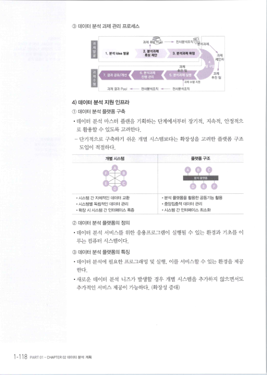
③ 데이터 분석 과제 관리 프롸 스 과 제 발 굴 2 . 분석과제 후보쟤안 '' ' 1그＝∼【에빽0 ……… 과제 제안자 과저l 결과 Pa히 쎄－ 전사분석조직 *-- 전사분석조직 4) 데이터 분석 지원 인프라 ① 데이터 분석 플랫폼 구축

- 데이터 분석 마스터 플랜을 기획하는 단계에서부터 장기적 , 지속적 , 안정적으
로 활용할 수 있도록 고려한다．

- 단기적으로 구축하기 쉬운 개별 시스템보다는 확장성을 고려한 플랫폼 구조
도입이 적절하다． 개별 시스템

- 시스템 간 차체적인 데이터 교환
- 분석 플랫폼을 활용한 공동기능 횔용
- 중앙집중적 데이터 관리
- 시스템별 독립적인 데이터 관리
- 시스템 간 인터페이스 최소화
- 확장 시 시스템 간 인터페이스 폭증
② 데이터 분석 플랫폼의 정의

- 데이터 분적 서비스를 위한 응용프로그램이 실행될 수 있는 환경과 기초를 이
루는 컴퓨터 시스템이다． ③ 데이터 분석 플랫폼의 특징

- 데이터 분적에 필요한 ㅍ로ㄱ래밍 및 실행 , 이를 서비스할수 있는 환경을 제공
한다．

- 새로운 데이터 분적 니즈가 발생할 경우 개별 시스템을 추가하지 않으면서도
추가적인 서비스 제공이 가능하다 . （확장성 증대） H 炤 PART01 * CHAPTER02 데이터 분석 계획

> 플랫폼 구조
# 『：l
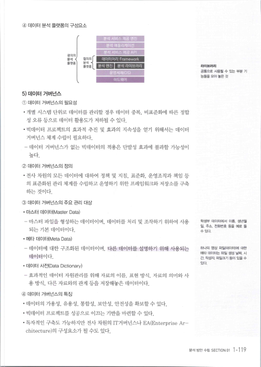
④ 데이터 분석 플랫폼의 구성요소 분석 서비스 제공 엔진 분석 애플리케이션 분석 서비스 제공 /\PI 네이터大lL겨Iramework 분석 엔진 분석 라이브러리 라이브러리

#### 功
加 … 하드웨어 5) 데이터 거버넌스 ① 데이터 거버넌스의 필요성

- 개별 시스템 단위로 데이터를 관리할 경우 데이터 중복 , 비표준화에 따른 정합
성 오류 등으로 데이터 활용도가 저하될 수 있다．

- 빅데이터 프로젝트의 효과적 추진 및 효과의 지속정을 얻기 위해서는 데이터
거버넌스 쳬계 수립이 필요하다．

- 데이터 거버넌스가 없는 빅데이터의 적용은 단발성 효과에 불과할 가능성이
높다． ② 데이터 거버넌스의 정의

- 전사 차원의 모든 데이터에 대하여 정책 및 지침 , 표준화 , 운영조직과 책임 등
의 표준화된 관리 체계를 수립하고 운영하기 위한 프레임워크와 저장소를 구축 하는 것이다 .

③ 데이터 거버넌스의 주요 관리 대상

- 마스터 데이터（Master Data)
- 마스터 파일을 형성하는 데이터이며 , 데이터를 처리 및 조작하기 위하여 사용
되는 기본 데이터이다．

- 메타 데이터（Meta Data)
- 데이터에 대한 구조화된 데이터이며 , 다른 데이터를 설명하기 위해 사용되는
데이터이다．

- 데이터 사전（Data Dictionary)
효과적인 데이터 자원관리를 위해 자료의 이름 , 표현 방식 , 자료의 의미와 사 용 방식 , 다른 자료와의 관계 등을 저장해놓은 데이터이다． ④ 데이터 거버넌스의 특징

- 데이터의 가용성 , 유용성 , 통합성 , 보안성 , 안전성을확보할수 있다．
- 빅데이터 프로젝트를 성공으로 이끄는 기반을 마련할 수 있다．
#### · 독자적인 구축도 가능하지만 전사 차원의 IT거버넌스나 EA(Enterprise Ar-
chitecture）의 구성요소가 될 수도 있다．

> 공통으로 사용될 수 있는 부분 기 
능들을 모아 놓은 것

> 학생부 데이터에서 이름 , 생년월 
일 . 주소， 전화번호 등을 예로 들 수 있다．

> 하나의 영상 파일（데이터）0卄 대한 
메타 데이터는 파일 생성 날짜 . 시 간, 작성자. 파일크기 등이 있을 수

> 있다．
> 분쵸楗［빤수립 SECTION 01 H 
珊

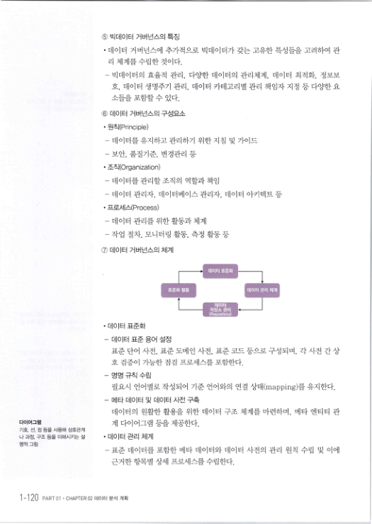
⑤ 빅데이터 거버넌스의 특징

- 데이터 거버넌스에 추가적으로 빅데이터가 갖는 고유한 특성들을 고려하여 관
리 쳬계를 수립한 것이다．

- 빅데이터의 효율적 관리 , 다양한 데이터의 관리체계 , 데이터 최적화 , 정보보－
호 , 데이터 생명주기 관리 , 데이터 카테고리별 관리 책임자 지정 등 다양한 요 소들을 포함할 수 있다． ⑥ 데이터 거버넌스의 구성요소

- 원칙（Principle)
- 데이터를 유지하고 관리하기 위한 지침 및 가이드
- 보안 , 품질기준 , 변경관리 등
- 조직（Organization)
- 데이터를 관리할 조직의 역할과 책임
- 데이터 관리자 , 데이터베이스관리자 , 데이터 아키텍트등
- 프로세스（Process)
- 데이터 관리를 위한 활동과 쳬계
- 작업 절차 , 모니터링 활동 , 측정 활동 등
⑦ 데이터 거버넌스의 체계

- 데이터 표준화
- 데이터 표준 용어 설정
표준 단어 사전 , 표준 도메인 사전 , 표준 코드 등으로 구성되며 , 각 사전 간 상 호 검증이 가능한 점검 프로세스를 포함한다．

- 명명 규칙 수립
필요시 언어별로 작성되어 기준 언어와의 연결 상태（mapping）를 유지한다．

- 메타 데이터 및 데이터 사전 구축
데이터의 원활한 활용을 위한 데이터 구조 쳬계를 마련하며 , 메타 엔티티 관 계 다이어그램 등을 제공한다． 다이어그램 기호， 선 , 점 등을 사용해 상호관계 나 과정 . 구조 등을 이해시키는 설

- 데이터 관리 체계
명적 그림

- 표준 데이터를 포함한 메타 데이터와 데이터 사전의 관리 원칙 수립 및 이에
근거한 항목별 상세 프로세스를 수립한다 .

1 -120 PART 01 . CHAPTER 02데이터분석계획

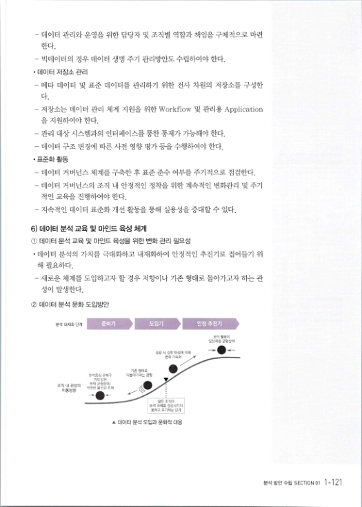
- 데이터 관리와 운영을 위한 담당자 및 조직별 역할과 책임을 구쳬적으로 마련
한다．

- 빅데이터의 경우 데이터 생명 주기 관리방안도 수립하여야 한다．
- 데이터 저창소 관리
- 메타 데이터 및 표준 데이터를 관리하기 위한 전사 차원의 저장소를 구성한
다．

- 저장소는 데이터 관리 쳬계 지원을 위한 Workf low 및 관리용 Application 
을 지원하여야 한다．

- 관리 대상 시스템과의 인터페이스를 통한 통제가 가능해야 한다．
- 데이터 구조 변경에 따른 사전 영향 평가 등을 수행하여야 한다 .
- 표준화 활동
- 데이터 거버넌스 체계를 구축한 후 표준 준수 여부를 주기적으로 점검한다．
- 데이터 거버넌스의 조직 내 안정적인 정착을 위한 계속적인 변화관리 및 주기
적인 교육을 진행하여야 한다．

- 지속적 인 데이터 표준화 개선 활동을 통해 실용정을 증대할 수 있다．
6) 데이터 분석 교육 및 마인드 육성 체계 (j:) 데이터 분석 교육 및 마인드 육성을 위한 변화 관리 필요성

- 데이터 분석의 가치를 극대화하고 내재화하여 안정적인 추진기로 접어들기 위
해 필요하다．

- 새로운 쳬계를 도입하고자 할 경우 저항이나 기존 형태로 돌아가고자 하는 관
성이 발생한다． ② 데이터 분석 문화 도입방안 도입기 안정 추진기 준비기 분석 활용이 일상화된 균형상태

## 성공 시 강한 탄성에 의해 
"些／/ 기존 행태로 되돌아가려는 경향 분석중심 운화가 미도입된 현재 균헝상태／ 악연한 불안강 존재 조직 나l 관성의 이동방향 rna ralni 陸석鏑蠱§치키지 못하고 포기하는 단계 ▲ 데이터 분석 도입과 문화적 대응

> 분석방안수립 SECTION 01 1ㅢ기
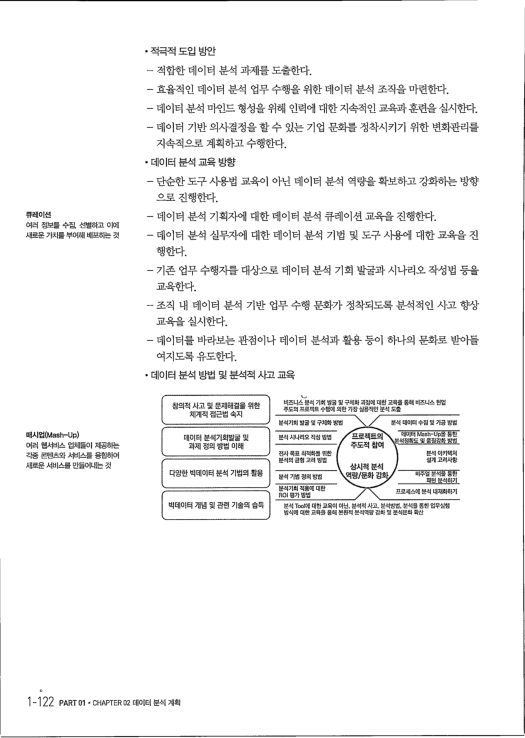
- 적극적 도입 방안
- 적합한 데이터 분적 과제를 도출한다．
- 효율적인 데이터 분석 업무 수행을 위한 데이터 분석 조직을 마런한다．
- 데이터 분석 마인드 형성을 위해 인력에 대한 지속적인 교육과훈런을 실시한다．
- 데이터 기반 의사결정을 할 수 있는 기업 문화를 정착시키기 위한 변화관리를
지속적으로 계획하고 수행한다．

- 데이터 분석 교육 방향
- 단순한 도구 사용법 교육이 아닌 데이터 분석 역량을 확보하고 강화하는 방향
으로 진행한다．

- 데이터 분석 기획자에 대한 데이터 분석 큐레이션 교육을 진행한다 .
큐레이션 여러 정보를 수집 . 선별하고 이에

- 데이터 분적 실무자에 대한 데이터 분석 기법 및 도구 사용에 대한 교육을 진
사隱［운 가치를 부여해 배포하는 것 행한다．

- 기존 업무 수행자를 대상으로 데이터 분석 기회 발굴과 시나리오 작성법 등을
#### 교육한다 .
- 조직 내 데이터 분석 기반 업무 수행 문화가 정착되도록 분석적인 사고 향상
교육을 실시한다．

- 데이터를 바라보는 관점이나 데이터 분석과 활용 등이 하나의 문화로 받아들
여지도록 유도한다．

- 데이터 분석 방법 및 분석적 사고 교육
비즈니스 분석 기회 발굴 및 구체화 괴정에대한 교육올통해 비즈L肄＝ 현얍 주도의 프로젝트 수행에 의한 가장실용적인 분석 도출 창의적 사고 및 문제해결을 위한 체계적 접근법 숙지 매시업（Mash-Up) 데이터 분석기회발굴 및 과제 정의 방법 이해 여러 웹서비스 업처隱이 처居하는 각종 콘텐츠와 서비스를 융합하여 새로운 서비스를 만들《｝ILㅐ는 것 전사목표 최적화을 위한 분석의 균형 고려 방법 다양한 빅데이터 분석 기법의 활용 분석 기법 정의 방법 분석기회 적용에 대한 B이 평가 방법 빅데이터 개념 및 관련 기술의 습득 분석 Too!에 대한교육이 아닌 , 분석적 사고 , 분석방법 , 분석을 통한 업무실행 방식에 대한교육을 통해 본원적 분석역랑 강화 및 분석문화 확산 1 -122 PART 01 . CHAPTER 02 데이터분석 계획

> 분석데이터수집및7F방법
> 데이터 Mash-Up올 통한 
：석정확도 및 풍질깅화 방법

> 분석 아키텍쳐 
설계 고려사항

> 비주얼 분석을 통한 
패턴 분석하기

> 프로세스에 분석 내재화하기
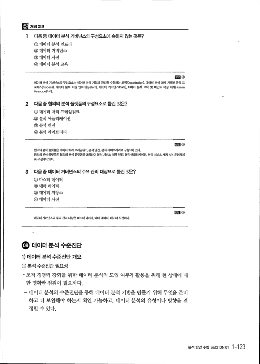
1 다음 중 데이터 분석 거버넌스의 구성요소에 속하지 않는 것은？ ① 데이터 분석 인프라 ② 데이터 거버넌스 ③ 데이터 사전 ④ 데이터 분적 교육 데이터 분석 거버넌스의 구성요소는 데이터 분석 기획과 관리릅 수행하는 조직（Organization) . 데이터 분석 과제 기획과 운영 프 롸ㅔ스（Process). 데이터 분석 지원 인프라（System) , 데이터 거버넌스（Date) . 데이터 분적 교육 및 마인드 육성 체계（Human Resource）이다． 2 다음 중 협의의 분석 플랫폼의 구성요소로 틀린 것은？ ① 데이터 처리 프레임워크 ．② 분석 애플리케이션 ③ 분석 엔진 ④ 분석 라이브러리 협의의 분석 플랫폼은 데이터 처리 프레임워크， 분석 엔진 . 분석 라이브러리로 구성되어 있다． 광의의 분셕 플랫폼은 협의의 분석 플횃폼을 포함하여 분석 서비스 저居 엔진 분석 애플리케이션， 분석 서비스 제공 pI . 운영체저l 로 구성되어 있다． 3 다음중 데이터 거버넌스의 주요관리 대상으로 틀린 것은？ ① 마스터 데이터 ② 메타 데이터 ③ 데이터 저징소 ④ 데이터 사전 데이터 거버넌스의 주요관리 대상은 마스터 데이터 . 메타 데이터 . 데이터 사전이다． .

데이터 분석 수준진단 1) 데이터 분석 수준진단 개요 ① 분석 수준진단 필요성

- 조직 경챙력 강화를 위한 데이터 분석의 도입 여부와 활용을 위해 현 상태에 대 
한 명확한 점검이 필요하다．

- 데이터 분적의 수준진단을 통해 데이터 분석 기반을 만들기 위해 무엇을 준비 
하고 더 보완해야 하는지 확인 가능하고 , 데이터 분석의 유형이나 방향을 결 정할 수 있다．

> El
> 묘래 ②
> 恪n ③
> 분석빙빤수립 SECTION 01 H23
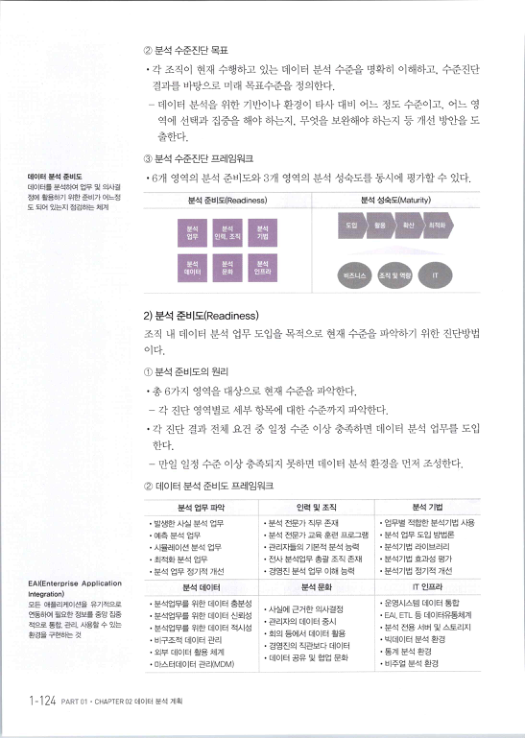
② 분석 수준진단 목표

- 각 조직이 현재 수행하고 있는 데이터 분석 수준을 명확히 이해하고 , 수준진단
결과를 바탕으로 미래 목표수준을 정의한다．

- 데이터 분석을 위한 기반이나 환경이 타사 대비 어느 정도 수준이고 , 어느 영
역에 선택과 집중을 해야 하는지 , 무엇을 보완해야 하는지 등 개선 방안을 도 출한다． ③ 분석 수준진단 프레임워크

- 6개 영역의 분석 준비도와 3개 영역의 분적 성숙도를 동시에 평가할 수 있다．
데이터 분석 준비도 데이터를 분석하여 업무 및 와사결 정에 활용하기 위한 준비가 어느정 도 되어 있는지 점검하는 체계 분석 성숙도（Maturity) 분석 준비도（Readiness)

# 言擘 
분석 인력，조직 翩

#### 譴
#### 慇．
2) 분석 준비도（Readiness) 조직 내 데이터 분석 업무 도입을 목적으로 현재 수준을 파악하기 위한 진단방법 이다． ① 분석 준비도의 원리

- 총 6가지 영역을 대상으로 현재 수준을 파악한다．
- 각 진단 영역별로 세부 항목에 대한 수준까지 파악한다．
- 각 진단 결과 전쳬 요건 중 일정 수준 이상 충족하면 데이터 분석 업무를 도입
한다．

- 만일 일정 수준 이상 충족되지 못하면 데이터 분석 환경을 먼저 조성한다．
② 데이터 분석 준비도 프레임워크 분석 업무 파악 인력 및 조직 분석 기법

- 분석 전문가 직무 존재
- 발생한 사실 분석 업무
- 분석 전문가 교육 훈련 프로그램
- 예측 분석 업무
- 관리자들의 기본적 분석 능력
- 시뮬레이션 분석 업무
- 전사 분석업무 총괄 조직 존재
- 최적화 분석 업무
- 경영진 분석 업무 이해 능력
- 분석 업무 정기적 개선
EAI(Enterprise Application Integration) 분석 데이터 분석 문화 「

- 분석업무를 위한 데이터 충분성
모든 애플리케이션을 유기적으로

- 사실에 근거한 의사결정
연동하여 필요한 정보를 중앙 즌活 적으로 통합 , 관리 . 사용할 수 있는 환경을 구현하는 것

- 분석업무를 위한 데이터 신뢰성
- 관리자의 데이터 중시
- 분석업무를 위한 데이터 적시성
- 회의 뒹게서 데이터 횔용
- 바구조적 데이터 관리
- 경영진의 직관보다 데이터
- 외부 데이터 활용 체계
- 데이터 공유 및 협업 문화
- 마스터데이터 관리（MDM)
1 -124 PART 01 . CHAPTER 02 데이터 분석 계획

> - 업무별 적합한 분석기법 사용
> - 분석 업무 도입 방법론
> - 분석기법 라이브러리
> - 분석기법 효과성 평가
> - ·분석기법 정기적 개선
> ㄸ인프라
> - 운영시스템 데이터 통합
> - EAJ. ETL 등 데이터유통체계
> - 분석 전용 서버 및 스토리지
> - 빅데이터 분석 환경
> - 통계 분석 환경
> - 비주얼 분석 환경
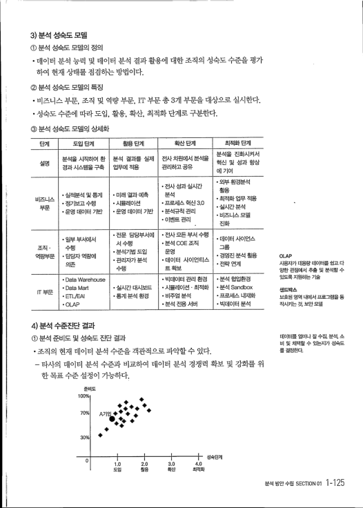
3) 분석 성숙도 모델 ① 분석 성숙도 모델의 정의

- 데이터 분적 능력 및 데이터 분석 결과활용에 대한조직의 성숙도 수준을 평가
하여 현재 상태를 점검하는 방법이다． ② 분석 성숙도 모델의 특징

- 비즈니스 부문 , 조직 및 역량 부문 , IT 부문 총 3개 부문을 대상으로 실시한다．
- 성숙도 수준에 따라 도입 , 활용 , 확산 , 최적화 단계로 구분한다．
③ 분석 성숙도 모델의 상세화 단계 도입 단계 활용 단계 확산 단계 최적화 단계 분석을 진화시켜서 전사 차원에서 분석을 분석 결과를 실제 설명 분석을 시작하여 환 혁신 및 셩과 향상 관리하고공유 경과 시스템을 구축 업무0체 적용 에 기여

- 외부 환경분석
- 전사 성과 실시간
횔용

- 최적화 업무 적용
분석

- 프로세스 혁신 3.0
- 미래 " 결과 예측
- 실적분석 및 통계 
- 정기보고 수행
비즈니스

- 시뮬레이션
- 실시간 분석 
- 비즈니스 모델
죠＝」 rㄱ ｀∼

- 분석규칙 관리
- 운영 데이터 기반
- 운영 데이터 기반
- 이벤트관리
진화

- 전사 모든 부서 수행
- 전문 담당부서에
- 데이터 사이언스
- 일부 부서에서
- 분i COE 조직
서 수행

- 분석기법 도입
그룹

- 경영진 분석 흴용
수행

- 담당자 역량에
조직 · 운영

- 데이터 사이언티스 
트 확보 역량부문

- 관리자가 분석
- 전략 연계
의존 수행

- 빅데이터 관리 환경
- 분석 협업환경 
- 분석 Sandbox 
- 逝l세스 내재화 
- 빅데이터 분석
- Data Warehouse 
- Data Mart
- 실시간 대시보드
- 시뮬레이션 · 최적화
汗부문

- ET나탸뇌
- 비주얼 분석
- 통계 분석 환경
- 분석 전용 서버
.OLAP 4) 분석 수준진단 결과 ① 분석 준비도 및 성숙도 진단 결과

- 조직의 현재 데이터 분적 수준을 객관적으로 파악할 수 있다．
- 타사의 데이터 분석 수준과 비교하여 데이터 분석 경챙력 확보 및 강화를 위
한목표 수준 설정이 가능하다． 준비도 100% 70% A ◆ 30%

# ㅅ
성숙단계 0

1. 0 
2. 0 
3. 0 
4. 0 
도입 활용 확산 최적화

> OLAP 
사용자가 대용량 데이터를 쉽그긔다 양한 관점에서 추출 및 분석할 수 있도록 지원하는 기술

> 샌ㅌ박스 
보호된 영역 내에서 프로그램을 동 작시키는 것 . 보안모델

> 데이터를 얼마나 잘수집 . 분석 , 소 
비 및 채택할 수 있는지가 성숙도 를 결정한다．

> 분석방안수립 SECTION 01 H25
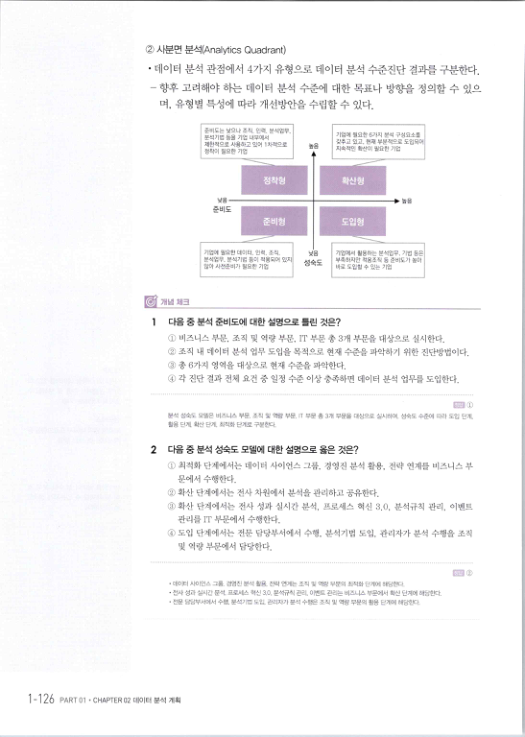
② 사분면 분석（Analytics Quadrant)

- 데이터 분적 관점에서 4가지 유형으로 데이터 분적 수준진단 결과를 구분한다．
- 향후 고려해야 하는 데이터 분적 수준에 대한 목표나 방향을 정의할 수 있으 
며 , 유형별 특정에 따라 개선방안을 수립할 수 있다． 준비도는 낯으나 조직， 인력 . 분석업무． 분석기법 둥을 기업 내부에서 제한적으로 사용하고 있어 1차적으로 정착이 필요한 기업 기업에 띨요한 6가지 분석 구성요소鷺 갖추고 있고， 현재 부분적으로 도입되어 지속적인 확산이 필요한 기업 높옴 정착형 확산형 낮음 준비도 준비형 도입형 → －→－ 기업에 씰요한 데이터． 인력 , 조직， 분석업무， 분석기법 둥이 적용되어 있지 않아 사전준비가 필요한 기업 기업에서 활용하는 분석업우， 기법 등온 부즉하지만 적용조직 둥 준비도가 높아 바로 도입할 수 있는 기업 낮옴 성숙도 1 다음 중 분석 준비도에 대한 설명으로 틀린 것은？ ① 비즈니스 부문 , 조직 및 역량 부문 , IT 부문 총 3개 부문을 대상으로 실시한다． ② 조직 내 데이터 분적 업무 도입을 목척으로 현재 수준을 파악하기 위한 진단방법이다． ③ 총 6가지 영역을 대상으로 현재 수준을 파악한다． ④ 각 진단 결과 전체 요건 중 일정 수준 이상 충족하면 데이터 분석 업무를 도입한다． 분석 성숙도 모델은 비즈니스 부문， 조직 및 역량 부문． ㅜ 부문 총 3개 부문을 대상으로 실시하며 . 성숙도 수준께 따라 도입 단계． 활용 단계， 확산 단겨！. 최적화 단겨釀 구분한다． 2 다음 중 분석 성숙도 모델에 대한 설명으로 옳은 것은수 ① 최적화 단계에서는 데이터 사이언스 그룹 , 경영진 분석 활용 , 전략 연계를 비즈니스 부 문에서 수행한다． ② 확산 단계에서는 전사 차원에서 분석을 관리하고 공유한다． ③ 확산 단계에서는 전사 성과 실시간 분적 , 프로세스 혁신 3.0 , 분牛구칙 관리 , 이벤트 관리를 IT 부문에서 수행한다． ④ 도입 단계에서는 전문 담당부서에서 수행 , 분석기법 도입 , 관리자가 분석 수행을 조직 및 역량 부문에서 담당한다 .

- 데이터 사이언스 그룹， 경영진 분석 활용 , 전략 연계는 조직 및 역량 부문의 최적화 단계에 해당한다． 
- 전사 샹과 실시간 분석． 프로겨l스 혁신 3.0 . 분석규칙 관리 . 이벤트 관리는 비즈니스 부문에서 확산 단계에 해당한다．
- 전문 당당부서에서 수행， 분석기법 도입 . 관리자가 분석 수행은 조직 및 역량 부문의 활용 단계에 해딤빤다．
1-126 PART01 . CHAPTER02 데이터 분석 계획

> =
> 》 높옴
> ㅐn ①
> 齟睡）
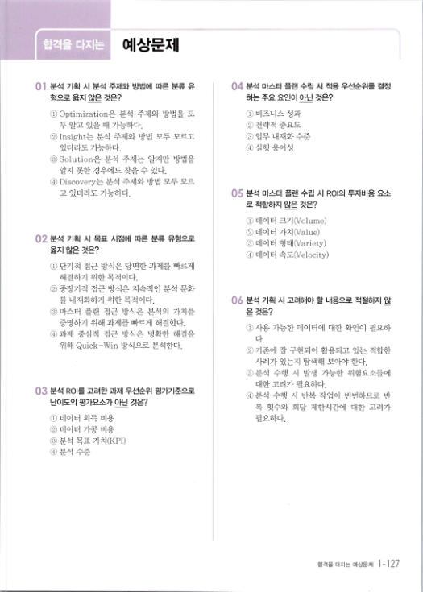
## 예상문제
04 분석 마스터 플랜 수립 시 -l Q 우선순위를 결정 분석 기획 시 분석 주제와 방법에 따른 분류 유 하는 주요 요인이 아닌 것은？ 형으로 옳지 않은 것은？ ① 비즈니스 성과 ② 전략적 중요도 ①Optimization은 분석 주제와 방법을 모 두 알고 있을 때 가능하다． ②Insight는 분적 주제와 방법 모두 모르고 ③ 업무 내재화 수준 ④ 실행 용이성 있더라도 가능하다． ③Solution은 분적 주제는 알지만 방법을 알지 못한 경우에도 찾을 수 있다． ④ Discovery는 분석 주제와 방법 모두 모르 고 있더라도 가능하다． 05 분석 마스터 플랜 수립 시 ROI의 투자비용 요소 로 적합하지 않은 것은？ ① 데이터 크기（Volume) ② 데이터 가치（Value) ③ 데이터 형태（Variety) ④ 데이터 속도（Velocity) 02 분석 기획 시 목표 시점0ㅔ 따른 분류 유형으로 옳지 않은 것은？ ① 단기적 접근 방식은 당면한 과제를 빠르게 해결하기 위한목적이다． ② 중장기적 접근 방식은 지속적인 분석 문화 를 내재화하기 위한 목적이다． ③마스터 플린1 접근 방식은 분석의 가치를 06 분석 기획 시 고려해야 할 내용으로 적절하지 않 은것은？ 증명하기 위해 과제를 빠르게 해결한다． ④과제 중심적 접근 방식은 명확한 해결을 ① 사용 가능한 데이터에 대한 확인이 필요하 다． ② 기존에 잘 구현되어 활용되고 있는 적합한 사례가 있는지 탐색해 보아야 한다． ③분석 수행 시 발생 가능한 위험요소들에 대한 고려가 필요하다． ④분적 수행 시 반복 작업이 빈번하므로 반 복 횟수와 회당 제한시간에 대한 고려가 위해 Quick-Win 방식으로 분석한다． 03 분석 ROI를 고려한 과제 우선순위 평가기준으로 난이도의 평가요소가 아닌 것은？ ① 데이터 획득 비용 ② 데이터 가공 비용 ③ 분적 목표 가치（KPI) ④ 분석 수준 필요하다．

> 합격을다지는예상문제 1-127
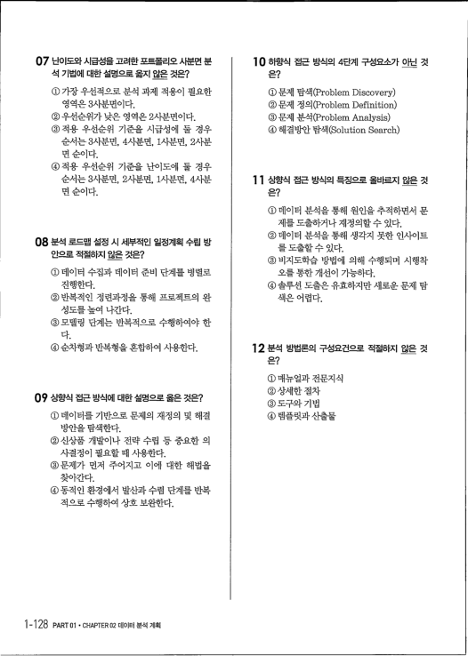
07 난이도와 시급성을 고려한 포트폴리오 사분면 분 석 기법에 대한 설명으로 옳지 않은 것은？ 10 하향식 접근 방식의 4단계 구성요소가 아닌 것 은？ ① 가장 우선적으로 분적 과제 적용이 필요한 영역은 3사분면이다． ② 우선순위가 낮은 영역은 2사분면이다． ③적용 우선순위 기준을 시급성에 둘 경우 순서는3사분면 , 4사분면 , 1사분면 , 2사분 면순이다． ④적용 우선순위 기준을 난이도에 둘 경우 순서는3사분면 , 2사분면 , 1사분면 , 4사분 면순이다． ①문제 탐색（Problem Discovery) ②문제 정의（Problem Definition) ③ 문제 W- 4(Prob1em Analysis) ④ 해결방안 탐잭（Solution Search) 11 싱향식 접근 방식의 특징으로 올바르지 않은 것 은？ ① 데이터 분적을 통해 원인을 추적하면서 문 제를 도출하거나 재정의할 수 있다． ② 데이터 분석을 통해 생각지 못한 인사이트 를 도출할 수 있다． ③ 비지도학습 방법에 의해 수행되며 시행착 오를 통한 개선이 가능하다． ④ 솔루션 도출은 유효하지만 새로운 문제 탐 색은 어렵다． 08 분석 로드맵 설정 시 세부적인 일정계획 수립 방 안으로 적절하지 않은 것은？ ① 데이터 수집과 데이터 준비 단계를 병렬로 진행한다． ② 반복적인 정련과정을 통해 프로젝트의 완 성도를 높여 나간다． ③모델링 단계는 반복적으로 수행하여야 한 다． ④ 순차형과 반복형을 혼합하여 사용한다． 12 분석 방법론의 구성요건으로 적절하지 않은 것 은？ ① 매뉴얼과 전문지식 ② 상세한 절차 ③ 도구와 기법 ④ 템플릿과 산출물 09 상향식 접근 방식에 대한설명으로 옳은 것은？ ① 데이터를 기반으로 문제의 재정의 및 해결 방안을탐색한다． ② 신상품 개발이나 전략 수립 등 중요한 의 사결정이 필요할 때 사용한다． ③문제가 먼저 주어지고 이에 대한 해법을 찾아간다． ④ 동적인 환경에서 발산과 수렴 단계를 반복 적으로 수행하여 상호 보완한다． 1-128 PART이 . CHAPTER 02 데이터분석계획

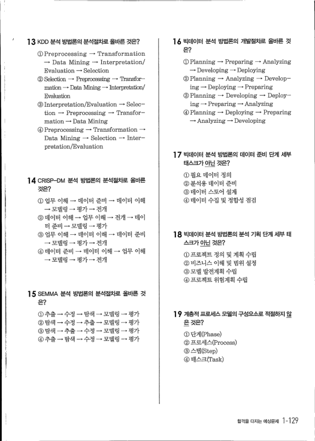
1 6 빅데이터 분석 방법론의 개발절차로 올바른 것 13 KDD 분석 방법론의 분석절차로 올바른 것은？ 은？ D Preprocessing - Transformation ①Planning - Preparing - Analyzing → Developing - Deploying ②Planning - Analyzing - Develop- ing - Deploying -. Preparing ③Planning - Developing - Deploy- ing - Preparing - Analyzing ④Planning -p Deploying - Preparing → Analyzing -p Developing → Data Mining - Interpretation!

Evaluation -> Selection ② Selection - Preprocessing - 'ftansfor- mation → Data Mining → Interpretation!

Evaluation ③ Interpretation/Evaluation - Selec- tion - Preprocessing - Transfor- mation -p Data Mining ④ Preprocessing - Transformation → Data Mining -p Selection -p Inter- pretation/Evaluation 17 빅데이터 분석 방법론의‘ 데이터 준비 단계 세부 태스크가 아닌 것은？ ① 필요 데이터 정의 ② 분석용 데이터 준비 ③ 데이터 스토어 설계 ④ 데이터 수집 및 정합성 점검 14 CRISP-DM 분석 방법론의 분석절차로 올바른 것은？ ① 업무 이해 → 데이터 준비 → 데이터 이해 → 모델링 → 평가 - 전개 ② 데이터 이해 → 업무 이해 → 전개 → 데이 터 준비 → 모델링 → 평가 ③ 업무 이해 → 데이터 이해 → 데이터 준비 → 모델링 → 평가 → 전개 ④ 데이터 준비 → 데이터 이해 → 업무 이해 → 모델링 → 평가 → 전개 18 빅데이터 분석 방법론의 분석 기획 단계 세부 태 스크가 아닌 것은？ ① 프로젝트 정의 및 계획 수립 ② 비즈니스 이해 및 범위 설정 ③ 모델 발전계획 수립 ④ 프로젝트 위험계획 수립 15 SEMMA 분석 방법론의 분석절차로 올바른 것 은？ 1 9 계층적 뜨［세스 모델의 구성요소로 적절하지 않 은 것은？ ① 추출 → 수정 → 탐색 → 모델링 → 평가 ② 탐색 → 수정 → 추출 → 모델링 → 평가 ③ 탐색 → 추출 → 수정 → 모델링 → 평가 ④ 추출 → 탐색 → 수정 → 모델링 - 평가 ① 단계（Phase) ② 프로세스（Process) ③스텝（Step) ④ 태스크（Task)

> 합격을다지는예상문제 H29
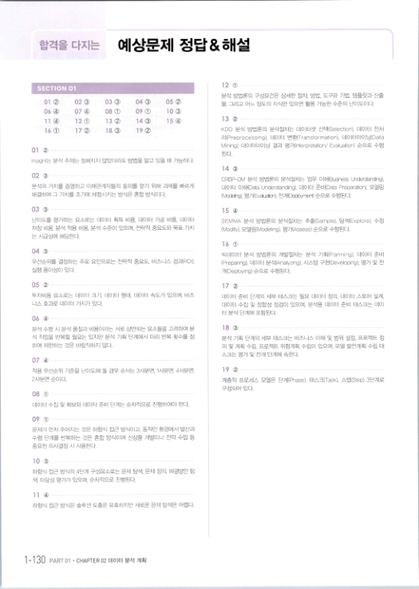
## 예상문제 정답＆해설
12 D ……－………… ∼ … ………………………∼ … ∼… … SECTION 01 분석 방법론의 구성요건은 상세한 절차． 방법 . 도구와 기법 . 템플릿과 산출 05 ② 0l ② 02 ③ 03 ③ 04 ③ 물． 그리고 어느 정도의 지식만 있으면 활용 가능한 수준의 난이도이다． 06 ④ 07 ④ 08I 09 ① li ④ 12D 13 ② 14 @) 16D 17 ② 18 ③ 19 ② 10③ 13 ② ……………」……………………………………………………… 15 ④ KDD 분석 방법론의 분석절차는 데이터셋 선택（Selection). 데이터 전처 리（Preprocessing) , 데이터 변환（Transformation) , 데이터마이닝（Data Mining) . 데이터마이닝 결과 평가.nterpretstion/ Evaluation) 순으로 수행 01 ② 된다， nsi아I는 분석 주처怜크 정해지지 일았더라도 방법을 알고 있을 때 가능하다． 14 （功 … … ………－… … … …… … … 02 ③ ……………………………………………… ……… … ……… ……… o：궈SP｛洲 분석 방법론의 분석절차는 업무 이해（Bodness Urderstardir ), 분석의 가치를 증명하고 이해관계자들의 동의를 얻기 위해 과제를 빠르게 데이터 이해KData Understanding). 데이터 준비（Data Preparation). 모델링 해결하여 그 가치를 조기에 체험시키는 방식은 혼합 방식이다． (卜八x꽜（〕). 평가（ㅌary1), 전가i(［始댜괘1召삿） 순으로 수행된다』 03 （③ ……－」 iS 饉） … …∼………… ……………… … …………… 난이도를 평가하는 요소로는 데이터 획득 비용． 데이터 가공 비용． 데이터 SEMMA 분석 방법론의 분석절차는 추출《Sari惻e) , 탐색（Explore). 수정 )Mody) , 모델링(Modeling). 평가（Assess) 순으로 수행된다． 저장 비용. 분석 적용 비용 . 분석 수준이 있으며． 전략적 중요도와 목표 가치 는 시급성에 해당한다； 16 ① …… ……… ………………………… ……… … 04 （功 … …… …－………………………… … ∼………－…………… 빅데이터 분석 넌［뻘론의 개발절차는 분석 기획（Planning) . 데이터 준비 우선순위를 결정하는 주요 요인으로는 전략적 중요도， 비즈니스 성과（ROα (Preparing). 데이터 분석眄nalyzing). 시스템 구현（Developing) . 평가 및 전 실행 용이성이 있다． 개（Deploying) 순으로 수행된다． 05 ② …………………………－……………………………………………－…∼ 투자비용 요소로는 데이터 크기， 데이터 형태 . 데이터 속도가 있으며 . 비즈 데이터 준비 단계의 세부 태스크는 필요 데이터 정의 . 데이터 스토어 설계． 니스 효과로 데이터 가치가 있다， 데이터 수집 및 정합성 점검이 있으며． 분석용 데이터 준비 태스크는 데이 터 분석 단계에 포함된다． 06 ④ - … ……………………… …………………………－『 18 ③ .

③ .

③ .

③ .

③ .

③ .

③ ..... .. .. .... ........................... .... ....... ... ... .... ..... .... ......................................... .. ... .

분석 수행 시 분석 품질과 비용이라는 서로 상반되는 요소들을 고려하여 분 석 작업을 반복할 필요는 있지만 분석 기획 단계에서 미리 반복 횟수를 정 분석 기획 단계의 세부 태스크는 비즈니스 이해 및 범위 설정． 프로젝트 정 하여 제한하는 것은 바람직하지 않다． 의 및 계획 수립 . 프로젝트 위험계획 수립이 있으며， 모델 발전계획 수립 태 스크는 평가 및 전개 단계에 속한다． 07 ④ ................................... ... ....... ............... .................... ............... . .......................... .. .. .

19 (2> ………… …………………－…………∼…6…… → z돋 우선순위 기준을 난이도에 둘 경우 순서는 3사분면 , 1사분면． 4사분면． 2사분면 순이다． 계층적 프뢰 스 모델은 단계（Phase). 태스크（Task). 스텝（Step) 3단겨l로 구성되어 있다， 08 ①  .

①.

① .

① .

① .

① .

① ........ .. ... .... ... ... . . . . ........ . .. .. . ............... ..

데이터 수집 및 확보와 데이터 준비 단계는 순차적으로 진행해겨야 힌다． 09 ①  .

①....... ... .......

. .. .. .. .... ... ............. ... ..................

문제가 먼저 주어자는 것은 하향식 접근 방식이고． 동적인 환경에서 발산과 수렴 단계를 반복하는 것은 혼합 방식이며 신상품 개발이나 전략 수립 등 중요한 의사결정 시 사용한다』 10 旺） 하향식 접근 방식의 4단계 구성요소로는 문제 탐색 . 문제 정와 해결방안 탐 색 . 타당성 평가가 있으며 . 순차적으로 진행된다． li ④  .

④ ......... ............ .... ... .... .. .... ...

하향식 접근 방식은 솔루션 도출은 유효하지만 새로운 문제 탐색은 어렵다． 1-130 PART01 . CHAPTER02 데이터 분석 계획

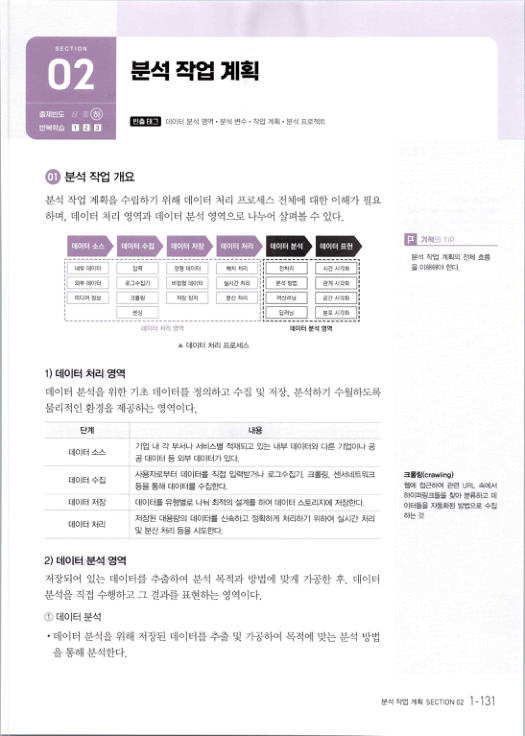
# SECTION 02
# 분석 작업 계획
출제빈도 써 …（靭 빈출 태그 데이터 분석 영역 · 분석 변수 · 작업 계획 · 분석 프로젝트 반복학습 ∥ .

.

#### .l 분석 직멉 개요
분석 작업 계획을 수립하기 위해 데이터 처리 프로세스 전쳬에 대한 이해가 필요 하며 , 데이터 처리 영역과 데이터 분석 영역으로 나누어 살펴볼 수 있다． 분석 작업 계획의 전체 흐름 을 이해해야 한다． 시간 시각화 전처리 「 입녹 정형데이El긔 배치 처리 H낚［ㅔ이터ㄱ．

### 「로그수집기 〕 - 비정형데이ㅔ 실시간처리
- 외부데이터
관계 시각화 분석 방법

### 분산 쳐리 
「 크롤링 ㅓ 저장장치ㄱ 띠어 정보 공간 시각화 머신러닝 一一

### 센싱 」
墜 긔 센 딥러닝 분포 시각화 데이터 처리 영역 ▲ 데이터 처리 프롸ㄸ스 1) 데이터 처리 영역

#### 데이터 분석을 위한 기초 데이터를 정의하고 수집 및 저장 , 분적하기 수월하도록
물리적 인 환경을 제공하는 영 역이다． 단계

- 
내용 데이터 소스

- 기업 Lㅐ 각 부서나 서비스별 적재되고 있는 내부 데이터와 다른 기업이나공
공 데이터 등 외부 데이터가 있다． 데이터 수집 사용자로부터 데이터를 직접 입력받거나 로그수집기 , 크롤링 , 센서네트워크 등을 통해 데이터를 수집한다． 데이터 저장 데이터를 유형별로 나눠 최적의 설계를 하여 데이터 스토리지에 저장한다． 데이터 처리 저장된 대용량의 데이터를 신속하고 정확하게 처리하기 위하여 실시간 처리 및 분산 처리 등을 시도한다． 2) 데이터 분석 영역 저장되어 있는 데이터를 추출하여 분적 목적과 방법에 맞게 가공한 후 , 데이터 분석을 직접 수행하고 그 결과를 표현하는 영역이다． ① 데이터 분석

- 데이터 분적을 위해 저장된 데이터를 추출 및 가공하여 목적에 맞는 분적 방법 
을 통해 분석한다．

> I m
> 크롤링（crawling)
> 웹에 접근하여 관련 URL' 속에서
> 하이퍼링크들을 칫아 분류하고 데
> 이터들을 자동화된 방법으로 수집
> 하는 것
> 분석 작업 계획 SECTION02 1-131
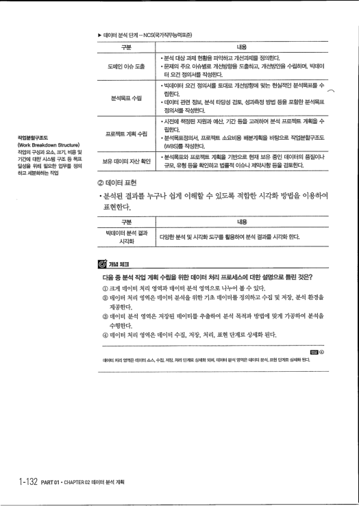
> 데이터 분석 단계 - NCS（국가직무능력표준）
구분 내용 도메인 이슈 도출

- 분석 대상 과제 현황을 파악하고 개선과저隱 정의힌다．
- 문제의 주요 이슈별로 개선방향을 도출하괴 개선방안을 수립하며 , 빅데이
터 요건 정의서를 작성한다．

- 빅데이터 요건 정의서를 토대로 개선방향에 맞는 현실적인 분석목표를 수
립한다．

- 데이터 관련 정보， 분석 타당성 검토 성과측정 방법 등을 포함한 분석목표
분석목표 수립 정의서를 작성한다．

- 사전에 책정된 자원과 예산, 기간 등을 고려하여 분석 프로젝트 계획을 수
립한다．

- 분석목표정의서 . 프로젝트 소요비용 배분계획을 바탕으로 작업분할구조도
프로젝트 계획 수립 작업분할구조도 (Work Breakdown Structure) 작업의 구성과 요소， 크기 . 비용 및 기간에 대한 시스템 구조 등 목표 달성을 위해 필요한 업무를 정의 하고 세분화하는 작업 (wBS）를 작성한다． 보유 데이터 자산 획인

- 분석목표와 프로젝트 계획을 기반으로 현재 보유 중인 데이터의 품질이나
규모， 유형 등을 확인하고 법률적 이슈나 제약사항 등을 검토한다． ② 데이터 표현

- 분적된 결과를 누구나 쉽게 이해할 수 있도록 적합한 시각화 방법을 이용하여
표현한다． 구분 내용 빅데이터 분석 결과 시각화 다양한 분석 및 시각화 도구를 흴용하여 분석 결과를 시각화 한다． 다음 중 분석 작업 계획 수립을 위한 데이터 처리 프퇘 스에 대한 설명으로 틀린 것은？ ① 크게 데이터 처리 영역과 데이터 분석 영역으로 나누어 볼 수 있다． ② 데ㅇ．］터 처리 영역은 데이터 분석을 위한 기초 데이터를 정의하고 수집 및 저장 , 분석 환경을 제공한다． ③ 데이터 분적 영역은 저장된 데이터를 추출하여 분석 목적과 방법에 맞게 가공하여 분석을 수행한다． ④ 데이터 처리 영역은데이터 수집 , 저장 , 처리 , 표현 단계로상세화된다． 데이터 처리 영역은 데이터 소스， 수집 . 저장, 처리 단겨匣 상세화 되며 . 데이터 분석 영역은 데이터 분석． 표헌 단겨煌 상세화된다． 1-132 PART01 · CHAPTER02더l이터분석 게획

> 尸n④
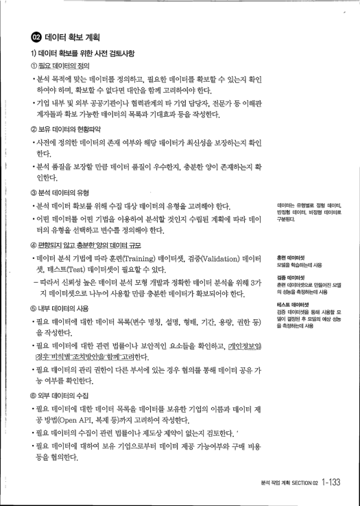
.

데이터 확보 계획 1) 데이터 확보를 위한 사전 검以 항 ① 필요，데희』터의프정의

#### · 분석 목적에 맞는 데이터를 정의하고 , 필요한 데이터를 확보할 수 있는지 확인
하여야 하며 , 확보할 수 없다면 대안을 함께 고려하여야 한다．

#### · 기업 내부 및 외부 공공기관이나 협력관계의 타 기업 담당자 , 전문가 등 이해관
계자들과 확보 가능한 데이터의 목록과 기대효과 등을 작성한다． ② 보유 데이터와 현황파악

- 사전에 정의한 데이터의 존재 여부와 해당 데이터가 최신성을 보장하는지 확인
한다．

- 분석 품질을 보장할 만큼 데이터 품질이 우수한지 , 충분한 양이 존재하는지 확
인한다． ③ 분석 데이터의 유형

#### · 분석 데이터 확보를 위해 수집 대상 데이터의 유형을 고려해야 한다 .
- 어떤 데이터를 어떤 기법을 이용하여 분석할 것인지 수립된 계획에 따라 데이
터의 유형을 선택하고 변수를 정의해야 한다． ④ 편향되지홅鬚긔충분한ㅍ양의，데희터.규무

#### · 데이터 분석 기법에 따라 훈런（Training) 데이터셋 , 검증（Validation) 데이터 
셋 , 테스트（Test) 데이터셋이 필요할수 있다 .

- 따라서 신뢰성 높은 데이터 분석 모형 개발과 정확한 데이터 분석을 위해 3가 
지 데이터셋으로 나누어 사용할 만큼 충분한 데이터가 확보되어야 한다． ⑤ 내부 데이터의 사용

#### · 필요 데이터에 대한 데이터 목록（변수 명칭 , 설명 , 형태 , 기간 , 용량 , 권한등） 
을 작성한다．

#### · 필요 데이터에 대한 관런 법률이나 보안적인 요소들을 확인하고 , 매밌정보일l
L＝우r비칙별조최솅：얀을E힝：꼐：고려한다 .

#### · 필요 데이터의 관리 권한이 다른 부서에 있는 경우 협의를 통해 데이터 공유 가 
능 여부를 확인한다 .

⑥ 외부 데이터의 수집

#### · 필요 데이터에 대한 데이터 목록 올 데이터를 보유한 기업의 이름과 데이터 제 
공 방법（Open API , 복제 등）까지 고려하여 작성한다．

- 필요 데이터의 수집이 관런 법률이나 제도상 제약이 없는지 검토한다 . "
- 필요 데이터에 대하여 보유 기업으로부터 데이터 제공 가능여부와 구매 비용 
등을 협의한다．

> 데이터는 유형별로 정형 데이터． 
반정형 데이터 . 비정형 데이터로

> 구분된다．
> 훈련 데이터셋 
모델을 학습하는데 사용

> 검증 더［이터셋
> 훈련 데이터셋으로 만들어진 모델 
의 성능을 측정하는데 사용

> 테스트 데이터셋
> 검증 데이터셋을 통해 사용할 모 
델0! 결정된 후 모델의 예상 성능 을 측정하는데 사용

> 분석직멉계획 SECT!0N02 1-133
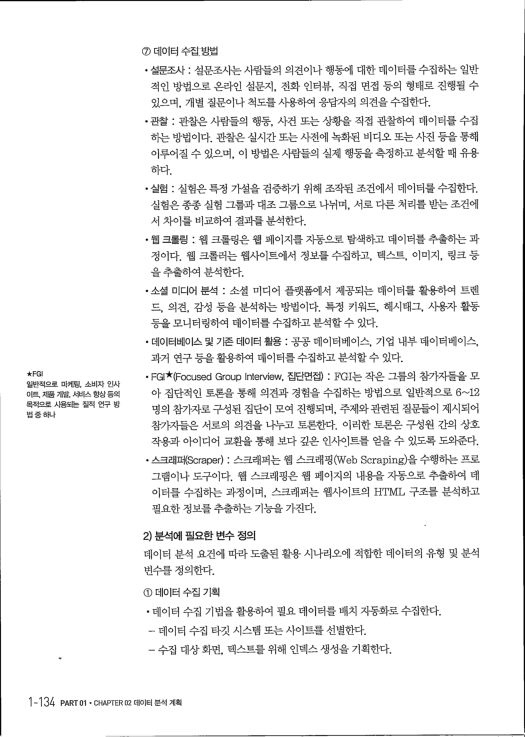
⑦ 데이터 수집：방법

#### · 설문조사 : 설문조사는 사람들의 의견이나 행동에 대한 데이터를 수집하는 일반
적인 방법으로 온라인 설문지 , 전화 인터뷰 , 직접 면접 등의 형태로 진행될 수 있으며 , 개별 질문이나 척도를 사용하여 응답자의 의견을 수집한다．

- 관찰 : 관찰은 사람들의 행동 , 사건 또는 상황을 직접 관찰하여 데이터를 수집
#### 하는 방법이다 . 관찰은 실시간 또는 사전에 녹화된 비디오 또는 사진 등을 통해
이루어질 수 있으며 , 이 방법은 사람들의 실제 행동을 측정하고 분석할 때 유용 하다．

#### · 실험 : 실험은 특정 가설을 검증하기 위해 조작된 조건에서 데이터를 수집한다 .
실험은종종실험 그룹과대조그룹으로나뉘며 , 서로다른처리를받는조건에

#### 서 차이를 비교하여 결과를 분석한다 .
- 웹 크롤링 : 웹 크롤링은 웹 페이지를 자동으로 탐색하고 데이터를 추출하는 과
정이다 . 웹 크롤러는 웹사이트에서 정보를수집하고 , 텍스트 , 이미지 , 링크등

#### 을 추출하여 분석한다 .
- 소셜 미디어 분석 : 소셜 미디어 플랫폼에서 제공되는 데이터를 활용하여 트렌
드 , 의견 , 감성 등을분석하는 방법이다 . 특정 키워드 , 해시태그 , 사용자활동 등을 모니터링하여 데이터를 수집하고 분석할 수 있다．

- 데이터베이스 및 기존 데이터 활용 : 공공 데이터베이스 , 기업 내부 데이터베이스，
#### 과거 연구 등을 활용하여 데이터를 수집하고 분석할 수 있다 .
#### ·FGI*(Focused Group Interview , 집단면접） : FGI는 작은 그룹의 참가자들을 모
*FGI 일반적으로 마케팅 , 소비자 인사 아 집단적인 토론을 통해 의견과 경험을 수집하는 방법으로 일반적으로 6-42 이트， 처居 개발 . 서비스 향상등의 목적으로 사용되는 질적 연구 방 법중하나 명의 참가자로 구성된 집단이 모여 진행되며 , 주제와 관린된 질문들이 제시되어 참가자들은 서로의 의견을 나누고 토론한다 . 이러한 토론은 구성원 간의 상호 작용과 아이디어 교환을 통해 보다 깊은 인사이트를 얻을 수 있도록 도와준다 .

#### · 스크래퍼（Scraper) : 스크래퍼는 웹 스크래핑（web Scraping）을 수행하는 프로
그램이나 도구이다 . 웹 스크래핑은 웹 페이지의 내용을 자동으로 추출하여 데 이터를 수집하는 과정이며 , 스크래퍼는 웹사이트의 HTML 구조를 분석하고

#### 필요한 정보를 추출하는 기능을 가진다 .
2) 분석에 필요한 변수 정의 데이터 분적 요건에 따라 도출된 활용 시나리오에 적합한 데이터의 유형 및 분석 변수를 정의한다． ① 데이터 수집 기획

- 데이터 수집 기법을 활용하여 필요 데이터를 배치 자동화로 수집한다．
- 데이터 수집 타깃 시스템 또는 사이트를 선별한다．
- 수집 대상화면 , 텍스트를 위해 인덱스 생성을 기획한다．
1 -134 PART 01 · CHAPTER 02 데이터분석 계획

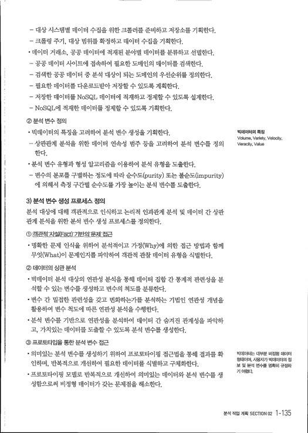
- 대상 시스템별 데이터 수집을 위한 크롤러를 준비하고 저장소를 기획한다．
- 크롤링 주기 , 대상 범위를 확정하고 데이터 수집을 기획한다．
#### · 데이터 거래소 , 공공 데이터에 적재된 분야별 데이터를 분류하고 선별한다．
- 공공 데이터 사이트에 접속하여 필요한 도메인의 데이터를 검색한다．
－검색한 공공 데이터 중 분석 대상이 되는 도메인의 우선순위를 정의한다．

- 필요한 데이터를 다운로드받아 저장할 수 있도록 계획한다．
- 저장한 데이터를 NoSQL 데이터에 적재하고 정제할 수 있도록 설계한다．
-NoSQL에 적재한 데이터를 정제할 수 있도록 기획한다． ② 분석 변수 정의

- 빅데이터의 특징을 고려하여 분석 변수 생성을 기획한다 .
- 상관관계 분적을 위한 데이터 연속정 범주 등을 고려하여 분석 변수를 정의
한다．

- 분석 변수 유형과 형성 알고리즘을 이용하여 분석 유형을 도출한다．
- 변수의 분포를 구별하는 정도에 따라 순슈도（purity) 또는 불순도（impurity) 
에 의해서 측정 구간별 순수도를 가장 높이는 분석 변수를 도출한다． 3) 분석 변수 생성 璉；세스 정의 분석 대상에 대해 객관적으로 인식하고 논리적 인과관계 분석 및 데이터 간 상관 관계 분석을 위한 분석 변수 생성 프로세스를 정의힌다． ① 갬관점2sI설（E蕣聊）희반의프문제겁근

- 명확한 문제 인식을 위하여 분석적이고 가정（why）에 의한 접근 방법과 함께 
무엇（What）이 문제인지를 파악하여 객관적 관찰 데이터 유형을 식별한다． ② 데이터의 상관 분석 ' 빅데이터 분석 대상의 연관성 분셕을 통해 데이터 집합 간 통계적 관련성을 분 석할 수 있는 변수를 생성하고 변수의 척도를 분류한다．

- 변수 간 밀접한 관런성을 갖고 변화하는가를 분적하는 기법인 연관성 개념을
활용하여 변수 척도에 따른 연관성 분석을 수행한다．

- 분적 변수를 기반으로 연관성을 분석하여 데이터 간 숨겨진 관계성을 파악하 
고 , 가치있는 데이터를 도출할 수 있도록 분석 변수를 생성한다． ③ 프로토타입을 통한 분석 변수 접근

- 의미있는 분적 변수를 생성하기 위하여 프로토타이핑 접근법을 통해 결과를 확 
인하며 , 반복적으로 개선하여 필요한 데이터를 식별하고 구쳬화한다． ' 프로토타이핑 모델로 반복적으로 개선하여 의미있는 데이터와 분석 변수를 생 성함으로써 비정형 데이터가 갖는 문제점을 해소한다．

> 빅데이터의 특징 
Volume, Variety, Velocity, Veracity, Value

> 빅데이터는 대부분 비정형 데이터 
형태이며 . 사용자가 빅데이터의 정 보 및 분석 변수를 명확히 규정하 기 어렵다．

> 분석즈榴 계획 SECTION02 1-135
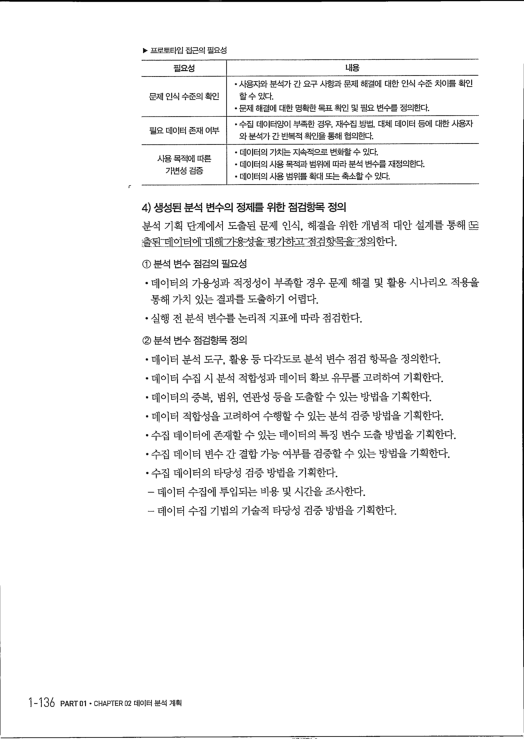
》 프로토타입 접근의 필요성 필요성 내용

- 사용자와 분석가 간 요구 사항과 문제 해결에 대한 인식 수준 차이를 확인
문제 인식 수준의 확인 할 수 있다．

- 문제 해결에 대한 명확한 목표 확인 및 필요 변수를 정의한다．
필요 데이터 존재 여부

- 수집 데이터양이 부족한 경우 , 재수집 . 방법 . 대체 데이터 등에 대한 사용자
와 분석가 간 반복적 확인을 통해 협의한다．

- 데이터의 가치는 지속적으로 변화할 수 있다．
ㅅ隱 목적에 따른

- 데이터의 사용 목적과 범위에 따라 분석 변수를 재정의한다．
가변성 검증

- 데이터의 사용 범위를 확대 또는 축소할 수 있다．
r 4) 생성된 분석 변수의 정저屠 위한 점검항목 정의

#### 분적 기획 단계에서 도출된 문제 인식 , 해결을 위한 개념적 대안 설계를 통해 呈
출된＝데의틔왜＝대홰긔즈용근넝을三평가희컫ㅍ점겁항목을켱의한다． ① 분석 변수 점검의 필요성

- 데이터의 가용성과 적정성이 부족할 경우 문제 해결 및 활용 시나리오 적욤을
통해 가치 있는 결과를 도출하기 어렵다．

- 실행 전 분적 변수를 논리적 지표에 따라 점검한다．
② 분석 변수 점검항목 정의

#### · 데이터 분적 도구 , 활용 등 다각도로 분적 변수 점검 항목을 정의한다 .
- 데이터 수집 시 분석 적함성과 데이터 확보  유 무 를’ 고려하여 기획한다．
#### · 데이터의 중복 , 범위 , 연관성 등을도출할수 있는 방법을 기획한다．
#### · 데이터 적합성을 고려하여 수행할 수 있는 분석 검증 방법을 기획한다 .
- 수집 데이터에 존재할 수 있는 데이터의 특징 변수 도출 방법을 기획힌다．
- 수집 데이터 변수 간 결합 가능 여부를 검증할 수 있는 방법을 기획한다．
- 수집 데이터의 타당성 검증 방법을 기획한다．
- 데이터 수집에 투입되는 비용 및 시간을 조사한다．
- 데이터 수집 기법의 기술적 타당성 검증 방법을 기획한다．
1-136 PART01 . CHAPTER02 데이터분석 계획 l

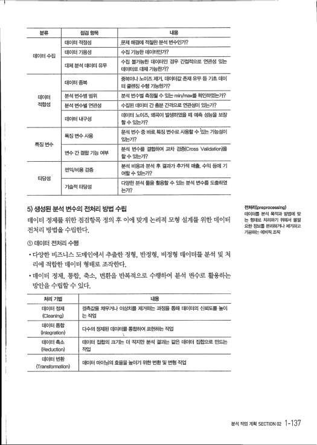
분류 점검 항목 내용 데이터 적정성 ．문제 해결에 적절한분석 변수인가？ 데이터 가용셩 수집 가능한 데이터인가？ 데이터 수집 대체 분석 데이터 유무 수집 불가능한 데이터인 경우 간접적으로 연관성 있는 데이터로 대체 가능한가？ 데이터 중복 중복이나노이즈 제거 . 데이터값존재 유무 등 기초 데이 터 클렌징 수행 가능한가？ 분석 변수별 범위 분석 변수별 측정될 수 있는 mmn/max를 확인하였는가？ 데이터 적합성 분석 변수별 연관성 수집된 데이터 간 충분 간격으로 연관성이 있는가？ 데이터 내구성 데이터 노이즈， 왜곡이 발생하였을 【대 예측 성능을 보장 ; 할수 있는가？ 특징 변수 사용 훈석 변수 중 바로특징 변수로 사용할수 밌는 가능성이 있는가？ 특징 변수 변수 간 결합 가능 여부 분석 변수를 결합하여 교차 검증《Cross Validation）을 할 수 있는가？ 편익／비용 검증 분석 비용과 분석 후 결과가 추가적 매출, 수익 등에 기 여할 수 있는가？ 타당성 기술적 타당성 다양한 분석 툴을 흴용할 수 있는 분석 변수를 도출하였 는가？ 5) 생성된 분석 변수의 전처리 방법 수립 데이터 정제를 위한 점검항목 정의 후 이에 맞게 논리적 모형 설계를 위한 데이터 전처리 방법을 수립한다． ① 데이터 전처리 수행

#### · 다양한 비즈니스 도메인에서 추출한 정형 , 반정형 , 비정형 데이터를 분석 및 처
리에 적합한 데이터 형태로 조작한다．

#### · 데이터 정제 , 통합 , 축소 , 변환을 반복적으로 수행하여 분적 변수로 활용하는
방안을 수립할수 있다． 처리 기법 내용 결측값을 차I우거나 이상치를 제거하는 과정을 통해 데이터의 신뢰도를 높이 데이터 정제 는 작업 (Cleaning) 데이터 통합 (Integration) 다수의 정제된 데이터를 통합하여 표현하는 작업 데이터 집합의 크기는 더 작지만 분석 결과는 같은 데이터 집합으로 만드는 데이터 축소 (Reduction) 작업 데이터 변환 (Transformation) 데이터 마이닝의 효율을 높이기 위한 변환 및 변형 작업

> 전처리（preprocessing) 
데이터를 분석 목적과 방법에 맞 는 형태로 처리하기 위해서 불필 요한 정보를 분리하거나 제거하5l 가공하는 예비적 조작

> 분석작업계획 SECTION02 1-137
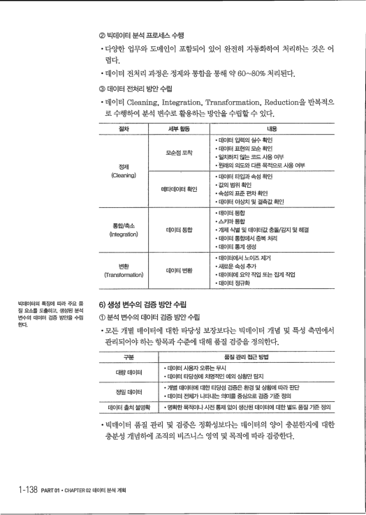
② 빅데이터 분석 盤쎄스 수행

- 다양한 업무와 도메인이 포함되어 있어 완전히 자동화하여 처리하는 것은 어
렵다．

- 데이터 전처리 과정은 정제와 통함을 통해 약 60'- 80% 처리된다．
③ 데이터 전처리 방안 수립 ' 녜의 너 (Uleaning, Integration, Translormatlon, teauction슬 1f쓱식쑈 로 수행하여 분석 변수로 활용하는 방안을 수립할 수 있다． 절차 세부 활동 내용

- 데이터 입력의 실수 확인 
- 데이터 표현의 모순 확인
모總 포착

- 일치하지 않는 코드 사용 여부
- 원래의 의묘 다른 목적으로 사용 여부
정제 (Cleaning)

- 데이터 타입과 속셩 확인 
- 값의 범위 확인 
- 속성의 표준 편차 확인
메타데이터 확인

- 데이터 이상치 및 결측값 확인
- 데이터 통합 
- 스키마 통합 
- 개체 식별 및 데이터값 충돌／감지 및 해결
통합／축소 (Integration) 데이터 통합

- 데이터 통합에서 중복 처리 
- 데이터 통계 생성
- 데이터에서 노이즈 제거 
- 새로운 속상추가 
- 데이터에 요약 작업 또는 집계 작업 
- 데이터 정규화
변환 (Transformation) 데이터 변환 빅데이터의 특징에 따라 주요 품 질 요소를 도출하고， 생성된 분석 변수의 데이터 검증 방안을 수립 6) 생성 변수의 검증 방안 수립 ① 분석 변수의 데이터 검증 방안 수립 한다．

- 모든 개별 데이터에 대한 타당성 보장보다는 빅데이터 개념 및 특성 측면에서
관리되어야 하는 항목과 수준에 대해 품질 검증을 정의한다． 구분 품질 관리 접근 방법 대량 데이터

- 데이터 사용자 오류는 무시 
- 데이터 타당성에 치명적인 예외 상황만 탐지
정밀 데이터

- 개별 데이터에 대한 타당성 검증은 환경 및 상황에 따라 판단
- 데이터 전체가 나타내는 의미를 중심으로 검증 기준 정의
데이터 출처 불명확

- 명확한 목적이나 사전 통제 없이 생산된 데이터에 대한 별도 품질 기준 정의
- 빅데이터 품질 관리 및 검증은 정확성보다는 데이터의 양이 충분한지에 대한
충분성 개념하에 조직의 비즈니스 영역 및 목적에 따라 검증한다． 1-138 PART01 · CHAPTER02 데이터분석 계획

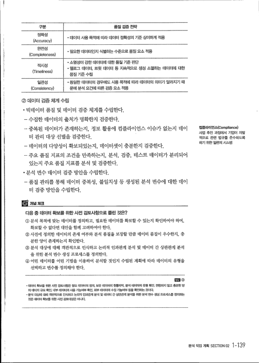
구분 품질 검증 전략 정확성 (Accuracy)

- 데이터 사용 목적에 따라 데이터 정확성의 기준 상이하게 적용
완전성 (Completeness)

- 필요한 데이터인지 식별하는 수준으로 품질 요소 적용
- 소멸성이 강한 데이터에 대한 품질 기준 판단 
- 웹로그 데이터 , 트윗 데이터 등 지속적으로 생성 소멸하는 데이터에 대한
적시성 (Timeliness) 품질 기준 수립 일관성 (Consistency)

- 동일한 데이터의 경우에도 사용 목적에 따라 데이터의 의미가 달라지기 때
문에 분석 요건에 따른 검증 요소 적용 ② 데이터 검증 체계 수립

- 빅데이터 품질 및 데이터 검증 쳬계를 수립한다．
- 수집한 데이터의 출처가 명확한지 검증한다．
#### －중복된 데이터가 존재하는지 , 정보 활용에 컴플라이언스 이슈가 없는지 데이
터 관리 대상 선별을 검증한다．

#### - 데이터의 다양성이 확보되었는지 , 데이터셋이 충분한지 검증한다．
－주요품질 지표의 조건을 만족하는지 , 분석 , 검증 , 테스트 데이터가분리되어 있는지 주요 품질 지표를 분석 및 검증한다．

#### · 분석 변수 데이터 검증 방안을 수립한다 .
#### - 품질 관리를 통해 데이터 중복성 , 불일치성 등 생성된 분석 변수에 대한 데이
터 검증 방안을 수립한다． 다음 중 데이터 확보를 위한 사전 검톼 항으로 틀린 것은？ ① 분석 목적에 맞는 데이터를 정의하고 , 필요한 데이터를 확보할 수 있는지 확인하여야 하며， 확보할 수 없다면 대안을 함께 고려하여야 한다． ② 사전에 정의한 데이터의 존재 여부와 분석 품질을 보장할 만큼 데이터 픔질이 위증＝한지 , 충 분한 양이 존재하는지 확인한다． ③ 분석 대상에 대해 객관적으로 인식하고 논리적 인과관계 분석 및 데이터 간 상관관계 분석 을 위한 분석 변수 생성 프로세스를 정의한다． ④ 어떤 데이터를 어떤 기법을 이용하여 분석할 것인지 수립된 계획에 따라 데이터의 유형을 선택하고 변수를 정의해야撞｝다．

- 데이터 확보틀 위한 사전 검토사항은 필요 데이터의 정의 . 보유 데이터의 현황파악. 분석 데이터의 유형 확인 . 편향되지 않고 충분한 양
의 데이터 규모 확인 , 내부 데이터의 사용 가능여부 확인 . 외부 데이터의 수집 가능여부 등을 확인하는 것이다．

- 분석 대상에 대해 객관적으로 인식하고 논리적 인과관계 분석 및 데이터 간 상관관겨I 분석을 위한 분석 변수 생성 프뢰 l스를 정의하는
것은 데이터 확보를 위한 사전 검토대상은 아니다．

> 컴플라이언스（Compliance)
> 사업 추진 과정에서 기업이 자발
> 적으로 관련 법규를 준수하도록
> 하기 위한 일련의 시스템
> 粗圄．(D
> 분석 친땝 계획 SECTION 02 1 -139
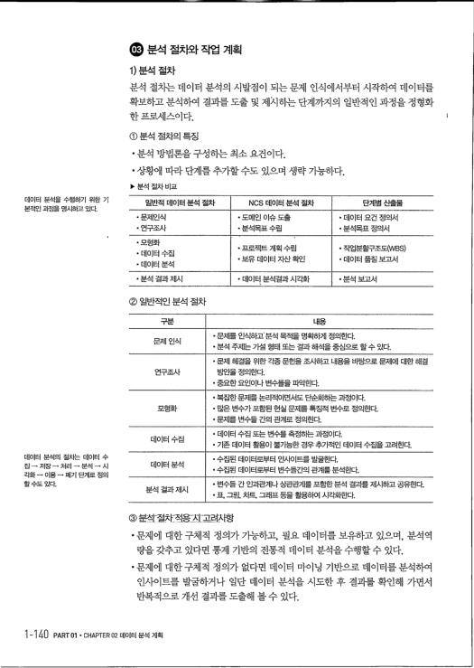
.

분석 절차와직쩝 계획 1) 분석 절차 분석 절차는 데이터 분석의 시발점이 되는 문제 인식에서부터 시작하여 데이터를 확보하고 분적하여 결과를 도출 및 제지하는 단계까지의 일반적인 과정을 정형화 한 프로세스이다． ① 분석 절차의 특징

- 분석 방법론을 구성하는 최소 요건이다．
- 상황에 따라 단계를 추가할 수도 있으며 생략 가능하다．
> 분석 절차 비교
데이터 분석을 수행하기 위한 기 본적인 과정을 명시하고 있다． 일반적 데이터 분석 절차 NCS 데이터 분식 절차 단계별 산출물

- 문제인식 
- 연구조사 
- 도메인 이슈 도출 
- 분석목표 수립 
- 데이터 요건 정의서 
- 분석목표 정의서
- 모형화 
- 데이터 수집 
- 데이터 분석
- 프로젝트 계획 수립 
- 보유 데이터 차산 확인 
- 작업분할구조도（WBS)
- 분석 결과 제시 
- 데이터 분석결과 시각화 
- 분석 보고서
② 일반적인 분석 절차 구분 내용 문제 인식

- 문제를 인식하고 " 분석 목적을 명확하게 정의한다． 
- 분석 주저는 가설 형태 또는 결과 해석을 중심으로 할 수 있다．
연구조사

- 문제 해결을 위한 각종 문헌을 조사하고 내용을 바탕으로 문제에 대한 해결
방안을 정의한다．

- 중요한요인이나 변수들을 파악한다．
- 복잡한 문제를 논리적이면서도 단순화하는 과정이다． 
- 많은 변수가 포함된 현실 문저隱 특징적 변수로 정의힌다． 
- 문저隱 변수들 간의 관계로 정의한다．
모형화 데이터 수집

- 데이터 수집 또는 변수를 측정하는 과정이다． 
- 기존 데이터 횔용이 불가능한 경우 추가적인 데이터 수집을 고려힌다．
데이터 분석의 절차는 데이터 수 집 - 저장 - 처리 → 분석 → 시 각화－* 이용 - 폐기 단계로 정의 할 수도 있다． 데이터 분석

- 수집된 데이터로부터 인사이트를 발굴한다． 
- 수집된 데이터로부터 변수들간의 관계를 분석한다．
분석 결과 제시

- 변수들 간 인과관계나 상관관계를 포함한 분석 결과를 제시하고 공유힌다． 
- 표， 그림 , 차트， 그래프 등을 활용하여 시각화한다．
③ 분석H절차：적용그」i려사항

#### · 문제에 대한 구쳬적 정의가 가능하고 , 필요 데이터를 보유하고 있으며 , 분적역
량을 갖추고 있다면 통계 기반의 전통적 데이터 분석을 수행할 수 있다．

- 문제에 대한 구쳬적 정의가 없다면 데이터 마이닝 기반으로 데이터를 분석하여
인사이트를 발굴하거나 일단 데이터 분석을 시도한 후 결과를 확인해 가면서 반복적으로 개선 결과를 도출해 볼 수 있다． 1 -140 PART 01 . CHAPTER 02데이터분석 계획

> - 데이터 품질 보고서
I

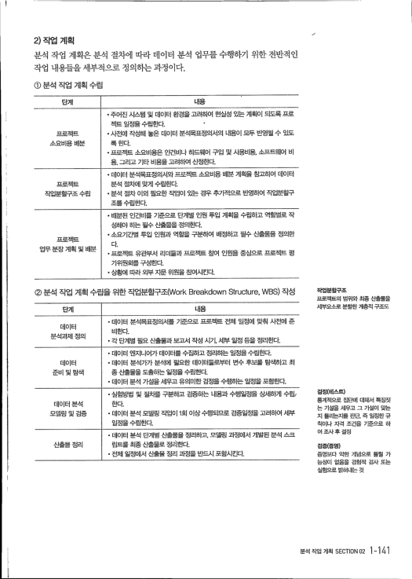
2) 작업 계획 분석 작업 계획은 분석 절차에 따라 데이터 분적 업무를 수행하기 위한 전반적인 작업 내 g 들 을 세부적으로 정의하는 과정이다． ① 분석 작업 계획 수립 단계 내용

- 주어진 시스템 및［ 데이터 환경을 고려하여 현실성 있는 계획이 되도록 프로
젝트 일정을 수립한다．

- 사전에 작성해 놓은 데이터 분석목표정의서의 내용이 모두 반영될 수 있도
프로젝트 소요비용 배분 록 한다．

- 프로젝트 소요비용은 인건비나 하드웨어 구입 및 사용비용 , 소프트웨어 비
용 , 그리고 기타 비용을 고려하여 산정한다．

- 데이터 분석목표정의서와 프로젝트 소요비용 배분 계획을 참고하여 데이터
쿠젝트 분석 절차에 맞게 수립한다．

- 분석 절차 이외 필요한 작업이 있는 경우 추가적으로 반영하여 작업분할구
작업분할구조수립 조를수립한다．

- 배분된 인건비를 기준으로 단계별 인원 투입 계획을 수립하고 역할별로 작
성해야 하는 필수 산출물을정의한다．

- 소요기간별 투입 인원과 역할을 구분하여 배정하고 필수 산출물을 정의한
프로젝트 다．

- 프로젝트 유관부서 리더들과 프로젝트 참여 인원을 중심으로 프로젝트 펑
업무 분장 계획 및 배분 가위원회를구셩한다．

- 상황에 따라 외부 자문 위원을 참여시킨다．
② 분석 작업 계획 수립을 위한 작업분할구조（Work Breakdown Structure, WBS) 작성 단계 내용

- 데이터 분석목표정의서를 기준으로 프로젝트 전체 일정에 맞춰 사전에 준
데이터 비한다．

- 각 단계별 필요 산출물과 보고서 작성 시기 . 세부 일정 등을 정리한다．
분석과제 정의

- 데이터 엔지니어가 데이터를 수집하고 정리하는 일정을 수립한다．
- 데이터 분석가가 분석에 필요한 데이터들로부터 변수 후보를 탐색하고 최
데이터 종 산출물을 도출하는 일정을 수립힌다． 준비 및 탐색

- 데이터 분석 가설을 세우고 유의미한 검정을 수행하는 일정을 포함한다．
- 실험방법 El[ 절차를 구분하고 검증하는 내용과 수행일정을 상세하게 수립／
데이터 분석 한다．

- 데이터 분석 모델링 작업이 1회 이상 수행되므로 검증일정을 고려하여 세부
모델링 및 검증 일정을수립한다． 산출물 정리

- 데이터 분석 단계별 산출물을 정리하고， 모델링 과정에서 개발된 분석 스크
립트를 최종 산출물로 정리힌다．

- 전체 일정에서 산출물 정리 과정을 반드시 포함시킨다．
> 작업분할구조 
프로젝트의 범위와 최종 산출물을 세부요소로 분할한 계층적 구조도

> 검정（테스트）
> 통계적으로 집단에 대해서 특징짓 
는 가설을 세우고 그 가설이 맞는 지 틀리는지를 판단, 즉 일정한 규 칙이나 자격 조건을 기준으로 하 여 조사 후 결정

> 검증（증명） 
증명보다 약한 개념으로 틀릴 가 능성이 없음을 경험적 검사 또는 실험으로 밝혀내는 것

> 분석친땝계획 SECTION02 1-141
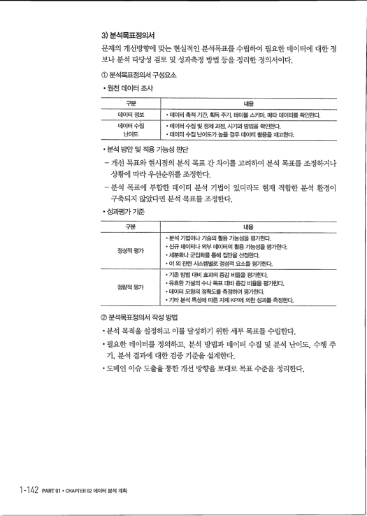
3) 분석목표정의서 문제의 개선방향에 맞는 현실적인 분석목표를 수립하여 필요한 데이터에 대한 정 보나 분석 타당성 검토 및 성과측정 방법 등을 정리한 정의서이다． ① 분석목표정의서 구성요소

- 원천 데이터 조사
구분 내용 데이터 정보

- 데이터 축적 기간. 획득 주기 . 테이블 스키마, 메타 데이터를 확인힌빠．
데이터 수집 난이도

- 데이터 수집 및 정제 과정 , 시기와 방법을 확인한다． 
- 데이터 수집 난이도가 높을 경우 데이터 활용을 재고힌다．
- 분석 방안 및 적용 가능성 판단
- 개선 목표와 현시점의 분석 목표 간 차이를 고려하여 분석 목표를 조정하거나
상황에 따라 우선순위를 조정한다．

- 분석 목표에 부합한 데이터 분석 기법이 있더라도 현재 적합한 분석 환경이
구축되지 않았다면 분석 목표를 조정한다．

- 성과평가 기준
구분 내용

- 분석 기법이나 기술의 활용 가능성을 평가힌다． 
- 신규 데이터나 외부 데이터의 횔용 가눼을 평가한다． 
- 세분화나 군집화를 통해 집단을 선정한다． 
- 이 외 관련 시스템별로 정성적 요소를 평가한다．
정성적 평가

- 기존 방법 대비 효과의 증감 비율을 펑가한다． 
- 유효한 가설의 수나 목표 대비 증감 비율을 펑가한다． 
- 데이터 모형의 정확도를 측정하여 평가힌다． 
- 기타 분석 특셩에 따른 차체 KPI에 의한 성과를 측정한다．
정량적 평가 ② 분석목표정의서 작성 방법

- 분석 목적을 설정하고 이를 달성하기 위한 세부 목표를 수립한다．
- 필요한 데이터를 정의하고 , 분석 방법과 데이터 수집 및 분적 난이도 , 수행 주
기 , 분석 결과에 대한검증 기준을설계한다．

- 도메인 이슈 도출을 통한 개선 방향을 토대로 목표 수준을 정리한다．
1 -142 PART 01 . CHAPTER 02 데이터 분석 계획

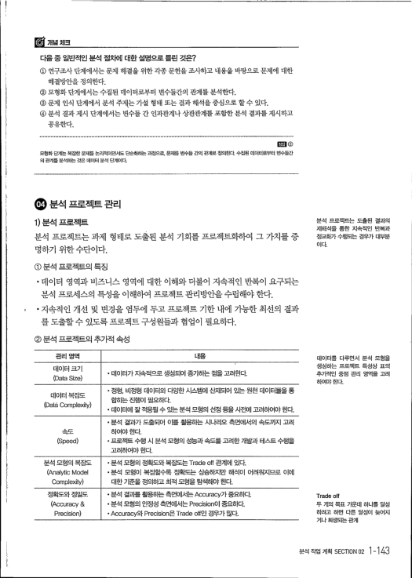
다음 중 일반적인 분석 절차에 대한 설명으로 틀린 것은？ ① 연구조사 단계에서는 문제 해결을 위한 각종 문헌을 조사하고 내용을 바탕으로 문제에 대한 해결방안을 정의한다． ② 모형화 단계에서는 수집된 데이터로부터 변수들간의 관계를 분석한다． ③ 문제 인식 단계에서 분석 주제는 가설 형태 또는 결과 해석을 중심으로 할 수 있다． ④ 분석 결과 제시 단계에서는 변수들 간 인과관계나 상관관계를 포함한 분석 결과를 제시하고 공유한다． 모형화 단겨는 복잡한 문제를 논리적이면서도 단순화하는 과정으뢰 문저屠 변수들 긴넌』 관겨隍 정의한다. 수집된 데이터로부터 변수들간 의 관계를 분석하는 것은 데이터 분석 단계이다．

# L 
- .분석프로젝트관리 1) 분석 프로젝트 분석 프로젝트는 과제 형태로 도출된 분석 기회를 프로젝트화하여 그 가치를 증 명하기 위한수단이다． ① 분석 프로젝트의 특징

- 데이터 영역과 비즈니스 영역에 대한 이해와 더불어 지속적인 반복이 요구되는
분석 프로세스의 특성을 이해하여 프로젝트 관리방안을 수립해야 한다．

- 지속적인 개선 및 변경을 염두에 두고 프로젝트 기한 내에 가능한 최선의 결과 
를 도출할 수 있도록프로젝트 구성원들과 협업이 필요하다． ② 분석 프로젝트의 추가적 속성 관리 영역 내용 데이터 크기 (Data Size)

- 데이터가 지속적으로 생성되어 증가하는 점을 고려한다．
- 정형 , 비정형 데이터와 다양한 시스템에 산재되어 있는원천 데이터들을 통
데이터 복잡도 합하는 진행이 필요하다． (Data Complexity)

- 데이터에 잘 적용될 수 있는 분석 모형의 선정 등을 사전에 고려하여야 힌다．
- 분석 결과가 도출되어 이를 활용하는 시나리오 측면에서의 속도까지 고려
속도 하여야 한다．

- 프로젝트 수행 시 분석 모형의 성능과 속도를 고려한 개발과 테스트 수행을
(Speed) 고려하여야 한다． 분석 모형의 복잡도

- 분석 모형의 정혼朽2 복잡도는 Trade off 관계에 있다．
` I 卜 ＇ ~ ,

- 분석 모형이 복잡할수록 정확도는 상승하지만 해석이 어려워지므로 이에
(Analytic Model 대한 기준을 정의하고 최적 모형을 탐색해야 힌다． Complexity) 정확도와 정밀도

- 분석 결과를 활용하는 측면에서는Accuracy가 중요하다．
- 분석 모형의 안정성 측면에서는 Precision이 중요하다．
(Accuracy & Precision)

- Accuracy와 Precision은 Trade off인 경우가 많다．
> 齟睡
> 분석 프로젝트는 도출된 결과의 
재해석을 통한 지속적인 반복과 정교화가 수행되는 경우가 대부분

> 이다．
> 데이터를 다루면서 분석 모형을 
생성하는 프로젝트 특성상 표의 추가적인 중점 관리 영역을 고려 하여야 한다．

> Trade off 
두 개의 목표 가운데 하나를 달성 해려고 하면 다른 달성이 늦어지 거나 희생되는 관계

> 분석작업계획 SECTION 02 H43
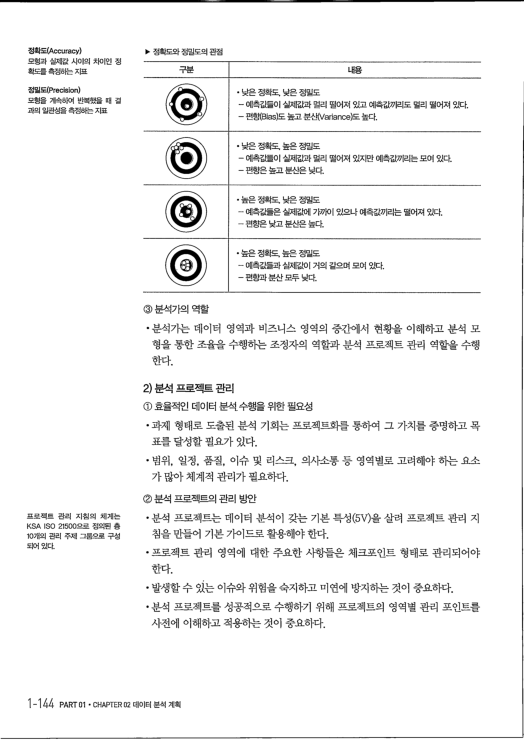
정확도（Accuracy) 모형과 실제값 사이의 차이인 정 확도를 측정ㅎ隱 지표 》 정확도와 정밀도의 관점 구분 내용 정밀도（Precision) 모형을 계속하여 반복했을 때 결 과의 일관성을 측정하는 지표 ●

- 낮은 정확도， 낮은 정밀도
- 예측값들이 실제값과 멀리 떨어져 있고 예측값끼리도 멀리 떨어져 있다． 
- 편힝(Bias）도 높고 분신〈Variance）도 높다．
- α．
S

# 0
- 낮은 정확도， 높은 정밀도
- 예측값들이 실제값과 멀리 떨어져 있지만 예측값끼리는 모여 있다． 
- 편향은 높고 분산은 낮다．
- 높은 정확도， 낮은 정밀도
## 鞭
- 예측값들은 실제값에 가까이 있으나 예측값끼리는 떨어져 있다． 
- 편향은 낮고 분산은 높다．
- 높은 정확도， 높은 정밀도
## .O
- 예측값들과 실제값이 거의 같으며 모여 있다． 
- 편힝확 분산 모두 낮다．
③ 분석가의 역할

- 분석가는 데이터 영역과 비즈니스 영역의 중간에서 현황을 이해하고 분석 모
형을 통한 조율을 수행하는 조정자의 역할과 분석 프로젝트 관리 역할을 수행 한다． 2) 분석 프로젝트 관리 ① 효율적인 데이터 분석．수행을 위한 필요성

- 과제 형태로 도출된 분석 기회는 프로젝트화를 통하여 그 가치를 증명하고 목 
표를 달성할 필요가 있다．

- 범위 , 일정 , 품질 , 이슈 및 리스크 , 의사소통 등 영역별로 고려해야 하는 요소
가 많아 쳬계적 관리가 필요하다． ② 분석 프로젝트의 관리 방안 프로젝트 관리 지침의 체계는 KSA IS0 21500으로 정의된 총 10개의 관리 주제 그룹으로 구성 되어 있다．

- 분석 프로젝트는 데이터 분석이 갖는 기본 특정（5V）을 살려 프로젝트 관리 지
침을 만들어 기본 가이드로 활용해야 한다．

- 프로젝트 관리 영역에 대한 주요한 사항들은 쳬크포언트 형태로 관리되어야
한다．

- 발생할 수 있는 이슈와 위험을 숙지하고 미연에 방지하는 것이 중요하다．
- 분석 프로젝트를 성공적으로 수행하기 위해 프로젝트의 영역별 관리 포인트를
사전에 이해하고 적용하는 것이 중요하다． 1 -144 PART 01 . CHAPTER 02 데이터 분석 계획

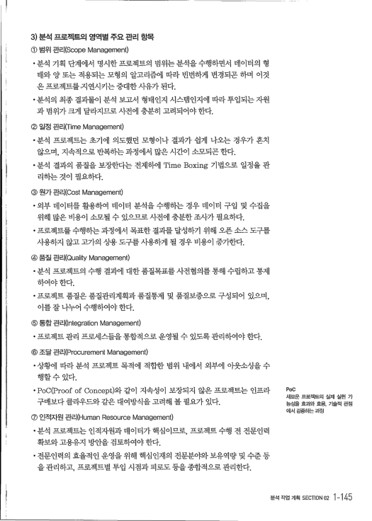
3) 분석 프로젝트의 영역별 주요 관리 항목 ① 범위 관리（Scope Management)

- 분석 기획 단계에서 명시한 프로젝트의 범위는 분석을 수행하면서 데이터의 형
태와 양 또는 적용되는 모형의 알고리즘에 따라 빈번하게 변경되곤 하며 이것 은 프로젝트를；지연시키는 중대한 사유가 된다．

- 분적의 최종 결과물이 분석 보고서 형태인지 시스템인지에 따라 투입되는 자원
과 범위가 크게 달라지므로 사전에 충분히 고려되어야 한다． ② 일정 관리（Time Management)

- 분석 프로젝트는 초기에 의도했던 모형이나 결과가 쉽게 나오는 경우가 흔치
않으며 , 지속적으로 반복하는과정에서 많은 시간이 소모되곤한다．

- 분석 결과의 품질을 보장한다는 전제하에 Time Boxing 기법으로 일정을 관
리하는 것이 필요하다． ③ 원가관리（Cost Management)

- 외부 데이터를 활용하여 데이터 분적을 수행하는 경우 데이터 구입 및 수집을
위해 많은 비용이 소모될 수 있으므로 사전에 충분한 조사가 필요하다．

- 프로젝트를 수행하는 과정에서 목표한 결과를 달성하기 위해 오픈 소스 도구를
사용하지 않고 고가의 상용 도구를 사용하게 될 경우 비용이 증가한다． ④ 품질 관리（Quality Management)

- 분석 프로젝트의 수행 결과에 대한 품질목표를 사전협의를 통해 수립하고 통제
하여야 한다．

- 프로젝트 품질은 품질관리계획과 품질통제 및 품질보증으로 구성되어 있으며，
#### 이를 잘 나누어 수행하여야 한다 .
⑤ 통합 관리(Integration Management)

- 프로젝트 관리 프로세스들을 통합적으로 운영될 수 있도록 관리하여야 한다．
⑥ 조달 관리（Procurement Management)

- 상힁뻬 따라 분석 프로젝트 목적에 적합한 범위 내에서 외부에 아웃소싱을 수
행할 수 있다．

- PoC(Proof of Concept）와 같이 지속정이 보장되지 않은 프로젝트는 인프라
구매보다 클라우드와 같은 대여방식을 고려해 볼 필요가 있다． ⑦ 인적자원 관리（Human Resource Management)

- 분석 프로젝트는 인적자원과 데이터가 핵심이므로 , 프로젝트 수행 전 전문인력
확보와 고용유지 방안을 검토하여야 한다．

- 전문인력의 효율적인 운영을 위해 핵심인재의 전문분야와 보유역량 및 수준 등 
을 관리하고 , 프로젝트별 투입 시점과 피로도 등을종함적으로 관리한다．

> Poc 
새로운 프로젝트의 실제 실현 가 능성을 효과와 효용. 기술적 관점 에서 검증하는과정

> 분석tcl계획 SECTION 02 1-145
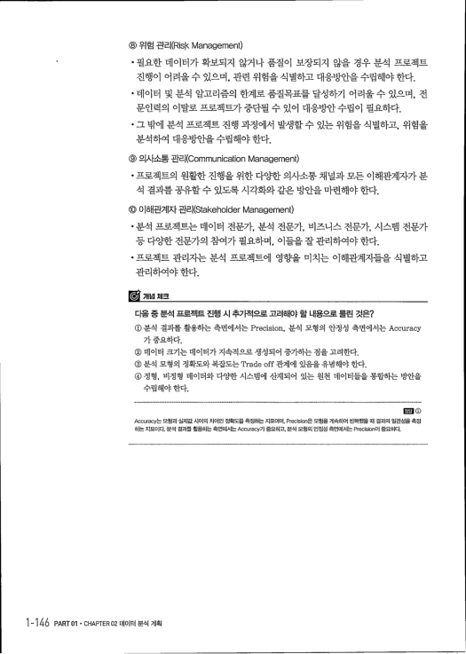
⑧ 위험 관리（Risc Management)

- 필요한 데이터가 확보되지 않거나 품질이 보장되지 않을 경우 분석 프로젝트
진행이 어려울수 있으며 , 관런 위험을 식별하고 대응방안을 수립해야 한다．

- 데이터 및 분석 알고리즘의 한계로 품질목표를 달성하기 어려울 수 있으며 , 전
문인력의 이탈로 프로젝트가 중단될 수 있어 대응방안 수립이 필요하다．

- 그 밖에 분석 프로젝트 진행 과정에서 발생할 수 있는 위험을 식별하고 , 위험을
#### 분석하여 대응방안을 수립해야 한다 .
⑨ 의사소통 관리（Communication Management)

- 프로젝트의 원활한 진행을 위한 다양한 의사소통 채널과 모든 이해관계자가 분
석 결과를 공유할 수 있도록 시각화와 같은 방안을 마런해야 한다． ⑩ 이해관계자 관리（Stakeholder Management)

- 분석 프로젝트는 데이터 전문가 , 분석 전문가 , 비즈니스 전문가 , 시스템 전문가 
등 다양한 전문가의 참여가 필요하며 , 이들을 잘 관리하여야 한다．

- 프로젝트 관리자는 분석 프로젝트에 영향을 미치는 이해관쳬자들을 식별하고
관리하여야한다． 다음 중 분석 프로젝트 진행 시 추가적으로 고려해야 할 내용으로 틀린 것은？ ① 분석 결과를 활용하는 측면에서는 Precision , 분석 모형의 안정성 측면에서는 Accuracy 가 중요하다． ② 데이터 크기는 데이터가 지속적으로 생성되어 증가하는 점을 고려한다． ③ 분석 모형의 정확도와 복잡도는 Trade off 관계에 있음을 유넘해야 한다． ④ 정형 , 비정형 데이터와 다양한 시스템에 산재되어 있는 원천 데이터들을 통합하는 방안을 수립해야 한다． Accuracy는모헝과실저尾尤사이의 차이인 정확도를 측정하는 지표이며 . Precision은 모형을 겨陰하여 반복했을 때 결과의 일관성을 측정 하는 지표이다 . 분석 결과를 횔용하는 측면에서는 Accuracy가 중요하ㅍ긱 분석 모형의 안정성 측연에서는 Precision이 중요하다． 1 -146 PART 01 . CHAPTER 02데이터분석 계획

> 뎐래①
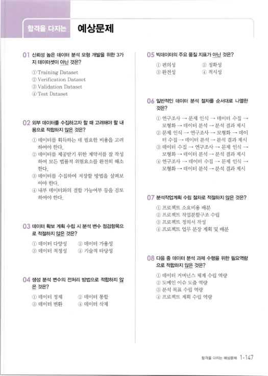
## 예상문제
05 빅데이터의 주요 품질 지표가 아닌 것은？ 01 신뢰성 높은 데이터 분석 모형 개발을 위한 3가 지 데이터셋이 아닌 것은？ ① 편의성 ② 정확성 ③완전성 （互） 적시성 ① Training Dataset ② Verification Dataset ③ Validation Dataset ④ Test Dataset 06 일반적인 데이터 분석 철차를 순서대로 나열한 것은？

#### ① 연구조사 → 문제 인식 → 데이터 수집 → 
모형화 → 데이터 분적 → 분적 결과 제시 ② 문제 인식 → 연구조사 → 모형화 → 데이 02 외부 데이터를 수집하고자 할 때 고려해야 할 내 용으로 적합하지 않은 것은？ ① 데이터를 획득하는 데 필요한 비용을 고려

#### 터 수집 → 데이터 분석 → 분석 결과 제시 
③ 데이터 수집 → 연구조사 → 문제 인식 → 모형화→ 데이터 분석 → 분적 결과 제시 ④ 연구조사 → 데이터 수집 → 문제 인식 → 모형화 → 데이터 분석 → 분적 결과 제시 하여야 한다． ② 데이터를 제공받기 위한 계약서를 잘 작성 하여 모든 법률적 위험요소를 완전히 해소 한다． ③ 데이터를 수집하여 저장할 방법을 살펴보 아야 한다． ④ 내부 데이터와의 결합 가능여부 등을 검토 07 분석작업계획 수립 절차로 적절하지 않은 것은？ 하여야 한다． ① 프로젝트 소요비용 배분 ② 프로젝트 작업분할구조 수립 ③ 프로젝트 정의서 작성 ④ 프로젝트 업무 분장 계획 및 배분 03 데이터 확보 계획 수립 시 분석 변수 점검항목으 로 적절하지 않은 것은？ ① 데이터 다양성 ② 데이터 가용성 ③ 데이터 적정성 ④ 기술적 타당성 08 다음 중 데이터 분석 과제 수행을 위한 필요역량 으로 적합하지 않은 것은？ ① 데이터 거버넌스 체계 수립 역량 ② 도메인 이슈 도출 역량 ③분적 목표 수립 역량 ④ 프로젝트 계획 수립 역량 04 생성 분석 변수의 전처리 방법으로 적합하지 않 은 것은？ ① 데이터 정제 ② 데이터 통합 （軫 데이터 변환 ④ 데이터 삭제

> 합격을 다지는예상문제 ㅏ 47
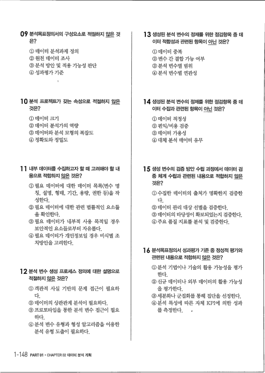
09 분석목표정의서의 구성요소로 적절하지 않은 것 13 생성된 분석 변수의 정제를 위한 점검항목 중 데 이터 적합성과 관련된 항목이 아닌 것은？ 은？ ① 데이터 분석과제 정의 ② 원천 데이터 조사 ③ 분석 방안 및 적용 가능성 판단 ④ 성과평가 기준 ① 데이터 중복 ② 변수 간 결합 가능 여부 ③ 분석 변수별 범위 ④ 분석 변수별 연관성 10 분석 프로젝트가 갖는 속성으로 적절하지 않은 14 생성된 분석 변수의 정제를 위한 점검항목 중 데 이터 수집과 관런된 항목이 아닌 것은？ 것은？ ① 데이터 크기 ② 데이터 분석가의 역량 ③ 데이터와 분석 모형의 복잡도 ④ 정확도와 정밀도 ①데이터 적정성 ② 편익／비용 검증 ③ 데이터 가용성 ④ 대쳬 분석 데이터 유무

#### 1 1 내부 데이터를 수칩하고자 할 때 고려해야 할 내 
용으로 적합하지 않은 것은？ 1 5 생성 변수의 검증 빙단 수립 과정에서 데이터 검 증 체계 수립과 관련된 내용으로 적합하지 않은 것은？ ① 필요 데이터에 대한 데이터 목록（변수 명 칭 , 설명 , 형태 , 기간 , 용량 , 권한등）을작 ①수집한 데이터의 출처가 명확한지 검증한 성한다． ② 필요 데이터에 대한 관런 법률적인 요소들 다． ② 데이터 관리 대상 선별을 검증한다． ③ 데이터의 타당성이 확보되었는지 검증한다． ④ 주요 품질 지표를 분석 및 검증한다． 을확인한다． ③필요 데이터가 내부적 사용 목적일 경우 보안적인 요소들로부터 자유롭다． ④ 필요 데이터가 개인정보일 경우 비식별 조 치방안을고려한다．

#### 1 6 분석목표정의서 성과평가 기준 중 정성적 평가와
곤르크된 내용으로 적합하지 않은 것은？ ①분석 기법이나 기술의 활용 가능성을 평가 12 분석 변수 생성 羈l제스 정의에 대한 설명으로 한다． ② 신규 데이터나 외부 데이터의 활용 가능성 을 평가한다． ③세분화나군집화를통해 집단을 선정한다． ④분석 특성에 따른 자쳬 KPI에 의한 성과 를측정한다． 적절하지 않은 것은？ ①객관적 사실 기반의 문제 접근이 필요하 다． ② 데이터의 상관관계 분적이 필요하다． ③ 프로토타입을 통한 분적 변수 접근이 필요 하다． ④ 분석 변수 유형과 형성 알고리즘을 이용한 분석 유형 도출이 필요하다． 1 -148 PART 01 - CHAPTER 02 데이터 분석 계획

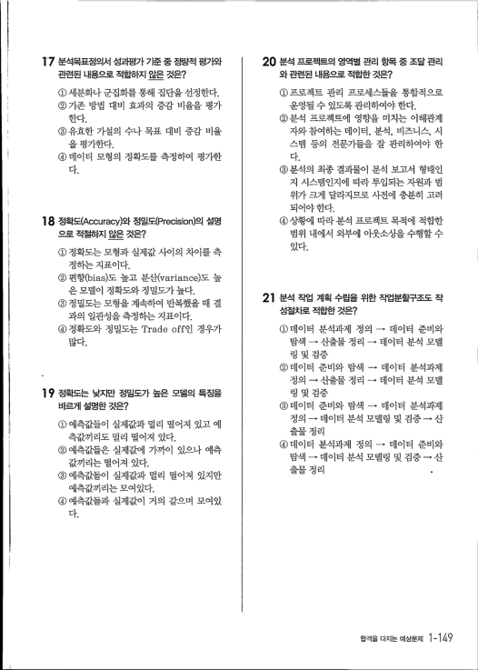
17 분석목표정의서 성과평가 기준 중 정량적 평가와 20 분석 프로젝트의 영역별 관리 항목 중 조달 관리 와 관련된 내용으로 적합한 것은？ 관련된 내용으로 적합하지 않은 것은？ ①프로젝트 관리 프로세스들을 통합적으로 ① 세분화나 군집화를 통해 집단을 선정한다． ② 기존 방법 대비 효과의 증감 비율을 평가 운영될 수 있도록 관리하여야 한다． ②분적 프로젝트에 영향을 미치는 이해관계 자와참여하는 데이터 , 분석 , 비즈니스 , 시 한다． ③유효한 가설의 수나 목표 대비 증감 비율 을 평가한다． ④데이터 모형의 정확도를 측정하여 평가한 스템 등의 전문가들을 잘 관리하여야 한 다． ③분적의 최종 결과물이 분적 보고서 형태인 지 시스템인지에 따라 투입되는 자원과 범 위가 크게 달라지므로 사전에 충분히 고려 다． 되어야한다． ④ 상황에 따라 분석 프로젝트 목적에 적합한 범위 내에서 외부에 아웃소싱을 수행할 수 18 정확도（Accuracy）와 정밀도（Precision）의 설명 으로 적절하지 않은 것은？ 있다． ① 정확도는 모형과 실제값 사이의 차이를 측 정하는 지표이다． ② 편향α)ias）도 높고 분산（variance）도 높 은 모델이 정확도와 정밀도가 높다． ③ 정밀도는 모형을 계속하여 반복했을 때 결 과의 일관성을 측정하는 지표이다． ④ 정확도와 정밀도는 Trade off인 경우가 21 분석 작업 계획 수립을 위한 작업분할구조도 작 성절차로 적합한 것은？

#### ①데이터 분석과제 정의 → 데이터 준비와 
탐색 → 산출물 정리 → 데이터 분적 모델 링 및 검증 ②데이터 준비와 탐색 - 데이터 분석과제 정의 → 산출물 정리 → 데이터 분석 모델 링 및 검증 ③데이터 준비와 탐잭 → 데이터 분석괴쎄 정의 －→ 데이터 분석 모델링 및 검증 → 신r 출물 장리 ④데이터 분석과제 정의 → 데이터 준비와 탐색 → 데이터 분석 모델링 및 검증 → 산 출물 정리 많다．

#### 1 ' 정확도는 낮지만 정밀도가 높은 모델의 특징을
바르게 설명한 것은？ ① 예측값들이 실제값과 멀리 떨어져 있고 예 측값끼리도 멀리 떨어져 있다． ② 예측값들은 실제값에 가까이 있으나 예측 값끼리는 떨어져 있다． ③ 예측값들이 실제값과 멀리 떨어져 있지만 예측값끼리는 모여있다． ④ 예측값들과 실제값이 거의 같으며 모여있 다．

> 합격을다지는예상문제 1-149
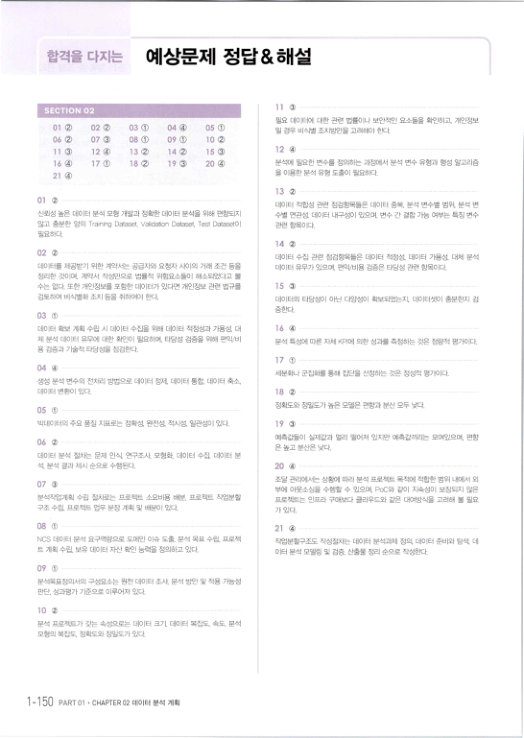
## 합격을다지는 
예상문제 정답＆해설 11 c) ……………………………………… …………………∼……………… SECTION 02 필요 데이터에 대한 관련 법률이나 보안적인 요소들을 확인하고， 개인정보 일 경우 비식별 조치방안을 고려해야 한다． 04 C) 09 ① 14 ② 19 c) 05 (D lo (2:I 15 （횰：) 02 ② 01 ② 03 ① 08D 07 （톱） 06 (2) 12 ④ …………… ……… ………………………… …… 11 ③ 12 C) 17 《j:) 13 ② 분석에 필요한 변수를 정의하는 과정에서 분석 변수 유형과 형성 알고리즘 을 이용한 분석 유형 도출이 필요하다． 】 6 （軫 18 ② 20 C) 21 C) 13 (2) 0l ② …… 데이터 적합성 관련 점검항목들은 데이터 중복． 분석 변수별 범위． 분석 변 신뢰성 높은 데이터 분석 모형 개발과 정확한 데이터 분석을 위해 편향되지 않고 충분한 양의 Training Dataset. Validation Dataset, Test Dataset이 수별 연관성． 데이터 내구성이 있으며． 변수 간 결합 가능 여부는 특징 변수 관런 항목이다． 필요하다． 14 ② ……… … … … … 02 ② 데이터 수집 관련 점검힝목들은 데이터 적정성 , 데이터 가용성 . 대체 분석 데이터 유무가 있으며． 편익／비용 검증은 타당성 관련 항목이다． 데이터를 제공받기 위한 계약서는 공급자와 요청자 사이의 거래 조건 둥을 정리한 것이며 . 계약서 작성만으로 법률적 위험요소들이 해소되었다고 볼 수는 없다． 또한 개인정보를 포함한 데이터가 있다면 개인정보 관련 법규를 15 《쵸：l …… ……… … ……… ………… ……… 검토하여 비식별화 조치 등을 취하여야 힌다． 데이터의 타당성이 아닌 다양성이 확보되었는지 . 데이터셋이 충분한지 검 증한다． 03 ① ………………… ………… ……………………∼ 데이터 확보 계획 수립 시 데이터 수집을 위해 데이터 적정성과 가聚〕 . 대 체 분석 데이터 유무에 대한 확인이 필요하며 . 타당성 검증을 위해 편익／비 용 검증과 기술적 타당성을 점검한다， 16 ④ ……………… … …………………… ……… 분석 특성에 따른 자체 KPI0ㅔ 의한 성과를 측정하는 것은 정량적 평가이다． 17 <j:) ……………… … 」…………… 04 ④ … …………………………………∼……∼……………………… 세분화나 군집화를 통해 집단을 선정하는 것은 정성적 평가이다． 생성 분석 변수의 전처리 방법으로 데이터 정제 , 데이터 통합． 데이터 축소， 데이터 변환이 있다． 18 ② … … 정확도와 정밀도가 높은 모델은 편향과 분산 모두 낮다． 0S ① … …………… …………………………… ……… 빅데이터의 주요 품질 ㅈ匯로는 정확성． 완전성 . 적시성 . 일관성이 있다． 19 ③ 예측값들이 실제값과 멀리 떨어져 있지만 예측값끼리는 모여있으며 . 편향 은 높고 분산은 낮다， 06 ② …………… …………………………………… ……… 데이터 분석 절차는 문제 인식 . 연구조사. 모형화． 데이터 수집， 데이터 분 석． 분석 결과 제시 순으로 수행된다． 20 ④  .

④ .

④ .

④ .

④ .

④ .. ... . . .. ....... .... .... ... ..... ... .

조달 관리에서는 상황에 따라 분석 프로젝트 목적에 적합한 범위 내에서 외 뷔게 아웃소싱을 수행할 수 있으며 , PoC와 같이 지속성이 보장되지 않은 프로젝트는 인프라 구매보다 클라우드와 같은 대여방삭을 고려해 볼 필요 가 있다． 07 c) … … …………………………………… 분석작업계획 수립 절차로는 프로젝트 소요비용 배분. 프로젝트 작업분할 구조 수립． 프로젝트 업무 분장 계획 및 배분이 있다， 08 ① ………一……………………………… ………………………∼……………… 21 ④ ………………………… …………… ∼………………… NCS 데이터 분석 요구역량으로 도메인 이슈 도출. 분석 목표 수립 , 프로젝 작업분할구조도 작성절차는 데이터 분석과제 정의 . 데이터 준비와 탐색． 데 이터 분석 모델링 및 검증. 산출물 정리 순으로 작성한다． 트 계획 수립 . 보유 데이터 자산 확인 능력을 정의하고 있다． 09 《j：》 분삭목표정의서의 구성요소는 원천 데이터 조사． 분석 방안 및 적용 가능성 판단 . 성과평가 기준으로 이루어져 있다， 10 ② 분석 프로젝트가 갖는 속성으로는 데이터 크기 . 데이터 복잡도， 속도， 분석 모형의 복잡도， 정확도와 정밀도가 있다． 1-150 PART01 . CHAPTER02 데이터분석 계획
