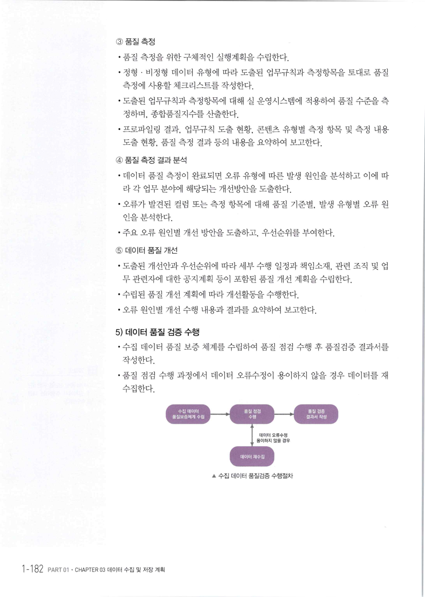
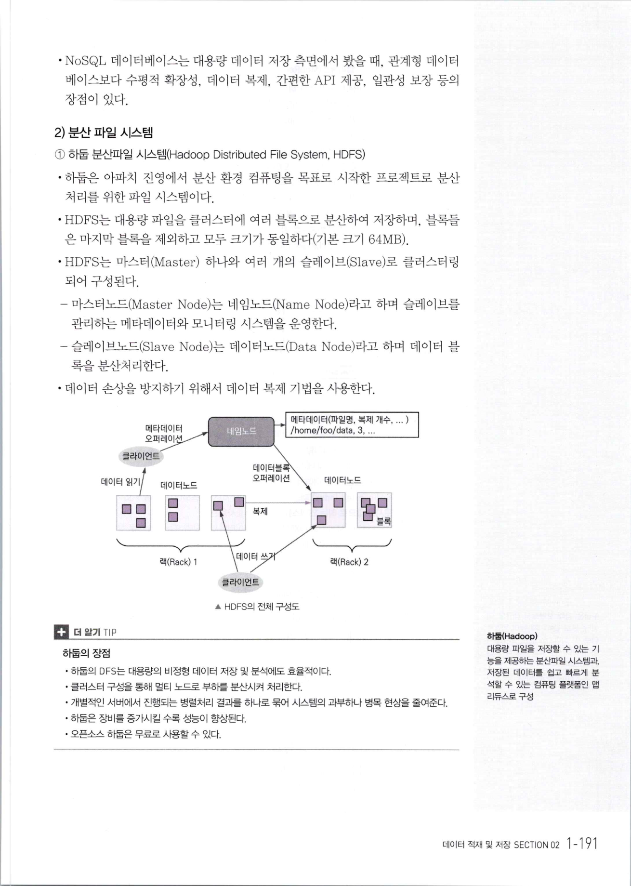
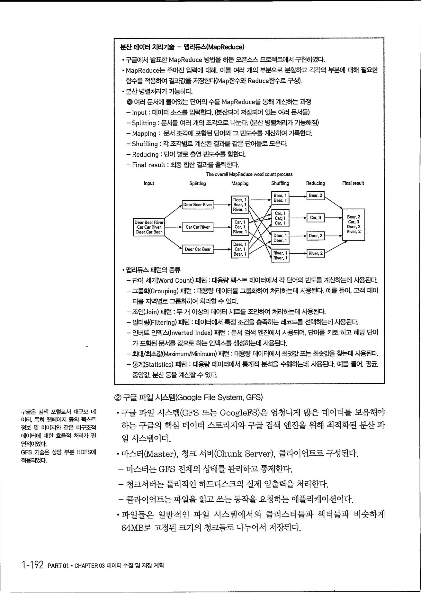
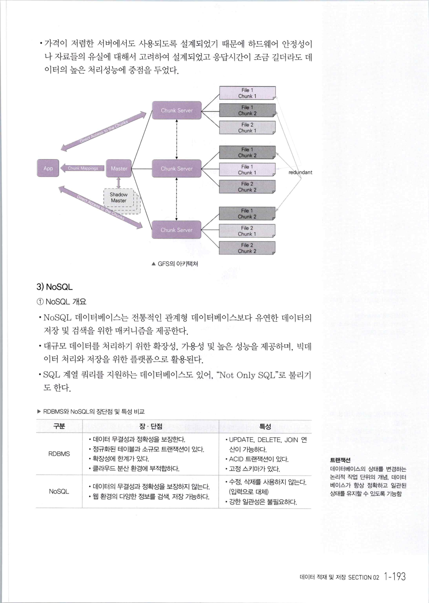

    - <표 D>에서 전체적인 급여 값의 분포는 30~110이나 레코드 1, 2, 3이 속한 동질 집합에 서는 30~50으로 이는 전체 급여 값의 분포(30~110)와 비교할 때 상대적으로 유사한 수준이라 볼 수 없다.
    - 공격자는 근사적인 급여 값을 추론할 수 있다.
* *t*-근접성은 정보의 분포를 조정하여 정보가 특정 값으로 쏠리거나 유사한 값들이 뭉치는 경우를 방지하는 방법이다.
* *t* 수치가 0에 가까울수록 전체 데이터의 분포와 특정 데이터 구간의 분포 유사성이 강해지기 때문에 그 익명성의 방어가 더 강해지는 경향이 있다.
* 익명성 강화를 위해 특정 데이터들을 재배치해도 전체 속성자들의 값 자체에는, 변화가 없기 때문에 일반적인 경우에 정보 손실의 문제는 크지 않다.

---

## 개념 체크

**1. k-익명성 기법에서 동일 그룹 데이터의 집합이 같은 값으로만 구성될 경우 문제가 발생할 수 있다. 이를 해결하기 위한 방법으로 옳은 것은?**
① *l*-다양성
② *t*-근접성
③ 암호화
④ 랜덤라운딩

> **정답** ①
>
> *l*-다양성은 *k*-익명성에 대한 두 가지 공격, 즉 동질성 공격 및 배경지식에 의한 공격을 방어하기 위한 모델로, 주어진 데이터 집합에서 함께 비식별되는 레코드들은 (동질 집합에서) 적어도 *l*개의 서로 다른 정보를 가지도록 한다.

**2. 표 D의 구분 1, 2, 3에 대한 [상태]는 비식별화 결과에 대한 취약점을 보여준다. 이를 해결하기 위한 방법으로 옳은 것은?**
① 민감한 정보 영역에서 각 그룹별로 3개 이상의 서로 다른 값을 갖도록 한다.
② 전체 데이터의 분포를 조정하여 특정 그룹에 유사한 질병이 나오지 않도록 한다.
③ 질병값을 다른 질병이름으로 대체한다.
④ 하나의 그룹에 속하는 레코드의 수를 줄인다.

> **정답** ②
>
> *t*-근접성은 *l*-다양성의 취약점(쏠림 공격, 유사성 공격)을 보완하기 위한 모델로 값의 의미를 고려하는 모델이다. 동질 집합에서 특정 정보의 분포와 전체 데이터 집합에서 정보의 분포가 *t* 이하의 차이를 보이도록 조정한다.

**3. 개인정보 비식별 방법 중 데이터 범주화에 대한 것으로 옳은 것은?**
① 김만수 35세, 서울 거주 → 홍길동 35세, 부산 거주
② 김만수 35세, 서울 거주, OO대학 재학 → 김OO 35세, 서울 거주, OO 대학 재학
③ 장민경, 35세 → 장씨, 30~40세
④ 주민등록번호 653889-2001232 → 65년생 여자

> **정답** ③
>
> ① 가명 처리, ② 데이터 마스킹, ③ 데이터 범주화, ④ 데이터 삭제의 예이다.

---

## 05 데이터 품질 검증

**1) 데이터 품질 관리**

**① 데이터 품질 관리의 정의**
비즈니스 목표에 부합한 데이터 분석을 위해 가치성, 정확성, 유용성 있는 데이터를 확보하고, 신뢰성 있는 데이터를 유지하는 데 필요한 관리 활동이다.

**② 데이터 품질 관리의 중요성**
* 분석 결과의 신뢰성은 분석 데이터의 신뢰성과 직접 연계된다.
* 빅데이터의 특성을 반영한 데이터 품질 관리 체계를 구축하여 효과적인 분석결과를 도출하여야 한다.

|            구분             | 내용                                                             |
| :-------------------------: | :--------------------------------------------------------------- |
| **분석 결과의 신뢰성 확보** | 분석 품질을 좌우하는 것은 데이터 품질이다.                       |
|    **일원화된 프로세스**    | 업무 처리, 데이터 관리의 효율화를 도모한다.                      |
|   **데이터 활용도 향상**    | 고품질 데이터 확보로 데이터 이용률을 향상시킨다.                 |
|   **양질의 데이터 확보**    | 불필요한 데이터 제거를 통한 고품질 데이터의 준비도를 향상시킨다. |

**2) 데이터 품질**

**① 정형 데이터 품질 기준**
정형 데이터에 대한 품질 기준은 일반적으로 완전성, 유일성, 일관성, 유효성, 정확성 5개의 품질 기준으로 나눌 수 있다.
* **완전성** : 필수항목에 누락이 없어야 한다.
* **유일성** : 데이터 항목은 유일해야 하며 중복되어서는 안된다.
* **일관성** : 데이터가 지켜야할 구조, 값, 표현되는 형태가 일관되게 정의되고, 서로 일치해야 한다.
* **유효성** : 데이터 항목은 정해진 데이터 유효범위 및 도메인을 충족해야 한다.
* **정확성** : 실세계에 존재하는 객체의 표현 값이 정확히 반영되어야 한다.

|          품질 기준           |   품질 세부 기준   | 품질 기준 설명                                                                               | 활용 예시                                                                                                 |
| :--------------------------: | :----------------: | :------------------------------------------------------------------------------------------- | :-------------------------------------------------------------------------------------------------------- |
| **완전성** (Completeness) |    개별 완전성     | 필수항목에 누락이 없어야 한다.                                                               | 고객의 아이디는 NULL일 수 없다.                                                                           |
|              ^               |    조건 완전성     | 조건에 따라 칼럼 값이 항상 존재해야 한다.                                                    | 기업 고객의 사업자 등록번호가 NULL일 수 없다.                                                             |
|  **유일성** (Uniqueness)  |    단독 유일성     | 칼럼은 유일한 값을 가져야 한다.                                                              | 고객의 이메일 주소는 유일해야 한다.                                                                       |
|              ^               |    조건 유일성     | 업무 조건에 따라 칼럼 값은 유일해야 한다.                                                    | 교육과정의 강의시작일이 있으면, 강의실 코드, 임대일, 강사코드가 모두 동일한 레코드는 존재하지 않는다.     |
| **일관성** (Consistency)  |  기준코드 일관성   | 데이터가 지켜야 할 구조, 값, 표현되는 형태가 일관되게 정의되고, 서로 일치해야 한다.          | 고객의 직업코드는 통합코드테이블의 직업코드에 등록된 값이어야 한다.                                       |
|              ^               |    참조 무결성     | 테이블 간의 칼럼값이 참조 관계에 있는 경우 그 무결성을 유지해야 한다.                        | 대출원장의 대출원장번호는 대출 상세내역에 존재해야 한다.                                                  |
|              ^               | 데이터 흐름 일관성 | 데이터를 생성하거나 가공하여 데이터가 이동되는 경우, 연관된 데이터는 모두 일치해야 한다.     | 운영계의 현재 가입 고객 수와 DW의 고객 수는 일치해야 한다.                                                |
|              ^               |    칼럼 일관성     | 관리 목적으로 중복 칼럼을 임의 생성하여 활용하는 경우 각각의 동의어 칼럼 값은 일치해야 한다. | 주문의 주문번호와 고객번호는 배송의 주문번호와 고객번호와 서로 일치해야 한다.                             |
|   **유효성** (Validity)   |    범위 유효성     | 데이터 항목은 정해진 데이터 유효범위 및 도메인을 충족해야 한다.                              | 기준점 좌표각은 -360초과, 360미만까지의 값을 가진다.                                                      |
|              ^               |    날짜 유효성     | 칼럼 값이 날짜유형일 경우에는 유효날짜 값을 가져야 한다.                                     | 99991231, 20080231은 유효하지 않은 값이다.                                                                |
|              ^               |    형식 유효성     | 칼럼은 정해진 형식과 일치하는 값을 가져야 한다.                                              | 주민번호는 '000000-0000000'의 형식이어야 한다.                                                            |
|   **정확성** (Accuracy)   |  선후 관계 정확성  | 복수의 칼럼값이 선후 관계에 있을 경우 그 순서를 지켜야 한다.                                 | 시작일은 종료일 이전 시점이어야 한다.                                                                     |
|              ^               |  계산/집계 정확성  | 한 칼럼의 값은 다수 칼럼의 계산된 값일 경우 계산값이 정확해야 한다.                          | 월 통계 테이블의 매출액은 현재 월 매출액의 총합과 일치해야 한다.                                          |
|              ^               |       최신성       | 정보의 발생, 수집, 그리고 갱신 주기를 유지해야 한다.                                         | 고객의 현재 값은 고객변경 이력의 마지막 ROW와 일치해야 한다.                                              |
|              ^               |  업무규칙 정확성   | 칼럼이 업무적으로 복잡하게 연관된 경우 관련 업무 규칙에 일치해야 한다.                       | 지급원장의 지급여부가 'Y'이면 지급원장의 지급일자는 신청일보다 이전 시점이어야 하고 NULL이 아니어야 한다. |

> **기적의 TIP**
> 품질 세부 기준과 예시를 연결하면서 이해하면 품질기준에 대한 비교가 수월하다.

**② 비정형 데이터 품질 기준**
비정형 컨텐츠 자체에 대한 품질 기준은 컨텐츠 유형에 따라 다소 다를 수 있다.

|           품질 기준           |                     품질 세부 기준                     | 정의                                                                                                                         |
| :---------------------------: | :----------------------------------------------------: | :--------------------------------------------------------------------------------------------------------------------------- |
| **기능성** (Functionality) | • 적절성 • 정확성 • 상호 운용성 • 기능 순응성 | 해당 컨텐츠가 특정 조건에서 사용될 때, 명시된 요구와 내재된 요구를 만족하는 기능을 제공하는 정도이다.                        |
|  **신뢰성** (Reliability)  |               • 성숙성 • 신뢰 순응성                | 해당 컨텐츠가 규정된 조건에서 사용될 때 규정된 신뢰 수준을 유지하거나 사용자로 하여금 오류를 방지할 수 있도록 하는 정도이다. |
|   **사용성** (Usability)   |         • 이해성 • 친밀성 • 사용 순응성          | 해당 컨텐츠가 규정된 조건에서 사용될 때, 사용자에 의해 이해되고, 선호될 수 있게 하는 정도이다.                               |
|  **효율성** (Efficiency)   |    • 시간 효율성 • 자원 효율성 • 효율 순응성     | 해당 컨텐츠가 규정된 조건에서 사용되는 자원의 양에 따라 요구된 성능을 제공하는 정도이다.                                     |
|  **이식성** (Portability)  |         • 적응성 • 공존성 • 이식 순응성          | 해당 컨텐츠가 다양한 환경과 상황에서 실행될 가능성이다.                                                                      |

**3) 데이터 품질 진단 기법**

**① 정형 데이터 품질 진단**
* 정형 데이터의 품질은 데이터 프로파일링 기법을 통해 진단할 수 있다.

|                     기법                      | 설명                                                                                                                                                                |
| :-------------------------------------------: | :------------------------------------------------------------------------------------------------------------------------------------------------------------------ |
|          **메타데이터 수집 및 분석**          | 테이블 정의서, 칼럼 정의서, 도메인 정의서, 데이터 사전, ERD, 관계 정의서를 수집하여 테이블명 누락, 불일치, 칼럼 누락, 칼럼명 불일치, 자료형 불일치 내역을 추출한다. |
|              **칼럼 속성 분석**               | 대상 칼럼의 총 건수, 유일값 수, NULL값 수, 공백값 수, 최대값, 최소값, 최대 빈도, 최소 빈도 등을 추출하여 유효범위 내의 존재여부를 판단한다.                         |
|               **누락 값 분석**                | 반드시 입력되어야 하는 값의 누락이 발생한 칼럼을 발견하는 절차이다.                                                                                                 |
|            **값의 허용 범위분석**             | 속성값이 가져야 할 범위 내에 속성값이 있는지 파악한다.                                                                                                              |
|             **허용 값 목록 분석**             | 해당 칼럼의 허용 값 목록이나 집합에 포함되지 않는 값을 발견한다.                                                                                                    |
|             **문자열 패턴 분석**              | 칼럼 속성값의 특성을 문자열로 도식화하여 패턴 오류를 검출한다.                                                                                                      |
|              **날짜 유형 분석**               | 날짜 유형 적용의 일관성 여부를 분석한다.                                                                                                                            |
| **기타 특수 도메인** (특정 번호 유형) 분석 | 사업자등록번호, 주민등록번호의 유효성 분석이 있다.                                                                                                                  |
|               **유일 값 분석**                | 유일해야 하는 칼럼의 중복 발생 여부를 분석한다.                                                                                                                     |
|                 **구조 분석**                 | 관계분석, 참조 무결성 분석, 구조 무결성 분석이 있다.                                                                                                                |

> **기적의 TIP**
> 데이터 품질을 검사하는 다양한 방법에 대해서 알아둔다.

**② 비정형 데이터 품질 진단**
* 비정형 데이터의 품질 진단은 품질 세부 기준을 정하여 항목별 체크리스트를 작성하여 진단한다.

**▶ 동영상 유형 비정형 데이터의 체크리스트 사례**

| 품질 기준  | 품질 세부 기준  |         측정항목         | 체크리스트                                                                                     |
| :--------: | :-------------: | :----------------------: | :--------------------------------------------------------------------------------------------- |
| **기능성** |   **정확성**    |    부가요소 정확성 등    | 1. 자막은 맞춤법 표기에 따라 작성되었는가? 2. 내레이션 시나리오와 사운드 내용은 일치하는가? |
|     ^      |   **적절성**    |      운용 적절성 등      | 3. 비디오 압축 코덱은 표준을 준수하는가?                                                       |
|     ^      | **상호 운용성** | 사운드/ 자막동기화 등 | 4. 사운드와 자막은 일치하는가?                                                                 |
|     ^      | **기능 순응성** |      규격화 여부 등      | 5. 기능성 관련 항목에 대한 표준 지침이 있는가?                                                 |
| **신뢰성** |   **성숙성**    |    결함 발생 정도 등     | 6. 결함 발생 횟수는 얼마인가?                                                                  |
|     ^      | **신뢰 순응성** |    규격 준수 정도 등     | 7. 신뢰성 관련 항목에 대한 표준 지침이 있는가?                                                 |

> **기적의 TIP**
> 비정형 데이터의 품질 기준은 상황에 따라 매우 다르게 적용될 수 있다. 어떤 기준을 적용할 수 있는지 정도만 이해한다.

**4) 데이터 품질 진단 절차**
데이터 품질 진단은 일반적으로 품질 진단 계획 수립, 품질기준 및 진단 대상 정의, 품질 측정, 품질 측정 결과 분석, 데이터 품질 개선의 5단계로 진행한다.

**① 품질 진단 계획 수립**
* 데이터 품질 진단의 목적과 배경, 목표, 추진 방향, 업무 범위 등을 정의한다.
* 데이터 품질 진단을 수행할 전담 조직을 구성한다.
* 데이터 품질 진단 수행 방법론, 절차, 기법, 도구 등을 정의한다.
* 수립된 방법론, 절차에 따라 인력, 기간, 자원, 산출물 등을 정의하여 상세 계획을 확정한다.

**② 품질 기준 및 진단 대상 정의**
* 품질 측정을 수행하기 위한 품질기준 및 대상 선정, 데이터 프로파일링, 업무규칙 정의 및 체크리스트 준비 등이 이루어진다.
* 데이터 품질 진단 수행 시 적용할 품질 측정의 기준을 사전에 정의하고, 데이터의 형태(정형 · 비정형)에 따라 데이터 품질 진단을 수행할 대상 정보 시스템의 테이블 및 컬럼 등을 정의한다.
* 진단 대상이 되는 멀티미디어 콘텐츠 및 해당 메타데이터를 선정하여, 데이터 유형별 특성에 따른 데이터 프로파일링 및 업무규칙 정의, 체크리스트 준비 등을 수행한다.

> **기적의 TIP**
> 데이터 품질 진단을 위한 5단계 절차에서 수행되는 내용을 확인한다.

**③ 품질 측정**
* 품질 측정을 위한 구체적인 실행계획을 수립한다.
* 정형 · 비정형 데이터 유형에 따라 도출된 업무규칙과 측정항목을 토대로 품질 측정에 사용할 체크리스트를 작성한다.
* 도출된 업무규칙과 측정항목에 대해 실 운영시스템에 적용하여 품질 수준을 측정하며, 종합품질지수를 산출한다.
* 프로파일링 결과, 업무규칙 도출 현황, 콘텐츠 유형별 측정 항목 및 측정 내용 도출 현황, 품질 측정 결과 등의 내용을 요약하여 보고한다.

**④ 품질 측정 결과 분석**
* 데이터 품질 측정이 완료되면 오류 유형에 따른 발생 원인을 분석하고 이에 따라 각 업무 분야에 해당되는 개선방안을 도출한다.
* 오류가 발견된 컬럼 또는 측정 항목에 대해 품질 기준별, 발생 유형별 오류 원인을 분석한다.
* 주요 오류 원인별 개선 방안을 도출하고, 우선순위를 부여한다.

**⑤ 데이터 품질 개선**
* 도출된 개선안과 우선순위에 따라 세부 수행 일정과 책임소재, 관련 조직 및 업무 관련자에 대한 공지계획 등이 포함된 품질 개선 계획을 수립한다.
* 수립된 품질 개선 계획에 따라 개선활동을 수행한다.
* 오류 원인별 개선 수행 내용과 결과를 요약하여 보고한다.

**5) 데이터 품질 검증 수행**
* 수집 데이터 품질 보증 체계를 수립하여 품질 점검 수행 후 품질검증 결과서를 작성한다.
* 품질 점검 수행 과정에서 데이터 오류수정이 용이하지 않을 경우 데이터를 재수집한다.

▲ 수집 데이터 품질검증 수행절차

---

## 개념 체크

**1. 정형 데이터 품질 기준 중에서 아래의 규칙을 만족하는 것으로 옳은 것은?**
(가) 학기 시작일은 학기 종료일보다 이전 시점이어야 한다.
(나) 1분기 매출액은 1월, 2월, 3월 매출액의 합계와 같아야 한다.
① 정확성
② 완전성
③ 적시성
④ 일관성

> **정답** ①
>
> 데이터 품질 관리 요소 중 정확성은 데이터 값이 실제 값과 일치해야 하는 것으로 날짜의 선후 관계 정확성, 계산/집계 정확성, 최신성, 업무규칙 정확성 등을 만족해야 한다. 보기의 (가)는 선후관계 정확성, (나)는 계산집계 정확성에 대한 조건이다.

**2. 정형 데이터 품질 기준 중에서 아래의 규칙을 만족하는 것으로 옳은 것은?**
(가) 학생의 입학년도는 2001보다 크거나 같고 2022보다 작아야 한다.
(나) 학생의 휴대전화 번호는 010으로 시작하는 11자리 번호이다.
① 정확성
② 완전성
③ 적시성
④ 유효성

> **정답** ④
>
> 데이터 품질 관리 요소 중 유효성은 데이터 항목은 정해진 데이터 유효범위 및 도메인을 충족해야 한다는 것으로 보기의 (가)는 범위 유효성, (나)는 형식 유효성에 해당한다.

**3. 다음 중 데이터 프로파일링 기법을 통해 검증할 수 있는 것으로 틀린 것은?**
① 누락된 값을 찾아낸다.
② 유일해야 하는 칼럼의 중복값 존재 여부를 파악한다.
③ 연락처가 최신의 것으로 업데이트 되었는지를 파악한다.
④ 메타데이터를 이용해 데이터 형식의 불일치를 찾아낸다.

> **정답** ③
>
> 데이터 프로파일링은 데이터 품질 진단을 위한 다양한 기법을 적용하며, 데이터 누락 값, 허용범위를 벗어나는 값, 형식 위반 등의 검사를 수행한다. 다만, 현실의 데이터가 반영된 것인지에 대한 확인은 별도의 검증 방법(휴대폰 인증, 이메일 인증 등)을 제공하지 않는 이상 프로파일링 만으로 진단하기 어렵다.

---

## 합격을 다지는 예상문제

**01. 데이터 수집을 위한 시스템 구축 절차로 적절한 것은?**
① 수집데이터 유형파악 → 수집기술 결정 → 아키텍처 수립 → 하드웨어 구축 → 실행환경 구축
② 수집기술 결정 → 수집데이터 유형파악 → 아키텍처 수립 → 하드웨어 구축 → 실행환경 구축
③ 수집데이터 유형파악 → 아키텍처 수립 → 수집기술 결정 → 하드웨어 구축 → 실행환경 구축
④ 아키텍처 수립 → 수집기술 결정 → 수집데이터 유형파악 → 하드웨어 구축 → 실행환경 구축

**02. 비즈니스 도메인 정보를 습득하기 위해 필요한 것으로 적절하지 않은 것은?**
① 비즈니스 모델
② 비즈니스 파트너
③ 비즈니스 용어집
④ 비즈니스 프로세스

**03. 원천 데이터에 대한 정보를 습득하고자 할 때 필요한 정보에 해당하지 않는 것은?**
① 데이터의 보안
② 데이터의 신속성
③ 데이터의 정확성
④ 데이터의 수집 가능성

**04. 다음 중 내부 데이터가 아닌 것은?**
① 서비스 시스템 데이터
② 네트워크 및 서버 장비 데이터
③ 마케팅 데이터
④ 소셜 데이터

**05. 데이터 유형에 대한 설명으로 적절하지 않은 것은?**
① 비정형 데이터로는 웹로그, 센서 데이터, JSON 파일 등이 있다.
② 정형 데이터는 정형화된 스키마를 가진 데이터이다.
③ 반정형 데이터는 메타 구조를 가지는 데이터이다.
④ 데이터의 유형은 크게 정형 데이터, 반정형 데이터, 비정형 데이터로 나뉜다.

**06. 외부 데이터의 특징으로 적절하지 않은 것은?**
① 대부분 반정형, 비정형 데이터로 존재한다.
② 서비스의 수명 주기 관리가 용이하다.
③ 대부분 추가적인 데이터 가공 작업이 필요하다.
④ 비용 및 데이터 수집 난이도가 높다.

**07. 데이터 확보 비용 산정을 위한 비용 요소로 적절하지 않은 것은?**
① 데이터의 크기 및 보관주기
② 데이터의 수집 방식
③ 데이터의 역사적 가치
④ 데이터의 종류

**08. 다음 중 대표적인 데이터 저장 방식과 거리가 먼 것은?**
① 파일 시스템
② 분산처리 데이터베이스
③ 관계형 데이터베이스
④ 객체지향 데이터베이스

**09. 데이터 적절성 검증을 위한 방법으로 적절하지 않은 것은?**
① 데이터의 신속성
② 소스 데이터와 비교
③ 보안 사항 점검
④ 저작권 점검

**10. 데이터 변환 방식의 종류로 적절하지 않은 것은?**
① 비정형 데이터를 정형 데이터 형태로 저장하는 방식
② TCP 방식에서 Open API로 수집하여 저장하는 방식
③ 수집 데이터를 분산파일시스템으로 저장하는 방식
④ 주제별, 시계열적으로 저장하는 방식

**11. 개인정보 비식별화 방법 중 가명처리 기법의 세부기술이 아닌 것은?**
① 휴리스틱 가명화
② 암호화
③ 교환 방법
④ 제어 라운딩

**12. 개인정보 비식별화 방법에 대한 설명으로 적절하지 않은 것은?**
① 가명처리는 개인정보 중 주요 식별요소를 다른 값으로 대체하는 방법이다.
② 총계처리는 데이터의 총합 값을 보여 주고 개별 값을 보여주지 않는 방법이다.
③ 데이터 마스킹은 개인을 식별하는 데 기여할 확률이 낮은 요소들을 보이지 않게 하는 방법이다.
④ 데이터 범주화는 데이터의 값을 범주의 값으로 변환하여 값을 숨기는 방법이다.

**13. 비식별화된 개인정보의 재식별 가능성 검토 기법으로 적절하지 않은 것은?**
① *s*-보안성
② *k*-익명성
③ *l*-다양성
④ *t*-근접성

**14. 비정형 데이터의 품질기준으로 적절하지 않은 것은?**
① 기능성
② 정확성
③ 사용성
④ 효율성

**15. 정형 데이터의 품질 진단 기법으로 적절하지 않은 것은?**
① 메타데이터 수집 및 분석
② 값의 허용 범위 분석
③ 운영환경 호환성 분석
④ 문자열 패턴 분석

**16. 정형 데이터 수집 기술로 적절하지 않은 것은?**
① DBToDB
② ETL(Extract Transform Load)
③ Crawling
④ FTP(File Transfer Protocol)

**17. 정형 데이터 수집을 위한 아파치 스쿱에 대한 설명으로 적절하지 않은 것은?**
① 관계형 데이터 스토어 간에 대량 데이터를 효과적으로 전송하기 위해 구현된 도구이다.
② 커넥터를 사용하여 MySQL, Oracle, MS SQL 등 관계형 데이터베이스의 데이터를 HDFS로 수집한다.
③ 관계형 데이터베이스에서 가져온 데이터들을 하둡 맵리듀스로 변환하고 변환된 데이터들을 다시 관계형 데이터베이스로 내보낼 수 있다.
④ 데이터 가져오기/내보내기 과정을 맵리듀스를 통해 처리하기 때문에 병렬처리가 가능하고 장애에도 강한 특징을 갖는다.

**18. 휴리스틱 가명화에 대한 설명으로 적절하지 않은 것은?**
① 정보 가공 시 일정한 규칙의 알고리즘을 적용하여 암호화함으로써 개인정보를 대체하는 방법이다.
② 식별자에 해당하는 값들을 몇 가지 정해진 규칙으로 대체하거나 사람의 판단에 따라 가공하여 개인정보를 숨긴다.
③ 식별자의 분포를 고려하거나 수집된 자료의 사전 분석을 하지 않고 모든 데이터를 동일한 방법으로 가공한다.
④ 활용할 수 있는 대체 변수에 한계가 있으며, 다른 값으로 대체하는 일정한 규칙이 노출되는 취약점이 있다.

**19. 비식별화 방법 중 데이터 삭제 기법의 단점을 설명하는 보기는?**
① 대체값 부여 시에도 식별 가능한 고유 속성이 계속 유지된다.
② 분석의 다양성과 분석 결과의 유효성과 신뢰성이 저하된다.
③ 정밀 분석의 어려움 및 수량이 적을 경우 추론에 의한 식별 가능성이 있다.
④ 정확한 분석결과 도출의 어려움 및 데이터 범위 구간이 좁혀질 경우 추론 가능성이 있다.

**20. 정형 데이터 품질 기준 중 정확성의 세부 품질 기준 항목으로 적절하지 않은 것은?**
① 선후 관계 정확성
② 최신성
③ 참조 무결성
④ 업무 규칙 정확성

## 예상문제 정답 & 해설

**SECTION 01**

|   01 ①   |   02 ②   |   03 ②   |   04 ④   |   05 ①   |
| :------: | :------: | :------: | :------: | :------: |
| **06 ②** | **07 ③** | **08 ④** | **09 ①** | **10 ②** |
| **11 ④** | **12 ③** | **13 ①** | **14 ②** | **15 ③** |
| **16 ③** | **17 ④** | **18 ①** | **19 ②** | **20 ③** |

**01. ①**
데이터 수집을 위한 시스템 구축 절차는 수집데이터 유형파악, 수집기술 결정, 아키텍처 수립, 하드웨어 구축, 실행환경 구축 순으로 수행된다.

**02. ②**
비즈니스 도메인 정보를 습득하기 위해서는 비즈니스 모델, 비즈니스 용어집, 비즈니스 프로세스로부터 정보를 습득하고, 도메인 전문가 인터뷰를 통해 데이터 정보를 습득한다.

**03. ②**
원천 데이터에 대한 정보는 데이터의 수집 가능성, 데이터의 보안, 데이터 정확성, 수집 난이도, 수집 비용 항목이 필요하다.

**04. ④**
내부 데이터에는 서비스 시스템 데이터, 네트워크 및 서버 장비 데이터, 마케팅 데이터가 있으며, 외부 데이터로는 소셜 데이터, 특정 기관 데이터, M2M 데이터, Linked Open Data가 있다.

**05. ①**
비정형 데이터는 이미지나 동영상으로 존재하는 데이터이며, 웹로그나 센서 데이터 또는 JSON 파일의 경우 반정형 데이터에 해당한다.

**06. ②**
외부 데이터의 경우 외부 환경에 대한 통제가 어려움에 따른 서비스 관리정책 수립이 필요하다.

**07. ③**
데이터 확보 비용 산정을 위해서는 데이터의 종류, 데이터의 크기 및 보관주기, 데이터의 수집 주기, 데이터의 수집 방식, 데이터의 수집 기술, 데이터의 가치성을 고려하여야 한다.

**08. ④**
대표적인 데이터 저장 방식으로는 파일 시스템, 관계형 데이터베이스, 분산처리 데이터베이스가 있다.

**09. ①**
데이터 적절성 검증을 위해 데이터 누락, 소스 데이터와 비교, 데이터의 정확성, 보안 사항 점검, 저작권 점검, 대량 트래픽 발생 여부를 점검해 보아야 한다.

**10. ②**
TCP 방식에서 Open API로 수집하여 저장하는 방식은 데이터 변환 방식의 종류가 아니라 데이터를 수집하는 방식을 변경하는 것이다.

**11. ④**
가명처리 기법의 세부기술로는 휴리스틱 가명화, 암호화, 교환 방법이 있으며, 제어 라운딩은 데이터 범주화 기법의 세부기술이다.

**12. ③**
데이터 마스킹은 개인을 식별하는 데 기여할 확률이 높은 주요 식별자를 보이지 않도록 처리하는 방법이다.

**13. ①**
비식별화된 개인정보의 재식별 가능성 검토 기법으로는 *k*-익명성, *l*-다양성, *t*-근접성이 있다.

**14. ②**
비정형 데이터의 품질기준으로는 기능성, 신뢰성, 사용성, 효율성, 이식성이 있으며, 정형 데이터의 품질기준으로는 완전성, 유일성, 유효성, 일관성, 정확성이 있다.

**15. ③**
정형 데이터의 품질 진단 기법으로는 메타데이터 수집 및 분석, 칼럼 속성 분석, 누락 값 분석, 값의 허용 범위 분석, 허용 값 목록 분석, 문자열 패턴 분석, 날짜 유형 분석, 기타 특수 도메인 분석, 유일 값 분석, 구조 분석 등이 있다.

**16. ③**
크롤링(Crawling)은 인터넷상에서 제공되는 다양한 웹 사이트의 소셜 네트워크 정보, 뉴스, 게시판 등으로부터 웹 문서 및 정보를 수집하는 기술로 비정형 데이터를 수집하는 방법이다.

**17. ④**
데이터 가져오기 내보내기 과정을 맵리듀스를 통해 처리하기 때문에 병렬처리가 가능하고 장애에도 강한 특징을 갖는다.

**18. ①**
정보 가공 시 일정한 규칙의 알고리즘을 적용하여 암호화함으로써 개인정보를 대체하는 방법은 암호화이다.

**19. ②**
* ① 가명처리의 단점
* ③ 총계처리의 단점
* ④ 데이터 범주화의 단점

**20. ③**
정확성의 세부 품질 기준으로는 선후 관계 정확성, 계산/집계 정확성, 최신성, 업무 규칙 정확성이 있으며, 참조 무결성은 일관성의 세부 품질 기준이다.

---

**SECTION 02 데이터 적재 및 저장**

**01 데이터 적재**

**1) 데이터 적재 도구**
* 수집한 데이터는 빅데이터 분석을 위한 저장 시스템에 적재해야 한다.
* 적재할 데이터의 유형과 실시간 처리 여부에 따라 관계형 데이터베이스, HDFS를 비롯한 분산파일시스템, NoSQL 저장 시스템에 데이터를 적재할 수 있다.
* 수집된 데이터를 저장시스템에 적재 시 Fluentd, Flume, Scribe, Logstash 와 같은 데이터 수집 도구들을 이용하여 적재하는 방법들도 있다.

**① 데이터 수집 도구를 이용한 데이터 적재**
* 로그 수집을 해야 하는 각 서버에 Fluentd를 설치하면, 서버에서 로그를 수집해서 중앙 로그 저장소로 전송한다.
* Fluentd의 로그 수집 구조는 가장 간단한 구조로 Fluentd가 로그 수집 에이전트 역할만 수행하지만, 이에 더해 각 서버에서 Fluentd에서 수집한 로그를 다른 Fluentd로 보내서 이 Fluentd가 최적으로 로그 저장소에 저장하도록 설정할 수 있다.
* 중간에 Fluentd를 두는 이유는, 이 Fluentd가 먼저 들어오는 로그들을 수집해서 로그 저장소에 넣기 전에 로그 트래픽을 속도 조절하고 로그저장소의 용량에 맞게 트래픽을 조정할 수 있기 때문이다.
    - 또한 로그를 여러 저장소에 복제해서 저장하거나 로그의 종류에 따라서 다른 로그 저장소로 라우팅할 수 있다.
* Fluentd 로그 수집기는 로그화 시킬 소스 데이터에 대한 환경 설정, 추출한 데이터를 어디로 전달할 것인지에 대한 설정, 실행 주기 설정 등을 통하여 다양한 데이터 수집이 가능하다.

| 데이터 수집 도구    | 설명                                                                                                                                                                                      |
| :------------------ | :---------------------------------------------------------------------------------------------------------------------------------------------------------------------------------------- |
| 플루언티드(Fluentd) | • 트레저 데이터(Treasure Data)에서 개발된 크로스 플랫폼 오픈 소스 데이터 수집 소프트웨어이다. • 사용자의 로그를 다양한 형태로 입력받아 JSON 포맷으로 변환한 뒤 다양한 형태로 출력한다. |

> **JSON (JavaScript Object Notation)**
> 속성-값 쌍 또는 키-값 쌍으로 이루어진 데이터 오브젝트를 전달하기 위해 인간이 읽을 수 있는 텍스트를 사용하는 개방형 표준 포맷

**② NoSQL DBMS가 제공하는 도구를 이용한 데이터 적재**
* 로그 수집기를 이용한 방법처럼 많은 기능을 사용할 수는 없지만, 수집한 데이터가 CSV 등의 텍스트 데이터라면 mongoimport와 같은 적재 도구를 사용하여 데이터 적재를 수행할 수 있다.
* 로그 수집 도구를 쓰는 방식처럼 데이터 수집 주기 등을 환경설정하여 사용할 수는 없다.

| 데이터 수집 도구     | 설명                                                                                                                                                                                                                         |
| :------------------- | :--------------------------------------------------------------------------------------------------------------------------------------------------------------------------------------------------------------------------- |
| 플럼(Flume)          | • 많은 양의 로그 데이터를 효율적으로 수집, 취합, 이동하기 위한 분산형 소프트웨어이다. • 로그 데이터 수집과 네트워크 트래픽 데이터, 소셜 미디어 데이터, 이메일 메시지 데이터 등 대량의 이벤트 데이터 전송을 위해 사용한다. |
| 스크라이브(Scribe)   | • 수많은 서버로부터 실시간으로 스트리밍되는 로그 데이터를 집약시키기 위한 서버이다. • 클라이언트 사이드의 수정 없이 스케일링 가능하고 확장이 가능하다.                                                                    |
| 로그스태시(Logstash) | • 다양한 소스에서 데이터를 수집하여 변환한 후 자주 사용하는 저장소로 전송하는 도구이다.                                                                                                                                      |

> **CSV (Comma Separated Value)**
> 쉼표를 기준으로 항목을 구분하여 저장한 데이터

**③ 관계형 DBMS의 데이터를 NoSQL DBMS에서 적재**
* 기존의 운영 중이던 관계형 데이터베이스로부터 데이터를 추출하여 NoSQL 데이터베이스로 적재할 수도 있다.
* 데이터 변형이 많이 필요하다면, 데이터 적재를 위한 프로그램을 작성하여 적재할 수 있고, 큰 변화 없이 적재한다면 SQLtoNoSQLImporter, Mongify 등의 도구를 사용하여 적재할 수도 있다.

**2) 데이터 적재 완료 테스트**
**① 데이터 적재 내용에 따라 체크리스트를 작성**
* 정형 데이터인 경우에는 테이블의 개수와 속성의 개수 및 데이터 타입의 일치 여부, 레코드 수 일치 여부가 체크리스트가 될 수 있다.
* 반정형이나 비정형인 경우에는 원천 데이터의 테이블이 목적지 저장시스템에 맞게 생성되었는지, 레코드 수가 일치하는지 등이 체크리스트에 포함될 수 있다.

> **적재하는 데이터(정형, 반정형, 비정형)의 유형과 특성에 따라 체크리스트를 작성한다.**

**② 데이터 테스트 케이스를 개발**
* 적재된 레코드 수를 확인하는 간단한 것 외에도 원천 데이터 중에 특정 데이터에 대해 샘플링을 해서 목적지 저장시스템에서 조회하는 테스트 케이스를 개발할 수 있다.
* 적재한 대량 데이터의 데이터 타입, 특별히 한글 문자 등의 ASCII 코드가 아닌 문자들이 정상적으로 적재되는지 확인이 꼭 필요하다.
* 문자열이 숫자로 이루어지면 문자열로 적재되었는지 또는 숫자인데 문자열로 적재되지는 않았는지 확인해야 한다.

> **데이터 테스트 케이스**
> 적재가 정상적으로 완료되었는지 확인하는 시험

**③ 체크리스트 검증 및 데이터 테스트 케이스 실행**
* 이전 단계에서 작성된 체크리스트와 테스트 케이스에 대해 검증을 실행한다.
* 검증 결과를 분석하여 데이터 적재 결과 보고서를 작성한다.

---

## 개념 체크

**1. 다음 소프트웨어 중에서 데이터 수집 목적으로 사용하기 어려운 것은?**
① 플럼(Flume)
② 스쿱(Sqoop)
③ 플루언티드(Fluentd)
④ HDFS

> **정답** ④
>
> HDFS는 분산 파일 시스템으로 데이터 저장 목적으로 사용된다.

**2. 다음 빅데이터 관련 소프트웨어 중에서 그 성격이 다른 하나는?**
① 플럼(Flume)
② 로그스태시(Logstash)
③ 플루언티드(Fluentd)
④ 하이브(Hive)

> **정답** ④
>
> ①, ②, ③은 데이터 수집을 위한 소프트웨어이고, Hive는 하둡기반 저장소에 대한 질의처리를 담당하는 시스템이다.

---

**02 데이터 저장**

**1) 빅데이터 저장시스템**
대용량 데이터 집합을 저장하고 관리하는 시스템으로 사용자에게 데이터 제공 신뢰성과 가용성을 보장하는 시스템이다.

**① 파일 시스템 저장방식**
* 빅데이터를 확장 가능한 분산 파일의 형태로 저장하는 방식의 대표적인 예는 Apache HDFS(Hadoop Distributed File System), 구글의 GFS(Google File System) 등을 들 수 있다.
* 파일 시스템 저장방식은 저사양 서버들을 활용하여 대용량, 분산, 데이터 집중형의 애플리케이션을 지원하며 사용자들에게 고성능 fault-tolerance 환경을 제공하도록 구현되어 있다.

**② 데이터베이스 저장방식**
* 빅데이터를 저장하는 방식에는 전통적인 관계형 데이터베이스 시스템을 이용하거나 NoSQL 데이터베이스 시스템을 이용하는 방식이 있다.

> 최근에는 전통적인 관계형 데이터베이스보다 NoSQL 데이터베이스를 활용하는 방식이 선호되고 있다.
* NoSQL 데이터베이스는 대용량 데이터 저장 측면에서 봤을 때, 관계형 데이터베이스보다 수평적 확장성, 데이터 복제, 간편한 API 제공, 일관성 보장 등의 장점이 있다.

**2) 분산 파일 시스템**
**① 하둡 분산파일 시스템(Hadoop Distributed File System, HDFS)**
* 하둡은 아파치 진영에서 분산 환경 컴퓨팅을 목표로 시작한 프로젝트로 분산 처리를 위한 파일 시스템이다.
* HDFS는 대용량 파일을 클러스터에 여러 블록으로 분산하여 저장하며, 블록들은 마지막 블록을 제외하고 모두 크기가 동일하다(기본 크기 64MB).
* HDFS는 마스터(Master) 하나와 여러 개의 슬레이브(Slave)로 클러스터링되어 구성된다.
   - 마스터노드(Master Node)는 네임노드(Name Node)라고 하며 슬레이브를 관리하는 메타데이터와 모니터링 시스템을 운영한다.
   - 슬레이브노드(Slave Node)는 데이터노드(Data Node)라고 하며 데이터 블록을 분산처리한다.
* 데이터 손상을 방지하기 위해서 데이터 복제 기법을 사용한다.

▲ HDFS의 전체 구성도

> **더 알기 TIP**
> **하둡(Hadoop)**
> 대용량 파일을 저장할 수 있는 기능을 제공하는 분산파일 시스템과, 저장된 데이터를 쉽고 빠르게 분석할 수 있는 컴퓨팅 플랫폼인 맵리듀스로 구성
> * 하둡의 DFS는 대용량의 비정형 데이터 저장 및 분석에도 효율적이다.
> * 클러스터 구성을 통해 멀티 노드로 부하를 분산시켜 처리한다.
> * 개별적인 서버에서 진행되는 병렬처리 결과를 하나로 묶어 시스템의 과부하나 병목 현상을 줄여준다.
> * 하둡은 장비를 증가시킬 수록 성능이 향상된다.
> * 오픈소스 하둡은 무료로 사용할 수 있다.

**분산 데이터 처리기술 - 맵리듀스(MapReduce)**
* 구글에서 발표한 MapReduce 방법을 하둡 오픈소스 프로젝트에서 구현하였다.
* MapReduce는 주어진 입력에 대해, 이를 여러 개의 부분으로 분할하고 각각의 부분에 대해 필요한 함수를 적용하여 결과값을 저장한다(Map함수와 Reduce함수로 구성).
* 분산 병렬처리가 가능하다.
   **예) 여러 문서에 들어있는 단어의 수를 MapReduce를 통해 계산하는 과정**
   - Input : 데이터 소스를 입력한다. (분산되어 저장되어 있는 여러 문서들)
   - Splitting : 문서를 여러 개의 조각으로 나눈다. (분산 병렬처리가 가능해짐)
   - Mapping : 문서 조각에 포함된 단어와 그 빈도수를 계산하여 기록한다.
   - Shuffling : 각 조각별로 계산된 결과를 같은 단어들로 모은다.
   - Reducing : 단어 별로 출연 빈도수를 합한다.
   - Final result : 최종 합산 결과를 출력한다.

▲ The overall MapReduce word count process

* **맵리듀스 패턴의 종류**
   - 단어 세기(Word Count) 패턴 : 대용량 텍스트 데이터에서 각 단어의 빈도를 계산하는데 사용된다.
   - 그룹화(Grouping) 패턴 : 대용량 데이터를 그룹화하여 처리하는데 사용된다. 예를 들어, 고객 데이터를 지역별로 그룹화하여 처리할 수 있다.
   - 조인(Join) 패턴 : 두 개 이상의 데이터 세트를 조인하여 처리하는데 사용된다.
   - 필터링(Filtering) 패턴 : 데이터에서 특정 조건을 충족하는 레코드를 선택하는데 사용된다.
   - 인버트 인덱스(Inverted Index) 패턴 : 문서 검색 엔진에서 사용되며, 단어를 키로 하고 해당 단어가 포함된 문서를 값으로 하는 인덱스를 생성하는데 사용된다.
   - 최대/최소값(Maximum/Minimum) 패턴 : 대용량 데이터에서 최댓값 또는 최솟값을 찾는데 사용된다.
   - 통계(Statistics) 패턴 : 대용량 데이터에서 통계적 분석을 수행하는데 사용된다. 예를 들어, 평균, 중앙값, 분산 등을 계산할 수 있다.

**② 구글 파일 시스템(Google File System, GFS)**
* 구글 파일 시스템(GFS 또는 GoogleFS)은 엄청나게 많은 데이터를 보유해야 하는 구글의 핵심 데이터 스토리지와 구글 검색 엔진을 위해 최적화된 분산 파일 시스템이다.
* 마스터(Master), 청크 서버(Chunk Server), 클라이언트로 구성된다.
   - 마스터는 GFS 전체의 상태를 관리하고 통제한다.
   - 청크서버는 물리적인 하드디스크의 실제 입출력을 처리한다.
   - 클라이언트는 파일을 읽고 쓰는 동작을 요청하는 애플리케이션이다.
* 파일들은 일반적인 파일 시스템에서의 클러스터들과 섹터들과 비슷하게 64MB로 고정된 크기의 청크들로 나누어서 저장된다.

> 구글은 검색 포털로서 대규모 데이터, 특히 웹페이지 등의 텍스트 정보 및 이미지와 같은 비구조적 데이터에 대한 효율적 처리가 필연적이었다.
> GFS 기술은 상당 부분 HDFS에 적용되었다.

* 가격이 저렴한 서버에서도 사용되도록 설계되었기 때문에 하드웨어 안정성이나 자료들의 유실에 대해서 고려하여 설계되었고 응답시간이 조금 길더라도 데이터의 높은 처리성능에 중점을 두었다.

▲ GFS의 아키텍처

**3) NoSQL**
**① NoSQL 개요**
* NoSQL 데이터베이스는 전통적인 관계형 데이터베이스보다 유연한 데이터의 저장 및 검색을 위한 매커니즘을 제공한다.
* 대규모 데이터를 처리하기 위한 확장성, 가용성 및 높은 성능을 제공하며, 빅데이터 처리와 저장을 위한 플랫폼으로 활용된다.
* SQL 계열 쿼리를 지원하는 데이터베이스도 있어, “Not Only SQL”로 불리기도 한다.

**▶ RDBMS와 NoSQL의 장단점 및 특성 비교**

| 구분  | 장 · 단점                                                                                                                                            | 특성                                                                                        |
| :---: | :--------------------------------------------------------------------------------------------------------------------------------------------------- | :------------------------------------------------------------------------------------------ |
| RDBMS | • 데이터 무결성과 정확성을 보장한다. • 정규화된 테이블과 소규모 트랜잭션이 있다. • 확장성에 한계가 있다. • 클라우드 분산 환경에 부적합하다. | • UPDATE, DELETE, JOIN 연산이 가능하다. • ACID 트랜잭션이 있다. • 고정 스키마가 있다. |
| NoSQL | • 데이터의 무결성과 정확성을 보장하지 않는다. • 웹 환경의 다양한 정보를 검색, 저장 가능하다.                                                      | • 수정, 삭제를 사용하지 않는다.(입력으로 대체) • 강한 일관성은 불필요하다.               |

> **트랜잭션**
> 데이터베이스의 상태를 변경하는 논리적 작업 단위의 개념, 데이터베이스가 항상 정확하고 일관된 상태를 유지할 수 있도록 기능함
