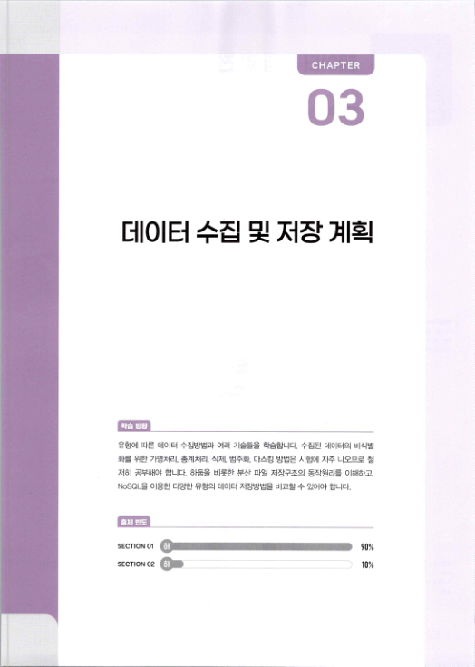
# CHAPTER 
03

# 데이터 수집 및 저장 계획
학습 밤향 유형에 따른 데이터 수집방법과 여러 기술들을 학습합니다 . 수집된 데이터의 비식별 화를 위한 가명처리 , 총계처리 , 삭제 , 범주화, 마스킹 방법은 시험에 자주 나도므로 철 저히 공부해야 합니다 . 하둡을 비릇한 분산 파일 저장구조의 동작원리를 이해하고 NoS(긔－을 이용한 다양한 유형의 데이터 저장방법을 비교할 수 있어야 합니다． 출제 빈도 SECTION 01 SECTION 02

> 90%
> 1미6
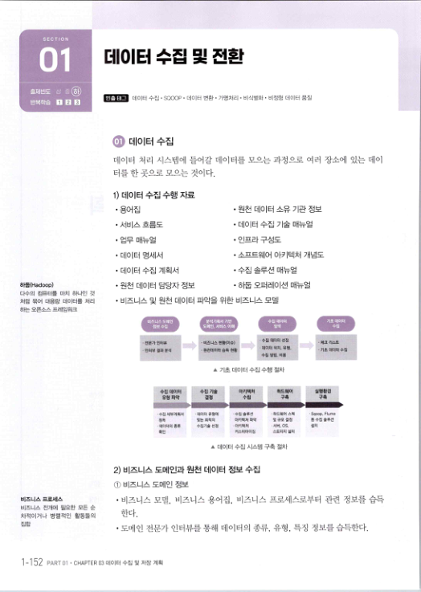
# SECTION 01
# 데이터 수집 및 전환
출저빈도 딩 「「수（화， 빈출 태그 데이터 수집 · SQOOP · 데이터 변환 · 가명처리 · 비식별화 · 비정형 데이터 품질 반복학습 .. 口 鬪

### c 데이터 수집
데이터 처리 시스템에 들어갈 데이터를 모으는 과정으로 여러 장소에 있는 데이 터를 한 곳으로 모으는 것이다． 1) 데이터 수집 수행 자료

- 원천 데이터 소유 기관 정보
- 용어집
- 데이터 수집 기술 매뉴얼
- Al미＜느 으．놈노
- 인프라 구성도
- 업무 매뉴얼
- 소프트웨어 아키텍처 개념도
- 데이터 명세서
- 수집 솔루션 매뉴얼
- 데이터 수집 계획서
- 하둡 오퍼레이션 매뉴얼
- 원천 데이터 담당자 정보
히툽盼adoop) 다수의 컴퓨터를 마치 하나인 것

- 비즈니스 및 원천 데이터 파악을 위한 비즈니스 모델
처럼 묶《거 대용량 데이터를 처리 하는 오픈소스 프레임워크 수집 데이터 탕색 비즈니스 도메인 정보 수집 분석기훠서 기반 도메인 . 서비스 이해 수집 네이터 선첨 , 비즈니스 현황（이슈） 전문가 인터뷰 4 데이터 워치． 유형， 4 원천데이터 습독 현황 . 인터뷰 곁과 분삭 수집 방법， 비용 A 기초 데이터 수집 수행 절차 수집 기술 아키텍처 하드웨어 실행환경 수집 데이터 결정 수립 구축 구축 ---- 유형 파악

- 데이터 유형에
맞는 최적의 수짐기솔 선정 ^ 데이터 수집 사스템 구축 절차 2) 비즈니스 도메인과 원천 데이터 정보 수집 ① 비즈니스 도메인 정보

- 비즈니스 모델 , 비즈니스 용어집 , 비즈니스 프로세스로부터 관련 정보를 습득
비즈니스 프로세스 비즈니스 전개에 필요한 모든 순 한다． 차적이거나 병렬적인 활동들의 집합

- 도메인 전문가 인터뷰를 통해 데이터의 종류 , 유형 , 특징 정보를 습득한다．
H 52 PART이 룝 CHAPTER 03 데이터 수집 및 저장 계획

> 기초 데이터 
수칩

> ' 체크 리쇼트
> 기초 데이터 수집
> 'Sqoop, Flume
> 듕 수집 솔루션
> 설치
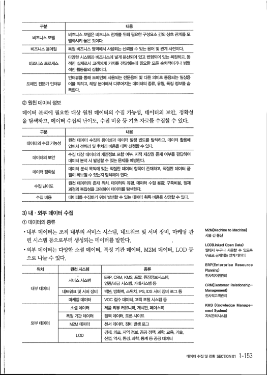
구분 내용 비즈니스모델 비즈니스 모델은 비즈니스 전개를 위해 필요한구성요소 간의 상호 관계를 모 델화시켜 놓은 것이다． 비죄 스용어집 특정 비즈니스 영역에서 사용되는 신뢰할 수 있는 용어 및 관계 사전이다． 다양한 시스템과 비즈니스（게 넓게 분산되어 있고 변형되어 있는 복잡하고， 동 비즈니스甥l세스 적인 실체로서 고객에게 가치를 전달하는데 필요한 모든 순차적이거나 병렬 적인 횔동들의 집합이다． 인터뷰를 통해 도메인에 사용되는 전문용어 및 다른 의미로 통용되는 일상용 어를 익히고， 해당 분야에서 다루어지는 데이터의 종류 . 유형 . 특징 정보를 습 도메인 전문가 인터뷰 득한다． ② 원천 데이터 정보

#### 데이터 분석에 필요한 대상 원천 데이터의 수집 가능성 , 데이터의 보안 , 정확성
#### 을탐색하고 , 데이터 수집의 난이도 , 수집 비용등 기초 자료를수집할수 있다．
구분 내용 데이터의 수집 가능성 원천 데이터 수집의 용이성과 데이터 발생 빈도를 탐색하고， 데이터 횔용에 있어서 전처리 및 후처리 비용을 대략 산정할 수 있다． 데이터의 보안 수집 대상 데이터의 개인정보 포함 여부． 지적 재산권 존재 여부를 판단하여 데이터 분석 시 발생할 수 있는 문저屠 예방한다． 데이터 정확셩 데이터 분석 목적에 맞는 적절한 데이터 항목이 존재하고， 적절한 데이터 품 질이 확보될 수 있는지 탐색해야 힌다． 수집 난이도 원천 데이터의 존재 위치 , 데이터의 유형 . 데이터 수집 용량, 구축비용 . 정제 과정의 복잡성을 고려하여 데이터를 탐색힌다． 수집 비용 데이터를 수집하기 위해 발생할 수 있는 데이터 획득 비용을 산정할 수 있다．

#### 3) 내 · 외부 데이터 수집
① 데이터의 종류

#### · 내부 데이터는 조직 내부의 사비스 시스템 , 네트워크 및 서버 장비 , 마케팅 관
런 시스템 등으로부터 생성되는 데이터를 말한다．

#### · 외부 데이터는 다양한소셜 데이터 , 특정 기관 데이터 , M2M 데이터 , LOD 등
으로 나눌수 있다． 위치 원천 시스템 종류 서비스 시스템 ERP. CRM. KMS . 포탈. 원장정트：씨스템， 인증／과금시스템 . 거래시스템 등 내부 데이터 네트워크 및 서버 장비 백본. 방화벽 , 스위치 , PS. IDS 서버 장비 로그 등 마케팅 데이터 voc 접수 데이터 , 고객 포털 시스템 등 소셜 데이터 저푿 리뷰 커뮤니티 , 게시판, 페이스북 정책 데이터 . 토론사이트 특정 기관 데이터 외부 데이터 센서 데이터 , 장비 발생 로그 M2M 데이터 LOD 경제 . 의료， 지역 정보， 공공 정책 , 과학, 교육 , 기술， 산업 . 역사, 환경 . 과학. 통계 등 공공 데이터

> M2M(Machine to Machine) 
사물간통신

> LOD(Linked Open Data) 
웹에서 누구나 사용할 수 있도록 무료로 공개되는 연계 데이터

> ERP(Enterprise Resource
> Planning) 
전사적자원관리

> CRM(Customer Relationship-
Management) 전사적고객관리

> KMS (Knowledge Manage-
ment System) 지식관리시스템

> 데이터수집및전환SECTION01 1-153
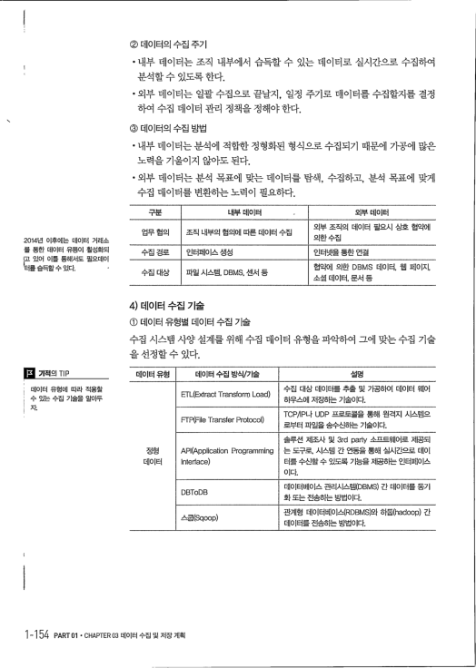
② 데이터의 수집 주기

- 내부 데이터는 조직 내부에서 습득할 수 있는 데이터로 실시간으로 수집하여
분석할 수 있도록 한다．

#### · 외부 데이터는 일괄 수집으로 끝날지 , 일정 주기로 데이터를 수집할지를 결정
하여 수집 데이터 관리 정책을 정해야 한다． ③ 데이터의 수집 방법

- 내부 데이터는 분석에 적합한 정형화된 형식으로 수집되기 때문에 가공에 많은
노력을 기울이지 않아도 된다．

#### · 외부 데이터는 분석 목표에 맞는 데이터를 탐색 , 수집하고 , 분석 목표에 맞게
수집 데이터를 변환하는 노력이 필요하다． 구분 내부 데이터 외부 데이터 업무 협의 조직 내부의 협의에 따른 데이터 수집 외부 조직의 데이터 필요시 상호 협약에 의한수집 2014년 이후에는 데이터 거래소 를 통한 데이터 유통이 활성화되 炫l 잇에 이름 톳해서도 핌요데이 수집 경로 인터페이스 생성 인터넷을 통한 연결 수집 대상 파일 시스템 , DBMS , 센서 등 협약에 의한 DBMS 데이터 , 웹 페이지， γ터를 습득할 수 있다． " 소셜 데이터 , 문서 등 4) 데이터 수집 기술 ① 데이터 유형별 데이터 수집 기술 수집 시스템 사양 설계를 위해 수집 데이터 유형을 파악하여 그에 맞는 수집 기술 을 선정할 수 있다． .

기적의 ㄲp 데이터 유형 데이터 수집 방식／기술 설명 ETL(Extract Transform Load) 수집 대상 데이터를 추출 및 가공하여 데이터 웨어 데이터 유형에 따라 적용할

#### 霖있는수칩 ' 膣으'
o}두 하우스에 저장하는 기술이다． FTP(File Transfer Protocol) TCP기P나 UDP 프로토콜을 통해 원격지 시스템으 로부터 파일을 송수신하는 기술이다． 솔루션 제조사 및 3rd party 소프트웨어로 저屠되 는 도구로 시스템 간 연동을 통해 실시간으로 데이 APl(Application Programming 정형 터를 수신할 수 있도록 기능을 제공하는 인터페이스 Interface) 데이터 이다． DBT0DB 데이터베이스 관리시스템（DBMS) 간 데이터를 동기 화 또는 전송하는 방법이다． 스쿱（Sqoop) 관계형 데이터베이스（RDBMS）와 하둡仍adoop) 간 데이터를 전송하는 방법이다． 1 -154 PART 01 · CHAPTER 03 데이터수집 및처장계획

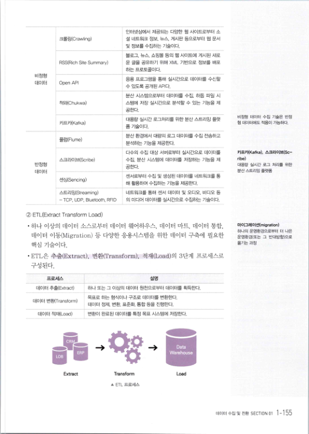
인터넷상에서 제공되는 다양한 웹 사이트로부터 소 셜 네트워크 정．보， 뉴스， 게시판 등으로부터 웹 문서 크롤링（Crawling) 및 정보를 수집하는 기술이다． 블로그 , 뉴스 . 쇼핑몰 등의 웹 사이트에 게시된 새로 운 글을 공유하기 위해 ×ML 기반으로 정보를 배포 RSS(Rich Site Summary) 하는 프로토콜이다． 비정형 응용 프로그램을 통해 실시간으로 데이터를 수신할 데이터 Open API 수 있도록 공개된 API다． 분산 시스템으로부터 데이터를 수집 , 하둡 파일 시 스템에 저장 실시간으로 분석할 수 있는 기능을 제 척와（Chukwa) 공한다． 대용량 실시간 로그처리를 위한 분산 스트리밍 플랫 카프카（Kafka) 폼 기술이다． 플럼（Flume) 분산 환경에서 대량의 로그 데이터를 수집 전송하고 분석하는 기능을 저곧한다． 다수의 수집 대상 서버로부터 실시간으로 데이터를 스크라이브（Scribe) 수집 , 분산 시스템에 데이터를 저장하는 기능을 제 반정형 공한다． 데이터 센싱（Sencing) 센서로부터 수집 및 생성된 데이터를 네트워크를 통 해 활용하여 수집하는 기능을 저금한다． 스트리밍（Streaming) 네트워크를 통해 센서 데이터 및 오디오， 비디오 등

- TCP. UDP, Bluetooth, RFID 
의 미디어 데이터를 실시간으로 수집하는 기술이다． ②ETL(Extract Transform Load)

- 하나 이상의 데이터 소스로부터 데이터 웨어하우스 , 데이터 마트 , 데이터 통합，
데이터 이동（Migration) 등 다양한 응용시스템을 위한 데이터 구축에 필요한 핵심 기술이다．

- ETL은 추출（Extract) , 변환（Transform) , 적재（Load）의 3단계 프로세스로
구성된다． 프회 쵭스 설명 데이터 추출〈Extract) 하나 또는 그 이상의 데이터 원천으로부터 데이터를 획득한다． 데이터 변환（Transform) 목표로 하는 형식이나 구조로 데이터를 변환한다． 데이터 정제 . 변환 , 표준화, 통합 등을 진행한다． 데이터 적재（Load) 변환이 완료된 데이터를 특정 목표 시스템에 저장한다．

# LOB，항，
Transform Load ▲ ETL 프롸ㅔ스

> 비정형 데이터 수집 기술은 반정 
형 데이터에도 적용이 가능하다．

> 카프카（Kafka) , 스크라이브（Sc-
ribe) 대용량 실시간 로그 처리를 위한 분산 스트리밍 플랫폼

> 마이그레이션（migration)
> 하나의 운영환경으로부터 더 나은 
운영환경《또는 그 반대방향）으르 옮기는 과정

> 데이터수집및전환 SECTION01 1-155
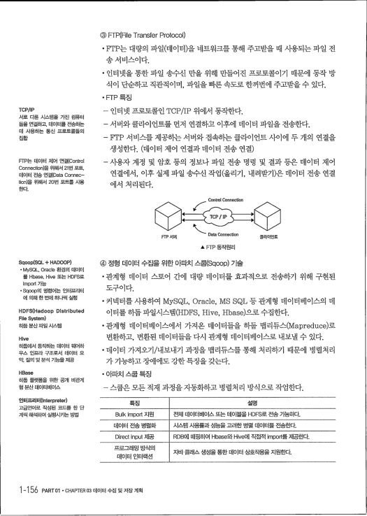
③FTP(File Transfer Protocol)

- PrP는 대량의 파일（데이터）을 네트워크를 통해 주고받을 때 사용되는 파일 전 
송 서비스이다．

- 인터넷을 통한 파일 송수신 만을 위해 만들어진 프로토콜이기 때문에 동작 방
식이 단순하고 직관적이며 , 파일을 빠른 속도로 한꺼번에 주고받을 수 있다．

- FTP 특징
#### - 인터넷 프로토콜인 TCP/ll〕 위에서 동작한다．
Tcp/IP 서로 다른 시스템을 가진 컴퓨터 들을 연결하고， 데이터를 전송하는 데 사용하는 통신 프로토콜들의 집합

- 서버와 클라이언트를 먼저 연결하고 이후에 데이터 파일을 전송한다．
- FTP 서비스를 제공하는 서버와 접속하는 클라이언트 사이에 두 개의 연결을
생성한다 . （데이터 제어 연결과 데이터 전송 연결）

- 사용자 계정 및 암호 등의 정보나 파일 전송 명령 및 결과 등은 데이터 제어
FTP는 데이터 제어 연결（Control Connection）을 위해서 21번 포트， 연결에서 , 이후실제 파일 송수신작업（올리기 , 내려받기）은 데이터 전송 연결 데이터 전송 연결（Data Connec- tion）을 위해서 20번 포트를 사용 에서 처리된다． 한다． Contml Connectl에 Data Connection ▲ FTP 동작원리 ④ 정형 데이터 수집을 위한 아파치 스쿱(Sqoop) 기술 Sqoop(SQL + HADOOP)

- MySQL. Oracle 환경으「데이터 
를 Hbase. Hive 또는 HDFS로 import 가능

- Sqoop의 명령어는 인터프리터
- 관계형 데이터 스토어 간에 대량 데이터를 효과적으로 전송하기 위해 구현된
도구이다． 0ㅔ 의해 한 번에 하나씩 실행

- 커넥터를 사용하여 MySQL, Oracle, MS SQL 등 관계형 데이터베이스의 데
이터를하둡파일시스템（HDFS, Hive, Hbase）으로수집한다． HDFS(Hadoop Distributed File System)

- 관계형 데이터베이스에서 가져온 데이터들을 하둡 맵리듀스（Mapreduce）로
히둡 분산 파일 시스템

#### 변환하고 , 변환된 데이터들을 다시 관계형 데이터베이스로 내보낼 수 있다 .
Hive 하둡에서 푸l하는 데이터 웨어하 우스 인프라 구조로서 데이터 요 약. 질의 및 분석 기능을 제공

- 데이터 가져오기／내보내기 과정을 맵리듀스를 통해 처리하기 때문에 병렬처리 
가 가능하고 장애에도 강한 특징을 갖는다．

- 아파치 스쿱 특징
HBase 하둡 플랫폼을 위한 공개 비관계

- 스쿱은 모든 적재 과정을 자동화하고 병렬처리 방식으로 작업한다．
형 분산 데이터베이스 인터프리터.nterpreter) 특징 설명 고급언어로 작성된 코드를 한 단 Bulk import 지원 전체 데이터베이스 또는 테이블을 HDFS로 전송 가능하다． 계씩 해석하여 실행시키는 방법 데이터 전송 병렬화 시스템 사용률과 성능을 고려한 병렬 데이터를 전송한다． Direct input 저l RDB에 매핑하（聊 base와iveo∥ 직접i import를 제공한다． 프로그래밍 방식의 데이터 인터랙션 자바 클래스 생성을 통한 데이터 상호작용을 지원한다． 1-156 PART01 * CHAPTER03 데이터수집 및저장계획

> 클라이언트
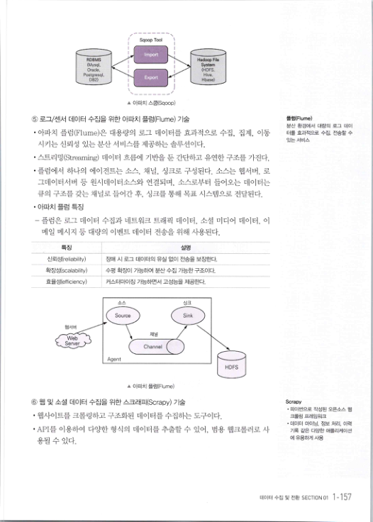
Sqoop To이 , *7큔 ADBMS 棚ysqi, Oracle, Postgresql, ,．∼ DB2) -5- Hads聊I File System 어DFS, Hive, Hbaso) ,,｀∼ / 낟／ / ▲ 아파치 스쿱(Sqoop) ⑤ 로그／선써 데이터 수집을 위한 아파치 플럼（Flume) 기술

- 아파치 플럼（Flume）은 대용량의 로그 데이터를 효과적으로 수집 , 집계 , 이동
시키는 신뢰성 있는 분산 서비스를 제공하는 솔루션이다．

- 스트리밍（Streaming) 데이터 흐름에 기반을 둔 간단하고 유연한 구조를 가진다．
- 플럼에서 하나의 에이전트는 소스 , 채널 , 싱크로 구성된다 . 소스는 웹서버 , 로
그데이터서버 등 원시데이터소스와 연결되며 , 소스로부터 들어오는 데이터는 큐의 구조를 갖는 채널로 들어간 후 , 싱크를 통해 목표 시스템으로 전달된다．

- 아파치 플럼 특징
플럼은 로그 데이터 수집과 네트워크 트래픽 데이터 , 소셜 미디어 데이터 , 이 메일 메시지 등 대량의 이벤트 데이터 전송을 위해 사용된다． 특징 설명 신뢰성（reliability) 장애 시 로그 데이터의 유실 없이 잔송을 보장한다． 확장성（scalability) 수평 확장이 가능하여 분산 수집 가능한 구조이다． 효율성（efficiency) 커스터마이징 가능하면서 고성능을 제공한다． ^ 아파치 플럼（Flume) ⑥ 웹 및 소셜 데이터 수집을 위한 스크래피（Scrapy) 기술

- 웹사이트를 크롤링하고 구조화된 데이터를 수집하는 도구이다．
- API를 이용하여 다양한 형식의 데이터를 추출할 수 있어 , 범용 웹크롤러로 사
용될 수 있다．

> 푤럼（Flume)
> 분산 환경에서 대량의 로그 데이 
터를 효과적으로 수집 . 전송할 수 있는 서비스

> Scrapy 
- 파이썬으로 작성된 오픈소스 웹
> 크롤링 프레임워크 
- 데이터 매기닝 , 정보 처리 , 이력 
기록 같은 다양한 애플리케이션 에 유용하게 사용

> 데이터수집및전환 SECTION01 1-157
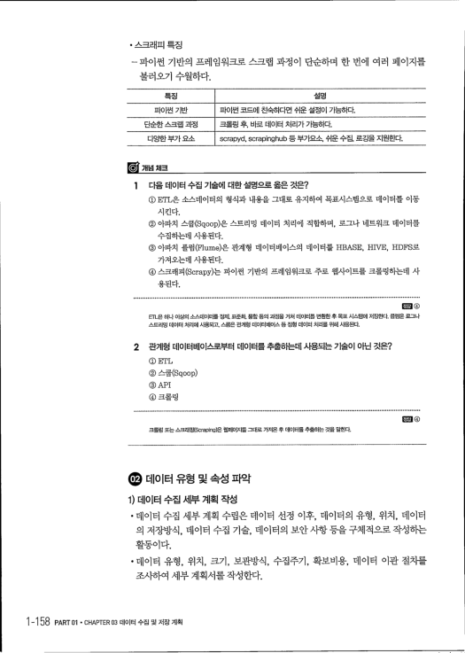
- 스크래피 특징
- 파이썬 기반의 프레임워크로 스크랩 과정이 단순하며 한 번에 여러 페이지를
불러오기 수월하다． 특징 설명 파애선기반 파이썬 코드에 친숙ㅎFE갸면 쉬운 설정이 가능하다． 단순한 스크랩 과정 크롤링 후， 바로 데이터 처리가 가능하다． 다양한부가요소 scrapyd, scrapin아，ub 등 부가요＝혁 쉬운 수집 . 로깅을 지원한다． 1 다음 데이터 수집 기술에 대한설명으로옳은 것은？ ① ETL은 소스데이터의 형식과 내용을 그대로 유지하여 목표시스템으로 데이터를 이동 시킨다． ② 아파치 스쿱（Sqoop）은 스트리밍 데이터 처리에 적합하며 , 로그나 네트워크 데이터를 수집하는데 사용된다． ③ 아파치 플럼（Flume）은 관계형 데이터베이스의 데이터를 HBASE, HIVE, HDFS로 가져오는데 사용된다． ④ 스크래피（Scrapy）는 파이썬 기반의 프레임워크로주로 웹사이트를 크롤링하는데 사 용된다 .

ETL은 하나 이상의 소스데이터를 정저I . 표준화. 통합등의 과장을 거쳐 데이터를 변환한후 목표 시스템에 저장한다． 플럼은 로그나 스트리밍 데이터 처리에 사용되고， 스쿱은관계형 데이터베이스등 정형 데이터 처리를 위해 사용된다． 2 관계형 데이터베이스로부터 데이터를추출하는데 사용되는 기숱이 o닌 것은？ D ETL ② 스쿱（Sqoop) ③ API ④ 크롤링 크롤링 또는 스크래핑（Scraping）은 웹페이ㅈ隱 그대로 가ㅈ묜 후 데이터를 추출ㅎㅐ뜨 것을 말한다． .

데이터 유형 및 속성 파악 1) 데이터 수집 세부 계획 작성

#### · 데이터 수집 세부 계획 수립은 데이터 선정 이후 , 데이터의 유형 , 위치 , 데이터
#### 의 저장방식 , 데이터 수집 기술 , 데이터의 보안사항등을구쳬적으로작성하는
활동이다．

#### · 데이터 유형 , 위치 , 크기 , 보관방식 , 수집주기 , 확보비용 , 데이터 이관 절차를
조사하여 세부 계획서를 작성한다． 1 -158 PART 01 · CHAPTER 03 데이터 수집 및 저장 계획

> 驪（D
> 뎔珊④
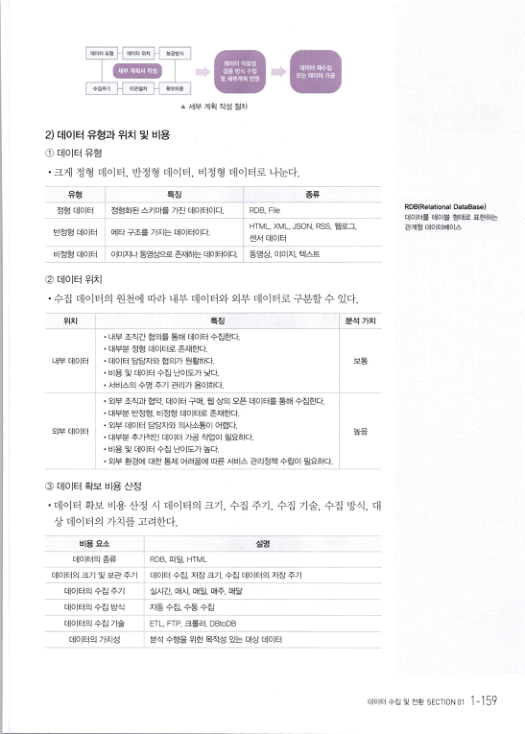
▲ 세부 계획 작성 절차 2) 데이터 유형과 위치 및 비용 ① 데이터 유형

- 크게 정형 데이터 , 반정형 데이터 , 비정형 데이터로 나눈다．
유형 특징 종류 정형 데이터 정형화된 스키마를 가진 데이터이다． RDB. File 반정형데이터 메타구조를가지는데이터이다． HTML XML. JSON, RSS 웹로그， 센서 데이터 비정형 데이터 이미지나동앙상으로존자陰l는데이터이다． 동영상 , 이미지 , 텍스트 ② 데이터 위치

#### · 수집 데이터의 원천에 따라 내부 데이터와 외부 데이터로 구분할 수 있다． 
- . .. . --r 
뷔지 특징 분석 가치

- 내부 조직간 협의를 통해 데이터 수집한다．
- 대부분 정형 데이터로 존재한다．
- 데이터 담당자와 협의가 원활하다．
내부 데이터

- 비용 및 데이터 수집 난이도가 낮다．
- 서비스의 수명 주기 관리가 용이하다．
- 외부 조직과 협약 , 데이터 구매 , 웹 상의 오픈 데이터를 통해 수집한다．
- 대부분 반정형 , 비정형 데이터로 존재한다．
- 외부 데이터 담당자와 의사소통이 어렵다．
외부 데이터

- 대부분 추가적인 데이터 가공 작업이 필요하다．
- 비용 및 데이터 수집 난이도가 높다．
- 외부 환경에 대한 통제 어려움에 따른 서비스 관리정책 수립이 필요하다．
③ 데이터 확보 비용 산정

- 데이터 확보 비용 산정 시 데이터의 크기 , 수집 주기 , 수집 기술 , 수집 방식 , 대 
상 데이터의 가치를 고려한다． 비용 요소 설명 데이터의 종류 RDB , 파일 , HTML 데이터의 크기 및 보관 주기 데이터 수집 , 저장크기 , 수집 데이터의 저장주기 데이터의 수집 주기 실시간 , 매시 , 매일 , 매주 . 매달 데이터의 수집 방식 자동 수집 , 수동 수집 데이터의 수집 기술 ETL. FTP , 크롤러， DBtoDB 데이터의 가치성 분석 수행을 위한 목적성 있는 대상 데이터

> RDB(Relational DataBase)
> 데이터를 테이블 형태로 표현하는
> 관계헝 데이터베이스
> 보통
> 늪음
> 데이터수집및전환SECTION 01 H59
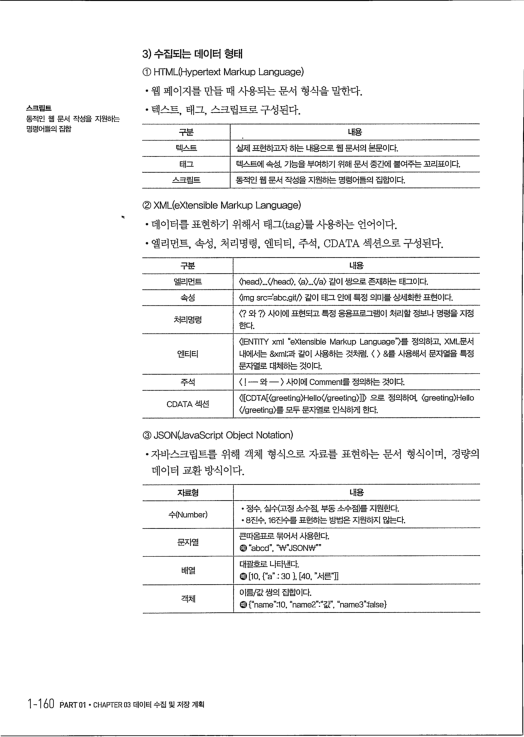
3) 수집되는 데이터 형태 CHTML(Hypertext Markup Language)

- 웹 페이지를 만들 때 사용되는 문서 형식을 말한다．
스크립트

- 텍스트 , 태그 , 스크립트로구성된다．
동적인 웹 문서 작성을 지원하는 명령어들의 집합 구분 내용 텍스트 실제 표헌하고차 하는 내용으로 웹 문서의 본문이다． 태그 텍스트에 속성 . 기능을 부여하기 위해 문서 중간에 붙여주는 꼬리표이다． 스크립트 동적인 웹 문서 작성을 지원하는 명령어들의 집합이다． ②XML(eXtensible Markup Language)

- 데이터를 표현하기 위해서 태그（tag）를 사용하는 언어이다．
- 엘리먼트 , 속정 , 처리명령 , 엔티티 , 주적 , CDATA섹션으로구성된다．
구분 내용 엘리먼트 仍ead> ... 物ead>, < a>...K/a> 같이 쌍；으로존재하는 태그이다． 속성  같이 태그 인에 특정 의미를 상세화한 표현이다． 처리명령 <? 와 ?> 사이에 표현되고 특정 응용프로그램이 처리할 정보나 명령을 지정 힌다.

엔티티 (!ENTI1Y xml "eXtensible Markup Language " ＞를 정의하ㅍ XML문서 내에서는 &<ml；과 같이 사용하는 것처럼 . < > ＆를 사용해서 문자열을 특정 문자열로 대체하는 것이다． 주석 < ! -- 와 -

> 사이에 Comment를 정의하는 것이다．
CDATA 섹션 ([CDTA[<greeting꺼빼0</greeting> II> 으로 정의하여 , <greeting)Hello (/greeting〉를 모두 문자열로 인식하게 한다． ③JSON(JavaScript Object Notation)

- 자바스크립트를 위해 객쳬 형식으로 자료를 표현하는 문서 형식이며 , 경량의
데이터 교환 방식이다． 차료형 내용 수《Number)

- 정수, 실수（고정 소수점 . 부동 소수점）를 지원한다． 
"8진수 , 16진수를 표헌하는 방법은 지원하지 않는다． 문자열 큰따옴표로 묶어서 사용한다． .l "abcd", "W"JSONW"" 배열 대괄호로 나타낸다． 0 [10, {"a" : 30 }, [ 40. " 서른 "]J 객체 이름／값 쌍의 집합이다． .'{ "name":10, "name2":"f, "name3 "false} 1-160 PARTU1 "CHAPTER03 데이터수집 및저장계획

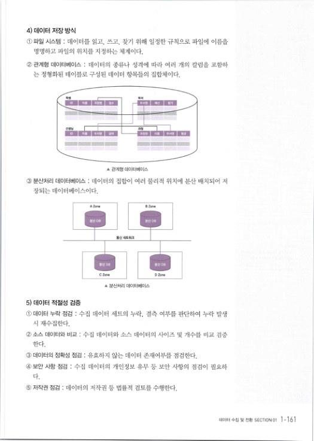
4) 데이터 저장 방식 ① 파일 시스템 : 데이터를 읽고 , 쓰고 , 찾기 위해 일정호터구칙으로 파일에 이름을 명명하고 파일의 위치를 지정하는 체계이다．

#### ②관계형 데이터베이스 : 데이터의 종류나 성격에 따라 여러 개의 칼럼을 포함하 
는 정형화된 테이블로 구성된 데이터 항목들의 집합체이다． ▲ 관계형 데이터베이스

#### ③분산처리 데이터베이스 : 데이터의 집합이 여러 물리적 위치에 분산 배치되어 저
장되는 데이터베이스이다． A功r盼 롱신 녜트워크 C Zone D Zone ▲ 분산처리 데이터베이스 5) 데이터 적절성 검증

#### ① 데이터 누락 점검 : 수집 데이터 세트의 누락 , 결측 여부를 판단하여 누락 발생
시 재수집한다．

#### ② 소스 데이터와 비교 : 수집 데이터와 소스 데이터의 사이즈 및 개수를 비교 검증
한다．

#### ③ 데이터의 정확성 점검 : 유효하지 않는 데이터 존재여부를 점검한다．
#### ④보안 사항 점검 : 수집 데이터의 개인정보 유무 등 보안 사항의 점검이 필요하
다．

#### ⑤ 저작권 점검 : 데이터의 저작권 등 법률적 검토를 수행한다．
> 데이터 수집 및 전환 SECTION 01 ㅑ
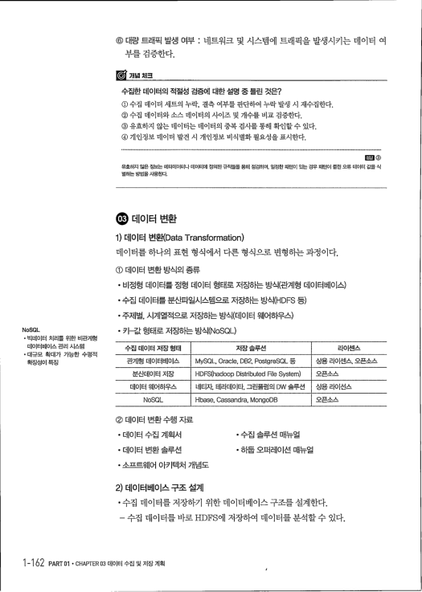
⑥ 대량 트래픽 발생 여부 : 네트워크 및 시스템에 트래픽을 발생시키는 데이터 여 부를 검증한다． 수집한 데이터의 적절성 검증에 대한 설명 중 틀린 것은？ ① 수집 데이터 제트의 누락 , 결측 여부를 판단하여 누락 발생 시 재수집한다． ② 수집 데이터와 소스 데이터의 사이즈 및 개수를 비교 검증한다． ③ 유효하지 않는 데이터는 데이터의 중복 검사를 통해 확인할 수 있다． ④ 개인정보 데이터 발견 시 개인정보 비식별화 필요성을 표시한다． 유효하지 않은 정．보는 메타데이터나 데이터에 정의된 규칙들을 통해 점검하며 . 일정한 패턴이 았는 경우 패턴이 틀린 오류 데이터 값을 식 별하는 방법을 사용한다． .

데이터 변환 1) 데이터 변환（Data Transformation) 데이터를 하나의 표현 형식에서 다른 형식으로 변형하는 과정이다． ① 데이터 변환 방식의 종류

- 비정형 데이터를 정형 데이터 형태로 저장하는 방식（관계형 데이터베이스）
- 수집 데이터를 분산파일시스템으로 저장하는 방식的DFS 등）
- 주제별 , 시계열적으로 저장하는 방식（데이터 웨어하우스）
- 키－값 형태로 저장하는 방식（NoSOL)
N0SQL

- 빅데이터 처리를 위한 비관계형
수집 데이터 저장 형태 저장솔루션 라이센스 데이터베이스 관리 시스템

- 대규모 확대가 가능한 수평적
관계형 데이터베이스 MySOL, Oracle, DB2, PostgreSQL * 상용 라이센스， 오픈소스 확장성이 특징 분산데이터 저장 HDFS(hadoop Distributed File System) 오픈소스 데이터 웨어하우스 네티자. 테라데이타 , 그린플럼의 DW 솔루션 상용 라이선스 NoSQL Hbase, Cassandra, MongoDB 오픈소스 ② 데이터 변환 수행 자료

- 데이터 수집 계획서 
- 수집 솔루션 매뉴얼
- 데이터 변환솔루션 
- 하둡오퍼레이션 매뉴얼
- 소프트웨어 아키텍처 개념도
2) 데이터베이스 구조 설계

- 수집 데이터를 저장하기 위한 데이터베이스 구조를 설계한다．
- 수집 데이터를 바로 HDFS에 저장하여 데이터를 분적할 수 있다．
1-162 PART01 . Cl-1AP1ER03 데이터 수집 및 저장계획

> El
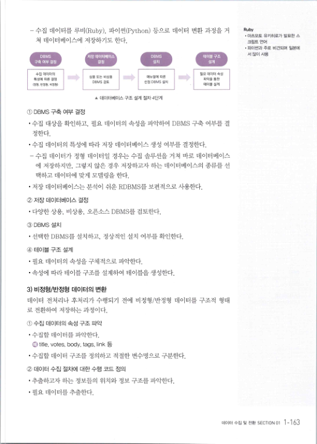
- 수집 데이터를 루비（Ruby) , 파이썬（Python) 등으로 데이터 변환 과정을 거
쳐 데이터베이스에 저장하기도 한다． 저장 데이터베이스 결정 필요 데이터 속성 수집 데이터의 매뉴얼에 따른 상용 또논 비상용 0톄ls 검토 파악을 퉁한 특성에 따른 결정 선정 DBMS 설치 테이블 설계 《정헝， 반정형， 비정형） ▲ 데이터베이스 구조 설계 절차 4단계 ①DBMS 구축 여부 결정

- 수집 대상을 확인하고 , 필요 데이터의 속성을 파악하여 DBMS 구축 여부를 결
정한다．

- 수집 데이터의 특성에 따라 저장 데이터베이스 생성 여부를 결정한다．
- 수집 데이터가 정형 데이터일 경우는 수집 솔루션을 거쳐 바로 데이터베이스
에 저장하지만 , 그렇지 않은 경우 저장하고자 하는 데이터베이스의 종류를 선 택하고 데이터에 맞게 모델링을 한다．

- 저장 데이터베이스는 분석이 쉬운 RDBMS를 보편적으로 사용한다．
② 저장 데이터베이스 결정

- 다양한상용 , 비상용 , 오픈소스DBMS를검토한다．
③ DBMS 설치

- 선택한 DBMS를 설치하고 , 정상적인 설치 여부를 확인한다．
④ 테이블 구조 설계

- 필요 데이터의 속정을 구쳬적으로 파악한다 .
- 속성에 따라 테이블 구조를 설계하여 테이블을 생성한다．
3) 비정형／반정형 데이터의 변환 데이터 전처리나 후처리가 수행되기 전에 비정형／반정형 데이터를 구조적 형태 로 전환하여 저장하는 과정이다． ① 수집 데이터의 속성 구조 파악

- 수집할 데이터를 파악한다．
JI  title, votes, body, tags, link 등

- 수집할 데이터 구조를 정의하고 적절한 변수명으로 구분한다．
② 데이터 수집 절차에 대한 수행 코드 정의

- 추출하고자 하는 정보들의 위치와 정보 구조를 파악한다．
- 필요 데이터를 추출한다．
> Ruby 
- 마班토 유키히로가 발표한 스
> 크립트 언어
> - 파이썬과 주로 비견되며 일본에
> 서 많이 사웅
> 데이터수집및전환SECTION 01 1 -1 63
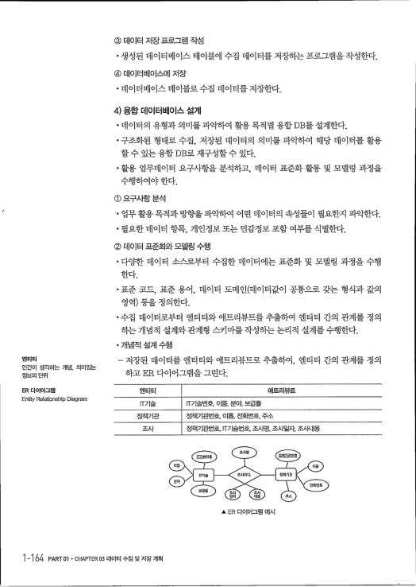
③ 데이터 저장 프로그램 작성

- 생성된 데이터베이스 데이블에 수집 데이터를 저장하는 프로그램을 작성한다．
④ 데이터베이스에 저장

- 데이터베이스 데이블로 수집 데이터를 저장한다．
4) 융합 데이터베이스 설계

- 데이터의 유형과 의미를 파악하여 활용 목적별 융함 DB를 설계한다．
- 구조화된 형태로 수집 , 저장된 데이터의 의미를 파악하여 해당 데이터를 활용 
할 수 있는 융합 DB로 재구성할 수 있다．

- 활용 업무데이터 요구사항을 분석하고 , 데이터 표준화 활동 및 모델링 과정을
수행하여야 한다． ① 요구사항 분석

- 업무 활용 목적과 방향을 파악하여 어떤 데이터의 속정들이 필요한지 파악한다．
- 필요한 데이터 항목 , 개인정보 또는 민감정보 포함 여부를 식별한다．
② 데이터 표준화와 모델링 수행

- 다양한 데이터 소스로부터 수집한 데이터에는 표준화 및 모델링 과정을 수행
한다 .

- 표준 코드 , 표준 용어 , 데이터 도메인（데이터값이 공통으로 갖는 형식과 값의
영역） 등을 정의한다．

- 수집 데이터로부터 엔티티와 애트리뷰트를 추출하여 엔티티 간의 관계를 정의
하는 개념적 설계와 관계형 스키마를 작성하는 논리적 설계를 수행한다．

- 개념적 설계 수행
- 저장된 데이터를 엔티티와 애트리뷰트로 추출하여 , 엔티티 간의 관계를 정의
엔티티 인간이 생각하는 개념 . 의미있는 정보의 단위 하고 ER 다이어그램을 그린다． 티큇 다이어그램 엔티티 애트리뷰트 Entity Relationship 嘶agram 汗기술 ㄸ기술번호， 이름. 분야. 보급률 정책기관 정책기관번호， 이름, 전화번호， 주소 조사 정책기관번호， IT기술번호， 조사명 , 조사일자. 조사내용 A ER 다이어그램 예시 H 64 PART01 * CI-1APTER03 데이터 수집 및 저장 계획

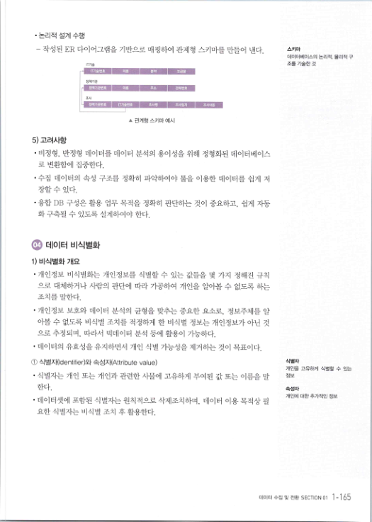
- 논리적 설계 수행
- 작성된 ER 다이어그램을 기반으로 매핑하여 관계형 스키마를 만들어 낸다．
IT기술 조사내용 ▲ 관계형 스키마 예시 5) 고려사항

- 비정형 , 반정형 데이터를 데이터 분석의 용이성을 위해 정형화된 데이터베이스 
로 변환함에 집중한다． ' 수집 데이터의 속정 구조를 정확히 파악하여야 툴을 이용한 데이터를 쉽게 저 장할 수 있다．

- 융합 DB 구성은 활용 업무 목적을 정확히 판단하는 것이 중요하고 , 쉽게 자동 
화 구축될 수 있도록 설계하여야 한다． .

데이터 비식별화 1) 비식별화 개요 ' 개인정보 비식별화는 개인정보를 식별할 수 있는 값들을 몇 가지 정해진 규칙 으로 대쳬하거나 사람의 판단에 따라 가공하여 개인을 알아볼 수 없도록 하는 조치를 말한다．

- 개인정보 보호와 데이터 분석의 균형을 맞추는 중요한 요소로 , 정보주체를 알 
아볼 수 없도록 비식별 조치를 적정하게 한 비식별 정보는 개인정보가 아닌 것 으로 추정되며 , 따라서 빅데이터 분석 등에 활용이 가능하다． ' 데이터의 유효성을 유지하면서 개인 식별 가능성을 제거하는 것이 목표이다． ① 식별자(Identifier）와 속성자（Attribute value) ' 식별자는 개인 또는 개인과 관련한 사물에 고유하게 부여된 값 또는 이름을 말 한다． ' 데이터셋에 포함된 식별자는 원칙적으로 삭제조치하며 , 데이터 이용 목적상 필 요한 식별자는 비식별 조치 후 활용한다．

> 스키마
> 데이터베이스의 논리적． 물리적 구 
조를 기술한 것

> 식별자
> 개인을 고유하게 식별할 수 있는 
정보

> 속성자
> 개인에 대한 추가적인 정보
> 데이터 수집 및 전환 SECTION 01 1-165
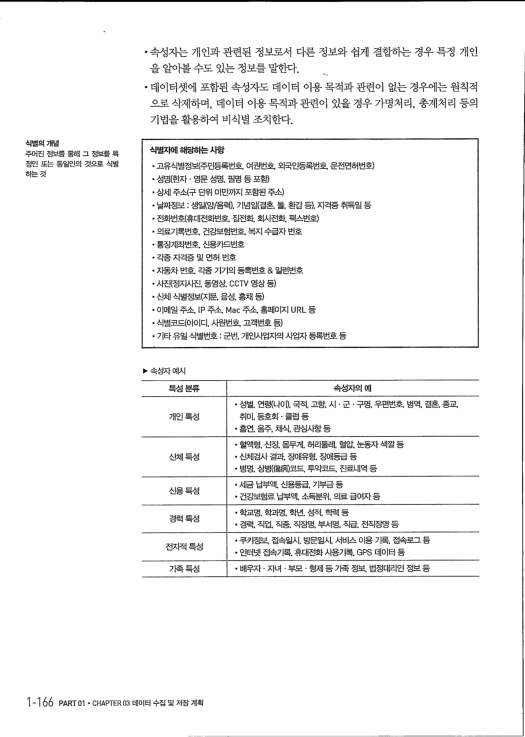
- 속정자는 개인과 관련된 정보로서 다른 정보와 쉽게 결합하는 경우 특정 개인 
을 알아볼 수도 있는 정보를 말한다． ..

- 데이터셋에 포함된 속성자도 데이터 이용 목적과 관런이 없는 경우에는 원칙적
으로삭제하며 , 데이터 이용목적과관련이 있을 경우가명처리 , 총계처리 등의 기법을 활용하여 비식별 조치한다． 식별의 개념 주어진 정보를 통해 그 정보를 특 정인 또는 동일인의 것으로 식별 히는 것 식별자에 해당하는 사항

- 고유식별정보（주민등록번호， 여권번호， 외국인등록번호， 운전면허번호）
- 성명（한자 · 영문 성명 , 필명 등 포함）
- 상세 주소（구 단위 미만까지 포함된 주소）
- 날짜정보 : 생일（양／음력） . 기념일（결혼 . 돌. 환갑 등） , 자격증 취득일 등
- 전화번호（휴대전화번호， 집전화, 회사전화. 팩스번호）
- 의료기록번호， 건강보험번훅 복지 수급자 번호
- 통장계좌번호， 신용카드번호
- 각종 자격증 및 면허 번호
- 자동차 번호， 각종 기기의 등록번호 & 일련번호
- 사진（정지사진 , 동영상, CCTV 영상등）
- 신체 식별정보（지문, 음성 , 홍채 등）
- 이메일 주소， 'P 주소， Mac 주소， 홈페이지 URL 등
- 식별코드（아이디 , 사원번호， 고객번호 등）
- 기타 유일 식별번호 : 군번 . 개인사업자의 사업자 등록번호 등
> 속성자 예시
특성분류 속성자의 예

- 성별 , 연령（나이） . 국적 . 고향 , 시 · 군 · 구명 , 우편번호， 병역 , 결혼 . 종교，
취미 , 동호회 · 클럽 등

- 흡연 , 음주, 채식 , 관심사항등
개인 특성

- 혈액형 , 신장, 新〔게 , 허리둘레 , 혈압, 繞큽자색깔등 
- 신체검사 결과, 장애유형 , 장애등급 등 
- 병명 , 상병（傷病）코특 투약코드 , 진료내역 등
신체 특성 신용 특성

- 세금 납부액 , 신용등급 , 기부금 등 
- 건강보험료 납부액 , 소득분위 , 의료 급여자 등
경력 특성

- 학교명 , 학과명 , 학년 . 성적 
． 뻑 등

- 경력 , 직업 . 직종 . 직징뼝 . 부서명 , 직급 , 전직장명 등
전자적 특성

- 쿠키정뵈 접속일시 , 방문일시 , 서비스 이용 기록, 접속로그 등
- 인터넷 접속기록. 휴대전화 사용기록 , GPS 데이터 등
7脣 특성

- 배우자 · 자녀 · 부모 · 형제 등 가족 정보， 법정대리인 정보 등
1-166 PART 01 * CHAPTER 03 더！이터수집 및저장계획 '

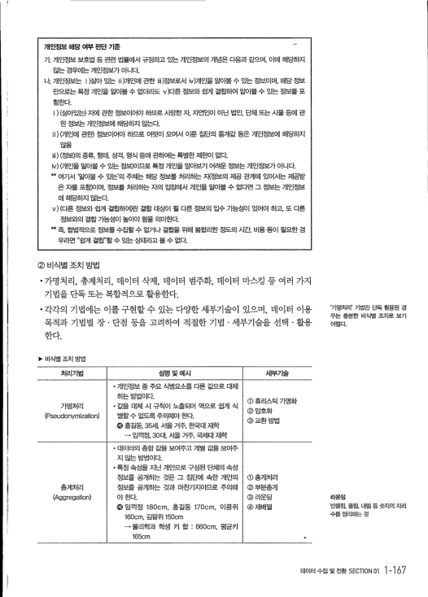
개인정보 해당 여부 죤도， 기준 가. 개인정보 보호법 등 관련 법률에서 규정하고 있는 개인정보의 개념은 다음과 같으며 , 이에 해당하지 않는 경우에는 개인정보가 아니다． 나. 개인정보는 i ）살아 있는 ∥）개인에 관한 III）정보로서 iv）개인을 알아볼수 있는 정보이며 , 해당 정보 만으로는 특정 개인을 알아볼 수 없더라도 V）다른 정보와 쉽게 결합하여 알아볼 수 있는 정보를 포 함한다． I) （살아있는） 자에 관한 정보이어야 하므로 사망한 자, 자연인이 아닌 법인 , 단체 또는 사물 등에 관 한 정보는 개인정보에 해당하지 않는다． " ) （개인에 관한） 정보이어야 하드로 여럿이 모여서 이룬 집단의 통계값 등은 개인정보에 해딛同지 않음 iii) （정보）의 종류 , 형태 . 성격 , 형식 등에 관하여는 특별한 제한이 없다.

iv) （개인을 알아볼 수 있는 정보）이므로 특정 개인을 알아보기 어려운 정보는 개인정보가 아니다． ** 여기서 ' 알아볼 수 있는 ' 의 주체는 해당 정보를 처리하는 자（정보의 저居 관계에 있어서는 제공받 은 자를 포함）이며 , 정보를 처리하는 자의 입장에서 개인을 일아볼 수 없다면 그 정보는 개인정보 0ㅔ 해당하지 않는다.

v) （다른 정보와 쉽게 결합하여）란 결합 대상이 될 다른 정보의 입수 가능성이 있어야 하곡 또 다른 정보와의 결합 가능성이 높아야 함을 의미힌다． ** 즉 , 합법적으로 정보를 수집할 수 없거나 결합을 위해 불합리한 정도의 시간, 비용등이 필요한 경 우라면 ' 쉽게 결합 ' 할수 있는 상태라고 볼 수 없다． ② 비식별 조치 방법

#### · 가명처리 , 총계처리 , 데이터 삭제 , 데이터 범주화 , 데이터 마스킹 등 여러 가지
기법을 단독 또는 복합적으로 활용한다．

- 각각의 기법에는 이를 구현할 수 있는 다양한 세부기술이 있으며 , 데이터 이용
#### 목적과 기법별 장 · 단점 등을 고려하여 적절한 기법 · 세부기술을 선택 · 활용
한다．

> 비식별 조치 방법
처리기법 설명 딪［ 예시 세부기술

- 개인정보 중 주요 식별요소를 다른 값으로 대체
하는 방법이다． ① 휴리스틱 가명화 ② 암호화 ③ 교환 방법

- 값을 대체 시 규칙이 노출되어 역으로 쉽게 식
가명처리 (Pseudonymization) 별할 수 없도록 주의해야 한다． .I 홍길동, 35세 , 서울 거주 , 한국대 재학 → 임꺽정 , 30대 , 서울 거주 , 국제대 재학

- 데이터의 총합 값을 보여주고 개별 값을 보여주 
지 않는 방법이다．

- 특정 속성을 지닌 개인으로 구셩된 단체의 속셩
정보를 공개하는 것은 그 집단에 속한 개인의 ①총계처리 총계처리 정보를 공개하는 것과 마찬가지이므로 주의해 ②부분총계 (Aggregation) 야한다 .

③라운딩 라운딩 .I 임꺽정 180cm . 홍길동 170cm , 이콩쥐 ④재배열 반올림．올림． 내림등숫자의ㅈH 160cm , 김팥쥐 150cm 수를정리ㅎ階것 →물리학과 학생 키 합 : 660cm , 평균키 165cm

> ‘가영처리 ' 기법만 단독 활용된 경 
우는 충분한 비식별 조치로 보기

> 어렵다．
> 데이터수집및전환SECTION01 1-167
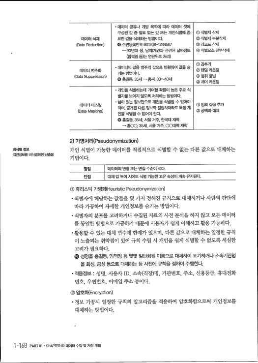
- 데이터 공유나 개방 목적에 따라 데이터 셋에
구성된 값 중 필요 없는 값 또는 개인식별에 중 요한 값을 삭제하는 방법이다． 데이터 삭제 媤》 주민등록번호 901206-1234567 -90년대 생 , 남자（개인과 괸텬된 날짜정보 (Data Reduction) （합격일 등）는 연단위로 처리）

- 데이터의 값을 범주의 값으로 변환하여 값을 숨
데이터 범주화 기는 방법이다． c[l 홍길동. 35세 → 홍씨 . 30"40세 (Data Suppression)

- 개인을 식별하는데 기여할 확률이 높은 주요 식
별자를 보이지 않도록 처리하는 방법이다． 「남아 있는 정보만으로 개인을 식별할 수 없어야 데이터 마스킹 하며 , 공개된 다른 정보와 결합하더라도 특정 개 (Data Masking) 인을 식별할 수 없어야 한다， c[I 홍길동. 35세 . 서울 거주, 한국대 재학 → 홍○0.35세 , 서울 거주． ○○대학 재학 .2) 7F처리(Pseudonymization) 개인 식별이 가능한 데이터를 직접적으로 식별할 수 없는 다른 값으로 대쳬하는 비식별 정보 개인정보를 비식별화한 산출믈 기법이다． 장점 데이터의 변형 또는 변질 수준이 적다． 단점 대체 값 부여 시에도 식별 가능한 고유 속성이 계속 유지된다． ① 휴리스틱 가명화ㅐeuristic Pseudonymization)

- 식별자에 해당하는 값들을 몇 가지 정해진 干칙으로 대쳬하거나 사람의 판단에
따라 가공하여 자세한 개인정보를 숨기는 방법이다．

- 식별자의 분포를 고려하거나 수집된 자료의 사전 분석을 하지 않고 모든 데이터
를 동일한 방법으로 가공하기 때문에 사용자가 쉽게 이해하고 활용 가능하다．

- 활용할 수 있는 대쳬 변수에 한계가 있으며 , 다른 값으로 대쳬하는 일정한 규칙
이 노출되는 취약점이 있어 규칙 수립 시 개인을 쉽게 식별할 수 없도록 세심한 고려가 필요하다． c[I 성명을 홍길동, 임꺽정 등 몇몇 일반화된 이름으로 대체하여 표기하거나 소속기관명 을 화성 , 금성 등으로 대체하는 등 사전에 규칙을 정하여 수행한다.

- 적용정보 : 성명 , 사용자ID , 소속（직장）명 , 기관번호 , 주소 , 신용등급 , 휴대전화
번호 , 우편번호 , 이메일 주소등이다． ② 암호화（Encryption)

- 정보 가공시 일정한 규칙의 알고리즘을 적용하여 암호화함으로써 개인정보를
대쳬하는 방법이다． 1-168 PART01 .CHAPTER03 데이터 수집 및 저장 계획

> ① 식별자 삭제 
② 식별자 부분삭제 ③ 레코드 삭제 ④ 식별요소 전부삭제

> ① 감추기 
② 랜덤 라운딩 ③ 범위 방법 ④ 제어 라운딩

> ① 임의 잡음 추가 
② 공백과 대체

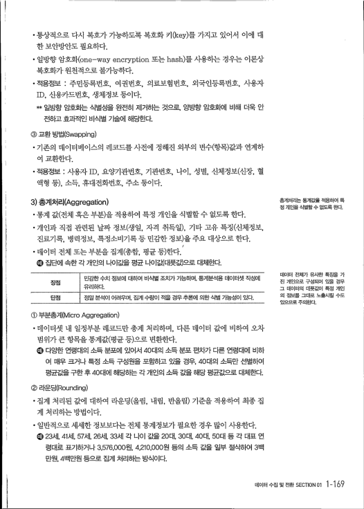
- 통상적으로 다시 복호가 가능하도븍 복호화 키（key）를 가지고 있어서 이에 대 
한 보안방안도 필요하다．

- 일방향 암호화＜one-way encryption 또는 hash）를 사용하는 경우는 이론상
복호화가원천적으로 불가능하다．

- 적용정보 : 주민등록번호 , 여권번호 , 의료보험번호 , 외국인등록번호 , 사용자 
ID , 신용카드번호 , 생쳬정보등이다． ** 일방향 암호화는 식별성을 완전히 제거하는 것으로， 양방향 암호화에 비해 더욱 안 전하고 효과적인 비식별 기술에 해당한다． ③ 교환 방법（Swapping)

- 기존의 데이터베이스의 레코드를 사전에 정해진 외부의 변수（항목）값과 연계하
여교환한다．

- 적용정보 : 사용자ID , 요양기관번호 , 기관번호 , 나이 성별 , 신쳬정보（신장 , 혈
액형 등） , 소득 , 휴대전화번호 , 주소등이다． 3) 총계처리（Aggregation)

- 통계 값（전쳬 혹은 부분）을 적용하여 특정 개인을 식별할 수 없도록 한다．
- 개인과 직접 관련된 날짜 정보（생일 , 자격 취득일） , 기타 고유 특징（신쳬정보，
진료기록 , 병력정보 , 특정소비기록등민감한정보）을주요대상으로한다．

#### / 
· 데이터 전쳬 또는 부분을 집계（총합 , 평균 등）한다． .I 집단에 속한 각 개인의 나이값을 평균 나이값（대푯값）으로 대체한다． 장점 민감한 수치 정보에 대하여 비식별 조치가 가능하며 , 통계분석용 데이터셋 작성0체 유리하다． 단점 정밀 분석이 어려우며 , 집계 수량이 적을 경우 추론에 의한 식별 가능성이 있다． ① 부분총계（Micro Aggregation)

- 데이터셋 내 일정부분 레코드만 총계 처리하며 , 다른 데이터 값에 비하여 오차
범위가 큰 항목을 통계값（평균 등）으로 변환한다． c[l 다양한 연령대의 소득 분포에 있어서 40대의 소득 분포 편차가 다른 연령대에 비하 여 매우 크거나 특정 소득 구성원을 포함하고 있을 경우， 40대의 소득만 선별하여 평균값을 구한 후 40대어「해당하는 각 개인의 소득 값을 해당 평균값으로 대체한다． ② 라운딩（Rounding)

- 집계 처리된 값에 대하여 라운딩（올림 , 내림 , 반올림） 기준을 적용하여 최종 집
계 처리하는 방법이다．

#### · 일반적으로 세세한 정보보다는 전쳬 통계정보가 필요한 경우 많이 사용한다． 
.I 23세 , 41세 , 57세 , 26세 , 33세 각 나이 값을 20대 , 30대 , 40대 , 50대 등 각 대표 연 령대로 표기하거나 3.576.000원 , 4.210.000원 등의 소득 값을 일부 절삭하여 3백 만원 , 4백만원 등으로 집계 처리하는 방식이다．

> 총계처리는 통계값을 즈：돋즛하여 특 
정 개인을 식별할 수 없도록 한다．

> 데이터 전체가 유사한 특징을 가 
진 개인으로 구성되어 있을 경우 그 데이터의 대푯값이 특정 개인 의 정보를 그대로 노출시킬 수도

> 있으므로주의한다．
> 데이터수집및전환SECTION01 1-169
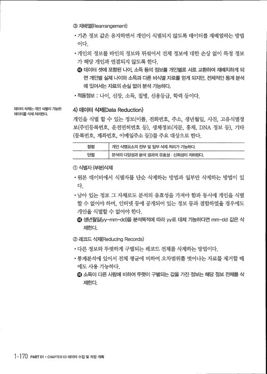
③ 재배열（Rearrangement)

- 기존 정보 값은 유지하면서 개인이 식별되지 않도록 데이터를 재배열하는 방법
이다．

- 개인의 정보를 타인의 정보와 뒤섞어서 전쳬 정보에 대한 손상 없이 특정 정보
가 해당 개인과 연결되지 않도록 한다． cIl 데이터 셋에 포함된 나이 , 소득 등의 정보를 개인별로 서로 교환하여 재배치하게 되 면 개인별 실제 나이와 소득과 다른 비식별 ．자료를 얻게 되지만 , 전체적인 통계 분석 에 있어서는 자료의 손실 없이 분석 가능하다．,

- 적용정보 : 나이 , 신장 , 소득 , 질병 , 신용등급 , 학력 등이다．
데이터 삭저ㅐ뜨 개인 식별이 가능한 데이터를 삭제 처리한다． 4) 데이터 삭제（Data Reduction) 개인을 식별 할수 있는 정보（이름 , 전화번호 , 주소 , 생년월일 , 사진 , 고유식별정

#### 보（추민등록번호 , 운전먼허번호 등） , 생쳬정보（지문 , 홍채 , DNA 정보 등） , 기타 
'。 -i번호 , 계좌번호 , 이메일주소등））를주요 대상으로 한다． 장점 개인 식별요소의 전부 및 일부 삭제 처리가 가능하다． 단점 분석의 다양성과 분석 결과의 유효성 · 신뢰성이 저하된다． ① 식별자 （부분）삭제

- 원본 데이터에서 식별자를 단순 삭제하는 방법과 일부만 삭제하는 방법이 있
다．

- 남아 있는 정보 그 자쳬로도 분적의 유효성을 가져야 함과 동시에 개인을 식별 
할수 없어야 하며 , 인터넷 등에 공개되어 있는 정보 등과 결합하였을 경우에도

#### 개인을 식별할 수 없어야 한다． 
.I 생년월일（yy-mm-dd）을 분석목적에 따라 yy로 대체 가능하다면 mm-dd 값은 삭 제한다． ② 레코드 삭제（Reducing Records)

- 다른 정보와 뚜렷하게 구별되는 레코드 전쳬를 삭제하는 방법이다．
- 통계분적에 있어서 전쳬 평균에 비하여 오차범위를 벗어나는 자료를 제거할 때
#### 에도 사용 가능하다． 
.l 소득이 다른 入隱쎄 비하여 뚜렷이 구별되는 값을 가진 정보는 해당 정보 전체를 삭 제한다． 1 -170 PART 01 . CHAPTER 03 더I이터수집 및저장계획 毓

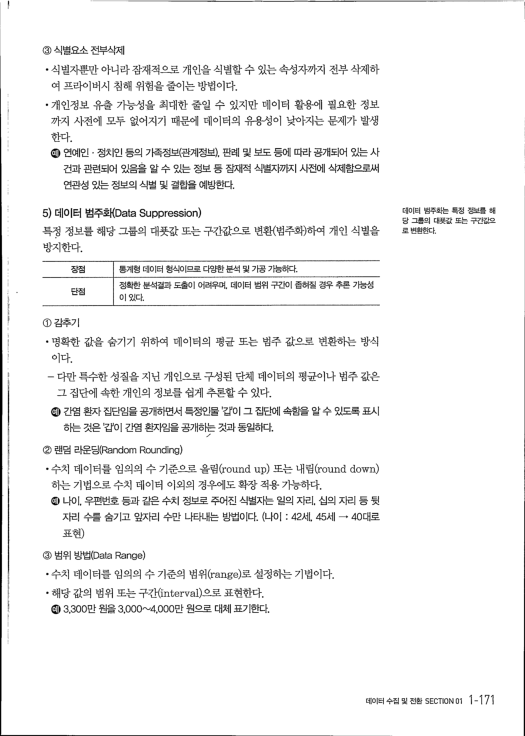
③ 식별요소 전부삭제

- 식별자뿐만 아니라 잠재적으로 개인을 식별할 수 있는 속정자까지 전부 삭제하
여 프라이버시 침해 위험을줄이는 방법이다．

- 개인정보 유출 가능성을 최대한 줄일 수 있지만 데이터 활용에 필요한 정보
까지 사전에 모두 없어지기 때문에 데이터의 유용정이 낮아지는 문제가 발생

#### 한다． 
.I 연예인 · 정치인 등의 가족정보（관계정보） , 판례 및 보도 등에 따라 공개되어 있는 사 건과 관련되어 있음을 알 수 있는 정보 등 잠재적 식별자까지 사전에 삭제함으로써 연관성 있는 정보의 식별 및 결합을 예방한다． 5) 데이터 범주화（Data Suppression) 특정 정보를 해당 그룹의 대푯값 또는 구간값으로 변환（범주화）하여 개인 식별을 방지한다． 장점 통계형 데이터 형식이므로 다양한 분석 및 가공 가능하다． 단점 정확한 분석결과 도출이 어려우며 . 데이터 범위 구간이 좁혀질 경우 추론 가능성 이 있다． ① 감추기

- 명확한 값을 숨기기 위하여 데이터의 평균 또는 범주 값으로 변환하는 방식
이다．

- 다만 특수한 성질을 지닌 개인으로 구성된 단쳬 데이터의 평균이나 범주 값은
그 집단에 속한 개인의 정보를 쉽게 추론할 수 있다．

#### .l 간염 환자 집단임을 공개하면서 특정인물 ' 갑이 그 집단에 속함을 알 수 있도록 표시
하는 것은 ' 갑이 간염 환자임을 공개하는 것과 동일하다． ② 랜덤 라운딩（Random Rounding)

- 수치 데이터를 임의의 수 기준으로 올림（round up) 또는 내림（round down)
하는 기법으로 수치 데이터 이외의 경우에도 확장 적용 가능하다． cl 나이 , 우편번호 등과 같은 수치 정보로 주어진 식별자는 일의 자리 . 십의 자리 등 뒷

#### 자리 수를 숨기고 앞자리 수만 나타내는 방법이다 . （나이 : 42세 , 45세 → 40대로
표현） ③ 범위 방법（Data Range)

- 수치 데이터를 임의의 수 기준의 범위（range）로 설정하는 기법이다．
- 해당 값의 범위 또는 구간（interval）으로 표현한다．
cll 3,300만 원을 3,000"-'4,000만 원으로 대체 표기한다．

> 데이터 범주화는 특정 정보를 해 
당 그룹의 대푯값 또는 구간값으 로 변환한다．

> 데이터수집및전환SECTION 01 1ㅢㄲ
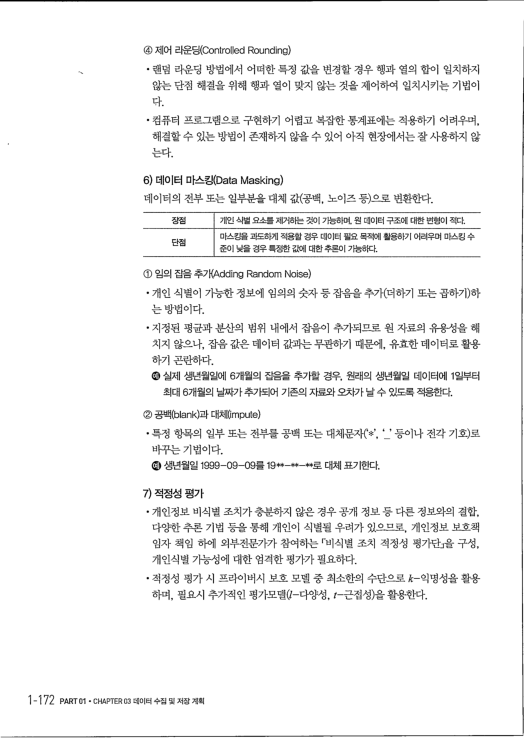
④ 제어 라운딩（Controlled Rounding)

- 랜덤 라운딩 방법에서 어떠한 특정 값을 변경할 경우 행과 열의 합이 일치하지
않는 단점 해결을 위해 행과 열이 맞지 않는 것을 제어하여 일치시키는 기법이 다．

- 컴퓨터 프로그램으로 구현하기 어렵고 복잡한 통계표에는 적용하기 어려우며，
해결할 수 있는 방법이 존재하지 않을 수 있어 아직 현장에서는 잘 사용하지 않 는다． 6) 데이터 마스킹（Data Masking) 데이터의 전부 또는 일부분을 대쳬 값（공백 , 노이즈 등）으로 변환한다． 장점 개인 식별 요소를 제거하는 것이 가능하며 , 원 데이터 구조에 대한 변형이 적다． 단점 마스킹을 과도하게 적용할 경우 데이터 필요 목적에 활용하기 어려우며 마스킹 수 준이 낮을 경우 특정한 값에 대한 추론이 가능하다． ① 임의 잡음 추가（Adding Random Noise)

- 개인 식별이 가능한 정보에 임의의 슷자 등 잡음을 추가（더하기 또는 곱하기）하 
는 방법이다．

- 지정된 평균과 분산의 범위 내에서 잡음이 추가되므로 원 자료의 유용정을 해
치지 않으나 , 잡음값은 데이터 값과는무관하기 때문에 , 유효한데이터로활용

#### 하기 곤란하다． 
.l 실제 생년월일에 6개월의 잡음을 추가할 경우， 원래의 생년뭘일 데이터에 1일부터 최대 6개월의 날짜가 추가되어 기존의 자료와 도차가 날 수 있도록 적용한다.

② 공백（blank）과 대체ㅇmpute)

- 특정 항목의 일부 또는 전부를 공백 또는 대쳬문자（'* ' , ' , 등이나 전각 기호）로
#### 바꾸는 기법이다． 
.l 생년월일 1999-09-09를 19**-**-*＊로 대체 표기한다， 7) 적정성 평가

- 개인정보 비식별 조치가 충분하지 않은 경우 공개 정보 등 다른 정보와의 결합，
다양한 추론 기법 등을 통해 개인이 식별될 우려가 요脾므로 , 개인정보 보호책 임자 책임 하에 외부전문가가 참여하는 「비식별 조치 적정성 평가단」을 구성， 개인식별 가능성에 대한 엄격한 평가가 필요하다．

- 적정성 평가 시 프라이버시 보호 모델 중 최소한의 수단으로 k－익명성을 활용
하며 , 필요시 추가적인 평가모델（/－다양성 , r－근접성）을활용한다． 1-172 PART01 . CHAPTER03 더l이터 수집 및 저장 계획

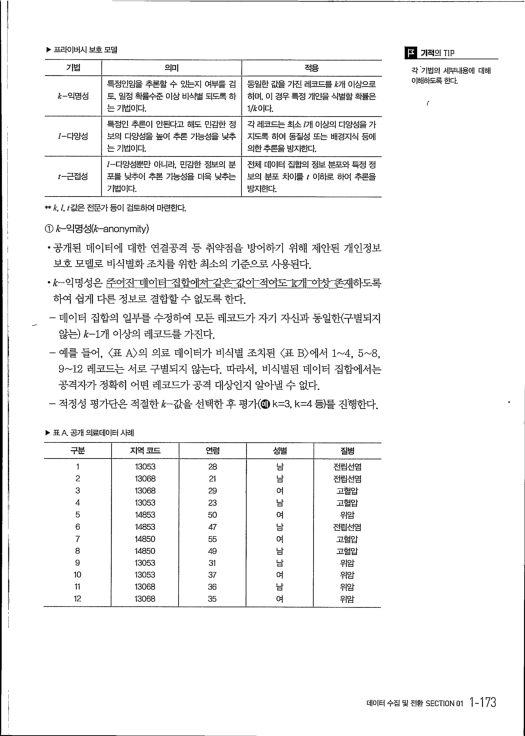
卜 프라이버시 보호 모델 기법 의미 적용 특정인임을 추론할 수 있는지 여부를 검 동일한 값을 가진 레코드를 k개 이상으로 k－익명성 토， 일정 확률수준 이상 비식별 되도록 하 는 기법이다． 하며 . 이 경우 특정 개인을 식별할 확률은 1/k이다． 특정인 추론이 안된다고 해도 민감한 정 각 레코드는 최소 ／개 이상의 다양성을 가 보의 다양성을 높여 추론 가능성을 낮추 는 기법이다． /－다양성 지도록 하여 동질성 또는 배경지식 등게 의한추론을 방지힌F.

/－다양성뿐만 아니라, 민감한 정보의 분 포를 낮추어 추론 가능성을 더욱 낮추는 전체 데이터 집합의 정보 분포와 특정 정 보의 분포 차이를 r 이하로 하여 추론을 방지힌F.

r－근접성 기법이다． ** *, / , ／값은 전문가 등이 검토하여 마련한다． ① k－익명성（k-anonymity)

- 공개된 데이터에 대한 연결공격 등 취약점을 방어하기 위해 제안된 개인정보 
보호 모델로 비식별화 조치를 위한 최소의 기준으로 사용된다． k－익명성은 준의코＝떼‘이터－칩합왜저－갇은－값이－적’어도－k개그〕칭E존Z∥．하도록 하여 쉽게 다른 정보로 결합할 수 없도록 한다．

- 데이터 집합의 일부를 수정하여 모든 레코드가 자기 자신과 동일한（구별되지
#### 않는） k-i개 이상의 레코드를 가진다．
- 예를 들어 , ＜표 A〉의 의료 데이터가 비식별 조치된 ＜표 B〉에서 i '- 4, 5'- 8,
#### 9---i2 레코드는 서로 구별되지 않는다 . 따라서 , 비식별된 데이터 집합에서는
공격자가 정확히 어떤 레코드가 공격 대상인지 알아낼 수 없다．

#### - 적정성 평가단은 적절한k－값을 선택한 후 평가（.I k=3, k=4 등l를 진행한다．
卜 표A . 공개 의료데이터 ㅅH 구분 지역 코드 연령 성별 질병 13053 전립선염 13068 13068 전립선염 남 여 고혈압 13053 고혈압 14853 위암 14853 전립선염 28 536373139455740532921 남 여 남 여 남 여 14850 고혈압 1 14850 198765432 。

11 12 고혈압 13053 위암 13053 위암 남 남 여 13068 위암 13068 위암

#### r헴 기적의 ㄲp
> 각 기법의 세부내용에 대해 
이해하도록힌빠．

> 데이터수집및전환SECTION0 i 1 -173
5 6 8

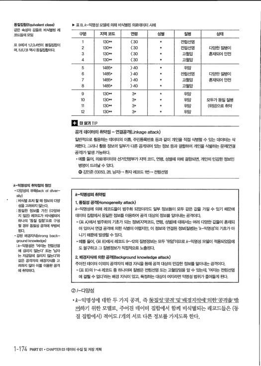
동질집합（Equivalent class)4 같은 속성자 값들로 비식별된 레 코드들의 모임

> 표 B. k－익명성 모델에 의해 비식별된 의료데이터 사례
구분 지역 코드 연령 성별 질병 상태 130** <30 <30 <30 <30 * 표 B에서 12.3.4번이 동질집합이 며 , 5.6.7.8 역시 동질집합이다． 130** 130** ，료 ，∼ 닢q 죠｀ 130** *** 1485*

>40 
>40 
>40 
>40
* 1485* 1485* 1485* *** 130** 3* 3* 3* 3* * 130** 9 101112 130** 130** *** 공개 데이터의 취약점 - 연결공격（Linkage attack) 일반적으로 횔용하는 데이터으I 이름, 주민등록번호 등과 같이 개인을 직접 식별할 수 있는 데이터는 삭 제한다 . 그러나 흴용 정보의 일부가 다른 공개되어 있는 정보 등과 결합하여 개인을 식별하는 문제（연결 공격）가 발생 가능하다．

- 예를 들어 . 의료데이터와 선거인명부가 지역 코드， 연령 , 성별에 의해 결합되면 , 개인의 민감한 정보인
병명이 드러날 수 있다． c[l 김민준 (13053. 田 . 남자）→ 환자 레코드 1번→ 전립선염 *－익명성의 취약점의 원인

- 다양성의 부족(tack of diver-
sity) : 비식별 조치 할 때 정보의 다양 성을 고려하지 않는다． ：동일한 정보를 가진 （다양하 지 않은） 레코드가 비식별되어 하나의 ' 동질 집합'으로 구성 될 경우 동질성 공격에 무방비 *－익명성의 취약점 1 . 동질성 공격伯omogeneity attack) k－익명성에 의해 레코드들이 범주화 되었더라도 일부 정보들이 모두 같은 값을 가질 수 있기 때둔께 데이터 집합에서 동일한 정보를 이용하여 공격 대상의 정보를 알아내는 공격이다．

- ＜표 A＞에서 범주화의 기초가 되는 정보（지역코드， 연령 , 성별）에 대해서는 여러 다양한 값들이 혼재되
어 있어서 연결 공격에 의한 식별이 어렵지만. 이 정보와 연결된 정보（질병）는 ' k－익명성 ' 의 기초가 아 된다．

- 강한 배경지식（strong back-
ground knowledge) :k－익명성은 ' 여자는 전립선염 에 걸리지 않는다’ 또는 ' 남자 는 자궁암어I 걸리지 않는다'와 같은 공격자의 배경지식을 고 려하지 않아 이를 이용한 공격 에 취약하다． 니기 때문에 발생할 수 있다．

- 예를 들어 . 〈표 B＞에서 레코드 9 '-'12의 질병정보는 모두 ' 위암’이므로 *－익명성 모델이 적용되었음에
됴크 篆【하고 그 질병정보가 직접적으로 노출된다．

2. 배경지식에 의한 공격（Background knowledge attack)
주어진 데이터 이외의 공격자의 배경 지식을 통해 공격 대상의 민감한 젓보를 알아내는 공격이다．

- 〈표 B〉의 1-'-4 레코드 중 하나이며 질병은 전립선염 또는 고혈압임을 알 수 있는데 , ' 여자는 전립선염
에 걸릴 수 딥〕［다'라는 배경 지식이 있．」긔 특정하는 대상이 여자라면 익명성 범위가 줄어들게 된다． ② /－다양성

#### 야－익명성에 대한 두 가지 공격 , 즉 돔：질정ㅍ공：격ㅍ및E봬경지착에뾔한E표겪읕뼁1 
u하기 위한 모델로 , 주어진 데이터 집합에서 함께 비식별되는 레코드들은 （동 질 집합에서） 적어도 ／개의 서로 다른 정보를 가지도록 한다． 1-174 PART01 . CHAPTER03 데이터수집 및저장계획

> 전립선염
> 전립선염
> 다양한질병이
> 고혈압
> 혼재되어 안전
> 고혈압
> 위암
> 전립선염
> 다양한 질병이
> 고혈압
> 혼재되어 안전
> 고혈압
> 위암
> 모두가 동일 질병
> 위암
> （위암）으로 취약
> 위암
> 위암
)

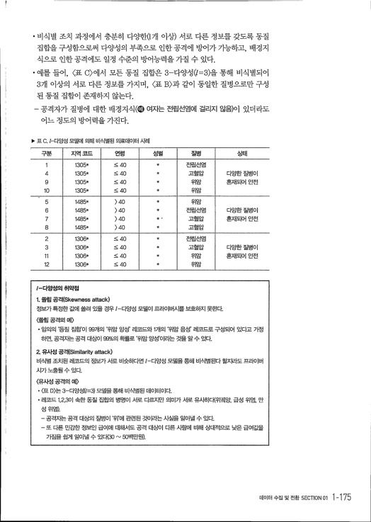
- 비식별 조치 과정에서 충분히 다양한（1개 이상） 서로 다른 정보를 갖도록 동질
집합을 구성함으로써 다양성의 부족으로 인한 공격에 방어가 가능하고 , 배경지 식으로 인한 공격에도 일정 수준의 방어능력을 가질 수 있다．

- 예를 들어 , ＜표 C〉에서 모든 동질 집합은 3－다양성（1=3）을 통해 비식별되어
3개 이상의 서로 다른 정보를 가지며 , ＜표 B〉과 같이 동일한 질병으로만 구성 된 동질 집합이 존재하지 않는다．

- 공격자가 질병에 대힌r 배경지식（0 여자는 전립선염에 걸리지 않음）이 있더라도
어느 정도의 방어력을 가진다．

> 표 C. 1－다양성 모델에 의해 비식별된 의료데이터 ㅅ뻬
구분 지역 코드 연령 성별 질병 상태 1305* `40 二40 드40 드40 전립선염 * 1 고혈압 다양한 질병이 1305* 1305* 위암 혼재되어 안전 위암 1305* *** 194。

, 1485* 위암

>40 
>40 
>40 
>40
전립선염 1485* 다양한 질병이 * 5 876 고혈압 혼재되어 안전 1485* *紛* 고혈압 1485* 전립선염 1306* * 2 13 1306* 1306* 고혈압 다양한 질병이 明 40404。

<<드< 위암 혼재되어 안전 211 위암 1306* *** /－다양성의 취약점 1 , 쏠림 공격（Skewness attack) 정보가 특정한 값에 쓸려 있을 경우 z－다양성 모델이 프라이버시를 보호하지 못한다． 〈쏠림 공격의 예〉

- 임의의 ' 동질 집합'이 99개의 ' 위암 양성 ' 레코드와 1개의 ' 위암 음성 ' 레코드로 구성되어 있다고 가정
하면 , 공격자는 공격 대상이 99%의 확률로 ' 위암 양성’이라는 것을 알 수 있다． ,.  .a 11따성 공격（Similarity attack) 비식별 조치된 레코드의 정보가 서로 비슷하다면 /－다양성 모델을 통해 비식별된다 할지라도 프라이버 시가노罷 수 있다． 〈유사성 공격의 예＞

- ＜표 0〉는 3－다양성（1=3) 모델을 통해 비식별된 데이터이다．
- 레코드 1,2,3이 속한 동질 집합의 병명이 서로 다르지만 의미가 서로 유사하다（위궤양 , 급성 위염 , 만
성 위염）.

- 공격자는 공격 대상의 질병이 ' 위 ' 에 괸련된 것이라는 사실을 알아낼 수 있다.
- 또 다른 민감한 정보인 급여에 대해서도 공격 대상이 다른 사람에 비해 상대적으로 낮은 급여값을
가짐을 쉽게 알아낼 수 있다（30 "50백만원）.

> 데이터수집및전환SECTION01 1-175
89

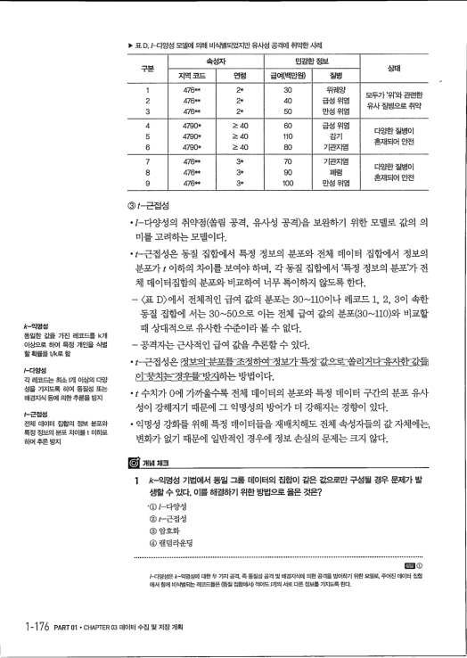
> 표 D. !－다양성 모델에 의해 비식별되었지만 유사성 공격에 취약한 ㅅH
구분 속성자 민감한 정보 싱ㅌㅐ 지역코드 연령 급여（백만원） 질병 476** 2* 2* 2* 30 40 50 1 2 3 4761* 476** 60 4 4790* 4790* 4790* 全40 죠40 上40 110 80 56 3* 3* 3* 790 。10。

기관지염 476** 476** 476** ③ /－근접성

#### 나－다양성의 취약점（쏠림 공격 , 유사성 공격）을 보완하기 위한 모델로 값의 의
미를 고려하는 모델이다． 나－근접성은 동질 집합에서 특정 정보의 분포와 전쳬 데이터 집합에서 정보의

#### 분포가 t 이하의 차이를 보여야 하며 , 각동질 집합에서 ' 특정 정보의 분포'가 전
쳬 데이터집합의 분포와 비교하여 너무 특이하지 않도록 한다．

- 〈표 D〉에서 전쳬적인 급여 값의 분포는 30'--'ll0이나 레코드 1, 2, 3이 속한
동질 집합에 서는 30--'50으로 이는 전쳬 급여 값의 분포（30-410）와 비교할 때 상대적으로 유사한 수준이라 볼 수 없다． *－익명성 동일한 값을 가진 레코드를 k개

- 공격자는 근사적 인 급여 값을 추론할 수 있다 .
이상으로 하여 특정 개인을 식별 할 확률을 1기｀로 함 나－근접성은 簾보의’부포F랗조젓하여－젓보가＝특정＝값으로쏠리커다-n카昏t값들 /－다양성 각 레코드는 최소 pㅐ 이상의 다양 성을 가지도록 하여 동질성 또는 餃웃최는E경主를E빙：최하는 방법이다 .

나 수치가 0에 가까울수록 전쳬 데이터의 분포와 특정 데이터 구간의 분포 유사 배경지식 등게 의한추론을 방지 성이 강해지기 때문에 그 익명성의 방어가 더 강해지는 경향이 있다． '－근접성

- 익명성 강화를 위해 특정 데이터들을 재배치해도 전쳬 속정자들의 값 자쳬에는 ,
전체 데이터 집합의 정보 분포와 특정 정보의 분포 차이를 t 이하로 변화가 없기 때문에 일반적인 경우에 정보 손실의 문제는 크지 않다． 하여 추론 방지 1 k－익명성 기법에서 동일 그룹 데이터의 집합이 같은 값으로만 구성될 경우 문제가 발 생할 수 o［다 . 이를 해결하기 위한 방법으로 옳은 것은？ " ① /－다양성 ② t－근접성 ③ 암호화 ④ 랜덤라운딩 /－다양성은 *－익영성에 대한두 가지 공격 . 즉 동질성 공격 및 배경지식에 의한 공격을 방어하기 위한 모델로， 주어진 데이터 집합 에서 함께 비식별되논 레코드똘은 （뒀그 집합에서） 적어도／개의 서로 다른 정보를 가지도록 한다． 1-176 PART01 · CHAPTER03 데이터수집 및저장계획

> 위궤양
> 모두가 ' 위'와관련한
> 급성 위염
> 유사 질병으로 취약
> 만성 위염
> 급성 위염
> 다양한질병이
> 감기
> 혼재되어 안전
> 기관지염
> 다양한 질병이
> 폐렴
> 혼재되어 안전
> 만성 위염
> El
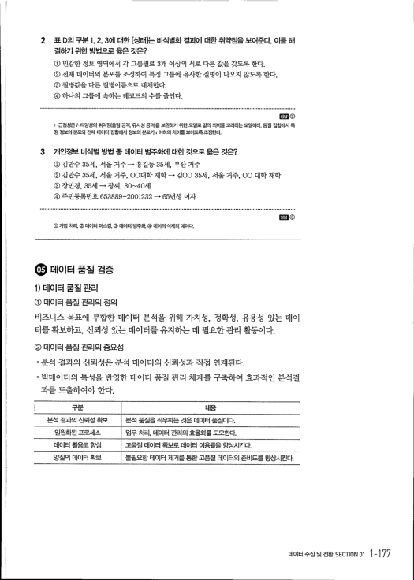
2 표D의 구분1, 2, 3에 대한［상태］는 비식별화결과에 대한취약점을보여준다 . 이를해 결하기 위한 방법으로 옳은 것은？ ① 민감한 정보 영역에서 각 그룹별로 3개 이상의 서로 다른 값을 갖도록 한다． ② 전쳬 데이터의 분포를 조정하여 특정 그룹에 유사한 질병이 나오지 않도록 한다． ③ 질병값을 다른 질병이름으로 대쳬한다． ④ 하나의 그룹에 속하는 레코드의 수를 줄인다． '－근접성은 /－다양성의 취약점（쏠림 공격 , 유사성 공격）을 보완하기 위한모델로 값의 의미를 고려하늰모델이다 . 동질 집합에서 특 정 정보의 분쪼와 전체 데이터 집합에서 정보의 분포가 r 이하의 차이를 보이도록조정한다． 3 개인정보 비식별 방법 중 데이터 범주화에 대한 것으로 옳은 것은？ ① 김만수 35세 , 서울 거주→ 홍길동 35세 , 부산 거주 ② 김만수 35세 , 서울 거주 , 00대학재학→ 김○035세 , 서울 거주 , 00 대학 재학 ③장민경 , 35세 →장씨 , 30'-40세 ④ 주민등록번호 653889-2001232 -. 65년생 여자 ① 가명 처리 . ② 데이터 마스킹 , ③ 데이터 범주화, ④ 데이터 삭제의 예이다． .

데이터 품질 검증 1) 데이터 풉질 관리 ① 데이터 품질 관리의 정의

#### 비즈니스 목표에 부합한 데이터 분석을 위해 가치성 , 정확성 , 유용성 있는 데이 
터를 확보하고 , 신뢰성 있는 데이터를 유지하는 데 필요한 관리 활동이다． ② 데이터 품질 관리의 중요성

- 분석 결과의 신뢰성은 분석 데이터의 신뢰성과 직접 연계된다．
- 빅데이터의 특정을 반영한 데이터 품질 관리 쳬계를 구축하여 효과적인 분적결
과를도출하여야한다． l 구분 내용 분석 결과의 신뢰성 확보 분석 품질을 좌우하는 것은 데이터 품질이다． 일원화된 프로세스 업무 처리 . 데이터 관리의 효율화를 도모한다． 데이터 횔용도 향상 고품질 데이터 확보로 데이터 이용률을 향상시킨다． 양질의 데이터 확보 불필요한 데이터 제거를 통한 고품질 데이터의 준비도를 향상시킨다．

> 腿珊②
> ＂레③
> 데이터수집및전환SECTION01 1-177
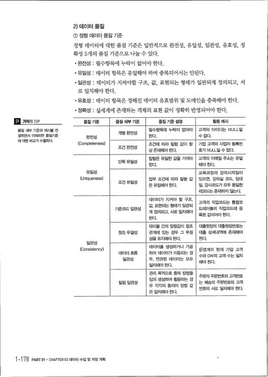
2) 데이터 품질 ① 정형 데이터 품질 기준

#### 정형 데이터에 대한품질 기준은 일반적으로완전성 , 유일성 , 일관성 , 유효성 , 정
확성 5개의 품질 기준으로 나눌 수 있다．

#### · 완전성 : 필수항목에 누락이 없어야 한다．
#### · 유일성 : 데이터 항목은 유일해야 하며 중복되어서는 안된다．
#### · 일관성 : 데이터가 지켜야할 구조 , 값 , 표현되는 형태가 일관되게 정의되고 , 서
로 일치해야 한다．

#### · 유효성 : 데이터 항목은 정해진 데이터 유효범위 및 도메인을 충족해야 한다．
#### · 정확성 : 실세계에 존재하는 객쳬의 표현 값이 정확히 반영되어야 한다．
### r철 기적의 TIP
품질 기준 품질 세부 기준 품질 기준 설명 활용 예시 개별 완전성 필수항목에 누락이 없어야 품질 세부 기준과 예시를 연 결하연서 이해하면 품질기준 에 대한 비교가 수월하다． 한다． 완전성 (Completeness) 조건 완전성 조건에 따라 칼럼 값이 항 상존재해야한다． 단독 유일성 칼럼은 유일한 값을 가져야 한다． 유일성 (Uniqueness) 조건 유일성 업무 조건에 따라 칼럼 값 은 유일해야 한다． 데이터가 지켜야 할 구조， 값， 표현되는 형태가 일관되 기준코드 일관성 게 정의되고， 서로 일치해야 한다． 테이블 간의 칼럼값이 참조 관계에 있는 경우 그 무결 참조무결성 성을 유지해야 한다． 일관성 데이터를 생성하거나 가공 (Consistency) 데이터 흐름 하여 데이터가 이동되는 경 우 , 연관된 데이터는 모두 일관성 일치해야 한다． 관리 목적으로 중복 칼럼을 임의 생성하여 횔용하는 경 우 각각의 동의어 칼럼 값 은 일치해야 한다． 칼럼 일관성 1-178 PART01 * CHAPTER03데이터수집 및저장계획 `

> 고객의 아이디는 NULL일 
수 없다．

> 기업 고객의 사업자 등록번
> 호가 NULL일 수 없다．
> 고객의 이메일 주소는 유일
> 해야한다．
> 교육과정의 강의시작일이
> 있으면 , 강의실 코드 , 임대
> 일 , 강사코드가모두동일한
> 레코드는 존재하지 않는다．
> 고객의 직업코드는 통합코
> 드테이블의 직업코드에 등
> 록된 값이어야 한다．
> 대출원장의 대출원장번호는
> 대출 상세내역에 존재해야
> 한다．
> 운영계의 헌재 가입 고객
> 수와 DW의 고객 수는 일치
> 해야 힌다．
> 주문의 주문븐트와 고객번호
> 는 배송의 주문번호와 고객
> 번호와 ㅅ湟 일치해먀 힌다．
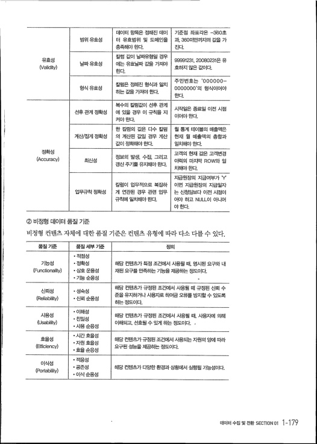
기준점 좌표각은 -360초 과, 360미만까지의 값을 가 데이터 항목은 정해진 데이 범위 유효셩 터 유효범위 0[ 도메인을 충족해야 한다． 진다． 칼렁 값이 날짜유형일 경우 유효성

99991231. 20080231은유
날짜유효성 에는 유효날짜 값을 가져야 효하지 않은 값이다． (Validity) 한다． 주민번호는 ' 000000- 0000000 ' 으l 형식이어야 형식 유효성 칼럼은 정해진 형식과 일치 하는 값을 가져야 한다． 한다． 복수의 칼럼값이 선후 관계 에 있을 경우 이 규칙을 지 시작일은 종료일 이전 시점 선후 관계 정확성 이어야 한다． 켜야 한다． 계산／집계 정확성 한 칼럼의 값은 다수 칼럼 의 계산된 값일 경우 계산 월 통계 테이블의 매출액은 현재 월 매출액의 총합과 값이 정확해야 한다． 일치해야 한다． 정확성 고객의 현재 값은 고객변경 최신성 정보의 발생 , 수집 , 그리고 (Accuracy) 이력의 마지막 ROW와 일 갱신 주기를 유지해야 한다． 치해야한다． 지급원장의 지급여부가 ' Y~ 이면 지급원장의 지급일자 는 신청일보다 이전 시점이 칼럼이 업무적으로 복잡하 업무규칙 정확성 7ㅔ 연관된 경우 관련 업무 규칙에 일치해야 힌다． 어야 하고 NULL이 아니어 야 한다． ② 비정형 데이터 품질 기준 비정형 컨텐츠 자쳬에 대한 품질 기준은 컨텐츠 유형에 따라 다소 다를 수 있다． 품질 기준 품질 세부 기준 정의

- 적절성 
- 정확성 
- 상호 운욤성 
- 기능 순응성
기능성 해당 컨텐츠가 특정 조건에서 사용될 때 , 명시된 요구와 내 재된 요구를 만족하는 기능을 제공하는 정도이다． (Functionality) 해당 컨텐츠가 규정된 조건에서 사용될 때 규정된 신뢰 수 준을 유지하거나 사용차로 하여금 오류를 방지할 수 있도록 신뢰성

- 성숙성
- 신뢰 순응성
(Reliability) ㅎㅐ굿 정도이다．

- 이해성 
- 친밀성 
- )隱 순응성
사용성 해당 컨텐츠가 규정된 조건에서 사용될 때 . 사용자에 의해 이해되고 선호될 수 있게 하는 정도이다． (Usability) ■시간 효율성

- 자원 효율성 
- 효율 순응셩
효율성 해당 컨텐츠가 규정된 조건에서 사용되는 자원의 양에 따라 요구된 성능을 저隧一하는 정도이다． (Efficiency)

- 즈듣성 
- 공존셩
이식싱 해당 컨텐츠가 다양한 환경과 상황에서 실행될 가능성이다． (Portability)

- 이식 순응성
> 데이터수집및전환SECTION 01 1-179
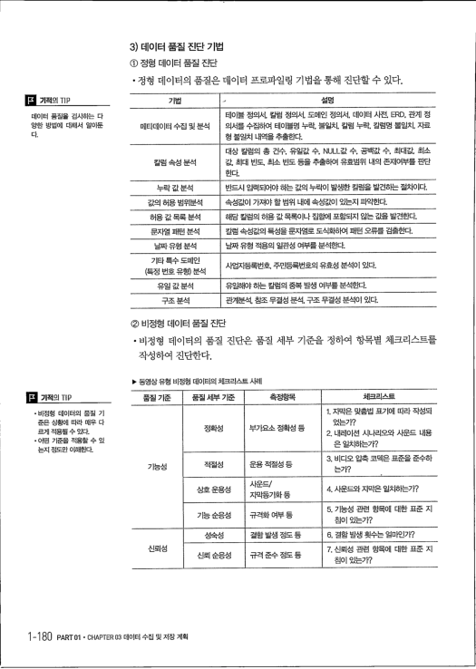
3) 데이터 품질 진단 기법 ① 정형 데이터 품질 진단

- 정형 데이터의 품질은 데이터 프로파일링 기법을 통해 진단할 수 있다．
.

기적의 ㄲp 기법 설명 테이블 정의서 , 칼럼 정의서 , 도메인 정의서 . 데이터 사전 . ERD . 관계 정 데이터 품질을 검사하는 다 양한 방법에 대해서 알아둔 의서를 수집하여 테이블명 누락 , 불일치 , 칼럼 누락 , 칼럼명 불일치 . 차료 메타데이터 수집 및 분석 다． 형 불일치 내역을 추출힌다． 대상 칼럼의 총 건수, 유일값 수, NULL값 수， 공백값 수 , 최대값, 최소 값, 최대 빈도 최소 빈도 등을 추출하여 유효범위 내의 존재여부를 판단 떪 속셩 분석 한다． 누락값분석 반드시 입력되어야 하는 값의 누락이 발생한 칼럼을 발견하는 절차이다． 값의 허용 범위분석 속성값이 가져야 할 범위 내에 속성값이 있는지 파악힌다． 허용 값 목록 분석 해당 離I의 허용 값 목록이나 집합에 포함되지 않는 값을 발견한다． 문자열 패턴 분석 칼럼 속성값의 특성을 문자열로 도식화하여 패턴 오류를 검출한다． 날짜 유형 분석 날짜 유형 적용의 일관성 여부를 분석힌다． 기타특수도메인 （특정 번호 유형） 분석 사업자묶I번호， 주민등록번호의 유효성 분석이 있다． 유일 값 분석 유일해야 하는 칼럼의 중복 발생 여부를 분석한다． 구조분석 관계분석 . 참조무결성 분석 , 구조무결성 분석이 있다． ② 비정형 데이터 품질 진단

- 비정형 데이터의 품질 진단은 품질 세부 기준을 정하여 항목별 쳬크리스트를
작성하여 진단한다．

> 동영상 유형 비정형 데이터의 처匡리스트 사례
품질 기준 품질 세부 기준 측정항목 체크리스트 .

기적의 ㄲp

- 비정형 데이터의 품질 기 
준은 상황에 따라 매우 다 르게 적용될 수 있다．

- 어떤 기준을 적용할 수 있 
는지 정도만 이해한다． 정확성 부가요소 정확성 등 적절성 운용 적절성 등 3 . 비디오압축코덱은표준을 하 기능성 상호운용성 사운드／ 자막동기화등 4 . 사운드와 자막은 일치하는가？ 기능순응성 규격화 여부 등 5 . 기능성 관련 항목에 대한 표준 지 성숙셩 결함 발생 정도 등 6 . 결함 발생 횟수는 얼마인가？ 신뢰성 신뢰 순응성 규격 준수 정도 등 7 . 신뢰성 관련 항목에 대한 표준 지 1-180 PART01 · CHAPTER03 데이터수집 및저장계획

> 1 . 자막은 맞춤법 표기에 따라 작성되
> 었는가？ 
2 . 내레이션 시나리오와 사운드 내용

> 은 일치하는가？
> 는가？
> 침이 있는가？
> 침이 있는가？
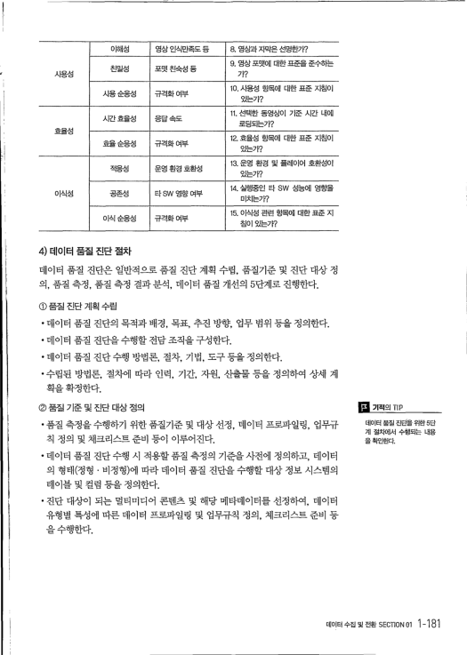
이해성 영상 인식만족도 등 8 . 영상과자막은선명한가？ 친밀성 포맷 친숙셩 등 9 . 영상포맷0체 대한표준을 斟느하는 사용성 가？ A隱순응성 규격화 여부 10 . 사용성 항목에 대한 표준 지침이 있는가？ 시간효율성 응답속도 11 . 선택한 동영상0I 기준 시간 내에 로딩되는가？ 효율셩 효율순응성 규격화 여부 12 . 효율성 항목에 대한 표준 지침이 있는가？ 적응성 운영 환경 호환성 13 . 운영 환경 및 플레이어 호환성이 있는가？ 공존성 타 SW 영향 여부 14 . 실행중인 타 SW 성능에 영향을 이식성 미치는가？ 이식 순응성 규격화 여부 15 . 이식성 관련 항목에 대한 표준 지 침이 있는가？ 4) 데이터 품질 진단 절차

#### 데이터 품질 진단은 일반적으로 품질 진단 계획 수립 , 품질기준 및 진단 대상 정
#### 의 , 품질 측정 , 품질 측정 결과분석 , 데이터 품질 개선의 5단계로 진행한다．
① 품질 진단 계획 수립

#### · 데이터 품질 진단의 목적과 배경 , 목표 , 추진 방향 , 업무 범위 등을 정의한다．
- 데이터 품질 진단을 수행할 전담 조직을 구성한다．
#### · 데이터 품질 진단수행 방법론 , 절차 , 기법 , 도구등을정의한다．
#### ·수립된 방법론 , 절차에 따라 인력 , 기간 , 자원 , 산출물 등을 정의하여 상세 계
획을 확정한다． ②품칠 기준 및 진단 대상 정의

#### · 품질 측정을수행하기 위한품질기준 및 대상 선정 , 데이터 프로파일링 , 업무규
칙 정의 및 쳬크리스트 준비 등이 이루어진다 .

#### · 데이터 품질 진단 수행 시 적용할 품질 측정의 기준을 사전에 정의하고 , 데이터
#### 의 형태（정형 · 비정형）에 따라 데이터 품질 진단을 수행할 대상 정보 시스템의
데이블 및 컬럼 등을 정의한다．

#### · 진단 대상이 되는 멀티미디어 콘텐츠 및 해당 메타데이터를 선정하여 , 데이터
#### 유형별 특성에 따른 데이터 프로파일링 및 업무규칙 정의 , 쳬크리스트 준비 등
을수행한다．

> .
기적의 ㄲp

> 데이터 품질 진단을 위한 5단 
계 절차에서 수행되는 내용 을확인흰빠．

> 데이터수집및전환SECTION01 1-181
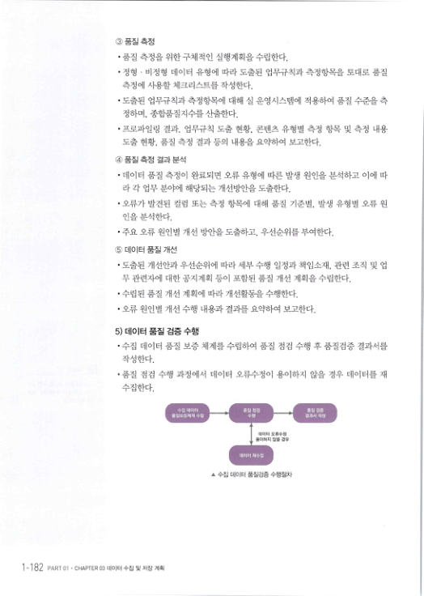
③ 품질 측정

- 품질 측정을 위한 구쳬적인 실행계획을 수립한다．
- 정형 · 비정형 데이터 유형에 따라 도출된 업무규칙과 측정항목을 토대로 품질
측정에 사용할 쳬크리스트를 작성한다．

- 도출된 업무규칙과 측정항목에 대해 실 운영시스템에 적용하여 품질 수준을 측
정하며 , 종합품질지수를산출한다．

- 프로파일링 결과 , 업위구칙 도출 현황 , 콘텐츠 유형별 측정 항목 및 측정 내용
도출 현황 , 품질 측정 결과 등의 내용을 요약하여 보고한다． ④ 품질 측정 결과분석

- 데이터 품질 측정이 완료되면 오류 유형에 따른 발생 원인을 분석하고 이에 따
라 각 업무 분야에 해당되는 개선방안을 도출한다．

- 오류가 발견된 컬럼 또는 측정 항목에 대해 품질 기준별 , 발생 유형별 오류 원
인을 분석한다．

- 주요 오류 원인별 7財크 방안을 도출하고 , 우선순위를 부여한다．
⑤ 데이터 품질 개선

- 도출된 개선안과 우선순위에 따라 세부 수행 일정과 책임소재 , 관련 조직 및 업
무 관련자에 대한 공지계획 등이 포함퇸 품질 개선 계획을 수립한다．

- 수립된 품질 개선 계획에 따라 개선활동을 수행한다 .
- 오류 원인별 개선 수행 내용과 결과를 요약하여 보고한다．
5) 데이터 품질 검증 수행

- 수집 데이터 품질 보증 체계를 수립하여 품질 점검 수행 후 품질검증 결과서를
작성한다．

- 품질 점검 수행 과정에서 데이터 오류수정이 용이하지 않을 경우 데이터를 재
수집한다． 수집 데이터 품질 섬검 품질 검증 품질보승체계 수립 수헴 결과서 작성 데이터 오류수정 용이하지 않을 경우 데이터 재수집 ▲ 수집 데이터 품질검증 수행절차 1-182 PART01 . CHAPTER03 데이터수집 및저장계획

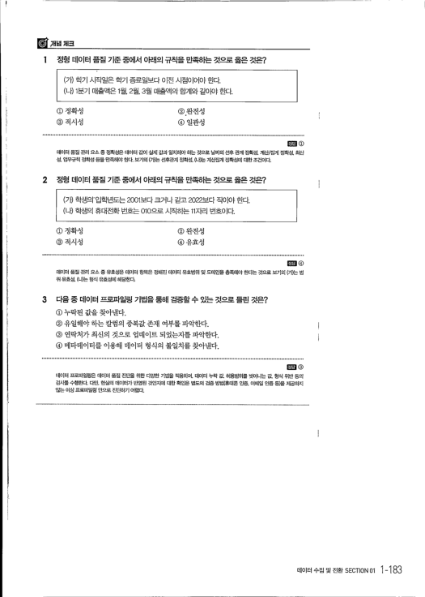
1 정형 데이터 품질 기준중에서 아래의 구칙을 만족하는 것으로옳은 것은？ （가） 학기 시작일은 학기 종료일보다 이전 시점이어야 한다． （나） 1분기 매출액은 1월 , 2월 . 3월 매출액와 합계와 길아야 한다． ① 정확성 ② 완전성 ③ 적시성 ④ 일관성 데이터 품질 관리 요소 중 정확성은 데이터 값이 실제 값과 일치해야 하는 것으로 날짜의 스埠 관계 정확성 . 계산／집계 정확성 , 최신 성 . 업득1구칙 정확성 등을 만족해야 한다. 보기의 《가）는 선후관계 정확성 . （나X三 계산집계 정확성에 대한조건이다． 2 정형 데이터 품질 기준 중에서 0脾ㅐ의 규칙을 만족하는 것으로 옳은 것은？ （가） 학생와입학년도는 20이보다 크거나 겉보 2022보다 직아야 한다． （나） 학생의 휴대전화 번호는 010으로 시작하는 11자리 번호이다． ② 완전성 ① 정확성 ④ 유효성 ③ 적시성 데이터 품질 관리 요소 중 유효성은 데이터 항목은 청해진 데이터 유효범위 및 도메인을 충족해야 한다는 것으로 보기의 （가）는 범 위 유효성 . （나）는 형식 유효성에 해당한다‘ 3 다음 중 데이터 騙l파일링 기법을 통해 검증할 수 있는 것으로 틀린 것은？ ① 누락된 값을 찾아낸다． ② 유일해야 하는 칼럼의 중복값 존재 여부를 파악한다． ③ 연락처가 최신의 것으로 업데이트 되었는지를 파악한다． ④ 메타데이터를 이용해 데이터 형식의 불일치를 찾아낸다． 데이터 프로파일링은 데이터 품질 진단을 위한 다앙한 기법을 적용하며 , 데이터 누락 값． 허용범위를 벗어나는 값． 형식 위반 등의 검사를 수행흰b각． 다만． 현실의 데이터가 반영된 것인지에 대한 확인은 별도의 검증 방법（휴대폰 인중. 이메일 인증 등）울 처居하지 않는 이상프로파일링 만으로 진단하기 어렵다．

> D ①
> 驪래 ④
> -
> ㅁ醜③
> -
> 데이터수집및전환SECTION01 1-183
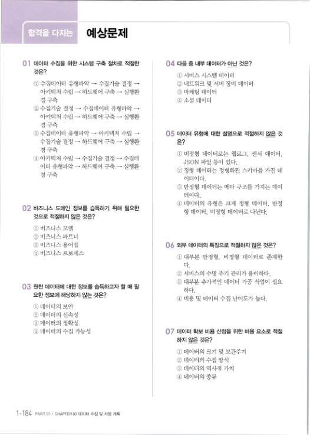
## 예상문제
01 데이터 수집을 위한 시스템 구축 절차로 적절한 04 다음 중 내부 데이터가 아닌 것은？ 것은？ ① 서비스 시스템 데이터 ② 네트워크 및 서버 장비 데이터 ③마케팅 데이터 ④ 소셜 데이터

#### ① 수집데이터 유형파악 －→ 수집기술 결정 → 
아키텍처 수립 → 하드웨어 구축 → 실행환

#### 경 구축 
② 수집기술 결정 → 수집데이터 유형파악 → 아키텍처 수립 → 하드웨어 구축 - 실행환 경구축 ③ 수집데이터 유형파악 → 아키텍처 수립 → 수집기술 결정 → 하드웨어 구축 → 실행환 경 구축 ④ 아키텍처 수립 → 수집기술 결정 → 수집데 이터 유형파악 → 하드웨어 구축 → 실행환 05 데이터 유형에 대한 설명으로 적절하지 않은 것 은？ ①비정형 데이터로는 웹로그 , 센서 데이터， JSON 파일 등이 있다． ② 정형 데이터는 정형화된 스키마를 가진 데 경 구축 이터이다． ③ 반정형 데이터는 메타 구조를 가지는 데이 터이다． ④데이터의 유형은 크게 정형 데이터 , 반정 02 비즈니스 도메인 정보를 습득하기 위해 필요한 형 데이터 , 비정형 데이터로 나뉜다． 것으로 적절하지 않은 것은？ ① 비즈니스 모델 ② 비즈니스 파트너 ③ 비즈니스 용어집 ④ 비즈니스 프로세스 06 외부 데이터의 특징으로 적절하지 않은 것은？ ①대부분 반정형 , 비정형 데이터로 존재한 다． ② 서비스의 수명 주기 관리가 용이하다． ③ 대부분 추가적인 데이터 가공 작업이 필요 03 원천 데이터에 대한 정보를 습득하고차 할 때 필 요한 정보에 해당하지 않는 것은？ 하다． ④ 비용 및 데이터 수집 난이도가 높다． ① 데이터의 보안 ② 데이터의 신속성 ③ 데이터의 정확성 ④ 데이터의 수집 가능성 07 데이터 확보 비용 산정을 위한 비용 요소로 적절 하지 않은 것은？ ① 데이터의 크기 및 보관주기 ② 데이터의 수집 방식 ③ 데이터의 역사적 가치 ④ 데이터의 종류 1 -184 PART 01 . CHAPTER 03 데이터 수집 및 저장계획

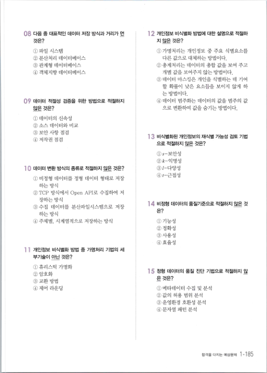
J驕 다음 중 대표적인 데이터 저장 방식과 거리가 먼 1 2 개인정보 비식별화 방법에 대한 설명으로 적절하 것은？ 지 않은 것은？ ① 가명처리는 개인정보 중 주요 식별요소를 ① 파일 시스템 다른 값으로 대쳬하는 방법이다． ② 총계처리는 데이터의 총합 값을 보여 주고 개별 값을 보여주지 않는 방법이다． ③ 데이터 마스킹은 개인을 식별하는 데 기여 할 확률이 낮은 요소들을 보이지 않게 하 는 방법이다． ④ 데이터 범주화는 데이터의 값을 범주의 값 으로 변환하여 값을 숨기는 방법이다． ②분산처리 데이터베이스 ③관계형 데이터베이스 ④ 객쳬지향 데이터베이스 09 데이터 적절성 검증을 위한 방법으로 적절하지 않은 것은？ ① 데이터의 신속성 ② 소스 데이터와 비교 ③ 보안 사항 점검 ④ 저작권 점검 13 비식별화된 개인정보의 재식별 가능성 검토 기법 으로 적절하지 않은 것은？ (1)S－보안성 ②＊－익명성 ③ /－다양성 ④r－근접성 10 데이터 변환 방식의 종류로 적절하지 않은 것은？ ① 비정형 데이터를 정형 데이터 형태로 저장 하는 방식 ② TCP 방식에서 Open API로 수집하여 저 장하는 방식 ③수집 데이터를 분산파일시스템으로 저장 튑 'i 비정형 데이터의 품질기준으로 적절하지 않은 것 은？ 하는 방식 ④주제별 , 시계열적으로 저장하는방식 ① 기능성 ② 정확성 ③ 사용성 ④효율성 개인정보 비식별화 방법 중 가명처리 기법의 세 부기술이 아닌 것은？ ① 휴리스틱 가명화 ② 암호화 ③ 교환 방법 ④ 제어 라운딩 i F 정형 데이터의 품질 진단 기법으로 적절하지 않 은 것은？ ① 메타데이터 수집 및 분석 ② 값의 허용 범위 분석 ③ 운영환경 호환성 분석 ④ 문자열 패턴 분석

> 합격을다지는예상문제 1-185
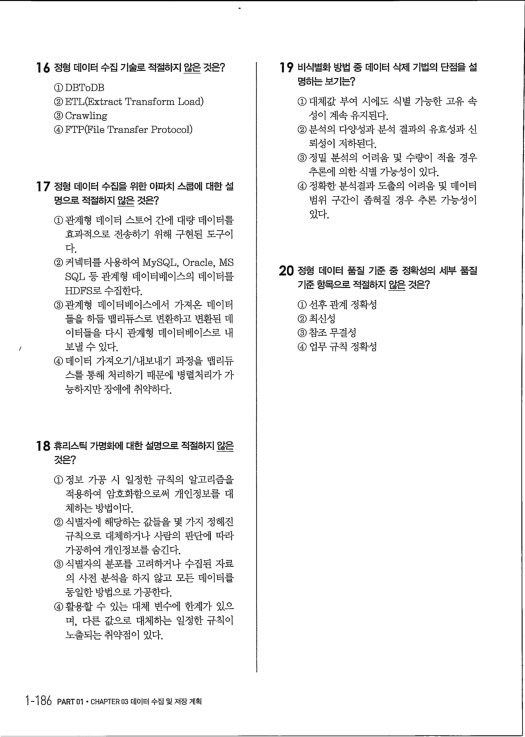
#### 1 9 비식별화 방법 중 데이터 삭제 기법의 단점을 설
1 6 정형 데이터 수집 기술로 적절하지 않은 것은？ 명하는 보기는？ ① DBToDB ② ETL(Extract Transform Load) ③ Crawling ④ FTP(File Transfer Protocol) ① 대쳬값 부여 시에도 식별 가능한 고유 속 성이 계속 유지된다． ② 분석의 다양성과 분석 결과의 유효성과 신 뢰성이 저하된다． ③정밀 분섞의 어려움 및 수량이 적을 경우 추론에 의한 식별 가능성이 있다． ④ 정확한 분석결과 도출의 어려움 및 데이터 범위 구간이 좁혀질 경우 추론 가능성이 17 정형 데이터 수집을 위한 아파치 스쿱에 대한 설 명으로 적절하지 않은 것은？ 있다． ①관계형 데이터 스토어 간에 대량 데이터를 효과적으로 전송하기 위해 구현된 도구이 다． ②커넥터를사용하여 MySQL, Oracle, MS SQL 등 관계형 데이터베이스의 데이터를 HDFS로 수집한다． ③관계형 데이터베이스에서 가져온 데이터 들을 하둡 맵리듀스로 변환하고 변환된 데 이터들을 다시 관계형 데이터베이스로 내 보낼 수 있다． ④데이터 가져오기／내보내기 과정을 맵리듀 스를 통해 처리하기 때문에 병렬처리가 가 능하지만 장애에 취약하다． 20 정형 데이터 품질 기준 중 정확성의 세부 품질 기준 항목으로 적절하지 않은 것은？ ① 선후 관계 정확성 ② 최신성 ③ 참조 무결성 ④ 업무 규칙 정확성 18 휴리스틱 가명화에 대한 설명으로 적절하지 것은？ ①정보 가공 시 일정한 규칙의 알고리즘을 적용하여 암호화함으로써 개인정보를 대 쳬하는 방법이다． ② 식별자에 해당하는 값들을 몇 가지 정해진 규칙으로 대쳬하거나 사람의 판단에 따라 가공하여 개인정보를 숨긴다． ③ 식별자의 분포를 고려하거나 수집된 자료 의 사전 분석을 하지 않고 모든 데이터를 동일한 방법으로 가공한다． ④활용할 수 있는 대쳬 변수에 한계가 있으 며 , 다른 값으로 대쳬하는 일정한 규칙이 노출되는 취약점이 있다． 1-'186 PART01 . CHAPTER03 데이터 수집 및 저장 계획

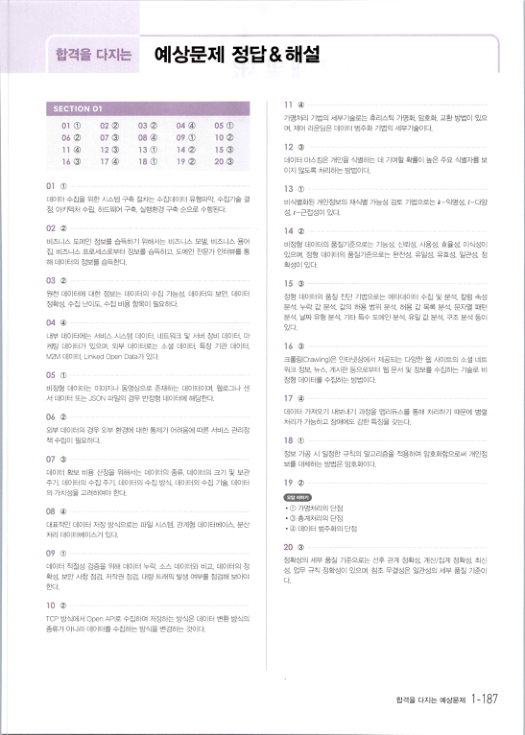
## 예상문제 정답＆해설
SECTION 01 가명처리 기법의 세부기술로는 휴리스틱 가명화． 암호화． 교환 방법이 있으 며 . 제어 라운딩은 데이터 범주화 기법의 세부기술이다． 04 @) 05 ① lo ② 15 ③ 20 ③ 02 ② 07 ③ 03 ② 08 ④ 01D 09 《D 14 ② 19 ② 06 ② li 12 ③ …………………………………………∼… …∼… … ……………… 1 3 (j) 18 <j) 12 《죠：) 17 ④ 데이터 마스킹은 개인을 식별하는 데 기여할 확률이 높은 주요 식별자를 보 이지 않도록 처리하는 방법이다． 16 ③ 01 D ……∼ … ……… ……… 데이터 수집을 위한 시스템 구축 절차는 수집데이터 유형파악． 수집기술 결 정 , 아키텍처 수립． 하드웨어 구축 . 실행환경 구축 순으로 수행된다． 비식별화된 개인정보의 재식별 가능성 검토 기법으로는 k－익명성 , /－다양 성 . 卜근접성이 있다， 14 ② … 」 비즈니스 도메인 정보를 습득하기 위해서는 비즈니스 모델． 비즈니스 용어 비정형 데이터의 품질기준으로는 기능성， 신뢰성． 사용성 . 효율성 . 이식성이 집． 비즈니스 프톼ㅖ스로부터 정보를 伊킁하고， 도메인 전문가 인터뷰를 통 해 데이터의 정보를 습득한다． 있으며． 정형 데이터의 품질기준으로는 완전성． 유일성 , 유효성． 일관성． 정 확성이 있다． 03 ② … ……… 「 ∼ 『 … · ,. …… …… ……… ……－………… 15 ③ .

원천 데이터에 대한 정보는 데이터의 수집 가능성． 데이터의 보안, 데이터 정확성 . 수집 난이도 수집 비용 항목이 필요하다． 정형 데이터의 품질 진단 기법으로는 메타데이터 수집 및 분석 , 칼럼 속성 분석 , 누락 값 분석 , 값의 허용 범위 분석． 허용 값 목록 분석 . 문자열 패턴 분석 . 날짜 유형 분석 . 기타 특수 도메인 분석． 유일 값 분석， 구조 분석 등이 04 ④ ∼…………－… … … ………－…………………－∼ … 있다． 내부 데이터에는 서비스 시스템 데이터， 네트워크 및 서버 장비 데이터， 마 케팅 데이터가 있으며 . 외부 데이터로는 소셜 데이터． 특정 기관 데이터． M2M 데이터， Linked Open Data가 있다， 16 ③  .

③.

③....... . .... .............................................................. ...................................... ........................... .

크롤링（Crawling）은 인터넷상에서 제공되는 다양한 웹 사이트의 소셜 네트 워크 정보， 뉴스， 게시판 등으로부터 웹 문서 및 정보를 수집하는 기술로 비 정형 데이터를 수집하는 방법이다』 05 ① ……… ……… … ……… … …∼∼…………… 비정형 데이터는 이미지나 동영상으로 존재하는 데이터이며． 웹로그나 선l 서 데이터 또는 JSON 파일의 경우 반정형 데이터에 해당한다， 17 ④ …………∼……………………… … … ∼………∼………………… 데이터 가져오기 내보내기 과정을 맵리듀스를 통해 처리하기 때문에 병렬 처리가 가능하고 장애에도 강한특장을 갖는다． 06 ② …… … … …… …………………… ……－… 외부 데이터의 경우 외부 환경에 대한 통제가 어려움에 따른 서비스 관리정 책 수립이 필요하다． 18 ①  .

①.......... .......... ......................... .......... ......................... . ......... ....................................................

정보 가공 시 일정한 규칙의 알고리즘을 적용하여 암호화함으로써 개인정 보를 대체하는 방법은 암호화이다． 07 ③ ......... ........ .............................. ............. ....... ................. ...................................................

데이터 확보 비용 산정을 위해서는 데이터의 종류． 데이터의 크기 및 보관 주기． 데이터의 수집 주기． 데이터의 수집 방식 . 데이터의 수집 기술． 데이터 의 가치성을 고려하여야 한다． 19 (2> ........ ... .... ... ... .... ... .

--．驪ㅌ·

- ① 가명처리의 단점 
- （쵸） 총계처리의 단점 
- ④ 데이터 범주화의 단점
08 C)  .

C) .

C) .. .. ... .... .... ... .......................... ....................... .... ............. ... ............................... ......... ..

대표적인 데이터 저장 방식으로는 파일 시스템． 관계형 데이터베이스， 분산 처리 데이터베이스가 있다． 20 ③ ……………………………………………………………… 9…… 09 D ...........

정확성의 세부 품질 기준으로는 선후 관계 정확성 . 계산／집계 정확성． 최신 데이터 적절성 검증을 위해 데이터 누락． 소스 데이터와 비교， 데이터의 정 성． 업무 규칙 정확성이 있으며 . 참조 무결성은 일관성의 세부 품질 기준이 확성． 보안 사항 점검． 저작권 점검 , 대량 트래픽 발생 여부를 점검해 보아야 다． 한다． lO ② … ……………∼…一……0……………… … ……… ……………… TCP 방식에서 Open AF기로 수집하여 저장하는 방삭은 데이터 변환 방식의 종류가 아니라 데이터를 수집하는 방식을 변경하는 것이다．

> 합격을다지는예상문제 H7
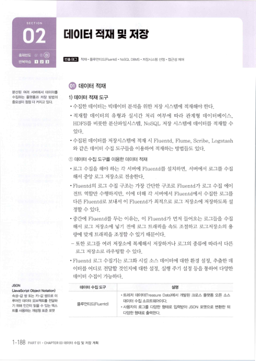
# S ECU 0 N 
02

# 데이터 적재 및 저장
출제빈도 빈출 태그 적재 · 플루언티드的uentd) · NoSOL DBMS · 처장시스템 선정 · 접근성 제어 반복학습 .

데이터 적재 분산된 여러 서버에서 데이터를 수집하는 플랫폼과 저장 방법의 1) 데이터 적재 도구 중요성이 점점 더 커자고 있다．

- 수집한 데이터는 빅데이터 분석을 위한 저장 시스템에 적재해야 한다．
- 적재할 데이터의 유형과 실시간 처리 여부에 따라 관계형 데이터베이스，
HDFS를 비롯한 분산파일시스템 , NoSQL 저장 시스템에 데이터를 적재할 수 있다．

- 수집된 데이터를 저장시스템에 적재 시 Fluentd, Flume, Scribe, Logstash 
와 같은 데이터 수집 도-7 들 을 이용하여 적재하는 방법들도 있다． (j:) 데이터 수집 도구를 이용한 데이터 적재

- 로그 수집을 해야 하는 각 서버에 Fluentd를 설치하면 , 서버에서 로그를 수집
해서 중앙 로그 저장소로 전송한다．

- Fluentd의 로그 수집 구조는 가장 간단한 구조로 Fluentd가 로그 수집 에이
전트 역할만 수행하지만 , 이에 더해 각 서버에서 Fluentd에서 수집한 로그를 다른 Fluentd로 보내서 이 Fluentd가 최적으로 로그 저장소에 저장하도록 설 정할 수 있다．

- 중간에 Fluentd를 두는 이유는 , 이 Fluentd가 먼저 들어오는 로그들을 수집
해서 로그 저장소에 넣기 전에 로그 트래픽을 속도 조절하고 로그저장소의 용

#### 량에 맞게 트래픽을 조정할 수 있기 때문이다 .
- 또한 로그를 여러 저장소에 복제해서 저장하거나 로그의 종류에 따라서 다른 
로그 저장소로 라우팅할 수 있다 .

- Fluentd 로그 수집기는 로그화 시킬 소스 데이터에 대한 환경 설정 , 추출한 데
이터를 어디로 전달할 것인지에 대한 설정 , 실행 주기 설정 등을 통하여 다양한 데이터 수집이 가능하다． JS이시 데이터 수집 도구 (JavaScript Object Notation)

- 트레저 데이터（Treasure Data）에서 개발된 크로스 플랫폼 오픈 소스
속성－값 쌍 또는 키－값 쌍으로 이 데이터 수집 소프트웨어이다． 루어진 데이터 오브젝트를 전달하 플루언티드（Fluentd) 기 위해 인간이 읽을 수 있는 텍스

- 사용자의 로그를 다양한 형태로 입력덛［빠 JSON 포맷으로 변환한 뒤
트롤 사용하는 개방형 표준 포맷 다양한 형태로 출력한다． 1 -188 PART 01 . CHAPTER 03 데이터 수집 및 저장 계획

> 설명
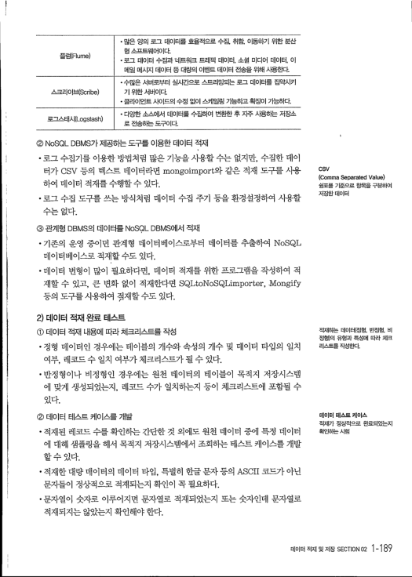
- 많은 양의 로그 데이터를 효율적으로 수집 , 취합, 이동하기 위한 분산
형 소프트웨어이다． 플럼（Flume)

- 로그 데이터 수집과세트워크 트래픽 데이터 , 소셜 미디어 데이터 , 이
메일 메시지 데이터 등 대량의 이벤트 데이터 전송을 위해 사용한다．

- 수많은 서버로부터 실시간으로 스트리밍되는 로그 데이터를 집약시키
스크라이브（Scribe) 기 위한 서버이다．

- 클라이언트 사이드의 수정 없이 스케일링 가능하고 확장이 가능하다．
로그스태시（Logsta삶1)

- 다양한 소스에서 데이터를 수집하여 변환한 후 ㅈ倖 사용하는 저창소
로 전송하는 도구이다． ②NoSQL DBMS가 제공하는 도구를 이용한 데이터 적재

- 로그 수집기를 이용한 방법처럼 많은 기능을 사용할 수는 없지만 , 수집한 데이
터가 CSv 등의 텍스트 데이터라면 mongoimport와 같은 적재 도구를 사용 하여 데이터 적재를 수행할 수 있다．

- 로그 수집 도구를 쓰는 방식처럼 데이터 수집 주기 등을 환경설정하여 사용할
수는 없다． ③ 관계형 DBMS의 데이터를 NoSQL DBMS에서 적재

- 기존의 운영 중이던 관계형 데이터베이스로부터 데이터를 추출하여 NoSQL
데이터베이스로 적재할 수도 있다 .

- 데이터 변형이 많이 필요하다면 , 데이터 적재를 위한 프로그램을 작성하여 적
재할 수 있고 , 큰 변화 없이 적재한다면 SQLtoNoSQLimporter, -Mongify 등의 도구를 사용하여 점재할수도 있다． 2) 데이터 적재 완료 테스트 ① 데이터 적재 내용에 따라 체크리스트를 작성

- 정형 데이터인 경우에는 테이블의 개수와 속정의 개수 및 데이터 타입의 일치
여부 , 레코드 수 일치 여부가 쳬크리스트가 될 수 있다．

- 반정형이나 비정형인 경우에는 원천 데이터의 테이블이 목적지 저장시스템
에 맞게 생성되었는지 , 레코드 수가 일치하는지 등이 쳬크리스트에 포함될 수 있다． ② 데이터 테스트 케이스를 개발

- 적재된 레코드 수를 확인하는 간단한 것 외에도 원천 데이터 중에 특정 데이터
에 대해 샘플링을 해서 목적지 저장시스템에서 조회하는 데스트 케이스를 개발 할 수 있다．

- 적재한 대량 데이터의 데이터 타입 , 특별히 한글 문자 등의 ASCII 코드가 아닌
문자들이 정상적으로 적재되는지 확인이 꼭 필요하다．

- 문자열이 숫자로 이루어지면 문자열로 적재되었는지 또는 숫자인데 문자열로
적재되지는 않았는지 확인해야 한다．

> CsV 
(Comma Separated Value) 쉼표를 기준으로 항목을 구분하여 저장한 데이터

> 적재하는 데이터（정형 . 반정형 . 비
> 정형）의 유형과 특성에 따라 체크
> 리스트를작성한다．
> 데이터 테스트 케이스
> 적재가 정상적으로 완료되었는지 
확인ㅎ隱 시험

> 데이터적재및저장SECTIQN02 1-189
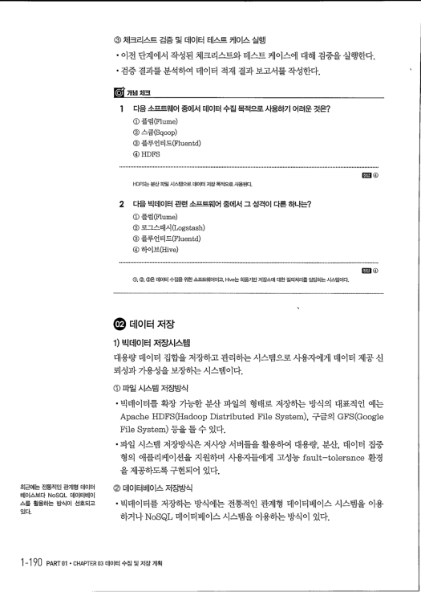
③ 쳬크리스트 검증 및 데이터 테스트 케이스 실행

- 이전 단계에서 작성된 쳬크리스트와 테스트 케이스에 대해 검증을 실행한다．
- 검증 결과를 분석하여 데이터 적재 결과 보고서를 작성한다．
1 다음소프트웨어 중에서 데이터 수집 목적으로사용하기 어려운 것은？ ① 플럼（Flume) ② 스쿱（Sqoop) ③ 플루언티드（Fluentd) ④ HDFS HDFS는 분산 파일 사스템으로 데이터 저장목적으로 사용된다． 2 다음 빅데이터 관련 소프트웨어 중에서 그 성격이 다른 하나는？ ① 플럼（Flume) ② 로그스태시（Logstash) ③ 플루언티드（Fluentd) ④ 하이브（Hive) ①. (2) . ③은 데이터 수집을 위한소프트웨어이고， Hive는 하둡기반 저장소에 대한 질의처리를 담당하는 사스템이다． .

데이터 저장 1) 빅데이터 저장시스템 대용량 데이터 집합을 저장하고 관리하는 시스템으로 사용자에게 데이터 제공 신 뢰성과 가용성을 보장하는 시스템이다． ① 파일 시스템 저징빵식

- 빅데이터를 확장 가능한 분산 파일의 형태로 저장하는 방식의 대표적인 예는 
Apache RDFS(Hadoop Distributed File System), 구글의 GFS(Google File System) 등을 들 수 있다．

- 파일 시스템 저장방식은 저사양 서버들을 활용하여 대용량 , 분산 , 데이터 집중
#### 형의 애플리케이션을 지원하며 사용자들에게 고성능 fault-tolerance 환경 
을 제공하도록 구현되어 있다． ② 데이터베이스 저짇빵식 최근에는 전통적인 관계형 데이터 베이스보다 NoSQ!- 데이터베이 스를 활용하는 방식이 선호되고

- 빅데이터를 저장하는 방식에는 전통적인 관계형 데이터베이스 시스템을 이용
있다． 하거나 NoSQL 데이터베이스 시스템을 이용하는 방식이 있다． 니90 PART 01 . CHAPTER 03 데이터 수집 및 저장계획

> 饉國 ④
### .n ④
> ,
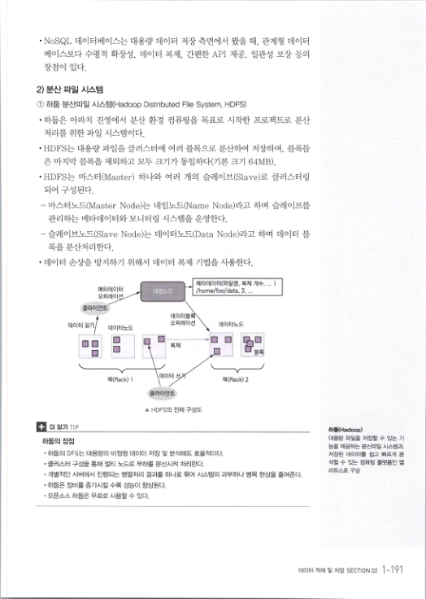
- NoSQL 데이터베이스는 대용량 데이터 저장측면에서 봤을 때 , 관계형 데이터
베이스보다 수평적 확장성 , 데이터 복제 , 간편한 API 제공 , 일관성 보장 등의 장점이 있다． 2) 분산 파일 시스템 ① 하둡 분산파일 시스템어adoop Distributed File System, HDFS)

- 하둡은 아파치 진영에서 분산 환경 컴퓨팅을 목표로 시작한 프로젝트로 분산
처리를 위한 파일 시스템이다．

- HDFS는 대용량 파일을 클러스터에 여러 블록으로 분산하여 저장하며 , 블록들 
은 마지막 블록을 제외하고 모두 크기가 동일하다（기본 크기 64MB).

- HDFS는 마스터（Master) 하나와 여러 개의 슬레이브（Slave）로 클러스터링
되어 구성된다．

- 마스터노드（Master Node）는 네임노드（Name Node）라고 하며 슬레이브를
관리하는 메타데이터와 모니터링 시스템을 운영한다 .

- 슬레이브노드（Slave Node）는 데이터노드（Data Node）라고 하며 데이터 블
록을 분산처리한다 .

- 데이터 손상을 방지하기 위해서 데이터 복제 기법을 사용한다．
#### ㅢ 엔타데익터（파밑명＇ 복제 개수， · 
I /nome/ Too/aala, i, … Y 랙（Rack) 2 A HDFS의 전체 구성도 하둡의 장점

- 하둡의 DFS는 대용량의 비정형 데이터 저장 및 분석에도 효율적이다．
- 클러스터 구성을 통해 멀티 노드로 부하를 분산시켜 처리한다．
- 개별적인 서버에서 진행되는 병렬처리 결과를 하나로 묶《거 시스템의 과부하나 병목 현상을 줄여준다．
- 하둡은 장비를 증가시킬 수록 성능이 향상된다．
- 오픈소스 하둡은 무료로 사용할 수 있다．
> ㅎI
O-Iadoop) 대용량 파일을 저장할 수 있는 기 능을 저旺｝하는 분산파일 시스템과， 저장된 데이터를 쉽고 빠르게 분 석할 수 있는 컴퓨팅 플랫폼인 맵 리듀스로 구성

> 데이터적재및저장SECTION 02 H91
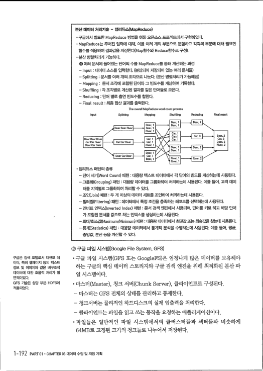
분산 데이터 처리기술 - 맵리듀스（MapReduce)

- 구글에서 발표한 MapReduce 방법을 하둡 오픈소스 프로젝트에서 구현하였다．
- MapReduce는 주어진 입력에 대해 , 이를 여러 개의 부분으로 분할하고 각각의 뷔븐에 대해 필요한
함수를 즈돋하여 결과값을 저장한다的ap함수와 Reduce함수로 구성）.

- 분산 병렬처리가 가능하다． 
.) 여러 문서에 들어있는 단어의 수를 MapReduce를 통해 계산하는 과정 -Input : 데이터 소스를 입력힌다. （분산되어 저장되어 있는 여러 문서들）

- SpUtting : 문서를 여러 개의 조각으로 나눈다. （분산 병렬처리가 가능해짐）
- Mapping : 문서 조각에 포함된 단어와 그 빈도수를 계산하여 기록한다．
- 닷iuffting : 각조각별로 계산된 결과를 같은 딘쩌들로 모은다．
- Reducing : 단어 별로 출연 빈도수를 합한다．
- Final result : 최종 합산 결과를 출력한다.
The overall MapReduce word count process Input Splitting Mapping Shuffling Reducing Final result

# 1
Bear, I 駭 Deer. I Bear. 1 River. 1 Bear River Car. I

- 
Car, l River. 1 Deer Bear River car Car River Deer car Bear Car1Car. 1

# Car Car 郞var 
N Deer. 2 Deer, 1 Deer Car Bear Deer, 1 Car, I Bear. I River, 1 River. I

- 맵리듀스 패턴의 종류
- 단어 세기（Word Count) 패턴 : 대용량 텍스트 데이터에서 각 단어의 빈도를 계산하는데 사용된다．
－그룹화(Grouping) 패턴 : 대용량 데이터를 그룹화하여 처리하는데 사용된다． 예를 들어， 고객 데이 터를 지역별로 그룹화하여 처리할 수 있다． －조인（Join) 패턴 : 두 개 이상의 데이터 서峰를 조인하여 처리하는데 사띈다．

- 필터링（Filtering) 패턴 : 데이터에서 특정 조건을 伊돋하는 레코드를선택하는데 사왯다．
- 인버트 인덱스.nverted Index) 패턴 : 문서 검색 엔진에서 사용되며 , 단어를 키로 하고 해당 단어
가 포함된 문서를 값으로 하는 인덱스를 생성하는데 사盟다．

- 최다l／최소값（Maximum/Minimum) 패턴 : 대 
데이터에서 최댓값또는 최솟값을 찾는데 사驪l다． －통계（Statistics) 패턴 : 대용량 데이터에서 통계적 분석을 수행하는데 사용된다. 예를 들어 . 평균, 중앙값. 분산 등을 계산할 수 있다． ② 구글 파일 시스템（Goo이e File System, GFS)

- 구글 파일 시스템（GFS 또는 GoogleFS）은 엄청나게 많은 데이터를 보유해야
구글은 검색 포털로서 대규모 데 이터 . 특히 웹페이지 등의 텍스트 纖 및 이미지와 같은 비구조적 하는 구글의 핵심 데이터 스토리지와 구글 검색 엔진을 위해 최적화된 분산 파 데이터에 대한 효율적 처리가 필 일 시스템이다． 연적이었다． GFS 기술은 상당 부분 HDFS에

- 마스터（Master) , 청크서버（Chunk Server) , 클라이언트로구성된다．
적용되었다．

- 마스터는 GFS 전쳬의 상태를 관리하고 통제한다．
#### - 청크서버는 물리적인 하드디스크의 실제 입출력을 처리한다 .
#### - 클라이언트는 파일을 읽고 쓰는 동작을 요청하는 애플리케이션이다 .
- 파일들은 일반적인 파일 시스템에서의 클러스터들과 섹터들과 비슷하게
64MB로 고정된 크기의 청큐들로 나누어서 저장된다． 1-192 PARTO1 . CHAPTER03 데이터수집 및저장계획

# Boar. 2 N
> 1
> Car, 나－-Bear,2
Car. 3 Dear, 2

> Deer. 2
> 勵ver, 2
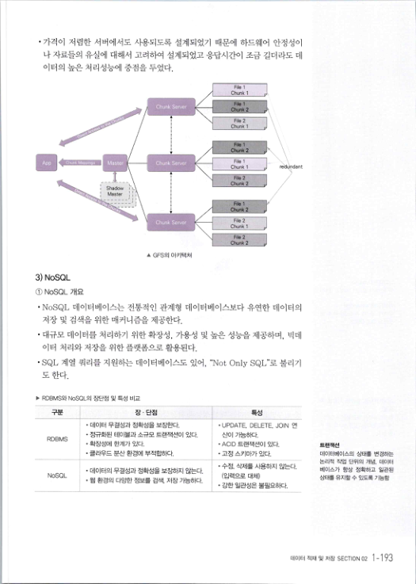
- 가격이 저렴한 小서에서도 사용되도록 설계되었기 때문에 하드웨어 안정성이 
나 자료들의 유실에 대해서 고려하여 설계되었고 응답시간이 조금 길더라도 데 이터의 높은 처리성능에 중점을 두었다． File 1 篩U야； 1 F」 App 다iunk SeYv씽 A GFS의 아키택쳐 3) NOSQL ① NoSOL 개요

- NoSQL 데이터베이스는 전통적인 관계형 데이터베이스보다 유연한 데이터의
저장 및 검색을 위한 매커니즘을 제공한다．

#### · 대규모 데이터를 처리하기 위한확장성 , 가용성 및 높은 성능을 제공하며 , 빅데
이터 처리와 저장을 위한 플랫폼으로 활용된다．

#### ·SQL 계열 쿼리를 지원하는 데이터베이스도 있어 , "Not Only SQL " 로 불리기 
도 한다． 卜RDBMS와 NOSQL의 장단점 및 특성 비교 구분 장 · 단첨 톡성 . 데이터 무결성과 정확성을 보장한다．

- UPDATE. DELETE. JOIN 연
- 정규화된 테이블과 소규모 트랜잭션이 있다．
산이 가능하다．

- ACID 트랜잭션이 있다． 
- 고정 스키마가 있다．
RDBMS

- 확장성에 한계가 있다．
- 클라우드 분산 환경에 부적합하다．
- 수정 , 삭저隱 사용하지 않는다．
- 데이터의 무결성과 정확성을 보장하지 않는다．
NOSOL （입력으로 대체）

- 웹 환경의 다양한 정보를 검색 , 저장 가능하다．
- 강한 일관성은 불필요하다．
> redundant
> 트랜잭션 
데이터베이스의 상태를 변경하는 논리적 작업 단위의 개념 . 데이터 베이스가 항상 정확하고 일관된 상태를 유지할 수 있도록 기능함

> 데이터적재및저장SECTION 02 1 -193
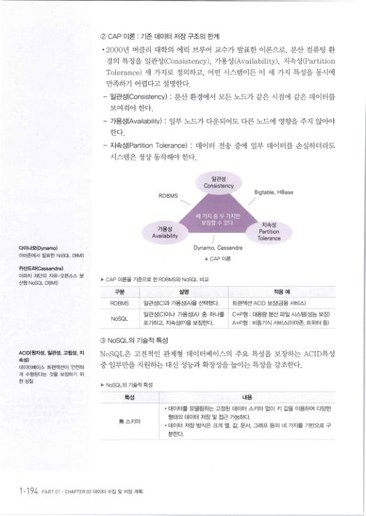
②CAP 이론 : 기존 데이터 저장 구조의 한계

- 2000년 버클리 대학의 에릭 브루어 교수가 발표한 이론으로 , 분산 컴퓨팅 환
경의 특징을 일관성（Consistency) , 가용성（Availability) , 지속정（Partition Tolerance) 세 가지로 정의하고 , 어떤 시스템이든 이 세 가지 특정을 동시에 만족하기 어렵다고 설명한다．

#### - 일관성（Consistency) : 분산 환경에서 모든 노드가 같은 시점에 같은 데이터를
보여줘야 한다 .

#### - 가왔l(AvaiIability) : 일부 노드가 다운되어도 다른 노드에 영향을 주지 않아야
한다．

#### - 지속성（Partition Tolerance) : 데이터 전송 중에 일부 데이터를 손실하더라도
시스템은 정상 동작해야 한다 .

일관성 Consistency RDBMS \\ 세 가지 중 두 가지만 보장할 수 있다． 가용성 Availability Dynamo, Cassandra 다이나모（Dynam이 아마존에서 발표한 臘方그 田MS A CAP 이론 카산드라(Cassandra) 아파치 재단의 자유－오픈소스 분 . CAP 이론을 기준으로 한 RDBMS와 NoSOL 비교 산형 NoSOL DBMS 구분 설명 일관싱(C）과 가용성（A）을 선택했다． 트랜잭션 ACID 보장（금융 서비스） RDBMS c+P형 : 대용량 분산 파일 시스템（성능 보장） 일관성（C）이나 가용성（A) 중 하나를 NOSQL 포기하고 , 지속성（P）을 보장한다． 서P형 : 비동기식 서비스（아마존 . 트위터 등） ③NoSQㄴ의 기술적 특성 NoSQL은 고전적인 관계형 데이터베이스의 주요 특정을 보장하는 ACID특성 A이D《원차성 , 일관성 , 고핍성 , 지 속성） 데이터베이스 트랜잭션이 안전하 게 수행된다는 것을 보장하기 위 한 성질 중 일부만을 지원하는 대신 성능과 확장성을 높이는 특정을 강조한다． 卜NoSQㄴ의 기술적 특성 특성 내용

- 데이터를 모델링하는 고정된 데이터 스키마 없이 키 값을 이용하여 다양한
형태의 데이터 저장 및 접근 가능하다． 無 스키마

- 데이터 저장 방식은 크게 열 , 값, 문서 , 그래프 등의 네 가지를 기반으로 구
분한다． ㄴ ?4 PART 01 . CHAPTER03데이터수집및저장계획

> Bigtable, HBase
> 지속성 
Partition Tolerance

> 적용 예
#### I
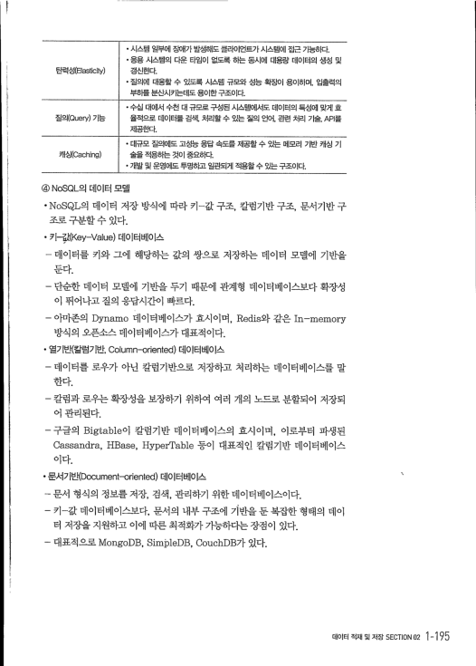
- 시스템 일부에 징애가 발생해도 클라이언트가 시스템에 접근 가능ㅎ阡． 
- 응용 시스템의 다운 타임이 없도록 하는 동시에 대용량 데이터의 생성 및
탄력성（티asticity) 갱신힌다．

- 질의에 대응할 수 있도록 시스템 규모와 성능 확장이 용이하며 , 입출력의 
부하를 분산시키는데도 용이한 구조이다．

- 수십 대에서 수천 대 규모로 구셩된 시스템에서도 데이터의 특셩에 맞게 효
질의（Query) 기능 율적으로 데이터를 검색 , 처리할 수 있는 질의 언어 . 곤븟크 처리 기술, API를 저꼼한다．

- 대규모 질의에도 고성능 응답 속도를 저居할 수 있는 메모리 기반 캐싱 기 
술을 적용하는 것이 중요하다．

- 개발 및 운영에도 투명하고 일관되게 적용할 수 있는 구조이다．
캐싱（Caching) ④NoSQL의 데이터 모델

- NoSQL의 데이터 저장 방식에 따라 키－값 구조 , 칼럼기반 구조 , 문서기반 구 
조로 구분할 수 있다．

- 키－값(Key-Value) 데이터베이스
- 데이터를 키와 그에 해당하는 값의 짱으로 저장하는 데이터 모델에 기반을
둔다．

- 단순한 데이터 모델에 기반을 두기 때문에 관계형 데이터베이스보다 확장성
이 뛰어나고 질의 응답시간이 빠르다．

#### - 아마존의 Dynamo 데이터베이스가 효시이며 , Redis와 같은 In-memory 
방식의 오픈소스 데이터베이스가 대표적이다 .

- 열기반（칼럼기반, Column-oriented) 데이터베이스
- 데이터를 로우가 아닌 칼럼기반으로 저장하고 처리하는 데이터베이스를 말
한다．

- 칼럼과 로우는 확장성을 보장하기 위하여 여러 개의 노드로 분할되어 저장되
어 관리된다 .

－구글의 Bigtable이 칼럼기반 데이터베이스의 효시이며 , 이로부터 파생된 Cassandra, HBase, HyperTable 등이 대표적인 칼럼기반 데이터베이스 이다．

- 문서기빈（Document-oriented) 데이터베이스
－문서 형식의 정보를 저장 , 검색 , 관리하기 위한데이터베이스이다．

- 키－값 데이터베이스보다 , 문서의 내부 구조에 기반을 둔 복잡한 형태의 데이 
터 저장을 지원하고 이에 따른 최적화가 가능하다는 장점이 있다．

- 대표적으로MongoDB, Simi)leDB, CouchDB가 있다．
> 데이터적재및저장SECTION02 1-195
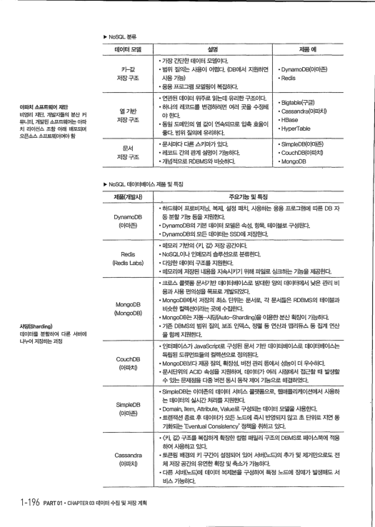
> N0SQL 분류
데이터 모델 설명 저曆 예

- 가장 긴단한 데이터 모델이다． 
- 범위 질의는 사용이 어렵다 . (DB에서 지원하면 
ㅅ隱 가능）

- 응용 프로그램 모델링이 복잡하다．
키－값 저장구조

- 연관된 데이터 위주로 읽는데 유리한 구조이다． 
- 하나의 레코드를 변경하려면 여러 곳을 수정해 
야 힌다． 아파치 소프트웨어 재단 열 기반 저장구조 비영리 재단, 개발자들의 분산 커 뮤니티 . 개발된 소프트웨어는 아파 치 라이선스 조항 아래 배포되며 오픈소스 소프트뭬어여야 함

- 동일 도메인의 열 값이 연속되므로 압축 효율이
좋다. 범위 질의에 유리하다．

- 문서마다 다른 스키마가 있다． 
- 레코드 간의 관계 설명이 가능하다． 
` 개념적으로 RDBMS와 비슷하다． 문서 저장구조 b NoSQL 데이터베이스 저曆 및 특징 저居《개발사） 주요기능 및 특징

- 하드웨어 프로비저닝 , 복제 , 설정 패치 , 사용하는 응용 프로그램에 따른 DB 자 
동 분할 기능 등을 지원한다．

- DynamoDB의 기본 데이터 모델은 속성 . 항목 , 테이블로 구셩된다．
DynamoDB （아마존）

- DynamoDB의 모든 데이터는 SSD에 저장한다．
- 메모리 기반의 〈키 . 값＞ 저장 공간이다．
`NoSQL이나 인메모리 솔루션으로 분류한다． Red is

- 다양한 데이터 구조를 지원힌다． 
- 메모리에 저장된 내용을 지속시키기 위해 파일로 싱크하는 기능을 저旺E힌F.
(Redis Labs)

- 크로스 플랫폼 문서기반 데이터베이스로 방대한 양의 데이터에서 낮은 관리 비 
용과 사용 편의성을 목표로 개발되었다．

- MongoDB에서 저장의 최소 단위는 문서뢰 각 문서들은 RDBMS의 테이블과
MongoDB 비슷한 컬렉션이라는 곳에 수집한다． (MongoDB)

- MongoDB는 ㅈ隱－샤딩（Auto-Sharding）을 이용한분산 확장이 기능하다． 
- 기존 DBMS의 범위 질의 , 보조 인덱스 , 정렬 등 연산과 맵리듀스 등 집계 연산 
을 함께 지원한다． 샤딩（Sharding) 데이터를 분할하여 다른 서버에 나누어 저장하는 과정

- 인터페이스가 JavaScript로 구셩된 문서 기반 데이터베이스로 데이터베이스는
독립된 도큐먼트들의 컬렉션으로 정의된다． CouchDB

- MongoDB보다 저居 질의 , 확창성 , 버전 관리 등에서 성능이 더 우수하다． 
- 문서단위의 ACID 속셩을 지원하며 , 데이터가 여러 시점에서 접근할 때 발생할 
수 있는 문제점을 다중버전 동시 동작 제어 기능으로 해결하였다． （아파치）

- SimpleDB는 아마존의 데이터 서비스 플랫폼으로， 웹애플리케이션에서 사용하 
는 데이터의 실시간 처리를 지원힌다．

- Domain. Item. Attribute. Value로 구셩되는 데이터 모델을 사용한다．
SimpIeDB （아마존）

- 트랜잭션 종료 후 데이터가 모든 노드에 즉시 반영되지 않고 초 단위로 지연 동
기화되는 ' Eventual Consistency ' 정책을 취하고 있다．

- 〈키 , 값〉 구조를 복잡하게 확장한 컬럼 패밀리 구조의 DBMS로 페이스북에 적용
하여 시용하고 있다．

- 토큰링 배경의 키 구간이 설정되어 있어 서버（노드）의 추가 및 제거만으로도 전
Cassandra 체 저장 공간의 유연한 확장 및 축소가 가능하다． （아파치）

- 다른 서버（노드）에 데이터 복저腱을 구성하여 특정 노드에 장애가 발생해도 서
비스가능하다． 1-196 PART01 . CHAPTER03 데이터수집 및저장계획

> - DyriamoDB（아마존） 
- Redis
> - Bigtable（구글）
> - Cassandra（아파치） 
.HBase

- HyperTable
> - SimpleDB(OFE1F )
> - CouchDB（아파치） 
- MorigoDB
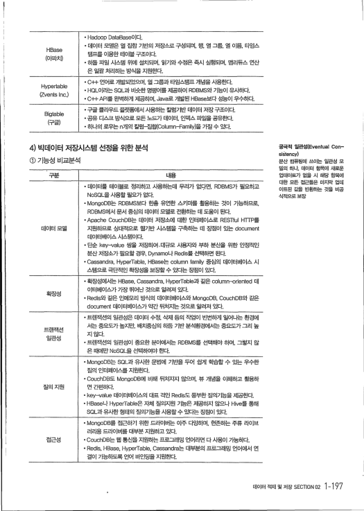
- Hadoop DataBase이다． 
- 데이터 모델은 열 집합 기반의 저장소로 구성되며 . 행 , 열 그룹 , 열 이름. 타임스
HBase 탬프를 이용한 테이블 구조이다． （아파치）

- 하둡 파일 시스템 위에 설치되며 , 읽기와 수장은 즉시 실행되며 , 맵리듀스 연산 
은 일괄 처리하는 방식을 지원한다．

- （》H 언어로 개발되었으며 , 열 그룹과 타임스탬프 개념을 사용한다．
Hypertable

- HQL이라는 SQL과 비슷한 명령어를 저居하여 RDBMS와 기능이 유사하다． 
- C*I- API를 완벽하게 제공하며 . Java로 개발돈새Base보다 성능이 우수하다．
(Zvents Inc.)

- 구글 클라우드 플랫폼에서 사용하는 칼럼기반 데이터 저장 구조이다． 
- 공유 디스크 방식으로 모든 노드가 데이터 . 인덱스 파일을 공유한다． 
- 하나의 로우는 n개의 칼럼－집합(Column-Family》을 가질 수 있다．
테gtable （구글） 4) 빅데이터 저장시스템 선정을 위한 분석 ① 기능성 비교분석 구분 내용

- 데이터를 테이블로 정리하고 사용하는데 무리가 없다면 , RDBMS가 필요하고
NoSQL을 사용할 필요가 없다．

- MorigoDB는 RDBMS보다 한충 유연한 스키마를 활용하는 것이 가능하므로，
RDBMS에서 문서 중심의 데이터 모델로 전환하는 데 도움이 된다．

- Apache CouchDB는 데이터 저장소0ㅔ 대한 인터페이스로 RESTful HTTP를
지원하므로 상대적으로 웹기반 시스템을 구축하는 데 장점이 있는 document 데이터베이스 시스템이다．

- 단순 key-value 쌍을 저장하여，대규모 사용자와 부하 분산을 위한 안정적인
분산 저장소가 필요할 경우. Dynamo나 Redis를 선택하면 된다.

- Cassandra, HyperTable, HBase는 column family 중심의 데이터베이스 시
스템으로 극단적인 확장성을 보장할 수 있다는 창점이 있다．

- 확장성에서는 Base. Cassandra, HyperTable과같은column-oriented 데
이터베이스가 가장 뛰어난 것으로 알려져 있다．

- Redis와 같은 인메모리 방식의 데이터베이스와 MongoDB, CouchDB와 같은
확장성 document 데이터베이스가 약간 뒤처지는 것으로 알려져 있다．

- 트랜잭션의 일관성은 데이터 수정 , 삭제 등의 작업이 빈번하게 일어나는 환경에
서는 중요도가 높지만 , 배치중심의 하둡 기반 분석환경에서는 중요도가 그리 높 지 않다．

- 트랜잭션의 일관성이 중요한 분야에서는 RDBMS를 선택해야 하며 , 그렇지 않 
은 때에만 NoSQL을 선택하여야 힌다． 트랜잭션 일관성

- MongoDB는 SQL과 유사한 문법에 기반을 두어 쉽게 학습할 수 있는 우수한
질의 인터페이스를 지원한다．

- CouchDB도 MongoDB에 비해 뒤처지지 않으며 . 뷰 개념을 이해하고 활용하 
면 간편하다． key-value 데이터베이스의 대표 격인 Redis도 풍부한 질의기능을 저꼼한다． 어Base나 HyperTable은 자체 질의지원 기능은 저巳하지 않으L卄iye를 통해 질의 지원 SQL과 유사한 형태의 질의기능을 사용할 수 있다는 장점이 있다．

- MongoDB를 접근하기 위한 드라이버는 아주 다양하며 , 현존하는 주류 라이브
러리용 드라이버를 대부분 지원하고 있다．

- CouchDB는 웹 틤느l을 지원하는 프로그래밍 언어라면 다 사용이 가능하다． 
- Redis, HBase, Hyperlable, Cassandra는 대부분의 프로그래밍 언어에서 연
접근성 결이 가능하도록 언어 바인딩을 지원한다．

> 궁극적 일관성（Eventual Con-
sistency) 분산 컴퓨팅에 쓰이는 일관성 모 델의 하나. 데이터 항목에 새로운 업데이트가 없을 시 해당 항목에 대한 모든 접근들은 마지막 업데 이트된 값을 반환하는 것을 비공 식적으로 보장

> 데이터적재및저장SECTION02 1-197
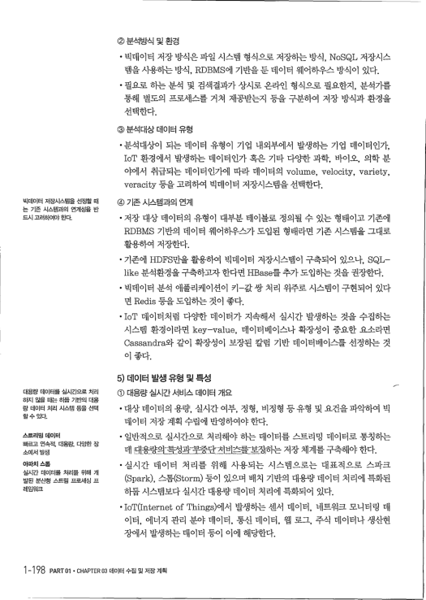
② 분석방식 및 환경

- 빅데이터 저장 방식은 파일 시스템 형식으로 저장하는 방식 , NoSQL 저장시스
#### 템을사용하는방식 , RDBMS에 기반을둔 데이터 웨어하우스 방식이 있다．
#### · 필요로 하는 분석 및 검색결과가 상시로 온라인 형식으로 필요한지 , 분적가를
통해 별도의 프로세스를 거쳐 제공받는지 등을 구분하여 저장 방식과 환경을 선택한다． ③ 분석대상 데이터 유형

#### ·분석대상이 되는 데이터 유형이 기업 내외부에서 발생하는 기업 데이터인가， 
loT 환경에서 발생하는 데이터인가 혹은 기타 다양한 과학 , 바이오 , 의학 분 야에서 취급되는 데이터인가에 따라 데이터의 volume, velocity, variety, veracity 등을 고려하여 빅데이터 저장시스템을 선택한다． ④ 기존 시스템과의 연계 빅데이터 저장시스템을 선정할 때 는 기존 시스템과의 연계성을 반 돼 고려하여야 한다．

- 저장 대상 데이터의 유형이 대부분 테이블로 정의될 수 있는 형태이고 기존에
RDBMS 기반의 데이터 웨어하우스가 도입된 형태라면 기존 시스템을 그대로 활용하여 저장한다．

#### · 기존에 HDFS만을 활용하여 빅데이터 저장시스템이 구축되어 있으나, SQL-
like 분석환경을 구축하고자 한다면 HBase를 추가 도입하는 것을 권장한다．

- 빅데이터 분석 애플리케이션이 키－값 쌍 처리 위주로 시스템이 구현되어 있다
면 Redis 등을 도입하는 것이 좋다．

#### ·loT 데이터처럼 다양한 데이터가 지속해서 실시간 발생하는 것을 수집하는
#### 시스템 환경이라면 key-value , 데이터베이스나 확장성이 중요한 요소라면
Cassandra와 같이 확장성이 보장된 칼럼 기반 데이터베이스를 선정하는 것 이좋다． 5) 데이터 발생 유형 및 특성 ① 대용량 실시간 서비스 데이터 개요 대용량 데이터를 실시간으로 처리 하지 않을 때는 하둡 기반의 대용 량 데이터 처리 시스템 등을 선택 할 수 있다．

#### · 대상 데이터의 용량 , 실시간 여부 , 정형 , 비정형 등유형 및 요건을 파악하여 빅
데이터 저장 계획 수립에 반영하여야 한다．

- 일반적으로 실시간으로 처리해야 하는 데이터를 스트리밍 데이터로 통칭하는
스트리밍 데이터 빠르고 연속적 , 대용량, 다양한 장 소에서 발생 데 대용량의드塋뒈과무＝즛냔촤비츠름’보징；하는 저장 쳬계를 구축해야 한다．

- 실시간 데이터 처리를 위해 사용되는 시스템으로는 대표적으로 스파크
아파치 스틈 실시간 데이터를 처리를 위해 개 발된 분산형 스트림 프로세싱 프

#### (Spark) , 스톰（Storm) 등이 있으며 배치 기반의 대용량 데이터 처리에 특화된
레임워크 하둡 시스템보다 실시간 대용량 데이터 처리에 특화되어 있다．

#### ·IoT(Internet of Things）에서 발생하는 센서 데이터 , 네트워크 모니터링 데
#### 이터 , 에너지 관리 분야 데이터 , 통신 데이터 , 웹 로그 , 주식 데이터나 생산현
장에서 발생하는 데이터 등이 이에 해당한다． 1-198 PART01 . CHAPTER03 데이터 수집 및 저장 계획

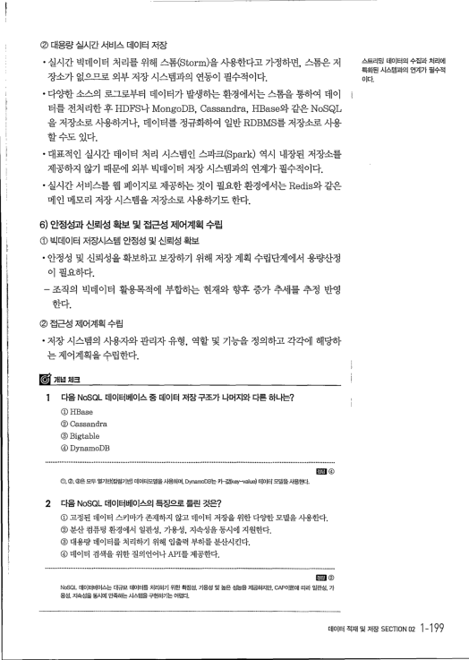
② 대용량 실시간 서비스 데이터 저장

- 실시간 빅데이터 처리를 위해 스톰（storm）을 사용한다고 가정하면 , 스톰은 저
장소가 없으므로 외부 저장 시스템과의 연동이 필수적이다．

- 다양한소스의 로그로부터 데이터가발생하는환경에서는스톰을통하여 데이 ㅣ 
터를전처리한후HDFS나MongoDB, Cassandra, RBase와같은NoSQL 을 저장소로 사용하거나 , 데이터를 정규화하여 일반 RDBMS를 저장소로 사용 할 수도 있다．

- 대표적인 실시간 데이터 처리 시스템인 스파크（Spark) 역시 내장된 저장소를
제공하지 않기 때문에 외부 빅데이터 저장 시스템과의 연계가 필수적이다．

- 실시간 서비스를 웹 페이지로 제공하는 것이 필요한 환경에서는 Redis와 같은
메인 메모리 저장 시스템을 저장소로 사용하기도 한다． 6) 안정성과 신뢰성 확보 및 접근성 제어계획 수립 ① 빅데이터 저장시스템 안정성 및 신뢰성 확보

- 안정성 및 신뢰성을 확보하고 보장하기 위해 저장 계획 수립단계에서 용량산정
이 필요하다．

- 조직의 빅데이터 활용목적에 부합하는 현재와 향후 증가 추세를 추정 반영
한다． ② 접근성 제어계획 수립

- 저장 시스템의 사용자와 관리자 유형 , 역할 및 기능을 정의하고 각각에 해당하 
는 제어계획을수립한다． 다음 NoSQI- 데이터베이스 중 데이터 저장 구조가 나머지와 다른 하나는？ D HBase ②Cassandra ③Bigtable @ DynamoDB ① , ② . ③은 모두 열기밴：칼럼기반） 더l이터모델을사용하며 , DynamoDS는 카t (key-value) 더l이터모델을사용한다． 2 다음 NoSQL 데이터베이스의 특징으로 틀린 것은？ ① 고정된 데이터 스키마가 존재하지 않고 데이터 저장을 위한 다양한 모델을 사용한다． ②분산컴퓨텅 환경에서 일관성 , 가졍펑 , 지속정을동시에 지원한다． ③ 대용량 데이터를 처리하기 위해 입출력 부하를 분산시킨다． ④ 데이터 검색을 위한 질의언어나 API를 제공한다． NOSOL 데이터베이스는 酬구모 데이터톨 처리하기 위한 확창성 , 가용성 및 높은 상능을 제공하지안 . CAP이론에 따라 일관성 . 가 용성 . 지속성을 둥시에 만족하는 시스템욜구현하기는 어렵다．

> 스트리밍 데이터의 수집과 처리에
> 특화된 시스템과의 연계가 필수적
> 이다．
> 덤柳 ④
> 현n ②
> 데이터적재및저장SECTION 02 H? 9
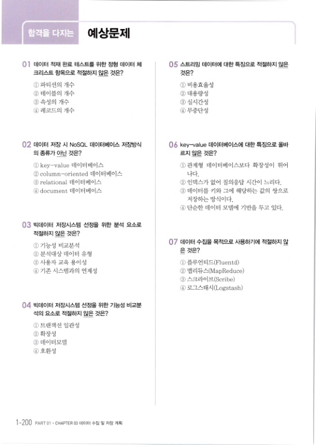
## 예상문제
01 데이터 적재 완료 테스트를 위한 정형 데이터 체 크리스트 항목으로 적절하지 않은 것은？ 05 스트리밍 데이터에 대한 특징으로 적절하지 않은 것은？ ① 파태쵸으l 개수 ② 테이블의 개수 ③속정의 개수 ④ 레코드의 개수 ① 비용효율성 ② 대용량성 ③ 실시간성 ④무중단성 06 key-value 데이터베이스에 대한 특징으로 올바 02 데이터 저장 시 NoSQL 데이터베이스 저징빵식 르지 않은 것은？ 의 종류가 아닌 것은？ ① key-value 데이터베이스 ② column-oriented 데이터베이스 ③ relational 데이터베이스 ④ document 데이터베이스 ①관계형 데이터베이스보다 확장성이 뛰어 나다． ② 인덱스가 없어 질의응답 시간이 느리다． ③ 데이터를 키와 그에 해당하는 값의 쌍으로 저장하는 방식이다． ④ 단순한 데이터 모델에 기반을 두고 있다． 03 빅데이터 저장시스템 선정을 위한 분석 요소로 적절하지 않은 것은？ 07 데이터 수집을 목적으로 사용하기에 적절하지 않 은 것은？ ① 기능성 비교분석 ②분적대상 데이터 유형 ③ 사용자 교육 용이성 ④ 기존 시스템과의 연계성 ① 플루언티드（Fluentd) ② 맵리듀스（MapReduce) ③ 스크라이브（Scribe) ④ 로그스태시（Logstash) 04 빅데이터 저장시스템 선정을 위한 기능성 비교분 석의 요소로 적절하지 않은 것은？ ① 트랜잭션 일관성 ②확장성 ③ 데이터모델 ④호환성 1 -200 PART 01 . CHAPTER 03 데이터 수집 및 저장계획

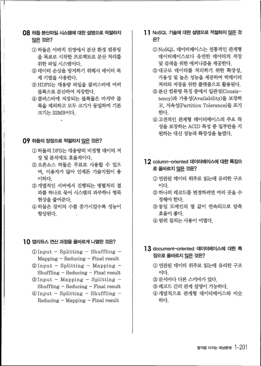
11 NoSQL 기술에 대한 설명으로 적절하지 않은 것 08 하둡 붰파일 시스템에 대한 설명으로 적절하지 않은 것은？ 은？ … ① NoSQL 데이터베이스는 전통적인 관계형 ① 하둡은 아파치 진영에서 분산 환경 컴퓨팅 을 목표로 시작한 프로젝트로 분산 처리를 위한 파일 시스템이다． ② 데이터 손상을 캉지하기 위해서 데이터 복 제 기법을 사용한다． ③ HDFS는 대용량 파일을 클러스터에 여러 블록으로 분산하여 저장한다． ④클러스터에 저장되는 블록들은 마지막 블 록을 제외하고 모두 크기가 동일하며 기본 크기는 32MB이다． 데이터베이스보다 유연한 데이터의 저장 및 검색을 위한 매커니즘을 제공한다． ②朗구모 데이터를 처리하기 위한 확장성， 가용성 및 높은 성능을 제공하며 빅데이터 처리와 저장을 위한 플랫폼으로 활용된다． ③ 분산 컴퓨팅 특징 중에서 일관성（Consis- tency）과 가용성（Availability）을 보장하 고 , 지속성（Partition Tolerance）을포기 한다 .

④고전적인 관계형 데이터베이스의 주요 특 성을 보장하는 ACII) 특성 중 일부만을 지 원하는 대신 성능과 확장성을 높였다． 0' 하둡의 창점으로 적절하지 않은 것은？ ① 하둡의 DFS는 대용량의 비정형 데이터 저 장 및 분석에도 효율적이다． ② 오픈소스 하둡은 무료로 사용할 수 있으 며 , 이용자가 많아 언제든 기술지원이 용 12 column-oriented 데이터베이스에 대한 특징으 로 올바르지 않은 것은？ ① 연관된 데이터 위주로 읽는데 유리한 구조 이하다． ③개별적인 서버에서 진행되는 병렬처리 결 과를 하나로 묶어 시스템의 과부하나 병목 현상을줄여준다． ④ 하둡은 장비의 수를 증가시킬수록 성능이 이다． ② 하나의 레코드를 변경하려면 여러 곳을 수 정해야한다． ③동일 도메인의 열 값이 연속되므로 압축 향상된다． .

효율이좋다． ④ 범위 질의는 사용이 어렵다． 10 맵리듀스 연산 과정을 올바르게 나열한 것은？ 13 document-oriented 데이터베이스에 대한 특 @Input - Splitting - Shuffling - Mapping - Reducing - Final result ② Input - Splitting - Mapping - Shuffling - Reducing - Final result ③ Input - Mapping - Splitting - Shuffling - Reducing - Final result @Input - Splitting - Shuffling - 징으로 올바르지 않은 것은？ （刀 연관된 데이터 위주로 읽는데 유리한 구조 이다． ② 문서마다 다른 스키마가 있다． ③ 레코드 간의 관계 설명이 가능하다． ④개넘적으로 관계형 데이터베이스와 비슷 하다．

> 합격을다지는예상문제 1-20 1
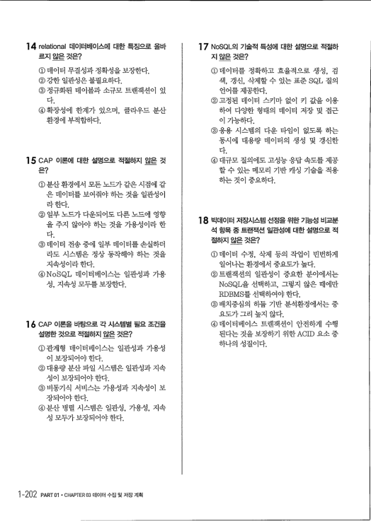
14 reationaI 데이터베이스에 대한 특징으로 올바 르지 않은 것은？ 17 NoSQL의 기술적 특성에 대한 설명으로 적절하 지 않은 것은？ ①데이터를 정확하고 효율적으로 생성 , 검 ① 데이터 무결성과 정확성을 보장한다． ② 강한 일관성은 불필요하다． ③ 정규화된 테이블과 소규모 트랜잭션이 있 색 , 갱신 , 삭제할 수 있는 표준 SQL 질의 언어를 제공한다． ②고정된 데이터 스키마 없이 키 값을 이용 하여 다양한 형태의 데이터 저장 및 접근 이가능하다． ③응용 시스템의 다운 타임이 없도록 하는 동시에 대용량 데이터의 생성 및 갱신한 다． ④확장성에 한계가 있으며 , 클라우드 분산 환경에 부적합하다． 다． ④ 대규모 질의에도 고성능 응답 속도를 제공 할 수 있는 메모리 기반 캐싱 기술을 적용 하는 것이 중요하다． 15 CAP 이론에 대한 설명으로 적절하지 않은 것 은？ ① 분산 환경에서 모든 노드가 같은 시점에 같 은 데이터를 보여줘야 하는 것을 일관성이 라한다． ② 일부 노드가 다운되어도 다른 노드에 영향 을 주지 않아야 하는 것을 가용성이라 한 18 빅데이터 저장시스템 선정을 위한 기능성 비교분 석 항목 중 트랜잭션 일관성에 대한 설명으로 적 다． ③ 데이터 전송 중에 일부 데이터를 손실하더 라도 시스템은 정상 동작해야 하는 것을 지속성이라 한다． ④NoSQL 데이터베이스는 일관성과 가용 성 , 지속정 모두를보장한다． 절하지 않은 것은？ ①데이터 수정 , 삭제 등의 작업이 빈번하게 일어나는 환경에서 중요도가 높다． ②트랜잭션의 일관성이 중요한 분야에서는 NoSQL을 선택하고 , 그렇지 않은 때에만 RDBMS를 선택하여야 한다． ③ 배치중심의 하둡 기반 분석환경에서는 중 요도가 그리 높지 않다． ④데이터베이스 트랜잭션이 안전하게 수행 된다는 것을 보장하기 위한 ACID 요소 중 16 CAP 이론을 바탕으로 각 시스템별 필요 조건을 설명한 것으로 적절하지 않은 것은？ 하나의 성질이다 .

①관계형 데이터베이스는 일관성과 가용성 이 보장되어야 한다． ② 대용량 분산 파일 시스템은 일관성과 지속 성이 보장되어야 한다． ③ 비동기식 서비스는 가떵정과 지속정이 보 장되어야 한다． ④분산 병렬 시스템은 일관성 , 가용정 , 지속 성 모두가 보장되어야 한다． 1-202 PART01 . CHAPTER03 데이터 수집 및 저장 계획

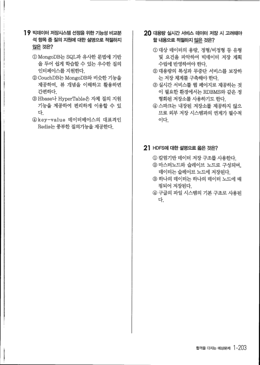
1 9 빅데이터 저장시스템 선정을 위한 기능성 비교분 석 항목 중 질의 지원에 대한 설명으로 적절하지 않은 것은？ 20 대용량 실시간 서비스 데이터 저장 시 고려해야 할 내용으로 적절하지 않은 것은？ ①대상 데이터의 용량 , 정형／비정형 등 유형 및 요건을 파악하여 빅데이터 저장 계획 수립에 반영하여야 한다． ② 대용량의 특성과 무중단 서비스를 보장하 는 저장 쳬계를 구축해야 한다． ③ 실시간 서비스를 웹 페이지로 제공하는 것 이 필요한 환경에서는 RDBMS와 같은 정 형화된 저장소를 사용하기도 한다． ④ 스파크는 내장된 저장소를 제공하지 않으 므로 외부 저장 시스템과의 연계가 필수적 ①MongoDB는 SQL과 유사한 문법에 기반 을 두어 쉽게 학습할 수 있는 우수한 질의 인터페이스를 지원한다． ②CouchDB는 MongoDB와 비슷한 기능을 제공하며 , 뷰 개념을 이해하고 활용하면 간편하다． ③Hbase나 HyperTable은 자쳬 질의 지원 기능을 제공하여 펀리하게 이용할 수 있 다． ④key-value 데이터베이스의 대표격인 Redis는 풍부한 질의기능을 제공한다． 이다． 21 HDFS에 대한설명으로옳은것은？ ① 칼럼기반 데이터 저장 구조를 사용한다． ② 마스터노드와 슬레이브 노드로 구성되며， 데이터는 슬레이브 노드에 저장된다． ③ 하나의 데이터는 하나의 데이터 노드에 매 핑되어 저장된다． ④ 구글의 파일 시스템의 기본 구조로 사용된 다．

> 합격을다지는예상문제 1-203
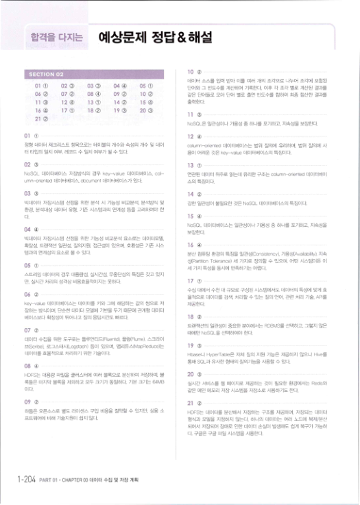
## 합격을다지는 
예상문제 정답＆해설 10 ② SECTION 02 데이터 소스를 입력 받아 이를 여러 개의 조각으로 나누어 조각에 포함된 o1 ① 02 <3;I 04 03 ③ 05D 단어와 그 빈도수를 계산하여 기록한다‘ 이후 각 조각 별로 계산된 결과를 09 ② 06 ② 07 ② 08 ④ 10 ② 같은 단어들로 모아 단어 별로 출연 빈도수를 합하여 최종 합산한 결과를 출력한다． 11 （亘；I 1 6 c) 12 ④ 14 ② 15 C) 13GD 17@ 18 ② 19 ③ 20 ③ 11 21 ② NoSQㄴ은 일관성이나 가잎성 중 하나를 포기하고， ㅈ嘴셤을 보장한다． 01 CD 12 ④ ………………」 …………………………→…………… 정형 데이터 체크리스트 항목으로는 테이블의 개수와 속성의 개수 및 데이 column-oriented 데이터베이스는 범위 질의에 유리하며 . 범위 질의에 사 터 타입의 일치 여부 . 레코드 수 일치 여부가 될 수 있다． 용이 어려운 것은 key 테ue 데이터베이스의 특징이다． 02 ③ ……………… ……… …… ……… … ……… 13 ＜〕：) …… …………………… ……… … … NoSQㄴ 데이터베이스 저장방식의 경우 key-value 데이터베이스， cot- umn-oriented 데이테케이스， document 데이터베이스가 있다． 연관된 데이터 위주로 읽는데 유리한 구조는 column-oriented 데이터베이 스의 특징이다． 03 c) ……………………………… ………………『… ……… …… 14 ② 빅데이터 저장시스템 선정을 위한 분석 시 기능셩 비교분석 . 분석방식 및 강한 일관성이 불필요한 것은 NOSQI- 데이터베이스의 특징이다． 환경 . 분석대상 데이터 유형． 기존 시스템과의 연계성 등을 고려하여야 한 iS ④ ……∼…… … ……… ………………… 다． NoS0ㄴ 데이터베이스는 일관성이나 가魂 중 하나를 포기하고， 지속성을 04 보장한다． 빅데이터 저장시스템 선정을 위한 기능성 비교봔넉 요소로는 데이터모델． 확장성． 트랜잭션 일관성 , 질의지원． 접근성이 있으며 . 호환성은 기존 시스 16 ④ ………………… …… … … 템과의 연계성의 요소로 볼 수 있다． 분산 컴퓨팅 환경의 특짇믈 일관성（Consistency). 가왔넝lAvailability) . 지속 성（Partition Tolerance) 세 가지로 정의할 수 있으며 . 어떤 시스템이든 이 05 CD 세 가지 특성을 동시에 만족하기는 어렵다． 스트리밍 데이터의 경우 대용량성 . 실시간성 . 무중단성의 특징은 갖고 있지 17 CD 만． 실시간 처리의 성격상 비용효율적이지는 못하다． 수십 대에서 수천 대 규모로 구성된 시스템에사도 데이터의 특셩에 맞게 효 06 ② 율적으로 데이터를 검색． 처리할 수 있는 질의 언어 . 관련 처리 기술． API를 key- value 데이터베이스는 데이터를 키와 그에 해당하는 값의 쌍으로 저 저긍한다． 장하는 방식이며． 단순한 데이터 모델에 기반을 두기 때문어 관계형 데이터 18 ② … 베이스보다 확장성이 뛰어나고 질의 응답시간도 빠르다』 트랜잭션의 일관성이 중요한 분야에서는 RDBMS를 선택하고， 그렇지 않은 07 ② … … … ……………∼………………… ［대oI딘旦'JOSQL을 선택하여야 한다． 데이터 수잡을 위한 도구로는 플루언티드（Fluentd) . 플럼（Flume) . 스크라이 19 ③ ……… …… … …∼ … 뵈Scribe). 로그스태시（Logstash) 등이 있으며 . 맵리듀Z늬MapReduce）는 데이터를 효율적으로 처리하기 위한 기술이다． Hbase나 HyperTabte은 자체 질의 지원 기능은 저隧｝하지 않으나 Hive를 통해 SQL과 유사한 형태의 질의기능을 사용할 수 있다． 08 ④ HDFS는 대용량 파일을 클러스터에 여러 블록으로 뷘크하여 저장하며． 블 20 ③ 록들은 마지막 블록을 제외하고 모두 크기가 동일하다． 기본 크기는 64MB 실시간 서비스를 웹 페이자로 저旺釜하는 것이 필요한 환경에서는 Reds와 이다． 같은 메인 메모리 저장 사스템을 저장소로 사용하기도 한다． 09 ② 21 ② …… … 하둡은 오픈소스로 별도 라이센스 구입 비용을 절약할 수 있지만 . 상용 소 HDFS는 데이터를 분딴해서 저장하는 구조를 제공하며． 저장되는 데이터 프트웨어에 비해 기술지원이 쉽지 않다． 형식과 모델을 지정하지 않는다． 하나의 데이터는 여러 노드에 복저（／분산 되어서 저장되어 장애로 인한 데이터 손실이 발생해도 쉽게 복구가 가능하 다. 구글은 구글 파일 시스템을 사용한다． 1-204 PART01 . CHAPTER 03 데이터 수집 및 저장 계획

# PART 02
# 빅데이터 타색
파트 소개 2과목은 데이터를 어떻게 처리하고 탐색하는지에 대한 이해가 필요합니다 . 관련 기술과 통계와 관련한 어려운 개념들이 등장하므로 이해는 물론 수학적 해석 능 력이 요구될 수 있습니다 . 시험 전반의 베이스가 되는 내용이므로 철저히 공부 하여 준비하는 것이 좋습니다．
