# CHAPTER 
02

# 데이터 탐색
학습 밤향 탐색적 데이터 분석을 통한 데이터의 특징을 이해하는 방법을 학습합니다 . 기초통계 량과 시각화도구를 이용해 데이터의 기본적인 특징을 파악하며 , 오ㅐ묘 첨도 등을 이 용하여 데이터의 분포를 이해할 수 있어야 합니다 . 또한 , 변수들 사이의 연관성을 분석 하는 상관분석 방법도 시험에서 중요하게 다루어집니다 . 고급 데이터 탐색 기법은 데 이터의 특성에 따라 적용되는 탐색 기법들의 특징을 이해하는 것이 중요합니다． 줄저I빈도 SECTION 01 SECTION 02

> 90%
> 10%
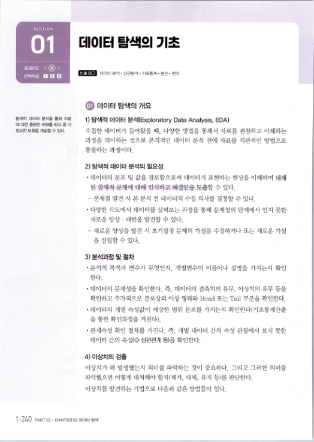
# SECTION 01
# 데이터 탐색의 기초
출제빈도 囑） 빈출 태 그 데이터 분석 · 상관분석 · 기초통계 · 분산 · 편차 반복학습 ［뻐 타 째 .

데이터 탐색의 개요 1) 탐색적 데이터 분석（Exploratory Data Analysis, EDA) 탐색적 데이터 분석을 통해 자료 에 대한 충분한 이해를 하고 좀 더 정교한 모형을 개발할 수 있다．

#### 수집한 데이터가 들어왔을 때 , 다양한 방법을 통해서 자료를 관찰하고 이해하는
과정을 의미하는 것으로 본격적인 데이터 분석 전에 자료를 직관적인 방법으로 통찰하는 과정이다． 2) 탐색적 데이터 분석의 필요성

- 데이터의 분포 및 값을 검토함으로써 데이터가 표현하는 현상을 이해하며 내재
된 잠재적 문제에 대해 인식하고 해결안을 도출할 수 있다．

- 문제점 발견 시 본 분석 전 데이터의 수집 의사를 결정할 수 있다．
- 다양한 각도에서 데이터를 살펴보는 과정을 통해 문제정의 단계에서 인지 못한
#### 새로운 양상 · 패턴을 발견할 수 있다．
- 새로운 양상을 발견 시 초기설정 문제의 가설을 수정하거나 또는 새로운 가설 
을 설립할 수 있다． 3) 분석과정 및 절차

- 분석의 목적과 변수가 무엇인지 , 개별변수의 이름이나 설명을 가지는지 확인
한다．

#### · 데이터의 문제성을 확인한다 . 즉 , 데이터의 결측치의 유무 , 이상치의 유무 등을
확인하고 추가적으로 분포상의 이상 형태와 Head 또는 Tail 부분을 확인한다．

#### · 데이터의 개별 속성값이 예상한 범위 분포를 가지는지 확인한다（기초통계산출 
을 통한 확인과정을 거친다）.

#### · 관계속성 확인 절차를 가진다 . 즉 , 개별 데이터 간의 속성 관찰에서 보지 못한
#### 데이터 간의 속성（.l 상관관계 등）을 확인한다 .
4) 이상치의 검출

#### 이상치가 왜 발생했는지 의미를 파악하는 것이 중요하다 . 그리고 그러한 의미를
파악했으면 어떻게 대처해야할지（제거 , 대체 , 유지 등）를 판단한다． 이상치를 발견하는 기법으로 다음과 같은 방법들이 있다． 1-240 PART 02 . CHAPTER 02 데이터 탐색

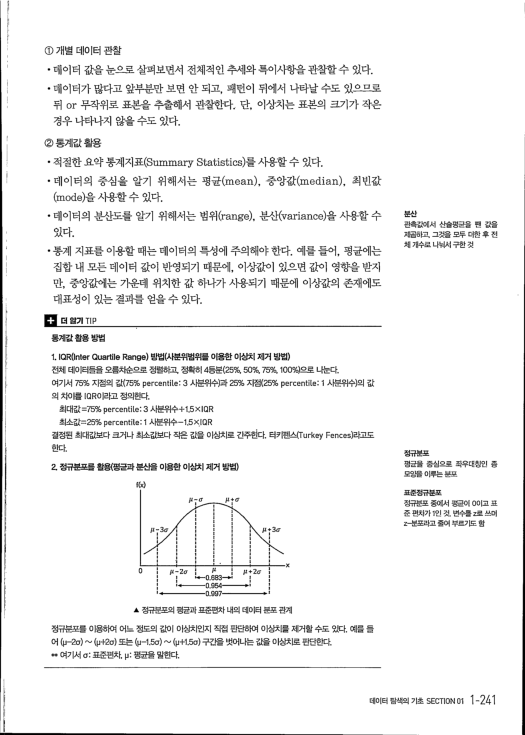
① 개별 데이터 관찰

- 데이터 값을 눈으로 살펴보면서 전쳬적인 추세와 특이사항을 관찰할수 있다．
- 데이터가 많다고 앞부분만 보면 안 되고 , 패턴이 뒤에서 나타날 수도 있으므로
#### 뒤 or 무작위로 표본을 추출해서 관찰한다． 단 , 이상치는 표본의 크기가 작은
경우 나타나지 않을 수도 있다． ② 통계값 활용

- 적절한 요약 통계지표（Summary Statistics）를 사용할 수 있다．
#### · 데이터의 중심을 알기 위해서는 평균（mean) , 중앙값（median) , 최빈값
(mode）을 사용할 수 있다．

#### · 데이터의 분산도를 알기 위해서는 범위（range) , 분산（variance）을 사용할 수
있다．

#### ·통계 지표를 이용할 때는 데이터의 특정에 주의해야한다 . 예를들어 , 평균에는
#### 집합 내 모든 데이터 값이 반영되기 때문에 , 이상값이 있으면 값이 영향을 받지 
만 , 중앙값에는 가운데 위치한 값 하나가 사용되기 때문에 이상값의 존재에도 대표성이 있는 결과를 얻을 수 있다． 통계값 활용 방법

1. IQR(lnter Quartile Range) 방법（사분위범위를 이용한 이상치 제거 방법）
전체 데이터들을 오름차순으로 정렬하고， 정확히 4등분（25%, 50%. 75%, 100%)으로 나눈다． 여기서 75% 지점의 값（75% percentile: 3 사분위수）과 25% 지점（25% percentile: 1 사분위수）의 값 의 차이를 囚R이라고 정의힌다． 최대값＝75% percentile: 3 사분위수＋1.5 X IQR 최소값＝25% percentiLe: 1 사분위수－1.5 XJOR 결정된 최대값보다 크거나 최소값보다 작은 값을 이상치로 간주힌다. 터키펜스（Turkey Fences）라고도 한다．

2. 장규분포를 활용《평균과분산을 이용한 이상치 제거 방법）
f(x) /1- 0 /1+ 0 /L순3cr /2-30 x 0 /z-2α 1' /2+2(7 I 닉－0·6B3－눠 I ' 4…

0. 954－
》＇ …0.

997… ▲ 장규분포의 펑균과 표經차 내의 데이터 분포 관계 정규분포를 이용하여 어느 정도의 값이 이상치인지 직접 핀단하여 이상치를 제거할 수도 있다 . 예를 들 어 (p-20) ∼ (p+2) 또는 (ii-1.5a) i'-' (ji+1.5α） 구간을 벗어나는 값을 이상치로 판단한다． ** 여기서 c: 표준편차, p: 펑균을 말힌다．

> 분산
> 관측값에서 산술평균을 뺀 값을
> 저屠하고， 그것을 모두 더한 후 전 
체 개수로 나눠서 구한 것

> 장규분포
> 평균을 중심으로 좌우대칭인 종 
모양을 이루는 분포

> 표준점규분포
> 장규분포 중게서 평균이 0이고 표 
준 편차가 1인 것 , 변수를 z로 쓰며 z－분포라고 줄여 부르기도 함

> 데이터탐색의기초SECTION 01 1-241
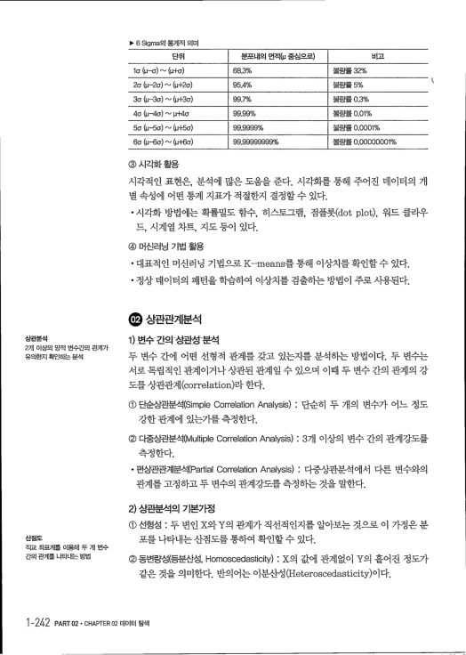
P 6 Sigma으I 통계적 의미 단위 분포내의 면적.」 줌심으로） 비고 1c 以』쌨7) ∼ (p-F미

68. 3% 
불량률 32% 2a (p-2a) 'S-' (p+2o)

95. 4% 
불량률 5% 3a (p-3o) ∼ (p+3o)

99. 7% 
불량률 0.3% 4o (j-4o) ^ p+40

99. 99% 
불량률 0 . 여％ 5a (p-So) -' (p-F5o)

99. 9999% 
불량률 0.0001% 6a (p-6o) 'S-' (p+6o)

99. 99999999% 
불량률 0.00000001% ③ 시각화 활용

#### 시각적인 표현은 , 분석에 많은 도움을 준다 . 시각화를 통해 주어진 데이터의 개
별 속성에 어떤 통계 지표가 적절한지 결정할 수 있다．

- 시각화 방법에는 확률밀도 함수 , 히스토그램 , 점플롯（dot plot) , 워드 클라우
드 , 시계열차트 , 지도등이 있다． ④ 머신러닝 기법 활용

#### · 대표적인 머신러닝 기법으로 K-means를 통해 이상치를 확인할 수 있다．
- 정상 데이터의 패턴을 학습하여 이상치를 검출하는 방법이 주로 사용된다．
.상관관계분석 상관분석 2개 이상의 양적 변수간의 관계가 유의한지 확인하는 분석 1）변수간의상관성‘분석

#### 두 변수 간에 어떤 선형적 관계를 갖고 있는지를 분석하는 방법이다 . 두 변수는
서로 독립적인 관계이거나 상관된 관계일 수 있으며 이때 두 변수 간의 관계의 강 도를 상관관계（correlation）라 한다．

#### ① 단순상관분석（Simple Correlation Analysis) : 단순히 두 개의 변수가 어느 정도
강한관계에 있는가를측정한다． ② 다중상관분석（Multiple Correlation Analysis) : 3개 이상의 변수 간의 관계강도를 측정한다．

#### · 편심단관계분석（Partial Correlation Analysis) : 다중상관분석에서 다른 변수와의
관계를 고정하고 두 변수의 관계강도를 측정하는 것을 말한다． 2) 상관분석의 기본가정 ① 선형성 : 두 변인 x와Y의 관계가 직선적인지를 알아보는 것으로 이 가정은 분 산점도 직교 좌표계를 이용해 두 개 변수 간의 관계를 나타내는 방법 포를 나타내는 산점도를 통하여 확인할 수 있다． ② 동변량성（틈분산성 , Homoscedasticity) : x의 값에 관계없이 Y의 흩어진 정도가

#### 같은 것을 의미한다 . 반의어는 이분산성（Heteroscedasticity）이다．
1-242 PART 02. CHAPTER 02데이터탐색

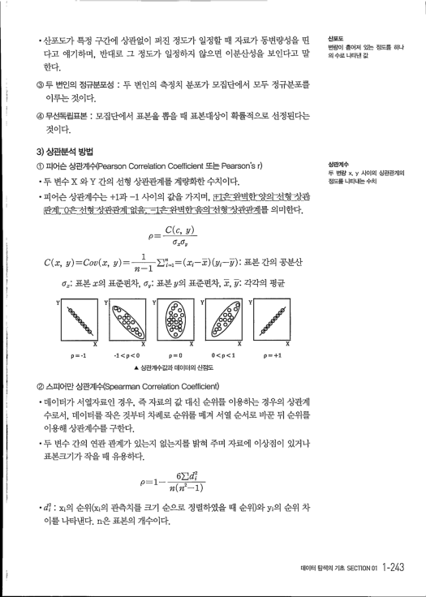
- 산포도가 특정 구간에 상관없이 퍼진 정도가 일정할 때 자료가 동변량성을 띤
다고 얘기하며 , 반대로 그 정도가 일정하지 않으면 이분산성을 보인다고 말 한다．

#### ③ 두 변인의 정규분포성 : 두 변인의 측정치 분포가 모집단에서 모두 정규분포를
이루는 것》이다． ④ 무선독립표본 : 모집단에서 표본을 뽑을 때 표본대상이 확률적으로 선정된다는 것이다． 3) 상관분석 방법 ① 피어슨 상관계수《Pearson Correlation Coefficient 또는 Pearson's r)

#### · 두 변수 x 와Y 간의 선형 상관관계를 계량화한 수치이다．
#### · 피어슨 상관계수는 +1과 -1 사이의 값을 가지며 , frt- 완병列 얏의-41형썅관
괸：졔FO寧：＝선혓켯뉨괸：폐E없：완－1孚r꾄뵈盤료갇긔뜨넌료캉쾰안戮를 의미한다．

### ')z c什， 끼 
c7y,

#### ∼ . 
.

∼ .

.

l _ ..

.

- . . 
- . －→ , , - , ∼ . - , , .. 
C(x, 끼＝=C'(7z7(z , 끼＝ , 全」7=1=（따－α7그（跳－－끼： 쑈논 산뷔 ㅎ분산 fl- I o.x: 표본 r의 표준편차 , c.y: 표본 Z／의 표준편차 , x, y: 각각의 평균

# Y 
\ x Y Y Y x x x p= o p=+1 p = 4 O<p.(1 -1 <p <0 ▲ 상관계수값과 데이터의 산점도 ② 스피어만 상관계수《Spearman Correlation Coefficient)

- 데이터가 서열자료인 경우 , 즉 자료의 값 대신 순위를 이용하는 경우의 상관계
수로서 , 데이터를작은 것부터 차례로순위를 매겨 서열 순서로 바꾼 뒤 순위를 이용해 상관계수를 구한다．

- 두 변수 간의 연관 관계가 있는지 없는지를 밝혀 주며 자료에 이상점이 있거나
표본크기가 작을 때 유용하다．

#### 艀1  
6刀꺅

#### 7z(, 2∼기
- 'zr :Xi의 순위（Xi의 관측치를 크기 순으로 정렬하였을 때 순위）와 Yi의 순위 차
#### 이를 나타낸다 . II은 표본의 개수이다．
> 산포도
> 변량이 흩어져 있는 정도를 해괘 
의 수로 나타닌昆尤

> 상관계수 
두 변량 × , y 사이의 상관관계의 정도를 나타내는 수치

> x
> 데이터탐색의기초SECTION 01 1 -243
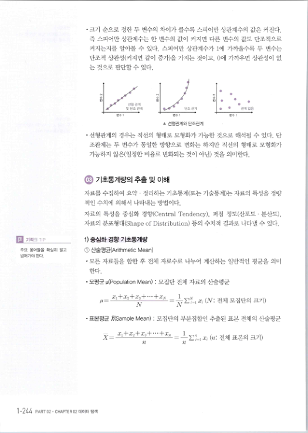
- 크기 순으로 정한 두 변수의 차이가 클수록 스피어만 상관계수의 값은 커진다． 
즉 스피어만 상관계수는 한 변수의 값이 커지면 다른 변수의 값도 단조적으로 커지는지를 알아볼 수 있다 . 스피어만 상관계수가 1에 가까울수록 두 변수는 단조적 상관성（커지면 같이 증가）을 가지는 것이고 , 0에 가까우면 상관성이 없 는 것으로 판단할 수 있다． 혀 ＋ 聊 히 ＋ 剖 선형 관계 및 단조 관걔 솔 변수 1 ▲ 선형관계와 단조관계

- 선형관계의 경우는 직선의 형태로 모형화가 가능한 것으로 해석될 수 있다 . 단
조관계는 두 변수가 동일한 방향으로 변화는 하지만 직선의 형태로 모형화가 가능하지 않은（일정한 비율로 변화되는 것이 아닌） 것을 의미한다． .

기초통계량의 추출 및 이해

#### 자료를 수집하여 요약 · 정리하는 기초통계（또는 기술통계）는 자료의 특정을 정량
적인 수치에 의해서 나타내는 방법이다．

#### 자료의 특성을 중심화 경향（Central Tendency) , 퍼짐 정도（산포도 · 분산도）,
자료의 분포형태（Shape of Distribution) 등의 수치적 결과로 나타낼 수 있다． 1) 중심화 경향 기초통계량 .

기적의 뀌p ① 산술평균（Arithmetic Mean) 주요 용어들을 확실히 알고 넘어가야 한다．

- 모든 자료들을 합한 후 전쳬 자료수로 나누어 계산하는 일반적인 평균을 의미
한다．

#### · 모펑균 ij(Population Mean) : 모집단 전체 자료의 산술평균
# /= " + " ＋샀 " ' + " ＝令＞＝꼍：x (N：전쳬모집단의크기）
#### · 표본평균 X(Sam이e Mean) : 모집단의 부분집합인 추출된 표본 전쳬의 산술평균
```python
无=  x1+ x2+ x3+ ...+ xn =즈－>＝씰 1x (n: 전쳬표본의 크기） 
1z 
1z
```
1 -244 PART 02 . CHAPTER 02 데이터 탐색

> `
> . 
S

> 히
十 피

> S 
.

S S .

● 관계 없음

> 변수 1
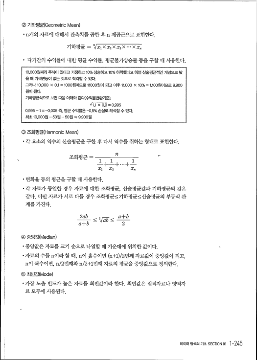
② 기하평균《Geometric Mean)

#### · n개의 자료에 대해서 관측치를 곱한 후 II 제곱근으로 표현한다．
기하평균 = n/x1 x x2 XT3 × … × xn

#### · 다기간의 수익률에 대한 평균 수익률 , 평균물가상승률 등을 구할 때 사용한다．
10. 000원짜리 주식이 있다고 가정하고 10% 상승하고 10% 하락했다고 하면 산술평균적인 개념으로 봤
을 때 가격변동이 없는 것으로 착각할 수 있다． 그러나 10.000 x 0.1 = 1000원이므로 11000원이 되고 이후 ㄲ .000 X 10% = 1.100원이므로 9900 원이 된다． 기하펑균식으로 보면 다음 아래와 같다（수익률변환기준）.

γ1 . 1 x 0.9 = 0.995

0. 995 -1 = -0.005 즉 . 펑균 수익률은 -0.5% 손실로 해석할 수 있다．
최초 10.000원 - 50원 - 50원 == 9.900원 ③ 조톼평균《Harmonic Mean)

- 각 요소의 역수의 산술평균을 구한 후 다시 역수를 취하는 형태로 표현한다．
#### n
#### 조화펏규 = 
' 一 - 1 . 1 1 ＇∼ .

.

X1 X2 .z7,'

- 변화율 등의 평균을 구할 때 사용한다．
- 각 자료가 동일한 경우 자료에 대한 조화평균 , 산술평균값과 기하평균의 값은 
같다 . 다만 자료가 서로 다를 경우 조화평균<기하평균<산술평균의 부등식 관 계를 가진다．

# 2ab
a+ b 三 ' 7ㅍF三 " 玄b ④ 중앙값曲edian)

- 중앙값은 자료를 크기 순으로 나열할 때 가운데에 위치한 값이다．
#### · 자료의 수를 II이라 할 때 , II이 홀수이면 (n+1)/2번째 자료값이 중앙값이 되고， 
II이 짝수이면 , n/2번째와 n/2+1번깨 자료의 평균을 중앙값으로 정의한다． ⑤ 최빈값（Mode)

#### · 가장 노출 빈도가 높은 자료를 최빈값이라 한다 . 최빈값은 질적자료나 양적자 
료 모두에 사용된다．

> 데이터탐색의기초SECTION 01 1-245
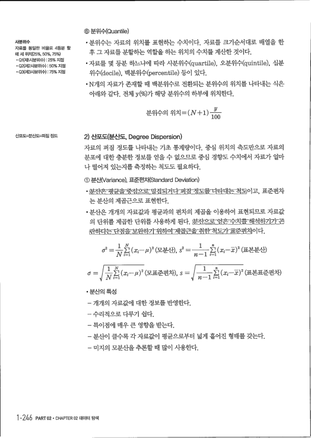
⑥ 분위수《Quantile)

#### · 분위수는 자료의 위치를 표현하는 수치이다 . 자료를 크기순서대로 배열을 한
사분위수 자료를 동일한 비율로 4등분 할 후 그 자료를 분할하는 역할을 하는 위치의 수치를 계산한 것이다． 때 세 위치（25%, 50%. 75%)

- 01（제1사쀼 수） :25% 지점 
- 02（제2사분위수） : 50% 지점
#### · 자료를 몇 등분 하느냐에 따라 사분위수（quartile) , 오분위수（quintile) , 십분
#### 위수（decile) , 백분위수（percentile) 등이 있다．
이Q3（제3사분위수） :75% 지점

- N개의 자료가 존재할 때 백분위수로 전환되는 분위수의 위치를 나타내는 식은
아래와 같다 . 전쳬 y(%）가 해당 분위수의 하부에 위치한다．

## 분위수의 위치＝(N+i)揚
#### 2) 산포도《분산도 , Degree Dispersion)
산포도＝분산도＝퍼짐 정도

#### 자료의 퍼짐 정도를 나타내는 기초 통계량이다 . 중심 위치의 측도만으로 자료의
분포에 대한 충분한 정보를 얻을 수 없으므로 중심 경향도 수치에서 자료가 얼마 나 떨어져 있는지를 측정하는 척도도 필요하다． ① 분신（Variance) , 표준편ㅊKStandard Deviation)

#### ·得쒸孝＝평균貧豊심＝으: : 밈긱돠거다＝퍼칙켱즈걍를：다희크ㅖ 
첨도이고 , 표준편차

#### 는 분산의 제곱근으로 표현한다 .
- 분산은 개개의 자료값과 평균과의 편차의 제곱을 이용하여 표현되므로 자료값
의 단위를 제곱한 단위를 사용하게 된다 . 蹇챨；으＝r 얻은：薑희를＝홰석흐｝괴괴돈굣 i란하다큭r단점竇보；환ㅎㅂㅍ쐬흐階긔찹77 “요－취하척도기그墜뾰촤이다．

### , 스1 僉（:f－노） 
" （표본분산） 一 i （보분산） " =

#### / 1 L. , 
. , . --- . , . .

/ 1 스 .

- . , . .－→－→－ , 논，. 
l =7섭 (x1-／시 ' （그工： －코＝순三션자그 , S == ㅣ . 2．」 ( xi- izU∼ （쑈논」소뛴콰선작） v .LV i=1 v n- i ,=1

- 분산의 특성
- 개개의 자료값에 대한 정보를 반영한다．
- 수리적으로 다루기 쉽다．
- 특이점에 매우 큰 영향을 받는다．
- 분산이 클수록 각 자료값이 평균으로부터 넓게 흩어진 형태를 갖는다．
- 미지의 모분산을 추론할 때 많이 사용한다．
ㅑ 46 PART02· CHAPTER 02데이터탐색

> 一
-

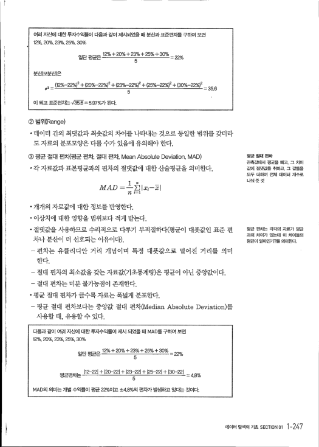
여러 자산에 대한 투자수익률이 다음과 같이 제시되었을 때 분산과 표쥡젼차를 구하여 보면 12%, 20%. 23%. 25%. 30%

### 일단평균은12% 
+ 20% + 2誓6 + 25% + 30%= 22%
분신l모분산）은 (12%_22%)2 + (20%_22%)2 + (23%_22%)2 + (25%_22%)2 + (30%_22%)2 C" =

- 
= Ut〕 . b b 이 되고 표쥡젼차는 v騙ㅠ= 5.97％가 된다． ② 범위（Range) . 데이터 간의 최댓값과 최솟값의 차이를 나타내는 것으로 동일한 범위를 갖더라 도 자료의 분포모양은 다를 수가 있음에 유의해야 한다． ③ 평균 절대 편차（평균 편차, 절대 편차, Mean Absolute Deviation, MAD)

- 각 자료값과 표본평균과의 편차의 절댓값에 대한 산술평균을 의미한다．
#### 지
#### MAD=
fl z=

- 개개의 자료값에 대한 정보를 반영한다．
- 이상치에 대한 영향을 범위보다 적게 받는다．
- 절댓값을 사용하므로 수리적으로 다루기 부적절하다（평균이 대푯값인 표준 편 
차나 분산이 더 선호되는 이유이다）.

- 편차는 유클리디안 거리 개넘이며 특정 대푯값으로 떨어진 거리를 의미
한다．

- 절대 편차의 최소값을 갖는 자료값（기초통계량）은 평균이 아닌 중앙값이다．
- 절대 편차는 미분 불가능점이 존재한다．
- 평균 절대 편차가 클수록 자료는 폭넓게 분포한다．
- 평균 절대 펀차보다는 중앙값 절대 편차（Median Absolute Deviation）를
#### 사용할 때 , 유용할 수 있다．
다음과 같이 여러 자산에 대한 투자수익률이 제시 되었을 때 MAD를 구하여 보면 12%, 20%. 23%, 25%. 30%

### 일단평균은12% 
+ 20% + 2뿡6 + 25% + 30% = 22%
평균편채는  "2-뙤시20-2의 꿰23-2의시25-2의시30-2의 = 4.8% b MAD의 의미는 개별 수익률이 펑균 22％이고 土4.8％의 편차가 발생하고 있다는 것이다．

> 평균 절대 편차 
관측값에서 펑균을 빼고 , 그 차이 값에 절댓값을 취하고， 그 값들을 모두 더하여 전체 데이터 개수로 나눠 준 것

> 평균 편차는 각각의 자료가 평균 
과의 차이가 있는데 이 차이들의 평균이 얼마인가？룰 의미한다．

> 데이터탐색의기초SECTION 01 1 -247
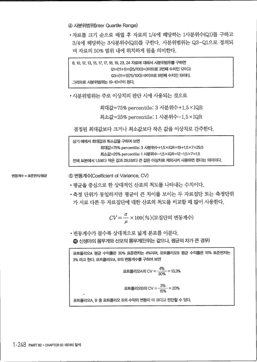
④ 사분위범위ㅇnter Quartile Range)

- 자료를 크기 순으로 배열 후 자료의 1/4에 해당하는 1사분위수（Q1）를 구하고
#### 3/4에 해당하는 3사분위수（Q3）를 구한다 . 사분위범위는 Q3-Q1으로 정의되
며 자료의 50% 범위 내에 위치하게 됨을 의미한다．

8. 10. 12. 13. 15. 17. 17.18, 19. 23. 24자료에 대해서 사분위범위를구하면
미=(111-1)x(25/100)=3이므로 3번째 수치인 12이고 03=(11+1)(75/100)=9이므로 9번째 수치인 19이다． 그러므로 사분위범위는 19-12=7이 된다．

- 사분위범위는 주로 이상치의 판단 시에 사용되는 것으로
최대값＝75% percentile: 3 사분위수＋1.5 xIQR

#### 최소값＝25% percentile: 1 사분위수－1.5 ×IQR
결정된 최대값보다 크거나 최소값보다 작은 값을 이상치로 간주한다． 상기 예에서 최대값과 최소값을 구하여 보면 최대값＝75% percentile: 3 사분위수＋1.5 x IQR=19+1.5 x7=29.5 최소값＝25% percentile: 1 사분위수－1.5x1QR=12-1.5X7=1.5 전체 표본에서 1.5보다 작은 값과 29.5보다 큰 값은 이상치로 제외시켜 사용하면 된다는 의미이다． ⑤ 변동계수（Coefficient of Variance, CV) 변동계수 = 표준편치／평균

- 평균을 중심으로 한 상대적인 산포의 척도를 나타내는 수치이다．
- 측정 단위가 동일하지만 평균이 큰 차이를 보이는 두 자료집단 또는 측정단위
가 서로 다른 두 자료집단에 대한 산포의 척도를 비교할 때 많이 사용한다．

#### 0 
. - . .

. . . ' . .-..

, cγ＝ 스 × 100 ( % )（모집．단의. 변．동계．수） /z

- 변동계수가 클수록 상대적으로 넓게 분포를 이룬다．
cII 신생아의 몸무게와 산모의 뚜L게（단위는 겉므나, 펑균의 차가 큰 경우） 포트폴리도＾ 평균 수익률은 30% 표췐차는 4％이며 . 포트폴리오B 펑균 수익률은 15% 표준펀차는 3% 라고 힌다. 포트폴리오A. B의 변동계수를 구하여 보면

- 
. -

- . -. ' 
4% 쪼트놀리노A늬 Uv == ==== = 〕：3.:,｀拓 .iU7o

- 
. -- - . -. .

3% ---.

쏘브놀리노L3느쇠 UV = -===- = zU닝b I7o 7 포트폴리오A. B 중 포트폴리오 B의 수익의 변동이 더 크다고 판단할수 있다． 1, -248 PART 02 ' CHAPTER 02데이터탐색

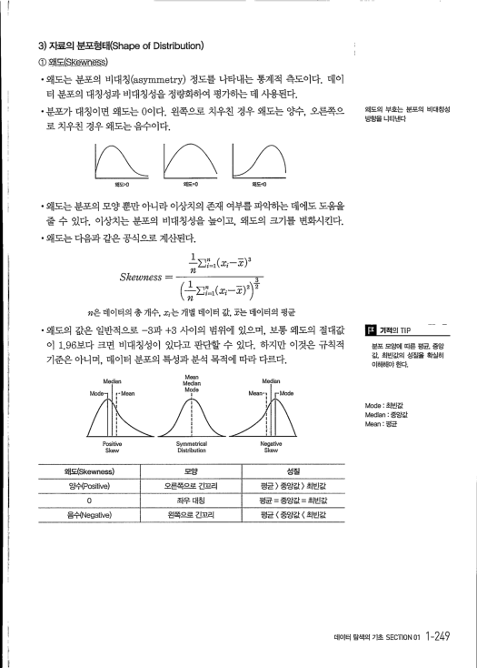
3) 자료의 분포형태（Shape of Distribution) ① 왜도（跡蘆，奴幀來）

- 왜도는 분포의 비대칭（asymmetry) 정도를 나타내는 통계적 측도이다 . 데이
터 분포의 대칭성과 비대칭성을 정량화하여 평가하는 데 사용된다．

- 분포가 대칭이면 왜도는 0이다 . 왼쪽으로 치우친 경우 왜도는 양수 , 오른쪽으
로 치우친 경우 왜도는 음수이다． 왜도=0 왜도＜（〕

- 왜도는 분포의 모양 뿐만 아니라 이상치의 존재 여부를 파악하는 데에도 도움을
#### 줄 수 있다 . 이상치는 분포의 비대칭성을 높이고 , 왜도의 크기를 변화시킨다．
- 왜도는 다음과 같은 공식으로 계산된다．
스刀；휄 , (z,－쪼）3

# Skewness = 
n , (+刀； 蚣은 데이터의 총 개수 , xi는 개별 데이터 값 , 王는 데이터의 평균

- 왜도의 값은 일반적으로 -3과 +3 사이의 범위에 있으며 , 보통 왜도의 절대값
#### 이 1.96보다 크면 비대칭성이 있다고 판단할 수 있다 . 하지만 이것은 규칙적
기준은 아니며 , 데이터 분포의 특정과분적 목적에 따라 다르다． Mean Median Mode Median

#### ean-i i- M。de 
l Symmetrical Distribution Negafvo Skew Positive 8kew 왜도（하（ewness) 모양 성질 양수《Positive) 오른쪽으로 긴꼬리 평균 > 중앙값 > 최빈값 0 좌우 대칭 평균 = 중앙값 = 최빈값 음수《Negative) 왼쪽으로 긴꼬리 평균 < 중앙값 < 최빈값

> 왜도의 부호는 분포의 비대칭성
> 방힝을 나타낸다
> 분포 모양에 따른 평균 , 중앙 
값 . 최빈값의 성질을 확실히

> 이해해야한다．
> Mode : 최빈값 
Median : 중앙값 Mean : 평균

> 데이터탐색의기초SECTION 01 ㅑ 
4?

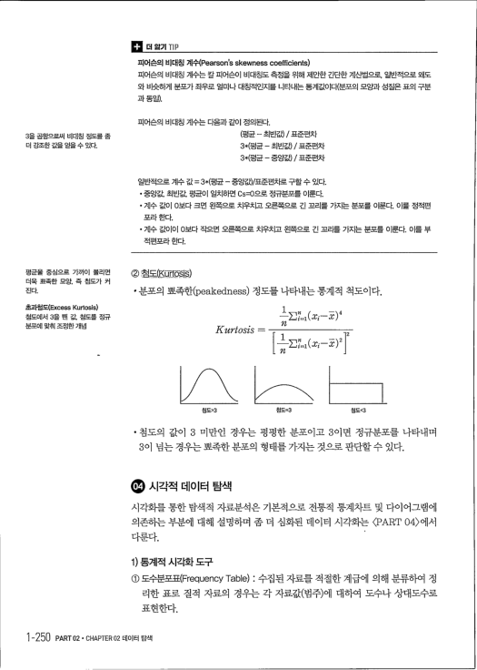
피어슨의 비대칭 계수（Pearson's skewness coefficients) 피어슨의 비대칭 계수는 칼 피어슨이 비대칭도 측정을 위해 제안한 간단한 계산법으로， 일반적으로 왜도 와 비슷하게 분포가 좌우로 얼마나 대칭적인지를 나타내는 통계값이다（분포의 모양과 성질은 표의 구분 과동일）.

피어슨의 비대칭 계수는 다음과 같이 정의된다． （펑균 - 최빈값） / 표召젼차 3을 곱함으로쩌 비대칭 정도를 좀 더 강조한 값을 얻을 수 있다． 3*（평균－ 최빈값） / 표준편차 3*（평균 - 중앙값） / 표쫀l차 일반적으로 계수 값 = 3*（펑균 - 중앙값）／표준편차로 구할 수 있다．

- 중앙값, 최빈값. 평균이 일치하면 Cs=U으로 騈구분포를 이룬다．
- 계수 값이 0보다 크면 왼쪽으로 치우치고 오른쪽으로 긴 꼬리를 가지는 분포를 이룬다. 이를 정적편
포라 한다．

- 계수 값이이 0보다 작으면 오른쪽으로 치우치고 왼쪽으로 긴 꼬리를 가지는 분포를 이룬다. 이를 부
적편포라 한다． （聊첨도（K硼l亘飾蓼） 평균을 중심으로 가까이 몰리면 더욱 뾰족한 모양 . 즉 첨도가 커

- 분포의 뾰족한（peakedness) 정도를 나타내는 통계적 척도이다．
진다． 초과첨도（Excess Kurtosis) 첨도에서 3을 뺀 값． 첨도를 장규 분포에 맞춰 조정한 개념

# 츠끄：」닙 , （驪，－工）4 
n 陽＞D； 휄：(:7－끼" 7<urtosis = 첨도븝3 첨도＜3 첨도＞3

- 첨도의 값이 3 미만인 경우는 평평한 분포이고 3이면 정규분포를 나타내며
3이 넘는 경우는 뾰족한 분포의 형태를 가지는 것으로 판단할 수 있다． .

시각적 데이터 탐색 시각화를 통한 탐색적 자료분석은 기본적으로 전통적 통계차트 및 다이어그램에 의존하는 부분에 대해 설명하며 좀 더 심화된 데이터 시각화는 <PART 04〉에서 다룬다． 1) 통계적 시각화 도구 ① 도수분포표（Frequency Table) : 수집된 자료를 적절한 계급에 의해 분류하여 정 리한 표로 질적 자료의 경우는 각 자료값（범주）에 대하여 도수나 상대도수로 표현한다． 1-250 PART 02. CHAPTER 02더I이터탐색

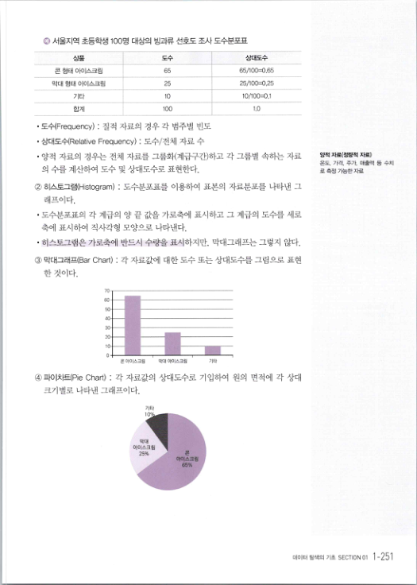
#### .I 서울지역 초등학생 100명 대상의 빙과류 선호도 좌 도수분포표
상품 도수 싱대도수 콘 형태 아이스크림 65 65/100눼）.65 막대 형태 아이스크림 25 25/100=0.25 기타 10 10/100섰）.1 합계 100

1. 0
- 도수（Frequency) : 질적 자료의 경우 각 범주별 빈도
- 상대도수《Relative Frequency) : 도수／전쳬 자료 수
- 양적 자료의 경우는 전체 자료를 그룹화什ㅖ급구간）하고 각 그룹별 속하는 자료
의 수를 계산하여 도수 및 상대도수로 표현한다． ② 히스토그램（Histogram) : 도수분포표를 이용하여 표본의 자료분포를 나타낸 그 래프이다．

- 도수분포표의 각 계급의 양 끝 값을 가로축에 표시하고 그 계급의 도수를 세로
축에 표시하여 직사각형 모양으로 나타낸다 .

- 히스토그램은 가로축에 반드시 수량을 표시하지만 , 막대그래프는 그렇지 않다 .
③ 막대그래프（Bar Chart) : 각 자료값에 대한 도수 또는 상대도수를 그림으로 표현

# 10。 I 
.

l 콘 아이스크림 막대 아이스크림 한 것이다． 70 60 50 40 30 20 ④ 파이차트（Pie （가，art) : 각 자료값의 상대도수로 기입하여 원의 면적에 각 상대 크기별로 나타낸 그래프이다．

> 양적 자료（정량적 자료）
> 온도， 가격 . 주가 . 매출액 등 수치 
로 측정 가능한 자료

> 데이터 탐색의 기초 SECTION 01 1 -2引
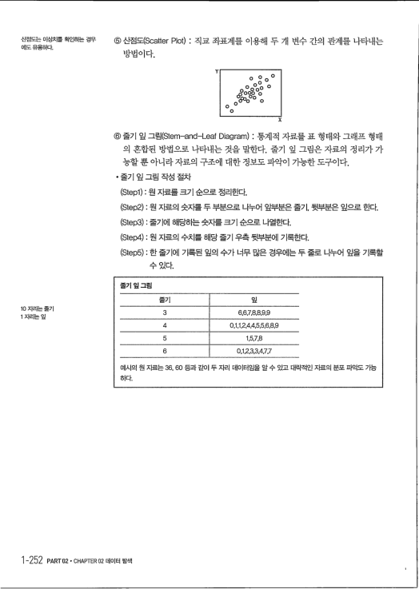
산점도는 이상치를 확인하는 경우 에도듀용하다． ⑤ 산점도（Scatter Plot) : 직교 좌표계를 이용해 두 개 변수 간의 관계를 나타내는 방법이다． 0 0r o '-So - 0 0 o 000 0 U 。。 。 " 0 0 x ⑥ 줄기 잎 그림（Stem-and-Leaf Diagram) : 통계적 자료를 표 형태와 그래프 형태 의 혼합된 방법으로 나타내는 것을 말한다 . 줄기 잎 그림은 자료의 정리가 가 능할 뿐 아니라 자료의 구조에 대한 정보도 파악이 가능한 도구이다．

- 줄기 잎 그림 작성 절차
(Stepi) : 원 자료를 크기 순으로 정리한다． (Step2) : 원 자료의 숫자를 두 부분으로 나누어 앞부분은 줄기 , 뒷부분은 잎으로 한다． (Step3) : 줄기에 해당하는 숫자를 크기 순으로 나열한다 .

(5tep4) : 원 자료의 수치를 해당 줄기 우측 뒷부분에 기록한다． (5tep5) : 한 줄기에 기록된 잎의 수가 너무 많은 경우에는 두 줄로 나누어 잎을 기록할 수 있다． 줄기 잎 그림 줄기 잎 1(〕 자리는 줄기 1 자리는 잎 3

6. 6.7.8.8.9.9
4

0. 1.12.4.4.5.5.6.8.9
5

1. 5.7.8
6

0. 1.2.3.3.4.7.7
예시의 원 차료는 36. 60 등과 같이 두 자리 데이터임을 알 수 있고 대략적인 차료의 분포 파악도 가능 하다． 1-252 PART02. CHAPTER 02데이터탐색

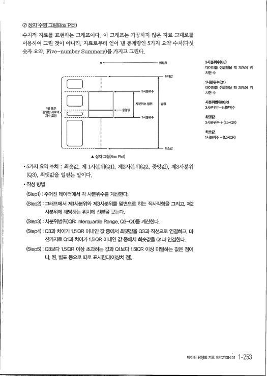
⑦ 題驢陸섶염긴＝I림（터亘K珏D 수치적 자료를 표현하는 그래프이다 . 이 그래프는 가공하지 않은 자료 그대로를 이용하여 그린 것이 아니라 , 자료로부터 얻어 낸 통계량인 5가지 요약 수치（다섯 슷자요약 , Five-number Summary）를 가지고 그린다． 이상치 최대값 쎄 3사분위수 범위 4곳 모두 동일한 자료의 눼 개수포함 ( ) *-－중앙값 ` 최소값 ▲ 상자그림＜Box 더ot) .5가지 요약수치 : 최솟값 , 제 1사분위（Q1) , 제2사분위（Q2 , 중앙값） , 제3사분위 (Q3) , 최댓값을 일컫는말이다．

- 작성 방법
(Stepl) : 주어진 데이터에서 각 사분위수를 계산한다． (Step2) : 그래프에서 제1사분위와 제3사분위를 밑변으로 하는 직사각형을 그리고 , 제2 사분위에 해당하는 위치에 선분을 긋는다． (Step3) : 사분위범위ㅇOR: nterquartile Range, 03-01）를 계산한다． (Step4) : 03과 차이가 1.510R 이내인 값 중에서 최댓값을 03과 직선으로 연결하괴 마 찬가지로 01과 차이가 1.510R 이내인 값 중에서 최솟값을 01과 연결한다 .

(Step5) : 03보다 t5!QR 이상 菰 하는 값과 01보다 t5IQR 이상 미달하는 값은 점이 나, 원 , 별표 등으로 따로 묘치한다（이상치 점）.

> 3사분위수（Q3)
> 데이터를 정렬했을 ［대 75％에 위 
치한수

> 1사분위수（Qi)
> 데이터를 정렬했을 때 25％에 위 
치한수

> 사분위범위（IQR) 
3사쀼l수－1사분위수

> 최댓값 
3사쀼수 + (t5*IQR)

> 최솟값
> 1사분위수 - (1.5*IQR)
> 데이터탐생의기초SECTION 01 ㅑ 53
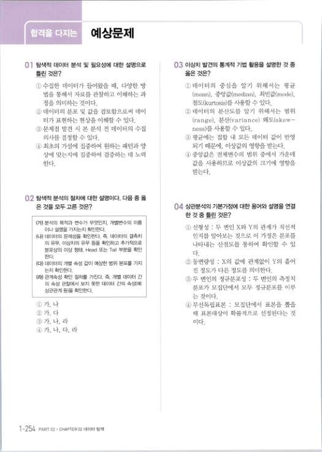
## 예상문제
03 이상치 발견의 통계적 기법 활용을 설명한 것 중 탐색적 데이터 분석 및 필요성에 대한 설명으로 옳은 것은？ 틀린 것은？ ①데이터의 중심을 알기 위해서는 평균 (mean) , 중앙값（median) , 최빈값（mode), 첨도（kurtosis）를 사용할 수 있다． ②데이터의 분산도를 알기 위해서는 범위 (range) , 분산（variance) 왜도（skew- ①수집한 데이터가 들어왔을 때 , 다양한 . 방 법을 통해서 자료를 관찰하고 이해하는 과 정을 의미하는 것이다． ② 데이터의 분포 및 값을 검토함으로써 데이 터가 표현하는 현상을 이해할 수 있다． ③문제점 발견 시 본 분적 전 데이터의 수집 의사를 결정할 수 있다． ④ 최초의 가설에 집중하여 원하는 패턴과 양 상에 맞는지에 집중하여 검증하는 데 노력 ness）를 사용할 수 있다． ③ 평균에는 집합 내 모든 데이터 값이 반영 되기 때문에 , 이상값의 영향을받는다． ④중앙값은 전체변수의 범위 중에서 가운데 값을 사용하므로 이상값의 크기에 영향을 받는다 .

한다． 02 탐색적 분석의 절차에 대한 설명이다 . 다음 중 옳 은 것을 모두 고른 것은？ C 상관분석의 기본가정에 대한용어와 설명을 연결 한 것 중 틀린 것은？ （가） 분석의 목적과 변수가 무엇인지 , 개별변수의 이름 이나 설명을 가지는지 확인한다． ① 선형성 : 두 변인 x와 Y의 관계가 직선적 인지를 알아보는 것으로 이 가정은 분포를 （나） 데이터의 문제성을 확인한다 . 즉 , 데이터의 결측치 의 유무 , 이상치의 유무 등을 확인하고 추가적으로 나타내는 산점도를 통하여 확인할 수 있 분포상의 이상 형태 , Head 또는 Ta∥ 부분을 확인 다． ②동변량성 : x의 값에 관계없이 Y의 흩어 진 정도가 다른 정도를 의미한다． ③두 변인의 騈予분포성 : 두 변인의 측정치 분포가 모집단에서 모두 蔘予분포를 이루 는 것이다． ④무선독립표본 : 모집단에서 표본을 뽑을 힌다． （다） 데이터의 개별 속성 값이 예상한 범위 분포를 가지 는지 확인힌다． （라） 관겨嘴성 확인 절차를 가진다 . 즉 , 개별 데이터 간 의 속성 관찰에서 보지 못한 데이터 간의 속성（예： 상관관계 등）을 확인한다 .

① 가 , 나 ② 가 , 다 ③ 가 , 나 , 라 ④ 가 , 나 , 다 , 라 때 표본대상이 확률적으로 선정된다는 것 이다． 1 -254 PART 02 . CHAPTER 02 데이터 탐색

> 「 
' . 「 ' ‘∼． -

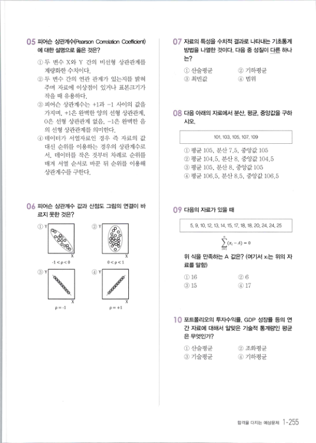
자료의 특성을 수치적 결과로 나타내는 기초통계 05 피어슨 상관계쉬Pearson Correistion Ceafficient) 에 대한 설명으로 옳은 것은？ 방법을 나열한 것이다 . 다음 중 성질이 다른 하나 는？ ①두 변수 x와 Y 간의 비선형 상관관계를 ① 산술평균 ③ 최빈값 ② 기하평균 ④ 범위

#### 계량화한수치이다． 
② 두 변수 간의 연관 관계가 있는지를 밝혀 주며 자료에 이상점이 있거나 표본크기가 작을 때 유용하다． ③ 피어슨 상관계수는 +1과 -1 사이의 값을 가지며 , +1은 완벽한 양의 선형 상관관계， 0은 선형 상관관계 없음 , -1은 완벽한 음 의 선형 상관관계를 의미한다． ④데이터가 서열자료인 경우 즉 자료의 값 대신 순위를 이용하는 경우의 상관계수로 （緡 다음 아래의 자료에서 분산 , 평균 , 중앙값을 구하 시오． ① 평균 105 , 분산 7.5 , 중앙값 105 ②평균 104.5 , 분산8 , 중앙값104.5 ③평균105 , 분산8 , 중앙값105 ④ 평균 106.5 , 분산 8.5 , 중앙값 106.5 서 , 데이터를 작은 것부터 차례로 순위를 매겨 서열 순서로 바꾼 뒤 순위를 이용해 상관계수를 구한다． J6 피어슨 상관계수 값과 산점도 그림의 연결이 바 09 다음의 자료가 있을 때 르지 못한 것은？

5. 9. 10. 12. 13. 14. 15. 17. 18. 18. 20. 24. 24. 25
囹）Y

# @)Y 
灰 x 1<p< o ① Y 위 식을 만족하는 A 값은？ （여기서 x는 위의 자 료를 말함）

# 너 
V / E 16 ② 6 ③15 ④ 17 x p= -1 포트폴리오의 투자수익률 , GDP 성장률 등의 연 간 자료에 대해서 알맞은 기술적 통계량인 평균 은 무엇인가？ ① 산술평균 ③ 기술평균 ② 조화평균 ④ 기하평균

> 101, 103. 105, 107, 109
> 슨
， 습

> ㅡ
> 겨
> 훼
> 합격을다지는예상문제 ㄴ255
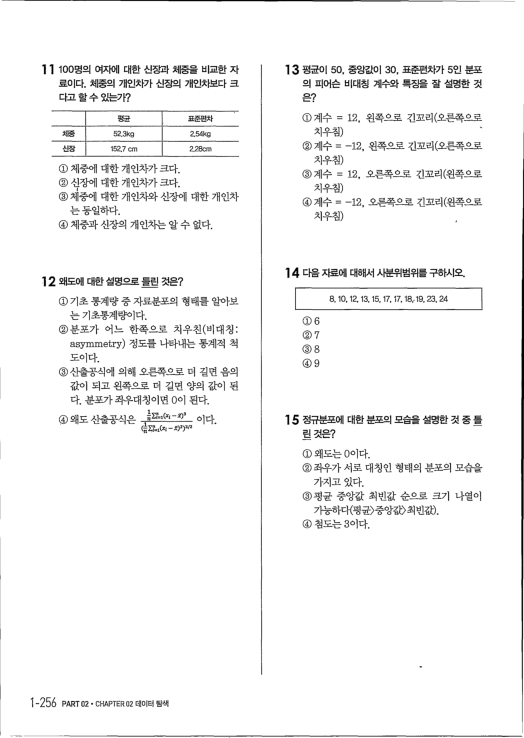
1 1 100명의 여자에 대한 신창과 처厓을 비교한 자 13 평균이 50 , 중앙값이 30 , 표준편차가 5인 분포 료이다 , 체중의 개인차가 신장의 개인차보다 크 다고 할 수 있는가？ 의 피어슨 비대칭 계수와 특징을 잘 설명한 것 은？ ①계수 = 12 , 왼쪽으로 긴꼬리（오른쪽으로 평균 표준편차 치우침） ' ② 계수 = -12 , 왼쪽으로 긴꼬리（오른쪽으로

2. 5따(g
치屠

52. 3kg
152. 7 cm
a28cm 신장 치우침） ③계수 = 12 , 오른쪽으로 긴꼬리（왼쪽으로 ① 쳬중에 대한 개인차가 크다． ② 신장에 대한 개인차가 크다． ③ 쳬중에 대한 개인차와 신장에 대한 개인차 는동일하다． ④ 쳬중과 신장의 개인차는 알 수 없다． 치우침） ④ 계수 = -12 , 오른쪽으로 긴꼬리（왼쪽으로 치우침） 14 다음 자료에 대해서 사분위범위를 구하시오． 12 와匡에 대한 설명으로 틀린 것은？

8. 10. 12, 13. 15. 17. 17. 18,.19. 23. 24
① 기초 통계량 중 자료분포의 형태를 알아보 는 기초통계량이다． ②분포가 어느 한쪽으로 치우친（비대칭： asymmetry) 정도를 나타내는 통계적 척 ①）6 ② 7 (E) 8 @9 도이다． ③ 산출공식에 의해 오른쪽으로 더 길면 음의 값이 되고 왼쪽으로 더 길면 양의 값이 된 다. 분포가좌우대칭이면 0이 된다． ④왜도산출공식은 . 눔ㅆ - 2) ' 이다． 塏￡衡（雜f -2)2yI2 1 5 정규분포에 대한 분포의 모습을 설명한 것 중 틀 린 것은？ ① 왜도는 0이다． ② 좌우가 서로 대칭인 형태의 분포의 모습을 가지고 있다． ③평균 중앙값 최빈값 순으로 크기 나열이 가능하다（평균〉중앙값〉최빈값）.

④ 첨도는 3이다． 1-256 PART02. CHAPTER02데이터탐색

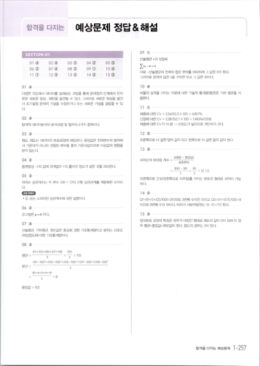
## 예상문제 정답＆해설
09 《j；》 ………………∼－…………… ………………………－………

#### 산술평균 x의 성질로 
Z(::－￡）체 차료 낟술평균의 전체의 합은 편차를 의미하며 그 값은 0이 된다． 그러므로 문제의 답은 x을 구하연 돠고 그 값은 16이다． Ui （互＞ U2 ④ 07 （乙 03 ③ 04 ② 05 c) 06 （零 08 c) 13 c) 09 ① 枉》c) 15 （亘：I 12 （軫 14 ② 11cD 10 ④ .... .... .... ... .... ... .... ........ ... .... ........ .... ... .... ........ ............. .... ........ ........ ........ .... .. ..

비율의 성격을 가지는 자료에 대한 기술적 통계링乂평균）은 기하 평균을 사 다양한 각도에서 데이터를 살펴보는 과정을 통해 문제정의 단계에서 인지 못한 새로운 양상 . 패턴을 발견할 수 있다． 그러므로 새로운 양상을 발견 시 초기설정 문제의 가설을 수정하거나 또는 새로운 가설을 설립할 수 있 용한다． 11 (D ………… ……『……………－…………………………『 체중에 대한 CV = 2. 54/523 X 100 = 4.857% 02 C) ………………………… …………∼… 신장에 대한 cv = 2.28/15a7 X 100 = 1.493％이므로 ㅊl懼；《게 대한 cv가 더 큼 → 산포도가 넓으므로 개인차가 크다． 탐색적 데이터분석의 분석과정 및 절차의 4가지 항목이다． 12 《쵸：) ... .... .... ... .... ... .... ........ ...

. … .

… .

03 （③ ............................... .......................................... ......... ..

오른쪽오로 더 길면 양의 값이 돠고 왼쪽으로 더 길면 음의 값이 된다． 첨도， 왜도는 데이터의 분포모양에 해당된다 . 중앙값은 전쳬변수의 범위에 서 가운데가 아니라 관찰된 변수들 중의 가운데값이므로 이상값의 영향을 13 ③ .........

받지 않는다． 피어슨의비대칭계수＝ 毓평二- 값） 04 ② .......................................................... ..... .. ......... ........ .... ... .... ...................................

동변량성 : ×의 값에 관계없이 Y의 흩어진 정도가 같은 것을 의미한다． 05 ③ ，…………………… … … … ∼ ……… … 오른쪽으로 긴꼬리（왼쪽으로 치우침＞를 가지는 분포의 형태로 파악이 가능 피어슨 상관계수는 두 변수 )〈와 7 간의 선형 상관관계를 계량화한 수치이 하다． 다． 오답 피하기 14 ② ......................................... . . . ... ... .... ... ... .... ... .... ... ... ..... .... ... .... ... .... ... .... ......... ........ .

- (2>. ④는 스피어만 상관71F수에 대한 설명이다．
이=(11+1)x(25/100)=3이므로 3번째 수치인 12이고 Q3=(11+1)(75/100)=9 이므로 9번째 수치 19이다． 따라서 사분위범위는 19-12=7이 된다． 06 ② ........................

②그림은 p =0 이다．.

15 ③ … . .

…… … . … ……∼ 정규분포 모양의 특징은 좌우가 대칭인 형태로 왜도의 값이 0이 되며 이 경 우 평균＝중앙값쑈최빈값이 된다 . 청도의 경우는 3이 된다． 07 ④ .. ..... .......................... .... ... .... ........ ........ . . ... .... ... ... .... ........ .

산술평균. 기하평균 , 최빈값은 중심화 경향 기초통계량이고 범위는 산포도 （퍼짐정도）에 대한 기초통계량이다． 08 ③ 101+103+105+107+109 525 평균＝ 5 - 5 5 =105 (101 _105)2+(103_105)2+(105_105)2+(107 l05)2+(109_105)2 분산 = 5 lE가z나《거 펴 16 5 =8 중앙값 = 105

> 3(50- 30)
> 卽,
> 0
> 합격을다지는예상문제 1-257
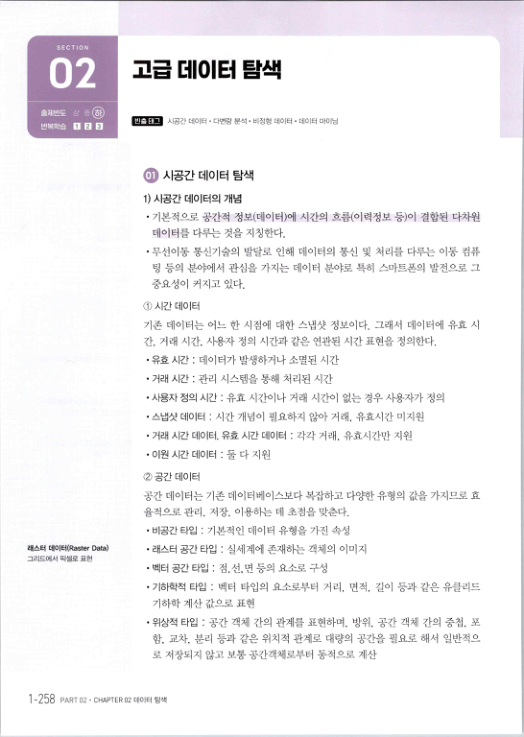
# SE CU 0 N 
02

# 고급 데이터 탐색
출제빈도 （靭 빈출 내그 시공간 데이터 · 다변량 분석 · 비정형 데이터 · 데이터 매기닝 반복학습 r~ . .

### .l 시공간 데이터 탐색
1) 시공간 데이터의 개념

- 기본적으로
공간적 정보（데이터）에 시간의 흐름（이력정보 등）이 결합된 다차원 데이터를 다루는 것을 지칭한다．

- 무선이동 통신기술의 발달로 인해 데이터의 통신 및 처리를 다루는 이동 컴퓨
팅 등의 분야에서 관심을 가지는 데이터 분야로 특히 스마트폰의 발전으로 그 중요성이 커지고 있다． ① 시간 데이터 기존 데이터는 어느 한 시점에 대한 스냅샷 정보이다 . 그래서 데이터에 유효 시 간 , 거래 시간 , 사용자 정의 시간과 같은 연관된 시간 표현을 정의한다．

#### · 유효 시간 : 데이터가 발생하거나 소멸된 시간
#### · 거래 시간 : 관리 시스템을 통해 처리된 시간
#### · 사용자 정의 시간 : 유효 시간이나 거래 시간이 없는 경우 사용자가 정의
- 스냅샷 데이터 : 시간 개념이 필요하지 않아 거래 , 유효시간 미지원
- 거래 시간 데이터 , 유효 시간 데이터 : 각각 거래 , 유효시간만 지원
- 이원 시간 데이터 : 둘 다 지원
② 공간 데이터 공간 데이터는 기존 데이터베이스보다 복잡하고 다양한 유형의 값을 가지므로 효 율적으로 관리 , 저장 , 이용하는 데 초점을 맞춘다．

#### · 비공간 타입 : 기본적인 데이터 유형을 가진 속성
#### · 래스터 공간 타입 : 실세계에 존재하는 객쳬의 이미지
래스터 데이터（Raster Data) 그리드에서 픽셀로 표현

#### · 벡터 공간 타입 : 점 , 선 , 면 등의 요소로 구성
#### · 기하학적 타입 : 벡터 타입의 요소로부터 거리 , 면적 , 길이 등과같은 유클리드
기하학 계산 값으로 표현

#### · 위상적 타입 : 공간 객쳬 간의 관계를 표현하며 , 방위 , 공간 객쳬 간의 중첩 , 포
함 , 교차 , 분리 등과 같은 위치적 관계로 대량의 공간을 필요로 해서 일반적으 로 저장되지 않고 보통 공간객쳬로부터 동적으로 계산 1-258 PART 02 . CHAPTER 02 데이터 탐색

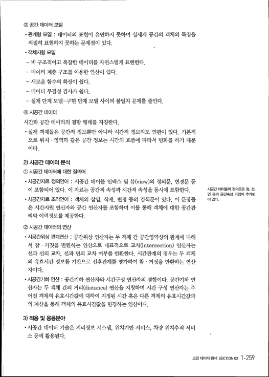
③ 공간 데이터 모델

- 관계형 모델 : 데이터의 표현이 유연하지 못하며 실세계 공간의 객쳬의 특징을
적절히 표현하지 못하는 문제점이 있다．

- 객체지향 모델
- 비 구조적이고 복잡한 데이터를 자연스럽게 표현한다．
- 데이터 계층 구조를 이용한 연산이 쉽다．
- 새로운 함수의 확장이 쉽다．
- 데이터 무결성 검사가 쉽다．
- 설계 단계 모델－구현 단계 모델 사이의 불일치 문제를 줄인다．
④ 시공간 데이터 시간과 공간 데이터의 결합 형태를 지칭한다．

#### · 실제 객쳬들은 공간적 정보뿐만 아니라 시간적 정보와도 연관이 있다 . 기본적
으로 위치 , 영역과 같은 공간 정보는 시간의 흐름에 따라서 변화를 하기 때문 이다． 2) 시공간 데이터 분석 ① 시공간 데이터에 대한 질의어

- 시공간자료 정의언어 : 시공간 테이블 인덱스 및 뷰（view）의 정의문 , 변경문 등
이 포함되어 있다 . 이 자료는 공간적 속정과 시간적 속정을 동시에 포함한다．

- 시공간자료조작언어 : 객쳬의 삽입 , 삭제 , 변경 등의 검색문이 있다 . 이 문장들 
은 시간지원 연산자와 공간 연산자를 포함하며 이를 통해 객쳬에 대한 공간관 리와 이력정보를 제공한다． ② 시공간 데이터의 연산

#### · 시공간위상 관계연산 : 공간위상 연산자는 두 객쳬 간 공간영역상의 관계에 대해
#### 서 참 · 거짓을 반환하는 연산으로 대표적으로 교차（intersection) 연산자는
선과 선의 교차 , 선과 면의 교차 여부를 반환한다 . 시간관계의 경우는 두 객쳬

#### 의 유효시간 정보를 기반으로 선후관계를 평가하여 참 · 거짓을 반환하는 연산
자이다．

#### · 시공간기하 연산 : 공간기하 연산자와 시간구성 연산자의 결합이다 . 공간기하 연 
산자는 두 객쳬 간의 거리（distance) 연산을 지칭하며 시간 구성 연산자는 주 어진 객쳬의 유효시간값에 대하여 지정된 시간 혹은 다른 객쳬의 유효시간값과 의 계산을 통해 객쳬의 유효시간값을 변경하는 연산이다 .

3) 적용 및 ＝용보야

- 시공간 데이터 기술은 지리정보 시스템 , 위치기반 서비스 , 차량 위치추적 서비 
스 등에 활용된다．

> 시공간 테이블의 정의문은 점 . 선． 
면 등의 공간속성 타입이 추가되 어 있다．

> 고급데이터 탐색 SECTION 02 1 -259
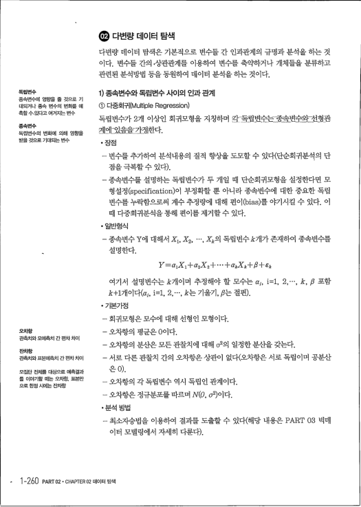
.

다변량 데이터 탐색 다변량 데이터 탐색은 기본적으로 변수들 간 인과관계의 규명과 분석을 하는 것 이다 . 변수들 간의 ＊상관관계를 이용하여 변수를 축약하거나 개쳬들을 분류하고 관련된 분적방법 등을 동원하여 데이터 분석을 하는 것이다． 1) 종속변수와독립변수 사이의 인과 관계 독립변수 종속변수에 영향을 줄 것으로 기 ① 다중회귀（Multi이e Regression) 대되거나 종속 변수의 변화를 예 측할수，있다고 여겨지는 변수 독립변수가 2개 이상인 회귀모형을 지칭하며 감독립변수튼“좃속변숫와E선형관 종속변수 폐에E있음을기썽l한다． 독립변수의 변화에 의해 영향을 받을 것으로 기대되는 변수

- 장점
- 변수를 추가하여 분석내용의 질적 향상을 도모할 수 있다（단순회귀분석의 단
#### 점을 극복할 수 있다）.
- 종속변수를 설명하는 독립변수가 두 개일 때 단순회귀모형을 설정한다면 모
형설정（specification＞이 부정확할 뿐 아니라 종속변수에 대한 중요한 독립

#### 변수를 누락함으로써 계수 추정량에 대해 편이（bias）를 야기시킬 수 있다 . 이
때 다중회귀분석을 통해 편이를 제거할 수 있다．

- 일반형식
#### - 종속변수Y에 대해서 지 ,x2, … , 쟈의 독립변수k개가존재하여 종속변수를
설명한다 .

#### y＝αlx汁a2x什…+akx什β 
6灌

#### 여기서 설명변수는 k개이며 추정해야 할 모수는 α／, i=1, 2, …, k, β 포함 
k+1개이다（a1, i=1, 2,", k는 기울기 , β는 절편）.

- 기본가정
- 회귀모형은 모수에 대해 선형인 모형이다．
- 오차항의 평균은 0이다．
오치항 관측치와모예측치 간 편차 차이

- 오차항의 분산은 모든 관찰치에 대해 02의 일정한 분산을 갖는다．
잔차항

- 서로 다른 관찰치 간의 오차항은 상관이 없다（오차항은 서로 독립이며 공분산
관측치와 표본예측치 간 편차 차이

#### 은 0).
모집단 전쳬를 대상으로 예측결과 를 이야기할 때는 도톼항. 표본만 으로 한정 시에는 잔치항

- 오차항의 각 독립변수 역시 독립인 관계이다．
－오차항은정규분포를따르며N(O, a2）이다．

- 분석 방법
- 최소자승법을 이용하여 결과를 도출할 수 있다（해당 내용은 PART 03 빅데
#### 이터 모델링에서 자세히 다룬다）.
1-260 PART02. CHAPTER02데이터탐색 I

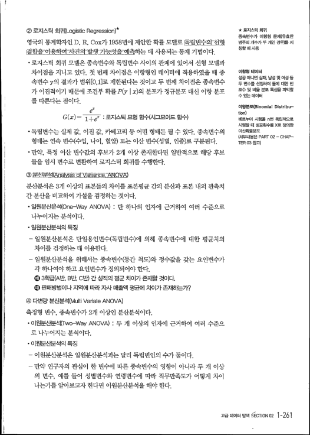
② 로지스틱 회귀（Logistic Regression)* 영국의 통계학자인 D. R. Cox가 1958년에 제안한 확률 모델로 돔굅변숫의쑈1청l 廬합쭉季이＝횻＝하여뜨퍄거의－발챙뜨기蚤囊정을：쫴층；하는 데 사용되는 통계 기법이다．

- 로지스틱 회귀 모델은 종속변수와 독립변수 사이의 관계에 있어서 선형 모델과
차이점을 지니고 있다 . 첫 번째 차이점은 이항형인 데이터에 적용하였을 때 종 속변수 y의 결과가 범위［0,1］로 제한된다는 것이고 두 번째 차이점은 종속변수 가 이진적이기 때문에 조건부 확률P(y 隧）의 분포가 정규분포 대신 이항 분포 를 따른다는 점이다．

#### G(x)= 1+ ex ：로지스틱모형힘卜수《시그모이드함수）
#### · 독립변수는 실제 값 , 이진 값 , 카데고리 등 어떤 형태든 될 수 있다 . 종속변수의
형태는 연속 변수（수입 , 나이 , 혈압） 또는 이산 변수（성별 , 인종）로 구분된다．

- 만약 , 특정 이산 변수값의 후보가 2개 이상 존재한다면 일반적으로 해당 후보
들을 임시 변수로 변환하여 로지스틱 회귀를 수행한다． ③ 분찬분석（百.폐y引百bfV祉墜頂亘，［즈쁘Qy聊

#### 분산분석은 3개 이상의 표본들의 차이를 표본평균 간의 분산과 표본 내의 관측치 
간 분산을 비교하여 가설을 검정하는 것이다 .

- 일원분산분석（0ne-Way ANOVA) : 단 하나의 인자에 근거하여 여러 수준으로
#### 나누어지는 분석이다 .
- 일원분산분석의 특징
- 일원분산분석은 단일용인변수（독립변수）에 의해 종속변수에 대한 평균치의
차이를 검정하는 데 이용한다．

#### - 일원분산분석을 위해서는 종속변수（등간 척도）와 정수값을 갖는 요인변수가 
각 하나여야 하고 요인변수가 정의되어야 한다 .

.l 3학급（A반 , B반 , C반） 간 성적의 평균 차이가 존재할 것이다． .l 판매방법이나 지역에 따라 자사 매출액 평균에 차이가 존재하는가？ ④ 다변량 분산분석（Multi Variate ANOVA) 측정형 변수 , 종속변수가 2개 이상인 분산분석이다．

- 이원분산분석（Two-Way ANOVA) : 두 개 이상의 인자에 근거하여 여러 수준으 
로 나누어지는 분석이다．

- 이원분산분석의 특징
- 이원분산분석은 일원분산분석과는 달리 독립변인의 수가 둘이다．
- 만약 연구자의 관심이 한 변수에 따른 종속변수의 영향이 아니라 두 개 이상
의 변수 , 예를 들어 성별변수와 연령변수에 따라 직무만족도가 어떻게 차이

#### 나는가를 알아보고자 한다면 이원분산분석을 해야 한다.
> ★ 로지스틱 회귀
> 종속변수가 이항형 문제（유효한
> 범주의 개수가 두 개인 경우）를 지 
칭할 때 사용

> 이항형 데이터
> 셩공 아니면 실패 . 남성 및 여성 등 
두 변수를 선정하여 둘0∥ 대한 빈 도수 및 비율 분포 특성을 파악할 수 있는 데이터

> 0［항분포（Binomial Distribu-
tion)

> 베르누이 시행을 n번 독립적으로
> 시행할 ［대 상공횟수를 ×로 정의한 
이산확률분포

> （세부내용은 PART 02 - CHAP-
> TER 03 참고）
> 고급데이터탐색SECTION 02 1-261
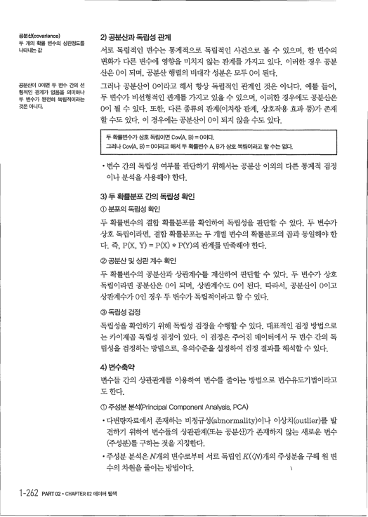
2) 공분산과 독립성 관계 공분신(covariance) 두 개의 확률 변수의 상관정도를 나타내는 값

#### 서로 독립적인 변수는 통계적으로 독립적인 사건으로 볼 수 있으며 , 한 변수의
#### 변화가 다른 변수에 영향을 미치지 않는 관계를 가지고 있다 . 이러한 경우 공분 
산은 0이 되며 , 공분산 행렬의 비대각 성분은 모두 0이 된다．

#### 그러나 공분산이 0이라고 해서 항상 독립적인 관계인 것은 아니다 . 예를 들어， 
두 변수가 비선형적인 관계를 가지고 있을 수 있으며 , 이러한 경우에도 공분산은 공분산이 0이면 두 변수 간의 선 형적인 관계가 없음을 의미하나 두 변 놈가 완전히 독립적이라는 것은 아니다．

#### 0이 될 수 있다 . 또힌r , 다른 종류의 관계（이차항 관계 , 상호작용 효과 등）가 존재 
할 수도 있다 . 이 경우에는 공분산이 0이 되지 않을 수도 있다 .

두확률변수가상호독립이면 Cov(A, B) =0이다． 그러나Cov(A, B) =O이라고해서두확률변수A. B가상호독립이라고할수는딥， ［다．

- 변수 간의 독립성 여부를 판단하기 위해서는 공분산 이외의 다른 통계적 검정
이나 분적을 사용해야 한다． 3) 두 확률분포 간의 독립성 확인 ① 분포의 독립성 확인 두 확률변수의 결합 확률분포를 확인하여 독립성을 판단할 수 있다 . 두 변수가

#### 상호 독립이라면 , 결합 확률분포는 두 개별 변수의 확률분포의 곱과 동일해야 한 
다 . 즉 , P(x, Y) =p(x) *p(y）의 관계를 만족해야 한다． ② 공분산 및 상관 계수 확인

#### 두 확률변수의 공분산과 상관계수를 계산하여 판단할 수 있다 . 두 변수가 상호
#### 독립이라면 공분산은 0이 되며 , 상관계수도 0이 된다 . 따라서 , 공분산이 0이고
상관계수가 0인 경우 두 변수가 독립적이라고 할 수 있다． ③ 독립성 검정

#### 독립성을 확인하기 위해 독립성 검정을 수행할 수 있다 . 대표적인 검정 방법으로 
는 카이제곱 독립성 검정이 있다 . 이 검정은 주어진 데이터에서 두 변수 간의 독 립성을 검정하는 방법으로 , 유의수준을 설정하여 검정 결과를 해석할 수 있다． 4) 변수축약 변수들 간의 상관관계를 이용하여 변수를 줄이는 방법으로 변수유도기법이라고 도 한다． ①주성분분석（Principal Component Analysis, PCA)

- 다변량자료에서 존재하는 비정규성（abnormality）이나 이상치（outlier）를 발
견하기 위하여 변수들의 상관관계（또는 공분산）가 존재하지 않는 새로운 변수 （추성분）를 구하는 것을 지칭한다．

- 주정분 분석은N개의 변수로부터 서로 독립인 兀（〈胛）개의 주정분을 구해 원 변
#### 수의 차원을줄이는방법이다 . 
, 1-262 PART 02. CHAPTER 02데이터탐색

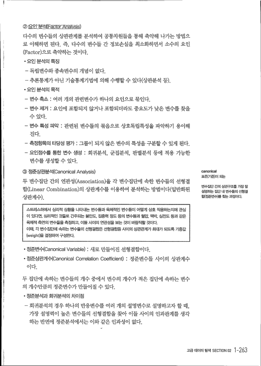
② 요인뜨분점(Fabt 『王聊亘I오亘臘） 다수의 변수들의 상관관계를 분적하여 공통차원들을 통해 축약해 나가는 방법으 로 이해하면 된다 . 즉 , 다수의 변수들 간 정보손실을 최소화하면서 소수의 요인 (Factor）으로 축약하는 것이다．

- 요인 분석의 특징
- 독립변수와 종속변수의 개념이 없다．
- 추론통계가 아닌 기술통계기법에 의해 수행할 수 있다（상관분석 등）.
- 요인 분석의 목적
#### - 변수 축소 : 여러 개의 관런변수가 하나의 요인으로 묶인다．
#### - 변수 제거 : 요인에 포함되지 않거나 포함되더라도 중요도가 낮은 변수를 찾을 
수 있다．

- 변수 특성 파악 : 관런된 변수들의 묶음으로 상호독립특정을 파악하기 용이해
진다．

#### - 측정항목의 타당성 평가 : 그룹이 되지 않은 변수의 특정을 구분할 수 있게 된다．
- 요인점수를 통한 변수 생성 : 회귀분적 , 군집분석 , 판별분석 등에 적용 가능한
변수를 생성할 수 있다． ③ 정준상관분석（Canonical Analysis) 두 변수집단 간의 연관성（Association）을 각 변수집단에 속한 변수들의 선형결 합（Linear Combination）의 상관계수를 이용하여 분석하는 방법이다（일반화된 상관계수）.

스트레스하에서 심리적 상황을 나타내는 변수들과 육체적인 변수들이 어떻게 상호 작용하는지에 관심 이 있다면 , 심리적인 것들로 간주되는 불안도， 집중력 정도 등의 변수들과 혈압. 맥박, 심전도 등과 같은 육체적 측면의 변수들을 측정하ㅍ 이들 사이의 연관성울 보는 것이 바람직할 것이다． 이때 , 각 변수집단에 속하는 변수들의 선형결합은 선형결합들 사이의 상관관계가 최대가 되도록 가중값 (weight）을 결정하여 구성한다．

#### · 정준변수《Canonical Variable) : 새로 만들어진 선형결합이다．
- 정준상관계수（Canonical Correlation Coefficient) : 정준변수들 사이의 상관계수
이다． 두 집단에 속하는 변수들의 개수 중에서 변수의 개수가 적은 집단에 속하는 변수 의 개수만큼의 정준변수가 만들어질 수 있다．

- 정준분석과 회귀분석의 차이점
- 회귀분석의 경우 하나의 반응변수를 여러 개의 설명변수로 설명하고자 할 때，
가장 설명력이 높은 변수들의 선형결합을 찾아 이들 사이의 인과관계를 생각 하는 반면에 정준분적에서는 이와 같은 인과성이 없다．

> canonical 
표준《기준）이 되는

> 변수집단 간의 상관구조를 가장 잘 
설명하는 집단 내 변수들의 선형결 힙《정준변수）를 짖는 과정이다．

> 고급데이터탐색 SECTION 02 ㅑ 
63

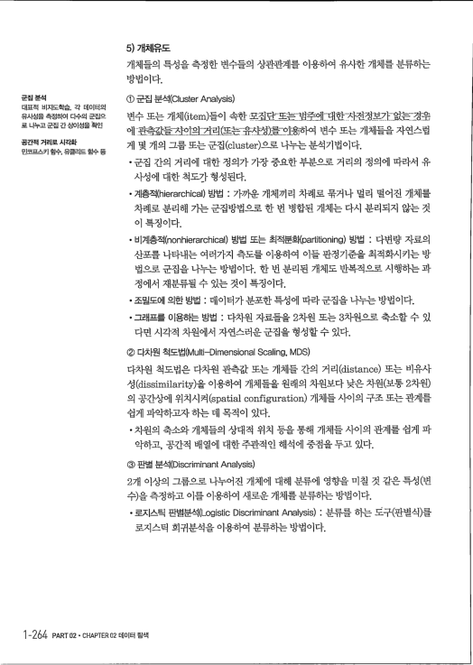
5) 개체유도 개쳬들의 특정을 측정한 변수들의 상관관계를 이용하여 유사한 개쳬를 분류하는 방법이다． ① 군집 분석（Cluster Analysis) 군집 분석 대표적 비지도학습 . 각 데이터의 유사성을 측정하여 다수의 군집으 로 나누고군집 간상이성을확인 변수 또는 개쳬（item）들이 속한 모집뱐또튼－범주에ㅍ재한F약전정里기르없는＝경衆 배관측값들〔자의의－거“리’（生는E유키정）竇이瓮하여 변수 또는 개쳬들을 자연스럽 공간적 거리로 시각화 게 몇 개의 그룹 또는 군집（cluster）으로 나누는 분석기법이다． 민코프스키 함수． 유클리드 함수 등

- 군집 간의 거리에 대한 정의가 가장 중요한 부분으로 거리의 정의에 따라서 유
사성에 대한 척도간 형성된다．

- 계층적（hierarchical) 방법 : 가까운 개쳬끼리 차례로 묶거나 멀리 떨어진 개쳬를
차례로 분리해 가는 군집방법으로 한 번 병합된 개쳬는 다시 분리되지 않는 것 이 특징이다．

- 비계층적（nonhierarchical) 방법 또는 최적분화（partitioning) 방법 : 다변량 자료의
산포를 나타내는 여러가지 측도를 이용하여 이들 판정기준을 최적화시키는 방

#### 법으로 군집을 나누는 방법이다 . 한 번 분리된 개쳬도 반복적으로 시행하는 과
정에서 재분류될 수 있는 것이 특징이다．

- 조밀도에 의한 방법 : 데이터가 분포한 특성에 따라 군집을 나누는 방법이다．
- 그괘프를 이용하는 방법 : 다차원 자료들을 2차원 또는 3차원으로 축소할 수 있
다면 시각적 차원에서 자연스러운 군집을 형성할 수 있다． ② 다차원 척도법（Multi-Dimensional Scaling, MDS) 다차원 척도법은 다차원 관측값 또는 개쳬들 간의 거리（distance) 또는 비유사 성（dissimilarity）을 이용하여 개체들을 원래의 차원보다 낮은 차원（보통 2차원） 의 공간상에 위치시켜（spatial configuration) 개쳬들 사이의 구조 또는 관계를 쉽게 파악하고자 하는 데 목적이 있다．

- 차원의 축소와 개쳬들의 상대적 위치 등을 통해 개쳬들 사이의 관계를 쉽게 파
악하고 , 공간적 배열에 대한 주관적인 해석에 중점을 두고 있다． ③ 판별 분석（Discriminant Analysis) 2개 이상의 그룹으로 나누어진 개쳬에 대해 분류에 영향을 미칠 것 같은 특정（변 수）을 측정하고 이를 이용하여 새로운 개쳬를 분류하는 방법이다．

#### · 로지스틱 판별분석（Logistic Discriminant Analysis) : 분류를 하는 보구（판별식）를
로지스틱 회귀분석을 이용하여 분류하는 방법이다 .

1-264 PART 02 ' CHAPTER 02더l이터탐색

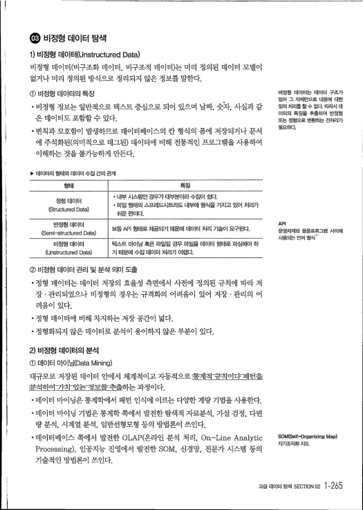
.

비정형 데이터 탐색 1) 비정형 데이터（Unstructured Data) 비정형 데이터（비구조화 데이터 , 비구조적 데이터）는 미리 정의된 데이터 모델이 없거나 미리 정의된 방식으로 정리되지 않은 정보를 말한다． ① 비정형 데이터의 특징

#### · 비정형 정보는 일반적으로 텍스트 중심으로 되어 있으며 날짜, 슷자 , 사실과 같 
은 데이터도 포함할 수 있다．

- 변칙과 모호함이 발생하므로 데이터베이스의 칸 형식의 폼에 저장되거나 문서
에 주석화된（의마적으로 태그된） 데이터에 비해 전통적인 프로그램을 사용하여 이해하는 것을 불가능하게 만든다．

> 데이터의 형태와 데이터 수집 간의 관계
형태 특징

- 내부 시스템오l경우가 대부분이라 수집이 쉽다． 
- 파일 형태의 스프레드치트라도 내부에 형식을 가지고 있어 처리가
정형 데이터 (Structured Data) 쉬운 편이다． 반정형 데이터 (Semi-structured Data) 보통 API 형태로 저꼼되기 때문에 데이터 처리 기술이 요구된다． 텍스트 매기닝 혹은 파일일 경우 파일을 데이터 형태로 파싱해야하 비정형 데이터 (Unstructured Data) 기 때문에 수집 데이터 처리가 어렵다． ② 비정형 데이터 관리 및 분석 의미 도출

#### · 정형 데이터는 데이터 저장의 효율성 측면에서 사전에 정의된 규칙에 따라 저 
장 · 관리되었으나 비정형의 경우는 규격화의 어려움이 있어 저장 · 관리의 어 려움이 있다．

- 정형 데이터에 비해 차지하는 저장 공간이 넓다．
- 정형화되지 않은 데이터로 분석이 용이하지 않은 부분이 있다．
2) 비정형 데이터의 분석 ① 데이터 마이닝（Data Mining) 대규모로 저장된 데이터 안에서 쳬계적이고 자동적으로 통졔점뜨쿳칙‘이다E홰토1을 분석하의-7 최프았는EE렁夔를E主출하는 과정이다．

- 데이터 마이닝은 통계학에서 패톈인식에 이르는 다양한 계량 기법을 사용한다．
#### · 데이터 마이닝 기법은통계학쪽에서 발전한탐색적 자료분석 , 가설 검정 , 다변
#### 량분석 , 시계열 분석 , 일반선형모형 등의 방법론이 쓰인다．
#### · 데이터베이스 쪽에．서 발전한 0LAP（온라인 분석 처리 , On-Line Analytic 
Processing) , 인공지능 진영에서 발전한 SOM , 신경망, 전문가 시스템 등의 기술적인 방법론이 쓰인다．

> 비정형 데이터는 데이터 구조가 
없어 그 자체만으로 내옹게 대한 질의 처리를 할 수 없다. 따라서 데 이터의 특징을 추출하여 반정형 또는 정형으로 변환하는 전처리가 필요하다．

> A더
> 운영쳬제와 응용프로그램 사이에 
ㅅ隱되는언어 형식｀

> SOM(Self -Organizing Map) 
자기조직화지도

> 고급데이터 탐색 SECTION 02 1-265
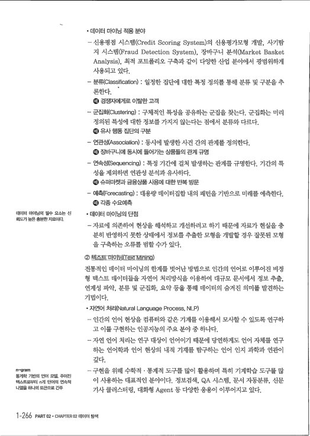
- 데이터 마이닝 적용 분야
- 신용평점 시스템（Credit Scoring System）의 신용평가모형 개발 , 사기탐
지 시스템（Fraud Detection System) , 장바구니 분석（Market Basket Analysis) , 최적 포트폴리오 구축과 같이 다양한 산업 분야에서 광범위하게 사용되고 있다．

#### - 분류《Classification) : 일정한 집단에 대한 특정 정의를 통해 분류 및 구분을 추
론한다． c[l 경쟁자에게로 이탈한 고객

#### - 군집화(Clustering) : 구쳬적인 특성을 공유하는 군집을 찾는다 . 군집화는 미리
#### 정의된 특성에 대한 정보를 가지지 않는다는 점에서 분류와 다르다． 
.I 유사 행동 집단의 구분

- 연관성（Association) : 동시에 발생한 사건 간의 관계를 정의한다． 
0 장바구니에 동시에 들어가는 상품들의 관계 규명

#### - 연속성（Sequencing) : 특정 기간에 걸쳐 발생하는 관계를 규명한다 . 기간의 특 
성을 제외하면 연관성 분석과 유사하다~ .I 슈퍼마켓과 금융상품 사용에 대한 반복 방문

#### - 예측《Forecasting) : 대용량 데이터집합 내의 패턴을 기반으로 미래를 예측한다 . 
.I 각종 수요예측

- 데이터 마이닝의 단점
데이터 마이닝의 필수 요소는 신 뢰도가높은충분한 자료이다．

- 자료에 의존하여 현상을 해석하고 개선하려고 하기 때문에 자료가 현실을 충
#### 분히 반영하지 못한 상태에서 정보를 추출한 모형을 개발할 경우 잘못된 모형 
을 구축하는 오류를 범할 수가 있다 .

#### ② 템죠트마희넝(Te貶rMiriiti)
전통적인 데이터 마이닝의 한계를 벗어난 방법으로 인간의 언어로 이루어진 비정 형 텍스트 데이터들을 자연어 처리방식을 이용하여 騙子모 문서에서 정보 추출， 연계성 파악 , 분류 및 군집화, 요약 등을 통해 데이터의 숨겨진 의미를 발견하는 기법이다．

- 자연어 처리（Natural Language Process, NLP)
- 인간의 언어 현상을 컴퓨터와 같은 기계를 이용해서 모사할 수 있도록 연구하
고 이를 구현하는 인공지능의 주요 분야 중 하나다．

- 자연 언어 처리는 연구 대상이 언어이기 때문에 당연하게도 언어 자쳬를 연구
하는 언어학과 언어 현상의 내적 기재를 탐구하는 언어 인지 과학과 연관이 깊다．

#### - 구현을 위해 수학적 · 통계적 도구를 많이 활용하며 특히 기계학습 도구를 많
n-gram 통계학 기반의 언어 모델 . 주어진 텍스트로부터 n개 단어의 연속적 나열을 해ㅘ의 토큰으로 간주 이 사용하는 대표적인 분야이다 . 정보검색 , QA, 시스템 , 문서 자동분류 , 신문 기사클러스터링 , 대화형 Agent 등 다양한응용이 이루어지고 있다． 1 -266 PART 02 . CHAPTER 02 데이터 탐색 「

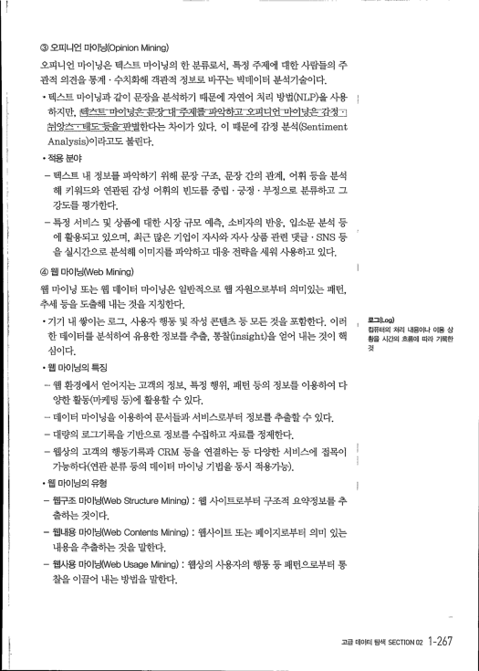
③ 오피니언 마이닝（Opinion Mining) 오피니언 마이닝은 텍스트 마이닝의 한 분류로서 , 특정 주제에 대한 사람들의 주

#### 관적 의견을 통계 · 수치화해 객관적 정보로 바꾸는 빅데이터 분석기술이다．
- 텍스트 마이닝과 같이 문장을 분석하기 때문에 자연어 처리 방법（NLP）을 사용
하지만 , 煌lㅌ竺트F마이넛우r운장뙈--E제를파의：화고＝오＝피‘듸’언끼이녕즈우＝각젓ㄱ

#### 繃앙츠＝패트［둥：을笠샐한다는 차이가 있다 . 이 때문에 감정 분석（Sentiment
#### Analysis）이라고도 불린다 .
- 적용 분야
- 텍스트 내 정보를 파악하기 위해 문장 구조 , 문장 간의 관계 , 어휘 등을 분석
#### 해 키워드와 연관된 감성 어휘의 빈도를 중립 · 긍정 · 부정으로 분류하고 그
강도를 평가한다．

- 특정 서비스 및 상품에 대한 시장 규모 예측 , 소비자의 반응 , 입소문 분석 등
#### 에 활용되고 있으며 , 최근 많은 기업이 자사와 자사 상품 관런 댓글 · SNS 등 
을 실시간으로 분적해 이미지를 파악하고 대응 전략을 세워 사용하고 있다． ④ 웹 마이닝（Web Mining) 웹 마이닝 또는 웹 데이터 마이닝은 일반적으로 웹 자원으로부터 의미있는 패턴， 추세 등을 도출해 내는 것을 지칭한다．

- 기기 내 쌓이는 로그 , 사용자 행동 및 작성 콘텐츠 등 모든 것을 포함한다 . 이러
한 데이터를 분석하여 유용한 정보를 추출 , 통찰（insight）을 얻어 내는 것이 핵

#### 심이다 .
- 웹 마이닝의 특징
- 웹 환경에서 얻어지는 고객의 정보 , 특정 행위 , 패턴 등의 정보를 이용하여 다
양한 활동（마케팅 등）에 활용할 수 있다．

- 데이터 마이닝을 이용하여 문서들과 서비스로부터 정보를 추출할 수 있다．
- 대량의 로그기록을 기반으로 정보를 수집하고 자료를 정제한다．
- 웹상의 고객의 행동기록과 CRM 등을 연결하는 등 다양한 서비스에 접목이
#### 가능하다（연관분류 등의 데이터 마이닝 기법을 동시 적용가능）.
- 웹 마이닝의 유형
#### - 웹구조 마이닝（Web Structure Mining) : 웹 사이트로부터 구조적 요약정보를 추
출하는 것이다．

- 웹내용 마이닝（Web Contents Mining) : 웹사이트 또는 페이지로부터 의미 있는
내용을 추출하는 것을 말한다．

#### - 웹사용 마이닝（Web Usage Mining) : 웹상의 사용자의 행동 등 패턴으로부터 통
찰을 이끌어 내는 방법을 말한다．

> 로그（Log)
> ㅣ
> 컴퓨터의 처리 내용이나 이용 상 
황을 시간의 흐름에 따라 기록한 것

> -
> 고급데이터 탐색 SECTION 02 1-267
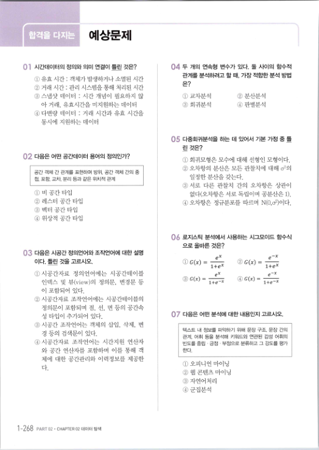
## 예상문제
U · 시간데이터의 정의와 의미 연결이 틀린 것은？ 盼』 두 개의 연속형 변수가 있다 . 둘 사이의 함수적 관계를 분석하려고 할 때 , 가장 적합한 분석 방법 ① 유효 시간 : 객쳬가 발생하거나 소멸된 시간 ② 거래 시간 : 관리 시스템을 통해 처리된 시간 ③스냅샷 데이터 : 시간 개념이 필요하지 않 아 거래 , 유효시간을 미지원하는 데이터 ④ 다변량 데이터 : 거래 시간과 유효 시간을 은？ ① 교차분석 ③ 회귀분석 ② 분산분석 (D 판별분석 동시에 지원하는 데이터 05 다중회귀분석을 하는 데 있어서 기본 가정 중 틀 린 것은？ 다음은 어떤 공간데이터 용어의 정의인가？ ① 회귀모형은 모수에 대해 선형인 모형이다． ② 오차항의 분산은 모든 관찰치에 대해 .2의 공간 객체 간 관계를 표현하며 방위 , 공간 객체 간의 중 첩 , 포함 , 교차, 분리 등과 같은 위치적 관계 일정한 분산을 갖는다． ③ 서로 다른 관찰치 간의 오차항은 상관이 없다（오차항은 서로 독립이며 공분산은 1).

④ 오차항은 蔘구분포를 따르며 N(O,a2）이다． ① 비 공간 타입 ② 레스터 공간 타입 ③ 벡터 공간 타입 ④ 위상적 공간 타입 0 ( 로지스틱 분석에서 사용하는 시그모이드 함수식 으로 올바른 것은？ 03 다음은 시공간 정의언어와 조직띤그어에 대한 설명

#### - 
ex (D c(D 孟 1+'?x 이다 . 틀린 것을 고르시오． ①시공간자료 정의언어에는 시공간테이블 인덱스 및 뷰（view）의 정의문 , 변경문 등 이 포함되어 있다． ② 시공간자료 조작언어에는 시공간테이블의 一 ' ex 一， , .

e－ㅈ 년）(7(x) = 1+ e-x (4) 1+e X 아ㅈ〕＝ 1+e 정의문이 포함되며 점 , 선 , 면 등의 공간속 성 타입이 추가되어 있다． ③시공간 조작언어는 객쳬의 삽입 , 삭제 , 변 a; 다음은 어떤 분석에 대한 내용인지 고르시오． 텍스트 Lj 정보를 파악하기 위해 문장 구조， 문장 간의 관계 , 어휘 등을 분석해 키워드와 연관된 감성 어휘의 경 등의 검색문이 있다． ④시공간자료 조작언어는 시간지원 연산자 와 공간 연산자를 포함하며 이를 통해 객 빈도를 중립 · 긍정 · 부정으로 분류하고 그 강도를 펑가 한다． 쳬에 대한 공간관리와 이력정보를 제공한 ① 오피니 언 마이닝 ② 웹 콘텐츠 마이닝 ③ 자연어처리 ④ 군집분석 다． 1-268 PART 02* CHAPTER 02데이터탐색

> ②G(x) =
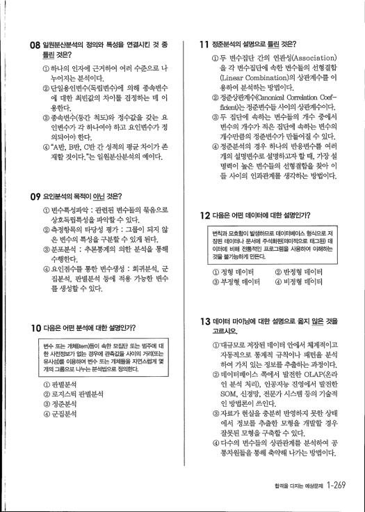
11 정준분석의 설명으로 틀립 것은？ 08 일원분산분석의 정의와 특성을 연결시킨 것 중 틀린 것은？ ①두 변수집단 간의 연관성（Association) 을 각 변수집단에 속한 변수들의 선형결합 (Linear Combination）의 상관계수를 이 용하여 분석하는 방법이다． ② 정준상관계수〈Cbnonical Correlation Coef- fident）는 졍준변수들 사이의 상관계수이다． ③두 집단에 속하는 변수들의 개수 중에서 ① 하나의 인자에 근거하여 여러 수준으로 나 누어지는분석이다． ②단일용인변수（톡립변수）에 의해 종속변수 에 대한 최빈값의 차이를 검정하는 데 이 용한다． ③종속변수（등간 척도）와 정수값을 갖는 요 변수의 개수가 적은 집단에 속하는 변수의 인변수가 각 하나여야 하고 요인변수가 정 개수만큼의 정준변수가 만들어질 수 있다． ④ 정준분석의 경우 하나의 반응변수를 여러 의되어야 한다． ④ " A반 , B반 , C반간성적의 평균차이가존 재할 것이다 . " 는 일원분산분석의 예이다． 개의 설명변수로설명하고자할때 , 가장설 명력이 높은 변수들의 선형결합을 찾아 이 들 사이의 인과관계를 생각하는 방법이다． 09 요인분석의 목적이 와닙 것은？ ① 변수특성파악 : 관련된 변수들의 묶음으로 12 다옴은 어떤 데이터에 대한 설명인가？ 상호독립특정을 파악할수 있다． ②측정항목의 타당성 평가 : 그룹이 되지 않 은 변수의 특정을 구분할 수 있게 된다． ③분포분석 : 추론통계의 의한 분석을 통해 변칙과 모호함이 발생하므로 데이터베이스 형식으로 저 장된 데이터나 문서에 주석화된（의미적으로 태그된） 데 이터에 비해 전통적인 프로그램을 사용하여 이해하는 것을불가능하게 만든다． 수행한다． ④요인점수를 통한 변수생성 : 회귀분석 , 군 ① 정형 데이터 ②반정형 데이터 ③부정형 . 데이터 ④비정형 데이터 집분석 , 판별분적 등에 적용 가능한 변수 를 생성할 수 있다． 13 데이터 마이닝에 대한 설명으로 옳지 않을 것을 10 다음은 어떤 분석에 대한 설명인가？ 고르시오， ① " 朗子모로 저장된 데이터 안에서 쳬계적이고 자동적으로 통계적 규칙이나 패턴을 분석 변수 또는 개체（item）들이 속한 모집단 또는 범주에 대 한 사전정보가 없는 경우에 관측값들 사이의 거리（또는 유사성＞를 이용하여 변수 또는 개체들을 자연스럽게 몇 개의 그룹으로 나누는 분석법으로 정의한다． 하여 가치 있는 정보를 추출하는 과정이다． ② 데이터베이스 쪽에서 발전한 0LAF（온라 인 분석 처리） , 인공지능 진영에서 발전한 SOM , 신경망 , 전문가 시스템 등의 기술적 인 방법론이 쓰인다． ③ 자료가 현실을 충분히 반영하지 못한 상태 에서 정보를 추출한 모형을 개발할 경우 잘못된 모형을 구축할 수 있다． ④ 다수의 변수들의 상관관계를 분석하여 공 통차원들을 통해 축약해 나가는 캉법이다． ① 판별분석 ② 로지스틱 판별분석 ③ 정준분석 ④ 군집분석

> 합격을다지는예상문제 1-269
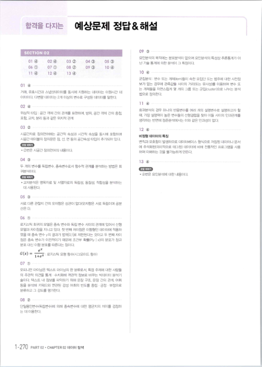
## 합격을다지는 
예상문제 정답＆해설 09 ③ ........................ ... .... ........... .... .......... ........... ...................... ........ ......................... ...........

SECTION 02 요인분석의 목적에는 분포분석이 없으며 요인분석의 특성상 추론통계가 아 닌 기술 통계에 의한 분석이 그 특징이다． 01 ④ 06D 02 ④ 03 ② ,，』 , ③ 05 ③ 08 ② 09 ③ lO （④ 07 (D 12 @) 11 ④ B ④ 군집분석 : 변수 또는 개쳬（item）들이 속한 모집단 또는 범주께 대한 사전정 보가 없는 경우에 관측값들 사이의 거리（또는 유사성晨 이용하여 변수 또 는 개체들을 자연스럽게 몇 개의 그룹 또는 군집（cluster）으로 나누는 분석 법으로 정의한다． Ol ④ ……………………………∼………………………………」 거래 . 유효시간과 스냅샷데이터를 동시에 지원하는 데이터는 이원시간 데 이터이다 . 다변량 데이터는 2개 이상의 변수로 구성된 데이터를 말한다． 11 ④ ………………………………………………∼… ………－……… → 02 ④ ……－…………………………………∼…………一………………………………0 회귀분석의 경우 하나의 반응변수를 여러 개의 설명변수로 설명하고자 할 위상적 타입 : 공간 객체 간의 관계를 표현하며， 방위． 공간 객체 간의 중첩． 포함. ㅍ吹］, 분리 둥과 같은 위치적 관계 때． 가장 설명력이 높은 변수들의 선형결합을 찾아 이들 사이의 인과관계를 생각하는 반면에 정준분석에서는 이와 같은 인과성이 없다． 03 ② ………∼…………∼…－………………………………∼………………∼ 12 ④ 시공간자료 정의언어에는 공간적 속성과 시간적 속성을 동시0ㅔ 포함하며 시공간 테이블의 정의문은 점， 선 . 면 등의 공간속성 타입이 추가되어 있다． 恤靭柳·

- ②번은 시공간 정의언어의 내용이다．
비정형 데이터의 툭징 변칙과 모호함이 발생하므로 데이터베이스 형식으로 저장된 데이터나 문서 0ㅔ 주석화된（의미적으로 태그된） 데이터에 비해 전통적인 프로그램을 사용 하여 이해하는 것을 불가능하게 만든다． 04 ③ …－…………………………………………∼…………………………… 13 ④ ............................................................

., 日ㅌ·

- ④번은 요인분석에 대한 내용이다．
두 개의 변수를 독립변수， 종속변수로서 함수적 관계를 분석하는 방법은 회 귀분석이다． 輟· 驟“·

- 교차분석은 명목자료 및 서열자료의 독립성 . 동질성． 적합성을 분석하는 
데 사용된다． 05 （③ ................................................ ........ .... ...................................................

서로 다른 관찰치 간의 오톼항은 상관이 없다（오차항은 서로 독립이며 공분 산은 0).

06 ① ............. ..... .. ........ ... .... ........ ........ .... ... .... ........ ........ .................................... ........ ........

로자스틱 회귀의 모델은 종속 변수와 독립 변수 사이의 관계에 있어서 선형 모델과 차이점을 지니고 있다. 첫 번째 차이점은 이항형인 데이터에 적용하 였을 때 종속 변수 y의 결과가 범위［0.1湟 제한된다는 것이고 두 번째 차이 점은 종속 변수가 이진적이기 때문에 조건부 확률《P(y I x)）의 분포가 정규 분포 대신 이항 분포를 따른다는 점이다． .x 叭xJ = ㅍ＝= · 로지스틱 모형 함쉬시그모이드 함수） 070 ...................... ........ .... ... .... ............. ........ .... ....... .... ............. ...................................

오피니언 매기닝은 텍스트 매기닝의 한 분류로서． 특정 주제에 대한 사람들 의 주관적 의견을 통계 · 수치화해 객관적 정보로 바꾸는 빅데이터 분석기 술이다 . 텍스트 내 정보를 파악하기 위해 문장 구조， 문장 간의 관계． 어휘 등을 분석해 키워드와 연관된 감성 어휘의 빈도를 중립 . 긍정 · 부정으로 告흽하고 그 강도를 평가한다． 08 (2) ........ ..

. . ... .................................................................................................................

단일용인변수《독립변수）에 의해 종속변수에 대한 평균치의 차이를 검정하 는 데 이용한다． 1-270 PART 02 . CHAPTER 02 데이터 탐색
