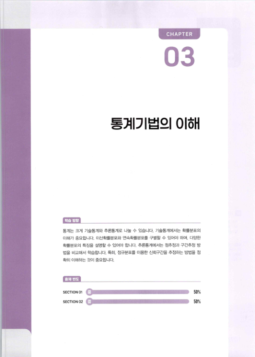
# CHAPTER 
03

# 통계기법의 이해
학습 밤향 통계는 크게 기술통계와 추론통계로 나눌 수 있습니다 . 기술통계에서는 확률분포의 이해가 중요합니다 . 이산확률분포와 연속확률분포를 구별할 수 있어야 하며 . 다임這＇ 확률분포의 특징을 설명할 수 있어야 합니다 . 추론통계에서는 점추정과 구간추정 방 법을 비교해서 학습합니다 . 특히 , 정규분포를 이용한 신뢰구긴을 추정하는 방법을 정 확히 이해하는 것이 중요합니다． 출제 빈도 SECTION 01 SECTI아'J 02

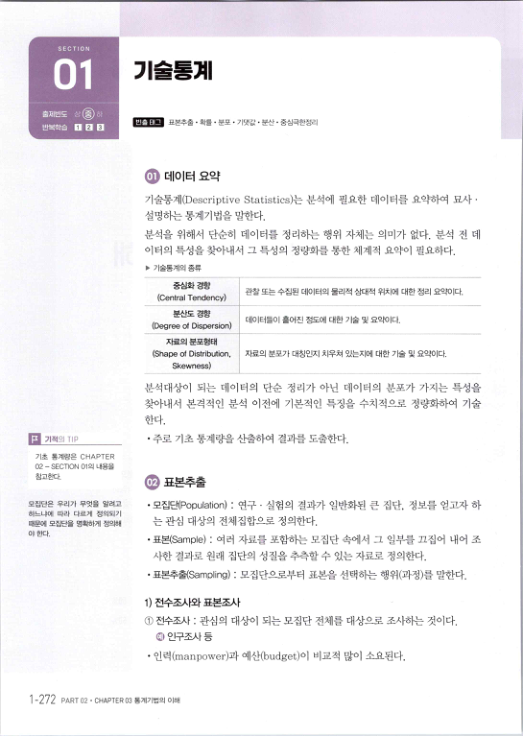
SECTION

# 기술통계
출제빈도 상（읗ㄶ（, 빈츨 태그 표본추출 · 확률 · 분포 · 기댓값 · 분산 · 중심극한정리 반복학습 ．빼 .

데이터 요약 기술통계（Descriptive Statistics）는 분석에 필요한 데이터를 요약하여 묘사 · 설명하는 통계기법을 말한다．

#### 분석을 위해서 단순히 데이터를 정리하는 행위 자쳬는 의미가 없다 . 분석 전 데
이터의 특정을 칫아내서 그 특성의 정량화를 통한 체계적 요약이 필요하다． 》 기술통계의 종류 중심화 경향 (Central Tendency) 관찰 또는 수집된 데이터의 물리적 상대적 위치에 대한 정리 요약이다． 분산도 경향 데이터들이 흩《거진 정도에 대한 기술 및 요약이다． (Degree of Dispersion) 자료의 분포형태 (Shape of Distribution.

차료의 분포가 대칭인지 치우쳐 있는지에 대한 기술 및 요약이다． Skewness) 분석대상이 되는 데이터의 단순 정리가 아닌 데이터의 분포가 가지는 특성을 짖마내서 본격적인 분석 이전에 기본적인 특징을 수치적으로 정량화하여 기술 한다．

#### ［헴 기적의 지P
- 주로 기초 통계량을 산출하여 결과를 도출한다．
기초 통계량은 （개APT타굿 02- SEC110N 01으4 내용을 참고한다．

#### .표본추출
#### · 모집댐Pop미atiort) : 연구 · 실험의 결과가 일반화된 큰 집단 , 정보를 얻고자 하
모집단은 우리가 무엇을 알려고 하느냐에 따라 다르게 정의되기 때문에 모집단을 영확하게 정의해 야 한다． 는 관심 대상의 전쳬집합으로 정의한다．

- 표본〈Sample) : 여러 자료를 포함하는 모집단 속에서 그 일부를 끄집어 내어 조
사한 결과로 원래 집단의 성질을 추측할 수 있는 자료로 정의한다．

#### · 표본추출(Sampling) : 모집단으로부터 표본을 선택하는 행위（과정）를 말한다．
#### 1) 전수조사와 표본조사 
'

#### ① 전수조사 : 관심의 대상이 되는 모집단 전쳬를 대상으로 조사하는 것이다．
clI 인구조사 등

- 인력（manpower）과 예산（budget）이 비교적 많이 소요된다．
ㅑ 72 PART 02. CHAPTER 03통계기법의이해

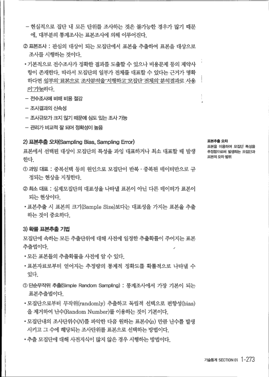
- 현실적으로 집단 내 모든 단위를 조사하는 것은 불가능한 경우가 많기 때문
에 , 대부분의 통계조사는 표본조사에 의해 이루어진다． ② 표본조사 : 관심의 대상이 되는 모집단에서 표본을 추출하여 표본을 대상으로 조사를 시행하는 것이다．

- 기본적으로 전수조사가 정확한 결과를 도출할 수 있으나 비용문제 등의 제약사
#### 항이 존재한다 . 따라서 모집단의 일부가 전쳬를 대표할 수 있다는 근거가 명확
하다면 밀부의‘표鑽으로조최섶최：을E최．했희고꾜집딘f굿녜의：섶좌결괴르／〕：용 의긔눗하다．

- 전수조사에 비해 비용 절감
- 조사결과의 신속성
- 죠 규모가 크지 않기 때문에 심도 있는 조사 가능
- 관리가 비교적 잘 되어 정확성이 높음
2) 표본추출 오차(Sampling Bias, Sampling Error) 표본에서 선택된 대상이 모집단의 특정을 과잉 대표하거나 최소 대표할 때 발생 한다．

#### ① 과잉 대표 : 중복선택 등의 원인으로 모집단이 반복 · 중복된 데이터만으로 규
정되는 현상을 지칭한다． ② 최소 대표 : 실제모집단의 대표성을 나타낼 표본이 아닌 다른 데이터가 표본이 되는 현상이다．

- 표본추출 시 표본의 크기（Sample Size）보다는 대표성을 가지는 표본을 추출
#### 하는 것이 중요하다 .
3) 확률 표본추출 기법 모집단에 속하는 모든 추출단위에 대해 사전에 일정한 추출확률이 주어지는 표본 추출법이다．

- 모든 표본들의 추출확률을 사전에 알 수 있다．
- 표본자료로부터 얻어지는 추정량의 통계적 정확도를 확률적으로 나타낼 수
있다． ① 단순무작위 추출(Simple Random Sampling) : 통계조사에서 가장 기본이 되는 쵸본추출법이다．

#### · 모집단으로부터 무작위（randomly) 추출하고 독립적 선택으로 편향성（bias) 
을 제거하여 난수（kandom Number)를이용하는 것이 기본이다 .

- 모집단내의 조사단위수（N）를 파악한 다음 원하는 표본수여） 만큼 난수를 발생
시키고 그 수에 해당되는 조사단위를 표본으로 선택하는 방법이다．

- 추출 모집단에 대해 사전지식이 많지 않은 경우 시행하는 방법이다．
> 표본추출 오차
> 표본을 이용하여 모집단 특성을 
추정함으로씨 발생하는 모집단과 표본의 오차 범위

> 기술통계 SECTION 01 ㅑ 73
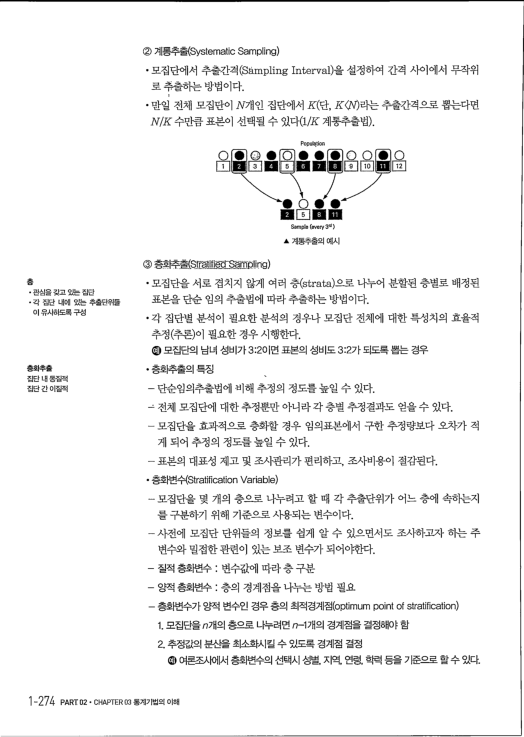
② 계통추출(Systematic Sampling)

- 모집단에서 추출간격（S戚mp1ing Interval）을 설정하여 간격 사이에서 무작위
로 추출하는 방법이다．

#### · 만일 전쳬 모집단이 N개인 집단에서 x（단 , K<IV）라는 추출간격으로 뽑는다면 
N/K 수만큼 표본이 선택될 수 있다（1／冗 계통추출법）.

Pop미르tion

### 0 
Dl

### ．巨〕.미
Sample (every3ㅂ) ▲ 계통추출의 예시 ③ 층화추竇S上福ifi否dS百ffTplirig)

- 모집단을 서로 겹치지 않게 여러 층（strata）으로 나누어 분할된 층별로 배정된
ㅊ ㅌ

- 관심을 깆고 있는 집단 
- 각 집단 내에 있는 추출단위들 
이 유사하도록 구성 표본을 단순 임의 추출법에 따라 추출하는 방법이다．

- 각 집단별 분석이 필요한 분석의 경우나 모집단 전쳬에 대한 특정치의 효율적
추정（추론）이 필요한 경우 시행한다． clI 모집단의 남녀 성비가 3:2이면 표본의 성비도 3:2가 되도록 뽑는 경우

- 층화추출의 특징
층화추출 집단 내 동질적 집단 간 이질적

- 단순임의추출법에 비해 추정의 정도를 높일 수 있다．
굻 전쳬 모집단에 대한 추정뿐만 아니라 각 층별 추정결과도 얻을 수 있다．

- 모집단을 효과적으로 층화할 경우 임의표본에서 구한 추정량보다 오차가 적
게 되어 추정의 정도를 높일 수 있다．

- 표본의 대표성 제고 및 조사관리가 편리하고 , 조사비용이 절감된다．
- 층화변쉬Stratification Variable)
- 모집단을 몇 개의 층으로 나누려고 할 때 각 추출단위가 어느 층에 속하는지 
를 구분하기 위해 기준으로 사용되는 변수이다．

- 사전에 모집단 단위들의 정보를 쉽게 알 수 있으면서도 조사하고자 하는 주
변수와 밀접한 관련이 있는 보조 변수가 되어야한다 .

#### - 질적 층화변수 : 변수값에 따라 층 구분
#### - 양적 층화변수 : 층의 경계점을 나누는 방법 필요
- 층화변수가 양적 변수인 경우 층의 최적경계점（optimum point of stratification)
#### 1 . 모집단을n개의 층으로 나누려면 nㅢ개의 경계점을 결정해야 함
2 . 추정값의 분산을 최소화시킬 수 있도록 경계점 결정 o 여론조사에서 층화변수의 선택시 성별 , 지역 , 연령 , E2 -l -큭 등을 기준으로 할수 있다, 1-274 PART 02* CHAPTER 03통계기법의이해

#### 0 
〔괴

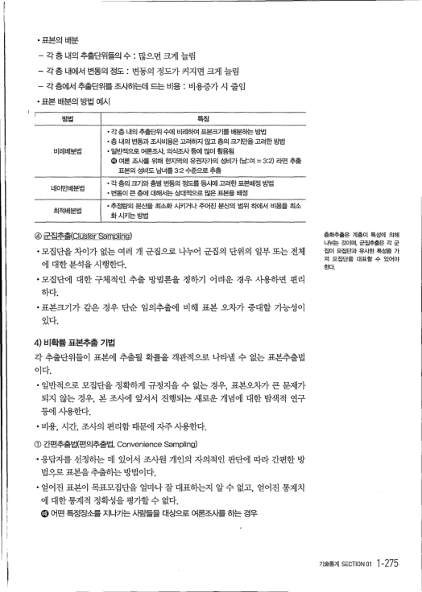
- 표본의 배분
- 각 층 내의 추출단위들의 수： 많으면 크게 늘림
- 각 층 내에서 변동의 정도 : 변동의 정도가 커지면 크게 늘림
- 각 층에서 추출단위를 조사하는데 드는 비용 : 비용증가 시 줄임
- 표본 배분의 방법 예시
방법 특징

- 각 층 내의 추출단위 수0체 비례하여 표본크기를 배분하는 방법
- 층 내의 변동과조사비용은 고려하지 않고 층의 크기만을 고려한 방법 
- 일반적으로 여론조사, 의식죄극 등에 많이 활용됨 
c[I 여론 조사를 위해 한지역의 유권자가의 성비가 （남：여 = 3:2) 라면 추출 비례배분법 표본의 성비도 남녀를 3:2 수준으로 추출 네이만배분법

- 각 층의 크기와 층별 변동의 정도를 동시에 고려한 표본배정 방법
- 변동이 큰 층（게 대해서는 상대적으로 많은 표본을 배정
최적배분법

- 추정량의 분산을 최소화 시키거나 주어진 분산의 범위 하에서 비용을 최소 
화 시키는 방법 ④ 군집추출{꽈I亘tersurnjilinU)

- 모집단을 차이가 없는 여러 개 군집으로 나누어 군집의 단위의 일부 또는 전쳬
에 대한 분석을 시행힌다．

- 모집단에 대한 구쳬적인 추출 방법론을 정하기 어려운 경우 사용하면 편리
하다．

- 표본크기가 같은 경우 단순 임의추출에 비해 표본 오차가 증대할 가능성이
있다． 4) 비확률 표본추출 기법 각 추출단위들이 표본에 추출될 확률을 객관적으로 나타낼 수 없는 표본추출법 이다．

- 일반적으로 모집단을 정확하게 규정지을 수 없는 경우 , 표본오차가 큰 문제가
되지 않는 경우 , 본 조사에 앞서서 진행되는 새로운 개념에 대한 탐색적 연구 등에 사용한다．

- 비용 , 시간 , 조사의 편리함 때문에 자주 사용한다．
① 간편추출법（편의추출법 , Convenience Sampling) ．· 응답자를 선정하는 데 있어서 조사원 개인의 자의적인 판단에 따라 간편한 방 법우로 표본을 추출하는 방법이다． 【 얻어진 표본이 목표모집단을 얼마나 잘 대표하는지 알 수 없고 , 얻어진 통계치

#### 에 대한 통계적 정확성을 평가할 수 없다． 
.l 어떤 특정장소를 지나가는 사람뚫 대상으로 여론조사를 하는 경우

> 층화추출은 계층이 특성에 의해 
나뉘는 것이며 , 군즌滓출은 각 군 집이 모집단과 유사한 특성을 가 져 모집단을 대표할 수 있어야

> 한다．
> 기술통계 SECTION 01 1 -275,
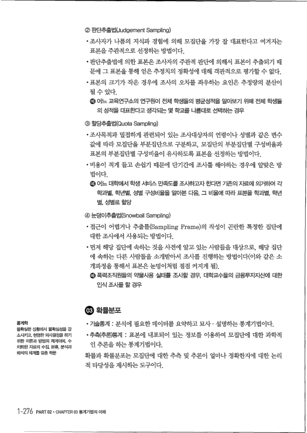
② 판단추출법（Judgement Sam이ing)

- 조사자가 나름의 지식과 경험에 의해 모집단을 가장 잘 대표한다고 여겨지는
표본을 주관적으로 선정하는 방법이다．

- 판단추출법에 의한 표본은 조사자의 주관적 판단에 의해서 표본이 추출되기 때
문에 그 표본을 통해 얻은 추정치의 정확성에 대해 객관적으로 평가할 수 없다．

- 표본의 크기가 작은 경우에 조사의 오차를 좌우하는 요인은 추정량의 분산이
#### 될 수 있다． 
.I 어느 교육연구소의 연구원이 전체 학생들의 평균성적을 알아보기 위해 전체 학생들 의 성적을 대표한다고 생각되는 몇 학교를 나름대로 선택하는 경우 ③ 할당추출법（Quota Sampling)

- 조사목적과 밀접하게 관런되어 있는 조사대상자의 연령이나 성별과 같은 변수
값에 따라 모집단을 부분집단으로 구분하고 , 모집단의 부분집단별 구성비율과 표본의 부분집단별 구성비율이 유사하도록 표본을 선정하는 방법이다．

- 비용이 적게 들고 손쉽기 때문에 단기간에 조사를 해야하는 경우에 알맞은 방
법이다． c[l 어느 대학에서’학생 서비스 만족도를 조사하고자 힌다면 기존의 자료에 의거하여 각 학과별 , 학년별 , 성별 구성비율을 알아본 다음 , 그 비율에 따라 표본을 학과별 , 학년 별 , 성별로할당 ④ 눈덩이추출법（Snowball Sampling)

- 접근이 어렵거나 추출틀（Sampling Frame）의 작성이 곤란한 특정한 집단에
대한 조사에서 사용되는 방법이다．

- 먼저 해당 집단에 속하는 것을 사전에 알고 있는 사람들을 대상으로 , 해당 집단
에 속하는 다른 사람들을 소개받아서 조사를 진행하는 방법이다（이와 같은 소

#### 개과정을 통해서 표본은 눈덩이처럼 점점 커지게 됨）. 
.I 폭력조직원들의 약물사용 실태를 조사할 경우， 대학교수들의 금융투자자산에 대한 인식 좌 를 할 경우 .

확률분포

#### · 기술통계 : 분석에 필요한 데이터를 요약하고 묘사 · 설명하는 통계기법이다．
통계학 불확실한 상황에서 불확실성을 감

- 추측〈추론）통계 : 표본에 내포되어 있는 정보를 이용하여 모집단에 대한 과학적
소시키고， 현명한 의사결정을 하기 위한 이론과 방법의 체계이며 , 수 치화된 자료의 수집． 분류， 뷘 과 인 추론을 하는 통계기법이다． 해석의 체계를 갖춘 학문 확률과 확률분포는 모집단에 대한 추측 및 추론이 얼마나 정확한지에 대한 논리 적 타당성을 제시하는 도구이다． 1 -276 PART 02. CHAPTER 03통계기법의이해

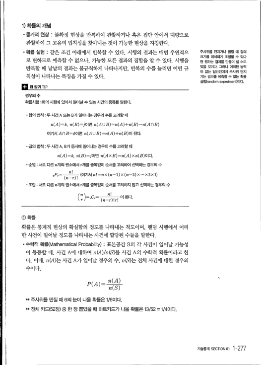
1) 확률의 개념

- 통계적 현상 : 불확정 현상을 반복하여 관찰하거나 혹은 집단 안에서 대량으로
관찰하여 그 고유의 법칙성을 찾아내는 것이 가능한 현상을 지칭한다．

#### · 확률 실험 : 같은 조건 아래에서 반복할 수 있다 . 시행의 결과는 매번 우연적으 
로 변하므로 예측할 수 없으나 , 가능한 모든 결과의 집합을 알 수 있다 . 시행을 반복할 때 낱낱의 결과는 불규칙하게 나타나지만 , 반복의 수를 늘리면 어떤 규 칙성이 나타나는 특징을 가질 수 있다． .

더 압기 ㄲp 경우의 수 확률시험 1회의 시행에 있어서 일어날 수 있는 사건의 종류를 말한다．

- 합의 법칙 : 두 사건 A 또는 B가 일어나는 경우의 수를 고려할 때
n(A)=k, n(B)=y이면 ’祗41.JB)=n(AH雜（끄)-n (AflB) 여기서 AflB=cb이면 n(AUB)=n(A)+n(B）이 된다．

- 곱의 법칙 : 두 사건 A. B가동시에 일어나는 경우의 수를 고려할 때
n(A)=k, n(B)=／이면 ，聊4xB)=n(A) xn(B）이다．

- 순열 : 서로 다른 n개의 원소에서 ?，개를 중복없이 순서를 고려하여 선택하는 경우의 수
, P,=  ' n!

(여기Mn!=nx (n- 1) x (n- 2) x...x2x1) `, n- r7 뜨

- 조합 : 서로 다른 n개의 원소에서 γ개를 중복없이 순서를 고려하지 않고 선택하는 경우의 수
### （鬱）=,,cㅌ ( ,n!
(n-r)!r ! 이된다· ① 확률 확률은 통계적 현상의 확실함의 정도를 나타내는 척도이며 , 랜덤 시행에서 어떠 한사건이 일어날 정도를 나타내는 사건에 할당된 수들을 말한다．

- 수학적 확률《MathematicaI Probability) : 표본공간 S의 각 사건이 일어날 가능성
#### 이 동등할 때 , 사건 A에 대하여 n4)/nS）를 사건 A의 수학적 확률이라고 한 
다 . 이때 ,n(4）는 사건 A가 일어날 경우의 수 , 끄（S）는 전쳬 사건에 대한 경우의 수이다． ** 주사위를 던질 때 6의 눈이 나올 확률은 1/6이다． ** 전쳬 카드（52장） 중 한 장 뽑았을 때 하트카드가 나올 확률은 13/52=1/4이다．

> 주사뮈를 던지거LF 굴릴 때 힘의 
크기를 미세하게 조절할 수 있다 면 원하는 결과를 만들어 낼 수도 있을 것이다. 그러나 이러한 능력 이 없는 일반인에게 주사위 던지 기는 결과를 예측할 수 없는 확률 실험（random experiment）이다．

> `
> 기술통계 SECTION 01 1 -277
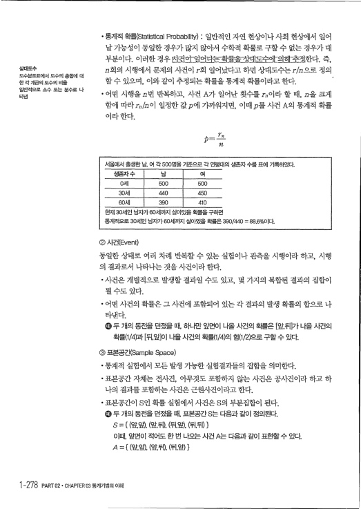
- 통계적 확률(Statistical Probability) : 일반적인 자연 현상이나 사회 현상에서 일어 
날 가능성이 동일한 경우가 많지 않아서 수학적 확률로 구할 수 없는 경우가 대

#### 부분이다 . 이러한경우F꺅콴이－압어다奉E희스률貧창대도수에－의해추젓한다 . 즉，
끄회의 시행에서 문제의 사건이 r회 일어났다고 하면 상대도수는r/h으로 정의 할수 있으며 , 이와같이 추정되는확률을통계적 확률이라고 한다． 상대도수 도수분포표에서 도수의 총합에 대 한 각 계급의 도수의 비율 일반적으로 소수 또는 분수로 나

- 어떤 시행을 끄번 반복하고 , 사건 A가 일어난 횟수를 rn이라 할 때 , 끄을 크게
타냄 함에 따라r끄／h이 일정한 값β에 가까워지면 , 이때 p를 사건 A의 통계적 확률 이라한다． , γn

#### n
서윕게서 출생한남 , 여 각 500명을 기준으로 각 연령대의 삳년：자 수를 표에 기록하였다． 생존자수 남 여 0세 500 500 30세 440 450 60세 390 410 현재 30세인 남차가 60세까지 살아있을 확률을 구하면 통계적으로 30세인 남자가 60세까지 살아있을 확률은 390/440 = 88.6％이다． ② 사건（Event) 동일한 상태로 여러 차례 반복할 수 있는 실험이나 관측을 시행이라 하고 , 시행 의 결과로서 나타나는 것을 사건이라 한다．

- 사건은 개별적으로 발생할 결과일 수도 있고 , 몇 가지의 복합된 결과의 집합이
될 수도 있다．

- 어떤 사건의 확률은 그 사건에 포함되어 있는 각 결과의 발생 확률의 합으로 나
#### 타낸다． 
.l 두 개의 동전을 던졌을 때 , 하나만 앞면이 나올 사건의 확률은 〔앞，뒤〕가 나올 사건의 확률《1/4）과 ［뒤 , 앞］이 나올 사건의 확률《1/4）의 합(1/2）으로 구할 수 있다 .

③ 표본공간（Sam이e Space)

- 통계적 실험에서 모든 발생 가능한 실험결과들의 집합을 의미한다．
- 표본공간 자쳬는 전．사건 , 아무것도 포함하지 않는 사건은 공사건이라 하고 하
나의 결과를 포함하는 사건은 근원사건이라고 한다．

#### · 표본공간이 S인 확률 실험에서 사건은 S의 부분집합이 된다． 
c[I 두 개의 동전을 던졌을 때 , 표본공간 S는 다음과 같이 정의된다． s= { （앞，앞） , （앞，뒤） , （뒤，앞） , （뒤，뒤） } 이때 , 앞면이 적어도 한 번 나오는 사건 A는 다음과 같이 표현할수 있다.

/` = { （앞，앞） , （앞，뒤） , （뒤 , 앞） } 1-278 PART 02. CHAPTER03통계기법의이해

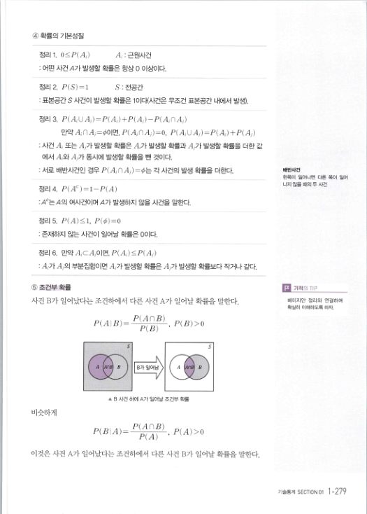
@) 확률의 기본성칠

#### 정리 1. o二P(A) 
A, : 근원사건 : 어떤 사건 겨가 발생할 확률은 항상 0 이상이다．

```python
정리 2. P(S)=i 
S : 전공간
```
: 표본공간＄ 사건이 발생할 확률은 1이다（사건은 무조건 표본공간 내에서 발생）.

#### 정리 3. P(A1U싸『）=／긱A1)+P(A)-P (AfflAp
```python
만약A1flA1=熒이면 , P(A/ flAγ)=o, P(A'UA1)=P(A{)+P(Ap 
: 사건 Af 또는 싸『가 발생할 확률은 Ar가 발생할 확률과 A／가 발생할 확률을 더한 값
```
에서 계와 A,『가 동시에 발생할 확률을 뺀 것이다． : 서로 배반사건인 경우 /)( Af fl A1) =熒는 각 사건의 발생 확률을 더한다．

#### 정리4. P(Ac)=1-P(A)
：겨c는겨의 여사건이며 겨가 발생하지 않을 사건을 말한다．

#### 정리 5. P(A)囊i, P(c/4=o
: 존재하지 않는 사건이 일어날 확률은 0이다． 정리 6 . 민퍅AfcA／이면 , P(A1)二P(Ap : A，·가 A／의 부분집합이면 계가 발생할 확률은 A／가 발생할 확률보다 작거나 같다． ⑤ 조건부 확률 사건 B가 일어났다는 조건하에서 다른 사건 A가 일어날 확률을 말한다．

>o
AB 사건 하에 A가 일어날 조건부 확률 비슷하게

#### >.
이것은 사건 A가 일어났다는 조건하에서 다른 사건 B가 일어날 확률을 말한다．

> 배반사건
> 한쪽이 일어나면 다른 쪽이 일어 
나지 않을 때의 두 사건

#### r잽 기적의 뀌P
> 베이지안 정리와 연결하여 
확실히 이해하도록 하자．

> 기술통계 SECTION 01 1 -279
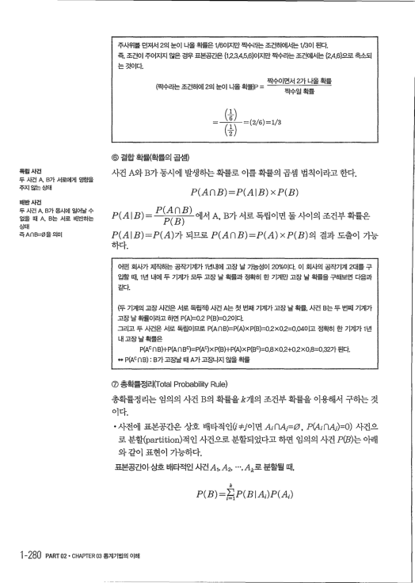
주사위를 던져서 2의 눈이 나올 확률은 1/6이지만 짝수라는 조건하에서는 1/3이 된다． 즉 , 조건이 주어지지 않은 경우 표본공간은 {12.3.4.5.6｝이지만 짝수라는 조건에서는 {2,4.6｝으로 축소되 는 것이다．

## （짝수2階조건0뻬2의눈이
［읕확률） 「＝ 짝쉬"棚嚆확률 .

.

.

.

.

#### = ( 乙 / b) = 1/ ij 
（눠 ⑥ 결합 확률《확률의 곱셈） 독립사건 두 사건 A, B가 서로에게 영향을 주지 않는 상태 사건 A와 B가 동시에 발생하는 확률로 이를 확률의 곱셈 법칙이라고 한다．

#### P(AnB)=P(AIB) xP(B)
배반 사건 두 사건 A, B가 동시에 일어날 수 없을 때 A. B는 서로 배반하는 상태 즉 AflB=.을 의미

#### P에β，'= P（조．므β） 에"서' A ,' T가서'로독립이면둘사이의' 조건부회'률은 
' "-'-- / ./' (B) " ' - ,' - I I - - ' I I I_. - ' I - I_. I －∼ P（게B)=P(A）가 되므로 P(AnB)=P(A) XP(B）의 결과 도출이 가능 하다． 어떤 회사가 제작하는 공작기계가 1년내에 고장 날 가능성이 20％이다. 이 회사의 공작기계 2대를 구 입할 때 , 1년 내에 두 기계가 모두 고장 날 확률과 정확히 한 기계만 고장 날 확률을 구해보면 다음과 같다． （두 기계의 고장 사건은 서로 독립적） 사건 A는 첫 번째 기계가 고장 날 확률 , 사건 B는 두 번째 기계가 고장 날 확률이라고 하면 P(A)=0.2 P(B)=02이다． 그리고 두 사건은 서로 독립이므로 P(An B)=P(A)XP(B)=0.2X02=0.04이고 정확히 한 기계가 1년 내 고장 날 확률은 P(Ac fl B)+P(A n B9=P(Ac)X P(B)+P(A)x P(Bc)=0.8 x0.2+0.2x0.8=0.32가 된다． **P(A아1B): B가고장날 때 A가고짐톈극지 않을 확률 ⑦ 총확률정리（Total Probability Rule) 총확률정리는 임의의 사건 B의 확률을 k개의 조건부 확률을 이용해서 구하는 것 이다．

#### ·사전에 표본공간은 상호 배타적인α＊／이면 A1flA3=J, P幟flA)=O) 사건으
#### 로 분할（partition）적인 사건으로 분할되었다고 하면 임의의 사건 P(B）는 아래 
와 같이 표현이 가능하다．

#### 표본공간이상호배타적인사건A1'A2. " ' ,Ak로분할될때，
#### k 
P（β）=>J괼P(좨A1)P(A1) 1-280 PART 02. CHAPTER 03통계기법의이해

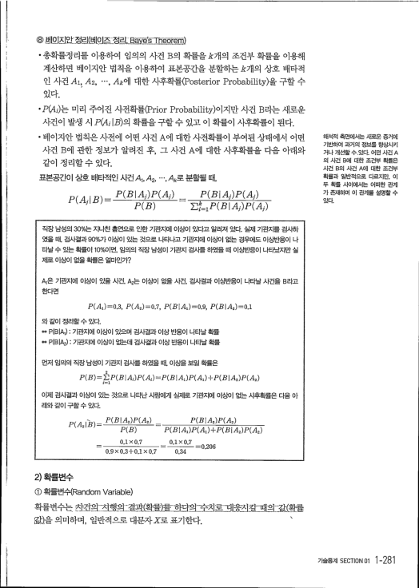
⑧ 베희시얀정희（베희즈““정ㄹI욥取否'聊Theor聊）

- 총확률정리를 이용하여 임의의 사건 B의 확률을 k개의 조건부 확률을 이용해
#### 계산하면 베이지안 법칙을 이용하여 표본공간을 분할하는 k개의 상호 배타적 
인 사건 A1, A2, … , Ai에 대한 사후확률（Posterior Probability）을 구할 수

#### 있다． 
'

- P幟）는 미리 주어진 사전확률（Prior Probability）이지만 사건 B라는 새로운
#### 사건이 발생 시 f)c4시B）의 확률을 구할 수 있고 이 확률이 사후확률이 된다．
#### · 베이지안 법칙은 사전에 어떤 사건 A에 대한 사전확률이 부여된 상태에서 어떤 
사건 B에 관한 정보가 알려진 후 , 그 사건 A에 대한 사후확률을 다음 아래와

#### 같이 정리할수 있다 .
표본공간이 상호 배타적인 사건겨1. A2. … , 싸로 분할될 때，

#### Dr 계 - Dㄴ－  P（세거．/)／〕（Ap  -  
P（좨A1)P(Ap ' ｀시씨－ P（β）

- 
ki=1P（세A‘榧（A/) 직장 남성의 30％는 지나친 흡연으로 인한 기관지에 이상이 있다고 알려져 있다 . 실제 기관지를 검사하 였을 때 , 겅사결과 90％가 이상이 있는 것으로 나타나고 기관지에 이상이 없는 경우에도 이상반응이 나 타날 수 있는 확률이 10％이면 , 임의의 직장 남성이 기관지 검사를 하였을 때 이상반응이 나타났지만 실 제로 이상이 없을 확률은 얼마인가？ 써은 기관지에 이상이 있을 사건 , A2는 이상이 없을 사건 , 검사결과 이심빤응이 나타날 사건을 B라고 한다면 P(A1) =0.3, P(A2) =0.7, P(B IA1) =0.9, P(B IA2) =0.1 와 같이 정리할 수 있다． **PC미A1) : 기관지에 이상이 있으며 검사결과 이상 반응이 나타날 확률 **P(비A2) : 기관지에 이상이 없는데 검사결과 이상 반응이 나타날 확률 먼저 임의의 직장 남성이 기관지 검사를 하였을 때 , 이상을 보일 확률은 2 P(B) =프［P(B I A1)P(A') =P(B IA1)P(A1) +P(끼A2)P(A2) 이제 검사결과 이상이 있는 것으로 나타난 사람에게 실저扈 기관지에 이상이 없는 사후확률은 다음 아 래와 같이 구할 수 있다． (／ ㅟ늉） )P P（게A2)P(A2) P(B I A1)P(A1) +P(B I A2)P(A2) (A2IB)

0. 1x0.7
1X0.

206

0. 34
0. 9 X 0.3+0.1 x 0.7
2) 확률변수 ① 확률변수《Random Variable)

#### 확률변수는 츠M낌〕
；행의，爰괴＜획鴦令警하다의격＝치로기；L응키，칼ㅍ패의I갔（획：률 砒을의미하며 , 일반적으로대문자Z로표기한다． ,

> 해석적 측면에서는 새로운 증거에 
기반하여 과거의 정보를 향상시키 거나 개선할 수．있다. 어떤 사건 A 의 사건 B에 대한 조건부 확률은 사건 B의 사건 A에 대한 조건부 확률과 일반적으로 다르지만 , 01 두 확률 사이에서는 어떠한 관계 가 존재하며 이 관계를 설명할 수

> 있다．
> 기술통계 SECTION 01 1-281
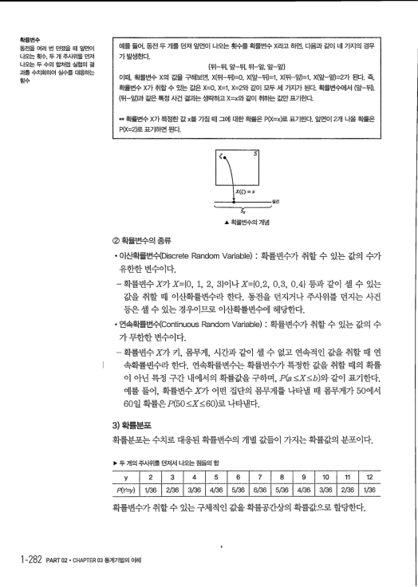
확률변수 동전을 여러 번 던쳤을 때 앞면이 나오는 횟수. 두 개 주사위를 던쳐 나오는 두 수의 합처럼 실험의 결 과를 수치화하여 실수를 대응히는 함수 예를 들어 . 동전 두 개를 던져 앞면이 나오는 횟수를 확률변수 x라고 하면 , 다음과 같이 네 가지의 경우 가 발생힌다． ｛뒤－뒤 , 앞－뒤 , 뒤－앞, 앞－앞｝ 이때 . 확률변수 x의 값을 구해보면 . x（뒤－뒤）=0. X（앞－뒤）=1. X（뒤－앞）=1. X（앞－앞）=2가 된다 . 즉， 확률변수 x가 취할 수 있는 값은 X=0. X=1. X=2와 같이 모두 세 가지가 된다. 확률변수에서 （앞－뒤）.

（뒤－앞）과 같은 특정 사건 결과는 생략하고 X=x와 같이 취하는 값만 표기한다． ** 확률변수 x가 특정한 값 x를 가질 때 그에 대한 확률은 P(X=x）로 표기한다. 앞면이 2개 나올 확률은 P(X=2）로 표기하면 된다． S 실선

- 
－叉－ ▲ 확률변수의 개념 ② 확률변수의 종류

#### · 이산확률변수《Discrete Random Variable) : 확률변수가 취할 수 있는 값의 수가
유한한 변수이다． －확률변수Z가X={0, 1, 2, 3｝이나Z 0.2, 0.3, 0.4} 등과 같이 셀 수 있는

#### 값을 취할 때 이산확률변수라 한다 . 동전을 던지거나 주사위를 던지는 사건
등은 셀 수 있는 경우이므로 이산확률변수에 해당한다．

- 연속확률변수（Continuous Random Variable) : 확률변．수가 취할 수 있는 값의 수 
가 무한한 변수이다．

- 확률변수Z가 키 , 몸무게 , 시간과 같이 셀 수 없고 연속적인 값을 취할 때 연
#### 속확률변수라 힌다 . 연속확률변수는 확률변수가 특정한 값을 취할 때의 확률
#### 이 아닌 특정 구간 내에서의 확률값을 구하며 , P(a 二X二b）와 같이 표기한다 .
예를 들어， 확률변수 x가 어떤 집단의 몸무게를 나타낼 때 몸무게가 50에서 60일 확률은／〕(50二x`60）로 나타낸다． 3) 확률분포 확률분포는 수치로 대응된 확률변수의 개별 값들이 가지는 확률값의 분포이다．

> 두 개의 주사위를 던져서 나오는 점들의 합
y 2 3 4 5 6 7 8 9 10 11 12 P(Y=y) 1/36 2/36 3/36 4/36 5/36 6/36 5/36 4/36, 3/36 2/36 1/36 확률변수가 취할 수 있는 구쳬적인 값을 확률공간상의 확률값으로 할당한다． 1-282 PART 02· CHAPTER 03통계기법의이해

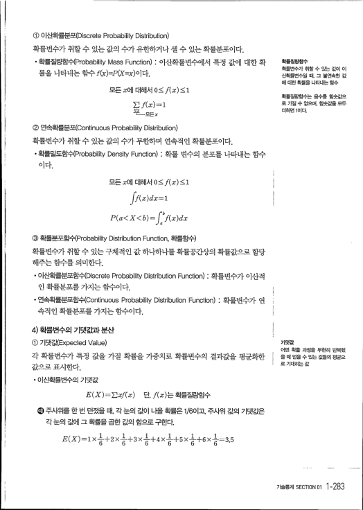
① 이산확률분포（Discrete Probability Distribution) 확률변수가 취할 수 있는 값의 수가 유한하거나 셀 수 있는 확률분포이다．

```python
· 확률질량함수（Probability Mass Function) : 이산확률변수에서 특정 값에 대한 확 
률을 나타내는 함수f什)=P(Kx）이다．
```
모든 x（게 대해서 0二 /（α＝) 三 1

#### E f (x)=1 
vx ㄱ＝－모든x ② 연속확률분포（Continuous Probability Distribution) 확률변수가 취할 수 있는 값의 수가 무한하며 연속적인 확률분포이다．

#### · 확률밀도함수（Probability Density Function) : 확률 변수의 분포를 나타내는 함수
이다．

# 모든 x에 대해서 0二f(x) 二1 
ff(x)dx= 1

## P(a<X<b)=fbf(x)dx
③ 확률분포함수《Probability Distribution Function , 확률함수） 확률변수가 취할 수 있는 구쳬적인 값 하나하나를 확률공간상의 확률값으로 할당 해주는 함수를 의미한다．

- 이산확률분포함쉬Discrete Probability Distribution Function) : 확률변수가 이산적 
인 확률분포를 가지는 함수이다．

#### · 연속확률분포함수（Continuous Probability Distribution Function) : 확률변수가 연
속적 인 확률분포를 가지는 함수이다． 4) 확률변수의 기댓값과 분산 ① 기댓값（Expected Value) 각 확률변수가 특정 값을 가질 확률을 가중치로 확률변수의 결과값을 평균화한 값으로 표시한다．

- 이산확률변수의 기댓값
#### E(X)=Exf(x) 단, f (x）는확률질량함수
#### .l 주사위를 한 번 던졌을 때 , 각 눈의 값이 나올 확률은 1/6이고 주사뮈 값의 기댓값은 
각 눈의 값에 그 확률을 곱한 값의 합으로 구한다． "/ T/, , . . 1 . . . . -I , ', . . 1 , . . . 1 , " . . 1 , ^ . . 1 k'(' X 1=1 x- --I-2x 즙－－논3x 숫－+4. x. 숫＋5 x. 숫－→，'-6 )c' 즛－==3 .' 5

- ' - / 
- 
6 ' - 6 ' 一 6 ' ^ " 6 ' v " 6 ' 닐 " ' 6 u .' u

> 확률질량함수
> 확률변수가 취할 수 오（튼 값이 이 
산확률변수일 때 . 그 불연속한 값 에 대한 확률을 나타내는 함수

> 확률질량함수는 음수를 함숫값으 
로 가질 수 없으며 . 함숫값을 모두 더하면 1이다．

> 기댓값
> 어떤 확률 과정을 무한히 반복했 
을 때 얻을 수 있는 값들의 평균으 로 기대하는 값

> 기술통계 SECTION 01 1 -283
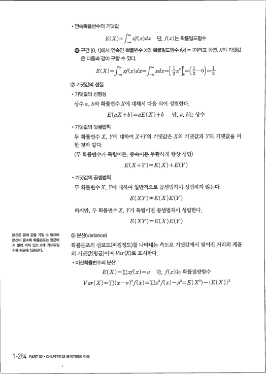
- 연속확률변수의 기댓값
# E(X)=f xf(x)dx 단，/(x）는확률밀도함수
#### c[I 구간 [0. 1］에서 연속인 확률변수／의 확률밀도함수 ／什) =1이라고 하면 , x의 기댓값
은 다음과 같이 구할 수 있다，

# E(Z)＝工: xf(x)dx=f’，汰더흉시；=(4-o)글
② 기댓값의 성질

- 기댓값의 선형성
상수a, b와확률변수Z에 대해서 다음식이 성립한다．

#### E(aX+b)=aE(X)+b 
단 , a, b는상수

- 기댓값의 덧셈법칙
#### 두 확률변수x, y에 대하여 x+Y의 기댓값은Z의 기댓값과 y의 기댓값을 더
한 것과 같다． （두 확률변수가 독립이든 , 종속이든 무관하게 항상 성립）

#### E(x+ Y) =E(X) +E(Y)
- 기댓값의 곱셈법칙
#### 두확률변수Z , y에 대하여 일반적으로곱셈법칙이 성립하지 않는다．
#### E(XY) 쑤E(Z)E(Y)
#### 하지만 , 두확률변수x, y가독립이면곱셈법칙이 성립한다．
#### E(XY) =E(x)E(Y)
③ 분산（Variance) 분산은 음의 값을 가질 수 없으며 분산이 클수록 확률분포는 평균에 확률분포의 산포도（퍼짐정도）를 나타내는 측도로 기댓값에서 떨어진 거리의 제곱 서 멀리 퍼져 있고 0에 가까워질 수록 평균에 죠屠된다． 의 기댓값（평균）이며 Var( ）로 표시한다．

#### · 이산확률변수의 분산 
E(X)=刀xf(x)=/z 단 , /（교＇）는확률질량함수

#### Var(X) =Z(x- p)2f(x) =Ex2f(x) -p2=E(X2) - {E(X)}2
1 -284 PART 02 ' CHAPTER 03통계기법의이해

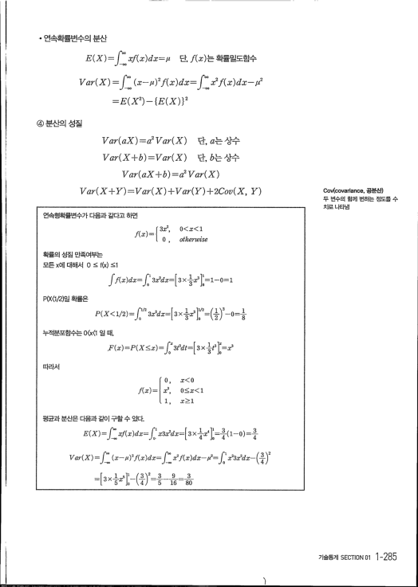
- 연속확률변수의 분산
## E(Z)=／二xf(x)dx=〃 단，f(x）는확률밀도함수
# Var(X) =fㅍ (x_p)2f(x)dx=fx2f(x)dx_p2
#### =E(X2)-{E (X)}2
④ 분산의 성질

#### Var(aX) =a2 Var(X) 단 , α는상수
#### Var(X+b)=Var(X) 단 , 石는상수
#### Var(aX+b)=a2 Var(X)
#### Var(X+Y)=Var(X)+Var(Y)+2Cov(X, Y)
연속형확률변수가 다음과 같다고 하면 . .

13x2, / Uz了 7 = 1 〔 0, 0<x<1 otherwise 확률의 성질 만족여부는 모든 x（게 대해서 0 二 1(x) 드 1 r r/ . ' r ', .' ' r^ . . i i ' .

J J(x)dx=J P(X<1/2）일 확률은

## P(Z<1/2)=f, " ' 一눼3/ 1 311/2= fl
P(X< 1/2) f1/2 3X2dX=[ 3 X--x j =--)3-o=j-

# 누적분포함수는 O<x<1 일 때． 
f(x) =P(X二x) =f'3t2dt눼3x읗이。→" 따라서

#### 0 
J(x)키x", 0二x<1 (. 1 , x츠1 , .

.

평균과 분산은 다음과 같이 구할 수 있다．

# E(X) rrJ' xf(x)dx=f' x3x2dxrr[ 3 X+X4]; =+(1-0)= --
# Var(X) =f ' (x_/)2f(x)dx=f x2f(x)dx_p2=f1 x23x2dx- (3)2
=13×찧끼 ' -r흐，낌후－온－흔 I.

Z Jo \41 0 It2 b tJ

> Cov(covariance . 공분산） 
두 변수의 함께 변하는 정도를 수 치로 나타냄

> 기술통계 SECTION 01 1-285
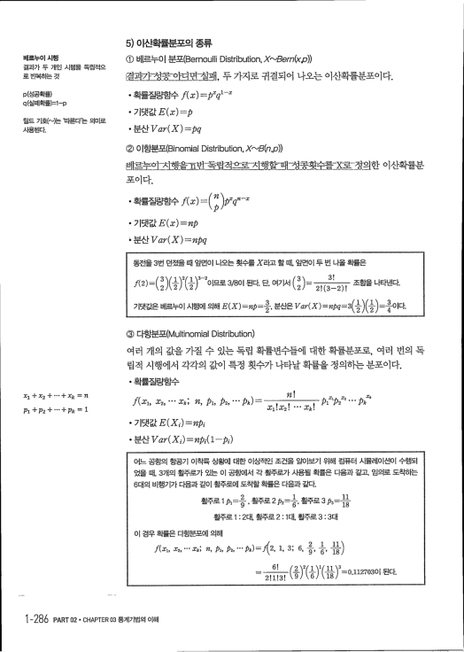
5) 이산확률분포의 종류 ① 베르누이 분포（Berno매i ustribution, X'-'-'Bern(xp)) 베르누이 시행 결과가 두 개인 시행을 독립적으 로 반복하는 것 蹙괴솨뜨성읖의즈〕면걸꽤 , 두가지로귀결되어 나오는 이산확률분포이다．

#### · 확률질량함수 /(x) == pXql=
p（성공확률） q（실패확률）=1-p

#### · 기댓값 E(x) ＝夕
틸드 기호（`）는 ' 따른다'는 의미로

- 분산 γαγ（x) =pq
사용된다． ② 이항분포（Binomial Distribution, X '-'B(n,p)) 베르누.炒〕 행을万Y뀌∼독립척으로켜햇軟패죠넝훗츳횟仝를［蘆孀薑정．와한 이산확률분

#### 포이다 .
#### . 확률질링灌갚수 /('汕＝（쐬yα',2-: 
" ---- " ' " \pJ- -

#### · 기댓값 E(x) =n
' 분산 γαγ（Z) =npq 동전을 3번 던졌을 때 앞면이 나오는 횟수를 Z라고 할 때 , 앞면이 두 번 나올 확률은

## f(2) = (; )（흉）'（흉）""이a 3/8이된다·단·여기서（;): :!(r스：)! 조합을나타낸다·
```python
-.ht1ㄱtfl , .11-., ^` I I츤U,SIl n I'II flf Vr\ 
-- , 
3 ' -. 료L'` Tz 
r T/, 
: 
,j 1 \f 1 \ 
3 ,,.,-
시，
」九& 
i됴i- ` i Aj빕U1l 
jo ／꽈 ` A) =np-
-j-, 世 -I:ㄷ 
V αγ｀^ 7 -7z/ ' (/－이 ＝丁 " ㅋ－ ㅣ 
-｀시ㄴ「· 
o 
, 습 / 
` 'J / 
탬
```
③ 다항분포（Multinomial Distribution) 여러 개의 값을 가질 수 있는 독립 확률변수들에 대한 확률분포로 , 여러 번의 독 립적 시행에서 각각의 값이 특정 횟수가 나타날 확률을 정의하는 분포이다．

- 확률질량함수
x1 + x2 + ' " ' + Xk = ?t

#### f (.x1, x2, ···Xk; n, p', 夕2, ···夕k)=
x1!x2!

. J.1 X1j2 XZ P1 P2… 久r' " ' 차 !

川 了71 + 了72 + … + pk == 1

#### · 기댓값 E(X1) =n1
#### · 분산 γαγ（지） =np1(i- 珌
어느 공항의 항공기 이착륙 상황에 대한 이상적인 조건을 알아보기 위해 컴퓨터 시뮬레이션이 수행되 었을 때 , 3개의 흴주로가 있는 이 공항에서 각 횔주로가 사용될 확률은 다음과 같고 임의로 도착하는 6대의 비행기가 다음과 같이 흴주로에 도착할 확률은 다음과 같다． er- ----, 』 .

2 숫Lㅜ→ n , 1 *Lr " ,,, 11 활주로I 1L＝슷 .' 횔주로2 1,2=승 ,' 찔주로31I)3=즐승 딥 , -- 'ra 9 ' - I --jZ 6 ' =1- -ri 18 횔주로 1 : 2대 . 횔주로 2 : 1대 . 횔주로 3 : 3대

## 이 경우 확률은 다항분포에 의해 
f(x1, x2,… Xk; fl, Pl, P2,··· p1)=f(2, 1, 3; 6, j-, 응 , 4-)

#### 가！ 6!.! (2)2/1 \1/끓 ' "=0· 11270301된다.
= 2!1!3! - 1 -286 PART 02· CHAPTER 03통겨I기법의이해

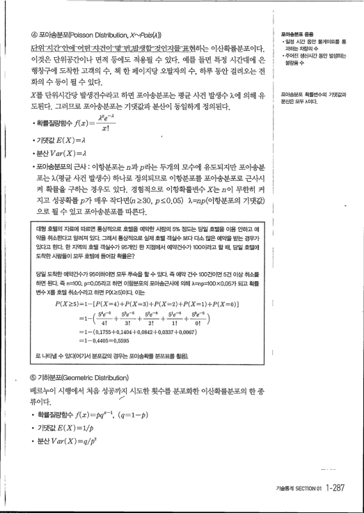
#### ④ 포아송분포（Poisson Distribution, 沁'Pois('))
단위콰간안에－어떤－사콴이－몇－버곁｝생학혔"이지름표혀l하는 이산확률분포이다． 이것은 단위공간이나 면적 등에도 척용될 수 있다 . 예를 들면 특정 시간대에 은 행창구에 도착한 고객의 수 , 책 한 폐이지당 오탈자의 수 , 하루 동안 걸려오는 전 화의 수 등이 될 수 있다． Z를 단위시간당 발생건수라고 하면 포아송분포는 평균 사건 발생수 入에 의해 유 도된다 . 그러므로 포아송분포는 기댓값과 분산이 동일하게 정의된다．

#### A 
· 확듈실랑함수 /（지 = r!

- 
.

.

#### · 기댓값 E（兀） ＝ㅅ
#### · 분산 γar(x) =A
- 포아송분포의 근사 : 이항분포는 끄과β라는 두개의 모수에 유도되지만 포아송분 
포는 入（평균 사건 발생수） 하나로 정의되므로 이항분포를 포아송분포로 근사시 켜 확률을 구하는 경우도 있다 . 경험적으로 이항확률변수Z는끄이 무한히 커

#### 지고 성공확률β가 매우 작다면山 上 30, p二O.05) 2np（이항분포의 기댓값） 
으로 될 수 있고 포아송분포를 따른다． 대형 호텔의 자료에 따르면 통상직으로 호텔을 예약한 ㅅ탐의 5% 정도는 당일 호텔을 이용 안하고 예 약을 취소한다고 알려져 있다. 그래서 통상적으로 실제 호텔 객실수 보다 다소 많은 예약을 받는 경우가 있다고 한다 . 한 지역의 호텔 객실수가 95개인 한 지점에서 예약건수가 100이라고 할 때 , 당일 호텔에 도착한 사람들이 모두 호텔에 들어갈 확률은？ 당일 도착한 예약건수가 95이하이면 모두 투숙을 할 수 있다. 즉 예약 건수 100건이면 5건 이상 취소를 하면 된다． 즉 n=100, p=O.05라고 하면 이항분호의 포아송근사에 의해 ㅅ=np=100 x0.05가 되고 확률 변수 x를 호텔 취소수라고 하면 P(x之5）이다. 이는 P(X브5)=1- [P(X=4)+P(X=3)+P(X=2)+P(X=1)+P(X=o)] / 54e-5 53e5 52e-5 5'e-5 50e-5 \ =1 1 …－ + -+ …－-+ …－+ --

- I 
" 4!

3!

2!

1!

0!

/ =1- (o.1755+o.1404+o.0842+o.0337+o.0067) = 1- 0.4405=0.5595 로 나타낼 수 있다（여기서 분포값의 경우는 포아송확률 분포표를 흴용）.

⑤ 기하분포（Geometric Distribution) 베르누이 시행에서 처음 성공까지 시도한 횟수를 분포화한 이산확률분포의 한 종 류이다 .

/

#### · 확률질량함수／(x)＝夕αz크 , (q=1-p)
#### · 기댓값E(x) = 1/p
- 분산γαγ（Z)= q/p2
> 포아송분포 응용 
- 일정 시간 동안 톨게이트를 통 
과하는 ㅊ턍의 수

- 주어진 생산시간 동안 발생하는 
불량품수

> 포아송분포 확률변수의 기댓값과 
분산은 모두 ㅅ이다．

> 기술통계 SECTION 01 1 -287
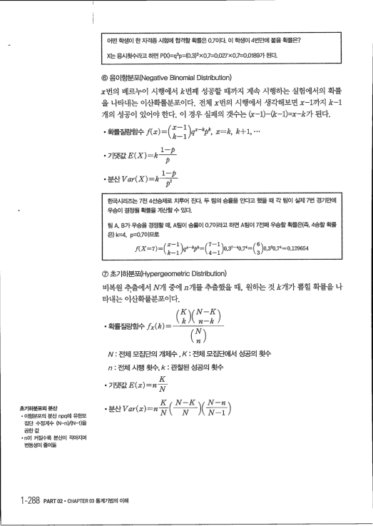
어떤 학생이 한 자격증 시험에 합격할 확률은 0.7이다. 이 학생이 4번만에 붙을 확률은？ x는응시횟수라고하면P(X)=q3p=(0.3)3x0.7=0.027xO.7=0.0189가된다． ⑥ 음이항분포（Negative Binomial Distribution) Z번의 베르누이 시행에서 k번째 성공할 때까지 계속 시행하는 실험에서의 확률

#### 을 나타내는 이산확률분포이다 . 전쳬 x번의 시행에서 생각해보면 /-1까지 k- i.
#### 개의 성공이 있어야한다 . 이 경우 실패의 갯수는 (K-i)-伋-1) x-k가 된다．
## ·확률질링함수／(x)=（露프；)α ' "‘》',
#### x=k, k+1, …
# ·기댓값E
(Z)＝冷 ' 7

#### p
WVar

### 웬γ8/
한국시리즈는 7전 4선승제로 치루어 진다 . 두 팀의 승률을 안다고 했을 때 각 팀이 실제 7번 경기만에 두승이 결정될 확률을 계산할 수 있다． 팀 A. B가 우승을 경쟁할 때 , A팀이 승률이 0.7이라고 하면 A팀이 7전ㅈ재 우승할 확률은《즉． 4승할 확률 은珏=4, p=o.7이므로

#### /(Z=7)=(z-.1，了今ㄴf7-1\
f (X=7) , , )O.37,40.74=l6, JO.330.74=O.129654 ` 尺－- 』． / '4_ i ' , . / ⑦ 초기하분포佃ypergeometric Distribution) 비복원 추，출에서 N개 중에 끄개를 추출했을 때， 원하는 것 充개가 뽑힐 확률을 나 타내는 이산확률분포이다．

#### · 확률질량함수 /z(k) = 
(K\(N- K kA k

## （씩
#### N : 전체 모집단의 개체수 , /< : 전체 모집단에서 성공의 횟수
```python
／그 : 전체 시행 횟수 , /( : 관찰된 성공의 횟수 
K 
· 기댓값 E（그＝) = 41 
- 一ㅁㅅ ∼｀∼／ ' v IV
```
### . . 
KI  N- K \I N- n \ ' 분- Var(x)=n7 ( 〃 八N-i7 초기하분포의 분산

- 이항분포의 분산 npq에 유한모 
집단 수정계수 (N-n》／(N-1）을 곱한값

- n이 커잘수록 뒤난이 작아지며 
변동성이 줄《거듦 1 -288 PART 02 . CHAPTER 03통계기법의이해

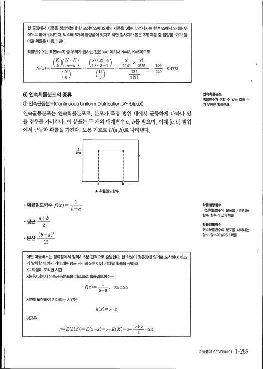
한 공장에서 저居을 생산하는데 한 포징빡스에 12개의 저居을 넣는다. 겅ㅅ짜는 한 박스에서 3개를 무 작위로 뽑아 검사힌다 . 박스에 5개의 불량품이 있다고 하면 검ㅅ짜가 뽑은 3개 저居 중 불량품 1개가 들 어갈 확률은 다음과 같다． 확률변수x는표본《n=3）중우리가원하는값은 (=1 여기서 NJ=12. K=5이므로

# (:)(12- 5\
（ 5느×크느 /K\ f N- 1!4!

2!5!

八 4773 12!

〃 220 3!9!

#### (N, \
6) 연속확률분포의 종류 ① 연속균등분포（Continuous Uniform Distribution, X"-'U(a,b))

#### 연속균둥분포는 연속확률분포로 , 분포가 특정 범위 내에서 균등하게 나타나 있 
을 경우를 가리킨다 . 이 분포는 두 개의 매개변수a, b를 받으며 , 이때 [a, 끼 범위 에서 균등한 확률을 가진다 . 보통 기호로 【J(a ,b）로 나타낸다． ▲ 확률밀도함수 1 . 화륵믹두한수 r凸？, = ' ∼ 닉∼ , .

7 , ∼． 汐∼

- 평쥰 ‘까b
2

- 분산  必∼쨔"
i 』〕 어떤 마을버스는 정류장에서 정확히 5분 간격으로 출발힌ㅐ각. 한 학생이 정류장에 임의로 도착하여 버스 가 발차할 때까지 기다리는 평균 시간과 3분 이상 기다릴 확률을 구하라． ）《 : 학생이 도착한 시간 x는 [0.5］에서 연속균둥분포를 따르므로 확률밀도함수는 1 f(x)=-.

O성x즈5 5- 0 ' x분《〕ㅔ 도착하여 기다리는 시간은 h(x) =5- x 평균은 p=E(h(x))=E(5-x)=5-E(X)=5 夕土으－=2.5 2

> 연속확률분포
> 확률변수가 취할 수 있는 값의 수 
가무한한확률분포

> 확률짙량함수
> 이산확률변수의 분포를 나타내는 
함수. 함수의 값이 확률

> 확률밀도함수
> 연속확률변수의 분포를 나타내는 
함수. 함수의 넓이가 확률

> 기술통겨I SECT!ON 01 1 -289
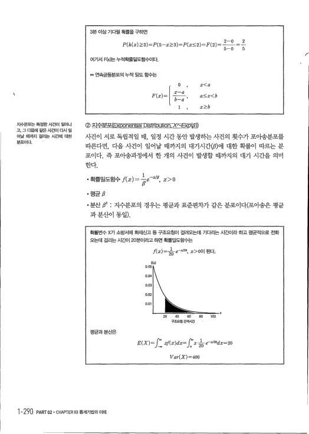
3분 이상 기다릴 확률을 구하면 P(h(x)스3)=P(5-x上3)=P(x二2)=F(2)=上그‘ -흐 5- 0 5 여기서 F(x）는 누적확률밀도함수이다． ** 연속균둥보포의 누적 밀도 함수는 x< a

- 
"/ ,

- 
;z了－'z P IX) -1 -;---m α二x<b a αr2b 1 , ② 뜨，隨분포（ㅌ聊心hUh치鄒Di驪栢b마iㅁ顚及E日β彼）) 지수분포는 특정한 사건이 일어나 고， 그 다음에 같은 사건이 다시 일 어날 때까지 걸리는 시간에 대한 사건이 서로 독립적일 때 , 일정 시간 동안 발생하는 사건의 횟수가 포아송분포를 분포이다． 따른다면 , 다음 사건이 일어날 때까지의 대기시간(8）에 대한 확률이 따르는 분 포이다 . 즉 포아송과정에서 한 개의 사건이 발생할 때까지의 대기 시간을 의미 한다．

#### - . - . - . . 
-, .

1 _ ,。

' 확듈닐도함수A끼＝7 ' " " , x> 0

- 평균13
#### · 분산 β2 : 지수분포의 경우는 평균과 표준편차가 같은 분포이다（포아송은 평균
과 분산이 동일）.

확률변수 x가 소방서에 화재신고 등 구조요청이 걸려오는데 기다리는 시간이라 하고 평균적으로 전화 오는데 걸리는 시간이 20분이라고 하면 확률밀도함수는 f (x) =솖e_n/20, x>O이된다．; f(x)

0. 05
0. 04
0. 03
0. 02
0. 01
구조요청 간격시간 100 x 20 40 60 80 펑균과 분산은

# E(X)큉二 xf(x)dx=f"x욺e 120dx=20
Var(X) =400 1-290 PART02. CI-IAPTER03통계기법의이해

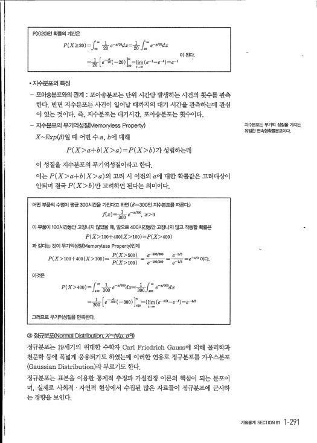
P(x>20）인 확률의 계산은

```python
P(X之20)=j0 읊「 e:/20dx=솖f, e_a/20dx
2。 
이 된다． 
=- - { e命( -20)r,，궉夔， 
(e- ' -e_t) =e '
```
- 지수분포의 특징
#### - 포아송분포와의 관계 : 포아송분포는 단위 시간당 발생하는 사건의 횟수를 관측 
한다 . 반면 지수분포는 사건이 일어날 때까지의 대기 시간을 관측하는데 관심

#### 이 있는 것이다 . 즉 , 지수분포는 대기시간 , 포아송분포는 횟수이다．
- 지수분포의 무기억성질（Memoryless Property)
#### X'-Exp (6）일 때 어떤 수a, 1？에 대해
#### P(X>a+bIX>a)=P(X>b) 가 성립하는데
이 성질을 지수분포의 무기억성질이라고 한다． 이는 ／〕（x〉α＋히x〉α）의 고려 시 이전의 α에 대한 확률값은 고려대상이 안되며 결국 ／〕（x〉心）만 고려하면 된다는 의미이다． 어떤 부품의 수명이 평균 300시간을 가진다고 하면 (i9=300인 지수분포를 따른다〕

### /（驪）＝경늚."/" " " , x>0
이 부품이 100시간동안 고장나지 않았을 때 . 앞으로 400시간동안 고장나지 않고 작동할 확률은 P(X> 100+4001X>100)=P(X>400)

## ::::::
과 같다는 것이 무기억성질（Memorytess Property）인데 1 P 1에） 500) loo+400IX>loo) 7 1에『4.

貂．4/3 이다． 1。。/3。。

e " i。

。) 이것은

#### P(X>400)=f,“，綸r'/" " " 齒＝경늚f e " " " "dx
4。2

#### 芍1_- 
- [e 
o( -300) ", , , = (urn (e_4/3_e_t)= 41 그러므로 무기억성질을 만족한다， ③ 정규분포（嶼聊t酊Di騙t『I恥tidi工’?＜크V（ㅍ，ㅍ쁘）) 정규분포는 19세기의 위대한 수학자 Carl Friedrich Gauss에 의해 물리학과 천문학 등에 폭넓게 응용되기도 하였는데 이러한 연유로 정규분포를 가우스분포 (Gaussian Distribution）라 부르기도 한다． 정규분포는 표본을 이용한 통계적 추정과 가설검정 이론의 핵심이 되는 분포이 며 , 실제로 사회적 · 자연적 현상에서 수집된 많은 자료들이 정규분포에 근사하 는 경향을 보인다．

> 지수분포는 무기억 성질을 가지는 
유일한 연속형확률분포이다．

> 기술통계 SECTION01 1-291
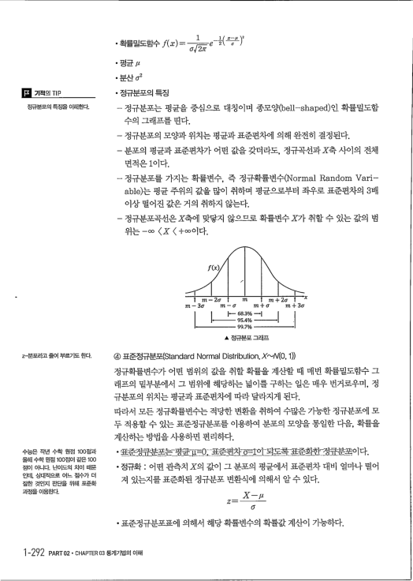
．확률밀도함수／(x)=  ．싣e 2（즈궁쓰）' 0 7 乙7r

- 평균 /z
- 분산 α2
- 정규분포의 특징
.

기적의 지p

- 蔘予분포는 평균을 중심으로 대칭이며 종모양（bell-shaped)인 확률밀도함
장규분포의 특짇읕 이해한다． 수의 그래프를 띤다．

- 정규분포의 모양과 위치는 평균과 표준편차에 의해 완전히 결정된다．
- 분포의 평균과 표준편차가 어떤 값을 갖더라도 , 정규곡선과／축 사이의 전쳬
면적은 1이다．

- 정규분포를 가지는 확률변수 , 즉 蔘予확률변수（Normal Random Vani-
able）는 평균 주위의 값을 많이 취하며 평균으로부터 좌우로 표준편차의 3배 이상 떨어진 값은 거의 취하지 않는다 .

정규분포곡선은 Z축에 맞닿지 않으므로 확률변수 x가 취할 수 있는 값의 범 위는 －α） <Z < +cx）이다． t m- 2i m t 刀나 2α t m - 3t:i m - α n너 (T m + 3a I I I- 68.3% -

-  
「… 95·스％-- I

99. 7%
▲ 장규분포 그래프 ④ 표준정규분포（Standard Normal Distribution, X 'N(O, 1)) z-분포라고 줄여 부르기도 한다． 辦予확률변수가 어떤 범위의 값을 취할 확률을 계산할 때 매번 확률밀도함수 그 래프의 밑부분에서 그 범위에 해당하는 넓이를 구하는 일은 매우 번거로우며 , 정 규분포의 위치는 평균과 표준편차에 따라 달라지게 된다． 따라서 모든 정규확률변수는 적당한 변환을 취하여 수많은 가능한 정규분포에 모 두 적용할 수 있는 표준정규분포를 이용하여 분포의 모양을 통일한 다음 , 확률을 계산하는 방법을 사용하먼 편리하다．

- 표준정竅섶〔포台펏핥ㅍ콩흐쟐준편챵百ㅌ1이긔도E록꺌楓호r켱묘분포이다．
수능은 작년 수학 원점 100점과 올해 수학 원점 100점이 같은 100

- 정규화 : 어떤 관측치 x의 값이 그 분포의 평균에서 표준편차 대비 얼마나 떨어
점이 아니다 . 난이도의 차이 때문 인데 , 상대적으로 어느 점수가 더 져 있는지를 표준화된 정규분포 변환식에 의해서 알 수 있다． 잘한 것인지 판단을 위하l 표준화 과정을 이용한다．

#### z= Z－〃
- 표준蔘구분포표에 의해서 해당 확률변수의 확률값 계산이 가능하다．
1-292 PART 02· CHAPTER 03통계기법의이해

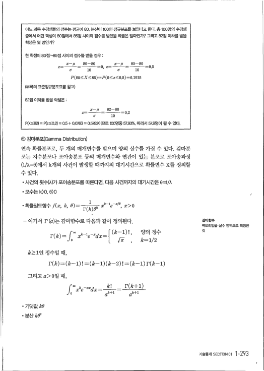
어느 과목 수강생들의 점수는 평균이 80 , 분산이 100인 장규분포를 보인다고 한다. 총 100명의 수강생 중에서 어떤 학생이 80점에서 85점 사이의 점수를 받았을 확률은 얼마인가？ 그리고 82점 이하를 받을 학생은 몇 명인가？ 한 학생이 80점히85점 사이의 점수를 받을 경우 :

z= x- p 80- 80 .

x- p 85- 80 ' - = = 0. Z= =

- - 
=0.5 《7 10 (7 1끄 P(80三X二85)=P(0二z二0.5)=0.1915 （부록의 표준정규분포표를 참고） 82점 이하를 받을 학샘은 :

82- 80 = =。.2 C 10 P(x드82) = P(z드0.2) = 0.5 + 0.0793 = 0.5793이므로 100명중 5723% . 따라서 57.9명이 될 수 있다． ⑤ 감마분포（Gamma Distribution)

#### 연속 확률분포로 , 두 개의 매개변수를 받으며 양의 실수를 가질 수 있다 . 감마분
#### 포는 지수분포나 포아송분포 등의 매개변수와 연관이 있는 분포로 포아송과정 
(i/x=o）에서 k개의 사건이 발생할 때까지의 대기시간으로 확률변수 x를 정의할 수 있다．

- 사건의 횟수《ㅅ）가 포아송분포를 따른다면 , 다음 사건까지의 대기시간은 0=1/A
- 모수는 ()o, 0)o
#### --- . -. . 
- . 
" .

1 '. 1 一／＝】 '확듈밀도함수／(x, k, 비＝ P（充）갇 z " 召 " " x>0

- 여기서 F (a）는 감마함수로 다음과 같이 정의된다．
#### r(k)= r ' 교．1.－驪T솨(k근）!, 
얗의정수 " Jo t /r , 辦＝1/2 k브i인 정수일 때，

#### F(k) - (k- i) ! = (k- 1)(k- 2)! = (k- i) F(k- 1)
# 그리고 α>0일 때， 
f," i , = xke_ axdx= k+1 k+1 ' U

- 기댓값hO
- 분산h02
> 갱가함수
> 팩토리얼을 실수 영역으로 확장한 
것

> 기술통계 SECTION 01 1 -293
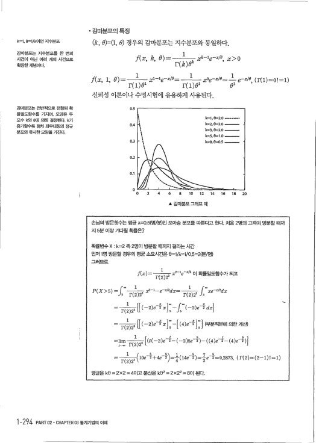
- 감마분포의 특징
k=1. 0=1/ㅅ이면 지수분포 (k, 9)=(i, &) 경우의 감마분포는 지수분포와동일하다． 감마분포는 지수분포를 한 번의 사건이 아닌 여러 개의 사건으로

#### 1 
, ..

f (x, k, 0) = ㄱ . .  . , 冷 x"-1e- '/8, x> 0 1 1_ F나히) OR 확장한 개념이다．

#### 1 
.

.

1 . .

. ^ 1 ' , ^ 1 .

f (x, 1, &)= . . . . 그i－오召－=／〃＝ . . . .xUe-X/hl= _a- xIt/ , (r(1)=O!=1) P(1夕〃' r (1)01 ' " 01 " ' 신뢰성 이론이나 수명시험에 유－용하게 사용된다． 갱가분모는 전반적으로 편향된 확 률밀도함수를 가지며 . 모양은 두 모수 k와 8에 의해 결정된다. k가 증가할수록 점차 좌우대칭의 정규 분포와 유사한모양을 가진다．

0. 5
k=1, 8=2.0 k 2,0 2.0 k 3,0 2.0 k 5,8 1.0 k 9,0 05

0. 4
0. 3
02

0. 1
0 0 ,2 4 6 8 10 12 14 ▲ 감마분포 그래프 예 손님의 방문횟수는 평균 ㅅ＝0.5（명／분）인 포아송 분포를 따른다고 힌다. 처음 2명의 고객이 방문할 때까 지 5분 이상 기다릴 확률은？ 확률변수 X : k=2 즉 2명이 방문할 때까지 걸리는 시간 먼저 1명 방문할 경우의 평균 소2시간은 e=1/A=1/o.5=2（분／명） 그러므로 . .

1 " .

〃.

x ' " 'e' " ' 이확률밀도함수가되고 /（驪）

```python
P(x>5)= ' :(;).2 x2-e '2dx=
P(X>5) j= 1
5 r(2)22 
r(2)22 J5 ' ∼v":
```
## 가 （1). I[
r(2)22 (-2)r쁑지“， -1 ' (-2)e쁑dx1 (_2)e xj 가（;):：珏(-2)r뜹시“，눼(4)r치芍（쀼적분에의한계산）

## 퀵夔 :(1
limr(2)22 f(t( -2)e뿡- (-2)5e4)- ((4) 4- (4)e4)}

### = r(2)22 (10e 2+4e 2)= (14e 2)=j-e 2=0.2873, (F(2):(2-1)!:1)
평균은 ke=2x2=4이고 분산은 〔e2= 2x22= 8이 된다． 1-294 PART 02. CHAPTER 03통계기법의이해

> 16 
18 20

> `7
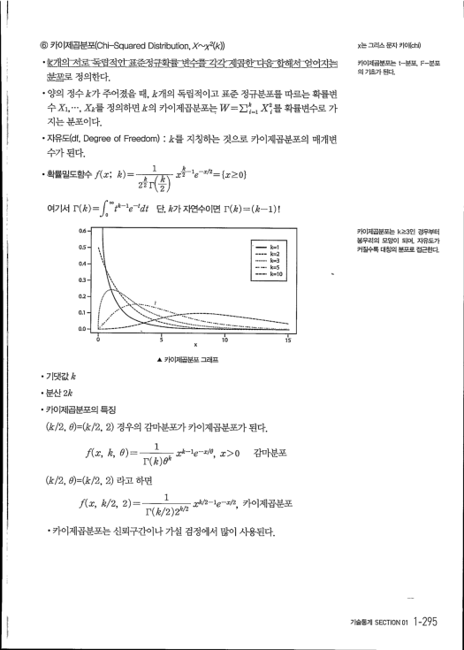
#### ⑥ 카이제곱분포（ChHSquared Distribution, Xx2(k))
#### · ft 괘의써로옥립척“인표준정分휙貧塋수'룝끽칵게곶ㅎk다令합해최－억"어지논 
湜뭏로 정의한다．

#### · 양의 정수k가 주어졌을 때 ,k개의 독립적이고 표준 정규분포를 따르는 확률변 
수X1,", Xk를 정의하먼k의 카이제곱분포는 w=> =1x를 확률변수로 가 지는분포이다．

#### · 자유도（df, Degree of Freedom) : k를 지칭하는 것으로 카이제곱분포의 매개변 
수가 된다． 므 . -- .

- . . 
. .

-' 1 走 , -/.

- 
.

## '왁듈빌노함수八 '" 怠〕＝ 2흥F（岑， " " '-' '=t ' 스oJ 
\ 6/

## 여기서r( k) =f, tk_le_td/ 단，k가자연수이면P
（冷） =（冷－ 1)!

∼

- - 
k=1 -- k=2 k=3 -·… k=5

- →．· k=10
-

0. 4-
0. 3-
一 " " ' " ．·b.

'- :=＝눋n:-.=-----－∼∼∼－ ∼∼－ 겯＝=．써｀二．∼ ' """ .

" ' ㅓ 끄 o o -- ∼ `, ∼·

- 
∼녹∼＝=:===＝∼∼；∼．-.:`．흐쑈7·… ∼ . . - . . ．一 ∼∼ 흴＝---－一一一 요

- 10 
15 스 x ▲ 카이저陪분포 그래프

- 기댓값 k
- 분산 2k
- 카이제곱분포의 특징
伋/2, e)=(k/2, 2) 경우의 감마분포가카이제곱분포가된다．

```python
/(:，冷，"）가（ I
f(x, k, O)= 
）갇 x 'e"', x>0 
7 "분포
```
伋/2, 9)=(k/2, 2) 라고하면

```python
f (x, k/2, 2)= 
. . 1 . , . , xk/2_1e-:/2 , 카이제곱분포 
F( k/2 ) 2k/2
```
- 카이제곱분포는 신뢰구간이나 가설 검정에서 많이 사용된다．
> x는 그리스 문자 카이（chi)
> 카이제곱분포는 t－분포 . F－분포 
의 7陸가 된다．

> 캐기저屠분포는 k之3인 경우부터 
봉우리의 모양이 되며 . 자유도가

> 커질수록 대칭의 분포로 접근한다．
> -
> ｀
。

> 기술통계 SECTION 01 1-295
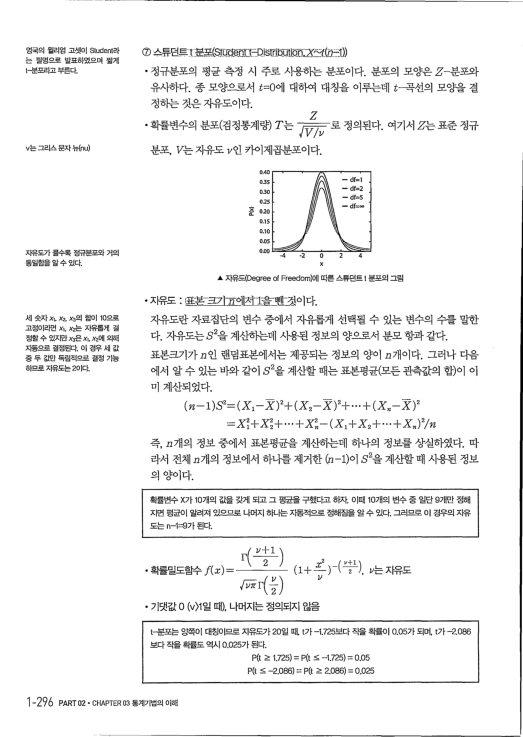
⑦ 스튜던트I분포($ fsaert크그i1iibUtib百ㅍ？＜즈크獅크）) 영국의 윌리엄 고셋이 Student라 는 필명으로 발표하였으며 짧게 t－분포라고부른다．

#### · 정규분포의 평균 측정 시 주로 사용하는 분포이다 . 분포의 모양은 z－분포와
#### 유사하다 . 종 모양으로서 t=o에 대하여 대칭을 이루는데 t－곡선의 모양을 결
## 정하는 것은 자유도이다． 
z '획률변수의 분포（검정통계량）T는 7V/t 로정의된다· 여기서z는표준정규

#### V는그리스문자뉴（nu) 
분포 , γ는자유도V인 카이제곱분포이다．

0. 40
-df=1 -

- df=2 
- df=S 
- df=o'
（〕 ．35

0. 30
025 츤 0.20

0. 1 5
0. 10
(）刀5

0. 00
차유도가 클수록 정규분포와 거의 x 동일함을 알수 있다． ▲ 차유도(Degree of Freedom）에 따른 스튜던트 t 분포의 그림

- 자유도 : 囹笠［크기ㅍ의凶그貧11밴＝것이다．
#### 자유도란 자료집단의 변수 중에서 자슭롭게 선택될 수 있는 변수의 수를 말한 
다 . 자유도는S2을 계산하는데 사용된 정보의 양으로서 분모 항과 같다． 세 숫자 X1, X2, X3의 합이 10으로 고정이라연 X1, X2는 자유롭게 결 정할 수 있지만x3은X1, X20∥ 의해 자동으로 결정된다. 이 경우 세 값 중 두 값만 독립적으로 결정 가능 하驢차유도는2이다． 표본크기가 끄인 랜덤표본에서는 제공되는 정보의 양이 끄개이다 . 그러나 다음 에서 알 수 있는 바와 같이 s2을 계산할 때는 표본평균（보든 관측값의 합）이 이

#### 미 계산되었다． 
(n-1)S2=(X1-X)2+(X2-X)2+ "+ (X ,-X) 2

#### =X釜+X囊+…+X2,-(X1+X2+··+X ,)2/n
#### 즉 , 끄개의 정보 중에서 표본평균을 계산하는데 하나의 정보를 상실하였다 . 따
라서 전쳬 n개의 정보에서 하나를 제거한 山-1）이 β2을 계산할 때 사용된 정보 의 양이다． 확률변수 x가 10개의 값을 갖게 되고 그 평균을 구했다고 하자. 이때 10개의 변수 중 일단 9개만 정해 지면 평균이 알려져 있으므로 나머지 하나는 자동적으로 정해짐을 알 수 있다 . 그러므로 이 경우의 자유 도는 n-1=9가 된다．

#### /  2나 1  , 
l " I

- 
- 
．확률밀도함수／(x) = \ z /  (1+브）（上묽） , 〃는ㅈIc' liT도 「－- / 1/ , 21 Jv7rFI ==- I ' \ z / · 기댓값 0 (v>1일 때） , 나머지는 정의되지 않음 t· 포는 양쪽이 대칭이므로 자유도가 20일 때 . t가－1.725보다 작을 확률이 0.05가 되며 , t가 -2.086 보다 작을 확률도 역시 0.025가 된다． P(t 上 1.725) = P(t 囊 -1.725) = 0.05 P(t 드 -2.086) = P(t 之 2.086) = 0.025 1-296 PART 02. CI-tAPTER03통계기법의이해

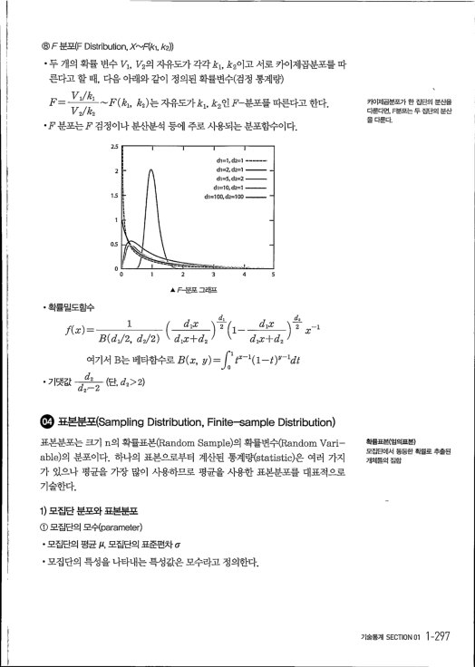
⑧F분포 (F Distribution, X' '-'F(ki, k2))

#### ·두 개의 확률 변수 V노 'V2의 자유도가각각치 , k2이고 서로 카이제곱분포를따
#### 른다고 할 때 , 다음 아래와 같이 정의된 확률변수（검정 통계량）
### - 
V1/k1

- . ' 
』 .

- - 
- 
- 
- 
F= γ‘，＞ㅍ ∼F(k1, 시）는 ' 除돠'k1, k2인7’분포를따른다고한다· 나고 분포는F 검정이나 분산분석 등에 주로 사용되는 분포함수이다． 25 , di=1, d2=1 dl=2,d2 1 2 r- d1=5, d2=2 小=10,d2 1 dl=100,d2 100 ` .

4 2 3 ▲ /=－분포 그래프

- 확률밀도함수
#### t／맣 
」 出 1(x)= 1 ( d1x ，차1  d1x ,-; x_1 B(d1/2, d2/2) \ d1x+d2 ' " d1x+d2 '

# 여기서B는베타함수로β(x, y)=介 X_l(1_t)Y_ldt
（단， 기댓값 2) .

표본분포(SampIing Distribution, Finite-sample Distribution)

#### 표본분포는 크기 II의 확률표본（Random Sample）의 확률변수（Random Vani-
#### able）의 분포이다 . 하나의 표본으로부터 계산된 통계량（statistic）은 여러 가지 
가 있으나 평균을 가장 많이 사용하므로 평균을 사용한 표본분포를 대표적으로 기술한다． 1) 모집단 분포와 표본분포 ① 모집단의 모수（parameter)

- 모집단의 펑균 /z , 모집단의 표준편차 α
- 모집단의 특성을 나타내는 특정값은 모수라고 정의한다．
> 카이저曆분포가 한 집단의 분산을 
다룬다면 , F분포는 두 집단의 분산 을 다룬다．

> 확률표본（임의표본）
> 모집단에서 동등한 확률로 추출된
> 개처隱의 집합
> 기술통계 SECTION 01 1 -297
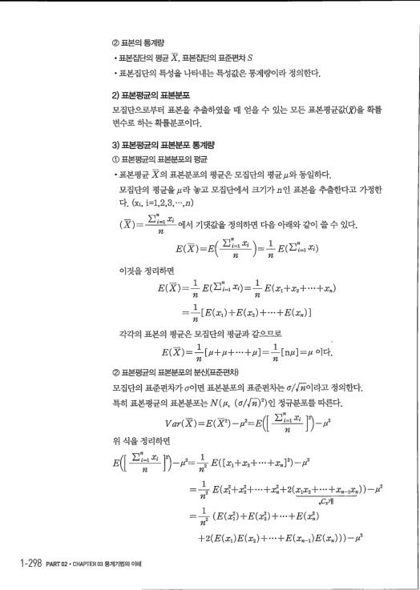
② 표본의 통계량

- 표본집단의 평균 兀 , 표본집단의 표준편차 S
- 표본집단의 특성을 나타내는 특정값은 통계량이라 정의한다．
2) 표본평균의 표본분포 모집단으로부터 표본을 추출하였을 때 얻을 수 있는 모든 표본평균값（x）을 확률 변수로 하는 확률분포이다． 3) 표본평균의 표본분포 통계량 ① 표본평균의 표본분포의 평균

- 표본평균 Z의 표본분포의 평균은 모집단의 평균〃와 동일하다．
#### 모집단의 평균을 〃라 놓고 모집단에서 크기가 끄인 표본을 추출한다고 가정한 
다 . (Xi, i=1,2,3,"·,n)

#### (X)= 刀琴=1싸 에서 기댓값을정의하면디음아래와같이 쓸수있다． 
1z

# , 
' + 1 凡 ￡ 이것을 정리하면

#### E(X)＝스E(E=, X')＝츠E(x1+x2+…+ x ,) 
n 7궁 =1{E(x ,)+E(x2)+"+E(x ,)J n 각각의 표본의 평균은 모집단의 평균과 같으므로

#### -- . - 
.

1 「 .

1 「 ， .

.

E(X)=--[p+ p+ ··+p]=--[n/ J=ii Oltf 1孝 ?z ② 표본펑균의 표본분포의 분산（표준편차） 모집단의 표준편차가α이면 표본분포의 표준펀차는 C'7ㅉ7이라고 정의한다．

# ([
특히 표본평균의 표본분포는N(j.t, (c,'石硼）인 정규분포를 따른다． Var

## 위 식을 정리하면 
패 刀n E(1 ='' 12_p2=측E([xl+x2+...+xflr)-p2 \L fl 」 / n

#### - 1 
7-:'f 2 .

2 .

. , .

ㅋT E4Xi十x+... +x+2(xix2+...+x-1x,,))_p2 n

#### _1- --i- (E(x)+E(x囊)+"+ E(x2,) 
n

#### +2(E(x1)E(x2)+"+ E(x ,_ 
,1)E(x,:)))-ii2 1-298 PART 02. CHAPTER 03통계기법의이해

#### 軫
, z E

> z
> ,1 X
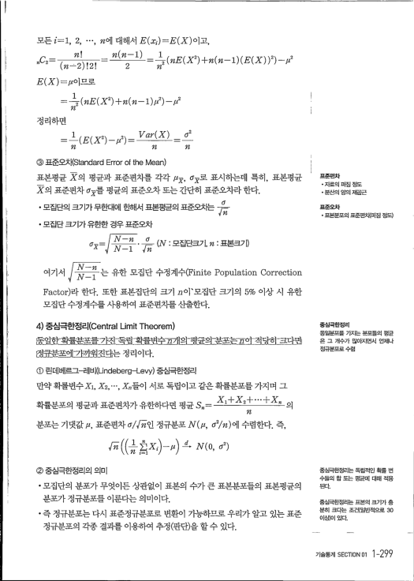
#### 모든i=1, 2, … , n에 대해서 E (xi)==E(/ ）이고，
### (E
, n!

)2) fl !2!

- -

#### E (x) =11이므로
### =측， (nE(X2)+n(n_ 1)j2)-i2
#### 정리하면 
=i (E(X2)_β2)= Var(X) -f즈 n n n ③ 표준오차（Standard Error of the Mean) 표본평균 Z의 평균과 표준편차를 각각 /zf , 戚死로 표시하는데 특히， 표본평균 Z의 표준편차 α无를 평균의 표준오차 또는 간단히 표준오차라한다．

# '모집단의크기가무한대에힌嘴ㅐ
서표본평균의표준오- LL I'IL湍

- 모집단 크기가 유한한 경우 표준오차
## I ar- n  
'r I ,r - －ㅜ , 「 , －→ ,

- '-
－→，, " 无＝7 N-r 綸 u", 「모집， 단크기， ,n「． 표본크71)

#### . . . I N- n . 
^ - .

- . . , - . . . , , .-. . 
－∼ .

.

∼ ． 여．기．'서. ㅣ 깃'7 '. " 는 휴한 모집．단 수정．계．"수(1 in "ife Prr,ii1c,Hn-n flrirrcrHnn

- - I 4 JV 1 ㄴ " '-- －ㅁㄴ I U II I " " " " 一 ㅗ '-' -'一 ' 一 " ' '-' " '- '-'
#### Factor）라 한다 . 또한 표본집단의 크기 n이 ' 모집단 크기의 5% 이상 시 유한
모집단 수정계수를 사용하여 표준편차를 산출한다． 4) 중심극한정리（Central Limit Theorem)

#### 돗얼챤확률導＝포뢍가히‘ 
릭뺙를벼수万3개의－펏규의옇俓층드｀fl끼’척닥히ㅋㅘ먼 정炅섶포예긔꽈윔코댜는 정리이다． ① 린데베르그－레비（니ndeberg-Levy) 중심극한정리

#### 만약확률변수치 ,X2,", Xn들이 서로 독립이고 같은확률분포를 가지며 그
#### 획률분포의평균과표준편차가유한하다면평균S , =  x1+x什 "  ' ＋지  의
#### 분포는기댓값／z , 표준편차α／石7인 蔘予분포N(p, 02/n）에 수렴한다 . 즉，
# 涵（（증粲‘)-/) 띄 N( 0, 떼
② 중심극한정리의 의미

- 모집단의 분포가 무엇이든 상관없이 표본의 수가 큰 표본분포들의 표본평균의
분포가 정규분포를 이룬다는 의미이다．

- 즉 정규분포는 다시 표준정규분포로 변환이 가능하므로 우라가 알고 있는 표준
정규분포의 각종 결과를 이용하여 추정（판단）을 할 수 있다．

> 표준편차 
- 차료의 퍼짐 정도 
- 분산의 양의 제곱근
> 표준오차 
- 표본분포의 표준편채퍼짐 정도）
> 중심극한정리
> 동일분포를 가지는 분포들의 평균 
은 그 개수가 많아지면서 언제나 장규분포로 수렴

> 중심극한정리는 독립적인 확률 변 
수들의 합 또는 평돈氷게 대해 적용

> 된다．
> 중심극한정리는 표본의 크기가 충 
분히 크다는 조건（일반적으로 30

> 이상）이 있다．
> 기술통계 SECTION 01 1 -299
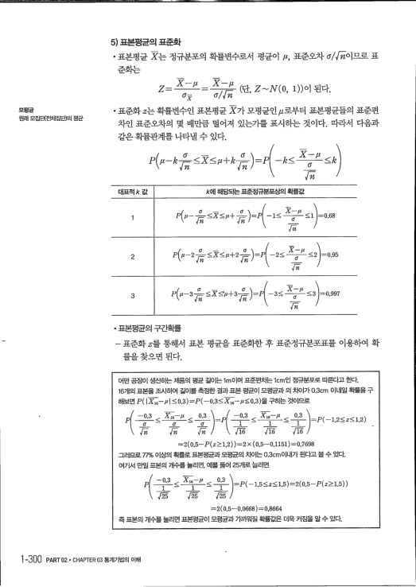
5) 표본평균의 표준화

- 표본평균 x는 出子분포의 확률변수로서 평균이 /z , 표준오차 0j7n이므로 표
준화는

#### 一 
Y- ,, Y- F, ^- , ,' , , /^ . , \ ^ 1 .-T.-.1 z= ' ㅗ r→ = ' ㅗ . == (vi-. Z- N (O. 1)）이 된다． （八7 (7／괘／ n vx 一／ Y ∼

- 표준화 z는 확률변수인 표본평균 Z가 모평균인〃로부터 표본평균들의 표준펀
모평균 원래 모집단（전체집단）의 평균 차인 표준오차의 몇 배만큼 떨어져 있는가를 표시하는 것이다 . 따라서 다음과 같은 확률관계를 나타낼 수 있다．

## 一／ 
, C ,;., , . , C \ 一／ , -  无－β , ,\ ／랙 p - /i -- 츠ㅅ 츠／너－怠7== l= /7 -/g츠 ,' 츠R \ vn 간z / ` -：노 ' 7n / \ 대표적 k 값 ＊에 해당되는 표준장규분포상의 확률값

```python
1 
:( , ．츳-
P(p---=-X:p+--=-")=P/ -1, 无F/ , 1\ =。.68 
' 
" 
7놂 
/
```
## 2 
:n：흗，无， , ,：츳튿：신：:  쫙노 2=。.95

#### \ 
Ifl .Ini 7 J

### 3 
,n. 츳：无：'p+3츳脾：／一 无－ ,/ 3 =。.997 \ .Ifl Ifl' \ 7늪 /

- 표본평균의 구간확률
- 표준화 z를 통해서 표본 평균을 표준화한 후 표준蔘予분포표를 이용하여 확
률을 찾휴면 된다． 어떤 恭lb이 생산하는 제품의 평균 길이는 im이며 표칡뎬차는 1cm인 정규분포로 따른다고 힌다． 16개의 표본을 조사하여 길이를 측정한 결과 표본 평균이 모평균과 의 차이가 0.3cm 이내일 확률을 구

## 해보면 ／〕이Xㅍ－시 二 0.3)=P(- 0.3二Z;g-p三 0.3）을구ㅎ階 것이므로 
- /  -(.'O ' 丁，－〃 , (\.Q\ 一 /_n.Q ,  r,－〃 , 0.3 \ n . . ∼ 7 . .. 
P - r.'v 二  '  ㅗ' 닙 ' 드 ---'= P -=－섶 -- ,' ,, ' 二 -=.=-- =P(- 1.2三z二1.2) \ 7숯 " 구읊 갸숯／ ' 냐끓“ 7늪 '71Ii/ =2(0.5-P(z논 1.2)) =2 x (0.5- 0.1151) =0.7698 그러므로 77% 이상의 확률로 표본평균과 모평균의 차이는 0.3cm이내가 된다고 볼 수 있다． 여기서 만일 표본의 개수를 늘리면 . 예를 들어 25개로 늘리면

#### / _A。 
三F  - 三F _ ,, fl Q \ P ∼ 三  "  16, 욘 드프 -：른- =P(- 1.5三z三1.5)=2(0.5-P(z브1.5)) \ 725 725 1 7乭百 / =2(0.5- 0.0668) =0.8664 즉 표본의 개수를 늘리면 표본펑균이 모평균과 가까워질 확률값은 더욱 커짐을 알 수 있다． 1-300 PART02, CHAPTER03통계기법의이해

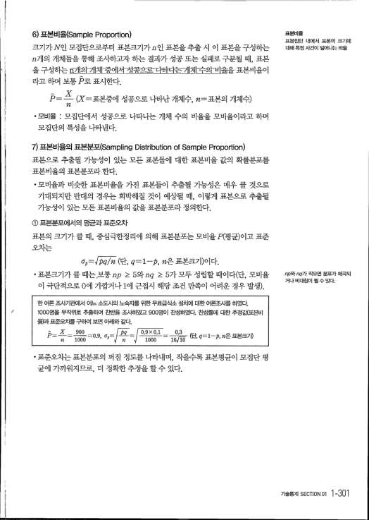
6) 표본비율《Sample Proportion) 크기가N인 모집단으로부터 표본크기가끄인 표본을 추출 시 이 표본을 구성하는 끄개의 개쳬들을 통해 조사하고자 하는 결과가 성공 또는 실패로 구분될 때 , 표본 을 구성하는 ㅍ11의211쳬줌에적E섯콩으툐竺다타다는211홰꽈-의ㅍ의읕l을 표본비율이 라고 하며 보통 f）로 표시한다．

#### ＝긔 
도v . -- - . . -- . . . . - . - , . . . . - . . , -..

. . . . .

P＝굻 (.x＝표몬중에. 성．공으로나타난 개．쳬．수， n＝표본의. 개．쳬．수夕．

- 모비율 : 모집단에서 성공으로 나타나는 개쳬 수의 비율을 모비율이라고 하며
모집단의 특정을 나타낸다． 7) 표본비율의 표본분포（Sam이ing Distribution of Sam이e Proportion) 표본으로 추출될 가능성이 있는 모든 표본들에 대한 표본비율 값의 확률분포를 표본비율의 표본분포라 한다．

- 모비율과 비슷한 표본비율을 가진 표본들이 추출될 가능성은 매우 클 것으로
기대되지만 반대의 경우는 희박해질 것이 예상될 때 , 이렇게 표본으로 추출될 가능성이 있는 모든 표본비율의 값을 표본분포라 정의한다． ① 표본분포에서의 펑균과 표준오차 표본의 크기가 클 때 , 중심극한정리에 의해 표본분포는 모비율P（평균）이고 표준 오차는

#### clp= Ipq/n （단 , q=1-p, n은표본크기）이다．
#### · 표본크기가클 때는 . 보통np 上 5와nq 上 5가모두 성립할 때이다（단 , 모비율
#### 이 극단적으로 0에 가깝거나 1에 근접시 해당 조건 만족이 어려운 경우 발생）.
한 여론 조사기관에서 어느 소도시의 노숙자를 위한 무료급식소 설치에 대한 여론조사를 하였다． 1000명을 무작위로 추출하여 찬반을 조사하였고 900명이 찬성하였다. 찬성튑게 대한 추정試표본비 율）과표준오차를구하여 보면 이래와 같다．

## '：즈，：끓눋0.9, 아：／뿟눼 " ·：;;：· ' : ：綜 （단·q=1-p, n은표본크기）
- 표준오차는 표본분포의 퍼짐 정도를 나타내며 , 작을수록 표본평균이 모집단 평
균에 가까워지므로 , 더 정확한추정을 할수 있다．

> 표뵌키율 
표본집단 내에서 표본의 크기에 대해 특정 사건이 일어나는 비율

> np와 nα가 작으면 분포가 왜곡되 
거나 비대칭이 될 수 있다．

> 기술통계 SECTION 01 1-301
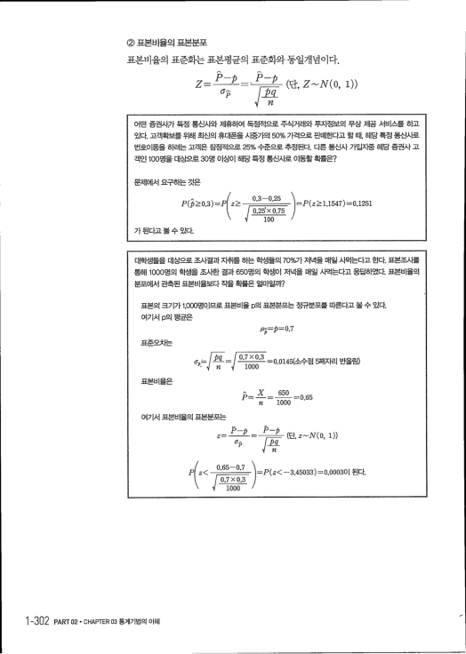
② 표본비율의 표본분포 표본비율의 표준화는 표본평균의 표준화와 동일개념이다．

#### ,7 
P- I) 』 P- I) 1 ,7 , , z= ' .p " ∼갸苑 （단， Z-N(O, 1)) /pq v n 어떤 증권사가 특정 통신사와 제휴하여 독점적으로 주식거래와 투자정보의 무상 제공 서비스를 하고 있다. 고객확보를 위해 최신의 휴대폰을 시중가의 50% 가격으로 판매한다고 할 때 . 해당 특정 됫 사로 번호이동을 히려는 고객은 잠정적으로 25% 수준으로 추정된다 . 다른 통신사 가입자중 해당 증권사 고 객인 100명을 대상으로 30명 이상이 해당 특정 툇사로 이동할 확률은？ 문제에서 요구하는 것은

#### P(j쑈。.3)= P7z  
0.3- 0.25  \ =P(z쑈 1.1547)= 。.1251 ` /  0.25X 0.75 / ` 싱 100 / 가 된다고 볼 수 오』［다． 대학생들을 대상으로 조사결과 자취를 하는 학생들의 70％가 저녁을 매일 사먹는다고 힌다. 표본조사를 통해 1000명의 학생을 조사한 결과 650명의 학생이 저녁을 매일 사먹는다고 응답하였다. 표본비율의 분포에서 관측된 표본비율보다 작을 확률은 얼마일까？ 표본의 크기가 1.000명이므로 표본비율 p의 표본분포는 정규분포를 따른다고 볼 수 있다． 여기서 p의 평균은 ／쑹＝夕＝0.7 표준오차는

## 표본비율은 
/ " 縕：· " 테.0145（소絡5ㅐ7EI반올림） 1000

#### 盛＝즈，극5扮=0.65
여기서 표본비율의 표본분포는 (ELz-N(O, z= = P /:< 0.65- 7 P

#### 1 
` / (z< 45。33) 7 X O 3 / , 창 1000 / 1-302 PARTU2. CHAPTER 03통계기법의이해

> )
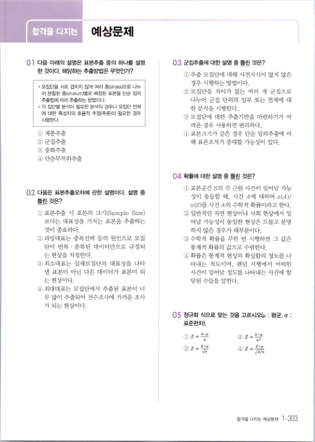
## 예상문제
03 군집추출에 대한 설명 중 틀린 것은？ 다음 아래의 설명은 표본추출 중의 하나를 설명 한 것이다 . 해당하는 추출방법은 무엇인가？ ①추출 모집단에 대해 사전지식이 많지 않은 경우 시행하는 방법이다． ②모집단을 차이가 없는 여러 개 군집으로

- 모집단을 서로 겹치지 않게 여러 층（strata）으로 나누 
어 분할된 층（stratum）별로 배정된 표본을 단순 임의 추출법에 따라 추출하는 방법이다．

- 각 집단별 분석이 필요한 분석의 경우나 모집단 전체
나누어 군집 단위의 일부 또는 전쳬에 대 한 분적을 시행한다． ③모집단에 대한 추출기반을 마련하기가 어 려운 경우 사용하면 편리하다． ④ 표본크기가 같은 경우 단순 임의추출에 비 해 표본오차가 증대할 가능성이 있다． 0ㅔ 대한 특성치의 효율적 추정（추론）이 필요한 경우 시행한다． ① 계통추출 ② 군집추출 ③ 층화추출 ④ 단순무작위추출 04 확률에 대한 설명 중 틀린 것은？ ① 표본공간 S의 각 근원 사건이 일어날 가능 성이 동등할 때 , 사건 A에 대하여 n (A)!

n(S）를 사건 A의 수학적 확률이라고 한다． ② 일반적인 자연 현상이나 사회 현상에서 일 어날 가능성이 동일한 현상은 드물고 분명 02 다음은 표본추출오차에 관한 설명이다 . 설명 중 틀린 것은？ ①표본추출 시 표본의 크기（Sample Size) 보다는 대표성을 가지는 표본을 추출하는 것이 중요하다． ②과잉대표는 중복선택 등의 원인으로 모집 하지 않은 경우가 대부분이다． ③수학적 확률을 무한 번 시행하면 그 값은 통계적 확률의 값으로 수렴한다． ④ 확률은 통계적 현상의 확실함의 정도를 나 타내는 척도이며 , 랜덤 시행에서 어떠한 사건이 일어날 정도를 나타내는 사건에 할 단이 반복 · 중복된 데이터만으로 규정되 는 현상을 지칭한다． ③최소대표는 실제모집단의 대표성을 나타 낼 표본이 아닌 다른 데이터가 표본이 되 는 현상이다． ④ 최대대표는 모집단에서 추출된 표본이 너 무 많이 추출되어 전수조사에 가까운 조사 가 되는 현상이다．

#### 05 정규화 식으로 맞는 것을 고르시오（I.1 : 평균 , a.
표준편차）.

①z＝즈＝ ，쓰 ②z= X-.t

> p
> 합격을다지는예상문제 ㄴ303
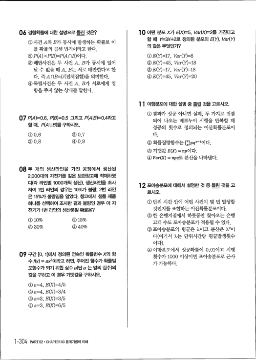
10 어떤 분포 x가 E(X)=5, Var(X)=2를 가진다고 할 때 γ＝3K+2로 정의된 분포의 E(y) , 晧＇ 《吟 06 결합확률에 대한 설명으로 틀린 것은？

#### ① 사건 A와β가 동시에 발생하는 확률로 이 
를 확률의 곱셈 법칙이라고 한다． ② p4) xp(B)=p4 flB）이다． ③ 배반사건은 두 사건 A, B가 동시에 일어 날 수 없을 때 A , B는 서로 배반한다고 한 다 . 즉AflB=U（전쳬집합）을의미한다． ④독립사건은 두 사건 A, B가 서로에게 영 향을 주지 않는 상태를 말한다． 의 값은 무엇인가？ @ E(Y)=17, Var(Y)=8 ② E(Y)=45, Var(Y)=18 ③ E(Y)=17, Var(Y)=18 @E(Y)=45, Var(Y)=20 11 이항분포에 대한 설명 중 틀린 것을 고르시오． ① 결과가 성공 아니면 실패 , 두 가지로 귀결 되어 나오는 베르누이 시행을 반복할 때 성공의 횟수로 정의되는 이산확률분포이 07 P(A)=0.6, P(B)=0.5 그리고 P(A!B)=0.4라고 할때 , P(A UB）를구하시오． @0.6 ② 0.7 ③ 0.8 @0.9 다． ② 확률질량함수는 (=)7짜x-i이다． ③ 기댓값 E(X) = 7z〃이다． ④ Var(X) = npq로 분산을 나타낸다． 08 두 개의 생산라인을 가진 공장에서 생산된 2,000대의 자전거를 같은 보관창고에 적재하였 다（각 라인별 1000개씩 생산） , 생산라인을 조사 12 포아송분포에 대해서 설명한 것 중 틀린 것을 고 하여 1번 라인의 경우는 10％가 불량 , 2번 라인 은 15％가 불량임을 알았다 . 창고에서 AC搢 제품

#### 르시오 , 
-- ① 단위 시간 안에 어떤 사건이 몇 번 발생할 것인지를 표현하는 이산확률분포이다． ②한 은행지점에서 하룻동안 찾아오는 은행 고객 수도 포아송분포가 적용될 수 있다． ③포아송분포의 평균은 凡이고 분산은 入2이 다（여기서 ㅈ는 단위시간당 평균발생횟수 하나를 선택하여 조사한 결과 불량인 경우 이 자 전거가 1번 라인의 생산품일확률은？ （亘：)30% ②15% @40% @10% 이다）.

④ 이항분포에서 성공확률이 0.01이고 시행 횟수가 1000 이상이면 포아송분포로 근사 가 가능하다． 09 구간 [0, 1〕에서 정의된 연속인 확률변수x의 함

#### 수／() =ax이라고 하면 , 주어진 함수가 확률밀
도함수가 되기 위한 상수a（단a 는 양의 실수）의 값을 구하고 이 경우 기댓값을 구하시오．

#### @ a=4, E(K)=4/5 
② a=4, E(K)=3/4 ③ a=3, E(K)=3/5 @ a=3, E(K)=6/5 1 -304 PART 02 ' CHAPTER 03통계기법의이해

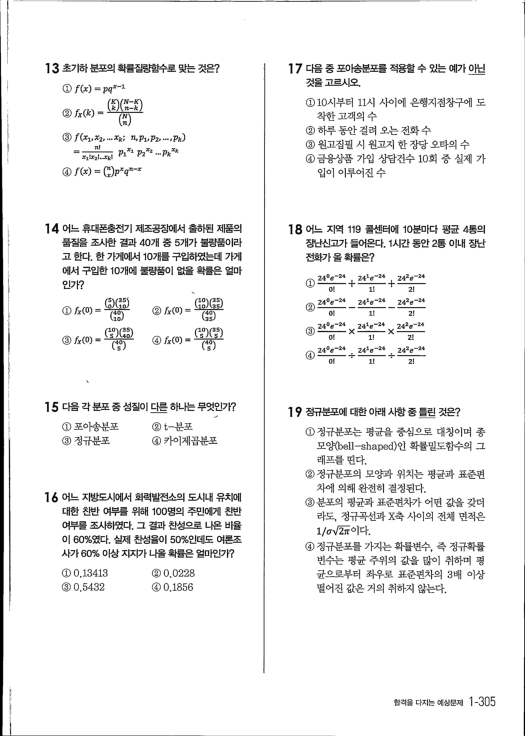
13 초기하분포의 확률질량함수로 맞는 것은？ 17 다음 중 포아송분포를 적용할 수 있는 예가 아닌 것을 고르시오．

```python
① f （ㅈ） = pqX_l 
0 fx(k):（ㅇ
"衍幻
```
①10시부터 11시 사이에 은행지점창구에 도 착한 고객의 수 ② 하루 동안 걸려 오는 전화 수 ③ 원고집필 시 원고지 한 장당 오타의 수 ④금융상품 가입 상담건수 10회 중 실제 가 입이 이루어진 수

## @:) f (xl,x2,...xk; n,pl,p2,...,p*) 
뺍 ,, ㅋ，낡, 꾸르'p2Xz··· pXk ④ /(x) 볍 (=)pxq7_x 14 어느 휴대폰충전기 제조공징에서 출하된 제품의 18 어느 지역 119 콜센터에 10분마다 평균 4통의 품잘을 조사한 결과 40개 중 5개가 불량품이라 고 한다 . 한 가게에서 10개를 구입하였는데 가게 에서 구입한 10개에 불량품이 없을 확률은 얼마 장난신고가 들어온다 , 1시간 동안 2통 에ㅖ 징난 전화가 올 확률은？ 24 "e 인가？ ①》（.

。!

2!

135c ②》（.

'10' 135 '5 3s

#### 14。
( ) !35) _ ______ 4。

(35 ④八 （.

③八 （.

"e' '10' '35 !sA4o) fx

#### 4。 
@fx 。!

1!

2!

#### (5)
"e 2 ÷ 24e= 。!

1!

2!

, 15 다음 각 분포 중 성질이 다른 하나는 무엇인가？ 1 ' 정규분포에 대한 oIEㅐ 사항 중 틀린 것은？ ①포아송분포 ②t－분포 ③ 정규분포 ④카이제곱분포 ① 정규분포는 평균을 중심으로 대칭이며 종 모양（bell-shaped）인 확률밀도함수의 그 래프를 띤다． ② 蔘予분포의 모양과 위치는 평균과 표준편 차에 의해 완전히 결정된다． ③ 분포의 평균과 표준편차가 어떤 값을 갖더 라도 , 정규곡선과 x축 사이의 전쳬 면적은 1/0Wv乭큐이다． 1 6 어느 지방도시에서 화력발전소의 도시내 유치에 대한 츤뽀j 여부를 위해 100명의 주민에게 친반 여부를 조사하였다 . 그 결과 찬성으로 나온 비율 이 60％였다 . 실제 찬성율이 50％인데도 여론조 사가 60% 이상 지지가 나올 확률은 얼마인가？ ④ 정규분포를 가지는 확률변수 , 즉 정규확률 변수는 평균 주위의 값을 많이 취하며 평 균으로부터 좌우로 표준편차의 3배 이상 떨어진 값은 거의 취하지 않는다． @ 0.13413 ② 0.0228 ③0.5432 c

0. 1856
> 242e 24
> 241e
> 242:,"24
> 241e
> 241e,
> 242e
> 242e 24
> 합격을다지는예상문제 1-305
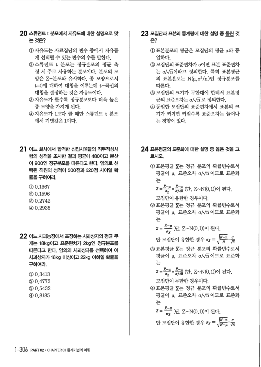
20 스튜던트 t 분포에서 자유도에 대한 설명으로 맞 는 것은？ 23 모집단과 표본의 통계량에 대한 설명 중 틀린 것 은？ ① 자유도는 자료집단의 변수 중에서 자유롭 게 선택될 수 있는 변수의 수를 말한다． ②스튜던트 t 분포는 정규분포의 평균 측 정 시 주로 사용하는 분포이다 . 분포의 모 양은 z－분포와 유사하다 . 종 모양으로서 t=0에 대하여 대칭을 이루는데 t－곡선의 대칭을 결정하는 것은 자유도이다． ③ 자유도가 클수록 정규분포보다 더욱 높은 종 모양을 가지게 된다． ④ 자유도가 1보다 클 때만 스튜던트 t 분포 ①표본분포의 평균은 모집단의 평균 ㅒ와 동 일하다． ② 모집단의 표준편차가 （】이면 표본 표준펀차 는 0/,／ㅍ이라고 정의한다 . 특히 표본평균 의 표본분포는 N鱗 , o2/n）인 정규분포를 따른다． ③모집단의 크기가 무한대에 한해서 표본평 균의 표준오차는 (J/v/fI로 정의한다． ④동일한 모집단의 표준편차에서 표본의 크 기가 커지면 커질수록 표준오차는 늘어나 는 경향이 있다． 에서 기댓값은 1이다． 21 어느 회사에서 합격한 신입사원들의 직무적성시 24 표본평균의 표준화에 대한 설명 중 옳은 것을 고 르시오． 험의 성적을 조사한 결과 평균이 480이고 분산 이 900인 장규분포를 따른다고 한다 . 임의로 선 ①표본평균 x는 정규 분포의 확률변수로서 택된 직원의 성적이 500점과 520점 사이일 확 평균이 ㅒ , 표준오차 oA/i이므로 표준화 률을구하여라． ①）0.1367 ②0.1596 ③0.2742 ④0.2935 7 = 쯔＝쯔 = 식잴 (다 r _ ,1\T(fl iY이 되다

- 
'' x α／v7r `" Li 모집단이 유한한 경우이다． ②표본평균 x는 茅子 분포의 확률변수로서 평균이 " , 표준오차 0/v／王I이므로 표준화 는

## z= 븜（단， Z∼N(0,1)) ' 隧다·
22 어느 사과농장에서 포장하는 사과상자의 평균 무

#### 단모집단이유한한경우cig =7N-n·公 
③표본평균 x는 蔘구 분포의 확률변수로서 평균이 " , 표준오차 0／차／IY이므로 표준화 게는 1하(g이고 표준편차가 2kg인 정규분포를 따른다고 한다 . 임의의 사과상자를 선택하여 이 사과상자가 16kg 이상이고 22kg 이하일 확률을 는 구하여라．

### z=븜＝븝 （단， Z--N(0, 1)）이 된다．
@ 0.3413 ②0.4772 ③0.5432 @ 0.8185 모집단이 무한한 경우이다． ④표본평균 又는 정규 분포의 확률변수로서 평균이 p , 표준오차 ./驪이므로 표준화 는

### z= 븜（단， Z' 'N(0, 1)）이 된다． 
단모집단이유한한경우吐= 1-306 PART 02* CHAPTER 03통계기법의이해

> -Nn
- i
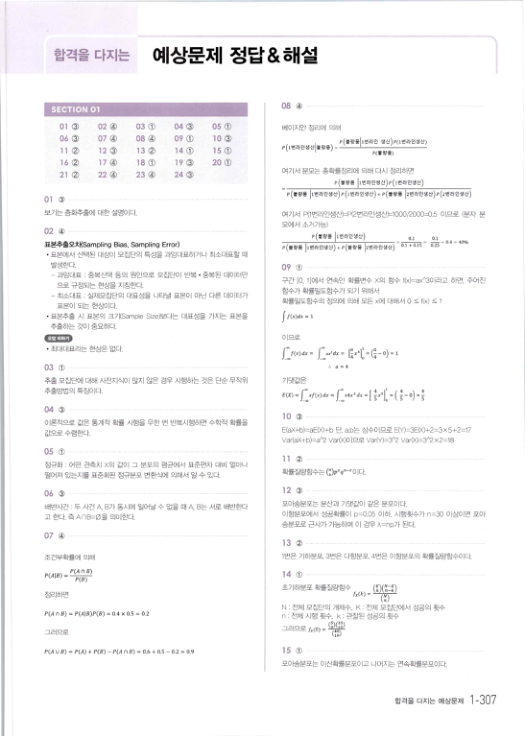
## 합격을다지는 
예상문제 정답＆해설 08 注7 SECTION 01 01 ③ 02 ④ 03D 04 ③ 05D 베이지안 정리에 의해 06 ③ 07 ④ 08 ④ 09D 10 ③ .r . 뻐 , , , , :, . . I닐 , , ㅍ， '（불량히1번라인 섕산）P(1번라인생산） r 나 ＝』‘“』 ．듸 · ‘石7 P（불빵품） 11 ② 12 ③ 13 ② 14 (D 15 ＜〕 ：) 16 ② 17 ④ 18cD 19 ③ 20 ＜〕 ：) 여기서 분모는 총확률정리에 의해 다시 정리하면 21 ② 22 ④ 23 ④ 24 c) P（붙링키1번라인섕산）P(1번라인섕산） ,（불량비1번라인생산）p (i번라인섕산）+P（불량비2번라인섕산）' (z번라인섕산） 01 ③ 보기는 층화추출에 대한 설명이다 여기서 P(1번라인생산）千《2번라인생산＞=1000尸000=0.5 이므로 （분자 분 모에서 소거가능） 02 ④ ,（불량퓸 “번라인섕산겸 .

- - 
0. 4 40% 
P（불량픔 卜번라인섕산）+P（불량퓽 12번라인생산〕 " ' " ' "' " 표본추츨오치《Sam翩ng Bias, Sampling Error)

- 표본에서 선택된 대상이 모집단의 특성을 과잉대표하거나 최소대표할 때
발생한다．

- 과잉대표 ; 중복선택 둥의 원인으로 모집딘이 반복 · 중복된 데이터만 
으로 규정되는 현상을 지칭한다， 최소대표 : 실제모집단의 대표성을 ㄴ灣낼 표본이 아닌 다른 데이터가 090 …… 구간 [0. 1］에서 연속인 확률변수 ×의 함수 t(x)=ax/3이라고 하면． 주어진 함수가 확률밀도함수가 되기 위해서 확률밀도함수의 정의에 의해 모든 x에 대해서 0 ` t(x) ` 1 표본이 되는 현상이다．

- 표본추출 시 표본의 크기（Sample Size）보다는 대표성을 가지는 표본을
(x)dx: 1 추출하는 것이 중요하다， 이므로

- 최대대표라는 현상은 없다．
J_:f(X）介= f", dx= 隱디’，:（옭.)=1 03 (I) …… ……………………－…………………………………………… 추출 모집딘뻬 대해 사전지식이 많지 않은 경우 시행하는 것은 단순 무작위 기댓값은 E(X) =I긱／(:）傲 =工긱4긋터甕식낄（층－.)＝층 추출방법의 특징이다』 04 （功 …… … …… … ……… … ……… 10 （功 ( 이론적으로 값은 통계적 확률 시행을 무한 번 반복시행하면 수학적 확률율 E(aX+b)=aE(X什b 단． ab는 상수이므로 ㅌ(Y)=3E(X)+2=3x5+2=17 값으로 수렴한다． Var(aX-l-b)=a'2 VarX)0I므로 Var(Y)=32 Var(K)=3/2x2=18 05 <j:) … … 11 ② …………………………… 정규화 : 어떤 관측치 ×의 값이 그 분포의 평균낙게서 표쥐젼차 대비 얼마나 확률질량함수는 (=）군〃∼이다． 떨어져 있는자를 표준화된 장규분포 변환식에 의해서 알 수 있다． 12 ③ ……→… … … ………… ……… 06 ③ …… ……… …… 포o檣분포는 분산과 기댓값이 같은 분포이디길 배반사건 : 두 사건 A B가 동시에 일어날 수 없을 때 AB는 사로 배반한다 고 한다． 즉 AflB=必을 의미한다． 이항분포에서 성공확률이 p=0.05 이하. 시행횟수가 n=30 이상이면 포아 송분포로 근사가 가능하며 이 경우 ㅅ=np가 된다． 07 ④ 13 ② …………… … … …… 1번은 기하분포， 3번은 다항분포， 4번은 이항분포의 확률질량함수이다． 조건부확률께 의해 의계 n B) 以시〃J .

P(B)' 14 cD 초기하분포 확률질량함수 , . , , (KVN-I(I ik.Jk, 정리하면 N : 전체 모집단의 개체수. K : 전체 모집단에서 성공의 횟수 n : 전체 시행 횟수． k : 관찰된 성공의 횟수 P(AnB) 볍P(시B)P(畔 · 0.4 X 0.5 = 0.2 그러므로〃（0 (X35) 그러므로 15 D …… ………… …… P(A U B) = P(A) + P(B) - P(A n B) = 0.6 + 0.5 - 0.2 = 0.9 포아송분포는 이산확률분포이고 나머지는 연속확률분포이다．

> " 
' " '

> 합격을다지는예상문제 1-307
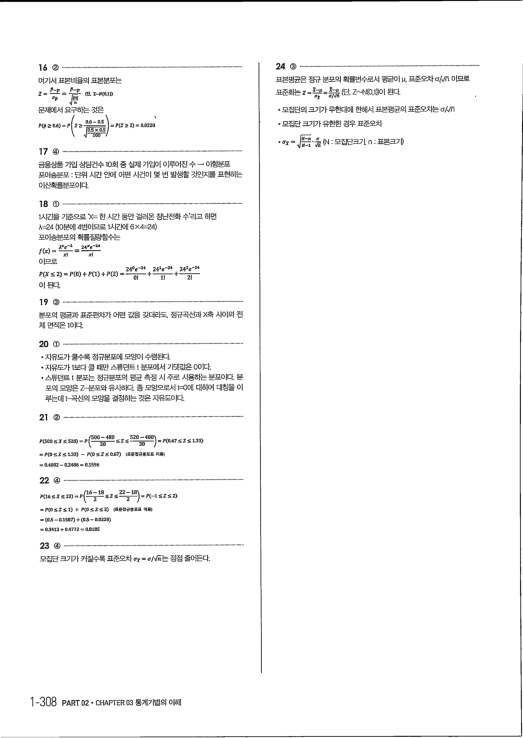
24 ③ ................................................................................................................................

16 ② .，···」··…·∼··∼·，．···．.,. ·．.

----" 표본평균은 장규 분포의 확률변수로서 평균이 p . 표준오차아7百 이므로 여기서 표본비율의 표본분포는

```python
Z：능 = :11=
1- (ii. 
문제에서 요구하는 것은
```
표준호F z즉손뷰（단· Z 'N(0,1)）이된다·

- 모집단의 크기가무한대에 한해서 표본평균의 표준오ㅊ隱
0. 
- 모집단크기가 유한한 경우 표준오차
P(j! 0·6) ,(722) 0228

#### 에갓：孺·令(N：모집단크기n：표본크기）
17 ④ ∼·…－一……－－一．··∼0－→·－0∼－-－……………－……－－……··…··．…· " " '" 금융상품 가입 상담건수10회 중 실제 가입이 이루어진 수 → 이항분포 포아韆포 : 단위 시간 안에 어떤 사건이 몇 번 발생할 것인지를 표헌하는 이산확률분포이다． 18 ① …－-－·∼··－4--－·－－··－·∼··－··0··04·－·－………－－…∼·－···．．······…·－『 1시간을 기준으로 》＜= 한 시간동안 걸려온 장난전화수’라고 하면 A=24 (10뷘게 4번이므로 1시간에 6x4=24) 포아송분포의 확률질량함수는 /(:)＝즈芩스＝쯔녹，＝쓰 이므로 24%'24 24노－z추 2428_24 P(X饉2) =P(0)+I'(l) +P(Z) -j- -+-- -+-j '- 이 된다． 19 ③ ....................---，…·，…·…∼…－一－·－4··∼…………∼→一∼"-"·－一" 분포의 평균과 표준편차가 어떤 값을 갖더라도， 장규곡선과 ×축 사이의 전 쳬 면적은 1이다． 20 (j:> ............................∼"-－·……．-一∼∼…．∼一－一·"-"- " ' -'-""""'" ""'"'

- 자유도가클수록 정규분포에 모양이 수렴된다． 
- 자유도가 1보다클 때만 스튜던트 t 분포에서 기댓값은 0이다． 
- 스튜던트 t 분포는 장규분포의 평균 측정 시 주로 사용하는 분포이다. 분
포의 모양은 z분포와 유사하다. 종 모양으로서 I력〕 （게 대하여 대칭을 이 루는데 ［꼭선의 모양을 결정하는 것은 차유도이다．

### ,(5에‘!'52.):8'500- 480一 S20 緇）:P(0.67Z 1.33)
== 耽4＇】B2 - .2485 = 0.1596 22 ④ ,(16軾522〕：「（16-18 P(16X 22) 쯔구트） ,( I Z 2) 23 饉） ............…·‘，-……＂·…··．·…·－∼－··∼∼………"··∼…··"一 " " …"－…"－· 모집단 크기가 커질수록표준오차 α＇ = α／7i7는 점점 줄어든다． 1 -308 PART 02· CHAPTER 03통겨I기법의이해

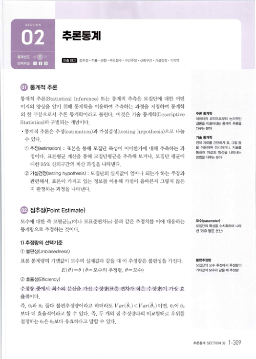
SECTION

# 추론통계
출제빈도 （董）; 빈츨 태그 넘추정 · 적률 · 편향 · 우도함수 · 구간추정 · 신뢰구간 · 가설검정 · 기각역 반복학습 II . n

#### .) 통계적 추론
통계적 추론（Statistical Inference) 또는 통계적 추측은 모집단에 대한 어떤 미지의 양상을 알기 위해 통계학을 이용하여 추측하는 과정을 지칭하며 통계학

#### 의 한 부분으로서 추론 통계학이라고 불린다 . 이것은 기술 통계학＜Descriptive
Statistics）과 구별되는 개념이다．

- 통계적 추론은 추정（estimation）과 가설검정（testing hypothesis）으로 나눌
수 있다．

#### ① 추정（estimation) : 표본을 통해 모집단 특성이 어떠한가에 대해 추측하는 과
#### 정이다 . 표본평균 계산을 통해 모집단평균을 추측해 보거나 , 모집단 평균에
#### 대한 95% 신뢰구간의 계산 과정을 나타낸다 .
#### ② 가설검정（testing hypothesis) : 모집단의 실제값이 얼마나 되는가 하는 주장과
관련해서 , 표본이 가지고 있는 정보를 이용해 가설이 올바른지 그렇지 않은 지 판정하는 과정을 나타낸다． .

점추정（Point Estimate) 모수에 대한 즉 모평균댜ㅗ）이나 모표준편차〈이 등과 같은 추정치를 이에 대응하는 통계량으로 추정하는 것이다． 1) 추정량의 선택기준 ① 불편성（Unbiasedness) 표본 통계량의 기댓값이 모수의 실제값과 같을 때 이 추정량은 불편성을 가진다． E（〃）＝〃 （〃＝모수의 추정량 , 〃＝모수） ② 효율성（Efficiency) 추정량 중에서 최소의 분산을 가진 추정량（표준 편차가 작은 추정량）이 가장 효 율적이다．

#### 즉 , 이과 02 둘다 불편추정량이라고 하더라도 γar(01)<Var(02）이면 . ei이 02
#### 보다 더 효율적이라고 할 수 있다 . 즉 , 두 개의 점 추정량과의 비교형태로 우위를
결정하는 oi은 02보다 유효하다고 말할 수 있다．

> 추론 통계학
> 데이터의 요약으로부터 논리적인
> 결론을 이끌어내는 통계적 추론을 
다루는 분야

> 기술 통계학
> 전체 자료를 간단하게 표， 그림 등 
을 이용하여 정리하거나 . 지표를

> 통하여 자료의 특성을 나타내는 
방법을 다루는 분야

> 오수《parameter)
> 모집단의 특상을 수치화하여 나타 
낸 것（.鱗 펑균 , 분산》

> 불편추정량
> 모집단의 모수 추정에서 추정량의 
기대값이 모수와 같을 때 추정량

> 추론통계 SECTION 02 1 -309
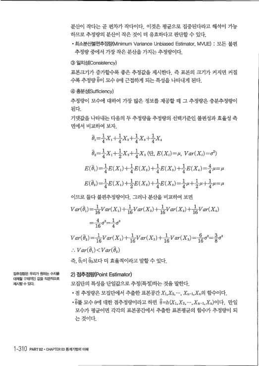
#### 분산이 작다는 곧 편차가 작다이다 . 이것은 평균으로 집중된다라고 해석이 가능
하므로 추정량의 분산이 작은 것이 더 유효하다고 판단할 수 있다．

#### · 최소분산불편추정량（Minimum Variance Unbiased Estimator, MVUE) : 모든 불펀
추정량 중에서 가장 작은 분산을 가지는 추정량이다． ③ 일치성（Consistency)

#### 표본크기가 증가할수록 좋은 추정값을 제시한다 . 즉 표본의 크기가 커지면 커질
수록 추정량言이 모수0에 근접하게 되는특정을 나타내게 된다． ④ 충분성（Sufficiency) 추정량이 모수에 대하여 가장 많은 정보를 제공할 때 그 추정량은 충분추정량이 된다． 기댓값을 나타내는 다음의 두 추정량을 추정량의 선택기준인 불펀성과 효율성 측 면에서 비교하여 보자． 7i 1c7 . 1 Tz · 1 ㅠ ' 1 T/ 〔71 =＝「－=z노 1 寸－=7」 r노 오 -t－ㅋ乙r` , 낙－＝젼Jr도 죠 싶 z소 섶 仕

#### 7, 
1 t7 , 1 '7- ` 1 ㅠ 1,-i r'/ T 7 \

- -r,- 
/ T7 \ _2\ U2=＝了- i1YA 31TA3 嘴f, ／놔A궁)=[L, Vαγ｀＾〃- cy)

## E(01)＝승E(Z:)＋옮E(Z:)＋응E(Z:)＋옮E(Z')＝응〃＝〃
## E（瞭.)＝옮E（兀：)＋읗E(x.)＋솖E(Z.)＝옮〃＋읗〃＋응〃＝〃
#### 이므로 둘다 불편추정량이다. 그러나 분산을 비교하여 보면
## Var(01)＝옳Var(兀：)＋솖Var(兀.)＋옳Var(X3) +옳γ』／（兀
‘)

## ＝옳一솖."
#### (〃
-Var

#### . ' .Var(01)<Var(02)
즉 , 芬1이 히보다 더 효율적이라고 말할수 있다． 2) 점추정랑（Point Estimator) 점추정량은 우리가 원하는 수치를 대체할 구체적인 값을 직관적으로 모집단의 특정을 단일값으로 추정（특정）하는 것을 말한다． 제시할수 있다．

#### · 점 추정량은 모집단에서 추출한 표본공간xI, Z2,", Zn-i, Zn의 함수이다．
#### 樽를모수e에 대한점추정량이라고하면 @＝力（兀1, x2,'",Xn-i,Xn）이다 . 만일
모수가 평균이면 각각의 표본공간에서 추출한 표본평균의 함수가 추정량이 되 는 것이다． 1 -310 PART02. CHAPTER 03통계기법의이해

> 2
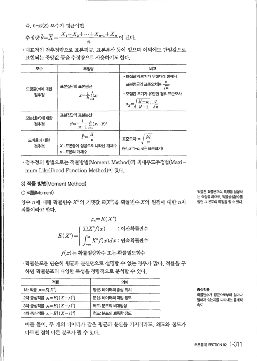
즉 , 0＝요（》｛) 모수가 평균이면

#### 추정량a＝无＝=  치＋Z什 "  ' ＋兀，71+ x 7: 이된다． 
1z

- 대표적인 점추정량으로 표본평균 , 표본분산 등이 있으며 이외에도 단일값으로
표현되는 중앙값 등을 추정량으로 사용하기도 한다． 모수 추정량 비고

- 모집단의 크기가무한대에 한해서
### 표본평균의표준以階읊 
· 모집단 크기가 유한한 경우 표준오차 "v- n α 輸＝v N-i 7n 표본집단의 표본펑균 모평균《p）에 대한 현텬 i J, iK- ==- z」 /' 沙1 점추정 표본집단의 표본분산 모분신［d2）에 대한

```python
, 
1 
i! , 
. . 
S ' = -:-- 
기 (x1-x) 
n- I i＝팝1
```
점추정 P=즈 12 ㅠㅈ∼＇- I pq 」：=＝ㅍ＝=7뇌 - I -- 모비율에 대한 쟝 fl x : 표본중에 성공으로 나타난 개체수 점추정 （단. 略i-p.n은 표본크기） ／구 : 표본의 개체수

- 점추정의 방법으로는 적률방법（Moment Method）과 최대우도추정법（Maxi-
mum Likelihood Function Method)이 9다.

3) 적률 방법（Moment Method) ① 적률（Moment)

#### 양수 끄에 대해 확률변수 z끄의 기댓값 E(K）을 확률변수 Z의 원점에 대힌그그차
적률이라고 한다．

#### /z,:=E（兀“)
刀X"f (x) : 이산확률변수

## 八 X"f(x)dx : 연속획률변수
/（α＝）는 확률질량함수 또는 확률밀도함수

#### · 확률분포를 단순히 평균과 분산만으로 설명할 수 없는 경우가 많다 . 적률을 구
하면 확률분포의 다양한 특정을 정량적으로 분석할 수 있다． 적률 의미 1차 적률 〃＝E〔兀넝 펑균： 데이터의 중심 위치 2차중심적률 p2=E[(X- p)2] 분산 데이터의 퍼짐 정도 3차줌심적률 p3=E[ (X- p)시 왜되 분포의 비대칭성 4차줌심적률 /i4=E{(X- p)4] 첨도： 분포의 뾰족함 짇朽크 예를 들어 , 두 개의 데이터가 같은 평균과 분산을 가지더라도 , 왜도와 첨도가 다르면 전혀 다른 분포가 될 수 있다．

> 적률은 확률분포의 특짇을 설명하 
는 역할을 하므로， 적률생성함수를 알면 그 분포의 특장을 알 수 있다．

> 중심적튤
> 확률변수가 평균으로부터 얼마나
> 떨어쳐 있는지를 나타내는 통계적 
측도

> 추론통계 SECTION 02 1 -311
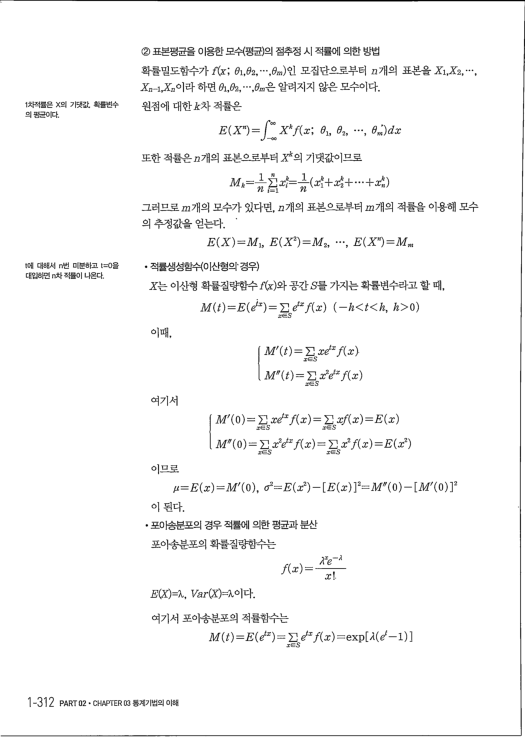
② 표본평균을 이용한 모수（평균）의 점추정 시 적률에 의한 방법

#### 확률밀도함수가 f（幻 〃1, 心 , … , 飾）인 모집단으로부터 끄개의 표본을 Z1, 幻 , …，
Zn-i, xn이라 하면 〃1, 肉 , … , 飾은 알려지지 않은 모수이다． 원점에 대한火차 적률은 1차적률은 ×의 기댓값. 확률변수 의 펑균이다．

## E(X ") =f xkf(x; 01, 02, ··· , O砥)dx
-。。

또한 적률은끄개의 표본으로부터 x＊의 기댓값이므로

## Mk=증飾=- -(x+x+…+x)
#### 그러므로끄그개의 모수가 있다면 , 끄개의 표본으로부터 m개의 적률을 이용해 모수
```python
의 추정값을 얻는다． " 
E(x)＝긔까 , E(x2)=긔써f2 , … , E(x " )＝긔，工，,:
```
- 적률생성함수《이산형의 ' 경우）
toil 대해서 n번 미분하고 t=o을 대입하면 n차 즈湜이 나온다．

#### x는 이산형 확률질량함수r嘴）와 공간S를 가지는 확률변수라고 할 때 ,
#### M (t)=E(etv)= 
etxf(x) (- h<t<h, h>O) xS 이때，

### xetxf(x)
#### x 
S , [M''(t) =擢훵 x'e "f ( xS 끼 여기서

### (x)
### xetxf(x)
- 
-

#### - 
- 
- I M"(O) =擢 x'e "f(x) =擢 x'f(x)=E(x ') xS xS 이므로

#### p=E (x) =M' (O), o2=E (x2) - [E(x) J2=M "(O) - [M' (O) ]2
이 된다．

- 포아섶븐포의 경우 적률에 의한 평균과 분산
포아송분포의 확률질량함수는

#### . . . 
ㅅ청－ㅅ Aㅈ그＝

#### ｀石 므． 
E(X)=A,, Var（즌)=2이다． 여기서 포아송분포의 적률함수는

#### M (t)=E(et ') = 기 etxf(x)=exp[A(et_1) J 
xES 1-312 PART02· CI-1APTER03통계기법의이해 1

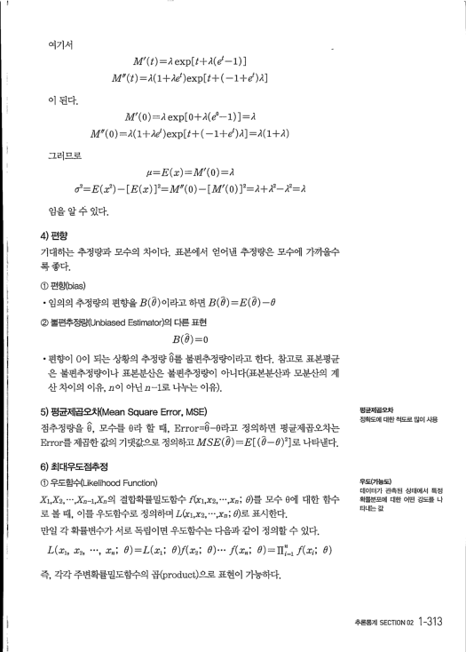
여기서

#### M '(t)=A exp[t+A(et-1)]
#### M "('t) =A( 1+2et)exp[t+ ( -i+ er)2]
이 된다．

#### M ' (O) =2 exp[O+A(e0-1) ] =2
#### M "(O) =2( 1+2et)exp[t+ ( -i+ d)2] =2(1+2)
그러므로

#### p:=E(x) =M' (O) =2
#### ci2=E(x2) - [E(x) ]2=M "(O) - [M' (O) ]2=2+22_22=2
임을 알 수 있다． 4）펀향 기대하는 추정량과 모수의 차이다 . 표본에서 얻어낸 추정량은 모수에 가까울수 록좋다． ① 편향（bias)

#### · 임의의 추정량의 편향을 β(0）이라고 하면 β(汐) =E(O) -e
② 불편추정량（Unbiased Estimator）의 다른 표현

#### B(O)=0
- 편향이 0이 되는 상황의 추정량 言를 불편추정량이라고 한다 . 참고로 표본평균 
은 불펀추정량이나 표본분산은 불펀추정량이 아니다（쵸본분산과 모분산의 계

#### 산 차이의 이유 , 끄이 아닌 n-i로 나누는 이유）.
5) 평균제곱오차(Mean Square Error, MS티

#### 점추정량을 @ , 모수를 0라 할 때 , Error＝芬-o라고 정의하면 평균제곱오차는
#### Error를제곱한값의 기댓값으로 정의하고긔YSE(b)=E[（汐－0)2］로 나타낸다．
6) 최대우도점추정 ① 우도함수《Likelihood Function)

#### Xi,X2, ··· ,Xn-i,Xi져 결합확률밀도함수 f (x1,x2, ···,xn, 9）를 모수 0에 대한 함수 
로볼때 , 이를우도함수로 정의하며L(x1,x2, ··-,x; O）로표시한다． 만일 각 확률변수가 서로 독립이면 우도함수는 다음과 같이 정의할 수 있다．

#### L (x1, x2, … , x,; 0)=L(x1; 0)f (x2; 0)... f (x.; 0)=n；휄1 f (x1; 0)
즉 , 각각 주변확률밀도함수의 곱（product）으로 표현이 가능하다．

> 평균저［곱오차
> 정확도에 대한 척도로 많이 사용
> 우도（가능도）
> 데이터가 관측돈l 상태ollkl 특정
> 확률분포에 대한 어떤 강도를 나
> ㅌㅐ‘ㅐ는 값
> 추騙계 SECTION02 1-313
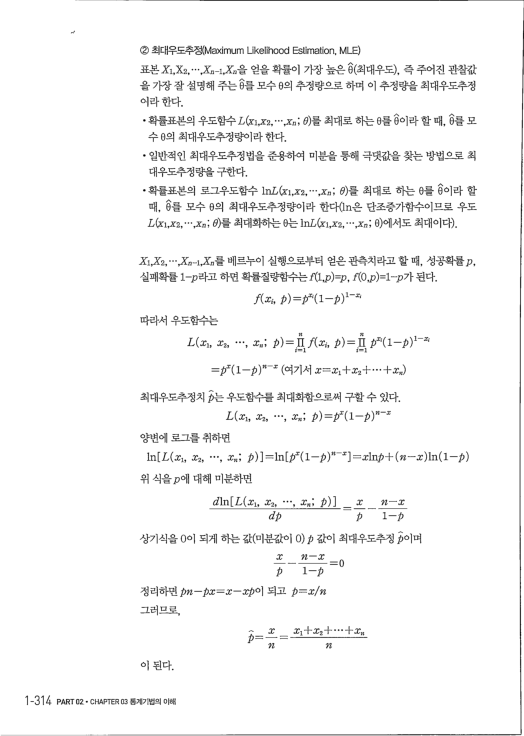
② 최대우도추정（Maximum Likelihood Estimation, MLE)

#### 표본x1,x2,...,xn-',x12을 얻을 확률이 가장 높은 芬（최대우도） , 즉 주어진 관찰값 
을 가장 잘 설명해 주는芬를 모수 e의 추정량으로 하며 이 추정량을 최대우도추정 이라 한다．

#### ·확률표본의 우도함수L(K1,X2, "·,Xn; 9）를 최대로 하는0를言이라할때 , 言를모 
수 0의 최대우도추정량이라 한다．

- 일반적인 최대우도추정법을 준용하여 미분을 통해 극댓값을 찾는 방법으로 최
대우도추정량을 구한다．

#### · 확률표본의 로그우도함수 h1L(K1,x2, "·,Xn; 0）를 최대로 하는 0를 芬이라 할
#### 때 , ＠를 모수 0의 최대우도추정량이라 한다（in은 단조증가함수이므로 우도 
L(K1,x2, ··-,x; 0）를 최대화하는 0는 1nL(K1,x2, ·",xn, 0）에서도 최대이다）.

#### Z1,Z2,'", xn-i,xn를 베르누이 실행으로부터 얻은관측치라고 할 때 , 성공확률β，
#### 실패확률1-β라고하면확률질량함수는f(i,p)=p, f (O,p)4-j？가된다．
#### f (x1, p)=pxi(1_p)i_x
따라서 우도함수는

#### L (x1, x2, ", x; p) =. II f (x1, p) =. II pxi( i- p)'→'
#### ＝夕X( 1_p)n_x （여기서 x= x1+x2+…+x,:)
최대우도추정치 夕는 우도함수를 최대화함으로써 구할 수 있다．

#### L (x1, x2, … , x:; p)=PX(1-p)fl_X
양변에 로그를 취하면

#### in[L (x1, x2, … , x; p)J=1n[px(1_pYz]=xinp+(n- x)1n(1_p)
위 식을β에 대해 미분하면

#### dln[L (x1, x2, ", x,:; p)〕 
x dp p i- p 상기식을 0이 되게 하는 값（미분값이 0) 少 값이 최대우도추정 /）이며

#### ·z7 
n- x =0 p i- p

#### 정리하먼／)n-px=x- xp이 되고 /)=x/n
그러므로，

## 이 된다． 
j＝줄＝ x1-+-x2-l-...-l-xfl n n 1-314 PART02. CHAPTER03통계기법의이해

#### n- z7
ㅣ

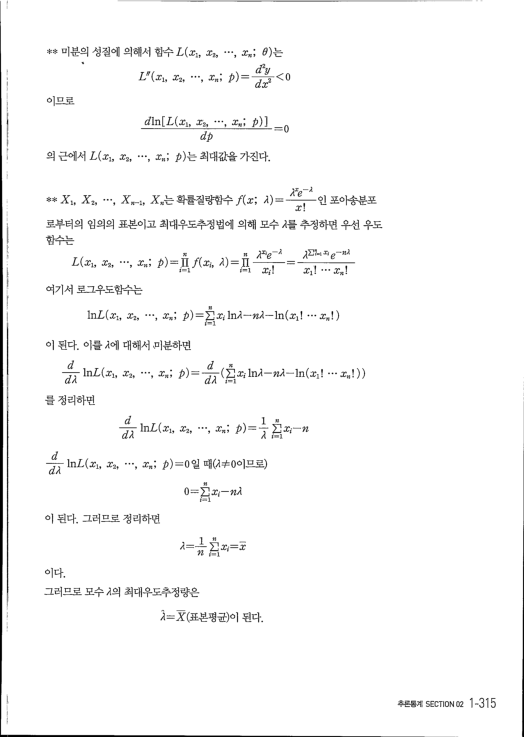
#### ** 미분의 성질에 의해서 함수￡(x1, x2, … , x; 0）는
夕）

#### p)
<o dx x2, " , :, ::,

- ． 
- ，
이므로

#### dln{
### p)]
dp 의근에서 ￡(x1, x2, " , x,:; 少）는최대값을가진다．

- 
,,

- 
-, .

, .

.

.

.

- 
' A청_

#### . 
- 
.

.

** 兀in x2, … , xn-i, 兀n는확률질，량．함수 /.( x; 시．= ' " v .

인．포아．송분포 α？ 프 로부터의 임의의 표본이고 최대우도추정법에 의해 모수 A를 추정하면 우선 우도 함수는

#### . 
.

즈 . .

. .

즈 Ax1e_ I A＞珊：'z댕－戒 L (x1, x2, " ' , x72; p)컥색．,t( x1, 시 ㅋ 쨔 召 ｀ ㅅ 淞 H 너 z1! … T?z!

ㅡ 졔 여기서 로그우도함수는

#### 1nL(x1, x2, " ' , x; p)=ㅆx7 1nA-nA---ln(x1!
i=i

#### 이 된다 . 이를 뻬 대해서 끼분하면
#### d 1nT (쏘－ '. . .. 샛 . 柏＝－브rU
(Vi -.1，새-.緇_1,( - ' . . . 쏘 ', , dA " ' ∼ ' ∼ " - " , ∼，z ' k'I dA '놉i 'z " " " " " " ' 뱐1" .-n" 11 를 정리하면

### 따
尤 尙 1 T ＾ 〃 ㅗ

- - - ，
凡

# 옰1nL(x1, x2, ··· , x,; 夕）=.일때（ㅅ쑤.이므로）
#### 0 =끄 xf- nA 
i=i 이 된다 . 그러므로 정리하면

#### ㅈ
蚣 끄 筒 1 ㅠ ， ㅅ 王 이다． 그러므로 모수 A2] 최대우도추정량은 ㅅ＝=Z（표본평균）이 된다．

> ㅡ
> 추론통계 SECTI아』02 1-3巧
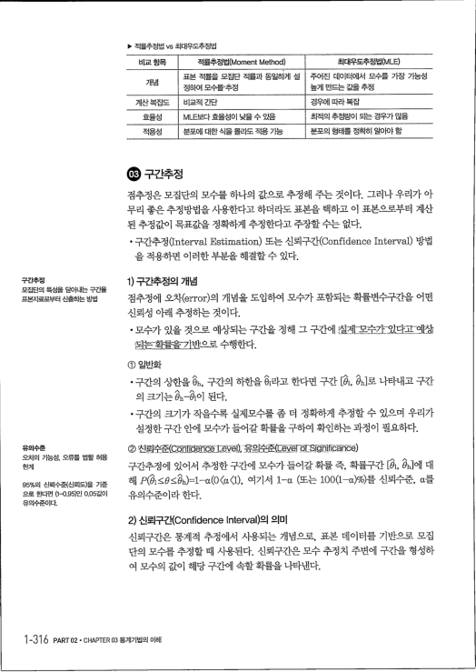
> 적률추정법 vs 최대우도추정법
비교 항목 찬渥추정법胞oment Method) 최대우도추정법（MLE) 주어진 데이터에서 모수를 가장 가능셩 개념 표본 적률을 모집단 적률과 동일하게 설 높게 만드는 값을 추정 정하여 모수를‘추정 계산복잡도 비교적 간단 경우에 따라 복잡 효율성 MLE보다 효율성이 낮을 수 있음 최적의 추정량이 되는 경우가 많음 적용성 분포에 대한 식을 몰라도 적용 가능 분포의 형태를 정확히 일아야 함

#### .구간추정
점추정은 모집단의 모수를 하나의 값으로 추정해 주는 것이다 . 그러나 우리가 아 무리 좋은 추정방법을 사용한다고 하더라도 표본을 택하고 이 표본으로부터 계산 된 추정값이 목표값을 정확하게 추정한다고 주장할 수는 없다．

- 구간추정（Interval Estimation) 또는 신뢰구간（Confidence Interval) 방법
을 적용하면 이러한 부분을 해결할 수 있다． 1) 구간추정의 개념 구간추정 모집단으I 특성을 담아내는 구간을 표본자朋부터 산출하는 방법 점추정에 오차（error）의 개념을 도입하여 모수가 포함되는 확률변수구간을 어떤 신뢰성 아래 추정하는 것이다．

- 모수가 있을 것으로 예상되는 구간을 정해 그 구간에 실제끝冷괴．있다：고쫴상
되는蜜즈률竇기반으로 수행한다． ① 일반화

- 구간의 상한을Oh , 구간의 하한을苔l라고 한다면 구간 〔1, 9i〕로 나타내고 구간
의 크기는Oh-胸 된다．

- 구간의 크기가 작을수록 실제모수를 좀 더 정확하게 추정할 수 있으며 우리가
#### 설정한 구간 안에 모수가 들어갈 확률을 구하여 확인하는 과정이 필요하다 .
#### ② 친뢰픈羅《C否즈f1요nce L\TD，유의츳준《EVr[$Jㅁflfiditce)
유의수준 2E의 가눴l , 오류를 범할 허용 한계 구간추정에 있어서 추정한구간에 모수가들어갈확률 즉 , 확률구간 〔1, Oi〕에 대

#### 해 7〕
（祉 9二 9h)=1-a(O <a <1) , 여기서 1-a （生는 100(1-a)%）를 신뢰수준 , α를 95％의 신뢰수준（신뢰도）을 기준 으로 한다면 (1-0.95）인 0.05값이 유의수준이라한다． 유의수준이다． 2) 신뢰구간（Confidence Interval）의 의미 신뢰구간은 통계적 추정에서 사용되는 개념으로 , 표본 데이터를 기반으로 모집 단의 모수를 추정할 때 사용된다 . 신뢰구간은 모수 추정치 주변에 구간을 형성하 여 모수의 값이 해당 구간에 속할확률을 나타낸다． 1-316 PART02* CHAPTER 03통계기법의이해

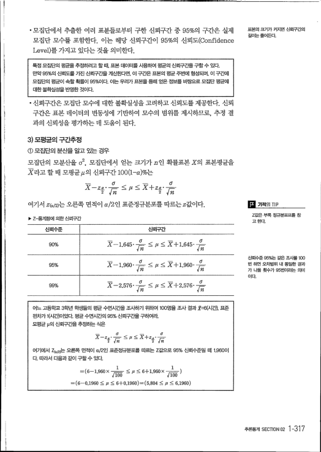
- 모집단에서 추출한 여러 표분들로부터 구한 신뢰구간 중 95％의 구간은 실제
모집단 모수를 포함한다 . 이는 해당 신뢰구간이 95％의 신뢰도（Confidence Level）를 가지고 있다는 것을 의미한다． 특정 모집단의 평균을 추정하려고 할 때 , 표본 데이터를 사용하여 평균의 신뢰구간을 구할 수 있다． 만약 95％의 신뢰도를 가진 신뢰구간을 계산한다면 . 이 구간은 표본의 평균 주변에 형성되며 , 이 구간에 모집단의 펑균이 속할 확률이 95％이다. 이는 우리가 표본을 통해 얻은 정보를 바탕으로 모집단 펑균에 대한 불확실성을 반영한 것이다．

- 신뢰구간은 모집단 모수에 대한 불확실성을 고려하고 신뢰도를 제공한다 . 신뢰
#### 구간은 표본 데이터의 변동성에 기반하여 모수의 범위를 제시하므로 , 추정 결
과의 신뢰성을 평가하는 데 도움이 된다． 3) 모평균의 구간추정 ① 모집단의 분산을 알고 있는 경우 모집단의 모분산을  a2, 모집단에서 얻는 크기가 끄인 확률표본Z의 표본평균을

## Z라고 할 때 모평균／I의 신뢰구간 100(1-a)％는 
x- z흐．a= 二 /, 二 x+z르 수 2 γ凡 2 ,ffl 여기서 z（α／2）는 오른쪽 면적이 α/2인 표준蔘予분포를 따르는z값이다． 》 Z- 계량에 의한신뢰구간 신뢰수준 신뢰구간

## 90% 
＝ㅉ - ＝ㅉ - ＝ㅉ .

a 걀 겯 =:7 . . - .  - .

a A-1.645 7兀 츠 〃 츠 ㅅ＋1.b4b 7ㅉ

### 95% 
=：ㅉ ' -

- 
a 겯 낟 =：ㅉ . ' ∼ 一 - a ㅅ-1'9iO"----- S β S A+ 1 '960 7福

## 99% 
== a 』 ' =：ㅉ .

a A-2.576 '77 S 〃 S A+ 2.576 7福 어느 고등학교 3학년 학생들의 평균 수면시긴믈 조사하기 위하여 100명을 조사 결과 1=6（시간） , 표준 편차가 1（시간）이었다. 펑균 수면시간의 95% 신뢰구긴을 구하여라． 모평균 』의 신뢰구간을 추정하는 식은

## x-2읗 ' 7읗드／二X+Zr 7옳
여기에서 Z(α／샌）는 오른쪽 면적이 α／2인 표준騙구분포를 따르는 z값으로 95% 신뢰수준일 때 1.960이 다. 따라서 다음과 같이 구할 수 있다． .

1 1 .

=(6-1.960x 구騙丁 드 P 二 6+1.960X -菊rr) =(6- o.1960 三 p 三 6+0.1960)=(5.804 三 p 二 6.1960)

> 표본의 크기가 커지면 신뢰구간의 
길이는줄거든다．

> ．잽 기적의 ㄲp
> z값은 부록 장규분포표를 참
> 고한다．
> 신뢰수준 95％는 같은 조사를 100 
번 하면 오차범위 내 동일한 결과 가 나올 횟수가 95번이라는 의미

> 이다．
> 추론통계 SECTION02 1-317
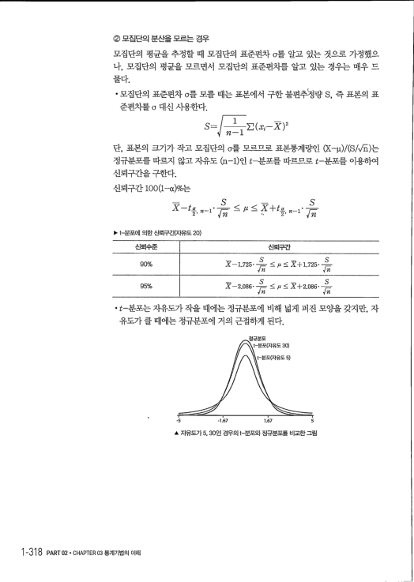
② 모집단의 분산을 모르는 경우 모집단의 평균을 추정할 때 모집단의 표준편차 0를 알고 있는 것으로 가정했으 나 , 모집단의 평균을 모르면서 모집단의 표준편차를 알고 있는 경우는 매우 드 물다．

- 모집단의 표준편차 .를 모를 때는 표본에서 구한 불편추경량 S , 즉 표본의 표
#### 준편차를 (, 대신 사용한다． 
S갹 1 . E (xi-Z )2 v n- i-

#### 단 , 표본의 크기가 작고 모집단의 .를 무ㄹㅁ무 표본통계량인 (X-")/(s/7H）는
牛予분포를 따르지 않고 자유도 (n-i）인 舌－분포를 따르므로 t－분포를 이용하여

#### 신뢰구간을 구한다 .
신뢰구간 100(1-a)％는

## ＝ㅉ 
.

S , 』 ＝ㅉ . .

S ㅅ-t , n_i.-1;:- S β 츠 츤-I-t읗， n-1I露

> t－분포에 의한 신뢰구긴《자유도 20)
신뢰수준 신뢰구간 90% = , S ' 볍＝ s 725 ' - --- 드 β 드 A+ 1.725 ' -

#### 95% 
== S .

' ㄷ＝ ' S A -Z.U匕5 ' 兀 스 β 스 ㅅ＋2.086 ' 兀 나－분포는 자유도가 작을 때에는 정규분포에 비해 넓게 퍼진 모양을 갖지만 , 자 유도가 클 때에는 정규분포에 거의 근접하게 된다． 정규분포 t－분포（자유도 30) t－분포（자유도 5) -1.67

1. 67 
5 ▲ 차유도가 5. 30인 경우의 t－분포와 정규분포를 비교한그림 1 -318 PART 02. CHAPTER 03통계기법의이해

## !
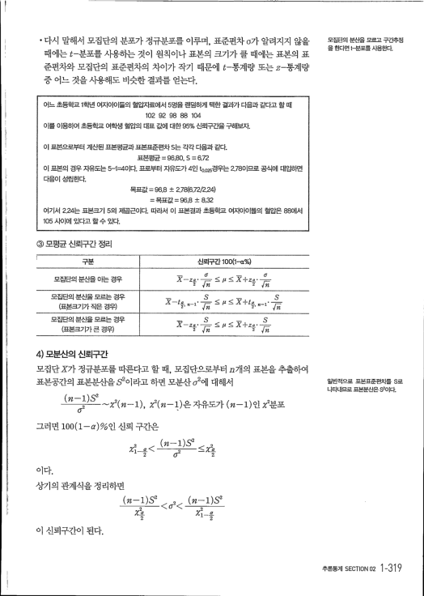
- 다시 말해서 모집단의 분포가 정규분포를 이루며 , 표준편차 0가 알려지지 않을
때에는 t－분포를 사용하는 것이 원칙이나 표본의 크기가 클 때에는 표본의 표 준편차와 모집단의 표준편차의 차이가 작기 때문에 木－통계량 또는 z－통계량 중 어느 것을 사용해도 비슷한 결과를 얻는다． 어느 초등학교 1학년 여자아이들의 혈압자료에서 5명을 랜덤하게 택한 결과가 다음과 같다고 할 때 102 92 98 88 104 이를 이용하여 초등학교 여학생 혈압의 대표 값에 대한 95% 신뢰구간을 구해보자． 이 표본으로부터 계산된 표본평균과 표본표준편차 S는 각각 다음과 같다． 표본평균 = 96.80. S = 6.72 이 표본의 경우 자유도는 5-1=4이다. 표로부터 차유도가 4인 to.025경우는 2.78이므로 공식에 대입하면 다음이 성립한다． 목표값 = 96.8 土 2.78(6.72/2.24) = 목표값 = 96.8 土 8.32 여기서 2.24는 표본크기 5의 저ㅁ근이다. 따라서 이 표본결과 초등학교 여자아이들의 혈압은 88에서 105 사이에 있다고 할 수 있다． ③ 모평균 신뢰구간 정리 구분 신뢰구간 100(1-a%)

## 모집단의 분산을 아는 경우 
x-2읗·읊 二／二x+2응·읊

## （표본크기가 작은 경우） 
无．7읗， fl-i.읊＜/<X+tf,,: -i·읊 모집단의 분산을 모르는 경우

## （표본크기가 큰 경우） 
X-z읗·읊」／」无＋쁠·읊 모집단의 분산을 모르는 경우 4) 모분산의 신뢰구간 모집단Z가 정규분포를 따른다고 할 때 , 모집단으로부터 끄개의 표본을 추출하여 표본공간의 표본분산을S2이라고 하면 모분산α2에 대해서

#### (n
-a " DS2 " , F ' ∼ z ,' 跡-1), z2(n- 1》은자．유도가 嫩-1）인 x2분포

#### 그러면 100(1-a)％인 신뢰 구간은
#### ／둬孝〈 (n- i) S ' 三z2X. 
2 （下 z 이다． 상기의 관계식을 정리하면

#### (n- i) S2  ＜군〈  (n- 1)S2
x흐 ㅊr=－흐． 2 ㅗ 2 이 신뢰구간이 된다．

> 모집단의 분산을 모르고 구간추정 
을 흰Ii가면 t－분포를 사용한다．

> 일반적으로 표본표준편차를 S로 
나타내므로 표본분산은 S2이다．

> 추唜계 SECTION 02 ㄴ1?
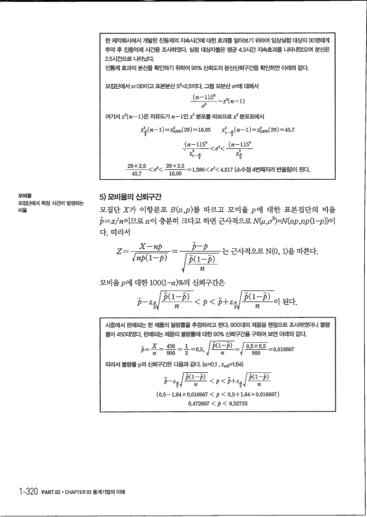
한 제약회사에서 개발한 진통제의 지속시간에 대한 효과를 알아보기 위하여 임상실험 대상자 30명에게 투약 후 진통억제 시간을 조사하였다 . 실험 대상자들은 평균 4.3시간 지속효과를 나타내었으며 분산은

2. 5시간으로 나타났다．
진통제 효과의 분산을 확인하기 위하여 95% 신뢰도의 분산신뢰구간을 확인하면 아래와 같다． 모집단에서 n 30이고 표본분산 S2=2.5이다. 그럼 모분산 《72에 대해서 (n- 1)S2 x2(n- 1) a 여기서 x2(n- 1）은 자유도가 'z-1인 x2 분포를 따聖로 x2 분포표에서 05 x2_ x 025 2 2 S2

- 
..

x1-i z뿡

### 29x. 2.5 <.2< 29
45.7 1J．欌5=1.586<a2<4.517（죠수점4번째7H반올림） 이된다·

#### 모비율 
5）모비율의신뢰구간 모집단에서 특정 사건이 발생하는 비율 모집단 Z가 이항분포 B（끄 , β）를 따르고 모비율 β에 대한 표본집단의 비율 p= x/n이므로n이 충분히 크다고 하면 근사적으로N(u ,a2)=N(np,np(l-p)）이 다 . 따라서

#### z=  , x- np .  =  , 夕－夕 
는근사적으로N(0, 1）을따른다． 沕少（l－끼 沙（1케 v n

# 모비율β에 대한 100(1-a)％의 신뢰구간은 
妗간 (i- ) Za I n ) , 이된다． 시쥠게서 판매되는 한 저曆의 불량률을 추정하려고 힌다. 900대의 제품을 랜덤으로 조사하였더니 불량 률이 450대였다. 판매되는 저曆의 불량률에 대한 90% 신뢰구간을 구하여 보면 0脾ㅐ와 겉다．

# '：츳：풉器＝는.5,J' (i ,") =J "·킹증：·" =0.016667
따라서 불량률 p의 신뢰구간은 다음과 같다． (a=0.1 . zat2=1.64) .

I (i- ) , . , ^ , / (1- ) P_ZfJ " 'z " 〈夕＜？十z읗γ " n " (o.5-1.64x0.016667 < 夕 < 0.5+1.64XO.016667)

0. 472667 < /' < 0.52733
1 -320 PART02· CHAPTER 03통계기법의이해

> 975
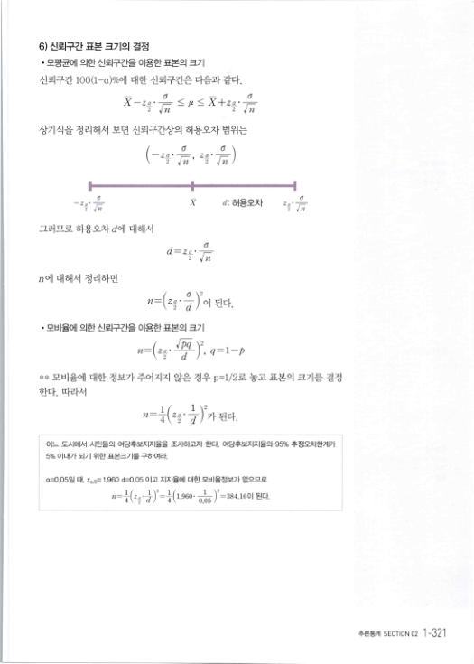
6) 신뢰구간 표본 크기의 결정

- 모평균에 의한 신뢰구간을 이용한 표본의 크기
신뢰구간 100(1-a)％에 대한 신뢰구간은 다음과 같다．

#### x- z.．결＝ 三 〃 二 져－zα 결＝ 
2 7n 2 간i 상기식을 정리해서 보면 신뢰구간상의 허용오차 범위는

#### 스
涵

#### 스
涵

#### ,
' / 之 2 趣 2

### r
` `

### I 
I I -2,·옳 X d：허용오차 zc,. -옳 ■ Z 그러므로 허용오차 α에 대해서

#### '7 " 
伊 〃 나→ㅎ 石7 끄에 대해서 정리하면

#### / 
(1 ,2 n = I\ 2 ' 77 이 된다．

#### · 모비율에 의한 신뢰구간을 이용한 표본의 크기 
/ 77ㅉ ,2 .

.

n= I z孝 ' ㅗ녹스－ I ' U= 1- 1) ' \∼- - d / ' 헷 - r

#### ** 모비율에 대한 정보가 주어지지 않은 경우 p=l/2로 놓고 표본의 크기를 결정
한다 . 따라서

## n=솖（2읗·숭）'가된다．
어느 돠 에서 시인들의 여당후보지ㅈ읕을 조사하고차 한다 . 여당후보지자율의 95% 추정오차한계가 5% 이내가 되기 위한 표본크기를 구하여라． a0.05일 때 , Za/2= 1.960 d 〕.05 이고 지지剖 대한 모비율정보가 없오므로 1I i '2 if . ＾∼， 1 \2 ',,, . . ∼｀』 ㅌ．.-' 一T난읗 " 7/ =T난 ' 沙oU 丁己計 =3z'q.1ovt t1 -r.

> 추론통계 SECTION02 1-321
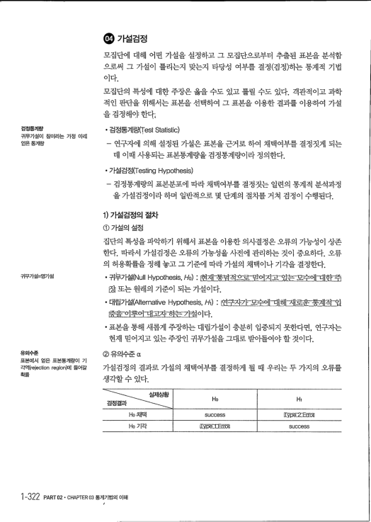
.

가설검정 모집단에 대해 어떤 가설을 설정하고 그 모집단으로부터 추출된 표본을 분석함 으로써 그 가설이 틀리는지 맞는지 타당성 여부를 결정（검정）하는 통계적 기법 이다．

#### 모집단의 특정에 대한 주장은 옳을 수도 있고 틀릴 수도 있다 . 객관적이고 과학 
적인 판단을 위해서는 표본을 선택하여 그 표본을 이용한 결과를 이용하여 가설 을 검정해야 한다길

- 검정통계량（Test Statistic)
검정통계량 귀무가설이 참이라는 가정 아래 얻은통계량

- 연구자에 의해 설정된 가설은 표본을 근거로 하여 채택여부를 결정짓게 되는
데 이때 사용되는 표본통계량을 검정통계량이라 정의한다．

- 가설검정（Testing Hypothesis)
- 검정통계량의 표본분포에 따라 채택여부를 결정짓는 일련의 통계적 분석과정 
을 가설검정이라 하며 일반적으로 몇 단계의 절차를 거쳐 검정이 수행된다． 1) 가설검정의 절차 ① 가설의 설정

#### 집단의 특성을 파악하기 위해서 표본을 이용한 의사결정은 오류의 가능성이 상존 
한다 . 따라서 가설검정은 오류의 가능성을 사전에 관리하는 것이 중요하다 . 오류 의 허용확률을 정해 놓고 그 기준에 따라 가설의 채택이나 기각을 결정한다．

#### · 귀무가설（N얘 Hypothesis, Ho) : 鬧"재瑗넘；적으r 믿드圭이고＝었븐모수에－대힌쭉 
장 또는 원래의 기준이 되는 가설이다． 귀무가설＝영가설

#### · 대립가설（Alternative Hypothesis, Hi) : 변구자가’모수에＝戮홰탉ㅐ로鍵＝톳계적ㅍ있
층-0-이루어개고자히＝튼가설이다．

- 표본을 통해 새롭게 주장하는 대립가설이 충분히 입증되지 못한다면 , 연구자는
현재 믿어지고 있는 주장인 귀무가설을 그대로 받아들여야 할 것이다． ② 유의수준 α 유의수준 표본에서 얻은 표본통계량이 기 각역（rejection region）에 들어갈 확률 가설검정의 결과로 가설의 채택여부를 결정하게 될 때 우리는 두 가지의 오류를 생각할 수 있다． 실제상황 I-jo 검정결과 Ho．채택 success Ho기각 tLypetE百b乙 1-322 PART02. CHAPTER 03통계기법의이해

> Hi
> 〔〔頰巨＝2＝ㅌ雨j蝦
> success
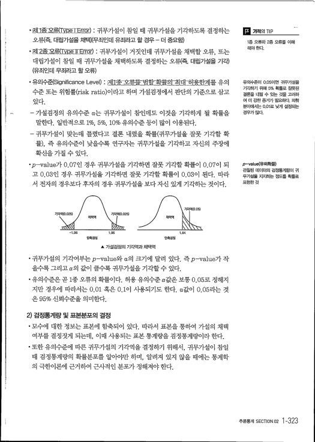
- 제〕
종篒죠류丈r｀陋酊E行百〔） : 귀무가설이 참일 때 귀무가설을 기각하도록 결정하는 오류〈즉, 대립가설을채택）（무죄인데 유죄라고할경우－ 더 중요함）

#### · 제2종ㅍ오류工珏巨FrErr ) : 귀무가설이 거짓인데 귀무가설을 채택할 오류 , 또는
대립가설이 참일 때 귀무가설을 채택하도록 결정하는 오류（즉, 대립가설을 기각） （유죄인데 무죄라고 할 오류）

#### · 유의수칡Significance Level) : 쩨그衷크籤춧를E범힐ㅍ확륨의꺽대“"허＝욕＝히떼를 유의 
수준 또는 위험률（risk ratio）이라고 하며 가설검정에서 판단의 기준으로 삼고 있다．

#### - 가설검정의 유의수준 α는 귀무가설이 참인데도 이것을 기각하게 될 확률을 
말한다 . 일반적으로 1%, 5%, 10％유의수준등이 많이 이용된다 .

- 귀무가설이 맞는데 틀렸다고 결론 내렸을 확률（귀무가설을 잘못 기각할 확
#### 률） , 즉 유의수준이 낮을수록 연구자는 귀무가설을 기각하고 자신의 주장에
#### 확신을 가질 수 있다． 
·p-value가 0.07인 경우 귀무가설을 기각하면 잘못 기각할 확률이 0.07이 되 고 0.03인 경우 귀무가설을 기각하면 잘못 기각할 확률이 0.03이 된다 . 따라 서 전자의 경우보다 후자의 경우 귀무가설을 보다 자신 있게 기각하는 것이다 .

기긱역《0.05) 기각역（0.025)

- 
기각역（0.025)

1. 96
1. 64
단측검정 ▲ 가설검정의 기각역과 채택역

- 귀무가설의 기각여부는β-value와 α의 크기에 달려 있다 . 즉β-value가 작
을수록 그리고 α의 값이 클수록 귀무가설을 기각할 수 있다．

- 유의수준은 곧 1종 오류의 확률이다 . 허용 유의수준 α값은 보통 0.05로 정해지
지만 경우에 따라서는 0.01 혹은 0.1이 사용되기도 한다 . α값이 0.05라는 것 은 95% 신뢰수준을 의미한다． 2) 검정통계량 및 표본분포의 결정

- 모수에 대한 정보는 표본에 함축되어 있다 . 따라서 표본을 통하여 가설의 채택 
여부를 결정짓게 되는데 , 이때 사용되는 표본 통계량을 검정통계량이라 한다．

#### · 또한 유의수준에 따른 귀무가설의 기각역을 결정하기 위해서 , 귀무가설이 참일 
때 검정통계량의 확률분포를 알아야만 하며 , 알려져 있지 않을 때에는 통계학 의 극한이론에 근거하여 근사적인 분포가 정해져야 한다．

> 【헴 기적의 ㄲp
> 1종 오류와 2종 오류를 이해
> 해야힌다．
> 유의수준이 0.05이면 귀무가설을 
기각하기 위해 5% 확률로 잘못된

> 결론을 내릴 수 있는 것을 고려하 
여 더 강한 증거가 필요하다 . 의학 분야에서는 0 . 이로 낮게 설정되는 경우가 많다．

> p- value（유의확률）
> 관찰돈l 데이터의 검정통계량이 구I 
무가설을 지지히는 정도를 확률로 표현한 것

> 추론통계 SECTION02 1-323
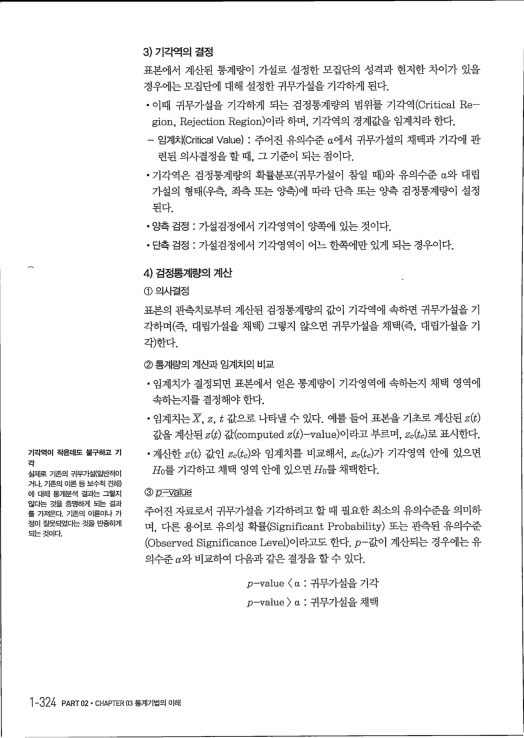
3) 기각역의 결정 표본에서 계산된 통계량이 가설로 설정한 모집단의 성격과 현저한 차이가 있을 경우에는 모집단에 대해 설정한 귀무가설을 기각하게 된다．

- 이때 귀무가설을 기각하게 되는 검정통계량의 범위를 기각역（Critical Re-
gion, Rejection Region）이라하며 , 기각역의 경계값을 암계치라한다．

- 임계치（Critical Value) : 주어진 유의수준 α에서 귀무가설의 채택과 기각에 관
련된 의사결정을할때 , 그 기준이 되는 점이다．

- 기각역은 검정통계량의 확률분포（귀무가설이 참일 때）와 유의수준 α와 대립
가설의 형태（우측 , 좌측 또는 양측）에 따라 단측 또는 양측 검정통계량이 설정 된다．

#### · 양측 검정 : 가설검정에서 기각영역이 양쪽에 있는 것이다．
#### · 단측 검정 : 가설검정에서 기각영역이 어느 한쪽에만 있게 되는 경우이다 .
4) 검정통계량의 계산 ① 의사결정 표본의 관측치로부터 계산된 검정통계량의 값이 기각역에 속하면 귀무가설을 기 각하며（측 , 대립가설을 채택） 그렇지 않으면 귀무가설을 채택（즉 , 대립가설을 기 각）한다． ② 통계량의 계산과 임계치의 비교

- 임계치가 결정되면 표본에서 얻은 통계량이 기각영역에 속하는지 채택 영역에
속하는지를 결정해야 한다．

- 임계치는x, z, 寸 값으로 나타낼 수 있다 . 예를 들어 표본을 기초로 계산된 z（舌）
#### 값을 계산된z(t) 값（computed z(t)-value）이라고 부르며 , zc（舌c）로 표시한다 .
- 계산한 z(t) 값인 zα（舌c）와 임계치를 비교해서 , zc（舌c）가 기각영역 안에 있으면
기각역이 작은데도 불구하고 기 각 실처扈 기존의 귀무가설（일반적이 거나. 기존의 이론 등 보수적 견해） /y0를 기각하고 채택 영역 안에 있으먼／Y0를 채택한다 .

③ ㅁ＝y흐ㄸ頂 에 대해 통계분석 걸과는 그렇지 않다는 것을 증명하게 되는 결과 를 가져온다 . 기존의 이론이나 가 정이 잘못되었다는 것을 반증하게 주어진 자료로서 귀무가설을 기각하려고 할 때 필요한 최소의 유의수준을 의미하 며 , 다른 용어로 유의성 확률（Significant Probability) 또는 관측된 유의수준 되는 것이다． (Observed Significance Level）이라고도 한다 . β－값이 계산되는 경우에는 유 의수준 α와 비교하여 다음과 같은 결정을 할 수 있다．

#### p-value <a : 귀무가설을 기각
#### p-value> a : 귀무가설을 채택
1 -324 PART 02* CHAPTER 03통계기법의이해

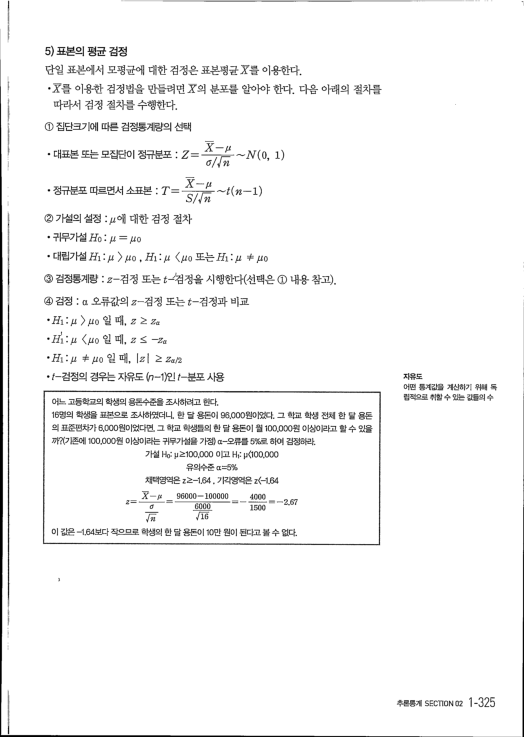
5) 표본의 평균 검정 단일 표본에서 모평균에 대한 검정은 표본평균x를 이용한다． .x를 이용한 검정법을 만들려면 x의 분포를 알아야 한다 . 다음 아래의 절차를 따라서 검정 절차를 수행한다． ① 집단크기에 따른 검정통계량의 선택

```python
" , , →H . 「 , …－ 
, ^ , ㅜ , →H- - 一 
X- p 
, ,. 
. 
· 대，표본또근모집，단이, 정，규분포 : z== 一 . β  -N (O. 1,. 
07긴'1 
"
```
# ·정규분포따르면서소표본：
T= 飭騫 ∼t(n-1) ② 가설의 설정 : /1에 대한 검정 절차

- 귀무가설 Ho : /1 = /10
#### ' 대립가설Hi: /1 >/10 , Hi: /1 </20 또는工[1: /2 */10
#### ③ 검정통계량 : z－검정 또는 t-뇜정을 시행한다（선택은 ① 내용 참고） .
④ 검정 : α 오류값의 z－검정 또는 t－검정과 비교

#### Hi: /2 >/20 일 띠1, Z 上 Za
#### ·Hi: /2 </2。 일 때 , Z 二 - Za
#### ·珏:/L * /Lo 일 때 , 崗 上 Za/2
나－검정의 경우는 자유도 여-i）인 r－분포 사용 어느 고등학교의 학생의 용돈수준을 조사하려고 힌다． 16명의 학생을 표본으로 조사하였더니 , 한 달 뜻용《기 96.000원이었다. 그 학교 학생 전체 한 달 용돈 의 표쥐젼차가 6.000원이었다면 , 그 학교 학생들의 한 달 용돈이 월 100.000원 이상이라고 할 수 있을 까？（기존에 100.000원 이상이라는 귀무가설을 가정） α－오류를 5％로 하여 검정하라． 가설 04i上100,000 이＝af 댜i(100,000 유의수준 α=5% 채택영역은z之-1.64 , 기각영역은z슨1.64 X- p 96000-100000 4000 z=

- 
‘〕 C〃7 0 0000 7丁 ／工百 1500 이 값은 -t64보다 작으므로 학생의 한 달 용돈이 10만 원이 된다고 볼 수 없다．

> 차유도 
어떤 통계값을 계산하기 위해 독 립적으로 취할수 있는 값들의 수

> 추騙계 SECTION 02 1 -325
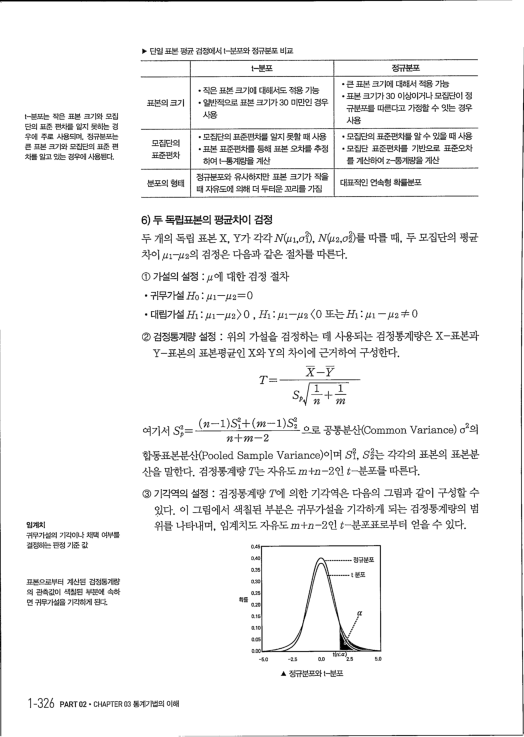
> 단일 표본 펑균 검정에서 t－분포와 장규분포 비교
t－분포 장규분포

- 큰 표본 크기에 대해서 즈돋 가능
- 작은 표본 크기에 대해서도 적용 가능
- 표본 크기가 30 이상이거나 모집단이 정
- 일반적으로 표본 크기가 30 미만인 경우
표본의크기 규분포를 따른다고 가정할 수 잇는 경우 사용 t－분포는 작은 표본 크기와 모집 단의 표준 편차를 알지 못하는 경 우에 주로 사용되며 . 정규분포는 큰 표본 크기와 모집단의 표준 편 차를 알고 있는 경우에 사용된다． 사용

- 모집단의 표췄크차를 알 수 있을 때 사용
- 모집단의 표죙던차를 알지 못할 때 사용
모집단의

- 모집단 표준편차를 기반으로 표준오차
- 표본 표준편ㅊ喝 통해 표본 오ㅊ喝 추정
표준펀차 를 계산하여 z-통계량을 계산 하여 t－통계량을 계산 분포의 형태 정규분포와 유사하지만 표본 크기가 작을 때 자유도에 의해 더 두터운 꼬리를 가짐 대표적인 연속형 확률분포 6) 두 독립표본의 평균차이 검정 두 개의 독립 표본x, Y가 각각N(ui,a勿 , N山2,a읓）를 따를 때 , 두 모집단의 평균 차이 ui찧z2의 검정은 다음과 같은 절차를 따른다．

#### ① 가설의 설정 : 〃에 대한 검정 절차
#### · 귀무가설 Ho : /1i- 12 = 0
- 대립가설Hi: /.11-/.12> 0 ,H1: /11 7.12 <0또는／:11: /.11-/.L2쑤0
② 검정통계량 설정 : 위의 가설을 검정하는 데 사용되는 검정통계량은 x－표본과

#### Y－표본의 표본평균인 x와Y의 차이에 근거하여 구성한다． 
x- y 11 '= ,, /1 . 1 Dp心7＋石7

```python
여기저 . g2.=  跡- 1) S: + (rn- i) S囊  으로곳톳부사（Common Variance) . 2의 
' 
n-I- 77쟁 - 겸
```
합동표본분산（Pooled Sample Variance）이며 驪 , 灘는 각각의 표본의 표본분

#### 산을 말한다 . 검정통계량 T는 자유도in +n -2인 t－분포를 따른다．
③ 기각역의 설정 : 검정통계량 T에 의한 기각역은 다음의 그림과 같이 구성할 수

#### 있다 . 이 그림에서 잭칠된 부분은 귀무가설을 기각하게 되는 검정통계량의 범
위를 나타내며 , 임계치도 자유도끄2＋끄－2인 t－분포표로부터 얻을 수 있다． 임계치 귀무가설의 기각이나 채택 여부를 결정하는 판정 기준 값 045

0. 40
〔）.35 표본으로부터 계산된 검정통계량 의 관측값이 색칠된 부분에 속하 면 귀무가설을 기각하게 된다．

0. 30
0. 25 
확률

0. 20
0. 15
0. 10
0. 05
0. 00
-5끄 ▲ 정규분포와 t분포 ㅑ 26 PART 02· CHAPTER 03통계기법의이해

> 5. 0
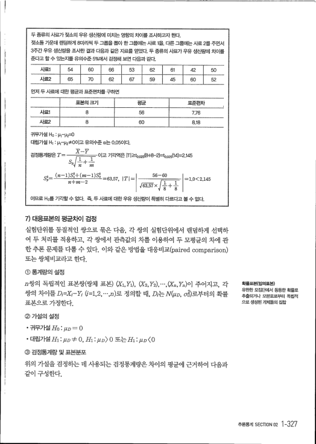
두 종류의 사료가 젖소의 우유 생산량에 미치는 영향의 차이를 조사하고자 힌빠.

젖소들 가운데 랜덤하게 8마리씩 두 그룹을 뽑아 한 그룹에는 사료 1을. 다른 그룹에는 사료 2를 주면서 3주간 우유 생신隱l을 조사한 결과 다음과 같은 차료를 얻었다. 두 종류의 사료가 우유 생스르鱗게 차이를 준다고 할 수 있는지를 유의수준 5％에서 검정해 보면 다음과 같다． AF 1 54 60 66 53 62 61 42 50 Aj료2 65 70 62 67 59 45 60 52 먼저 두 사료에 대한 펑균과 표쥐젼차를 구하면 표본의크기 평균 표준편차 사료1 8 56

7. 76
사료2 8 60

8. 18
귀무가설 I-b. : 』1캬』2=o 대립가설 H1 4ii가12*0이고 유의수준 α는 0.05이다．

### 검정통계량은T= 
온．- y .

이고기킥뼉위지스t0.025(8+8-2)=치0。25(14)_2.145 쨔솖＋솖

## ""『 (n-1)S+(m-1)S " =63.57, ITI= 
56-60，읍 =1.0<2.145 n+m-2 I 이므로 .를 기각할수 없다 . 즉 , 두사료에 대한우유 생산량이 특별히 다르다고볼수 없다． 7) 대응표본의 평균차이 검정 실험단위를 동질적인 쌍으로 묶은 다음 , 각 쌍의 실험단위에서 랜덤하게 선택하

#### 여 두 처리를 적용하고 , 각 쌍에서 관측값의 차를 이용하여 두 모평균의 차에 관 
한 추론 문제를 다룰 수 있다 . 이와 같은 방법을 대응비교（paired comparison) 또는 상쳬비교라고 한다． ① 통계량의 설정 n짱의 독립적인 표본쌍（쌍쳬 표본） （兀 1,Y1), (x2 , 기） , … , (Z끄 , ｝도）이 주어지고 , 각 쌍의 차이를甥=x1-Y1 (i=1,2, … , 끄）로 정의할 때 , 甥는N(LLD, 硼）로부터의 확률 표본으로 가정한다． ② 가설의 설정 ' 귀무가설 Ho : /zz〕 = 0

#### ' 대립가설／Y1 : /ID 쑤 0, Hi : /JD> 0 또는Hi : J1D <0
③ 검정통계량 및 표본분포 위의 가설을 검정하는 데 사용되는 검정통계량은 차이의 평균에 근거하여 다음과 같이 구성한다．

> 확률표본（임의표본） 
유한한 모집단에서 동등한 확률로 추출되거나 모분포로부터 독립적 으로 생성된 개체들의 집합

> 추騙계 SECTION 02 1-327
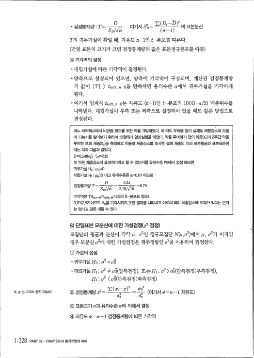
## ／〕 
｀ㄱ r n.- 7ㄲ2 '검정통계량『T= S7／ㅠ 여기서SL＝ 십；＝스1V ' 의표본분산

#### T의 귀무가설이 참일 때 , 자유도끄－1인 孟－분포를 따른다．
（만일 표본의 크기가 크면 검정통계량의 값은 표분정규분포를 따름） (z) 기각엿의 섭첫

- 대립가설에 따른 기각역이 결정된다．
#### · 양측으로 설정되어 있으면 , 양측에 기각역이 구성되며 , 계산된 검정통계량
#### 의 값이 田 
> t(。/2, n-i）을 만족하면 유의수준 α에서 귀무가설을 기각하게
된다 .

- 여기서 임계치 鹹/2. n-i）는 자유도 山-1）인 t－분포의 100(1-a/2) 백분위수를
나타낸다 . 대립가설이 우측 또는 좌측으로 설정되어 있을 때도 같은 방법으로 결정된다． 어느 제약회사（）卄서 비만증 환자를 위한 약을 개발하였다. 이 약이 부작용 없이 실저隱 체중감소0刊 도움 이 되는지를 알아보기 위하여 10명에게 임상실험을 하였다 . 약을 투여하기 전의 처厓（x1）과 2주간 약을 투여한 후의 체줬x2）을 측정하고 이들의 체중감소를 조사한 결과 처隱의 차의 표본평균과 표본표준편 ㅊ階 각각 다음과 같았다． 0=0.54(kg), S。

＝2.15 이 약은 체중감소에 효과적이라고 할 수 있는지를 유의수준 1％에서 검정 해보면 귀무가설 H0 410-0 대립가설 1 41D)0 이고유의수준은α=0.01 이므로

## 검정통계량T= S;；糟 :.,:）魅큰.79
기긱역은 T)tia.n_i>=t10.01 , 9)=2.821 (t－분포표 참조）

0. 79<2.821이므로 10를 기각시키지 못한 결과를 나타내고 이로쩌 약이 체중감소에 효과가 있다는 근거
는 딥．［다고 결론 내릴 수 있다． 8) 단일표본 모분산에 대한 가설검정（x2 검정）

#### 모집단의 평균과 분산이 각각／z ,
2 .1, U인 정규모집단N(u,a2）에서 /z , α2 .1, U가 미지인 경우 모분산α2에 대한 가설검정은 점추정량인 82을 이용하여 검정한다． ① 가설의 설정

- 귀무가설Ho : α2 ＝α긍
#### · 대립가설Hi: a2 * α긍（양측검정） , 또는／Y1 :U2> 0긍（단측검정：우측검정）, 
Hi: α2 〈α긍（단측검정：좌측검정）

#### --.-,--.,- ,
2 L (x1- )2 熒＄ 2 . ^,- , . , .

』 -,--.

②검．정，통계，량，/,'= - ' 찧2。 " 콰2。 (．여，기，시I熒=n- 1ㅈ嚼도) 2, (p는그리스문자피（phi) ③ 표본크기 n과유의수준 α에 의해서 결정

#### ④ 자유도 熒＝蚣－1 검정통계량에 따른 기각역
1-328 PART 02. CHAPTER 03통계기법의이해

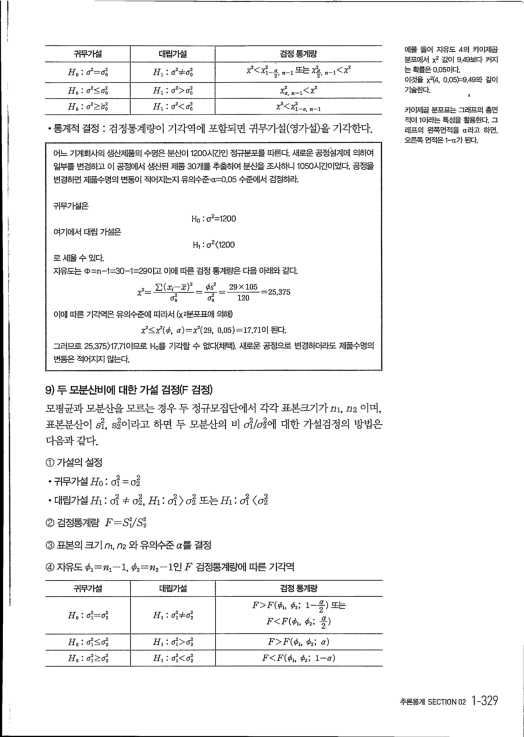
귀무가설 대립가설 검정 통계량 /Yo : α2= C蠶 H1 : 군수d츰 z ' <z弘읗 ,n-i또는x룝 , ,1<z" /Y. : α2드 a乙 H1 : C2> α蠶

4. ,_1<z2
工／. : α2논해 /71 : 군＜매 z2<z拗 ,n-i

#### · 통계적 결정 : 검정통계량이 기각역에 포함되면 귀무가설（영가설）을 기각한다．
어느 기계회사의 생산저푿의 수명은 분산이 1200시간인 장규분포를 따른다. 새로운 공정설계에 의하여 일부를 변경하고 이 공정에서 생산된 제품 30개를 추출하여 분산을 조사하니 1050시간이었다 . 공정을 변경하면 저居수명의 변동이 적어지는지 유의수준，cz=0.05 수준에서 검정하라． 귀무가설은 H。:a2=1200 여기에서 대립 가설은 H1 : a2<1200 로 서을 수 있다． 자유도는 D=n-1=30-1=29이고 이에 따른 검정 통계량은 다음 아래와 같다． z2=  Z （驪‘－끼 '  - cbs,2 =  29X 105  =25.375 α5, d5, 120 .

이에 따른 기각역은 유의수준에 따라서 (x2분포표에 의해） x2二x2(cb, a) =x2(29, 0.05) =17.7101 된 EF.

그러므로 25.375)17.71이므로 바를 기각할 수 없다（채택） . 새로운 공정으로 변경하더라도 저居수명의 변동은 적어지지 않는다． 9) 두 모분산비에 대한 가설 검정（F 검정）

#### 모평균과모분산을 모르는 경우 두 蔘子모집단에서 각각 표본크기가fli, fl2 이며，
표본분산이 8 2 , 2 Si, S2이라고 하면 두 모분산의 비 α읓／α읓에 대한 가설검정의 방법은 다음과 같다． ① 가설의 설정

- 귀무가설／:To: 2 
(J 2 01 02

- 대립가설Hi: 0읓 쑤 oL Hi: α 
U2i α옻 뚜 Hi: α읓 〈α옻 ②검정통계량 F=S:/S蓉 ③ 표본의 크기 fli. fl2 와 유의수준 α를 결정 ④ 자유도 丸=n1-1, 熒 2=n2-1인 ／구 검정통계량에 따른 기각역 귀무가설 대립가설 검정 통계량

#### H。 : 매＝α囊 
/Yl : C* C囊 F>F（孔， cb2; 1-퓽） 또는 F<F(cb1, cb ; 읗） H。: 매二α囊 ／키 : C> C:

F>／구（孔 , 熒2; α） 工／. : C브C囊 ／키 : 嶝＜ a蕣 F<F(cb1, cb2; 1-a)

> 예를 들어 자유도 4의 카이제곱 
분포에서 x2 값이 9.49보다 커지 는확률은0.05이다． 이것을 x2(4. 0.05ㅒ.49와 같이 기술한다．

> 카이저居 분포표는 그래프의 총면 
적이 1이라는 특성을 활용한다 . 그 래프의 왼쪽면적을 α라고 하면． 오른쪽 면적은 1-α가 된다．

> 추罌계 SECTION 02 1 -329
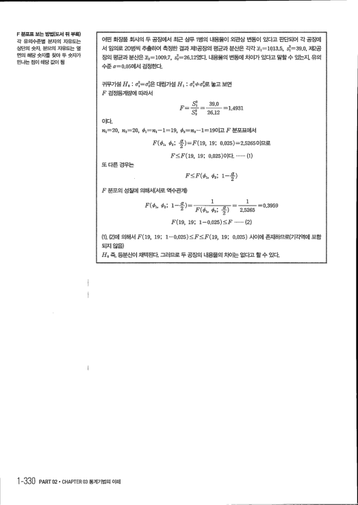
F 분포표 보는 방법（도서 뒤 부록） 각 유의수준별 분자의 자유도는 상단의 숫자. 분모의 차유도는 옆 면의 해당 숫자를 찾아 두 숫자가 만나는 점이 해당 값이 됨 어떤 화장품 회사의 두 部l에서 최근 샴푸 1병의 내용물이 외관상 변동이 있다고 핀단되어 각 공장에 서 임의로 20병씩 추출하여 측정한 결과 제1공장의 평균과 분산은 각각 无1 = 1013.5, 굵=39.0 , 제2공 장의 평균과분산은昉= 1009.7, 嵋=26.12였다. 내용물의 변동에 차이가 있다고 말할수 있는지 , 유의 수준 α=0.05에서 검정힌다． 귀무가설 H。: 매＝α蠶은 대립가설 ／키 : 嶝쑤α결로 놓고 보면 ／구 검정통계량에 따라서

- 
S苧

39. 0 
／구 " =- = … =1.4931 S

26. 12
이다． n1=20, n2=20, 仇=n1-1= 19, 孔=n2-1= 19이고／구분포표에서

### F(cb1, c52; f)=F(19, 19; 0.025)=2.52650I
F드F(19, 19; 0.025)01다.

(1) 또 다른 경우는 F二F（孔， 2; 1-읗） F 분포의 성질에 의해서（서로 역수관겨I) 1 = 0.3959 1

### 1구r＇궈 
rㅅ - ' " " " ' 2 ' F(c31, 熒 2; f) ㅡ F (19, 19; 1- 0.025)二F (2) (1),(2）에 의해서 F (19, 19; 1- 0.025)즈F즈F(19, ig; 0.025) 사이에존재하므로（기각역에포함 되지 않음） H. 즉, 등분산이 채택된다. 그러므로 두 공장의 내용물의 차이는 없다고 할수 있다． - ㅣ 1-330 PART 02. CHAPTER 03통계기법의이해

> 2. 5265
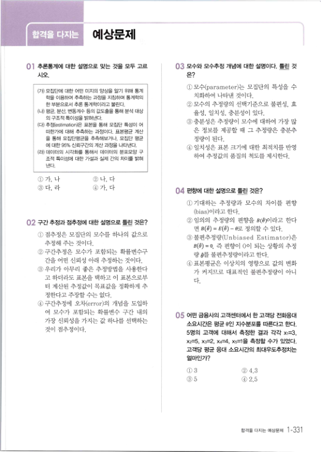
## 예상문제
03 모수와 모수추정 개념에 대한 설명이다 . 틀린 것 01 추론통계에 대한 설명으로 맞는 것을 모두 고르 은？ 시오． ① 모수（parameter）는 모집단의 특정을 수 치화하여 나타낸 것이다． ②모수의 추정량의 선택기준으로 불편성 , 효 （가） 모집단에 대한 어떤 미지의 양상을 알기 위해 통계 학을 이용하여 綽추하는 과정을 지칭하며 통계학의 한 부분으로서 추론 통계학이라고 불린다． （나） 평균 . 분산 . 변동계수 등의 값도출을 통해 분석 대상 의 구조적 특이성을 밝혀낸다． 율성 , 일치성 , 충분성이 있다． ③ 충분성은 추정링끼 모수에 대하여 가장 많 은 정보를 제공할 때 그 추정량은 충분추 정량이 된다． ④ 일치성은 표본 크기에 대한 최적치를 반영 하여 추정값의 품질의 척도를 제시한다． （다） 추정（estimation）은 표본을 통해 모집단 특성이 어 떠한가에 대해 衫하는 과정이다 . 표본평균 계산 을 통해 모집단평균을 졈누해보거나 , 모집단 평균 에 대한 95% 신뢰구간의 계산 과정을 나타낸다． （라） 데이터의 시각화를 통해서 데이터의 분포모양 구 조적 특이성에 대한 가설과 실제 간의 차이를 밝혀 낸다.

① 가 , 나 ③ 다 , 라 ② 나 , 다 ④ 가 , 다 04 편향에 대한 설명으로 톨린 것은？ ①기대하는 추정량과 모수의 차이를 편향 (bias）이라고 한다． ② 임의의 추정량의 편향을 B(G）이라고 한다 면 β（〃）= E(戚) -O 정의할 수 있다． ③불편추정량（Unbiased Estimator）은 B(〃) = 0 , 즉 편향이 0이 되는 상황의 추정 량 戚를 불편추정량이라고 한다． ④표본평균은 이상치의 영향으로 값의 변화 가 커지므로 대표적인 불편추정량이 아니 02 구간 추정과 점추정에 대한 설명으로 들린 것은？ ① 점추정은 모집단의 모수를 하나의 값으로 추정해 주는 것이다． ② 구간추정은 모수가 포함되는 확률변수구 간을 어떤 신뢰성 아래 추정하는 것이다． ③ 우리가 아무리 좋은 추정방법을 사용한다 고 하더라도 표본을 택하고 이 표본으로부 다． 터 계산된 추정값이 목표값을 정확하게 추 정한다고 주장할 수는 없다． ④구간추정에 오차＜error）의 개념을 도입하 여 모수가 포함되는 확률변수 구간 내의 가장 신뢰성을 가지는 값 하나를 선택하는 05 어떤 금융사의 고객센터에서 한 고객당 전화응대 소요시간은 평균 9인 지수분포를 따른다고 한다． 5명의 고객에 대해서 측정한 결과 각각 xi=3.

것이 점추정이다． X2=5. X32, )CF4, X51을 측정할 수가 있었다． 고객당 평균 응대 소요시간의 최대우도추정치는 얼마인가？ @3 @:)5 ②4.3 @2.5

> 합격을다지는예상문제 ㄴ331
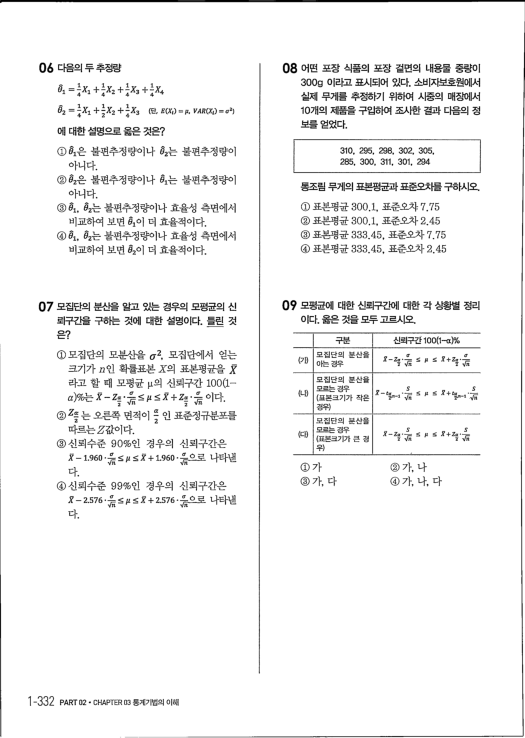
06 다음의 두 추정량 08 어떤 포장 식품의 포장 겉면의 내용물 중량이 300g 이라고 표시되어 있다 , 소비자보호원에서 실제 무게를 추정하기 위하여 시중의 매장에서 10개의 제뜯 구입하여 조사한 결과 다음의 정 보를 얻었다． 쟈 1 - 4 + 지 1 - 4 시 1 - 4 瑕 1 - 4 ㅡ 하 + + （단， E(X) VAR(X1) = a2) 에 대한 설멍으로 옳은 것은？

310. 295. 298. 302. 305. 
285. 300. 311. 301. 294
① 하은 불편추정량이나 02는 불편추정량이 아니다． ②02은 불펀추정량이나 戚1는 불편추정량이 통조림 무게의 표본평균과 표준오차를 구하시오． 아니다． ③하, 02는 불편추정량이나 효율성 측면에서 비교하여 보면 01이 더 효율적이다． ④하 , 疲2는 불펀추정량이나 효율성 측면에서 비교하여 보면 02이 더 효율적이다．

#### ① 표본평균 300.1 , 표준오차 7.75 
② 표본평균 300.1 , 표준오차 2.45 ③ 표본평균 333-45 , 표준오차 7.75 ④ 표본평균 333.45 , 표준오차 2.45

#### 0, 모평균에 대한 신뢰구긴에 대한 각 상황별 정리 
이다 . 옳은 것을 모두 고르시오． 07 모집단의 분산을 알고 있는 경우의 모평균의 신 뢰구간을 구하는 것에 대한 설명이다 . 틀린 것 은？ 구분 신뢰구간 100(1-a)% ①모집단의 모분산을 α2 , 모집단에서 얻는 크기가 끄인 확률표본 Z의 표본평균을 x 라고 할 때 모평균 ”의 신뢰구간 100(1- （가） 모집단의 분산을 O怜三경우 K -z " 옳 ` 〃 ` z+z뜻 " 옳

#### 모집단의 분산을 
모르는 경우 （표본크기가 작은 경우） z．옇.-，·S K - 5 / ! z＊옇，-r옳 （나） α）％는X - Za 〃뜨X + Za . 蠱이다· ②z뜰는오른쪽 면적이 뜹 인 표준정규분포를 따르는Z값이다． ③신뢰수준 90％인 경우의 신뢰구간은 모집단의 분산을 「구 경우 （표본크기가 큰 경 （다） 우） 兌－ 1.960 " 눋LL囊 X+1.960 ' 읊으로 나타낸 ② 가 , 나 ④ 가 , 나 , 다 ① 가 ③ 가 , 다

#### 다． 
④신뢰수준 99％인 경우의 신뢰구간은 Z- 2.576 ' 쓿iz` X+ 2.576- 쓿으로 나타낸 다． 1-332 PART 02· CHAPTER 03통계기법의이해

> - 
S ∼ S x- z뜰 " 源 螺 〃 ` x+z뜰 ' 馮 ㅣ

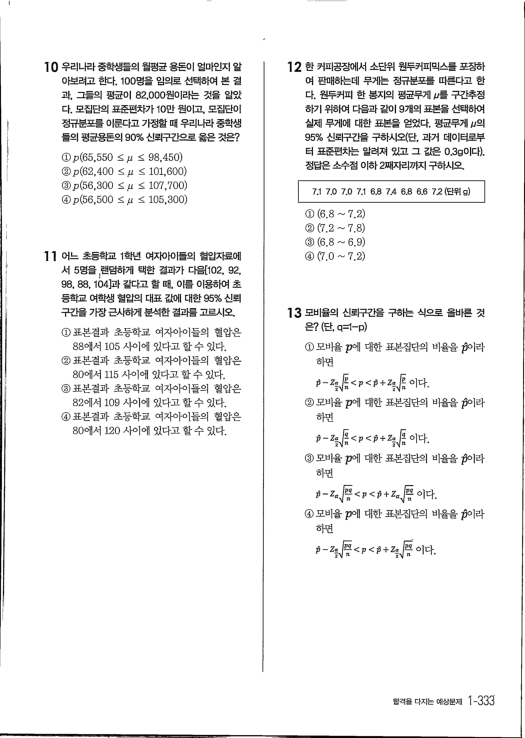
12 한 커피공징메서 소단위 원두커피믹스를 포징하 10 우리나라 중학생들의 월평균 용돈이 얼마인지 알 여 판매하는데 무게는 騙구분포를 따른다고 한 다 , 원두커피 한 봉지의 평균무게 〃를 구간추정 아보려고 한다 . 100명을 임의로 선택하여 본 결 과 , 그들의 평균이 82,000원이라는 것을 알았 다 . 모집단의 표준편차가 10만 원이고 , 모집단이 하기 위하여 다음과 같이 9개의 표본을 선택하여 실제 무게에 대한 표본을 얻었다 . 평균무게 〃의 95% 신뢰구간을 구하시오（단 , 과거 데이터로부 터 표준편차는 알려져 있고 그 값은 0.3g이다）.

정답은 소수점 이하 2째자리까지 구하시오． 정규분포를 이룬다고 가정할 때 우리나라 중학생 들의 평균용돈의 90% 신뢰구간으로 옳은 것은？ @p(65,550 二 LI 二 98,450) ② p(62,400 二 u ` 101,600) ③ p(56,300 二 u 二 107,700) @p(56,500 二 /2 二 105,300)

7. 1 7.0 7.0 7.1 6.8 7.4 6.8 6.6 7.2 (단위 g)
D (6.8 ' '7.2) ②(7.2 '- 7.8) ③(6.8 ∼6.9) @(7.0--7.2) 11 어느 초등학교 1학년 여자아이들의 혈압자료에 서 5명을 l랜덤하게 택한 결과가 ㄷ隱[102, 92, 98, 88. 104〕과 같다고 할 때 , 이를 이용하여 초 등학교 여학생 혈압의 대표 값에 대한 95% 신뢰 구간을 가장 근사하게 분석한 결과를 고르시오． 13 모비율의 신뢰구간을 구하는 식으로 올바른 것 은？ （단 , q1-p) ①표본결과 초등학교 여자아이들의 혈압은 88에서 105 사이에 있다고 할 수 있다． ②표본결과 초등학교 여자아이들의 혈압은 80에서 115 사이에 있다고 할 수 있다． ③표본결과 초등학교 여자아이들의 혈압은 82에서 109 사이에 있다고 할 수 있다． ④표본결과 초등학교 여자아이들의 혈압은 80에서 120 사이에 있다고 할 수 있다． ① 모비율 p에 대한 표본집단의 비율을 β이라 하면

## β - Zr疆 <「< 73+ Z뜻7흣 이다．
②모비율 p에 대한 표본집단의 비율을 β이라 하면

## 73-7뜰疆＜「＜73+ Za7qn 이다．
③ 모비율 p에 대한 표본집단의 비율을 β이라 하면 73-7.γ三죠，<p< 3 + zγ 이다． ④모비율 p에 대한 표본집단의 비율을 p이라 하면 73- z7i ＜「＜73+ zaγi이다．

> 합격을다지는예상문제 1-333
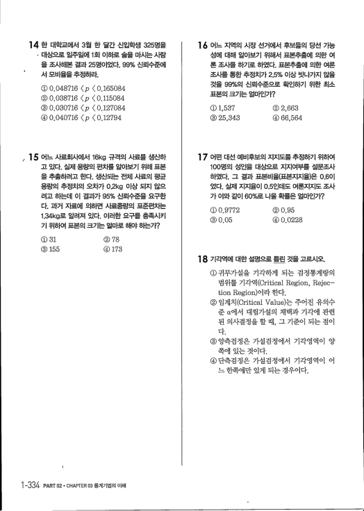
14 한 대학교에서 3뭘 한 달간 신입학생 325명을 . 대상으로 일주일에 1회 이하로 술을 마시는 사람 을 조사해본 결과 25명이었다 , 99% 신뢰수준에 서 모비율을 추정ㅎ빠 1 6 어느 지역의 시장 선거에서 후보들의 당선 가능 성에 대해 알아보기 위해서 표본추출에 의한 여 론 조사를 하기로 하였다 . 표본추출에 의한 여론 조사를 통한 추정치가 2.5% 이상 빗나가지 않을 것을 99％의 신뢰수준으로 확인하기 위한 최소 @ 0.048716 <p <0.165084 ②0.038716 <p <0.115084 ③0.030716 <p <0.127084 @ 0.040716 <p <0.12794 표본의 크기는 얼마인가？ @1,537 ③25,343 ②2,663 @ 66,564 17 어떤 대선 예비후보의 지지도를 추정하기 위하여 / 15 어느 사료회사에서 16kg 규격의 사료를 생신타 고 있다 . 실제 용량의 편차를 알아보기 위해 표본 을 추출하려고 한다 . 생산되는 전체 사료의 평균 100멍의 성인을 대상으로 지지여부를 설문조사 하였다 . 그 결과 표본비율《표본지지율：은 0.6이 었다 . 실제 지지율이 0.5인데도 여론지지도 조사 가 이와 같이 60% . 나올 확률은 얼마인가？ 용량의 추정치의 오차가 0.2kg 이상 되지 않으 려고 하는데 이 결과가 95% 신뢰수준을 요구한 다 . 과거 차료에 의하면 사료중량의 표준편차는 @0.9772 ② 0.95 c) 0.05 @0.0228

1. 34kg로 알려져 있다 . 이러한 요구를 拏；시키
기 위하여 표본의 크기는 얼마로 해야 하는가？ @31 ② 78 ③155 @173 18 기각역에 대한 설명으로 틀린 것을 고르시오． ①귀무가설을 기각하게 되는 검정통계량의 범위를 기각역（Critical Region, Rejec- tion Region）이라 한다． ② 임계치（Critical Value）는 주어진 유의수 준 α에서 대립가설의 채택과 기각에 관련 된 의사결정을 할 때 , 그 기준이 되는 점이 다． ③양측검정은 가설검정에서 기각영역이 양 쪽에 있는 것이다． ④단측검정은 가설검정에서 기각영역이 어 느 한쪽에만 있게 되는 경우이다 .

1 -334 PART 02. CHAPTER 03통계기법의이해

## -
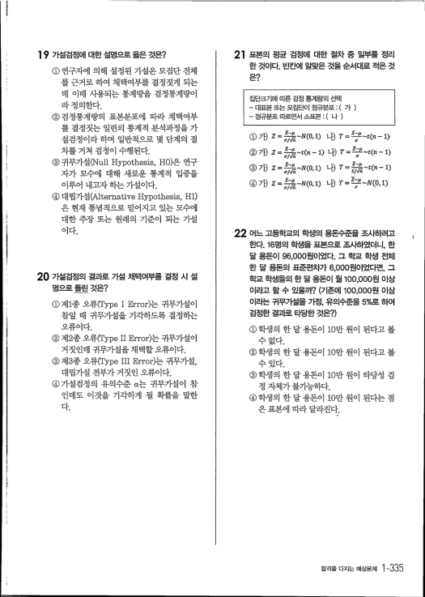
1 9 가설검정에 대한 설명으로 옳은 것은？ 21 표본의 평균 검정에 대한 절차 중 일부를 정리 한 것이다 . 빈칸에 알맞은 것을 순서대로 적은 것 ①） 연구자에 의해 설정된 가설은 모집단 전쳬 를 근거로 하여 채택여부를 결정짓게 되는 데 이때 사용되는 통계량을 검정통계량이 라 정의한다． ②검정통계량의 표본분포에 따라 채택여부 를 결정짓는 일련의 통계적 분석과정을 가 설검정이라 하며 일반적으로 몇 단계의 절 차를 거쳐 검정이 수행된다． ③귀무가설（Null Hypothesis, HO）은 연구 자가 모수에 대해 새로운 통계적 입증을 이루어 내고자 하는 가설이다 .

④대립가설（Alternative Hypothesis, Hi) 은 현재 통넘적으로 믿어지고 있는 모수에 대한 주장 또는 원래의 기준이 되는 가설 은？ 집단크기에 따른 검정 통계량의 선택

- 대표본 또는 모집단이 장규분포 : ( 가 ) 
- 장규분포 따르면서 소표본 : ( 나 )
①7f) Z= ---N(0」1)

#### ②7f) z= X-L∼ㅎ（n-1)
#### ③7f) Z 
- --'N(O,1) 
J7]-) Z= - --N(O,1) 이다눕． 22 어느 고등학교의 학생의 용돈수준을 조사하려고 한다 . 16멍의 학생을 표본으로조사하였더니 , 한 달 용돈이 96,000원이었다 . 그 학교 학생 전체 한 달 용돈의 표준편차가 6,000원이었다면 , 그 학교 학생들의 한 달 용돈이 뭘 100,000원 이상 이라고 할 수 있을까？ （기존에 100.000원 이상 이라는 귀무가설을 가정 , 유의수준을 5％로 하여 검정한 결과로 타당한 것은？) 20 가설검정의 결과로 가설 채택여부를 결정 시 설 명으로 틀린 것은？ ① 제i종 오류（中ype I Error）는 귀무가설이 참일 때 귀무가설을 기각하도록 결정하는

#### 오류이다． 
② 제2종 오류（rjype II Error）는 귀무가설이 거짓인데 귀무가설을 채택할 오류이다． ③ 제3종 오류（Type III Error）는 귀무가설， 대립가설 전부가 거짓인 오류이다． ④가설검정의 유의수준 α는 귀무가설이 참 인데도 이것을 기각하게 될 확률을 말한 ① 학생의 한 달 용돈이 to만 원이 된다고 볼 수 없다． ② 학생의 한 달 용돈이 to만 원이 된다고 볼 수 있다． ③학생의 한 달 용돈이 to만 원이 타당성 검 정 자쳬가 불가능하다． ④ 학생의 한 달 용돈이 10만 원이 된다는 점 은 표본에 따라 달라진다． 다．

> 니) T= 즈＝
，쓰-'t(n-1)

> 니：) T＝즈좋쓰∼t（孔－1)
### 니：) b묾∼t（九－1)
> 니) T=즈긋-N(O,1)
> 합격을다지는예상문제 1-335
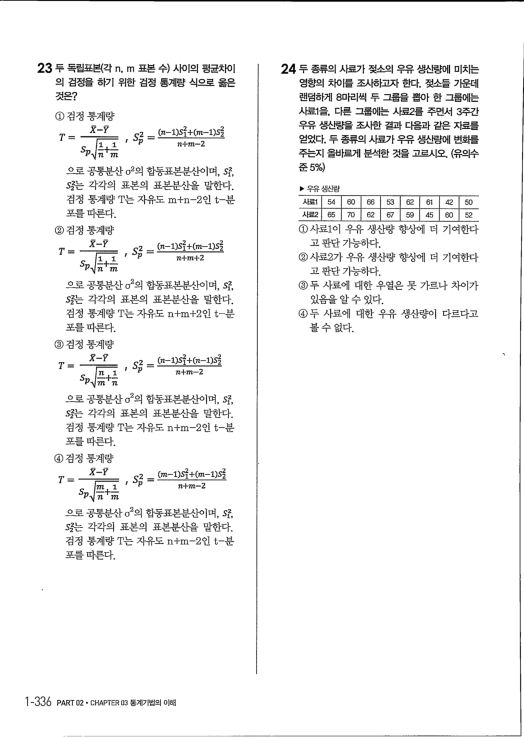
23 두 독립표본《각 n, m 표본 수） 사이의 평균차이 의 검정을 하기 위한 검정 통계량 식으로 옳은 24 두 종류의 사료가 젖소의 우유 생신턍에 미치는 영향의 차이를 조사하고차 한다 . 젖소들 가운데 것은？ 랜덤하게 8마리씩 두 그룹을 뽑아 한 그룹에는 사료I을 , 다른 그룹에는 사료2룰 주면서 3주간 우유 생신량을 조사한 결과 다음과 같은 차료를 얻었다 . 두 묽느의 사료가 우유 생스로盤에 변화를 쮸찌 올바르게 분석한 것을 고르시오 . （유의수 준5%)

## ① 검정 통계량 
T=  xZ- . s==(n-1)S孑+(m-1)S l ＊쟁 래 ' 』』 ㄲ ．ㄴㄲ댜－-7 씨1n m

#### 으로공통분산o2의 합동표본분산이며 , si, 
嶝는 각각의 표본의 표본분산을 말한다． 검정 통계량 T는 자유도 m+n-2인 t－분 포를 따른다．

* 우유 생산량
사료1 54 60 66 53 62 61 42 50 사료2 65 70 62 67 59 45 60 52 ①사료1이 우유 생산량 향상에 더 기여한다 고 판단 가능하다． ② 사료2가 우유 생산량 향상에 더 기여한다 고 판단 가능하다． ③ 두 사료에 대한 우열은 못 가르나 차이가 있음을 알 수 있다． ④두 사료에 대한 우유 생산량이 다르다고 볼 수 없다．

## ② 검정 통계량 
x-Y 7'＝볍 씨nT m = (n-1)S+ (m-1)S 7나m+2 으로공통분산（β의 합동표본분산이며 , Si2, s는 각각의 표본의 표본분산을 말한다． 검정 통계량 T는 자유도 n+m+2인 t－분 포를따른다．

### ③ 검정 통계량 
T= 셀－. , 2 I p= (n- 1)S+(n-1)S "4- ＄ㄲ l쑤＋스 r치7끄 끄 7나m-2 으로공통분산20의 합동표본분산이며 , 珊， s는 각각의 표본의 표본분산을 말한다． 검정 통계량 T는 자유도 n+m-2인 t－분 포를 따른다．

#### ④ 검정 통계량 
ㅜ－ x-Y c2 - (m-1)S춧+(m- 1)S

# '가차m4- 1
n. m ' " " ' n+m- 2 으로 공통분산 。2의 합동표본분산이며 , 5?, 嶝는 각각의 표본의 표본분산을 말한다． 검정 통계량 T는 자유도 n+m-2인 t－분 포를 따른다． 1 -336 PART 02. CHAPTER 03통계기법의이해

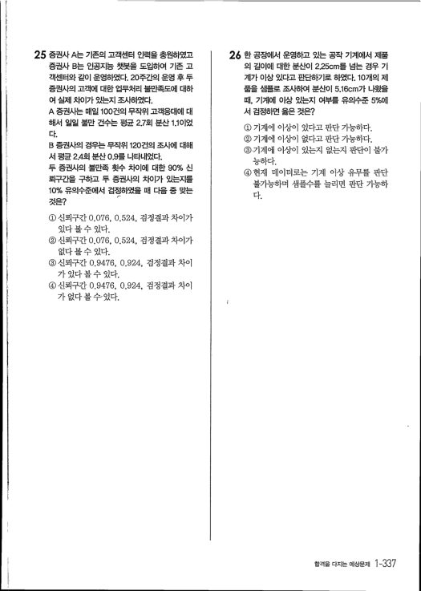
25 증권사 A는 기존의 고객센터 인력을 충원하였고 26 한 - l에서 운영하고 있는 공작 기계에서 제품 증권사 B는 인공지능 챗봇을 도입하01 기존 고 의 길이에 대한 분산이 225cm를 넘는 경우 기 계가 이상 있다고 판단하기로 하였다 . 10개의 제 품을 샘플로 조사하여 분산이 5.16cm가 나왔을 때 , 기계에 이상 있는지 여부를 유의수준 5％에 서 검정하면 옳은 것은？ 객센터와 같이 운영하였다 , 20주간의 운영 후 두 증권사의 고객에 대한 업무처리 불만족도에 대하 여 실제 차이가 있는지 조사하였다． A 증권사는 매일 100건의 무작위 고객응대에 대 해서 일일 불만 건수는 평균 2.7회 분산 1.1이었 ① 기계에 이상이 있다고 판단 가능하다． ② 기계에 이상이 없다고 판단 가능하다． ③기계에 이상이 있는지 없는지 판단이 불가 다． B 증권사의 경우는 무작위 120건의 조사에 대해 서 평균 2.4회 분산 0.9를 나타내었다． 두 증권사의 불만족 횟수 차이에 대한 90% 신 능하다． ④현재 데이터로는 기계 이상 요 무를 판단 뢰구간을 구하고 두 증권사의 차이가 있는지를 10% 유의수준에서 검정하였을 때 다음 중 맞는 불가능하며 샘플수를 늘리면 판단 가능하 다． 것은？ r ①신뢰구간0.076, 0.524 , 검정결과차이가 있다 볼 수 있다． ②신뢰구간0.076, 0.524 , 검정결과차이가 없다 볼 수 있다． ③신뢰구간 0.9476, 0.924 , 검정결과 차이 가 있다 볼 수 있다． ④신뢰구간 0.9476, 0.924 , 검정결과 차이 가 없다 볼 수7있다．

> 합격을다지는예상문제 1-337
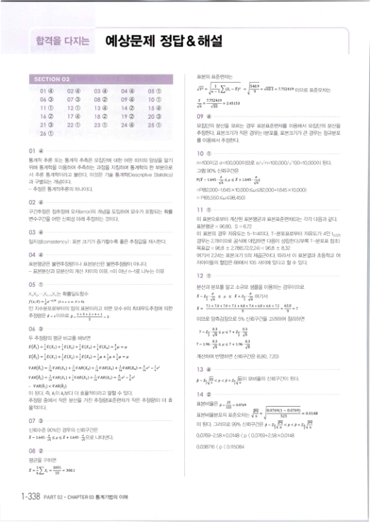
## 예상문제 정답＆해설
#### 합격을 「LT!L
표본의 표준편차는 SECTION 02

#### 莎：l嵩Z에－谷＝j
9 .痂= 7.752419.  .표준以階 0l ④ 02 ④ 03 ④ 04 ④ 05 ① 06 ③ 07 ③ 08 ② 09 ④ 10D il (j:) 12 ① 13 ④ 14 ② 15 ④ S

7. 752419 
2. 45153
16 ② 17 ④ 18 ② 19 ② 20 c) 09 ④ → …………………… ………… 」……一……… 21 ③ 22 ① 23 （〕 ：> 24 ④ 25 ① 모집단의 분산을 모르는 경우 표본표준편차를 이용해서 모집단의 분산을 추정한다. 표본크기가 작은 경우는 t분포를. 표본크기가큰 강우는 장규분포 를 이용해서 추정한다． 26 《j:) 01 饉） lO ① ………………………………………………………………… 통계적 추론 또는 통계적 추측은 모집단에 대한 어떤 미지의 양상을 알기 위해 통계학을 이용하여 추측하는 고l膽 지칭하며 통계학의 한 부분으로 서 추론 통계학이라고 불린다. 이것은 기술 통계학（Descriptive StatisVcs) 과 구별돠는 개념이다． 추정은 통계적추론의 하나이다． n=100이고 α=100.000이므로 《y/v"n=lOO.OOO/7100=10.000이 된다． 그럼 90% 신롸구간은

#### P(X - 1.645 " 읊 5 p CX+ 1,645·뚫）
=P(82.000-1.645x10.000`I」二82,000+1.64.5x10,000) = P(65,550`．」｀98,450) 02 C) → … ……………－……………………………… ……」 11 (j:) ....... .... .. ..... ........................... ....... ... .. ..... .... .. ... ....................... .... ... .

구간추정은 점추정에 오차（error）의 개념을 도입하여 모수가 포함되는 확률 이 표본으로부터 계산된 표본평균과 표본표준편채S》는 각각 다음과 같다． 표본평균＝96.80. S = 6.72 이 표본의 경우 차유도는 ㅐ색이다. T겯포표로부터 자유도가 4인 too25 변수구간을 어떤 신뢰성 아래 추정하는 것이다． 03 ④ …∼ …………………………………………一…………一……………4………∼… 경우는 2.78이므로 공식에 대입하면 다음이 성립한다．（부록 T분포표 참조） 옥표값 = 96.8 크＝ 278(6.72尸24) = 96.8 士 8.32 일치성（consistency) : 표본 크기가 중가할수록 좋은 추정값을 제시한다， 04 ④ ………… ……………………… 여기서 2.24는 표본크기 5의 저居근이다 . 따라서 이 표본결과 초등학교 여 차아이들의 혈압은 88에서 105 사이에 있다고 할 수 있다． 표본평균은 불편추정량이나 표본분산은 불편추정량이 0삐다 표본분산과 모분산의 계산 차이의 이유 . n이 0H크 ㅏ1로 나누는 이유 12 ① 05 《j:) 분산과 분포를 알고 쑈늬구모 샘플을 이용하는 경우이므로 x1)<2, " ··) `)，는 확률밀도함수 ￡－z뜻 " 쓿 ' 〃 ' ￡1zr옳여기서 /(xJ) 국r ' /.(O< < , 0>0) 인 자수분포로부터의 임의 표본이라고 하면 모수 e의 최대우도추정에 의한 추정량은〃＝！이므로a」 ' 5 ' ; ' * ' 1 ` 1 + 7,0+ 7.0+ 7,1+ 60+ 7.4+ 6.8+ 6.6+ 7.2

63. 0
5- 9 9 7 이므로 양측검정으로 5% 신뢰구간을 고려하여 정리하면 06 （軫 … ∼ ………………………………… ……

#### 7-z뜰．꼲‘8!7+ z뜻·튜 
7_1.96.2! ,'7* 1.96.2!

두 추정량의 평균 비교를 해보면 E(O1) 국E(X1) + E(X2) +츨E(X3) +즐￡（Z') 국〃 뼙 〃 E(02) = E(X1) +즐 E(X2) +츨 E(X3) =즐 o+숯〃 +즐〃 = p 계산하여 반영하면 신뢰구간은 (6.80, 7.20) ＇」〃（히） ＝슈洲〃（x,) ＋슈VAR(X1) +슈〃뀨（x활）＋슈VAR(X4) =흖00 국군 13 ④ ……∼… …… … vAR(02) 皿슈γ거〃（x,)＋즐VAR(X2) +슈VAR(X3）볍옳00 =군 β- z뜻丹 p <0 + Z뜻Ji,0모비율의 신뢰구긴삐 된다． ．·．VAR( t) < VAR(.2) 이 된다. 즉 . 히이 ｀보다 더 효율적이라고 말할 수 있다． 14 ② 추정량 쥠게서 직은 분산을 가진 추정량（표준편차가 작은 추정량）이 더 효

```python
重LJ: = = 0.0769:10. 0769
(1 - 0.0769)
325 =。.。148
```
율적이다 .

07 c) …………………6…………………… 이 된다· 그러므로99％신뢰구간은β-z눼晉< p <β +z뜯樗 신뢰수준 90％인 경우의 신뢰구간은 〃- 1.645 " 쓿‘ p ` X + 1.645·쓿으로 나타낸다．

0. 0769-Z58x0.0148 (p (0.0769+a58x0.0148
0. 038716 (p (0.115084
08 ② …… ……… 평균을 구하면 x쑈，>；차큭쑤= 300.1 1 -338 PART 02. CHAPTER 03통계기법의이해

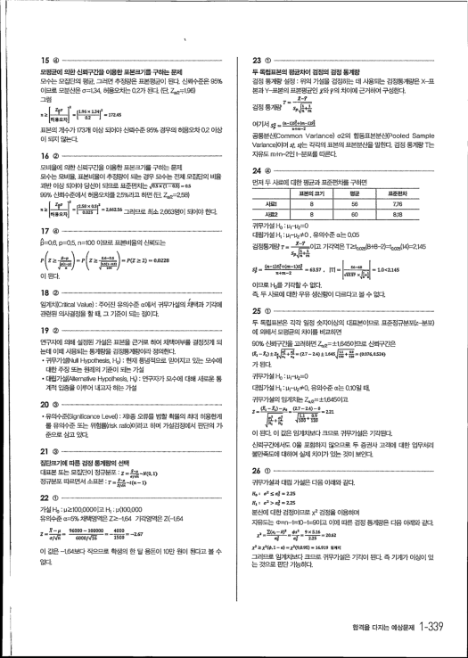
15 ④ －·．…－0…－0……∼……………………………－…－-－····＂－·－········· 23 (j:) ................................................................................

모평균에 의한 신뢰구간을 이용한 표본크기를 구하는 문제 모수는 모집단의 펑균, 그러면 추정량은 표본평균0j 된다. 신뢰수준은 95% 이므로모분산은 7r1,34. 허용오차는 0.2가 된다． （단． Zβ 7l.96) 그럼 두 독립표본의 평균차0I 검정의 검정 통계량 검정 통계량 설정 : 위의 가설을 검정하는 데 사용되는 검정통계량은 ×－표 본과V－표본의 표본평균인 x와y의 차이에 근거하여 구성한다． z-7 검정통계량 ' -sp 172 . 45 여기서s2' ( " 瑋n,-2 공통분스i(Common Variance) o2의 합동표본분신(Pㅇ이ed Sam이e Variance）이며 돠, 珊는 각각의 표본의 표본분산을 말한다. 검정 통계량ㅜ는 자유도 m卄，-2오끄분포를 따른다． 표본의 개수가 173개 이상 되어야 신뢰수준 95% 경우의 허용오차 02 이상 이 되지 않는다． 16 ② ................................................................................ ∥…∼…∼－--- 모비읠게 의한 신뢰구간을 이용한 표본크기를 구하는 문제 모수는 모비율. 표본비율이 추정량이 되는 경우 모수는 전체 모집단의 비율 과반 이상 되어야 당선이 되므로 표준편차는 70.5 x (1- 0.5j블 0.5 24 ④ ................................................................................

먼저 두 사료에 대한 평균과 표준편차를 구하면 99% 신뢰수준에서 허용오차를 2.5％라고 하면 （단, zβ=a58) 표본의크기 평균 겸 際뿜ㄱ ' 2,662.56그러므로최소z663명이되어야흰빠． 사료1 8 56

7. 76
사료2 8 60

8. 18
```python
귀무가설 H0 : 니렐2=0 
대립가에 ` : p1-p2쑤O , 유의수준α는0.05 
∼＇ㅜ』．볍∼∥히 
p_v .-l---l- .u--l,-' -` . 
-^ . ', ^ - 
검정통계량T 
」＝7=4－이고기긱뼘은T스loca(8f8-2)=to,
```
17 ④ ............................................-................................................

습=0.6, p=0,5, n=100 이므로표본비율의 신뢰도는

### P(Z2 .5=)=P(Zaf 5)...P(Za2)=0.0228
S니云悅 .2- (n-1)S+(m-1)S -'p - 6lSi. 眈I= fl+m-2 " ' 50-60

1. 0<2,145
《기된다． 이므로 .를기각할수없다． 즉. 두 사료에 대한 우유 생산량이 다르다고 볼 수 없다． 18 ② ........................................................................................................................................

임계치（Critical Value) : 주어진 유의수준 α에서 귀무가설의 채택과 기각에 관련된 의사결정을 할 때 . 그 기준이 되는 점이다． 25 0 ....................................................∼…∼·．··…··..

두 독립표본은 각각 일정 숫자이상의 대표본이므로 표준정규분포（z분포） 19 ② ........................................................................................................................................

0ㅔ 의해서 모평균의 채기를 비교하면 연구자에 의해 설정된 가설은 표본을 근거로 하여 채택여부를 결정짓게 되 는데 이때 사용되는 통계량을 검정통계량이라 정의한다．

- 귀무가설（N메 Hypothesis. H。) ; 현재 통념적으로 믿어지고 있는 모수에 
대한주장또는 원래의 기준이 되는 가설

- 대립가설（Alternative Hypothesis, 비） : 연구자가 모수에 대해 새로운 통 
계적 입증을 이루어 내고자 하는 가설 90％신뢰구간을고려하면 긱ㅈ(2＝土1,645이므로 신뢰구간은 t2 -i,)土z늦7乙麗 = (2.7-2.4）소1.640,不蔡 (0.076.0.524) 가된다． 귀무가獸 . : p`－힐2=o 대립가설 H1 : pi-＇』2쑤0 , 유의수준 α는 0.10일 때．

#### 귀무가설의 임계치는乙，,＝士1.645이고 
z구치：＝쓰ㅍ〃. (2.쑈쯔느. z.2l 癖1츳 儡 ' 揚 20 （軫 ........................................................................................................................................

- 유의수죔Signiticance Level) : 제1종 오류를 범할 확률의 최대 허용한계 
를 유의수춘 또는 위험률《risk ratio）이라고 하며 가설검정에서 판단의 기， 준으로 삼고 있다． 이 된다. 이 값은 임계치보다 크므로 귀무가설은 기각된다． 신뢰구간에서도 0을 포함하지 않으므로 두 증권사 고객에 대한 업무처리 불만족도에 대하여 실제 차이가 있는 것이 보인다． 21 ③ ....................................................................

집단크기에 따른 검정 통겨l량의 선택 대표본또는모집단이 정규분포： z =쓺-N(0,1) 정규분포 따르면서 소표본：r=恭-t(oo'-1) 귀무가설과 대립 가설은 다음 0Hㅐ와 괩각． '。

22 《j:) .................................................................................'---'-" ··∥＂－·뻐 〃l 험 α2 >a= 2.26 가설 H0 : ij논100.000이고 H1 的00.000 유의수준α=5％채택영역은Z之-1.64 기각영역은z수1.64 분산에 대한 검정이므로 x2 검정을 이용하며

### 자유도는 ㅇ=n-1=10-1=9이고 이에 따른 검정 통계량은 다음 아래와 같다． 
: ' ＝즈뜻止 譬 9x5.16 20.62 z＝쯔＝＝르＝96000 -1뜨000 4므므.

' ' ' 7rii 6000jVi8 1500 ' " z2 논 x잿쑤,1 - o) -f (9,0.90) = 16,919 임계지 이 값은 -1.64보다 작으므로 학생의 한 달 용돈이 10만 원이 된다고 볼 수 그러므로 임계치보다 크므로 귀무가설은 기각이 된다. 즉 기계가 이상이 있 는 것으로 판단 가능하다． 없다．

> (14)=a145
> 합격을다지는예상문제 1-339

# PART 03
# 빅데이터 모델링
파트 소개 3과목은 분석 모형과 각종 분석기법에 대해 공부합니다 . 시험에 폭넓게 출제될 것으로 예상되는 내용들을 다수 포함하고 있으며 어떻게 공부하는가에 따라 체 감 난이도는 크게 달라질 수 있습니다 . 정확한 개념을 이해하면서 분석기법들에 어떤 차이가 있는지 확인하는 것이 필요합니다．

#### 】