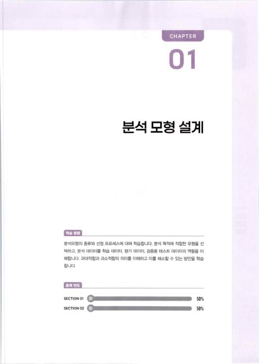
# CHAPTER 
01

# 분석 모형 설계
분석모형의 종류와 선정 프퇘스에 대해 학습합니다 . 분석 목적0ㅔ 적합한 모형을 선 택하고 , 분석 데이터를 학습 데이터 , 평가 데이터 . 검증용 테스트 데이터의 역할을 이 해합니다． 과대적합과 과소적합의 의미를 이해하고 이를 해소할 수 있는 방안을 학습 합니다 출제 빈도 SECTION 01 SECTION 02

> 騶％
> 邪％
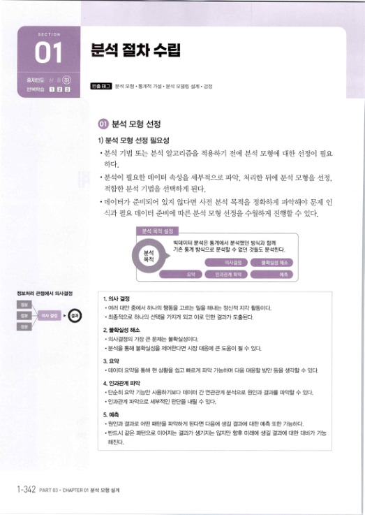
# 분석 절차 수립II
출제빈도 @) 빈출 Eㅐ그 분석 모형 · 통계적 가설 · 분석 모델링 설계 · 검정 반복학습 ［· .

.

분석 모형 선정 1) 분석 모형 선정 필요성

- 분석 기법 또는 분석 알고리즘을 적용하기 전에 분적 모형에 대한 선정이 필요
하다．

- 분석이 필요한 데이터 속성을 세부적으로 파악 , 처리한 뒤에 분석 모형을 선정，
적합한 분석 기법을 선택하게 된다．

- 데이터가 준비되어 있지 않다면 사전 분석 목적을 정확하게 파악해야 문제 인
식과 필요 데이터 준비에 따른 분석 모형 선정을 수월하게 진행할 수 있다． 빅데이터 분석은 통계에서 분석했던 방식과 함께 기존 통계 방식으로 분석할 수 없던 것들도 분석한다．

# 정보처리 관점에서 의사결정 
,e 1 . 의사 결정

- 여러 대안 쥠게서 하나의 행동을 고르는 일을 해내는 정신적 지각 활동이다．
- 최종적으로 하나의 선택을 가지게 돠고 이로 인한 결과가 도출된다．
2 . 블확실성 히l소

- 의사결정의 가장 큰 문저는 불확실성이다．
- 분석을 통해 불확실성을 제어한다면 시장 대응에 큰 도움이 될 수 있다．
3．요약

- 데이터 요약을 통해 현 상황을 쉽고 빠르게 파악 가능하며 다음 대응할 방안 등을 생각할 수 있다．
4 . 인과관계 파악

- 단순히 요약 기능만 사용하기보다 데이터 간 연관관계 분석으로 원인과 결과를 파악할 수 있다．
- 인과관계 파악으로 서際적인 판단을 내릴 수 있다．
5. 예측
- 원인과 결과로 어떤 패턴을 파악하게 된다면 다음께 생길 결과에 대한 예측 또한 가능하다．
- 반드시 같은 패턴으로 이어ㅈ는 결과가 생기ㅈ彪 않지만 향후 미래에 생길 결과에 대한 대비가 가능
해진다． 1 -342 PART 03 . CHAPTER 01 분석 모형 설계

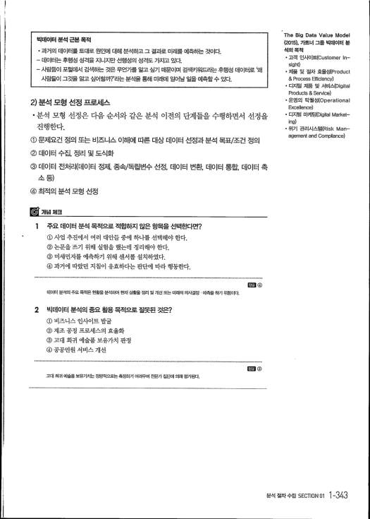
빅데이터 분석 근본 목적

- 과거의 데이터를 토대로 원인에 대해 분석하고 그 결과로 미래를 예측하는 것이다．
- 데이터는 후행성 성격을 지니지만 선행성의 성격도 가지고 있다．
- 사람들이 포털에서 검색하는 것은 무언가를 알고 싶기 때문이며 검색키워드라는 후행성 데이터로 오ㅐ
사람들이 그것을 알고 싶어할까？ ' 라는 분석을 통해 미래에 일어날 일을 예측할 수 있다． 2) 분석 모형 선정 覡쎄스

- 분석 모형 선정은 다음 순서와 같은 분석 이전의 단계들을 수행하면서 선정을
진행한다． ① 문제요건 정의 또는 비즈니스 이해에 따른 대상 데이터 선정과 분석 목표／초건 정의 ② 데이터 수집 , 정리 및 도식화 ③ 데이터 전처리（데이터 정제 , 종속／독립변수 선정 , 데이터 변환, 데이터 통합, 데이터 축 소등） ④ 최적의 분석 모형 선정 1 주요 데이터 분석 목적으로 적합하지 않은 항목을 선택한다면？ ① 사업 추진에서 여러 대안들 중에 하나를 선택해야 한다． ② 논문을 쓰기 위해 실험을 했는데 정리해야 한다． ③ 미세먼지를 예측하기 위해 센서를 설치하였다． ④ 과거에 따랐던 지침이 유효하다는 판단에 따라 행동한다． ㅁ래 ④ 데이터 분석의 주요 목적온 현황을분석하여 현재 상황을 정리 및 개선 또는 미래의 의사결정 」 예측을 하기 위함이다． 2 빅데이터 분석의 중요 활용 목적으로 잘못된 것은？ ① 비즈니스 인사이트 발굴 ② 제조 공정 프로세스의 효율화 ③ 고대 희귀 예술품 보유가치 판정 ④ 공공민원 서비스 개선 ㅁn ③ 고대 희귀 예媚 보유가치는 정량적으로는측정하기 어려우며 전문가 집단에 의해 펑가된다．

> The Big Data Value Model 
(2015) , 가트너 그룹 빅데이터 분 석의 목적

- 고객 인사이트（Customer ri-
sight)

- 처隱 및 절차 효율성（Product 
& Process Efficiency)

- 디지털 처曆 및 서비스（Digital 
Products & Service)

- 운영의 탁월성（Operational 
Excellence)

- 디지털 마케팅（Digital Market-
i np)

- 위기 관리시스템（Risk Man-
agement and Compliance)

> 분석절차수립 SECTION 01 1 -343
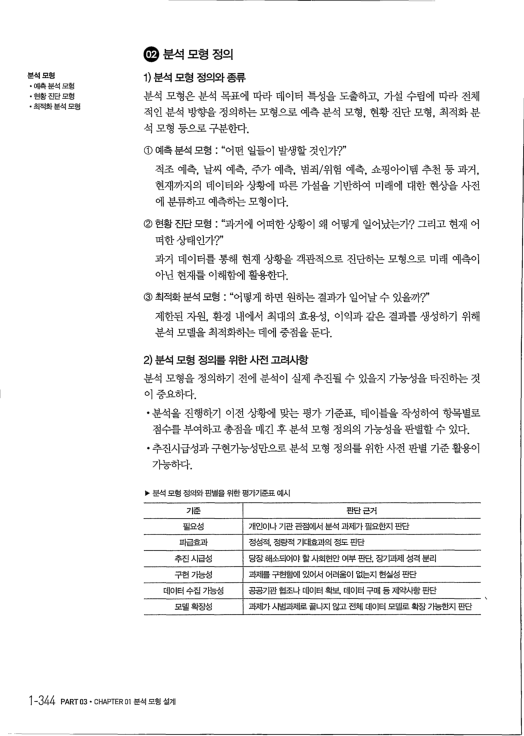
.

분석 모형 정의 분석 모형

- 예측 분석 모형 
- 현황 진단 모형 
- 최적화 분석 모형
1) 분석 모형 정의와 종류

#### 분석 모형은 분석 목표에 따라 데이터 특정을 도출하고 , 가설 수립에 따라 전쳬
#### 적인 분석 방향을 정의하는모형으로 예측분석 모형 , 현황 진단 모형 , 최적화분
석 모형 등으로 구분한다． ① 예측분석 모형 : " 어떤 일들이 발생할 것인가？"

#### 적조 예측 , 날씨 예측 , 주가 예측 , 범죄／위험 예측 , 쇼핑아이템 추천 등 과거，
현재까지의 데이터와 상황에 따른 가설을 기반하여 미래에 대한 현상을 사전 에 분류하고 예측하는 모형이다． ② 현황진단모형 : " 과거에 어떠한상황이 왜 어떻게 일어났는가？ 그리고 현재 어 떠한상태인가？" 과거 데이터를 통해 현재 상황을 객관적으로 진단하는 모형으로 미래 예측이 아닌 현재를 이해함에 활용한다 .

③ 최적화 분석 모형 : " 어떻게 하면 원하는 결과가 일어날 수 있을까？ "

#### 제한된 자원 , 환경 내에서 최대의 효용정 , 이익과 같은 결과를 생성하기 위해
분석 모델을 최적화하는 데에 중점을 둔다． 2) 분석 모형 정의를 위한 사전 고려사항 분석 모형을 정의하기 전에 분석이 실제 추진될 수 있을지 가능성을 타진하는 것 이중요하다．

- 분석을 진행하．기 이전 상황에 맞는 평가 기준표 , 테이블을 작성하여 항목별로
점수를 부여하고 총점을 매긴 후 분석 모형 정의의 가능성을 판별할 수 있다．

- 추진시급성과 구현가능성만으로 분석 모형 정의를 위한 사전 판별 기준 활용이
가능하다． 》 분석 모형 정의와 판별을 위한 평가기준표 예시 기준 판단근거 필요성 개인이나 기관 관점에서 분석 과제가 필요한지 판단 파급효과 정성적 , 정량적 기대효과의 정도 판단 추진 시급성 당장 해소되어야 할 사회현안 여부 판단, 장기과제 성격 분리 구현 가능셩 과제를 구현함에 있어서 어려움이 없는지 헌실성 판단 데이터 수집 가능셩 귓｝기관 협조나 데이터 확보， 데이터 구매 등 제약사항 판단 모델 확장성 과제가 시범과저扈 끝나지 않고 전체 데이터 모델로 확장 가능한지 판단 1 -344 PART 03* CHAPTER 01분석모형설계

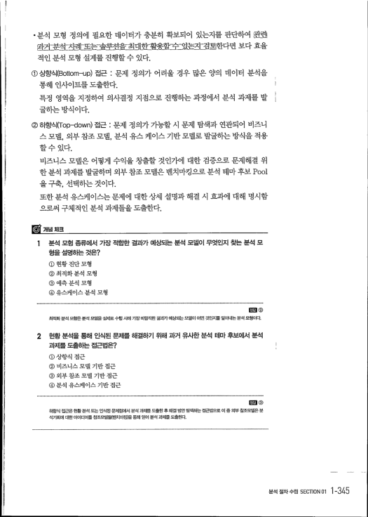
- 분석 모형 정의에 필요한 데이터가 충분히 확보되어 있는지를 판단하여 관勵
든拷豈점E최：려L도논솔룻션을긔．대；甦활ㅌ용촬E仝ㅍ있는최ㅍ검呈한다면 보다 효율 적인 분적 모형 설계를 진행할 수 있다．

#### ① 상향식（Bottom-up) 접근 : 문제 정의가 어려울 경우 많은 양의 데이터 분적을
통해 인사이트를 도출한다． 특정 영역을 지정하여 의사결정 지점으로 진행하는 과정에서 분석 과제를 발 굴하는 방식이다． ② 하향식（Top-down) 접근 : 문제 정의가 가능할 시 문제 탐색과 연관되어 비즈니 스모델 , 외부참조모델 , 분석 유스 케이스 기반모델로 발굴하는방식을 적용 할 수 있다． 비즈니스 모델은 어떻게 수익을 창출할 것인가에 대한 검증으로 문제해결 위 한 분석 과제를 발굴하며 외부 참조 모델은 벤치마킹으로 분석 데마 후보 Pool 을구축 , 선택하는것이다． 또한 분석 유스케이스는 문제에 대한 상세 설명과 해결 시 효과에 대해 명시함 으로써 구쳬적인 분석 과제들을 도출한다． 1 분석 모형 종류에서 가장 적합한 결과가 예상되는 분석 모델이 무엇인지 찾는 분석 모 형을 설명하는 것은？ ① 현황 진단 모형 ② 최적화 분석 모형 ③ 예측 분석 모형 ④ 유스케이스 분석 모형 최적화 분석 모형은 분석 모델을 실저扈 수행 시에 가장 바람직한 결과가 《계상되는 모델이 어떤 것인자를 알아내는 분석 모형이다． 2 헌황 분석을 통해 인식된 문제를 해결하기 위해 과거 유사한 분석 테마 후보에서 분석 과제를 도출하는 접근법은？ ① 상향식 접근 ② 비즈니스 모델 기반 접근 ③ 외부 참조 모델 기반 접근 ④ 분석 유스케이스 기반 접근 하향식 접근은 현황분석 또는 인식된 문제점에서 분석 과저曆 도출한후 해결 방안 탐색하는 접근법으로 이 중 외부 참조모델은 분 석기회에 대한 아이디어를 참조모델들《벤치마킹）을 통해 얻어 분석 과제률도출한다．

> El
> ㅁn ③
> 분석절차수립 SECTION 01 1 -345
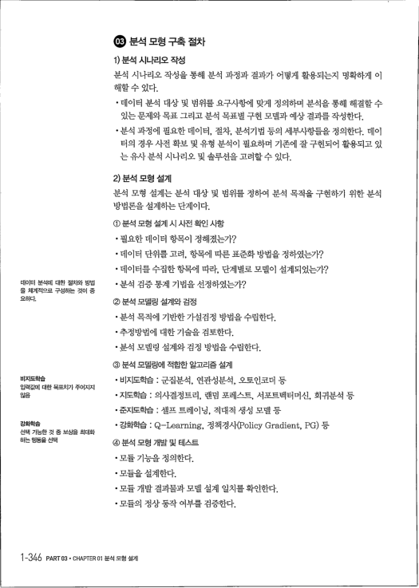
#### ㅇ 분석 모형 구축 절차
1) 분석 시나리오 작성 분석 시나리오 작성을 통해 분석 과정과 결과가 어떻게 활용되는지 명확하게 이 해할 수 있다．

- 데이터 분석 대상 및 범위를 요구사항에 맞게 정의하며 분석을 통해 해결할 수 
있는 문제와 목표 그리고 분석 목표별 구현 모델과 예상 결과를 작성한다．

#### · 분석 과정에 필요한 데이터 , 절차 , 분석기법 등의 세부사항들을 정의한다 . 데이
터의 경우 사전 확보 및 유형 분석이 필요하며 기존에 잘 구현되어 활용되고 있 는 유사 분석 시나리오 및 솔루션을 고려할 수 있다． 2) 분석 모형 설계 분적 모형 설계는 분석 대상 및 범위를 정하여 분석 목적을 구현하기 위한 분석 방법론을 설계하는 단계이다． ① 분석 모형 설계 시 사전 확인 사항

- 필요한 데이터 항목이 정해졌는가？
- 데이터 단위를 고려 , 항목에 따른 표준화 방법을 정하였는가？
- 데이터를 수집한 항목에 따라, 단계별로 모델이 설계되었는가？
- 분석 검증 통계 기법을 선정하였는가？
데이터 분석에 대한 절차와 방법 을 체계적으로 구성하는 것이 중 요하다． ② 분석 모델링 설계와 검정

- 분석 목적에 기반한 가설검정 방법을 수립한다．
- 추정방법에 대한 기술을 검토한다．
- 분석 모델링 설계와 검정 방법을 수립한다．
③ 분석 모델링에 적합한 알고리즘 설계

- 비지도학습 : 군집분석 , 연관성분석 , 오토인코더 등
비지도학습 입력값에 대한 목표치가 주어지지 않음

- 지도학습 : 의사결정트리 , 랜덤 포레스트 , 서포트벡터머신 , 회귀분적 등
#### · 준지도학습 : 셀프 트레이닝 , 적대적 생성 모델 등
#### · 강화학습 : Q-Learning , 정책경사（Policy Gradient, PG) 등
강화학습 선택 가능한 것 중 보상을 최대화 하는 행동을 선택 ④ 분석 모형 개발 및 테스트

- 모듈 기능을 정의한다．
- 모듈을 설계한다．
- 모듈 개발 결과물과 모델 설계 일치를 확인한다．
- 모듈의 정상 동작 여부를 검증한다．
1-346 PART 03 . CHAPTER 01 분석모형 설계

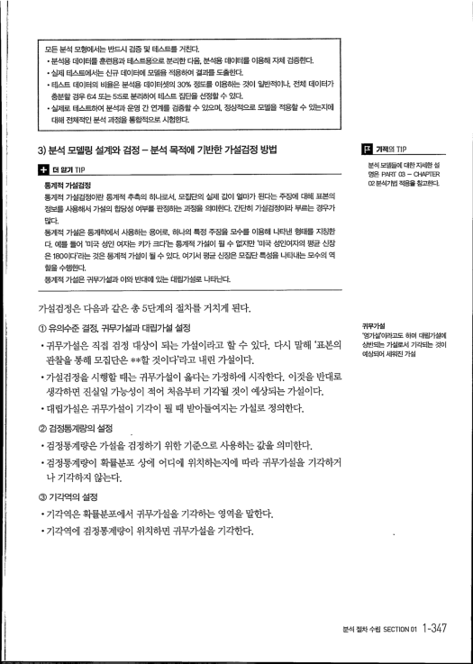
모든 분석 모형에서는 반드시 검증 및 테스트를 거친다．

- 분석용 데이터를 훈련용과 테스트용으로 분리한 다음, 분석용 데이터를 이용해 차체 검증한다．
- 실제 테스트에서는 신규 데이터에 모델을 작용하여 결과를 도출힌다．
- 테스트 데이터의 비율은 분석용 데이터셋의 30% 정도를 이용하는 것이 일반적이나, 전체 데이터가
충분할 경우 64 또는 55로 분리하여 테스트 집단을 선정할 수 있다．

- 실저扈 테스트하여 분석과 운영 간 연계를 검증할 수 있으며 . 정상적으로 모델을 적용할 수 있는지에
대해 전체적인 분석 과정을 통합적으로 시험힌F.

3) 분석 모델링 설계와 검정 - 분석 목적에 기반한 가설검정 방법 .

더 말기 지p 통계적 가설검정 통계적 가설검정이란 통계적 추측의 하나로서 . 모집단의 실제 값이 얼마가 된다는 주장에 대해 표본의 정보를 사용해서 가설의 館성 여부를 판정하는 과정을 의미한다 . 간단히 가설검정이라 부르는 경우가 많다． 통계적 가설은 통계학에서 사용하는 용어로， 하나의 특정 주장을 모수를 이용해 나타낸 형태를 지칭한 다 . 예를 들어 ' 미국 성인 여자는 키가 크다'는 통계적 가설이 될 수 없지만 ' 미국 셩인여자의 평균 신장 은 180이다'라는 것은 통계적 가설이 될 수 있다 . 여기서 펑균 신장은 모집단특성을 나타내는 모수의 역 할을수행한다.

통계적 가설은 귀무가설과 이와 반대에 있는 대립가설로 나타난다． 가설검정은 다음과 같은 총 5단계의 절차를 거치게 된다． ① 유의수준 결정 , 귀무가설과 대립가설 설정

#### · 귀무가설은 직접 검정 대상이 되는 가설이라고 할 수 있다 . 다시 말해 ' 표본의
관찰을 통해 모집단은 *＊할 것이다’라고 내린 가설이다．

- 가설검정을 시행할 때는 귀무가설이 옳다는 가정하에 시작한다 . 이것을 반대로
생각하면 진실일 가능성이 적어 처음부터 기각될 것이 예상되는 가설이다．

- 대립가설은 귀무가설이 기각이 될 때 받마들여지는 가설로 정의한다．
② 검정통계량의 설정

- 검정통계량은 가설을 검정하기 위한 기준으로 사용하는 값을 의미한다．
- 검정통계량이 확률분포 상에 어디에 위치하는지에 따라 귀무가설을 기각하거
#### 나 기각하지 않는다 .
③ 기각역의 설정

#### · 기각역은 확률분포에서 귀무가설을 기각하는 영 역을 말한다 .
- 기각역에 검정통계량이 위치하면 귀무가설을 기각한다．
> .
기적의 ㄲp

> 분석 모델들《거l 대한차세한 설 
駱 RAT cX3 - 아t略玎ER 02분석기법 적용을침고한다．

> 귀무가설 
‘영가설 ' 이라고도 하며 대립가설에 상반되는 가설로서 기각되는 것이 예상되어 세워진 가설

> 분석절차수립 SECTION 01 1 -347
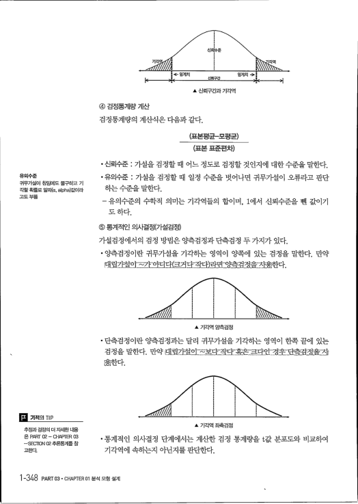
▲ 신뢰구간과 기각역 ④ 검정통계량 계산 검정통계량의 계산식은 다음과 같다． （표본평균－모평균） （표본 표준편차）

- 신뢰수준 : 가설을 검정할 때 어느 정도로 검정할 것인지에 대한 수준을 말한다．
- 유의수준 : 가설을 검정할 때 일정 수준을 벗어나면 귀무가설이 오류라고 판단 
하는 수준을 말한다． 유의수준 귀무가설이 참임에도 불구하고 기 각할확률로 알ㅍKa. $\alpha$）값이라 고도부름

#### - 유의수준의 수학적 의미는 기각역들의 합이며 , 1에서 신뢰수준을 뺀 값이기 
도 하다． ⑤ 통계적인 의사결정（가설검정） 가설검정에서의 검정 방법은 양측검정과 단측검정 두 가지가 있다．

- 양측검정이란 귀무가설을 기각하는 영역이 양쪽에 있는 검정을 말한다 . 만약
대립Z臘의즈가＝ㅇ쪄다(2:거꽈콰듸ㅇ다뾰E양측：겪쮸）을지：瓮한다． ▲ 기각역 양측검정

#### · 단측검정이란 양측검정과는 달리 귀무가설을 기각하는 영역이 한쪽 끝에 있는 
검정을 말한다 . 만약 다림가점이∼보：다，작다午완크다힌＝켱＝우r단측검“정을최士 용한다． 【헴 기적의 ㄲp ▲ 기각역 좌측검정 추정과 검정의 더 차세한 내용 은 PRF 02 - a-LAp1B귓 a3

- "sㅌ〕Tr 02 추론통겨隱 참
- 통계적인 의사결정 단계에서는 계산한 검정 통계량을 t값 분포도와 비교하여
기각역에 속하는지 아닌지를 판단한다． 고한다． 1 -348 PART 03 . CHAPTER 01 분석 모형 설계

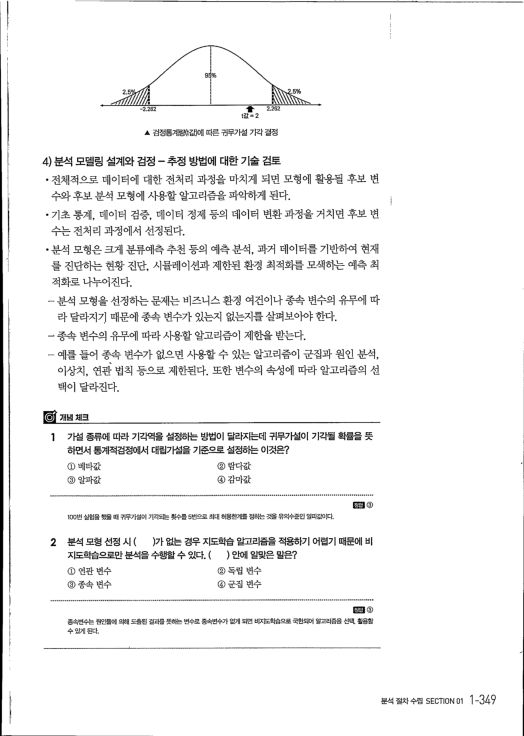
5%

2. 5뻑
-2.262 ㅎ

2. 262 
t값 = 2 ▲ 검정통계량（t값）에 따른 귀무가설 기각 결정 4) 분석 모델링 설계와 검정 - 추정 방법에 대한 기술 검토

- 전쳬적으로 데이터에 대한 전처리 과정을 마치게 되면 모형에 활용될 후보 변
수와 후보 분적 모형에 사용할 알고리즘을 파악하게 된다．

#### · 기초 통계 , 데이터 검증 , 데이터 정제 등의 데이터 변환 과정을 거치면 후보 변
수는 전처리 과정에서 선정된다．

#### · 분석 모형은 크게 분류예측 추천 등의 예측 분석 , 과거 데이터를 기반하여 현재
#### 를 진단하는 현황 진단 , 시뮬레이션과 제한된 환경 최적화를 모색하는 예측 최
적화로 나누어진다 .

- 분석 모형을 선정하는 문제는 비즈니스 환경 여건이나 종속 변수의 유무에 따
라 달라지기 때문에 종속 변．수가 있는지 없는지를 살펴보아야 한다 .

→ 종속 변수의 유무에 따라 사용할 알고리즘이 제한을 받는다．

- 예를 들어 종속 변수가 없으면 사용할 수 있는 알고리즘이 군집과 원인 분석，
#### 이상치 , 연관 법칙 등으로 제한퇸다 . 또한 변수의 속정에 따라 알고리즘의 선
#### 택이 달라진다 .
1 가설 종류에 따라 기각역을 설정하는 방법이 달라지는데 귀무가설이 기각될 확률을 뜻 하면서 통계적검정에서 대립가설을 기준으로 설정하는 이것은？ ① 베타값 ②람다값 ③ 알파값 ④감마값 100번 실험을 했을 때 귀무가설이 기각되는 횟수를 5번으로 최대 허용한계를 정하는 것을 유의수준인 알파값이다． 2 분석 모형 선정 시 ( ）가 없는 경우 지도학습 알고리즘을 적용하기 어렵기 때문에 비 지도학습으로만분석을수행할수있다 . ( ) 안에 알맞은말은？ ① 연관 변수 ② 독립 변수 ③종속 변수 ④군집 변수 ．郞 ③ 종속변수논 원인들에 의해 도출된 결과를 뜻하는 변수로 종속변수가 없게 되면 비ㅈE학습으로 국한되어 알고리즘을 선택 . 활용합 수 딧J［게 된다．

> ㅁ레③
> 분석절차수립 SECTION 01 ㅌ49
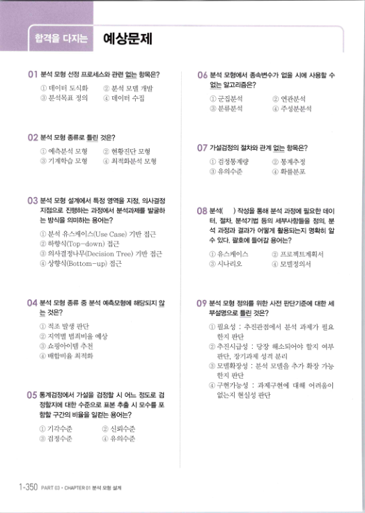
## 예상문제
01 분석 모형 선정 프로세스와 관련 없는 항목은？ 분석 모형에서 종속변수가 없을 시에 사용할 수 없는 알고리즘은？ ① 데이터 도식화 ② 분적 모델 개발 ③분석목표 정의 ④ 데이터 수집 ①군집분석 ② 연관분석 ③분류분석 ④주성분분석 02 분석 모형 종류로 틀린 것은？ 0 , 가설검정의 절차와 관계 없는 항목은？ ① 예측분석 모형 ② 현황진단 모형 ③ 기계학습 모형 ④ 최적화분석 모형 ①검정통계량 ②통계추정 ③유의수준 ④ 확률분포 03 분석 모형 설계에서 특정 영역을 지정 , 의사결정 지점으로 진행하는 과정에서 분석과제를 발굴하 는 방식을 의미하는 용어는？ OF 분석（ ) 작성을 통해 분석 과정에 필요한 데이 터 , 절차 , 분석기법 등의 세부사항들을 정의 , 분 석 과정과 결과가 어떻게 활용되는지 명확히 알 수 있다 . 괄호에 들어갈 용어는？ ① 분적 유스케이스（Use Case) 기반 접근 ② 하향식（Top-dow미 접근 ③ 의사결정나무（Decision Tree) 기반 접근 ④ 상향식（Bottom-up) 접근 ①유스케이스 ②프로젝트계획서 ③시나리오 ④모델정의서 04 분석 모형 종류 중 분석 예측모형에 해당되지 않 는 것은？ 0 'i 분석 모형 정의를 위한 사전 핀도t기쥔게 대한 세 부설명으로 틀린 것은？ ① 적조 발생 판단 ② 지역별 범죄비율 예상 ③ 쇼핑아이템 추천 ④ 배합비율 최적화 ① 필요성 : 추진관점에서 분적 과제가 필요 한지 판단 ②추진시급성 : 당장 해소되어야 할지 여부 판단 , 장기과제 성격 분리 ③ 모델확장성 : 분석 모델을 추가 확장 가능 한지 판단 ④구현가능성 : 과제구현에 대해 어려움이 없는지 현실성 판단 r하 통계검정에서 가설을 검정할 시 어느 정도로 검 정할지에 대한 수준으로 표본 추출 시 모수를 포 함할 구간의 비율을 일걷는 용어는？ ①기각수준 ② 신뢰수준 ③검정수준 ④ 유의수준 1 -350 PART 03. CHAPTER 01 분석모형 설계

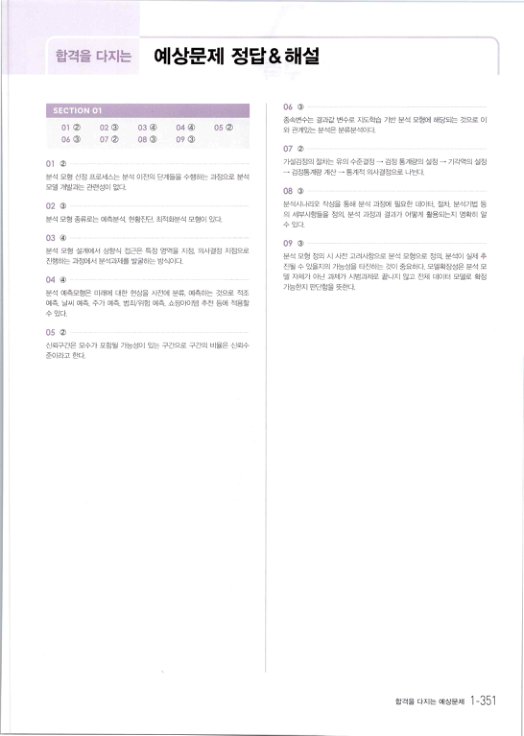
## 합격을다지令 
예상문제 정답＆해설 06 ③ ……一…∼…………………－… ………………………………………－ 종속변수는 결과값 변수로 지도학습 기반 분석 모형에 해당돠는 것으로 이 와 관계있는 분석은 분류분석이다． 03 ④ 04 ④ Ol ② 02 c) 05 ② 06 （ㅁ；) 07 ② 08 ③ 09 ③ 07 ② ……… …… …… …………………… ……………… 가설검정의 절차는 유의 수준결정 → 검정 통계량의 설정 - 기각역의 설정 → 검장통계량 계산 → 통계적 의사결정으로 나뉜다． 01 ② 분석 모형 선정 覡［ㅅll스는 분석 이전의 단계들을 수행하는 과정으로 분석 모델 개발과는 관련성이 딥；［다． 08 ③ ……一∼………………∼…… 」 ∼ 一… …………………… … 분석시나리오 작성을 통해 분석 과정에 필요한 데이터 . 절차． 분석기법 등 의 세부사항a a 정의 , 분석 과정과 결과가 어떻게 활용되는지 명확히 알 수 있다． 02 ③ …… …… ……∼… ……………∼… … ……… …… 분석 모형 종류로는 예측분석． 현황진단． 최적화분석 모형이 있다． 03 ④ ………………… …………………………… 09 ③ …………………………… …………………… ………………… 분석 모형 설계에서 상향식 접근은 특정 영역을 지정 . 의사결정 지점으로 분석 모형 정의 시 사전 고려사힝으로 분석 모형으로 정의 . 분석이 실제 추 진행하는 과정에서 분석과처屠 발굴하는 방식이다． 진될 수 있을지의 가눴」을 타진하는 것이 중요하다. 모델확장성은 분석 모 델 자체가 아닌 과제가 시범과제로 끝나지 않고 전체 데이터 모델로 확장 04 ④ … … 」 … …………… ……… 가능한지 판단함을 뜻한다． 분석 예측모형은 미래에 대한 현상을 사전에 분류． 예측하는 것으로 적조 예측． 날씨 예측． 주가 01隱． 범죄／위험 예측. 쇼핑아이템 추천 뭉게 적용할 수 있다． 05 （零 …… …………… …… ………… … 신뢰구간은 모수가 포함될 가능성이 있는 구간으로 구간의 비율은 신롸수 준이라고 한다．

> 합격을다지는예상문제 ㄴ351
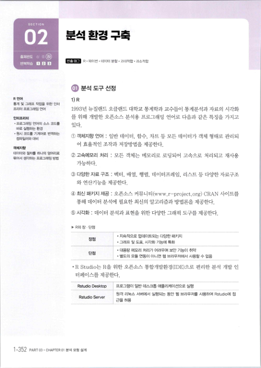
# SECT l0N 
02

# 분석 환경 구축
출저빈도 （蝕 빈줄 태그 R · 파이썬 · 데이터 분할 · 과대적합 · 과소적합 반복학습 n .

.

## c; 분석 도구 선정
R언어 통계 및 그래프 작업을 위한 인터 프리터 프로그래밍 언어 1) R 1993년 뉴질랜드 오클랜드 대학교 통계학과 교수들이 통계분석과 자료의 시각화 를 위해 개발한 오픈소스 분석용 프로그래밍 언어로 다음과 같은 특징을 가지고 인터프리터

- 프로그래잉 언어의 소스 코드를 
바로 실행하는 환경

- 원시 코드를 기계어로 번역하는
있다．

#### ① 객체지향 언어 : 일반 데이터 , 함수 , 차트 등 모든 데이터가 객쳬 형태로 관리되
컴파일러와 대비 어 효율적인 조작과 저장방법을 제공한다． 객쳬지향 데이터와 절차를 하나의 덩어리로 묶어서 생각하는 프로그래잉 방법

#### ② 고속메모리 처리 : 모든 객체는 메모리로 로딩되어 고속으로 처리되고 재사용
가능하다．

#### ③ 다양한자료구조 : 벡터 , 배열 , 행렬 , 데이터프레임 , 리스트등다양한자료구조
와 연산기능을 제공한다．

#### ④ 최신 패키지 저긍 : 오픈소스 커뮤니티（www.r- project.org) CRAN 사이트를
통해 데이터 분적에 필요한 최신의 알고리즘과 방법론을 제공한다．

#### ⑤ 시각화 : 데이터 분적과 표현을 위한 다양한 그래픽 도구를 제공한다．
* R의 장 · 단점
ㅈ峰적으로 업데이트도는 다양한 패키지 그래프 및 도표， 시각화 기능에 특화 翌 楓

- 대용량 메모리 처리가 어려우며 보안 기능이 취약
- 별도의 모듈 연동이 아니면 웹 브라우저에서 사용할 수 없음
- R Studio는 R을 위한 오픈소스 통합개발환경（IDE）으로 편리한 분석 개발 인
터페이스를 제공한다． Rstudio Desktop 프로그램이 일반 데스크톱 애플리케이션으로 실행 원격 리눅스 서버에서 실행되는 동안 웹 브라우저를 사용하여 Rstudio0ㅔ 접 근을 허용 Rstudio Server 1-352 PART 03 . CHAPTER 01 분석 모형 설겨！

> 一
縣

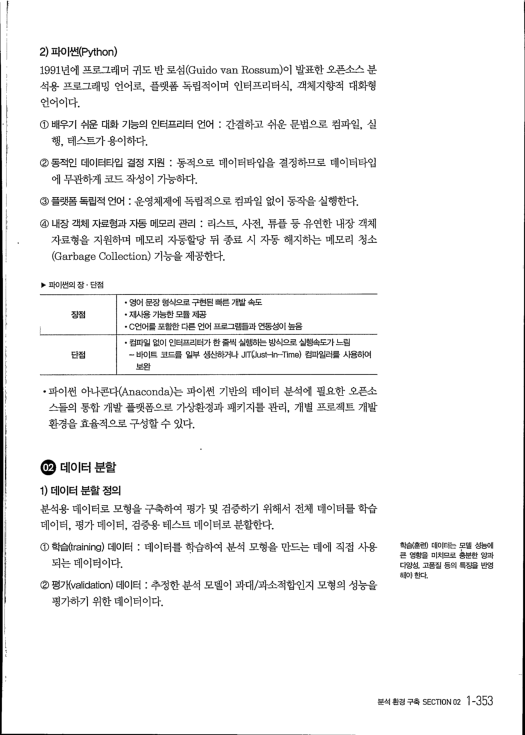
2) 파이썬（Python) 1991년에 프로그래머 귀도 반 로섬（Guido van Rossum）이 발표한 오픈소스 분 석용 프로그래밍 언어로 , 플랫폼 독립적이며 인터프리터식 , 객쳬지향적 대화형 언어이다．

#### ① 배우기 쉬운 대화 기능의 인터프리터 언어 : 간결하고 쉬운 문법으로 컴파일 , 실
행 , 데스트가용이하다．

#### ②동적인 데이터타입 결정 지원 : 동적으로 데이터타입을 결정하므로 데이터타입
에 무관하게 코드 작성이 가능하다． ③ 플랫폼 독립적 언어 : 운영쳬제에 독립적으로 컴파일 없이 동작을 실행한다． ④ 내장 객체 자료형과 자동 메모리 관리 : 리스트 , 사전 , 튜플 등 유연한 내장 객쳬 자료형을 지원하며 메모리 자동할당 뒤 종료 시 자동 해지하는 메모리 청소 (Garbage Collection) 기능을 제공한다． 卜 패걔선의 장 · 단점

- 영어 문장 형식으로 구현된 빠른 개발 속도
- 재入隱 
한 모듈 저꼼 장점

- C언어를 포함한 다른 언어 프로그램들과 연동성이 높음
- 컴파일 없이 인터프리터가 한 줄씩 실행하는 방식으로 실행속도가 느림
- 바이트 코드를 일부 생산하거나 JIT(Just-]n-Time) 컴파일러를 사용하여
단점 보완

- 파이썬 아나콘다（Anaconda）는 파이썬 기반의 데이터 분적에 필요한 오픈소
스들의 통합 개발 플랫폼으로 가상환경과 패키지를 관리 , 개별 프로젝트 개발 환경을 효율적으로 구성할 수 있다． .

데이터 분할 1) 데이터 분할 정의 분석용 데이터로 모형을 구축하여 평가 및 검증하기 위해서 전체 데이터를 학습 데이터 , 평가데이터 , 검증용테스트데이터로분할한다． ① 학습《training) 데이터 : 데이터를 학습하여 분석 모형을 만드는 데에 직접 사용 되는 데이터이다．

#### ② 평가（validation) 데이터 : 추정한 분석 모델이 과대／과소적합인지 모형의 성능을
평가하기 위한 데이터이다．

> 학습《훈련） 데이터는 모델 성능에 
큰 영향을 미치므로 충분한 잉따 다양성 . 고품질 등의 특짇읕 반영 해야 한다．

> 분석환경구축SECTION 02 1 -353
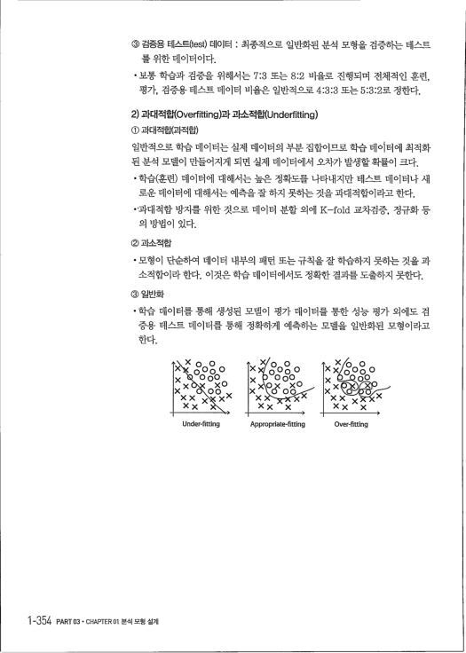
#### ③ 검증용 테스트（test) 데이터 : 최종적으로 일반화된 분석 모형을 검증하는 데스트 
를 위한 데이터이다．

#### · 보통 학습과 검증을 위해서는 7:3 또는 8:2 비율로 진행되며 전쳬적인 훈런， 
평가 , 검증용 데스트 데이터 비율은 일반적으로 4 '3:3 또는 5:3:2로 정한다． 2) 과대적합（0vert itting）과 과소적힙ㄱ(Underfitting) ① 과대적합（과적합） 일반적으로 학습 데이터는 실제 데이터의 부분 집합이므로 학습 데이터에 최적화 된 분석 모델이 만들어지게 되면 실제 데이터에서 오차가 발생할확률이 크다．

- 학습（훈린） 데이터에 대해서는 높은 정확도를 나타내지만 데스트 데이터나 새 
로운 데이터에 대해서는 예측을 잘 하지 못하는 것을 과대적합이라고 한다．

#### · ' 과대적합 방지를 위한 것으로 데이터 분할 외에 K-fold 교차검증 , 薪予화 등
의 방법이 있다． ② 과소적합

- 모형이 단순하여 데이터 내부의 패턴 또는 千칙을 잘 학습하지 못하는 것을 과 
소적합이라한다 . 이것은학습 데이터에서도 정확한 결과를도출하지 못한다． ③ 일반화

- 학습 데이터를 통해 생성된 모델이 평가 데이터를 통한 성능 평가 외에도 검 
증용 데스트 데이터를 통해 정확하게 예측하는 모델을 일반화된 모형이라고 한다．

#### x ㅇ－ ㅇ 
U 0 ㅇ 0) ( X 0 00 x Under-fitting Appropriate-fitting Over-fitting 1-354 PART 03솥 CHAPTER 01, 분석모형설계

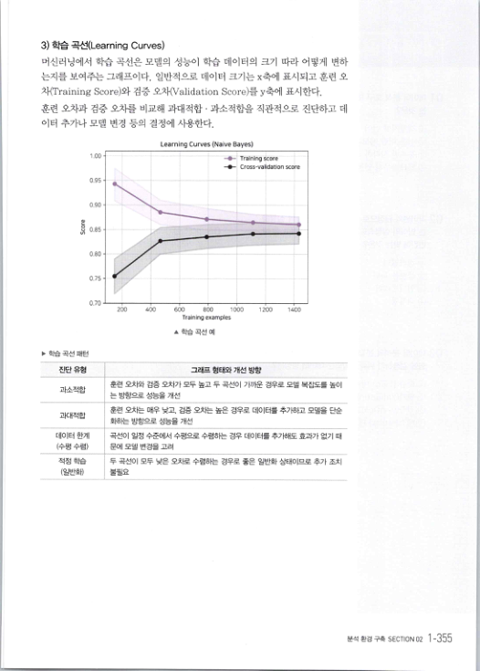
3) 학습 곡선（Learning Curves) 머신러닝에서 학습 곡선은 모델의 성능이 학습 데이터의 크기 따라 어떻게 변하 는지를 보여주는 그래프이다 . 일반적으로 데이터 크기는 x축에 표시되고 훈련 오 차（Training Score）와 검증 오차（Validation Score）를 y축에 표시한다．

#### 훈련 오차과 검증 오차를 비교해 과대적합 . 과소적합을 직관적으로 진단하고 데
이터 추가나 모델 변경 등의 결정에 사용한다． Learning Curves (Naive Bayes)

1. 00
스→Training score -- Cross-validation score

0. 95
# ∼－
∼－ -*---－參 씽＼∼ 刪 ． 楡 8

- ，
。

u 이 0

0. 80
0,75

0. 70
200 400 600 800 1000 1200 1400 Training examples ▲ 학습 곡선 예 》 학습 곡선 패턴 친단 유형 과소적합 훈련오차와검증오차가모두높고두곡선이가꾜운경우로모델복집도를높이

- 는 방향으로 성능을 개선
훈련도차는매우낮고， 검증오차는높은경우로데이터를추가하고모델을단순 과대적합 ㅣ 화하는방힝으로성능을개선 곡선이일정수준에서수펑으로수렴하는경우데이터를추가해도효과가없기 때 데이터 한계 （수평 수렴）

- 문에 모델 변경을고려
적정 학습 두 곡선이 모두 낮은 도차로 수렴하는 경우로 좋은 일반화 상태이므로 추가 조치 불필요 （일반화）

> 분석환경구축 SECTION 02 1 -355
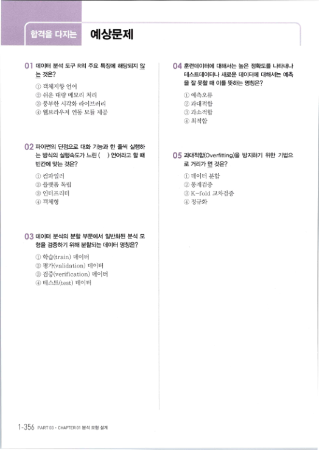
## 예상문제
01 데이터 분석 도구 R의 주요 특징에 해당되지 않 는 것은？ 04 훈련데이터에 대해서는 높은 정확도를 나타내나 테스트데이터나 새로운 데이터에 대해서는 예측 을 잘 못할 때 이를 뜻하는 명칭은？ ① 객쳬지향 언어 ②쉬운대량메모리 처리 ①예측오류 ③풍부한시각화라이브러리 ②과대적합 ④웹브라우저 연동모듈제공 ③과소적합 ④최적합 02 파이썬의 단점으로 대화 기능과 한 줄씩 실행하 는 방식의 실행속도가 느린 ( ) 언어라고 할 때 05 과대적합（0verfitting）을 방지하기 위한 기법으 로 거리가 먼 것은？ 빈칸에 맞는 것은？ ① 데이터 분할 ① 컴파일러 ② 플랫폼 독립 ③ 인터프리터 ④ 객쳬형 ②통계검증 ③ K-fold 교차검증 ④ 정규화 03 데이터 분석의 분할 부문에서 일반화된 분석 모 형을 검증하기 위해 분할되는 데이터 명칭은？ ① 학습（train) 데이터 ② 평가〈validation) 데이터 ③ 검증（verification) 데이터 ④ 테스트（test) 데이터 1-356 PART 03. CHAPTER 01 분석모형 설계

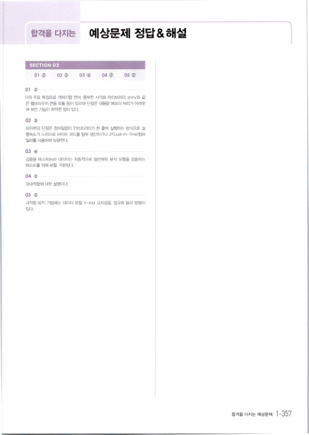
## 합격을 다지는 
예상문제 정답＆해설 Ol (2) 02 ③ 03 ④ 04 ② 05 ② 01 (2) R의 주요 특징으로 객체지향 언어． 풍부한 시각화 라이브러리 . 士'fly와 같 은 웹브라우저 연동 모듈 등이 있으며 단점은 대용량 메모리 처리가 어려우 며 보안 기능《기 취약한 점이 있다． 02 c) :

…… ……… … ………… … 파이썬의 단점은 컴파일없이 인터프리터가 한 줄씩 실행하는 방식으로 실 행속도가 느리므로 바이트 코드를 일부 생신하거나 ,JIT(JusHri-Time》컴파 일러를 사용하여 보완한다． 03 ④ …………一… ………－…………………………………………（ 검증용 테스트（test) 데이터는 최종적으로 일반화된 분석 모형을 검증하는 테스트를 위해 분할. 구분된다． 04 ② … 과대적합에 대한 설명이다． 05 ② ………… ……………………………∼…………………∼ 과적합 방지 기법에는 데이터 분할. K-told ㅍ톼검증. 정규화 등의 방법이 있다．

> 합격을다지는예상문제 1-357