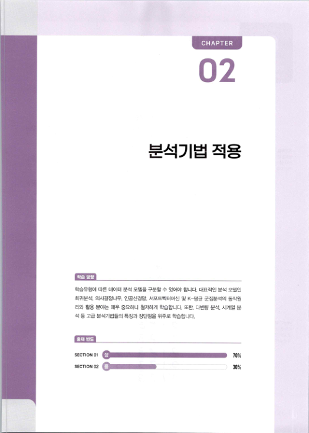
# 분석기법 적용
학습 밤향 학습유형에 따른 데이터 분석 모델을 구분할 수 있어야 합니다 . 대표적인 분석 모델인 회귀분석 , 의사결정나무 , 인공신경망 , 서포트벡터머신 및 K-평균 군집분석의 동작원 리와 활용 분야는 매우 중요하니 철저하게 학습합니다 . 또한, 다변량 분석 , 시계열 분 석 등 고급 분석기법들의 특징과 장단점을 위주로 학습합니다． 출제 빈도

#### SEC지ON 02 
:- 70% SECTION 01

- 
D 30%

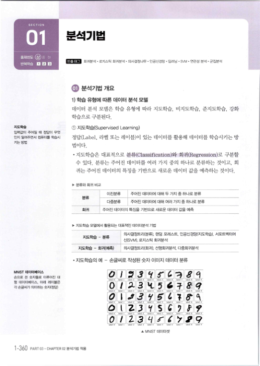
# SECTION 01
# 분석기법
출제빈도 덩I 빈출 태그 회귀분석 · 로지스틱 회귀분석 · 의사결정나무 · 인공신경망 · 딥러닝 · SW · 연관성 분석 · 군집분석 반복학습 In 履 日 必 분석기법 개요 1) 학습 유형에 따른 데이터 분석 모델 데이터 분석 모델은 학습 유형에 따라 지도학습 , 비지도학습 , 준지도학습 , 강화 학습으로 구분된다． ① 자도학습《Supervised Learning) 지도학습 입력값이 주어질 때 정답이 우엇 인지 알려주면서 컴퓨터를 학습시 7隧 방법 정답（Label , 라벨 또는 레이블）이 있는 데이터를 활용해 데이터를 학습시키는 방 법이다．

- 지도학습은 대표적으로 분류（Classification）와 회귀（Regression）로 구분할 
수 있다 . 분류는 주어진 데이터를 여러 가지 중의 하나로 분류하는 것이고 , 회 귀는 주어진 데이터의 특징을 기반으로 새로운 데이터 값을 예측하는 것이다． 卜 분류와 회귀 비교 분류 이진분류 주어진 데이터에 대해 두 가지 중 하나로 분류 다중분류 주어진 데이터에 대해 여러 가지 중 하나로 분류 회귀 주어진 데이터의 특징을 기반으로 사匣운 데이터 값을 예측

* 지도학습 모델에서 활용돠는 대표적인 데이터분석 기법
의사결정트리（분류） . 랜덤 포레스트 . 인공신경망（지도학습） 서포트벡터머 지도학습 분류 신（SVM) , 로지스틱 회귀분석 지도학습 회귀（예측） 의사결정트리（회귀） , 선형회귀분석 , 다중회귀분석

- 지도학습의 예 
손글씨로 작성된 숫자 이미지 데이터 분류

# 〃 / i伊，夕 'r r ' 갸 8 '' 
0 ' : 3 `t 5 ' 구 eq 끄 I .# 3 γ r 6 구 孀쵸 0 IL Z3 Y 5 ' ?" ' ' '  L츠3 식 觸｀c > ' ?

a MN 1ST 데이터베이스 손으로 쓴 숫자들로 이루어진 대 형 데이터베이스， 아래 레이블은 각 손글씨가 의미하는 숫자（정답） 놉1딨. 0 ▲ MNIST 데이터셋 ㅏ 60 PART 03. CHAPTER 02분석기법적용

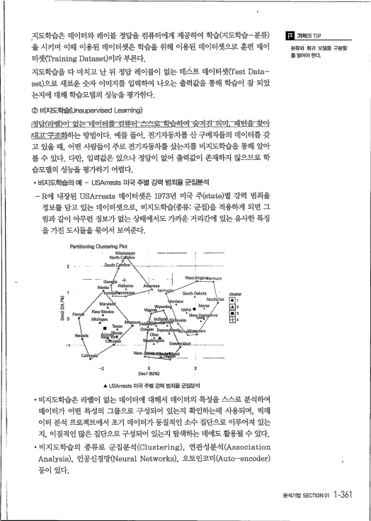
지도학습은 데이터와 레이블 정답을 컴퓨터에게 제공하여 학습（지도학습－분류） 을 시키며 이때 이용된 데이터셋은 학습을 위해 이용된 데이터셋으로 훈런 데이 터셋（Training Dataset）이라 부른다． 지도학습을 다 마치고 난 뒤 정답 레이블이 없는 테스트 데이터셋（Test Data- set）으로 새로운 슷자 이미지를 입력하여 나오는 출력값을 통해 학습이 잘 되었 는지에 대해 학습모델의 성능을 평가한다． ② 비지도학습（Unsupervised Learning) 穗답（라폘）이－았븐쳬이터룔컴芸：틔샌E츠r학즘하여샐푼겨친의미－패뵤貪갖와

#### 吼고ㅍ쿳釜회7하는방법이다 . 예를들어 , 전기자동차를산구매자들의 데이터를갖
#### 고 있을 때 , 어떤 사람들이 주로 전기자동차를 샀는지를 비지도학습을 통해 알아
#### 볼 수 있다 . 다만 , 입력값은 있으나 정답이 없어 출력값이 존재하지 않으므로 학
습모델의 성능을 평가하기 어렵다．

- 비지도학습의 예 - USArrests 미국 주별 강력 범죄율 군집분석
-HR에 내장된 USArrests 데이터셋은 1973년 미국 주（state）별 강력 범죄율

#### 정보를 담고 있는 데이터셋으로 , 비지도학습（총류： 군집）을 적용하게 되면 그
림과 같이 아무런 정보가 없는 상태에서도 가까운 거리간에 있는 유사한 특징

#### 을 가진 도시들을 묶어서 보여준다 .
Partitioning Clustering Plot Mississippi North Calolina . -. Sn,,卄， 2 - 쵸rgini 'ermont Gao Alaska Sou小 Dakota 才｀l＾라＇塊 『｀`L, 뺙ass . . -'：닐 ' " γu' lvlu＂∥， Ma뎨柚' 柏 1 2 3 4 紬 □ □ 回 田 굻 卜 ＊ 빱 ＂→ 히 ㅌ ∼ 。

#### · 
` ` r ，젼 ' ' －一 " “．什ㄴ . ·＇－ㄴ－ · .

별 ' t 활 ~ ` 닐 ∥1】 ［{ 】l」u -- , ~ u.

J ..

- 
｀쟁튕씸뉠날 `vlㅂ죠＂』 』 첬 \ ;/ 衲庶휴n二 . \ , Nev날J(）聊 " hire r'Ion M蘆ㄷ껼ga" 綸s。urk,.A漑텼엮一．` sItaska Michigan \ · Texas o 5m Arizodll5105 New YbrI 1 Cdco Ne 0 Dimi (62%) -2 A USArrests 미국 주별 긷력 범죄율 군집분석

- 비지도학습은 라벨이 없는 데이터에 대해서 데이터의 특성을 스스로 분석하여
#### 데이터가 어떤 특정의 그룹으로 구성되어 있는지 확인하는데 사용되며 , 빅데
이터 분석 프로젝트에서 초기 데이터가동질적인 소수 집단으로 이루어져 있는

#### 지 , 이질적인 많은 집단으로 구성되어 있는지 탐색하는 데에도 활용될 수 있다．
#### · 비지도학습의 종류로 군집분석（Clustering) , 연관성분석（Association 
Analysis) , 인공신경망（Neural Networks) , 오토인코더（Auto-encoder) 등이 있다．

> 분류와 회귀 모델을 구분할 
줄 알아야 힌다

> 분석기법 SECTION01 1-361
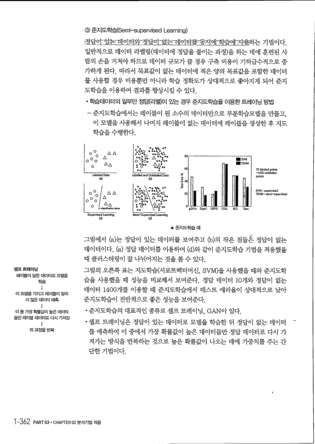
③ 준지도학습（Semi-supervised Learning)

#### 정답이-0注三E데『이터와’젓탑이－없튼＝데"이터릍헷돗켜“에－학슈에＝牛욧璟하는 기법이다． 
일반적으로 데이터 라벨링（데이터에 정답을 붙이는 과정）을 하는 데에 훈런된 사 람의 손을 거쳐야 하므로 데이터 규모가 클 경우 구축 비용이 기하급수적으로 증 가하게 된다 . 따라서 목표값이 없는 데이터에 적은 양의 목표값을 포함한 데이터 를 사용할 경우 비용뿐만 아니라 학습 정확도가 상대적으로 좋아지게 되어 준지 도학습을 이용하여 결과를 향상시킬 수 있다．

- 학습데이터의 일부만 정답（라벨）이 있는 경우 준지도학습을 이용한 트레이닝 방법
- 준지도학습에서는 레이블이 된 소수의 데이터만으로 부분학습모델을 만들고， 
이 모델을 사용해서 나머지 레이블이 없는 데이터에 레이블을 생성한 후 지도 학습을 수행한다 .

00 e% 0· 00。

#### .므．
．노p 0 ■ ．ㅅ．=^ C U- 0_ aOi_S %_S .％《능침， △ "r· r, 乙」 0 0

#### 걸1000 ￡：8【，:' 
·  .

· 0 △△ 印 卯 沁 Lab이紀 Data (a) baled and 盼nab이相 Data cb) 木 ㄴ 르 씹 甥 β

# 수 
- 
- 1 1 
9241c Digiti USPS COIL Supervised Learning (a) S이輛-Supervised Learning (d) ▲ 준지도학습 0쒜 그림에서 (a）는 정답이 있는 데이터를 보여주고 (b）의 작은 점들흔 정답이 없는

#### 데이터이다 . (a) 정답 데이터를 이용하여 (d）와 같이 준지도학습 기법을 적용했을 
때 클러스터링이 잘 나뉘어지는 것을 볼 수 있다． 그림의 오른쪽 표는 지도학습（서포트벡터머신 , SVM）을 사용했을 때와 준지도학 습을 사용했을 때 성능을 비교해서 보여준다 . 정답 데이터 10개와 정답이 없는 셀프 트레이닝 레이블이 달린 데이터로 모델을 학습 ㅗ 이 모델을 가지고 레이블이 달리 지 않은 데이터 예측 데이터 1400개를 이용할 때 준지도학습에서 테스트 에러율이 상대적으로 낮아 준지도학습이 전반적으로 좋은 성능을 보여준다． 소 이 중 가장 확률값이 높은 데이터 들만 레이블 데이터로 다시 가져감

- 준지도학습의 대표적인 종류로 셀프 트레이닝 , GAN이 있다．
- 셀프 트레이닝은 정답이 있는 데이터로 모델을 학습한 뒤 정답이 없는 데이터 
를 예측하여 이 중에서 가장 확률값이 높은 데이터들만 정답 데이터로 다시 가 l 위 과정을 반복 져가는 방식을 반복하는 것으로 높은 확률값이 나오는 데에 가중치를 주는간 단한 기법이다． 1-362 PART 03* CHAPTER 02분석기법적용

# ■SVM 
·TSVM h

> 10 labeled points 
-1400 unlabeled pafnt8

> SvM = supervised 
TsWA: serni-supervL$.《크

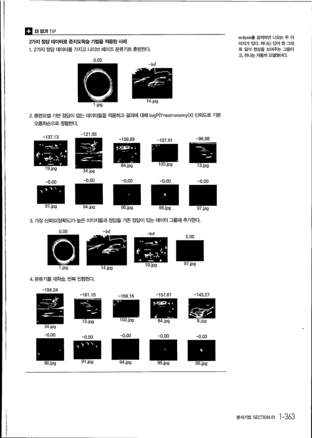
2가지 정답 데이터로 준지도학습 기법을 x몽한 ㅅ뻬

1. 2가지 정답 데이터를 가지고 나이브 베이즈 분류기로 훈련한다．
0. 00 
-Inf

1. jpg
2 . 훈련모델 기반 정답이 없는 데이터들을 적용하고 결과에 대해 {ogPC{ astronom기×） 신뢰도로 기본 오름차순으로 정렬한다． ．∼． 一

- 121.93 
--Id/ . 료蔘 -96.98 -109.89 -107.91 죤 구

100. jpg
84. jpg
13. jpg
19. jpg
34. jpg
-0.00 -0.00 -0.00 -0.00 -0.00 `

91. jpg
94. jpg
95. jpg
96. jpg
97. jpg
3 . 가장 신뢰도（정확도）가 높은 이미지들과 정답을 기존 정답이 있는 데이터 그룹에 추가한다．

0. 00 
-m l 十f

0. 00
97. jpg
19. jpg
1. jpg
14. jpg
4 . 분류기를 재학습, 반복 진행한다． -194.24 -159.15 -157.61 -143.27 -161.15 뜨＝】g．맥 흥 '

100. jpg 
84. jpg
8. jpg
13. jpg
34. jpg
-0.00 -0.00 -0.00 -0.00 -0.00 '

91. jpg 
94. jpg 
95. jpg
90. jpg
96. jpg
> eclipse를 검색하면 나오는 두 이 
미지가 있다. 하나는 단어 뜻 그대 로 일식 현상을 보여주는 그림이

> 고， 히l나는 자동차모델명이다．
> 분석기법 SECTION 01 ㄴ6; 3
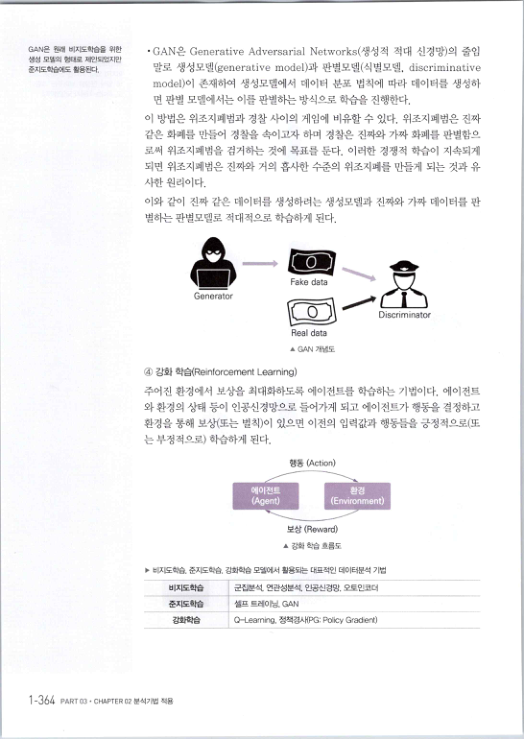
- GAN은 Generative Adversarial Networks（생성적 적대 신경망）의 줄임
GAN은 원래 비지도학습을 위한 생성 모델의 형태로 제안되었지만 준자도학습게도 활용된다． 말로 생성모델（generative model）과 판별모델（식별모델 , discriminative model）이 존재하여 생성모델에서 데이터 분포 법칙에 따라 데이터를 생성하 면 판별 모델에서는 이를 판별하는 방식으로 학습을 진행한다． 이 방법은 위조지폐범과 경찰 사이의 게임에 비유할 수 있다 . 위조지폐범은 진짜 같은 화폐를 만들어 경찰을 속이고자 하며 경찰은 진짜와 가짜 화폐를 판별함으 로써 위조지폐범을 검거하는 것에 목표를 둔다 . 이러한 경챙적 학습이 지속되게 되면 위조지폐범은 진짜와 거의 흡사한 수준의 위조지폐를 만들게 되는 것과 유 사한 원리이다． 이와 같이 진짜 같은 데이터를 생성하려는 생성모델과 진짜와 가짜 데이터를 판

# 별하는 판별모델로 적대적으로 학습하게 된다 . 
A- Generator Re비 data ▲ GAN 개념도 ④ 강화 학습《Reinforcement Learning)

#### 주어진 환경에서 보상을 최대화하도록 에이전트를 학습하는 기법이다 . 에이전트
와 환경의 상태 등이 인공신경망으로 들어가게 되고 에이전트가 행동을 결정하고 환경을 통해 보상（또는 벌칙）이 있으면 이전의 입력값과 행동 들 욜 긍정적으로（또 는 부정적으로） 학습하게 된다． 행동 (Action) 에이전트 (Agent) 환경 (Environment) 보상 (Reward) ^ 강화 학습 흐름도 》 비자도학습 , 준지도학습 , 강화학습 모델에서 활용되는 대표적인 데이터분석 기법 비지도학습

- 군집분석，연관성분석 , 인공신경망．오토인코더
준지도학습 셀프 트레이닝， GAN 강화학습 Q-Learning. 정책경사（PG: Policy Gradient) 1 -364 PART 03. CHAPTER 02분석기법적용

> Discriminator
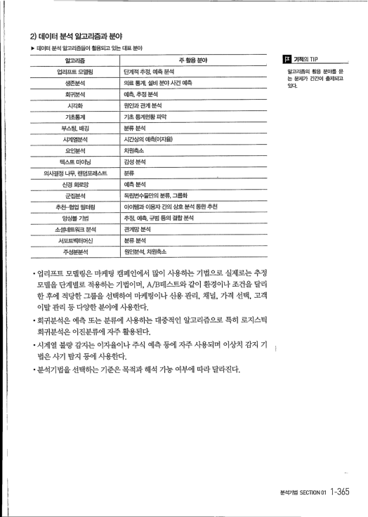
2) 데이터 분석 알고리즘과 분야

> 데이터 분석 알고리즘들이 활용되고 있는 대표 분야
알고리즘 주 횔용 분야 업리프트모델링 단계적 추정 , 예측 분석 생존분석 의료 통계 , 설비 분야 사건 예측 회귀분석 예측 . 추정 분석 시각화 원인과 관계 분석 기초통계 기초통계현황파악 부스팅 , 배깅 분류분석 시계열분석 시간상의 예측《이지율） 요인분석 차원축소 텍스트 마이닝 감성분석 의사결정 나무, 랜덤포레스트 분류 신경 회로망 예측 분석 군집분석 독립변수들만의 분류 , 그룹화 추천－협업 필터링 아이템과 이용자 간의 상호분석 통한추천 앙상블 기법 추정 , 예측 , 규범 등의 결합분석 소셜네트워크분석 관계망 분석 서포트벡터머신 분류분석 주성분분석 원인분석 , 차원축소

- 업리프트 모델링은 마케팅 캠폐인에서 많이 사용하는 기법으로 실제로는 추정
#### 모델을 단계별로 적용하는 기법이며 , A/B테스트와 같이 환경이나 조건을 달리
#### 한후에 적당한그룹을선택하여 마케팅이나신용관리 , 채널 , 가격 선택 , 고객
이탈 관리 등 다양한 분야에 사용한다．

- 회귀분석은 예측 또는 분류에 사용하는 대중적인 알고리즘으로 특히 로지스틱
회귀분석은 이진분류에 자주 활용된다．

- 시계열 불량 감지는 이자율이나 주식 예측 등에 자주 사용되며 이상치 감지 기
#### 법은 사기 탐지 등에 사용한다 .
#### · 분석기법을 선택하는 기준은 목적과 해석 가능 여부에 따라 달라진다 .
> .
기적의 ㄲP

> 알고리즘으l 흴용 분야를 묻 
는 문제가 간간이 출제되고

> 있다．
> 분석기법 SECTION 01 1 -365
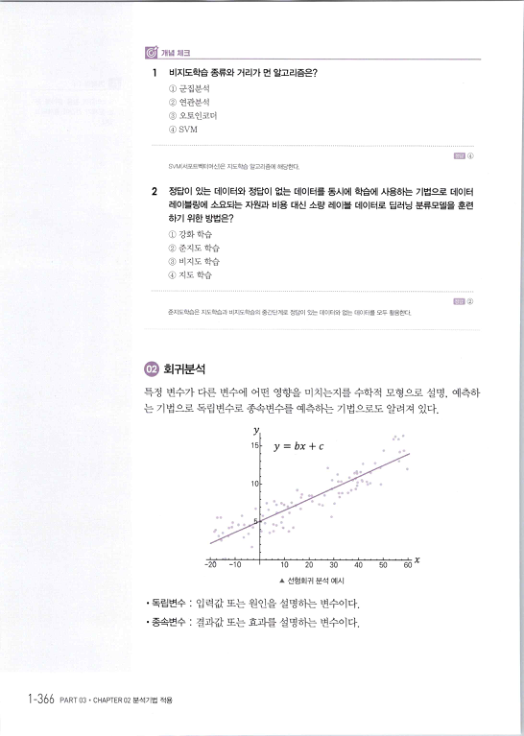
#### 嚼Z＂념체크
】 비지도학습 종류와 거리가 먼 알고리즘은？ ① 군집분석 ② 연관분석 ③ 오토인코더 ④ SVM SVM（사포트벡터머신尸 지도학습 알고리剖 해당한다．.

2 정답이 있는 데이터와 정답이 없는 데이터를 동시에 학습에 사용하는 기법으로 데이터 레이블링에 소요되는 자원과 비용 대신 소량 레이블 데이터로 딥러닝 분류모델을 훈련 하기 위한 방법은？ ① 강화 학습 ② 준지도 학습 ③ 비지도 학습 ④ 지도 학습 준자도학습은 지도학습과 비지도학습의 중긴단겨L로 정답이 닷（는 데이터와 없는 데이터를 모두 핥용芝h각， @ 회귀분석 특정 변수가 다른 변수에 어떤 영향을 미치는지를 수학적 모형으로 설명 , 예측하 는 기법으로 독립변수로 종속변수를 예측하는 기법으로도 알려져 있다．

- ●
-20 -10 10 20 30 40 50 60 ▲ 선형회귀 분석 예시

#### · 독립변수 : 입력값 또는 원인을 설명하는 변수이다．
- 종속변수： 결과값 또는 효과를 설명하는 변수이다．
ㅑ 桶 PART03. CHAPTER02분석기법적용

#### ．· ④
> z輾 聊
> 룅
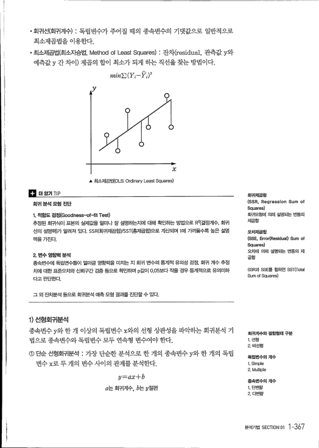
#### · 회귀선（회귀계수） : 독립변수가 주어질 때의 종속변수의 기댓값으로 일반적으로
최소제곱법을 이용한다．

#### · 최소제곱법（최소자승법 , Method of Least Squares) : 잔차（residual , 관측값 y와
예측값 y 간 차이） 제곱의 합이 최소가 되게 하는 직선을 찾는 방법이다．

#### min (y._
.)2

#### y
#### x
A l소1l곱법(OLS: Ordinary Least Squares) 회귀 분석 모형 진단 1 . 적합도검정（Goodness-of-fit Test) 추정된 회귀식이 표본의 실제값을 얼마나 잘 설명하는지에 대해 확인하는 방법으로 R2（결정계수, 회귀 선의 설명력）가 알려져 있다. SSR（회귀제곱합）/SST(총제곱합）으로 계산되며 1에 가까울수록 높은 설명 력을 가진다．

2. 변수 영향력 분석
종속변수에 독립변수들이 얼마큼 영향력을 미치는 지 회귀 변수의 통계적 유의성 검정 , 회귀 계수 추정 치에 대한 표준오차와 신뢰구간 검증 등으로 확인하며 p값이 0.05보다 작을 경우 통계적으로 유의미하 다고 판단한다． 그 외 잔차분석 등으로 회귀분석 예측 모형 결과를 진단할 수 있다． 1) 선형회귀분석 종속변수 y와 한 개 이상의 독립변수 x와의 선형 상관성을 파악하는 회귀분적 기 법으로 종속변수와 독립변수 모두 연속형 변수여야 한다． ① 단순 선형회귀분석 : 가장 단순한 분석으로 한 개의 종속변수 y와 한 개의 독립 변수 x로 두 개의 변수 사이의 관계를 분석한다． z/＝α汾 b α는회귀계수 , 呑는Z／철편

> 회귀제곱함 
(SSR. Regression Sum of Squares)

> 회귀모형에 의해 설명되는 변동의 
제곱합

> 오차제곱합 
(SSE, Error(Residual) Sum of Squares)

> 오차에 의해 설명되는 변동의 제 
곱합

> SSR가 SSE를 힙하면 SST(Total 
Sum of Squares)

> 회귀계수와 결합형태 구분
> 1．선형 
2 . 비선형

> 독립변수의 개수
> 1. Simple 
2. Multiple
> 종속변수의 개수
> 1．단변량
> 2．다변량
> 분석기법 SECTION 01 1 -367
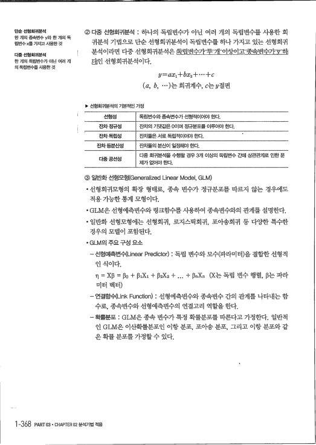
② 다중 선형회귀분석 : 하나의 독립변수가 아닌 여러 개의 독립변수를 사용한 회 단순 선형회귀분석 한 개의 종속변수 y와 한 개의 독 립변수x를 가지고 사용한 것 귀분석 기법으로 단순 선형회귀분석이 독립변수를 하나 가지고 있는 선형회귀 분석이라면 다중 선형회귀분적은 독：릭"벼수가치투개－이상이고쭁속벼수가T히슬 다중 선형회귀분석 댜인 선형회귀분석이다． 한 개의 독립변수가 아닌 여러 개 의 독립변수를 사용한 것

#### y= ax1+ bx2 + ··斗C
(a, b, …）는회귀계수 'C는z／절편

> 선형회귀분석의 기본적인 가정
선형성 독립변수와 종속변수가 선형적이어야 힌F.

잔차 장규성 잔차의 기댓값은 0이며 장규분포를 이루어야 한다． 잔차독립성 잔차들은 서로 독립적이어야 한다． ' 잔차등분산성 잔차들의 뵀이 일정해야 한다． 다중공선성 다중 회귀분석을 수행할 경우 3개 이상의 독립변수 간에 상관관계로 인한 문 제가 없어야 한다． ③ 일반화 선형모형（Generalized Linear Model. G나il)

- 선형회귀모형"의 확장 형태로 , 종속 변수가 정규분포를 따르지 않는 경우에도
적용 가능한 통계 모형이다．

- GLM은 선형예측변수와 링크함수를 사용하여 종속변수와의 관계를 설명한다．
- 일반화 선형모형에는 선형회귀 , 로지스틱회귀 , 포아송회귀 등 다양한 특수한
경우의 모델이 포함된다．

- GLM의 주요 구성 요소
- 선형예측변수《Linear Predictor) : 독립 변수와 모수（파라미터）을 결합한 선형적
인 식이다．

#### ㄲ = Xβ = βO + f31Xj+ 32X2 + . . . + f3nXn 釀는 독립 변수 행렬 , β는 파라
미터 벡터）

- 연결함수《Link Function) : 선형예측변수와 종속변수 간의 관계를 나타내는 함
수로 , 종속변수와선형예측변수의 연결고리 역할을한다 .

#### - 확률분포 : GLM은 종속 변수가 특정 확률분포를 따른다고 가정한다 . 일반적
인 GLM은 이산확률분포인 이항 분포 , 포아송 분포 , 그리고 이항 분포와 같 은 확률 분포를 가정할 수 있다． 1 -368 PART 03· CHAPTER 02분석기법적용

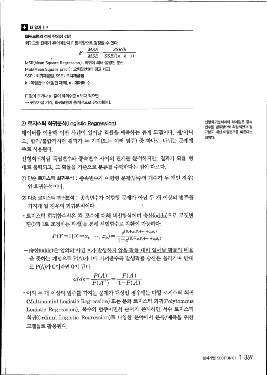
회귀모헝의 전체 유의성 검정 회귀모형 전체가 유의미한지 F 통계량으로 검정할 수 있다．

- 
MSR SSR/k 上’= MSE = SSE/(n-k- i) MSR洶ean Square Regression) : 회귀에 의해 설명된 분산 MSE(Mean Square Error) : 오차（잔차）의 평균 제곱 SSR : 회귀제곱합, SSE : 2I저꼽합 k : 독립변수 수《절편 제외） . n : 데이터 수 F 값이 크거나 p－값이 유의수준 α보다 작으면 → 귀무가설 기각. 회귀모형이 통계적으로 유의미하다． 2) 로지스틱 회귀분석（Logistic,R즐． grqssio.미

#### 데이터를 이용해 어떤 사건이 일어날 확률을 예측하는 통계 모델이다 . 예／아니
#### 오 , 합격／불합격처럼 결과가 두 가지（또는 여러 범주） 중 하나로 나뉘는 문제에
주로 사용된다．

#### 선형회귀처럼 독립변수와 종속변수 사이의 관계를 분석하지만 , 결과가 확률 형
#### 태로 출력되고 , 그 확률을 기준으로 분류를 수행한다는 점이 다르다．
① 단순 로지스틱 회귀분석 : 종속변수가 이항형 문제（범주의 개수가 두 개인 경우） 인 회귀분적이다． ② 다중 로지스틱 회귀분석 : 종속변수가 이항형 문제가 아닌 두 개 이상의 범주를 가지게 될 경우의 회귀분석이다．

- 로지스틱 회귀함수식은 각 모수에 대해 비선형식이며 승산（odds）으로 로짓변
환（0과 1로 조정하는 과정）을 통해 선형함수로 치환이 가능하다． 乙 (Q汁J'lβ汁…＋αt.iD

- . -- 
. -- , e '〃. ' J'lPl I I ＊〃沙7 / . .1 = I I A ='r1, ", Xe,) = -. －ㄴ，, (Q, L=, P, .L…＋z, P , ) ' i- i- e`'J , ' "'IPl I I *.，므，'

- 승쟌山dd비우7임의의츠Ii건A기셋팼희쾨ㅍ잃貧E획貧쫴비－압어날뺙塾 E비을 
을 뜻하는 개념으로 P(A）가 1에 가까울수록 발생확률 승산은 올라가며 반대 로 P(A）가 0이라면 0이 된다．

# 0欌5= P(A)
odds= P(Ac) = , P (A i-P(치

- 이외 두 개 이상의 범주를 가지는 문제가 대상인 경우에는 다항 로지스틱 회귀
(Multinomial Logistic Regression) 또는 분화 로지스틱 회귀（Polytomous

#### Logistic Regression) , 복수의 범주이면서 순서가 존재하면 서수 로지스틱
회귀（Ordinal Logistic Regression）로 다양한 분야에서 분류／예측을 위한 모델들로 활용된다．

> 선형회귀분석과의 차이점은 종속
> 변수를 범주형으로 확장하였고 정
> 규분포 대신 이항분포를 따른다는
> 점이다．
> 분석기법 SECTION 01 1 -3枓
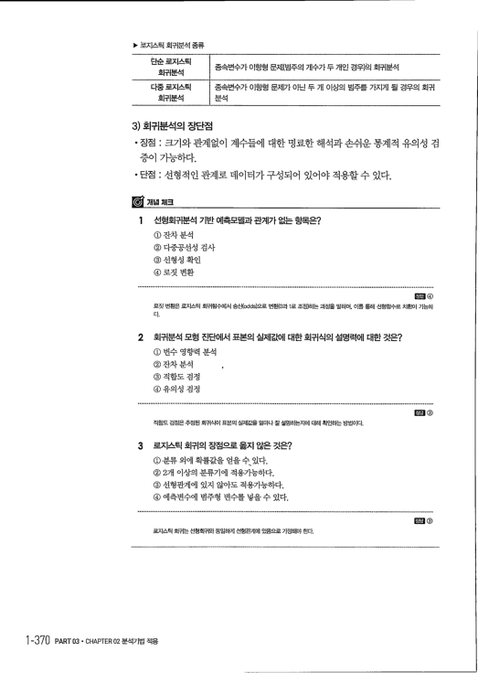
> 數 스틱 회귀분석 종류
단순 로지스틱 회귀분석 종속변수가 이항형 문제（범주의 개수가두 개인 경우）의 회귀분석 다중 로지스틱 회귀분석 종속변수가 이항형 문제가 아닌 두 개 이상의 범주를 가지게 될 경우의 회귀 분석 3) 회귀분석의 징茫，점

#### · 장점 : 크기와 관계없이 계수들에 대한 명료한 해석과 손쉬운 통계적 유의성 검
증이 가능하다．

#### · 단점 : 선형적인 관계로 데이터가 구성되어 있어야 적용할 수 있다．
1 선형회귀분석 기반예측모델과관계가없는항목은？ ① 잔차 분석 ② 다중공선성 검사 ③ 선형성 확인 ④ 로짓 변환 로짓 변횐은 로자스틱 회귀함수에서 쇳卜（odds》으로 변환（0과 1로 조정）하는 과정율 말하며 . 이름 통해 선형함수로 치환이 가능하 다． 2 회귀분석 모형 진단에서 표본의 실제값에 대한 회귀식의 설명력에 대한 것은？ ① 변수 영힝웍 분석 ② 잔차 분석 ． ③ 적합도 검정 ④ 유의성 검정 적합도 검韆추정된 회귀식이 표본의 실제값을 얼마나 잘 설명하는지에 대해 확인하는 방법이다． 3 로지스틱 회귀의 장점으로 옳지 않은 것은？ ⑩분류 외에 확률값을 얻을수 있다． ② 2개 이상의 분류기에 적용가능하다． ③ 선형관계에 있지 않아도 적용가능하다． ④ 예측변수에 범주형 변수를 넣을 수 있다． 로자스틱 회귀논 선형회귀와 동일하게 선형관계에 있음으로 가정해야 한다． E70 PART 03* CHAPTER 02분석기법적용

> j 
④

> ㅁ래③
> 呱 （珍
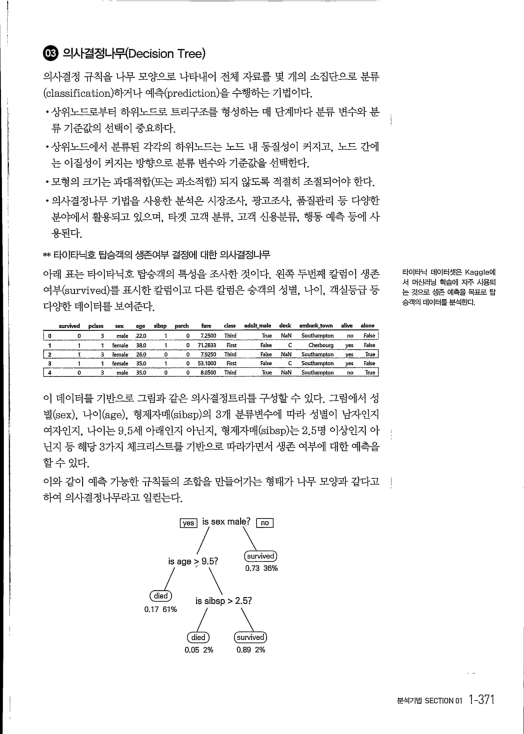
#### . 
의사결정나무（Decision Tree) 의사결정 규칙을 나무 모양으로 나타내어 전쳬 자료를 몇 개의 소집단으로 분류 (classification）하거나 예측（prediction）을 수행하는 기법이다．

- 상위노드로부터 하위노드로 트리구조를 형성하는 매 단계마다 분류 변수와 분
류 기준값의 선택이 중요하다．

- 상위노드에서 분류된 각각의 하위노드는 노드 내 동질성이 커지고 , 노드 간에
는 이질성이 커지는 방향으로 분류 변수와 기준값을 선택한다．

- 모형의 크기는 과대적합（또는 과소적힙） 되지 않도록 적절히 조절되어야 한다．
- 의사결정나무 기법을 사용한 분적은 시장조사 , 광고조사 , 품질관리 등 다양한
분야에서 활용되고 있으며 , 타겟 고객 분류 , 고객 신용분류 , 행동 예측 등에 사 용된다． ** 타이타닉호 탑승객의 츤婚여부 결정에 대한 의사결정나무

#### 아래 표는 타이타닉호 탑승객의 특정을 조사한 것이다 . 왼쪽 두번째 칼럼이 생존
여부（survived）를표시한칼럼이고 다른칼럼은승객의 성별 , 나이 , 객실등급등 다양한 데이터를 보여준다． eurvived pclass sex age sibsp parch fare dass ad띠tm미.

deck embarl《렘town alive .b＂· l 0 0 3 male

22. 0 
1 1 1 ()

7. 2500 
Third True NaN Southampton no False ; （〕

71. 2833 
First False C 《汁．erbourg yes False 1 female

38. 0 
1 3 ten,비C 26．〔） 1 female

35. 0 
0 1 0 7·9250 가lird False NaN Southamp yes 1 2 ()

53. 1000 
First False C Southampton yes False 3 1 True l 4 0 3 male

35. 0 
0 0

8. 0500 
ThIrd True NaN Southampton no 이 데이터를 기반으로 그림과 같은 의사결정트리를 구성할 수 있다 . 그림에서 성 별（sex) , 나이（age) , 형제자매（sibsp）의 3개 분류변수에 따라 성별이 남자인지 여자인지 , 나이는 9.5세 아래인지 아닌지 , 형제자매（sibsp）는 2.5명 이상인지 아 닌지 등 해당 3가지 쳬크리스트를 기반으로 따라가면서 생존 여부에 대한 예측을 할 수 있다． 이와 같이 예측 가능한 규칙들의 조합을 만들어가는 형태가 나무 모양과 같다고 하여 의사결정나무라고 일컫는다． is sex mate? [ 1 恤 is age > 9.5?

0. 73 36%
is sibsp > 2.5?

0. 17 81%
0. 05 2% 
0. 89 2%
> 타이타닉 데이터셋은 Kag이e에 
서 머신러닝 학습에 차주 사용되 는 것으로 삳뜬 예측을 목표로 탑

> 승객의 데이터를 분석한다．
> True ㅣ
> 분석기법 SECTION 01 1 -371
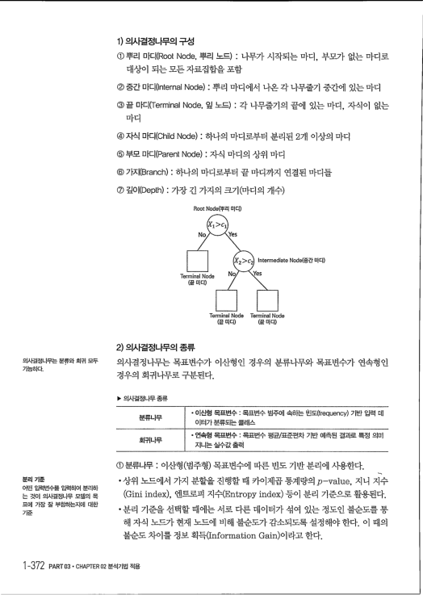
1) 의사결정나무의 구성 ①뿌리 마디（Root Node , 뿌리 뜨） ' 나무가 시작되는 마디 , 부모가 없는 마디로 대상이 되는 모든 자료집합을 포함 ② 중간 마디(Internal Node쟈 뿌리 마디에서 나온 각 나무줄기 중간에 있는 마디

#### ③끝 마디（Terminal Node , 잎 노드） : 각 나무줄기의 끝에 있는 마디 , 자식이 없는
마디 ④ 자식 마디（Child Node) : 하나의 마디로부터 분리된 2개 이상의 마디 ⑤ 부모 마디（Parent Node) : 자식 마디의 상위 마디 ⑥ 가지（Branch) : 하나의 마디로부터 끝 마디까지 연결된 마디들

#### ⑦ 갚이（Depth) : 가장 긴 가지의 크기（마디의 개수）
Root Node(뿌리 마디） Intermediate Node（중간 마디》 Ye5 To minal Node （끝 마디） Terminal Node Terminal Node （끝마디） （끝마디） 2) 의사결정나무의 종류 의사결정나무는 목표변수가 이산형인 경우의 분류나무와 목표변수가 연속형인 의사결정나뜬 분류와 회귀 모두 가능하다． 경우의 회귀나무로 구분된다．

> 의사결정나무종류
분류나무

- 이산형 목표변수 : 목표변수 범주에 속하는 빈도（frequency) 기반 입력 데
이터가 분류되는 클래스 회귀나무

- 연속형 목표변수 : 목표변수 평균／표준편차 기반 예측된 결과로 특정 의미
지니는실수값출력 ① 분류나무 : 이산형（범주형） 목표변수에 따른 빈도 기반 분리에 사용한다．

- 상위 노드에서 가지 분할을 진행할 때 카이제곱 통계량의 β-value , 지니 지수 
(Gini index) , 엔트로피 지수（Entropy index）등이 분리 기준으로 활용된다． 분리 기준 어떤 입력변수를 입력하여 분리하 는 것이 의사결정나무 모델의 목 표에 가장 잘 부합하는지에 대한

- 분리 기준을 선택할 때에는 서로 다른 데이터가 섞여 있는 정도인 불순도를 통
기준 해 자식 노드가 현재 노드에 비해 불순도가 감소되도록 설정해야 한다 . 이 때의 불순도 차이를 정보 획득（Information Gain）이라고 한다． 1-372 PART 03. CHAPTER 02분석기법적용

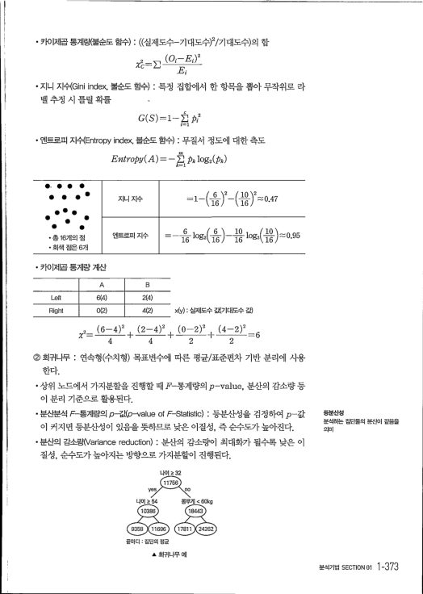
- 카이제곱통계량（불순도 함수） : (（실제도수－기대도수）2／기대도수）의 합
# 2_
Xc -刀 （α'了ii

#### · 지니 지쉬Gini index, 불순도 함수） : 특정 집합에서 한 항목을 뽑아 무작위로 라 
벨 추정 시 틀릴 확률

#### G(S)=1-
1九“

- 엔트로피 지수《Entropy index , 불순도 함수） : 무질서 정도에 대한 측도
#### (
) Entropy

#### 지니 지수 
=1-(-6Y- (10.'s2;=0 . 47 \ 1.b / \ l.b / ● ● .

● ● ● .

S

- 
- 
6 log2 엔트로피 지수

- 총 16개의 점
-)_

- 
- -)

- 
--I-

- 회색 점은 6개
- 카이제곱 통계량 계산
A B Left 6(4) 2(4) Right 0(2) 4(2) x(y) : 실제도수 값（기대도수 값） 4) z느 " =6 4 4 2 2

#### ② 회귀나무 : 연속형（수치형） 목표변수에 따른 평균／표준편차 기반 분리에 사용
한다．

- 상위 노드에서 가지분할을 진행할 때 ／고－통계량의 β-value , 분산의 감소량 등
이 분리 기준으로 활용된다．

#### · 분산분석 /＝ㄴ통계량의 ／〕－값〈p-value of F-Statistic) : 등분산성을 검정하여 β－값
이 커지면 등분산성이 있음을 뜻하므로 낮은 이질성 , 즉순수도가높아진다．

- 분산의 감소링＜Variance reduction) : 분산의 감소량이 최대화가 될수록 낮은 이
질성 , 순수도가높아지는방향으로가지분할이 진행된다． 나이 뇬 32 나이 논 54 몸무게 <60kg 끝마디 = 집단의 펑균 ▲ 회귀나무 예

> 95
> 등분산성
> 분석하는 집단들의 붕난이 같음을
> 의미
> 분석기법 SECTION 01 1-373
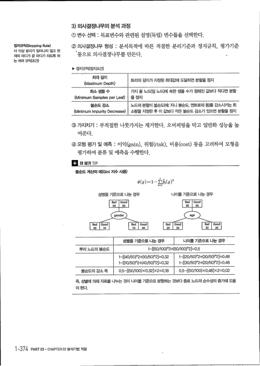
3) 의사결정나무의 분석 과정

#### ① 변수 선택 : 목표변수와 관련된 설명（독립） 변수들을 선택한다．
#### ② 의사결정나무 형성 : 분석목적에 따른 적절한 분리기준과 정지규칙 , 평가기준
정지규칙（Stopping Rule) 더 이상 분리가 일어나지 않고 현 재의 마디가 끝 마디가 되도록 하 는 여러 규칙（조건） " 등으로 의사결정나무를 만든다．

> 정지규칙（정지조건）
최대 깊이 (Maximum Depth) 트리의 깊이가 지정된 최대값에 도달하면 분할을 정지 가지 끝 노드（잎 노드）에 속효艸搢 수가 정해진 값보다 작다면 분할 최소 샘플 수 (Minimum Samples per Leaf) 을 정지 불순도 감소 노드의 분할이 불순도（예： 지니 불순도 엔트로피 등）를 감소시키는 최 소량을 지정한 후 이 값보다 작은 불순도 감소가 있으면 분할을 정지 (Minimum Impurity Decrease)

#### ③ 가지치기 : 부적절한 나뭇가지는 제거한다 . 오버피팅을 막고 일반화 성능을 높
여준다．

#### ④모형 평가 및 예측 : 이익（납am끄) , 위험（risk) , 비용（cost) 등을 고려하여 모형을
평가하며 분류 및 예측을 수행한다． .

더 알기 TIP 불순도 계산의 예（Gini 지수사용）

#### 熒(g) =1_飾1(g)2
성별을 기준으로 나눈 경우 나이를 기준으로 나눈 경우 성별을 기준으로 나눈 경우 나이를 기준으로 나눈 경우 뿌리 노드의 불순도 1_[(5o/1oo)A2l(5o/10or21=O.5 1_[(10/50Y2l(40/50Y2]=O.32 1-[(20/50r2+(30/50Y2]=O.48 1-[(30/50r2+(20/50r21=o.48 1-[(40/50) 2-l-(10/50Y'2]=O.32 불순도의 감소 폭

0. 5-[(50/100)XO.3211X2=0.18 
0. 5-[(50/100)XO.481X2==0.02
즉. 성별에 의해 자료를 나누는 것이 나이를 기준으로 분할하는 것보다 종료 노드의 순수셩의 증가에 도움 이 된다． 1-374 PART 03. CHAPTER 02분석기법적용

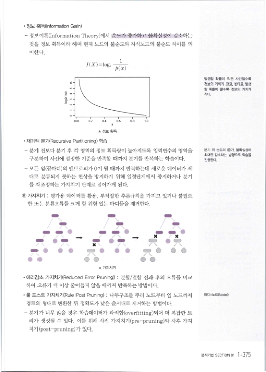
- 정보 획득心nformation Gain)
- 정보이론（Information Theory）에서 순도가 증가하고 불확실성이 감소하는
것을 정보 획득이라 하며 현재 노드의 불순도와 자식노드의 불순도 차이를 의 미한다．

#### /（兀）=log ,  . .1
I (X)=l。

g2 ／가z7 뗘 얍 m 직 ∼ 혼 ∼ ∼ 염 ㅇ - ’。.8 。

2 ,

0. 
崙 정보 획득

- 재귀적 분기（Recursive Partitioning) 학습
- 분기 전보다 분기 후 각 영역의 정보 획득량이 높아지도록 입력변수의 영역을
구분하여 사전에 설정한 기준을 만족할 때까지 분기를 반복하는 학습이다．

- 모든 잎（끝마디）의 엔트로피가 0이 될 때까지 반복하는데 새로운 데이터가 제
대로 분류되지 못하는 현상을 방지하기 위해 일정단계에서 중지하거나 분기 를 재조정하는 가지치기 단계로 넘어가게 된다．

#### ⑤ 가지치기 : 평가용 데이터를 활용 , 부적절한 추론 干칙을 가지고 있거나 불필요 
한 또는 분류오류를 크게 할 위험 있는 마디들을 제거한다．

- 
- 甘 
. /

#### .. 
臘 釀 締 ● 蠟 ▲ 가지치기

#### · 에러감소 가지치기（Reduced Error Pruning) : 분할／결합 전과 후의 오류를 비교
하여 오류가 더 이상 줄어들지 않을 때까지 반복하는 방법이다．

#### · 룰 포스트 가지치기（Rule Post Pruning) : 나무구조를 뿌리 노드부터 잎 노드까지
경로의 형태로 변환한 뒤 정확도가 낮은 순서대로 제거하는 방법이다．

- 분기가 너무 많을 경우 학습데이터가 과적합（overfitting）되어 더 복잡한 트
#### 리가 생성될 수 있다 . 이를 위해 사전 가지치기仕）re-pruning）와 사후 가지
치기（post-pruning）가 있다 .

> 발생할 확률이 작은 사건일수록
> 정보의 가치가 크고 . 반대로 발생 
할 확률01 클수록 정보의 가치가

> 작다．
> 분기 뒤 순도의 중가 , 블확실성이 
최대한 감소하는 방향으로 학습을

> 진행흰ㅐ각．
> 마디＝노드的ode)
> 분석기법 SECTION 01 1 -375
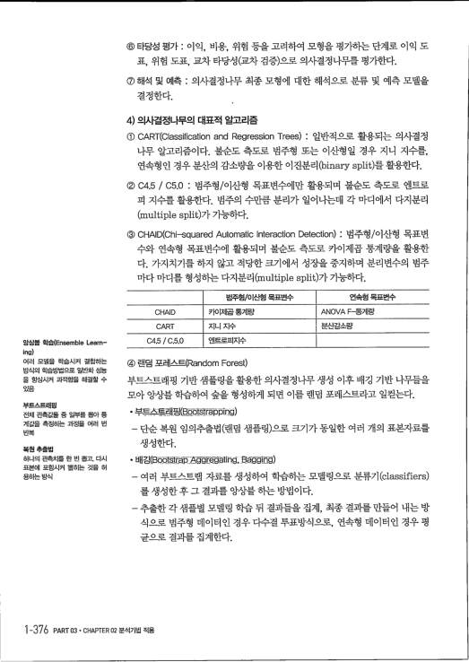
#### ⑥ 타당성 평가 : 이익 , 비용 , 위험 등을 고려하여 모형을 평가하는 단계로 이익 도
표 , 위험 도표 , 교차타당성（교차 검증）으로 의사결정나무를 평가한다．

#### ⑦ 해석 및 예측 : 의사결정나무 최종 모형에 대한 해석으로 분류 및 예측 모델을
결정한다． 4) 의사결정나무의 대표적 알고리즘 ①CART(Classification and Regression Trees) : 일반적으로 활용되는 의사결정 나무 알고리즘이다 . 불순도 측도로 범주형 또는 이산형일 경우 지니 지수를， 연속형인 경우 분산의 감소량을 이용한 이진분리（binary split）를 활용한다． ②C4.5 I 05.0 : 범주형／이산형 목표변수에만 활용되며 불순도 측도로 엔트로

#### 피 지수를 활용한다 . 범주의 수만큼 분리가 일어나는데 각 마디에서 다지분리
(multiple split）가 가능하다． ③CHAID(Chi-sguared Automatic Interaction Detection) : 범주형／이산형 목표변 수와 연속형 목표변수에 활용되며 불순도 측도로 카이제곱 통계량을 활용한

#### 다 . 가지치기를 하지 않고 적당한 크기에서 성장을 중지하며 분리변수의 범주
#### 마다 마디를 형성하는 다지분리（multiple split）가 가능하다 .
범주형／이산형 목표변수 연속형 목표변수 아씨D 카이저굡통계량 ANOVA F통계량 CART 지니 지수 분산감소량 C4.5 / C.5.O 엔트로피지수 앙상블 학습《Ensemble Learn- ing) 여러 모델을 학습시켜 결합하는 방식의 학습방법으로 일반화 성능 을 향상시켜 과적합을 해결할 수 있음 ④ 랜덤 포레스트（Random Forest) 부ㅌㅅㅌ래핑 기반 샘플링을 활용한 의사결정나무 생성 이후 배깅 기반 나무들을 모아 앙상블 학습하여 숲을 형성하게 되면 이를 랜덤 포레스트라고 일컫는다． 부트스트래핑

- 부두즈트래핑（터亘히trapi in이
전체 관측값들 중 일부를 뽑아 통 계값을 측정하는 과정을 여러 번 반복

- 단순 복원 임의추출법（랜덤 샘플링）으로 크기가 동일한 여러 개의 표본자료를
생성한다． 복원 추출법

- 배깅（B＜須頂tran거酉ㅁ頂百拗n戚B版自gi巨百）
ㅎㅐ』의 관측치를 한 번 뽑고， 다시 표본에 포함시켜 " 뽑히는 것을 허 용히는 방식

- 여러 부ㅌㅅㅌ랩 자료를 생성하여 학습하는 모델링으로 분류기（classifiers)
를 생성한 후 그 결과를 앙상블 하는 방법이다．

- 추출한 각 샘플별 모델링 학습 뒤 결과들을 집계 , 최종 결과를 만들어 내는 방
식으로 범주형 데이터인 경우 다수결 투표방식으로 , 연속형 데이터인 경우 평 균으로 결과를 집계한다． 1-376 PART 03· CHAPTER 02분석기법적용

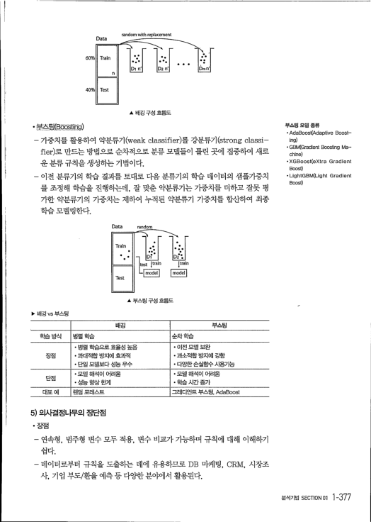
random with replacement Data 60% 40% ▲ 배깅 구성 흐름도

- 부스팅）煌亘顚i勺)
- 가중치를 활용하여 약분류기（weak classifier）를 강분류기（strong classi-
fier）로 만드는 방법으로 순차적으로 분류 모델들이 틀린 곳에 집중하여 새로 운 분류 규칙을 생성하는 기법이다．

- 이전 분류기의 학습 결과를 토대로 다음 분류기의 학습 데이터의 샘플가중치 
를 조정해 학습을 진행하는데 , 잘 맞춘 약분류기는 가중치를 더하고 잘못 평 가한 약분류기의 가중치는 제하여 누적된 약분류기 가중치를 합산하여 최종 학습 모델링한다． Data random

#### =j
▲ 부스팅 구성 흐름도 》 배깅 vs 부스팅 배깅 부스팅 학습 방식 병렬 학습 순차학습

- 이전 모델 보완
- 병렬 학습으로 효율성 높음
- 과소적합 방지에 강함
- 과대적합 방지에 卽 적
장점

- 단일 모델보다 성능 우수
- 다양한손실함수 사용가능
단점

- 모델 해석이 어려움
- 모델 해석이 어려움
- 힌階 시간증가
- 성능 향상 한계
대표 예 랜덤 포레스트 그래디언트부스팅 . AdaBoost 5) 의사결정나무의 장단점

- 장점
- 연속형 , 범주형 변수 모두 적용 , 변수 비교가 가능하며 규칙에 대해 이해하기
쉽다．

- 데이터로부터 규칙을 도출하는 데에 유용하므로 DB 마케팅 , ORM , 시장조
사, 기업 부도／환율 예측 등 다양한 분야에서 활용된다．

> 부스팅 모델 좀류 
- AdaBoost(Adaptive Boost-
> ing) 
- GBM(Gradient Boosting Ma-
chine)

- XGBoost(eXtra Gradient 
Boost)

- LightGBM(Light Gradient 
Boost)

#### 분석기법 SECTION 01 E77
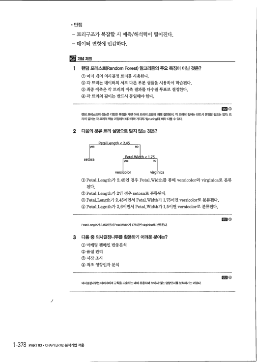
- 단점
- 트리구조가 복잡할 시 예측／해석력이 떨어진다．
- 데이터 변형에 민감하다．
1 랜덤 포레스트（Random Forest) 알고리즘의 주요 특징이 아닌 것은？ ① 여러 개의 의사결정 트리를 사용한다． ② 각 트리는 데이터의 서로 다른 부분 샘플을 사용하여 학습된다． ③ 최종 예측은 각 트리의 예측 결과를 다수결 투표로 결정한다． ④ 각 트리의 깊이는 반드시 동일해야 한다． 랜덤 포레스트의 성능은 다양한 특짐을 가진 여러 트리의 조합에 의해 결정되며． 각 트리의 깊이는 반드시 동일할 필요는 없다. 트 리의 깊이는 각 트리의 학습 과정에서 데이터와 가지치기（pruning）어I 따라 다를 수 있다． 2 다음의 분류트리 설명으로 맞지 않는 것은？ P-t.IL- eth< 245 yes no setosa PetaLWi츨댜， < 1.75 yes no versicolor virg nica CD Petal.Length가 2.45인 경우 Petal.Width를 통해 versicolor와 virginica로 분류 된다． ②Petal.Length가 2인 경우 setosa로 분류된다． ③Petal.Length가 2.45이면서 Petat Width가 1.75이면 versicolor로 분류된다． ④ Petal.Legnth가 2.6이면서 Petal.Width가 1.5이면 versicolor로 분류된다． Petal.Length가2.45이면서 PelatWidlh가1.75이먼 virgirricaa 분류된다． 3 다음중의사결정나두를활용하기 어려운분야는？ ① 마케팅 캠페인 반응분석 ② 품질 관리 ③ 시장 조사 ④ 적조 영향인자 분석 의사결정나무는 데이터에서 규칙을도출하는 데에 유용하며 보이지 않는 영향인자를 분석하기는 어렵다． I 1 -378 PART 03· CHAPTER 02분석기법적용

> ．레 ④
> 뎔目 ③
> En ④
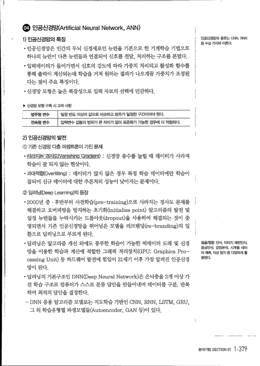
.

인공신경망（Artificial Neural Network, ANN) 1) 인공신경망의 특징

- 인공신경망은 인간의 두뇌 신경세포인 뉴런을 기본으로 한 기계학습 기법으로
하나의 뉴런이 다른 뉴런들과 연결되어 신호를 전달 , 처리하는 구조를 본떴다．

- 입력데이터가 들어가면서 신호의 강도에 따라 가중치 처리되고 활성화 함수를
통해 출력이 계산되는데 학습을 거쳐 원하는 결과가 나오게끔 가중치가 조정된 다는 점이 주요 특징이다．

- 신경망 모형은 높은 복잡성으로 입력 자료의 선택에 민감하다．
* 신경망 모형 구축 시 고려 사항
범주형 변수 일정 빈도 이상의 값으로 비슷하고‘범주가 일정한구간이어야 힌다． 연속형 변수 입력변수 값들의 범위가 큰 차이가 없어 표준화가 가능한 경우에 더 적합하다． 2) 인공신경망의 발전 ① 기존 신경방 다층 퍼셉트론이 가진 문제 래H지튼켱차도（Vani騙iiii Gr百dI否蹴） : 신경망 층수를 늘릴 때 데이터가 사라져 학습이 잘 되지 않는 현상이다．

#### · 과대적합(Overfitting) : 데이터가 많지 않은 경우 특정 학습 데이터에만 학습이
#### 잘되어 신규데이터에 대한추론처리 성능이 낮아지는문제이다 . 
ㅣ ② 딥러닝（Deep Learning）의 등장

- 2000년중· 후반부터사전학습（pre-training）으로사라지는경사도문제를 
- 해결하고 오버피팅을 방지하는 초기화〈initialize point) 알고리즘의 발전 및 일정 뉴런들을 누락시키는 드롭아웃（dropout）을 사용하여 해결되는 것이 증 명되면서 기존 인공신경망을 뛰어넘은 모델을 리브랜딩（re-branding）의 일 - 환으로딥러닝으로부르게 된다 .

ㅣ

- 딥러닝은 알고리즘 개선 외에도 풍부한 학습이 가능한 빅데이터 도래 및 신경
망을 이용한 학습과 계산에 적합한 그래픽 처리장치（GPU: Graphics Pro- cessing Unit) 등 하드웨어 발전에 힘입어 21세기 이후 가장 알려진 인공신경 망이 된다．

- 딥러닝의 기본구조인 DNN(Deep Neural Network）은 은닉층을 2개 이상 가
진 학습 구조로 컴퓨터가 스스로 분류 답안을 만들어내며 데이터를 구분 , 반복 하여 최적의 답안을 결정한다 .

-DNN 응용 알고리즘모델로는 지도학습 기반인 CNN, RNN, LSTM, GRU, 그 외 학습유형별 파생모델들（Autoencoder, GAN 등）이 있다 .

> 인공신경망의 종류는 CNN. RNN 
등 수십 가지에 이른다．

> -
> 얼굴／행동 인식 . 이미지 패턴인식， 
음성인식 . 감정분석 . 시계열 데이 터 예측. 이상 탐지 등 다양하게 활 용된다．

> 분석기법 SECTION 01 1-379
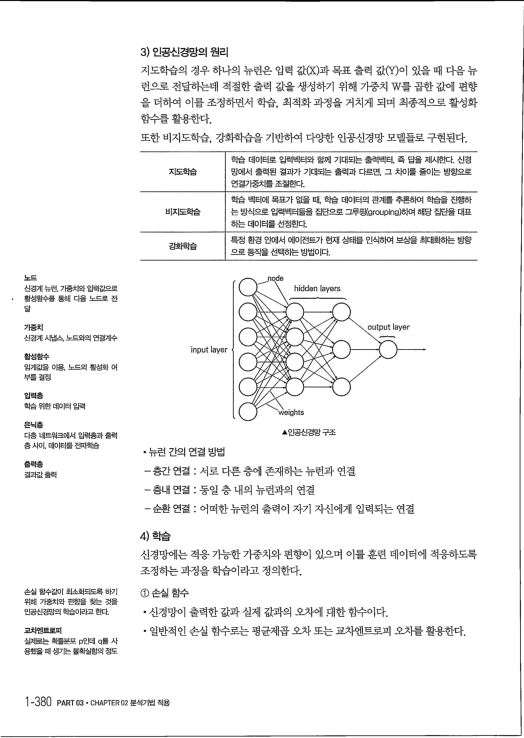
3) 인공신경망의 원리 지도학습의 경우 하나의 뉴런은 입력 값（x）과 목표 출력 값（Y）이 있을 때 다음 뉴

#### 런으로 전달하는데 적절한 출력 값을 생성하기 위해 가중치 ￦를 곱한 값에 펀향 
을 더하여 이를 조정하면서 학습 , 최적화 과정을 거치게 되며 최종적으로 활성화 함수를 활용한다．

#### 또한 비지도학습 , 강화학습을 기반하여 다양한 인공신경망 모델들로 구현된다．
학습 데이터로 입력벡터와 함꺼l 기대되는 출력벡터 , 즉 답을 제시한다. 신경 망에서 출력된 결과가 기대되는 출력과 다르면 . 그 차이를 줄이는 방향으로 지도힉階 연결가중치를 조절한다． 학습 벡터에 목표가 없을 때 , 학습 데이터의 관계를 雜룅하여 학습을 진행하 는 방식으로 입력벡터들을 집단으로 그루핑（grouping）하여 해당 집단을 대표 비지도학습 하는 데이터를 선정한다． 김膏학습 특정 환경 안에서 에이전트가 현재 상태를 인식하여 보상을 최대화하는 방향 으로 동작을 선택하는 방법이다． 누 ㄷ hidden layers 신경계뉴런 . 가중치와입력값으로 활성함수를 통해 다음 노드로 전 달 가중치 신경계 시냅스긍＝드와의 연결澣 input layer 4 활성함수 임계값을 이용. 노드의 활성화 여 부를 결정 입력층 학습 위한 데이터 입력 은닉층 ▲인공신경망구조 다층 네트워크에서 입력층과 출력 층사이 . 데이터를전파학습

- 뉴런 간의 연결 방법
출력층

- 층간 연결 : 서로 다른 층에 존재하는 뉴런과 연결，
결과값출력

- 층내 연결 : 동일 층 내의 뉴런과의 연결
－순환 연결 : 어떠한 뉴런의 출력이 자기 자신에게 입력되는 연결 4）학습 신경망에는 적응 가능한 가중치와 편향이 있으며 이를 훈련 데이터에 적응하도록 조정하는 과정을 학습이라고 정의한다． ① 손실 함수 손실 함수값이 최소화되도록 하기 위해 가중치와 편향을 찾는 것을

- 신경망이 출력한 값과 실제 값과의 오차에 대한 함수이다．
인공신경망의 학습이라고 한다．

- 일반적인 손실 함수로는 평균제곱 오차 또는 교차엔트로피 오차를 활용한다．
교차엔트로피 실저隱는 확률분포 p인데 q를 사 용했을 때 생기는 불확실함의 정도 1-380 PART 03. CHAPTER 02분석기법적용

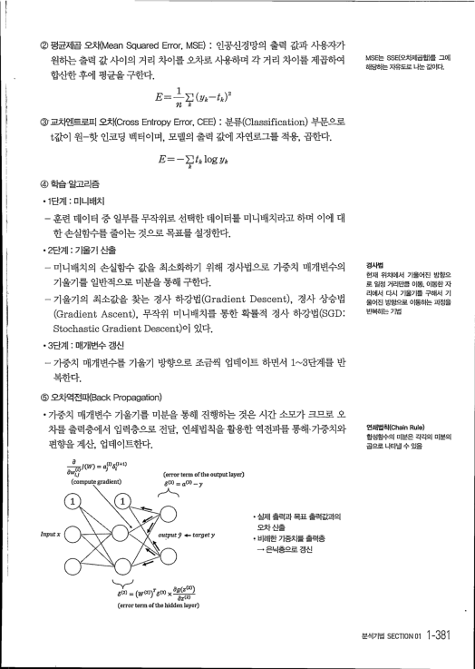
② 평균제곱 도차(Mean Squared Error, MSE) : 인공신경망의 출력 값과 사용자가 원하는 출력 값 사이의 거리 차이를 오차로 사용하며 각 거리 차이를 제곱하여 합산한 후에 평균을 구한다．

#### E= ---＞〕 (yk-tk)2 
fl  k ③ ' 교차엔트로피 오차（Cross Entropy Error, CEE) : 분류（Classification) 부문으로 t값이 원－핫 인코딩 벡터이며 , 모델의 출력 값에 자연로그를 적용 , 곱한다．

#### E= －끄tk log Yk
④ 학습 " 알고리즘

#### · 1단계 : 미니배치
- 훈련 데이터 중 일부를 무작위로 선택한 데이터를 미니배치라고 하며 이에 대
한 손실함수를 줄이는 것으로 목표를 설정한다．

#### ·2단계 : 기울기 산출
- 미니배치의 손실함수 값을 최소화하기 위해 경사법으로 가중치 매개변수의
기울기를 일반적으로 미분을 통해 구한다．

- 기울기의 최소값을 찾는 경사 하강법（Gradient Descent) , 경사 상승법
(Gradient Ascent) , 무작위 미니배치를 통한 확률적 경사 하강법（SGD:

Stochastic Gradient Descent) ] 9)다.

.3단계 : 매개변수 갱신

#### - 가중치 매개변수를 기울기 방향으로 조금씩 업데이트 하면서 1'-3단계를 반
복한다． ⑤ 도톼역전파（Back Propagation)

- 가중치 매개변수 기울기를 미분을 통해 진행하는 것은 시간 소모가 크므로 오
차를출력층에서 입력층으로전달 , 연쇄법칙을활용한 역전파를통해，가중치와

#### 편향을계산 , 업데이트한다 .
## -40J(W)＝궁"하"'"
(compute gradient) (error term of the output layer) 6 (3) =at3)-y r군，

- 실제 출력과 목표 출력값과의
오차산출 Inputx output 夕 눼 - targety 뗀 비례한 가중치를 출력층 → 은닉층으로 갱신 (2) ,dg(z(2) （2)）盼 (3) X (2) (error term of the hidden layer)

> MSE는 SSE（오차제곱합）를 그에
> 해딩히는 지유도로 니눈 값이다．
> 경사법
> 현재 위치에서 기울어진 방향으 
로 일정 거리만큼 이동, 이동한 자 리에서 다시 기울기를 구해서 기 울《거진 방향으로 이동하는 과정을

> 반복ㅎㅐ크 기법
> 연쇄법칙（Chain Rule)
> 합성함수의 미분은 각각의 미분의 
곱으로 나타낼 수 있음

> 분석기법 SECTION 01 1-381
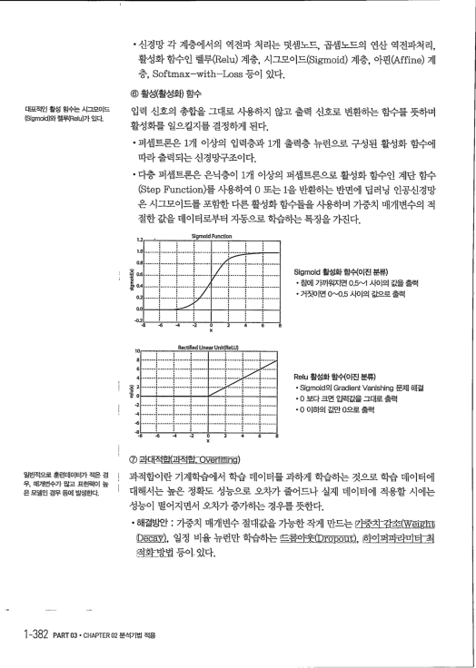
#### ' 신경망 각 계층에서의 역전파 처리는 덧셈노드 , 곱셈노드의 연산 역전파처리， 
활성화 함수인 렐루（Relu) 계층 , 시그모이드（Sigmoid) 계층 , 아핀（Affine) 계 층 , Softmax-with-Loss 등이 있다． ⑥ 활성（활성화） 함수 입력 신호의 총합을 그대로 사용하지 않고 출력 신호로 변환하는 함수를 뜻하며 활성화를 일으킬지를 결정하게 된다． 대표적인 활성 함수는 시그모이드 (Sigmoid）와 렐루《Relu）가 있다．

- 퍼셉트론은 1개 이상의 입력층과 1개 출력층 뉴런으로 구성된 활성화 함수에 
따라 출력되는 신경망구조이다．

- 다층 퍼셉트론은 은닉층이 1개 이상의 퍼셉트론으로 활성화 함수인 계단 함수 
(Step Function）를 사용하여 0 또는 1을 반환하는 반면에 딥러닝 인공신경망 은 시그모이드를 포함한 다른 활성화함수들을 사용하며 가중치 매개변수의 적 절한 값을 데이터로부터 자동으로 학습하는 특징을 가진다． Sigrnold Function

# Sigmoid 활성화 함수《이진 분류） 
· 참에 가까워지면 O.5' 1 사이의 값을 출력 · 거짓이면 0- O.5 사이의 값으로 출력 , 71 1  - `z 汕 醜 妬 M 醱 2 蒼 。

ㅌ 므 ＂ 凹 似 쐽

* 
' a 5 4 '2 4 뿌6

# Relu 활성화 함수（이진 분류） 
·Sigmoid의 Gradient Vanishing 문제 해결 ·o 보다 크면 입력값을 그대로 출력 · 0 이하의 값만 0으로 출력 / Rectified Linear Unlt(ReL1J) 一 즘 겯 ㅢ ，

- ．＊
鞠， 욜맣r， ㅗ｀＇솥

- 결·
｀r·，·． 수． ＊·t '.

＋...T， .T·~ 名 ~6 -4 -2 〔 〕 2 4 6 .

x ⑦ 과대적합（고쩜합p5頂聊聊百） 과적합이란 기계학습에서 학습 데이터를 과하게 학습하는 것으로 학습 데이터에 대해서는 높은 정확도 성능으로 오차가 줄어드나 실졔 데이터에 적용할 시에는 일반적으로 훈런데이터가 적은 경 우. 매개변수가 많고 표현력이 높 은 모델인 경우 킁게 발생한다． 성능이 떨어지면서 오차가 증가하는 경우를 뜻한다．

- 해결방안 : 가중치 매개변수 절대값을 가능한 작게 만드는 z隱玖즈갔흐（w蘆흥h七
#### D巨乙ㅍ치 , 일정 비율뉴런만학습하는드：록아우(Dropoiit>, 하이파파라끼더긔
역화갼싣l［법 등이o1Ak다． 1-382 PART 03. CHAPTER 02분석기법적용

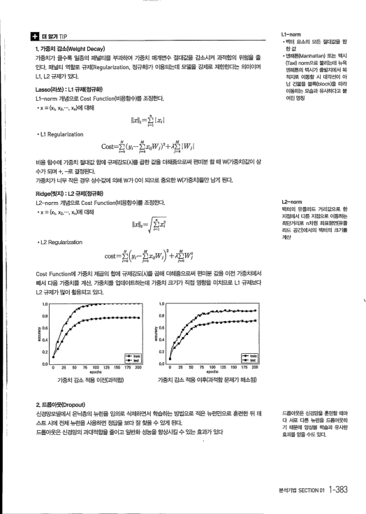
1 . 기중치 감소（wei야it Decay) 가중치가 클수록 일종의 패널티를 부과하여 가중치 매개변수 절대값을 감소시켜 과적합의 위험을 줄 인다 . 패널티 역할로 규제（Regularization , 정규화）가 이용되는데 모델을 강저扈 제한한다는 의미이며 Li. L2구제가있다． Lasso（리쏘） = Li i구ㅈㅔ（정규화） Li-norm 개념으로 Cost Function（비용함수）를 조정한다．

- x = (x1 , x2 . ··· , xn）에 대해
＂ 刀 淘 싸 了

- Li Regularization
## Cost=囊(yj_執Wj)2+嘗Wi'
비용 함수에 가중치 절대값 합에 규제강도（ㅅ）를 곱한 값을 더해줌으로쩌 편미분 할 때 w（가중치）값이 상 수가 되며 +. －로 결정된다． 가중치가 너무 작은 경우 상수값에 의해 w가 0이 되므로 중요한 w（가중치）들만 남게 된다． Ridge（릿지） : L2 규제（장규화） L2-norm 개념으로 Cost Function（비용함수）를 조정힌다．

- x= (x1, x2, ·". x5）에 대해
### ·L2 Regularization 
IIX2:／愈X \2 ＋ㅅ o8t= x15W1) +A W cost= NI〃 O j O j= O Cost Function에 가중치 제곱의 합에 규제강도（^）를 곱해 더해줌으로써 편미분 값을 이전 가중치에서 빼서 다음 가중치를 계산, 가중치를 업데이트하는데 가중치 크기가 직접 영향을 미치므로 Li 규제보다 L2 규제가 많이 활용되고 있다．

1. 0  
1. 0
0. 8 
0. 8
軫o.6 띤 ＾ 。

4 。

， o o o 軫 띤 。

8 。

0. 2
．·솥． tㅁh1 －황－ t"t →·뻐 b粃＇% －를뻐 bst

0. 0  
0. 0 
0 25 50 75 100 125 150 175 200 epochs 0 25 50 75 100 125 150 175 200 epochs 가중치 감소 적용 이전（과적합） 가중치 감소 汐浴 이후（과적합 문제가 해소됨）

2. 드롭아웃《Dropout)
신경망모델에서 은닉층의 뉴런을 임의로 삭제하면서 학습하는 방법으로 적은 뉴런만으로 훈련한 뒤 테 스트 시에 전체 뉴런을 사용하면 정답을 보타 잘 찾을 수 있게 된다． 드롭아웃은 신경망의 과대적합을 줄이고 일반화 성능을 향상시킬 수 있는 효과가 있다

> Li-norm 
- 벡터 요소의 모든 절대값을 합 
한값

- 맨해튼（Manhattan) 또는 택시 
(Taxi) norm으로 불리는데 뉴욕 맨해튼의 택시가 출발지에서 목 적지로 이동할 시 대각선이 아 닌 건물들 블록《block）을 따라 이등하는 모습과 유사해가고 붙 여진 명칭

> L2-norm 
벡터의 유클리드 거리값으로 한 지점에서 다른 지점으로 이동하는 최단거리로 n차원 좌표평면（유클 리드 공간）에서의 벡터의 크기를 계산

> 드롭아웃은 신경망을 훈런할 때마 
다 서로 다른 뉴런을 드롭아웃하 기 때문에 앙상블 학습과 유사한 효과를 얻을 수도 있다．

> 분석기법 SECTION 01 1 -383
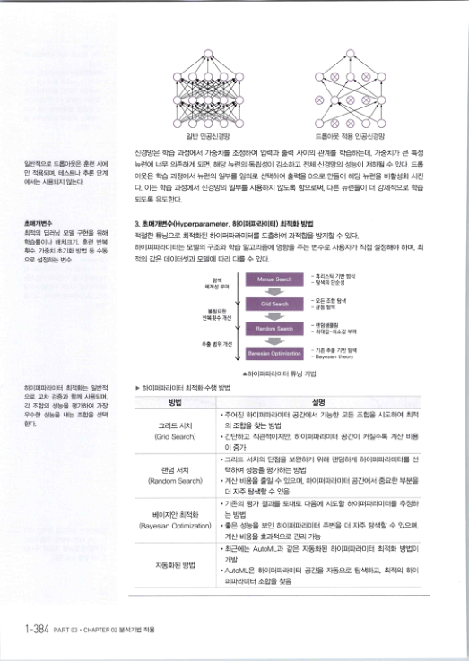
일반 인공신경망 드롭아웃 즈몽 인공신경망 신경망은 학습 과정에서 가중치를 조정하여 입력과 출력 사이의 관계를 학습하는데 , 가중치가 큰 특정 뉴런에 너무 의존하게 되면 , 해당 뉴런의 독립성이 감소하고 전체 신경망의 성능이 저하될 수 있다 . 드롭 일반적으로 드롭아웃은 훈련 시에 만 적용되며 . 테스트나 추론 단계 아웃은 학습 과정에서 뉴런의 일부를 임의로 선택하여 출력을 0으로 만들《거 해당 뉴런을 비활성화 시킨 에서는 사용되지 않는다． 다 . 이는 학습 과정에서 신경망의 일부를 사용하지 않도록 함으로쩌 다른 뉴런들이 더 강제적으로 학습 되도록 유도한다． 3 . 초매개변수꺼yperparameter , 하이퍼파라미터） 최적화 방법 초매개변수 최적의 딥러닝 모델 구현을 위해 적절한 튜닝으로 최적화된 하이퍼파라미터를 도출하여 과적합을 방지할 수 있다． 학습률이나 배치크기 , 훈련 반복 하이퍼파라미터는 모델의 구조와 학습 알고리좡게 영향을 주는 변수로 사용자가 직접 설정해야 하며 . 최 횟수 , 가중치 초기화 방법 등 수동 으로 설정하는 변수 적의 값은 데이터셋과 모델에 따라 다를 수 있다．

- 휴리스틱 기반 방식 
- 탐색의 단순성
#### Manual Search 
' 탕색 체계성 부여

- 모든 조합 탐색 
- 균둥 탐색
#### Grid Search 
◆ 불필요한 반복횟수 개선 랜덤샘풀링

- 최대값－최소값 부여
Random Search ㅓ 기존 추츨 기반 탐색

- Bayesian theory
Bayesian Optimization ▲하이퍼파라미터 튜닝 기법 하이퍼파라미터 최적화는 일반적 으로 교차 검증과 함께 사용되며， 각 조합의 성능을 평가하여 가장 우수한 성능을 내는 조합을 선택 卜 하이퍼파라미터 최적화 수행 방법 방법 설명

- 주어진 하이퍼파라미터 공간에서 가능한 모든 조합을 시도하여 최적
한다． 그리드 서치 의 조합을 찾는 방법 (Grid Search)

- 간딘同고 칙관적이지만 , 하이퍼파라미터 공간이 커질수록 계산 비용
이 증가

- 그리드 서치의 단잠을 보완하기 위해 랜덤하게 하이퍼파라미터를 선
택하여 성능을 평가하는 방법 랜덤 서치

- 계산 비용을 줄일 수 있으며 . 하이퍼파라미터 공간에서 중요한 부분을
(Random Search) 더 자주 탐색할 수 있음

- 기존의 평가 결과를 토대로 다음에 시도할 하이퍼파라미터를 추정하
는 방법 베이지안 최적화

- 좋은 성능을 보인 하이퍼파라미터 주변을 더 자주 탐색할 수 있으며，
(Bayesian Optimization) 계산 비용을 효과적으로 관리 가능

- 최괸게는 AutoML과 같은 자동화된 하이퍼파라미터 최적화 방법이
개발

- AutoML은 하이퍼파라미터 공간을 자동으로 탐색하고， 최적의 하이
자동화된 방법 퍼파라미터 조합을 찾음 1 -384 PART 03 ' CHAPTER 02분석기법적용

# -
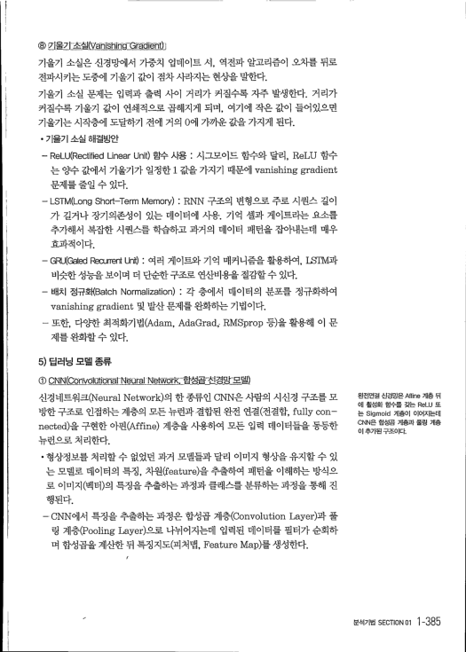
⑧ 외울최坐실（V枷i驪hiflg-Grdibrt)j 기울기 소실은 신경망에서 가중치 업데이트 시 , 역전파 알고리즘이 오차를 뒤로 전파시키는 도중에 기울기 값이 점차 사라지는 현상을 말한다． 기울기 소실 문제는 입력과 출력 사이 거리가 커질수록 자주 발생한다 . 거리가 커질수록 기울기 값이 연쇄적으로 곱해지게 되며 , 여기에 작은 값이 들어있으면 기울기는 시작층에 도달하기 전에 거의 0에 가까운 값을 가지게 된다．

- 기울기 소실 해결방안
#### - ReLU(Rectified Linear Unit) 함수 ㅅ隱 : 시그모이드 함수와 달리 , ReLU 함수
#### 는 양수 값에서 기울기가 일정한 1 값을 가지기 때문에 vanishing gradient
문제를 줄일 수 있다．

#### - LSTM(Long Short-Term Memory) : RNN 구조의 변형으로 주로 시퀀스 길이 
가 길거나 장기의존정이 있는 데이터에 사용 . 기억 셀과 게이트라는 요소를 추가해서 복잡한 시퀀스를 학습하고 과거의 데이터 패턴을 잡아내는데 매우

#### 효과적이다 .
- GRU(Gated Recun-ent Unit) : 여러 게이트와 기억 매커니즘을 활용하여 , I요I狐江과
#### 비슷한 성능을 보이며 더 단순한 구조로 연산비용을 절감할수 있다 .
- 배치 정규화（Batch Normalization) : 각 층에서 데이터의 분포를 정규화하여
vanishing gradient 및 발산 문제를 완화하는 기법이다．

- 또한 , 다양한 최적화기법（Adam, AdaGrad,. RMSprop 등）을 활용해 이 문
제를 완화할 수 있다． 5) 딥러닝 모델 종류 ① Q螂으（多흐邸Z工기utiZjr佰「Nb0『邰NetW恥（ㅍ합섰곱초멈밈오델） 신경네트워크（Neural Network）의 한 종류인 CNN은 사람의 시신경 구조를 모 방한 구조로 인접하는 계층의 모든 뉴런과결합된 완전 연결（전결합 , fully con- nected）을 구현한 아핀（Affine) 계층을 사용하여 모든 입력 데이터들을 동등한 뉴런으로 처리한다．

- 형상정보를 처리할 수 없었던 과거 모델들과 달리 이미지 형상을 유지할 수 있
는 모델로 데이터의 특징 , 차원（feature）을 추출하여 패턴을 이해하는 방식으 로 이미지（벡터）의 특징을 추출하는 과정과 클래스를 분류하는 과정을통해 진 행된다． -CNN에서 특징을 추출하는 과정은 합성곱 계층（Convolution Layer）과 풀 링 계층（Pooling Layer）으로 나뉘어지는데 입력된 데이터를 필터가 순회하 며 합성곱을 계산한 뒤 특징지도（피처맵 , Feature Map）를 생성한다．

> 완전연결 신경망은 Affine 계층 뒤 
에 횔성화 함수를 갖는 ReLU 또 는 Sigmoid 계층이 이어지는데 CNN은 합성곱 계층과 풀링 계층 이 추가된 구조이다．

> 분석기법 SECTION 01 1 -385
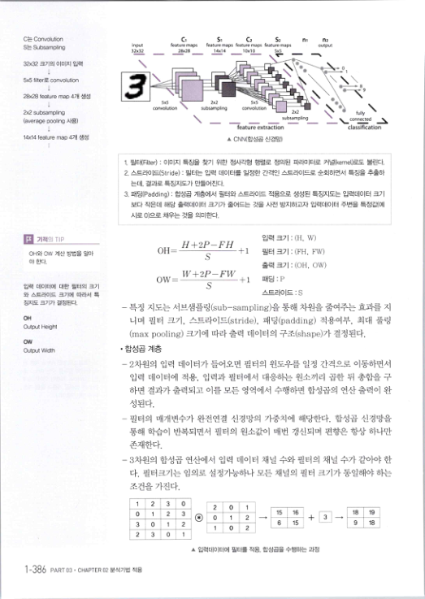
C는 Convolution S는 Subsampling c1 feature maps 7요v參8

## $1 
c2 52 feature maps feature maps feature maps 껴x14 柏xl0 5x5 겊蟲 ．■■면一＝ ■ , －鑿·楸 尺褪·l鷸．' .에5x5 c。nv。luti。n驪른 input 3) t) 맥·· - 32x32 크기의 이미지 입력 ㅗ 5x5 tilter로 convolution 28x28 feature map 4개 생성

### ：에湍ti。n\ 
刈b鑑ling ㅗ 2x2 subsampling (average pooling 사용） , subsampling , feature extraction ㅗ 14x14 feature map 4개 생성 。

A CNN（합성곱 신경망） 1 . 필터（Fitter) : 이미지 특징을 찾기 위한 정사각형 행렬로 정의된 파라미터로 커널α（emet）로도 불린다． .7 2' 스트라이드（Stride) : 필터는 입력 데이터를 일정한 간격인 스트라이드로 순회하면서 특장을 추출하 1 는데 , 결과로특징지도가만들어진다．

* 3 . 패딩（Padding) : 합성곱 7糾층에서 필터와 스트라이드 적용으로 생성된 특징지도는 입력데이터 크기
琵 보다 작은데 해당 출력데이터 크기가 줄《거드는 것을 사전 방지하고자 입력데이터 주변을 특정값（0 ?

시로0)으로차l우는것을의미힌다 .

```python
입력 크기 : (H. w) 
011= H+2二-FH +1 필터크기：
（『「，呱） 
출력 크기 : (OH, OW) 
0w= v阡2르－FF「+1 패딩·．P
```
기적의 TIP OH와 Ow 계산 방법을 알아 야 한다． 입력 데이터에 대한 필터의 크기 .

스트라이드：S 와 스트라이드 크기에 따라서 특 징지도 크기가 결정된다．

- 특징 지도는 서브샘플링（sub-sampling）을 통해 차원을 줄여주는 효과를 지
OH 니며 필터 크기 , 스트라이드（stride) , 패딩（padding) 적용여부 , 최대 풀링 Output Height (max pooling) 크기에 따라 출력 데이터의 구조（shape）가 결정된다． Ow Output Width

- 합성곱 계층
-2차원의 입력 데이터가 들어오면 필터의 윈도우를 일정 간격으로 이동하면서 입력 데이터에 적용 , 입력과 필터에서 대응하는 원소끼리 곱한 뒤 총합을 구 하면 결과가 출력되고 이를 모든 영역에서 수행하면 합성곱의 연산 출력이 완 성된다．

- 필터의 매개변수가 완전연결 신경망의 가중치에 해당한다 . 합성곱 신경망을
통해 학습이 반복되면서 필터의 원소값이 매번 갱신되며 편향은 항상 하나만 존재한다 .

-3차원의 합성곱 연산에서 입력 데이터 채널 수와 필터의 채널 수가 같아야 한 다 . 필터크기는 임의로 설정가능하나 모든 채널의 필터 크기가 동일해야 하는 조건을 가진다． 1 2 3 0 2 0 1

## 2 
3 0 1 o

- 
15 16 0 1 2 3

#### 6 
15 + 0 1 2 3 0 1 2 各 0 2 ▲ 입력데이터에 필터를 즈浴 , 합성곱을 수행하는 과정 1 -386 PART 03춈 CHAPTER 02분석기법적용

> ft 
fl2 output

> 뻑
> 닝
｀ \ ＼ 뒈 ｀ \

#### ＼
汰 ｀

> 8
“겯 ` 畛 뜸 m , 卜 ㅓ ， 釉 m ■ "

# 傲
戚

> ,
出

- 그
> 2x2
> ■
n

> -a 
18 19

> 9 
18 ]

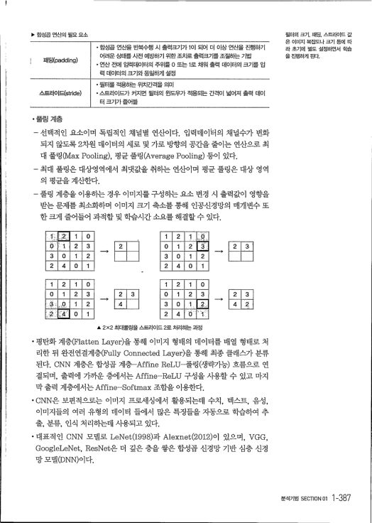
> 합성곱 연산의 필요 요소
- 합성곱 연산을 반복수행 시 출력크기가 1이 되어 더 이상 연산을 진행하기
어려운 상태를 사전 예방하기 위한 조치로 출력크기를 조절하는 기법

- 연산 전에 입력데이터의 주위를 0 또는 1로 채워 출력 데이터의 크기를 입
패딩（padding) 력 데이터의 크기와 동일하게 설정

- 필터를 적용하는 위치간격을 의미 
- 스트라이드가 커지면 필터의 윈도우가 적용되는 간격이 넓어져 출력 데이 
터 크기가 줄어듦 스트라이드（stride)

- 풀링 계층
- 선택적인 요소이며 독립적인 채널별 연산이다 . 입력데이티의 채널수가 변화
되지 않도록 2차원 데이터의 세로 및 가로 방향의 공간을 줄이는 연산으로 최 대 풀링（Max Pooling) , 평균 풀링（Average Pooling) 등이 있다．

- 최대 풀링은 대상영역에서 최댓값을 취하는 연산이며 평균 풀링은 대상 영역
의 평균을 계산한다．

- 풀링 계층을 이용하는 경우 이미지를 구성하는 요소 변경 시 출력값이 영향을
받는 문제를 최소화하며 이미지 크기 축소를 통해 인공신경망의 매개변수 또 한 크게 줄어들어 과적합 및 학습시간 소요를 해결할 수 있다．

# -Ji
1 」 2 1 2 ㅓ ． ， 衲 0 ^d '2 0 1 2 3' 2 ∼… 鄒 ∼ 尸 --) 1 0 2 3 0 1 1 0 0 4 1 2 4 2 1 0 1 2 3 3 1 2 1 0 3 2 0 1 2 2 4 2 1 1 0 4 3 0 4 1 ＾ 匕 2 0 0∼ :1치 ＾ 臘 A 2x2 최대풀링을 스트라이드 2로 처리하는 과정

- 평탄화 계층（Flatten Layer）을 통해 이미지 형태의 데이터를 배열 형태로 처
리한 뒤 완전연결계층（Fully Connected Layer）을 통해 최종 클래스가 분류 된다 . CNN 계층은 함성곱 계층－Affine ReLU－풀링（생략가능） 흐름으로 연 결되며 , 출력에 가까운 층에서는 Affine-ReLU 구성을 사용할 수 있고 마지 막 출력 계층에서는 Affine-Softmax 조합을 이용한다．

- CNN은 보편적으로는 이미지 프로세싱에서 활용되는데 수치 , 텍스트 , 음성，
이미지들의 여러 유형의 데이터 들에서 많은 특징들을 자동으로 학습하여 추 출 , 분류 , 인식 처리하는데 사용되고 있다．

- 대표적인 CNN 모델로 LeNet(1998）과 Alexnet(2012）이 있으며 , VGG,
GoogleLeNet, ResNet은 더 깊은 층을 쌓은 합성곱 신경망 기반 심층 신경 망 모델（DNN）이다．

> 필터의 크기 , 패딩 , 스트라이드 값 
은 이미지 복즌朽ㅘ 크기 틤거I 따 라 초기에 별도 설정하면서 학습 을 진행하게 된다．

> 분석기법 SECTION 01 1 -387
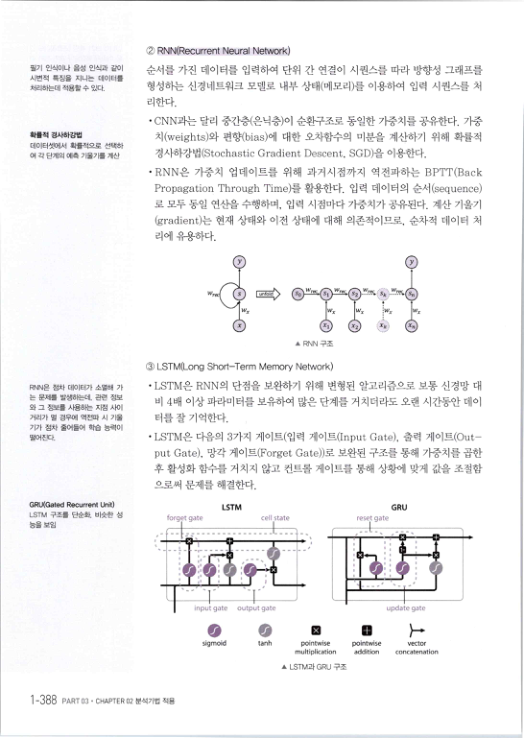
RNN(Recurrent Neural Network) 순서를 가진 데이터를 입력하여 단위 간 연결이 시퀀스를 따라 방향성 그래프를 필기 인식이나 음성 인식과 같이 시변적 특징을 지니는 데이터를 형성하는 신경네트워크 모델로 내부 상태（메모리）를 이용하여 입력 시퀀스를 처 처리하는데 적용할 수 있다． 리한다．

- CNN과는 달리 중간층（은닉층）이 순환구조로 동일한 가중치를 공유한다 . 가중
치（weights）와 편향（bias）에 대한 오차함수의 미분을 계산하기 위해 확률적 확를적 경사하강법 데이터셋에서 확률적으로 선택하 경사하강법（Stochastic Gradient Descent, SGD）을 이용한다． 여 각 단계의 예측 기울기를 계산

- RNN은 가중치 업데이트를 위해 과거시점까지 역전파하는 BPTT(Back 
Propagation Through Time）를 활용한다 . 입력 데이터의 순서（sequence) 로 모두 동일 연산을 수행하며 , 입력 시점마다 가중치가 공유된다 . 계산 기울기 (gradient）는 현재 상태와 이전 상태에 대해 의존적이므로 , 순차적 데이터 처

# 리에 유용하다． 
0 ▲ RNN 구조 ③LSTM(Long Short-Term Memory Network)

- LSTM은 RNN의 단점을 보완하기 위해 변형된 알고리즘으로 보통 신경망 대
R『읽눼은 점차 데이터가 소열해 가 는 문처曆 발생하는데 . 관련 정보 와 그 정보를 사용하는 지점 사이 비 4배 이상 파라미터를 보유하여 많은 단계를 거치더라도 오랜 시간동안 데이 터를 잘 기 억한다． 거리가 멀 경우心卄 역전파 시 기울 기가 점차 줄어들《거 학습 능력이

- LSTM은 다음의 3가지 게이트（입력 게이트（Input Gate) , 출력 게이트（Out-
put Gate) , 망각 게이트（Forget Gate)）로 보완된 구조를 통해 가중치를 곱한 후 활성화 함수를 거치지 않고 컨트롤 게이트를 통해 상황에 맞게 값을 조절함 떨어진다．

#### 으로써 문제를 해결한다 .
GRU(Gated Recurrent Unit) LSTM forget gate cell state LSTM 구조를 단순화 . 비숫한 성 능을 보임 - . ·■． `

#### input gate 
output gate 0 sigmoid 0 tanh 0 pointwise multiplication ▲ LSTM과 GRU 구조 E88 PART 03. CHAPTER 02분석기법적용

## ②
ㅗ Y 陜 ㅅ U

> 버
> 니
＇ 빠 恢

> 쬔Xk:
> GRU
> reset g " '
> update gate
## 0 
pointwise addition

> vector 
concatenation !

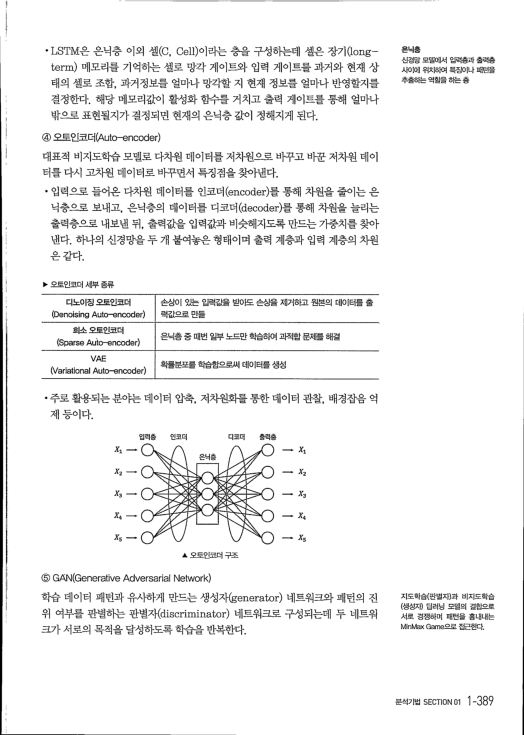
- LSTM은 은닉층 이외 셀（C, Cell）이라는 층을 구성하는데 셀은 장기（long-
term) 메모리를 기억하는 셀로 망각 게이트와 입력 게이트를 과거와 현재 상

#### 태의 셀로 조합, 과거정보를 얼마나 망각할 지 현재 정보를 얼마나 반영할지를
결정한다 . 해당 메모리값이 활성화 함수를 거치고 출력 게이트를 통해 얼마나 밖으로 표현될지가 결정되면 현재의 은닉층 값이 정해지게 된다． ④ 오토인코더（Auto-encoder)

#### 대표적 비지도학습모델로 다차원 데이터를 저차원으로 바꾸고 바꾼 저차원 데이 
터를 다시 고차원 데이터로 바꾸면서 특징점을 짖아낸다 .

- 입력으로 들어온 다차원 데이터를 인코더（encoder）를 통해 차원을 줄이는 은
#### 닉층으로 보내고 , 은닉층의 데이터를 디코더（decoder）를 통해 차원을 늘리는
#### 출력층으로 내보낸 뒤 , 출력값을 입력값과 비슷해지도록 만드는 가중치를 찾아
낸다 . 하나의 신경망을 두 개 붙여놓은 형태이며 출력 계층과 입력 계층의 차원 은 같다．

> 오토인코더 세부 종류
디노이징 오토인코더 손상이 있는 입력값을 받아도 손상을 제거하고 원본의 데이터를 출 력값으로 만듦 (Denoising Auto-encoder) 희소 오토인코더 (Sparse Auto-encoder) 은닉층 중 매번 일부 노드만 힉冶하여 과적합 문저隱 해결 VAE (Variational Auto-encoder) 확률분포를 학습함으로써 데이터를 생성

#### · 주로 활용되는 분야는 데이터 압축 , 저차원화를 통한 데이터 관찰 , 배경잡음 억
제등이다． 입력층 인코더 ▲ 오토인코더 구조 ⑤GAN(Generative Adversarial Network) 학습 데이터 패턴과 유사하게 만드는 생성자（generator) 네트워크와 패턴의 진 위 여부를 판별하는 판별자（discrii끄inator) 네트워크로 구성되는데 두 네트워 크가 서로의 목적을 달성하도록 학습을 반복한다．

> 은닉층
> 신경망 모델에서 입럭층과 출럭층
> 사이에 위치하여 특징이나 패턴을 
추출하는 역할을 하는 층

> 지도학습（판별자）과 비지도학습
> （생성자） 딥러닝 모델의 결합으로 
서로 경쟁하며 패턴을 흉내내는 MinMax Game으로 접근한다．

> 분석기법 SECTION 01 1 -389
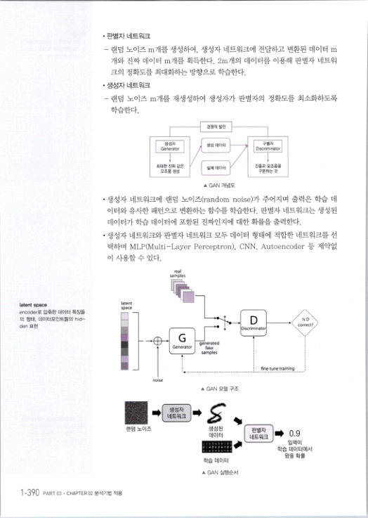
- 판별자 네트워크
- 랜덤 노이즈 m개를 생성하여 , 생성자 네트워크에 전달하고 변환된 데이터 m
개와 진짜 데이터 m개를 획득한다 . 2m개의 데이터를 이용해 판별자 네트워 크의 정확도를 최대화하는 방향으로 학습한다．

- 생성자 네트워크
- 랜덤 노이즈 m개를 재생성하여 생성자가 판별자의 정확도를 최소화하도록
학습한다．

## /
경쟁적 발전 생성자 Generator '"rlOlE1 실졔 뎨이터 ▲ GAN 개념도

- 생성자 네트워크에 랜덤 노이즈（random noise）가 주어지며 출력은 학습 데
이터와 유사한 패턴으로 변환하는 함수를 학습한다 . 판별자 네트워크는 생성된 데이터가 학습 데이터에 포함된 진짜인지에 대한 확률을 출력한다．

- 생성자 네트워크와 판별자 네트워크 모두 데이터 형태에 적합한 네트워크를 선
택하며 MLP(Multi-Layer Perceptron), CNN, Autoencoder 등 제약없 이 사용할 수 있다．

# latent 
space F latent space encoder로 압축한 데이터 특징들 의 형태 . 데이터포인트들의 hid- den 표헌 generated fake sam이es noise A GAN 모델 구조

#### 뺙 
생성자 네트워크

### 뺙
## `
랜덤 노이즈

#### 걋
a 3 今 $a 7 〃 7 / f 」뺨 f 죤 군J 9 * 학습 데이터 ▲ GAN 실행순서 1 -390 PART 03· CHAPTER 02분석기법적용

> 구별자 
Discriminator

> fine tune training
### 00. 9
> 임력이 
학습 데이터에서 왔을 확률

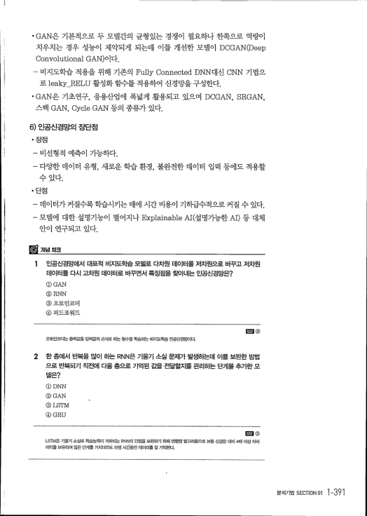
- GAN은 기본적으로 두 모델간의 균형있는 경챙이 필요하나 한쪽으로 역량이
치우치는 경우 성능이 제약되게 되는데 이를 개선한 모델이 DCGAN(Deep Convolutional GAN)이다.

- 비지도학습 적용을 위해 기존의 Fully Connected DNN대신 CNN 기법으 
로 leaky_RELU 활성화함수를 적용하여 신경망을 구성한다．

- GAN은 기초연구 , 응용산업에 폭넓게 활용되고 있으며 DCGAN, SRGAN,
스택 GAN, Cycle GAN 등의 종류가 있다． 6) 인공신경망의 장단점

- 장점
- 비선형적 예측이 가능하다．
- 다양한 데이터 유형 , 새로운 학습 환경 , 불완전한 데이터 입력 등에도 적용할 
수 있다．

- 단점
- 데이터가 커질수록 학습시키는 데에 시간 비용이 기하급수적으로커질 수 있다．
- 모델에 대한 설명기능이 떨어지나 Explainable Al（설명가능한 AT) 등 대쳬
안이 연구되고 있다． 1 인공신경망에서 대표적 비지도학습 모델로 다차원 데이터를 저차원．으로 바꾸고 저차원 데이터를 다시 고차원 데이터로 바꾸면서 특징점을 찾아내는 인공신경망은？ D GAN ② RNN ③ 오토인코더 ④ 피드포워드 ㅌ비 ③ 오토인코더는출력값을 입력값의 근사로 하는 힘수를 학슴ㅎ冶 비지도학슴 인공신경망이다． 2 한 층에서 반복을 많이 하는 RNN은 기울기 소실 문제가 발생하는데 이를 보완한 방법 으로 반복되기 직전에 다음 층으로 기억된 값을 전달할지를 관리하는 단계를 추가한 모 델은？ ① DNN ② GAN ③ LSTM ④ GRU 麗睡） LSTtI은 기울기 소실로 학습능력이 저하되는 RNN의 단점을 보완하기 위해 변형된 알고리즘으로 보통 신경망 대비 4배 이상 파라 미터를 보유하여 많은 단계를 거치더라도 오랜 시간동안 데이터를 잘 기억한다．

> 분석기법 SECTION01 1-391
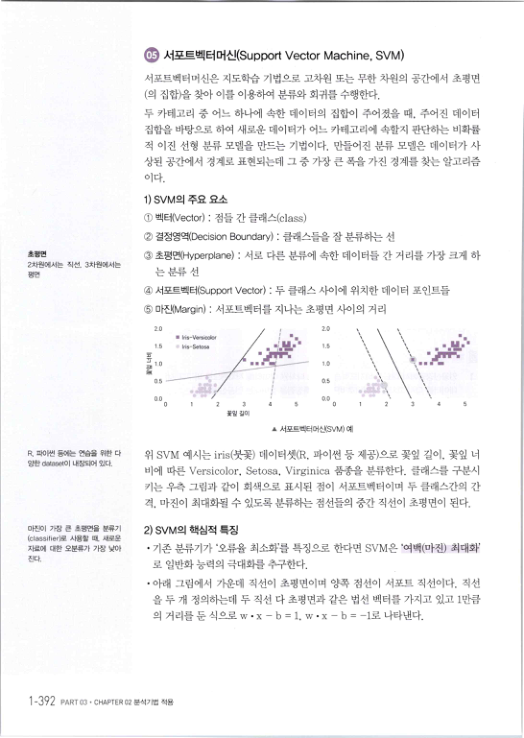
.

서포트벡터머신（Support Vector Machine, SVM) 서포트벡터머신은 지도학습 기법으로 고차원 또는 무한 차원의 공간에서 초평면 （의 집합）을 찾아 이를 이용하여 분류와 회귀를 수행한다． 두 카테고리 중 어느 하나에 속한 데이터의 집합이 주어졌을 때 , 주어진 데이터 집합을 바탕으로 하여 새로운 데이터가 어느 카테고리에 속할지 판단하는 비확률 적 이진 선형 분류 모델을 만드는 기법이다 . 만들어진 분류 모델은 데이터가 사 상된 공간에서 경계로 표현되는데 그 중 가장 큰 폭을 가진 경계를 찾는 알고리즘

#### 이다 .
1) SvM의 주요 요소

#### ① 벡터（Vector) : 점들 간 클래스（class)
#### ② 결정영역（Decision Boundary) : 클래스들을 잘 분류하는 선
③ 초평면（Hyper이ane) : 서로 다른 분류에 속한 데이터들 간 거리를 가장 크게 하 초평면 2차원에서는 직선 . 3차원에서논 평면 는 분류 선

#### ④ 서포트벡터（Support Vector) : 두 클래스 사이에 위치한 데이터 포인트들
#### ⑤ 마진（Margin) : 서포트벡터를 지나는 초평면 사이의 거리
2. 0 
20 U Ir,s-Versicolor , , \ ＼

- 
5 Iris-Setosa ｀

- 。
' o o ． 냥 。

1 1 。

o ㄲ ㅍ 해 덖 1 叩 。

▲ 서포트벡터머신（SVM) 예 위 SVM 예시는 iris（붓꽃） 데이터셋（R , 파이썬 등 제공）으로 꽃잎 길이 , 꽃잎 너 R . 파이썬 뒵게는 연습을 위한 다 양한 datase삐 내장되어 있다． 비에 따른 Versicolor, Setosa, Virginica 품종을 분류한다 . 클쾌스를 구분시 키는 우측 그림과 같이 회색으로 표시된 점이 서포트벡터이며 두 클쾌스간의 간 격 , 마진이 최대화될 수 있도록 분류하는 점선들의 중간 직선이 초평면이 된다． 2) SVM의 핵심적 특징 마진이 가장 큰 초평면을 분류기 （히assifier）로 시용할 때 , ㅅ耀운

#### · 기존 분류기가 ' 오류율 최소화’를 특징으로 한다면 SVM은 ' 여백（마진） 최대화？
자료에 대한 오분류가 가장 낮아 진다． 로 일반화 능력의 극대화를 추구한다．

#### · 아래 그림에서 가운데 직선이 초평면이며 양쪽 점선이 서포트 직선이다 . 직선
을 두 개 정의하는데 두 직선 다 초평면과 같은 법선 벡터를 가지고 있고 1만큼

#### 의 거리를 둔 식으로 w ·x -b = 1, w.x -b = -1로 나타낸다．
1 -392 PART 03. CHAPTER 02분석기법적용

> ■
→ 4

> ,
, , ,

> 2 
3 4 5 1

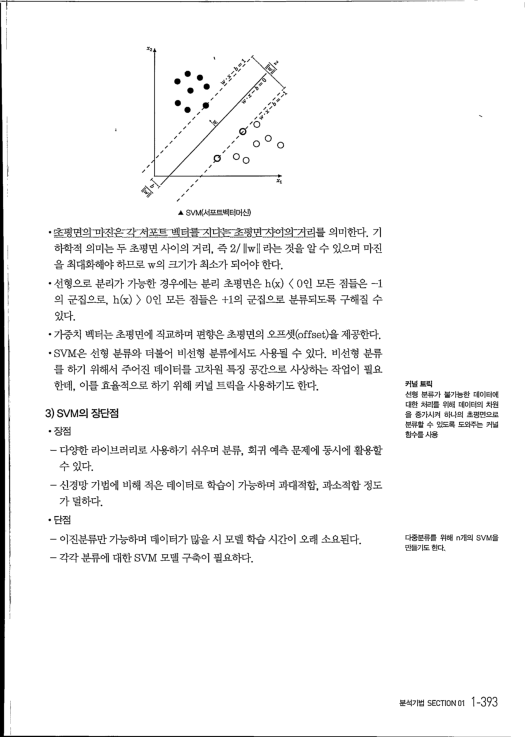
## 汐y",,.'ZN,, 
·헌· . ㅉ,Q, .

.4"

- . .4 4'
_/'乂 '.', " ', Q 4 ' .

/ 4 쿠 / ▲ SVM（서포트벡터머신）

- 초평“며의꾀코우r각거포트벡틔를찌다큭＝초펏“며＝꺅이의－거리를의미한다 . 기
하학적 의미는 두 초평면 사이의 거리 , 즉 2세쎄 라는 것을 알 수 있으며 마진 을 최대화해야 하므로 w의 크기가 최소가 되어야 한다．

#### · 선형으로 분리가 가능한 경우에는 분리 초평면은 h(x) <0인 모든 점들은 -1
#### 의 군집으로 , h(x) > 0인 모든 점들은 +1의 군집으로 분류되도록 구해질 수
있다．

- 가중치 벡터는 초평면에 직교하며 편향은 초평면의 오프셋（offset）을 제공한다．
#### ·SVM은 선형 분류와 더불어 비선형 분류에서도 사용될 수 있다 . 비선형 분류 
를 하기 위해서 주어진 데이터를 고차원 특징 공간으로 사상하는 작업이 필요 한데 , 이를효율적으로 하기 위해 커널 트릭을사용하기도한다． 3) SVM의 장단점

- 장점
- 다양한 라이브러리로 사용하기 쉬우며 분류 , 회귀 예측 문제에 
수 있다． 동시에 활용할 과소적합 정도

- 신경망 기법에 비해 적은 데이터로 학습이 가능하며 과대적합， 
가 덜하다．

- 단점
- 이진분류만 가능하며 데이터가 많을 시 모델 학습 시간이 오래
소요된다．

- 각각 분류에 대한 SVM 모델 구축이 필요하다．
> 커널 트릭
> 선형 분류가 불가능한 데이터에 
대한 처리를 위해 데이터의 차원 을 증가시켜 하나의 초펑면으로 분류할 수 있도록 도와주는 커널

> 함수를사용
> 다중분류를 위해 n개의 SVM을 
만들기도 한다．

> 분석기법 SECTION 01 1 -393
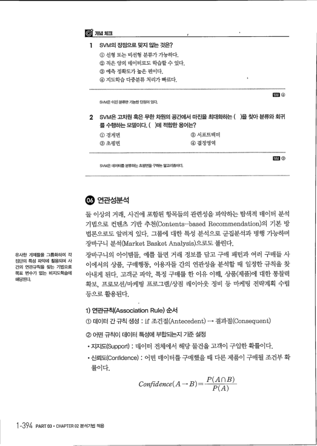
1 SVM의 장점으로 맞지 않는 것은？ ① 선형 또는 비선형 분류가 가능하다． ② 적은 양의 데이터로도 학습할 수 있다． ③ 예측 정확도가 높은 편이다． ④ 지도학습 다중분류 처리가 빠르다． SVM은 이진 분류만 가능한 단점이 있다． 2 SVM은고차원혹은무한차원의공긴에서 마진을최대화하는（ ）을찾아분류와회귀 를수행하는모델이다 . ( ）에적합한용어는？ ① 경계면 ② 서포트벡터 ③초평면 ④ 결정영역 SVM은 데이터를 騙L하는 초펑면을구하는 알고리즘이다． .

연관성분석

#### 둘 이상의 거래 , 사건에 포함된 항목들의 관련성을 파악하는 탐색적 데이터 분석
기법으로 컨텐츠 기반 추천（Contents-based Recommendation）의 기본 방

#### 법론으로도 알려져 있다 . 그룹에 대한 특정 분석으로 군집분석과 병행 가능하며
장바구니 분적（Market Basket Analysis）으로도 불린다． 장바구니의 아이템들 , 예를 들면 거래 정보를 담고 구매 패턴과 여러 구매들 사 유사한 개체들을 그룹화하여 각 집단의 특성 파악0∥ 활용되며 사

#### 이에서의 상품 , 구매행동 , 이용자들 간의 연관성을 분적할 때 일정한 규칙을 찾
건의 연관규칙을 찾는 기법으로

#### 아내게 된다 . 고객군 파악 , 특정 구매를 한 이유 이해 , 상품（제품）에 대한 통찰력
목표 변수가 없는 비지도학습에 해당된다．

#### 확보 , 프로모션／마케팅 프로그램／상점 레이아웃 정비 등 마케팅 전략계획 수립
등으로 활용된다． 1) 연관규칙（Association R미e) 순서

#### ① 데이터 간규칙 생성 : if 조건절（Antecedent) → 결과절（Consequent)
② 어떤 규칙이 데이터 특성에 부합되는지 기준 설정

- 지지도（Support) : 데이터 전쳬에서 해당 물건을 고객이 구입한 확률이다．
- 신뢰도（Confidence) : 어떤 데이터를구매했을 때 다른 제품이 구매될 조건부 확
률이다．

### c岬／瀝帆α（A→β）=P (A.nB)
C。nfidence(A- B) r一 ` /17 1-394 PARI03* CHAPTER 02분석기법적용

#### El
> 뎔미 ③
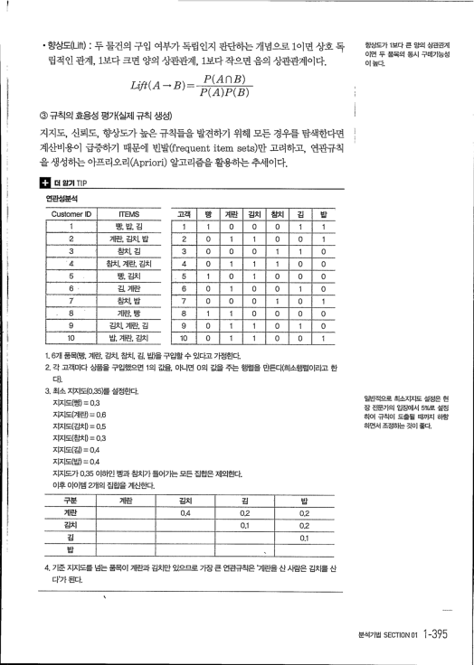
- 향상도（니ft) : 두 물건의 구입 여부가 독립인지 판단하는 개념으로 1이면 상호 독
립적인 관계 , 1보다 크면 양의 상관관계 , 1보다작으면 음의 상관관계이다．

#### . . . . . 
ㅜ， .

P14 n Pt ￡z．材（.'A．→劾．'= ，쟈 ' ㅈ'淅집（.

-' " "-

- ' 
P(A)P(B) ③ 규칙의 효용성 평가（실제 규칙 생성） 지지도 , 신뢰도 , 향상도가높은 予칙들을 발견하기 위해 모든 경우를 탐색한다면 계산비용이 급증하기 때문에 빈발（frequent item sets）만 고려하고 , 연관규칙 을 생성하는 아프리오리（Apriori) 알고리즘을 활용하는 추세이다． 연관상분석 Customer ID ITEMS 고객 빵 계란 김치 참치 김 밥 빵, 밥, 김 1 ㅓ 1 0 0 0 1 1 ,2 계란, 김치 , 밥 2 0 1 1 0 0 1 3 참치 . 김 3 0 0 0 1 1 0 4 참치 , 계란. 김치 4 0 1 1 1 0 0 빵, 김치 5 5 1 0 1 0 0 0 6 4 7 ' 6 0 1 0 0 1 0 →7 0 0 0 1 0 1 김 . 계란 참치 , 밥 계란 . 빵 8 1 1 0 0 0 0 9 김치 , 계란 , 김 9 0 1 1 0 1 0 10 밥, 계란 , 김치 10 0 1 1 0 0 1

1. 6개 품목《빵. 계란 , 김치 , 참치 . 김 , 밥을 구입할수 있다고 가정한다．
2 . 각 고객마다 상품을 구입했으면 1의 값을, 아니면 0의 값을 주는 행렬을 반든다（희소행렬이라고 한 다）.

3 . 최소지지도（0.35）를설정한다． 지지도（빵） = 0 .3 지지도（계란） = 0.6 지지도（김치） = 0.5 지지도（참치） = 0.3 지지도（김） = 0.4 지지도（밥） = 04 지지도가 0.35 이하인 빵과 참치가 들어가는 모든 집합은 제외한다.

이후 아이템 2개의 집합을 계산한다 .

구분 계란 김치 김 밥 계란

0. 4 
02

0. 2
김치

0. 1 
02 김

0. 1
밥 4 . 기준 지지도를 넘는 품목이 계란과 김치만 있으므로 가장큰 연관규칙은 ' 계란을 산 사람은 김치를 산 다'가 된다． `

> 향상도가 1보다 큰 양의 상관관계 
이면 두 품목의 동시 구매가능성 이높다．

> 일반적으로 최소지지도 설장은 현 
장 전문가의 입장에서 5％로 설정 하여 규칙이 도출뒬 때까지 하향 하면서 조정하는 것이 좋다．

> 분석기법 SECTION 01 1-395
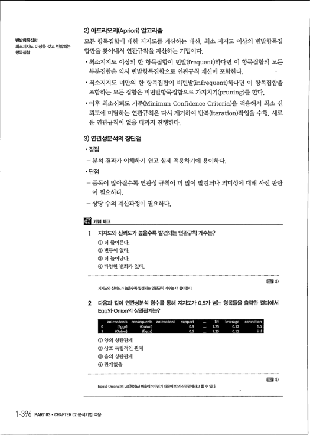
2) 아프리오리（Apriori) 알고리즘 모든 항목집합에 대한 지지도를 계산하는 대신 , 최소 지지도 이상의 빈발항목집 빈발항목집합 최소지지도 이상을 갖고 빈발하는 합만을 찾아내서 연관규칙을 계산하는 기법이다． 항목집합

- 최소지지도 이상의 한 항목집합이 빈발（frequent）하다면 이 항목집합의 모든
부분집합은 역시 빈발항목집합으로 연관규칙 계산에 포함한다．

- 최소지지도 미만의 한 항목집합이 비빈발（infrecluent）하다면 이 항목집합을
포함하는 모든 집합은 비빈발항목집합으로 가지치기（pruning）를 한다．

- 이후 최소신뢰도 기준（Minimun Confidence Criteria）을 적용해서 최소 신
뢰도에 미달하는 연관규칙은 다시 제거하여 반복（iteration）작업을 수행 , 새로 운 연관규칙이 없을 때까지 진행한다 .

3) 연관성분석의 장단점

- 장점
- 분석 결과가 이해하기 쉽고 실제 적용하기에 용이하다．
- 단점
- 품목이 많아질수록 연관성 규칙이 더 많이 발견되나 의미성에 대해 사전 판단
이 필요하다．

- 상당 수의 계산과정이 필요하다．
1 지지묘 신뢰도가높을수록발견되는연蔘구칙 개수는？ ① 더 줄어든다． ② 변동이 없다． ③ 더 늘어난다． （乙 다양한 변화가 있다． 지지도와 신뢰도가높을수록 발견되는 연관규칙 개수는 더 쥘거든다． 2 다음과 같이 연관성분석 함수를 통해 지지도가 0.5가 넘는 항목들을 출력한 결과에서 Egg와 Onion의 상관관계는？ antecedents c이isequents antecedent support … lift leverage conviction 0 (Eggs) (Onion)

0. 8 
...

1. 25 
0. 12 
1. 6 
1 (Onion) (Eggs)

0. 6 
...

125

0. 12 
i nI ①） 양의 상관관계 ② 상호 독립적인 관계 ③ 음의 상관관계 ④ 관계없음 Egg와 Onion간의 Lilt（향상도） 비율이 1이 넘기 때뮌게 양의 상관관계라고 할수 있다． 1-396 PART 03. CHAPTER 02분석기법적용

> 냉n ①
> 딜麗 ①
> '
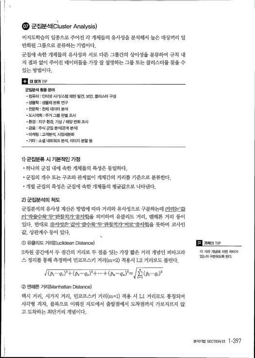
#### .군집분석（Cluster Analysis)
비지도학습의 일종으로 주어진 각 개쳬들의 유사성을 분석해서 높은 대상끼리 일 반화된 그룹으로 분류하는 기법이다． 군집에 속한 개쳬들의 유사성과 서로 다른 그룹간의 상이성을 분류하여 규칙 내 지 결과 없이 주어진 데이터들을 가장 잘 설명하는 그룹 또는 클러스터를 찾을 수 있는 방법이다． 군집분석 활용 분야

- 컴퓨터 : 인터넷 사기／스팸 패턴 발견 , 보안, 클러스터 구성
- 생물학 : 생튿［체 분류 연구
- 천문학 : 천체 데이터 분석
- 돠 계획 ：주거 그룹 판별 조사
- 환경 : 지구 환경 , 기상 / 해양 변화 조사
- 금융 : 주식 군집 분석（관계 분석）
- 마케팅 : 고객분석 , 시장세분화
- 기타 : 소셜 네트워크 분석 , 이미지 분할 등
1) 군집분류 시 기본적인 가정

- 하나의 군집 내에 속한 개쳬들의 특정은 동일하다．
- 군집의 개수 또는 구조와 관계없이 개쳬간의 거리를 기준으로 분류한다．
- 개별 군집의 특성은 군집에 속한 개쳬들의 평균값으로 나타낸다．
2) 군집분석의 척도 군집분석의 유사성 계산은 방법에 따라 거리와 유사성으로 구분하는데 협‘희芸鉗 i이짝舍수록，우－콰餐최가＝離꺅함을 의미하며 유클리드 거리 , 맨해튼 거리 등이 있다 . 반대로 흙자성흔：3瑤t이－클수록卞과참치"水저로錦썸留을 뜻하며 코사인 값 , 상관계수등이 있다． \ ① 유클리드 거리（Euclidean Distance) 2차원 공간에서 두 점간의 거리로 두 점을 잇는 가장 짧은 거리 개념인 피타고라 스 정리를 통해 측정하며 민코프스키 거리（m=2) 적용시 L2 거리로도 불린다．

```python
7(A-71) ' +（久－22) ' ＋…＋（夕，,－《，:) ' = I ( .-qi)2
4
```
② 맨해튼 거리（Manhattan Distance)

#### 택시 거리 , 시가지 거리 , 민코프스키 거리（m=1) 적용 시 Li 거리로도 통칭되며
#### 사각형 격자 , 블록으로 이뤄진 지도에서 출발점에서 도착점까지 가로지르지 않 
고 도착하는 최단거리 개념이다 .

#### r헴 기적의 ㄲP
> 각 거리 개념에 어떤 차이가 
있는지 구분하도록 한다．

> 분석기법 SECTION 01 1-397
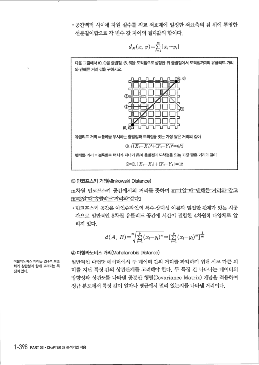
- 공간벡터 사이에 차원 실수를 직교 좌표계에 일정한 좌표축의 점 위에 투영한
선분길이합으로 각 변수 값 차이의 절대값의 합이다．

#### J' ' 
輸（鮮， 〃）= Ixi- yil 다음 그림에서 (0. 0）을 출발점 , (6. 6）을 도착점으로 설정한 뒤 출발점에서 도착점까지의 유클리드 거리 와 맨해튼 거리 값을 구하시오． (0, O)Q 유클리드 거리 == 블록을 무시하는 출발점과 도착점을 잇는 가장 짧은 거리의 길이 :D. 7(X2-X1)2+(Y2-Y1)2=6f 맨해튼 거리 = 블록별로 택시가 지나가 듯이 출발점과 도착점을 잇는 가장 짧은 거리의 길이 ②＝③. IX2-X11+1Y2-Y11=12 ③ 민코프스키 거리（Minkowski Distance) m차원 민코프스키 공간에서의 거리를 뜻하며 聊ㅌ1혈－때－ㅁㅐ해튼－거“리와’갇고 Iㅠ트Z일：：뙈- 灌희드긔괴와型꽈，그

- 민코프스키 공간은 아인슈타인의 특수 상대성 이론과 밀접한 관계가 있는 시공
간으로 일반적인 3차원 유클리드 공간에 시간이 결합한 4차원적 다양쳬로 알 려져 있다．

```python
d(A, β）=Vp(:7－跳） ' =[ p
(x1-y)m=W (x_y1)mjm
i=1 
i=1
```
④ 마할라노비스 거리（Mahalanobis Distance) 일반적인 다변량 데이터에서 두 데이터 간의 거리를 파악하기 위해 서로 다른 의 마할라노비스 거리는 변수의 표준 화와 상관성이 함께 고려되는 특 징이 있다． 미를 지닌 특징 간의 상관관계를 고려해야 한다 . 두 특징 간 나타나는 데이터의 방향성과 상관도를 나타닌l 공분산 행렬（Covariance Matrix) 개넘을 적용하여 蔘子 분포에서 특정 값이 얼마나 평균에서 멀리 있는지를 나타낸 거리이다． 1-398 PART 03 ' CHAPTER 02분석기법적용

> (6, 6)
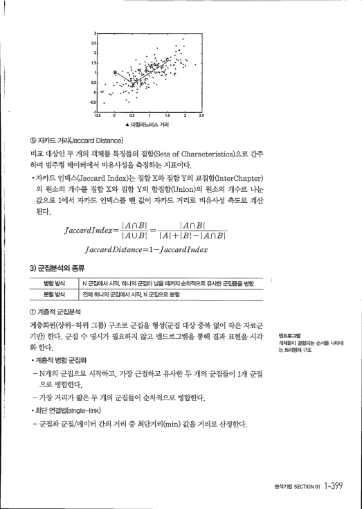
3

2. 5
2 1 . 5 1 03 0 눕o . 5 1 -05 0

0. 5 
1 13 2 2 5 ▲ 마할라뇌키스 거리 ⑤ 자카드 거리（Jaccard Distance) 비교 대상인 두 개의 객쳬를 특징들의 집합（Sets of Characteristics）으로 간주 하며 범주형 데이터에서 비유사성을측정하는 지표이다．

- 자카드 인덱스（Jaccard Index）는 집합 x와 집합Y의 교집합（InterChapter)
의 원소의 개수를 집합 x와 집합 Y의 합집합（Union）의 원소의 개수로 나눈 값으로 1에서 자카드 인덱스를 뺀 값이 자카드 거리로 비유사성 측도로 계산 된다．

### , 
, IAn쳬 Hn게 γaccarainaex= HU게 = 에게 ㅢAfl좨

#### JaccardDistance = 1-Jaccardlndex
3) 군집분석의 종류 병합 방식 N 군집에서 시작, 하나의 군집이 남을 때까지 순차적으로 유사한 군집들을 병합 분할 방식 전체 하나의 군집에서 시작, N 군집으로 분할 ① 계층적 군집분석 계층화된（상위－하위 그룹） 구조로 군집을 형성（군집 대상 중복 없이 작은 자료군 기반） 한다 . 군집 수 명시가 필요하지 않고 덴드로그램을 통해 결과 표현을 시각 화한다．

- 계층적 병합 군집화
-N개의 군집으로 시작하고 , 가장 근접하고 유사한 두 개의 군집들이 1개 군집 으로 병합한다．

- 가장 거리가 짧은 두 개의 군집들이 순차적으로 병합한다．
- 최단 연결법（sin이e-link)
- 군집과 군집／데이터 간의 거리 중 최단거리（mm工1) 값을 거리로 산정한다．
> 덴드로그램
> 개체들이 결합되는순서를 나타내 
는 트리형태 구조

> 분석기법 SECTION 01 꺼99
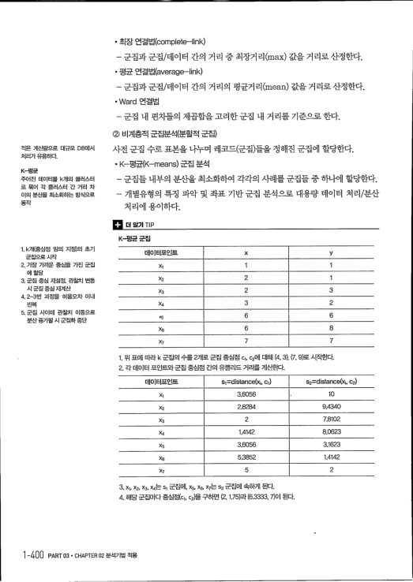
- 최장 연결법（corn이ete-link)
- 군집과 군집／데이터 간의 거리 중 최장거리（max) 값을 거리로 산정한다．
- 평균 연결법（average-link)
- 군집과 군집／데이터 간의 거리의 평균거리（mean) 값을 거리로 산정한다．
- Ward 연결법
- 군집 내 편차들의 제곱합을 고려한 군집 내 거리를 기준으로 한다．
② 비계층적 군집분석（분할적 군집） 사전 군집 수로 표본을 나누며 레코드（군집）들을 정해진 군집에 할당한다． 적은 계산량으로 대규모 DB에서 처리가듀용하다．

- K－평균侊rneans) 군집 분석
K－평균

- 군집들 내부의 분산을 최소화하여 각각의 사례를 군집들 중 하나에 할당한다．
주어진 데이터를 k개의 클러스터 로 묶어 각 클러스터 간 거리 차 이의 분산을 최소톼하는 방식으로

- 개별유형의 특징 파악 및 좌표 기반 군집 분석으로 대용량 데이터 처리／분산
동작 처리에 용이하다． ．졈 더 알기 ㅐP K－평균군집

1. k개（중심점 임의 지정）의 초기
데이터포인트 x y 군집으로 시작 2 . 가장 가끼운 중심을 가진 군집 에 할당 3 . 군집 중심 재설정 . 관찰치 변동 시 군집 중심 재계산

4. 2-3번 과정을 허용오차 이내
xl 1 1 X2 2 1 x3 2 3 x4 3 2 반복 5 . 군집 사이에 관찰치 이동으로 X5 6 6 분산증가될 시 군집화중단 x6 6 8 X7 7 7 1 . 위 표에 따래（ 군집의 수를 2개로 군집 줌심점 C1. C2에 대해 (4. 3), (7. 9）로 시작한다． 2 . 각 데이터 포인트와군집 중심점 간의 유클리드 거리를 계산한다． 데이터포인트 s1=distance(xj, ci) s2-distance(x1, c2) ×1

3. 6056 
10 x2

2. 8284 
9. 4340
x3 2

7. 8102
x4

1. 4142 
8. 0623
x5

3. 6056 
3. 1623
x8

5. 3852 
1. 4142
X7 5 2

3. x1, x2, x3. x4는 Si 군집에， x5. x6. xγ는 52 군집에 속하게 된다．
4 . 해당군집마다줌심점（Cl. C2）을구하면 (2. 1.75）과（6.3333. 7）이 된다． 1-400 PART 03· CHAPTER 02분석기법적용

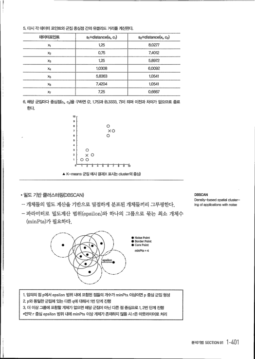
5 . 다시 각 데이터 포인트와군집 중심점 간의 유클리드 거리를 계산힌다． 데이터포인트 s1==distance(xj, c1) s2-distance(x1, c2) ×1 125

8. 0277
X2

0. 75 
7. 4012
x3 125

5. 8972
x4

1. 0308 
6. 0092
X5

5. 8363 
1. 0541
×6

7. 4204 
1. 0541
X7 725

0. 6667
6 . 해당 군집마다 중심점（C1, C2）을 구하면 (2. 1.75）과 (6.3333. 7）이 되며 이전과 차이가 없으므로 종료 한다． 109 0 xo 0 5 ○ × O 2 ○ O 《｀ 1 2 3 4 5 6 7 8 8 10 = " 3 4 A K-means 군집 예시 결과（× 표시는 cluster의 중심）

- 밀도 기반 클러스터링（DBSCAN)
- 개쳬들의 밀도 계산을 기반으로 밀접하게 분포된 개쳬들끼리 그루핑한다．
- 파라미터로 밀도계산 범위（epsilon）와 하나의 그룹으로 묶는 최소 개쳬수
(minPts）가 필요하다． ● Noise Point ●Border Point S Core Point 걀 ／ / .

mtnPts= 4 I'` ncilnn i.;r- -'-● , ` ,`.

.

.'.

, .

- 
. 7 ., / '.

, .

- 
.

J, .,

1. 임의의 점 p에서 epsilon 범위 내에 포함된 점들의 개수가 minPts.이상이면 p 중심 군집 형성
2. p와동일한군집에 있는 다른 q에 대해서 1번 단계 진행 
3 . 더 이상 그룹에 포함할 개체가 없으면 해당 군집이 애＝=l 다른 점 중심으로 12번 단계 진행 ＊만약 「 중심 epsiLon 범위 내에 minPts 이상 개체가 존재하지 않을 시 r은 아웃라이어로 처리

> DBSCAN 
Density-based spatial cluster- ing of applications with noise

> `
∼ 一 /

> 분석기법 SECTION 01 1 -401
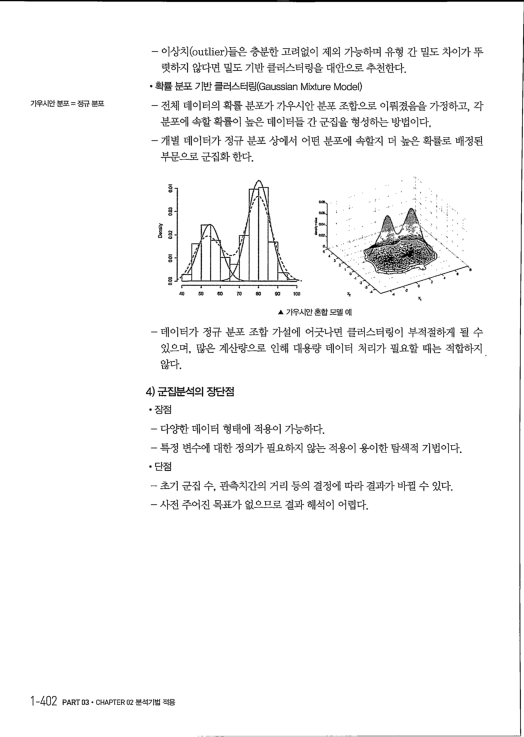
- 이상치（outlier）들은 충분한 고려없이 제외 가능하며 유형 간 밀도 차이가 뚜
렷하지 않다면 밀도 기반 클러스터링을 대안으로 추천한다．

- 확률 분포 기반 클러스터링（Gaussian Mixture Model)
- 전쳬 데이터의 확률 분포가 가우시안 분포 조합으로 이뤄졌음을 가정하고 , 각
가우시안 분포 == 정규 분포 분포에 속할 확률이 높은 데이터들 간 군집을 형성하는 방법이다．

- 개별 데이터가 정규 분포 상에서 어떤 분포에 속할지 더 높은 확률로 배정된
#### 부문으로 군집화한다 .
증 a 。

엄 ． 。

논 섶 b

- 。
귈 몌 幻 ㄸh.

힁 ▲ 가우시안 혼합모델 0체

- 데이터가 蔘干 분포 조합 가설에 어긋나면 클러스터링이 부적절하게 될 수
있으며 , 많은 계산량으로 인해 대용량 데이터 처리가 필요할 때는 적합하지 않다． 4) 군집분석의 징F F점

- 장점
- 다양한 데이터 형태에 적용이 가능하다．
- 특정 변수에 대한 정의가 필요하지 않는 적용이 용이한 탐색적 기법이다．
- 단점
- 초기 군집 수 , 관측치간의 거리 등의 결정에 따라 결과가 바뀔 수 있다．
- 사전 주어진 목표가 없으므로 결과 해석이 어렵다．
1 -402 PART 03. CHAPTER 02분석기법적용

> 」2
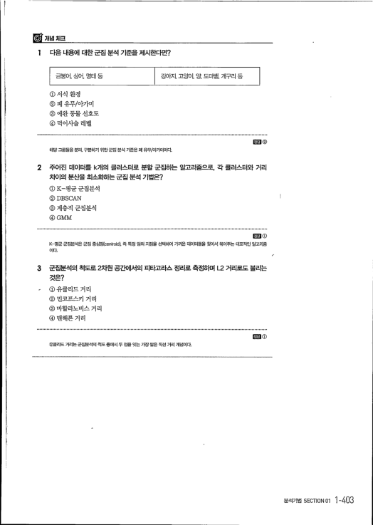
1 다음 내용에 대한군집 분석 기준을 제시한다면？ 금붕어 , 상어 , 명태 등 깅아지 , 고양이 . 양, 도마뱀 . 개구리 등 ① 서식 환경 ② 폐 유무／아가미 ③ 애완 동물 선호도 ④ 먹이사슬 레벨 해당그룹들을 분리 . 구분하기 위한군집 분석 기준은 폐 유무／아가미이다． 2 주어진 데이터를 k개의 클러스터로 분할 군집하는 알고리즘峴， 각 클러스터와 거리 차이의 분산을 최소화하는 군집 분석 기법은？ ① K－평균 군집분석 ② DBSCAN ③ 계층적 군집분석 ④ GMM 怜츤l균 군집분석은 군집 중심점（centrod) , 즉 특정 임의 지점을 선택하여 가까운 데이터들을 찾아서 묶어주는 대표적인 알고리즘 이다． 3 군집분석의 척도로2차원 공간에서의 피타고라스 정리로 측정하며 臣 거리로도 불리는 것은？ ① 유클리드 거리 ② 민코프스키 거리 ③ 마할라노비스 거리 ④ 맨해튼 거리 유클리드 거리는군집분석의 척도중에서 두 점을 잇는 가장 짧은 직선 거리 개념이다．

> - 히②
> El
> 印·（D
> 분석기법 SECTION 01 1 -403
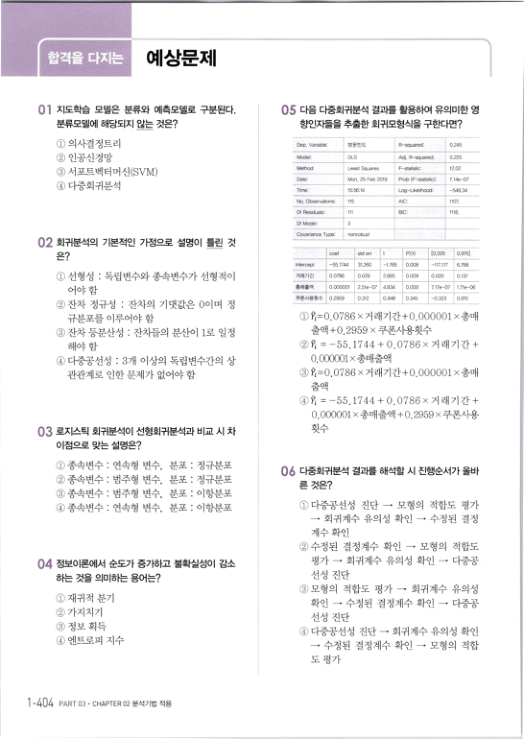
## 예상문제
01 지도학습 모델은 분류와 예측모델로 구분된다． 05 다음 다중회귀분석 결과를 활용하여 유의미한 영 분류모델에 해당되지 않는 것은？ 향인자들을 추출한 회귀모형식을 구한다면？ ① 의사결정트리 ② 인공신경망 ③ 서포트벡터머신（SvM) ④ 다중회귀분석 Dep. Vanable 방문빈도 R-'squared:

0. 245
卜約del:

OLS A이 R-S0uared:

0. 225
Melhod LeuaI S4uares F-stas鱗乙＝

12. 02
Date Mon. 25 Feb 2019 Prob (F-statistic):

7. 14e-07
Time 15:56:14 Loo-Likeihood:

549. 34
No. 00se「va8002 115 시C

1107. 
Dl ResidUals:

테C.

1118 Dl M。der l 3 Covariance TYPO:

flOnrObust 02 회귀분석의 기본적인 가정으로 설명이 틀린 것 은？ coㅎ aId err I P기티 [0.025

0. 975]
同ercept

55. 1744 
3t2

1. 765 
0. 008 
1 17. 117

6. 168
① 선형성 : 독립변수와 종속변수가 선형적이 어야빰 ②잔차 蔘予성 : 잔차의 기댓값은 0이며 정 규분포를 이루어야 함 ③ 잔차 등분산성 : 잔차들의 분산이 1로 일정 해야 함 ④ 다중공선성 : 3개 이상의 독립변수간의 상 관관계로 인한 문제가 없어야 함 거래기간

0. 0756 
0. 029 
2. 665 
3. 009 
0. 020 
0. 137
충매출맥

0. 000001 
2. 51o-07 
4 834

0. 000 
7. 17e 꾜 
1. 710-06
쿠폰사용횟수 32959 0 계2 ① l깊=0.0786 × 거래기간＋0.000001 ×총매 출액 +0.2959 × 쿠폰사용횟수 ②i길= -55. 1744 + 0. 0786 × 거 래기간 +

0. 000001×총매출액 
③ i길=0.0786 × 거래기간＋0.000001 ×총매 출액 ④f컬= -55.1744 + 0. 0786 × 거 래기간 +

0. 000001 × 총매출액 +0.2959 × 쿠폰사용 
횟수 03 로지스틱 회귀분석이 선형회귀분석과 비교 시 차 이점으로 맞는 설명은？ ①종속변수 : 연속형 변수 , 분포 : 정규분포 ②종속변수 : 범주형 변수 , 분포 : 芿子분포 ③종속변수 : 범주형 변수 , 분포 : 이항분포 ④종속변수 : 연속형 변수 , 분포 : 이항분포 06 다중회귀분석 결과를 해석할 시 진행순서가 올바 른 것은？

#### ①다중공선성 진단 → 모형의 적합도 평가 
→ 회귀계수 유의성 확인 → 수정된 결정 계수 확인 ②수정된 결정계수 확인 → 모형의 적합도

#### 평가 → 회귀계수 유의성 확인 → 다중공 
선성 진단 ③모형의 적합도 평가 → 회귀계수 유의성 확인 → 수정된 결정계수 확인 → 다중공 선성 진단 ④ 다중공선성 진단 → 회귀계수 유의성 확인 → 수정된 결정계수 확인 → 모형의 적합 도 평가 04 정보이론에서 순도가 증가하고 불획실성이 감소 하는 것을 의미하는 용어는？ ① 재귀적 분기 ② 가지치기 ③ 정보 획득 ④ 엔트로피 지수 ㅏ 04 PART 03· CHAPTER 02분석기법적용

> 」 0,948 
0 345 0 323 0,915

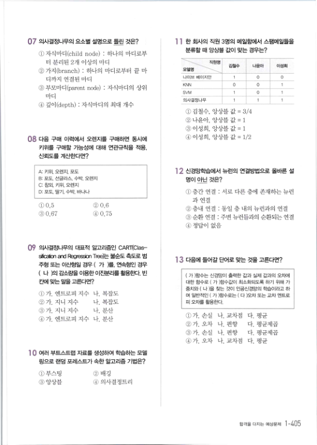
07 의사결정나무의 요소별 설명으로 틀린 것은？ 11 한 회사의 직원 3명의 메일함에서 스팸메일들을 분류할 때 앙상블 값이 맞는 경우는？ ①자식마디（child node) : 하나의 마디로부 터 분리된 2개 이상의 마디 ② 가지（branch) : 하나의 마디로부터 끝 마 디까지 연결된 마디 ③ 부모마디（parent node) : 자식마디의 상위 마디 ④ 깊이（depth) : 자식마디의 최대 개수 \\ 직원명 모델명 김철수 나윤아 이성희 나이브 베이지안 1 0 0 KNN 0 0 1 SVM 1 0 1 의사결정나무 1 1 1 ① 김철수 , 앙상블 값 = 3/4 ② 나윤아 , 앙상블 값 = 1 ③ 이성희 , 앙상블 값 = 1 ④ 이성희 , 앙상블 값 = 1/2 08 다음 구매 이력에서 오렌지를 구매하면 동시에 키위를 구매할 가능성에 대해 연관규칙을 적용， 신뢰도를 계산한다면？ 12 신경망학습에서 뉴런의 연결방법으로 올바른 설 A: 키위 , 오렌지 , 포도 B: 포도， 선글라스， 수박 , 오렌지 C: 참외 , 키위 , 오렌지 D: 포도 , 딸기 , 수박 , 바나나 명이 아닌 것은？ ① 층간 연결 : 서로 다른 층에 존재하는 뉴런 과 연결 ② 층내 연결 : 동일 층 내의 뉴런과의 연결 ③ 순환 연결 : 주변 뉴런들과의 순환되는 연결 ④ 정답이 없음 ①0.5 ③0.67 ②0.6 ④0.75 09 와사결정나무의 대표적 알고리즘인 CART(Clas- sfcatkn and Fgnx13cn Tree》는 불순도 측도로 범 13 다음에 들어갈 단어로 맞는 것을 고른다면？ 주형 또는 아산형일 경우 ( 가 ）를 , 옘늠형인 경우 ( 나 ）의 감소량을 o屠한 이진분리를 활용한다 . 빈 ( 가 ）함수는 신경망이 출력한 값과 실제 값과의 도차에 대한 함수로 ( 가 ）함수값이 최소화돠도록 하기 위해 가 중치와 ( 나 ）을 찾는 것이 인공신경망의 학습이라고 하 며 일반적인 ( 가 ）함수로는 ( 다 ）오차 또는 교차 엔트로 피 오차를 활용한다． 칸에 맞는 말을 고른다면？ ①가 . 엔트로피 지수 나 . 복잡도 ②가 . 지니 지수 나 . 복잡도 ③가 . 지니 지수 나 . 분산 ④가 . 엔트로피 지수 나 . 분산 ① 가． ②가． ③ 가． ④ 가．

# 鎰
鎖 10 여러 부ㅌㅅㅌ랩 자료를 생성하여 학습하는 모델 링으로 랜덤 포레스트가 속한 알고리즘 기법은？ ①부스팅 ② 배깅 ③앙상블 ④ 의사결정트리

> 다 . 평균 
다 . 평균졔곱 다 . 평균제곱 다 . 평균

> 교차점 
편향 편향 교차점

> 나
나 나 나

> 합격을다지는예상문제 1-405
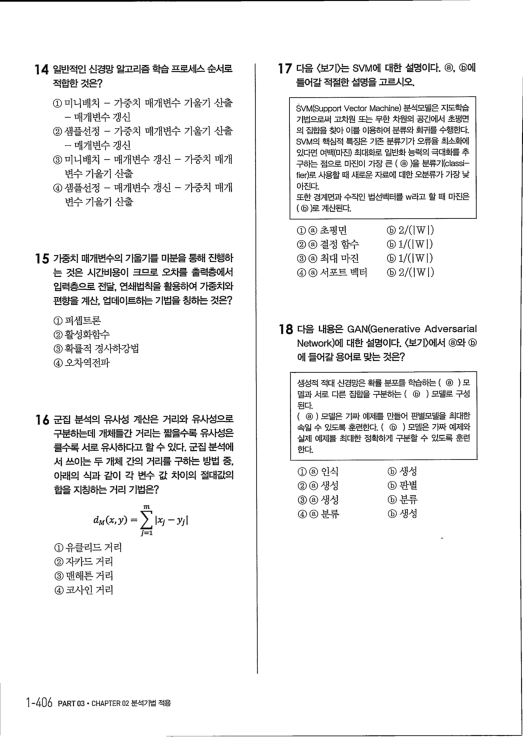
17 다음 〈보기〉는 SVM에 대한 설명이다 . 垣）, ⑥에

#### 14 일반적인 신경망 알고리즘 학습 프로세스 순서로
들어갈 적절한 설명을 고르시오． 적합한 것은？ ① 미니배치 - 가중치 매개변수 기울기 산출

- 매개변수 갱신 
②샘플선정 - 가중치 매개변수 기울기 산출

- 매개변수 갱신 
③ 미니배치 - 매개변수 갱신 - 가중치 매개 변수 기울기 산출 ④ 샘플선정 - 매개변수 갱신 - 가중치 매개 변수 기울기 산출 SVM(Support Vector Machine) 분석모델은 지도학습 기법으로쩌 고차원 또는 무한 차원의 공간에서 초평면 의 집합을 찾아 이를 이용하여 분류와 회귀를 수행힌다． SVM의 핵심적 특츤［은 기존 분류기가 오류율 최소화에 있다면 여백（마진） 최대화로 일반화 능력의 극대화를 추 구하는 점으로 마진이 가장 큰 ( 垣） ）을 분류기（classi- fier）로 사용할 때 새로운 차료에 대한 오분류가 가창 낮 아진다． 또한 경계면과 수직인 법선벡터를 w라고 할 때 마진은 ( ⑥ ）로 계산된다． ①④초평면 ⑥2/이ㄳ시） ②（즈） 결정 함수 ⑥ 1／이끼） 1 5 가중치 매개변수의 기울기를 미분을 톰해 진행하 는 것은 시간비용이 크므로 오차를 출력층에서 ③（즈） 최대 마진 ⑥1/이ㄳ시） ④④서포트벡터 ⑥2/이，찌） 입력층으로 전달, 연쇄법칙을 활용하여 가중치와 편향을 계산 , 업데이트하는 기법을 칭하는 것은？ ① 퍼셉트론 18 다음 내용은 GAN(Generative Adversarial ②활성화함수 ③확률적 경사하강법 ④오차역전파 Network）에 대한 설명이다 , 〈보기〉에서 ⑥와 ⑥ 에 들어갈 용어로 맞는 것은？ 생성적 적대 신경망은 확률 분포를 학습하는 ( @) ) 모 델과 서로 다른 집합을 구분하는 ( ⑥ ) 모델로 구성 된다． ( ⑧ ) 모델은 가짜 예제를 만들어 판별모델을 최대한 1 6 군집 분석의 유사성 계산은 거리와 유사성으로 속일 수 있도록 훈련한다. ( ⑥ ) 모델은 가짜 예제와 실제 예제를 최대한 정확하게 구분할 수 있도록 훈련 구분하는데 개체들간 거리는 짧을수록 유사성은 클수록 서로 유사하다고 할 수 있다 . 군집 분석에 힌다． 서 쓰이는 두 개체 간의 거리를 구하는 방법 중， ① ④ 인식 ② （프） 생성 ③ ④ 생성 ④ (E) 분류 0牌ㅐ의 식과 같이 각 변수 값 차이의 절대값의 합을 지칭하는 거리 기법은？ 7꾜

#### dM(x,y) = ) Xj－聊 
j=1 ① 유클리드 거리 ② 자카드 거리 ③ 맨해튼 거리 ④ 코사인 거리 1-406 PART 03· CHAPTER 02분석기법적용

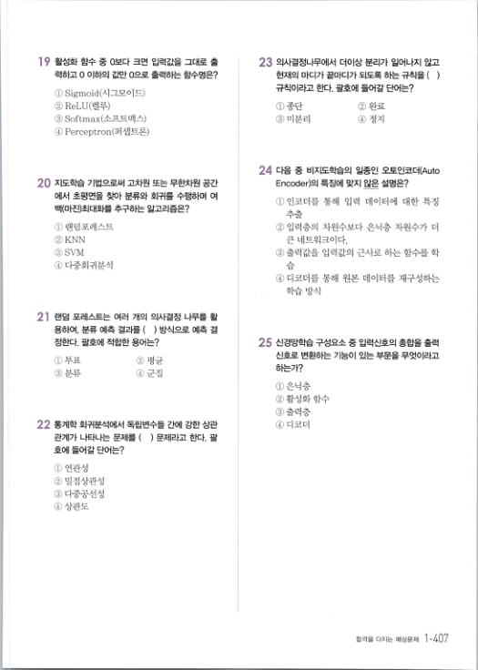
1 ' 활성화 함수 중 0보다 크면 입력값을 그대로 출 23 의사결정나무에서 더이상 분리가 일어나지 않고 력하고 0 이하의 값만 0으로 출력하는 함수명은？ 현재의 마디가끝마디가되도록하는규칙을（ ) 규칙이라고 한다 . 괄호에 들어갈 단어는？ ① Sigmoid（시그모이드） ② ReLU（렐루） ③ Softmax（소프트맥스） ①종단 ②완료 ③미분리 ④ 정지 ④ Perceptron（퍼셉트론） 24 다음 중 비지도학습의 일종인 오토인코더（Auto 20 지도학습 기법으로써 고차원 또는 무한차원 공간 Encoder）의 특징에 맞지 않은 설명은？ 에서 초평면을 짖아 분류와 회귀를 수행하며 여 백（마진）최대화를 추구하는 알고리즘은？ ①인코더를 통해 입력 데이터에 대한 특징 추출 ② 입력층의 차원수보다 은닉층 차원수가 더 큰 네트워크이다． ③ 출력값을 입력값의 근사로 하는 함수를 학 습 ④ 디코더를 통해 원본 데이터를 재구성하는 학습 방식 ① 랜덤포레스트 ② KNN ③ SVM ④ 다중회귀분석 21 랜덤 포레스트는 여러 개의 의사결정 나무를 활 용하여 , 분류 예측 결과를 ( ) 방식으로 예측 결 정한다 . 괄호에 적합한 용어는？ 25 신경망학습 구성요소 중 입력신호의 총합을 출력 신호로 변환하는 기능이 있는 부문을 무엇이라고 ①투표 ② 평균 ③분류 ④군집 하는가？ ①은 층 ②활성화함수 ③출력층 ④ 디코더 22 통계학 회귀분석에서 독립변수들 간에 강한 상관 관계가 나타나는 문제를 ( ) 문제라고 한다 . 괄 호에 들어갈 단어는？ ① 연관성 ② 밀접상관성 ③ 다중공선성 ④상관도

> 합격을다지는예상문제 ㅏ 07
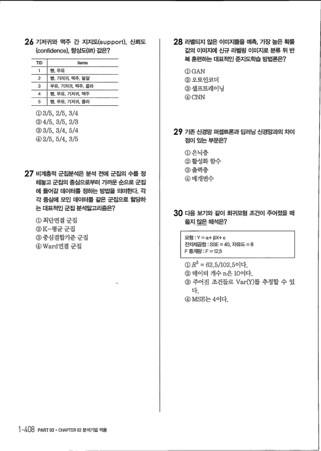
28 라벨되지 않은 이미지들을 예측 , 가장 높은 확률 26 기저귀와 맥주 간 지지도（support) , 신뢰도 (confidence) , 향상도跡） 값은？ 값의 이미지에 A1 i. 1구 라벨링 이미지로 분류 뒤 반 복 훈련하는 대표적인 준지도학습 방법론은？ ]1D Items @GAN ②오토인코더 빵．우유 2 빵 . 기저귀 . 액주 . 달걀 3 우유 . 기저귀 . 맥주 . 콜라 ③셀프트레이닝 @CNN 4 빵 , 우유 . 기저귀 , 맥주 5 빵 . 우유 . 기저 . 콜라 @3/5, 2/5, 3/4 ②4/5, 3/5, 2/3 ③3/5, 3/4, 5/4 @2/5, 5/4, 3/5 29 기존 신경망 퍼셉트론과 딥러닝 신경망과의 차이 점이 있는 부문은？ ①은닉층 ②활성화함수 ③출력층 ④ 매개변수 27 비계李1 군집분석은 분석 전에 군집의 수를 정 해놓고 군집의 중심으로부터 가까운 순으로 군집 에 들어갈 데이터를 정하는 방법을 의미한다 , 각 각 중심에 모인 데이터를 같은 군집으로 힐당하 는 대표적인 군집 분석알고리즘은？ 30 다음 보기와 같이 회귀모형 조건이 주어졌을 때 ① 최단연결 군집 ②K－평균군집 ③ 중심결합기준 군집 ④ Ward연결 군집 옳지 않은 해석은？ 모형 : Y = α＋ β×＋ 6 잔차처居합：SSE = 40 , 자유도＝8 F 통계량 : F =12.5 ①／콘 = 62.5/102.5이다． ② 데이터 개수 n은 10이다． ③ 주어진 조건들로 Var(Y）를 추겅할 수 있 다． ④ MSE〕는 4이다． 1-408 PART 03 ' CHAPTER 02분석기법적용

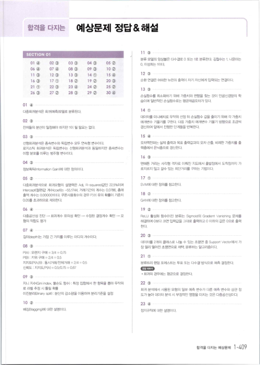
## 합격을다ㅈ（「 
예상문제 정답＆해설 11 c) ………………………… …………………………一……－……… SECTION 01 분류 모델의 앙상블은 다수결로 0 또는 1로 분류한다． 김철수는 1 . 나윤아는 0 . 이성희는 1이다． 04 c:) 09 ③ 14 (j:) 19 ② 24 ② 29 ② 01 ④ 02 ③ 05 ② 03 ③ 06 ④ 07 C) 12 （횰：I 08 ③ 10 ② 12 （功 …………………………… ……… ……… 11 13 《횹：l 15 ④ 순환 연결은 어떠한 뉴런의 출력이 자기 자신에게 입력돠는 연결이다． 16 ③ 17 ① 18 ② 20 ③ 21 ① 22 ③ 23 ④ 25 《2;I 30 ④ 13 ③ …………… … … …… …………… …… … … 26 ＜亘：) 27 ② 28 《亘：l 손실함수를 최소촤하기 위해 가중치와 편향을 찾는 것이 인공신경망의 학 습이며 일반적인 손실함수로는 평균제곱오차가 있다． 01 ④ …………………………－…一……… 14 ① 一……－………－………………………………………… …… …… 다중회귀분석은 회귀（예측）모델로 분류된다， 데이터를 미니배치로 무작위 선정 뒤 손실함수 값을 줄이기 위해 각 가중치 02 ③ … … 매개변수 기울기를 구한다. 다음 가중치 매개변수 기울기 방향으로 조금씩 갱신하여 앞에서 진행한 단계들을 반복한다． 잔차들의 분산이 일정해야 하지만 1이 될 필요는 없다． 15 ④ ……………… 6…… ……… … … … … 03 （효） ………………………………一…………………………………－『 오차역전파는 실제 출력과 목표 출력값과의 오차 산출. 비례한 가중치를 출 선형회귀분석은 종속변수와 독립변수 모두 연속형 변수이다， 력충에서 은닉충으로 갱신한다， 로지스틱 회귀분석은 독립변수는 선형회귀분석과 동일하지만 종속변수는 이항 분포를 이루는 범주형 변수이다． 16 ③ ……………… …… ………… … 04 ③ …… ……………… … 맨해튼 거리는 사각형 격자로 이뤄진 지도에서 출발점에서 도착점까지 가 로자르지 않고 갈수 있는 최단거리를 구하는 기법이다． 정보획득ㅔntormation Gain）에 대한 정의이다． 17 ① …… … → ……－ 05 (2) …… …………… SVM에 대한 정의를 참고한다． 다중회귀분석으로 회귀모형의 설명력은 Adj. R-squared값인 22.5％이며 ntercept（절편）값 7＃수（coef）는 -55.1744 . 거래기간의 7＃수는 0.0786. 총매 18 ② 」 … 출액 계수는 0.000001이다 . 쿠폰사용횟수의 경우 P기＂ 유의 확률이 기준치

0. 05를 최ㅘ하므로 제외한다．
GAN0卄 대한 정의를 참고한다． 06 ④ ………∼…………… ………………………………………∼… 19 ② …………………………∼……… ……－…… 다중공선성 진단 → 회귀계수 유의성 확인 - 수정된 결정계수 확인 → 모 ReLU 활성화 함수（이진 분류）는 Sigmoid의 Gradient Vanishing 문제를 형의 적합도 평가 해결하며 0보다 크면 입력값을 그대로 출력하고 0 이하의 값은 0으로 출력 한다． 07 ④ … … … … ……… …… 20 ③ ……… …………… …… … ……………… ………∼…… 깊이（depth＞는 가장 긴 가ㅈ隱 이루는 마디의 개수이다． 데이터를 2개의 클래스로 나눌 수 있는 초평면 중 Support Vector에서 가 장 멀리 떨어진 초평면으로 채택 . 분류하는 알고리즘《기다． 08 ③ ………………………… …… ……

```python
P섞) : 오렌지 구매 = 3/4 = 0.75 
P(B) : 키위 구매 = 2/4 = 0.5
```
21 ① … …………………… …… 지지도（NAB)) ; 동시거래／전처거래 = 2/4 = 0.5 분류트리 랜덤 포레스트는 투표 또는 다수결 방식으로 예측 결정한다， 신롸도 : 지지도jP(A) = 0.5/0.75 = 0.67 오답 띠하기

- 회귀의 경무낙게는 평균으로 결정한다．
09 ③ …………………………………………………………………… ………… 지니 자쉬Gini index . 불순도 함수） : 특정 집합에서 한 항목을 뽑아 무작위 로 라벨 추정 시 틀릴 확률 22 （軫 회귀 분석에서 사용된 모형의 일부 예측 변수가 다른 예측 변수와 상관 정 도가 높가 데이터 분석 시 부정적인 영향을 미치는 것은 다중공선성이다． 이진분리（Binary split) : 분산의 감소량을 이용하여 분리기준을 설정 배깅（Bagging》게 대한 설명이다． 정자규칙에 대한 설영이다．

> 합격을다지는예상문제 ㅏ 09
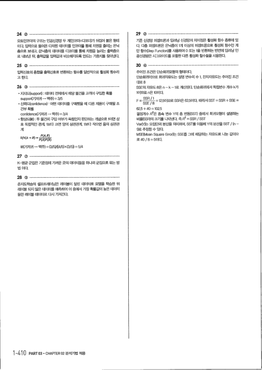
29 ② ........................................................................................................................................

24 ② -0∼－---－…－－一－·………∼一………··－－……·－…－--－→· 기존 신경망 퍼셉트론과 딥러닝 신경망의 차이점은 활성화 함수 종류에 있 오토인코더의 구조는 인공신경망 두 개（인코더＋디코더》가 뒤집어 붙은 형태 다. 다층 퍼셉트론은 은닉층이 1가l 이상의 퍼셉트론으로 활성화 함수인 계 이다. 입력으로 들어온 다차원 데이터를 인코더를 통해 차원을 줄이는 은닉 단 함수〈Step Function）를 사용하여 0 또는 1을 반환하는 반면에 딥러닝 인 층으로 보내고， 은닉층의 데이터를 디코더를 통해 차원을 늘리는 출력층으 로 내보닌i 두ㅗ 출력값을 입력값과 비슷해지도록 만드는 7隱ㅊ隱 짖아낸다． 공신경망은 시그모이드를 포함한 다른 활성화 함수들을 사용텬빠． 30 ④ ................................................................................ --＂∥＂-- －·－·“·· 25 ② ”∼·∼-－· -- ∼…………一0－…－……--…··…－·－-·4．··…-‘·－∼·－-· 주어진 조건은 단순회귀모형의 형태이다． 단순회귀이므로 회귀자유도는 설명 변수의 수 1 , 진차자유도는 주어진 조건 대로8 입력신호의 총합을 출력신호로 변환하는 함수를 일반적으로 활성화 함수라 고 한다． 26 ③ 一………．∼…－一·→··…∼……∼……·」 .

- · . 
- 」 -
SSE의 자유도8은 n- k- i로 계산된다. 단순회귀에서 독립변수 개쉬아 1이므로 n은 10이다．

- 지지도（support) : 데이터 전체에서 해당 물건을 고객이 구입한 확률
- 
SSR/ i . ..^ , -. ∼一＾ ∼，一一 . . ．ㄱ쨍 , ` ∼－ ∼一 . ∼一 卜= SSE/8 = ir"OU느도 Kㅎ O乙OU 4. ㄴ rㄷV1 0 I = OOI 1 oㄷ = 6a5 40=10a5 support（기저귀 - 맥주）=3/5

- 신뢰도（confidence): 어떤 데이터를 구매했을 때 다른 저曆이 구매될 조
건부확률 confidence（기저귀 - 액주） = 3/4

- 향상도.itt) : 두 물건의 구입 여부가 독립인지 푠嚥크하는 개념으로 1이면 상 
호 독립적인 관계 . 1보다 크면 양의 상관관계 . 1보다 작으면 음의 상관관 결정계수 /7은 종속 변수 Y의 총 변동《SST) 쥠게서 회귀모형이 설명하는 비율《SSR）의 크기를 나타낸다. 즉／7 = SSR / SST Var(Y准 모집단의 분산을 의미하며． SST를 이용해 Y의 분산을 SST / (n - 1）로추정할수있다． MSE(Mcan Square Error）는 SSㅌ를 그에 해당ㅎ隱 자유도로 나눈 값이므 로 40 / 8 = 5이다． 峨（J→쨔 ,P B) Uft(A 5) P(A)P(B) "![（기저귀 - 맥주） = (3/5)/((4/5)x(3/5)) = 5/4 27 ② ....................................................................................................................................

∼· K-평균군집은 기준점에 가까운 곳의 데이터들을 하나의 군집으로 묶는 방 법 이다． 28 （효） ................................... .............................................................................................…..

준지도학습의 셀프트레이닝은 레이블이 달린 데이터로 모델을 학습한 뒤 레이블 되지 않은 데이터를 예측하여 이 剖 서 가장 확률값이 높은 데이터 들만 레이블 데이터로 다시 가져간다． 1-410 PART 03. CHAPTER 02분석기법적용

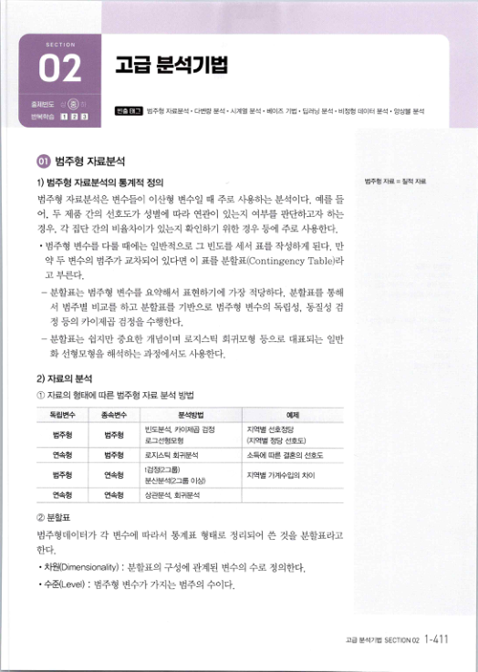
# SECTION 02
# 고급 분석기법
출저빈도 （돌） 빈출 태그 범주형 자료분석 · 다변량 분석 · 시계열 분석 · 베이즈 기법 · 딥러닝 분석 · 비정형 데이터 분석 · 앙상블 분석 반복학습 口 口 口

#### .I 범주형 자료분석
1) 범주형 자료분석의 통계적 정의 범주형 자료분석은 변수들이 이산형 변수일 때 주로 사용하는 분석이다 . 예를 들 어 , 두 제품 간의 선호도가 성별에 따라 연관이 있는지 여부를 판단하고자 하는 경우 , 각 집단 간의 비율차이가 있는지 확인하기 위한 경우 등에 주로 사용한다．

- 범주형 변수를 다룰 때에는 일반적으로 그 빈도를 세서 표를 작성하게 된다 . 만
약 두 변수의 범주가 교차되어 있다면 이 표를 분할표（Contingency Table）라 고 부른다．

- 분할표는 범주형 변수를 요약해서 표현하기에 가장 적당하다 . 분할표를 통해
서 범주별 비교를 하고 분할표를 기반으로 범주형 변수의 독립성 , 동질성 검 정 등의 카이제곱 검정을 수행한다．

- 분할표는 쉽지만 중요한 개념이며 로지스틱 회귀모형 등으로 대표되는 일반 
화 선형모형을 해석하는 과정에서도 사용한다． 2) 자료의 분석 1「 자료의 형태에 따른 범주형 자료 분석 방법 독립변수 종속변수

- 
분석방법 예제 빈도분석． 카이제곱검정 지역별 선호정당 범주형 범주형

- 로그선형모형
（지역별 정당 선호도） 로지스틱회귀분석 소득에 따른 결혼의 선호도 연속형 범주형 범주형 연속형 t검정（2그룹） 분산분석（2그룹 이상） 지역별 가계수입의 차이 연속형 연속형 상관분석 , 회귀분석 ② 분할표 범주형데이터가 각 변수에 따라서 통계표 형태로 정리되어 쓴 것을 분할표라고 한다．

#### · 차원（Dimensionality) : 분할표의 구성에 관계된 변수의 수로 정의한다．
#### · 수준＜Level) : 범주형 변수가 가지는 범주의 수이다．
> 범주형 자료 = 질적 자료
> 고급분석기법 SECTION 02 ㄴ시 1
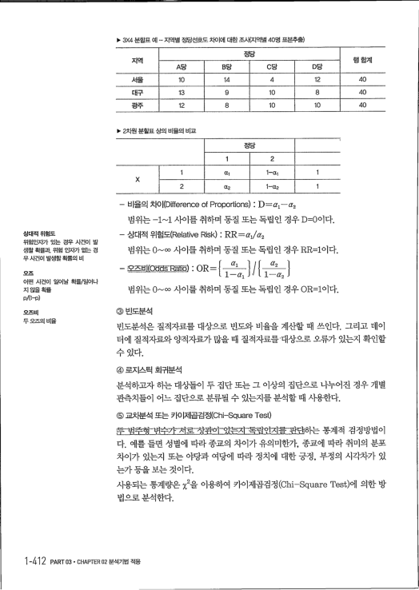
) 3X4 분할표 예 - 지역별 정당선호도 차이에 대한 조사（지역별 40명 표본추출） 지역 정당 행 합계 A당 B당 C당 D당 서을 10 14 4 12 40 대구 13 9 10 8 40 광주 12 8 10 10 40

> 2차원 분할표 상의 비율의 비교
정당 1 2 x 1 a1 1-a1 1 2 a2 1-a2 1

- 비율의 차이（Difference of Proportions) : D = a1 -α2
#### 범위는 -1-1 사이를 취하며 동질 또는 독립인 경우 D=O이다．
- 상대적 위험도（Relative Risk) : RR =α1／α2
상대적 위험도 위험인자가 있는 경우 사건이 발 범위는 O∼α〕 사이를 취하며 동질 또는 독립인 경우 RR=1이다． 생할 확률과. 위험 인자가 없는 경 우 사건이 발생할 확률의 비

#### . . 
. - - I  a1  1 i1  a。  1

- 쯔브l(QD峰亘ER鋤미 : 0J《＝j ㅕ ' 
- / - . 
"

- 
t [-α1 J '' . i- a2 - pㅈ 어떤 사건이 알거날 확률／일에극 지 않을 확률 p/(1-p) 범위는 o∼α〕 사이를 취하며 동질 또는 독립 인 경우 ○R=1이다． ③ 빈도분석 오즈비 두 오즈의 비율 빈도분적은 질적자료를 대상으로 빈도와 비율을 계산할 때 쓰인다 . 그리고 데이 터에 질적자료와 양적자료가 많을 때 질적자료를 " 대상으로 오류가 있는지 확인할 수 있다． ④ 로지스틱 회귀분석 분석하고자 하는 대상들이 두 집단 또는 그 이상의 집단으로 나누어진 경우 개별 관측치들이 어느 집단으로 분류될 수 있는지를 분석할 때 사용한다． ⑤ 교차분석 또는 카이제곱검정（Chi-Square Test) rn 범주혁－벼수가I넉로ㅋ깟콴이－얹；극ㅋ 쪽립"인치름항단하는 통계적 검정방법이 다 . 예를 들면 성별에 따라 종교의 차이가 유의미한가 , 종교에 따라 취미의 분포 차이가 있는지 또는 야당과 여당에 따라 정치에 대한 긍정 , 부정의 시각차가 있 는가 등을 보는 것이다． 사용되는 통계량은 2을 이용하여 카이제곱검정（Chi-Square Test）에 의한쌍 법으로 분석한다． 1 -412 PART 03. CHAPTER 02분석기법적용

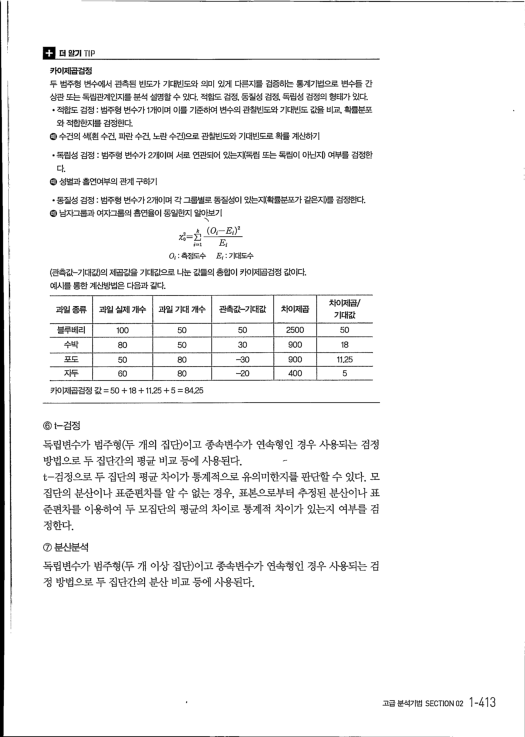
카이제곱검정 두 범주형 변수에서 관측된 빈도가 기대빈도와 의미 있게 다른지를 검증하는 통계기법으로 변수들 간 상관 또는 독립관계인지를 분석 설명할 수 있다 . 적합도 검정 , 동질성 검정 . 독립성 검정의 형태가 있다．

- 적합도 검정 : 범주형 변수가 1개이며 이를 기준하여 변수의 관칠빈도와 기대빈도 값을 비교， 확률분포
와 적합한지를 검정힌다． .l 수건의 색（흰 수건 , 파란 수건 . 노란 수건）으로 관칠빈도와 기대빈도로 확률 계산하기

- 독립성 검정 : 범주형 변수가 2개이며 서로 연관되어 있는지（복립 또는 독립이 아닌지） 여부를 검정한
다． c[l 성별과 흡연여부의 관계 구하기

- 동질성 검정 : 범주형 변수가 2개이며 각그룹별로 동질성이 있는지（확률분포가 같은지）를 검정한다． 
.l 남자그룹과 여자그룹의 흡연율이 동일한지 일아보기 , / 2= k 이 : 측정도수 凡 : 기대도수 （관측값－기대값）의 제곱값을 기대값으로 나눈 값들의 총합이 카이저곱검정 값이다． 예시를 통한 계산방법은 다음과 같다． 과일종류 과일 실제 개수 과일 기대 개수 관측값－기대값 차이제곱 차이저曆／ 기대값 블루베리 100 50 50 2500 50 수박 80 50 30 900 18 꾸두 50 80 -30 900

11. 25
자두 60 80 -20 400 5 카이제곱검정 값 = 50 + 18 + 1125 + 5 = 84.25 ⑥ t－검정 독립변수가 범주형（두 개의 집단）이고 종속변수가 연속형인 경우 사용되는 검정 방법으로 두 집단간의 평균 비교 등에 사용된다． t－검정으로 두 집단의 평균 차이가 통계적으로 유의미한지를 판단할 수 있다 . 모 집단의 분산이나 표준편차를 알 수 없는 경우 , 표본으로부터 추정된 분산이나 표 준편차를 이용하여 두 모집단의 평균의 차이로 통계적 차이가 있는지 여부를 검 정한다． ⑦ 분산분석 독립변수가 범주형（두 개 이상 집단）이고 종속변수가 연속형인 경우 사용되는 검 정 방법으로 두 집단간의 분산 비교 등에 사용된다．

> 고급분석기법 SECTION 02 1 -시3
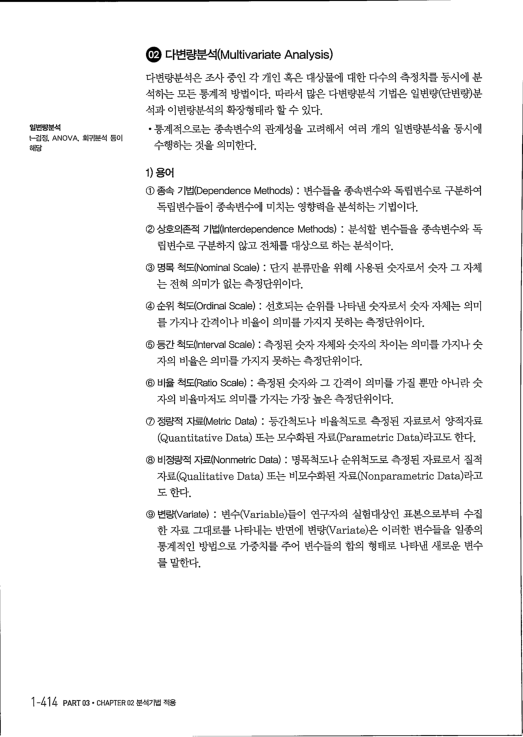
.

다변량분석（M미tivariate Analysis) 다변량분석은 조사 중인 각 개인 혹은 대상물에 대한 다수의 측정치를 동시에 분

#### 석하는 모든 통계적 방법이다 . 따라서 많은 다변량분석 기법은 일변량（단변량）분
석과 이변량분석의 확장형태라 할 수 있다．

- 통계적으로는 종속변수의 관계성을 고려해서 여러 개의 일변량분석을 동시에
일변량분석 t－검정 . ANOVA . 회귀분석 등이 해당 수행하는 것을 의미한다． 1）용어 ① 종속 기법（Dependence Methods) : 변수들을 종속변수와 독립변수로 구분하여 독립변수들이 종속변수에 미치는 영향력을 분석하는 기법이다． ② 상호의존적 기법ㅇnterdependence Methods) : 분석할 변수들을 종속변수와 독 립변수로 구분하지 않고 전쳬를 대상으로 하는 분석이다． ③ 명목 척도（Nominal Scale) : 단지 분류만을 위해 사용된 슷자로서 슷자 그 자쳬 는 전혀 의미가 없는 측정단위이다．

#### ④ 순위 척도（Ordinal Scale) : 선호되는 순위를 나타낸 슷자로서 숫자 자쳬는 의미 
를 가지나 간격이나 비율이 의미를 가지지 못하는 측정단위이다．

#### ⑤ 등간 척도ㅇnterval Scale) : 측정된 숫자 자쳬와 숫자의 차이는 의미를 가지나 슷
#### 자의 비율은 의미를 가지지 못하는 측정단위이다 .
⑥ 비율 척도（Ratio Scale) : 측정된 슷자와 그 간격이 의미를 가질 뿐만 아니라 숫 자의 비율마저도 의미를 가지는 가장 높은 측정단위이다． ⑦ 정량적 자료（Metric Data) : 등간척도나 비율척도로 측정된 자료로서 양적자료 (Quantitative Data) 또는 모수화된 자료（Parametric Data＞라고도 한다．

#### ⑧ 비정량적 차료（Nonmetric Data) : 명목척도나 순위척도로 측정된 자료로서 질적
자료（Qualitative Data) 또는 비모수화된 자료（Nonparametric Data）라고 도 한다． ⑨ 변량（Variate) : 변수（Variable）들이 연구자의 실험대상인 표본으로부터 수집 한 자료 그대로를 나타내는 반면에 변량（Variate）은 이러한 변수들을 일종의 통계적인 방법으로 가중치를 주어 변수들의 합의 형태로 나타낸 새로운 변수

#### 를 말한다 .
1 -414 PART 03· CHAPTER 02분석기법적용

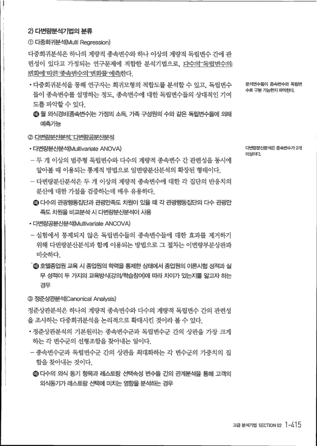
2) 다변량분석기법의 분류 ① 다중회귀분석（Multi Regression) 다중회귀분석은 하나의 계량적 종속변수와 하나 이상의 계량적 독립변수 간에 관 런성이 있다고 가정되는 연구문제에 적합한 분석기법으로 , 다生의겯득：립뱐숫의 변회：왜公盤蠶솜里숫의＝변화릎쫴츰i한다．

- 다중회귀분적을 통해 연구자는 회귀모형의 적합도를 분적할 수 있고 , 독립변수
#### 들이 종속변수를 설명하는 정도 , 종속변수에 대한 독립변수들의 상대적인 기여 
도를 파악할 수 있다． .l 월 외식경비（熱변수）는 가정의 소득 , 가족 구성원의’수와 겉은 독립변수들에 의해 예측가능 ② 다변링纏산분첨［드L변링공분찬분섬

- 다변량분산분석（Multivariate ANOVA)
- 두 개 이상의 범주형 독립변수와 다수의 계량적 종속변수 간 관련성을 동시에
알아볼 때 이용되는 통계적 방법으로 일변량분산분석의 확장된 형태이다．

- 다변량분산분석은 두 개 이상의 계량적 종속변수에 대한 각 집단의 반응치의
#### 분산에 대한 가설을 검증하는데 매우 유용하다． 
.l 다수의 관광행동집단과 관광만족도 차원이 있을 때 각 관광행동집단의 다수 관광만 족도 차원을 비교분석 ' 시 다변량분산분석이 사용

- 다변량공분산분석(Multivariate ANCOVA)
- 실험에서 통제되지 않은 독립변수틀의 종속변수들에 대한 효과를 제거하기
위해 다변량분산분석과 함께 이용되는 방법으로 그 절차는 이변량부분상관과 비슷하다． " clI 호텔종업원 교육 시 종업원의 학력을 통제한 상태에서 종업원의 이론시험 성적과 실 무 성적이 두 가지의 교육방식（강의／학습참여）에 따라 채기가 있는지를 알고자 하는 경우 ③ 정준상관분석（Canonical Analysis) 정준상관분석은 하나의 계량적 종속변수와 다수의 계량적 독립변수 간의 관런성 을 조사하는 다중회귀분석을 논리적으로 확대시킨 것이라 볼 수 있다．

- 정준상관분석의 기본원리는 종속변수군과 독립변수군 간의 상관을 가장 크게
하는 각 변수군의 선형조합을 찾아내는 일이다．

- 종속변수군과 독립변수군 간의 상관을 최대화하는 각 변수군의 가중치의 집
합을 찾아내는 것이다． c[I 다수의 외식 동기 항목과 레스토랑 선택속성 변수들 간의 관계분석을 통해 고객의 외식동기가 레스토랑 선택에 미치는 영향을 분석하는 경우

> 분석변수들이 종속변수와 독립변 
수로 구분 가능한지 파악한다．

> 다변량분산분석은 종속변수가 2개
> 이상이다．
> 고급분석기법 SECTION 02 L시5
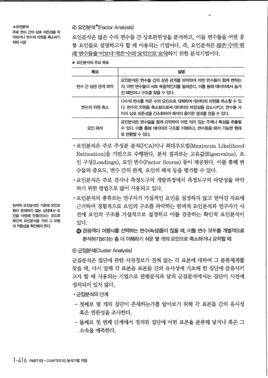
④ 요인분석★(Factor Analysis) ★요인분석 주로 변수 간의 상호 의존성을 파 악하거나 변수의 차원을 췬느하기 위해 사용

#### 요인분석은 많은 수의 변수들 간 상호관련성을 분석하고 , 이들 변수들을 어떤 공 
통 요인들로 설명하고자 할 때 이용되는 기법이다 . 즉 , 요인분석은 많은E소의坐 玳변숫들-0-ㅍ의보댜적은콕＝의＝요＝언＝으로＝요＝으톤 기 위한 분석기법이다． 》 요인분석의 주요 목표 목표 설명 요인분석은 변수들 간의 상관 관계를 파악하여 어떤 변수들이 함께 변하는 지 . 어떤 변수들이 서로 독립적인지를 알려준다. 이를 통해 데이터에서 숨겨 진 패턴이나 구조를 찾을 수 있다． 변수 간 상관 관계 파악 다수의 변수를 적은 수의 요인으로 대체하여 데이터의 차원을 축소할 수 있 다. 변수의 차원을 축소함으로쩌 데이터의 복잡성을 감소시키고， 변수들 사 변수의 차원 축소 이의 상호 의존셩을 간소화하여 해석이 용이한 결과를 얻을 수 있다． 요인분석은 변수들을 함께 요약하여 어떤 의미 있는 주제나 특셩을 추출할 수 있다 . 이를 통해 데이터의 구조를 이해하고， 변수들을 해석 가능한 형태 로 변환할수 있다． 요인 해석

#### · 요인분석은 주로 주정분 분석（PCA）이나 최대우도법（Maximum Likelihood 
Estimation）을 기반으로 수행된다 . 분석 결과로는 고유값（Eigenvalue) , 요

#### 인 구성（Loadings) , 요인 변수（Factor Scores) 등이 제공된다 . 이를 통해 변
수들의 중요도 , 변수 간의 관계 , 요인의 해석 등을 평가할 수 있다．

- 요인분석은 주로 검사나 측정도구의 개발과정에서 측정도구의 타당성을 파악
하기 위한 방법으로 많이 사용되고 있다．

- 요인분석의 종류로는 연구자가 가설적인 요인을 설정하지 않고 얻어진 자료에
탐색적 요인분석은 기존에 요인모 근거하여 경험적으로 요인의 구조를 파악하는 탐색적 요인분석과 연구자가 사 형이 존재하지 않는 상태에서 요 인을 어림해 만들어보는 것으로 전에 요인의 구조를 가설적으로 설정하고 이를 검증하는 확인적 요인분석이 확인적 요인분석을 거쳐 그 모형 의 적합성을 확인해야 한다．

#### 있다． 
.l 관광객이 여행사를 선택하는 변수（속성）들이 많을 때 , 이들 변수 모두를 개별적으로 분석하기보다는 좀 더 이해하기 쉬운 몇 개의 요인으로 축소하게－才 요약할 때 ⑤ " 군집분석（Cluster Analysis) 군집분석은 집단에 관한 사전정보가 전혀 없는 각 표본에 대하여 그 분류쳬계를 찾을 때 , 다시 말해 각 표본을 표본들 간의 유사성어I 기초해 한 집단에 분류시키 고자 할 때 사용되는 기법으로 판별분석과 달리 군집분석에서는 집단이 사전에 정의되어 있지 않다．

- 군집분석의 단계
- 첫째로 몇 개의 집단이 존재하는가를 알아보기 위해 각 표본들 간의 유사성
혹은 연관성을 조사한다．

- 둘째로 첫 번째 단계에서 정의된 집단에 어떤 표본을 분류해 넣거나 혹은 그
소속을 예측한다． 1-4拓 PART03. CHAPTER 02분석기법적용

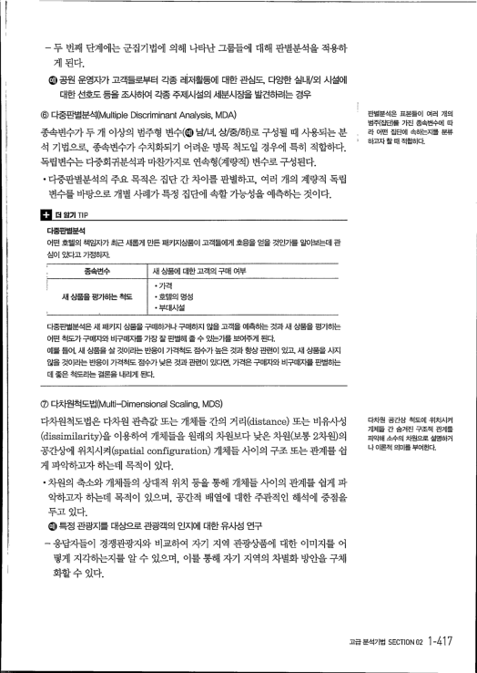
- 두 번째 단계에는 군집기법에 의해 나타난 그룹들에 대해 판별분석을 적용하
#### 게 된다． 
.I 공원 운영자가 고객들로부터 각종 레저활동에 대한 관심도， 다양한 실내／외 시설에 대한 선호도 등을 조사하여 각종 주제시설의 세분시장을 발견ㅎ罔는 경우 ⑥ 다중판별분석（Multi이e Discriminant Analysis, MDA)

#### 종속변수가 두 개 이상의 범주형 변수（.I 남／녀 , 毓중／하）로 구성될 때 사용되는 분
#### 석 기법으로 , 종속변수가 수치화되기 어려운 명목 척도일 경우에 특히 적합하다．
독립변수는 다중회귀분석과 마찬가지로 연속형（계량적） 변수로 구성된다．

#### · 다중판별분적의 주요 목적은 집단 간 차이를 판별하고 , 여러 개의 계량적 독립
변수를 바탕으로 개별 사례가 특정 집단에 속할 가능성을 예측하는 것이다． ..

더 알기 ㄲP 디중판별분석 어떤 호텔의 책임자가 최근 새롭게 만든 패키지상품이 고객믈게게 호응을 얻을 것인가를 알아보는데 관 심이 있다고 가정하자． 종속변수 새 상품에 대한 고객의 구매 여부 새 상풉을 평가하는 척도

- 가격 
- 호텔의 명성 
- 부대시설
다중판별분석은 새 패키지 상품을 구매하거나 구매하지 않을 고객을 예측하는 것과 새 상품을 평가하는 어떤 척도가 구매자와 비구매자를가장 잘 판별해 줄 수 있는가를 보여주게 된다． 예를 들어 . 새 상품을 살 것이라는 반응이 가격척도 점수가 높은 것과 항상 곤못釗 있고， 새 상품을 사지 않을 것이라는 반응이 가격척도 점수가 낮은 것과 관련이 있다면 . 가격은 구매자와 비구매자를 판별하는 데 좋은 척도라는 결론을 내리게 된다． ⑦ 다차원척도법（M미ti-Dimensional Scaling, MDS) 다차원척도법은 다차원 관측값 또는 개쳬들 간의 거리（distance) 또는 비유사성 (dissimilarity）을 이용하여 개쳬들을 원래의 차원보다 낮은 차원（보통 2차원）의 공간상에 위치시켜（spatial configuration) 개쳬들 사이의 구조 또는 관계를 쉽 게 파악하고자 하는데 목적이 있다．

- 차원의 축소와 개쳬들의 상대적 위치 등을 통해 개쳬들 사이의 관계를 쉽게 파
#### 악하고자 하는데 목적이 있으며 , 공간적 배열에 내한 주관적인 해석에 중점을 
두고 있다 .

.I 특정 관광지를 대상으로 관광객의 인지에 대한 유사성 연구

- 응답자들이 경챙관광지와 비교하여 자기 지역 관광상품에 대한 이미지를 어
#### 떻게 지각하는지를 알 수 있으며 , 이를 통해 자기 지역의 차별화 방안을 구쳬
#### 화할 수 있다 .
> 판별분석은 표본들이 여러 개의 
범쥐집단詹 가진 좀속변수에 따 라 어떤 집단0ㅔ 속하는지를 분류 하고자 할 때 적합해가．

> 다차원 공간상 척도에 4위치시켜 
개체들 간 숨겨진 구조적 관계를 파악해 소수의 차원으로 설명하거 나 이론적 의미를 부여한다．

> 고급분석기법 SECTION 02 1 -41 7
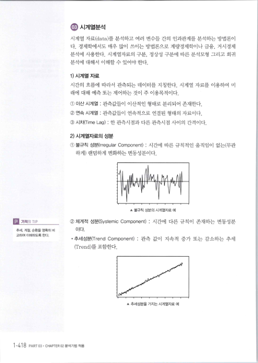
.시계열분석 시계열 자료（data）를 분석하고 여러 변수들 간의 인과관계를 분석하는 방법론이 다 . 경제학에서도 매우 많이 쓰이는 방법론으로 계량경제학이나 금융 , 거시경제

#### 분석에 사용한다 . 시계열자료의 구분 , 정상성 구분에 따른 분적모형 그리고 회귀
분적에 대해서 이해할 수 있어야 한다． 1) 시계열 자료

#### 시간의 흐름에 따라서 관측되는 데이터를 지칭한다 . 시계열 자료를 이용하여 미
래에 대해 예측 또는 제어하는 것이 주 이용목적이다．

#### ① 이산 시계열 : 관측값들이 이산적인 형태로 분리되어 존재한다．
#### ② 연속 시계열 : 관측값들이 연속적으로 연결된 형태의 자료이다．
#### ③ 시차（Time Lag) : 한 관측시점과 다른 관측시점 사이의 간격이다．
2) 시계열자료의 성분

#### ① 불규칙 성분.rregular Component) : 시간에 따른 규칙적인 움직임이 없는（무관
하게） 랜덤하게 변화하는 변동성분이다． ▲ 불규칙 상분의 시계열차료 예

#### ② 체계적 성분＜Systemic Component) : 시간에 다른 규칙이 존재하는 변동성분
.

기적의 TIP 이다． 추세 , 계절 , 순환을 명확히 비 교하여 이해하도록 한다．

#### · 추세성분（Trend Component) : 관측 값이 지속적 증가 또는 감소하는 추세
(Trend）를 포함한다． ▲ 추세성분을 가지는 시계열자료 예 ㅑ 18 PART03. CHAPTER 02분석기법적용 ]

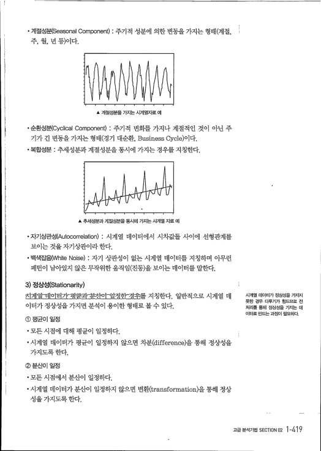
#### · 계절성분《Seasonal Component) : 주기적 성분에 의한 변동을 가지는 형태（계절， 
주 , 월 , 년등）이다． ▲ 계절성분을 가지는 시계열자료 예

#### · 순환성분（Cyclical Component) : 주기적 변화를 가지나 계절적인 것이 아닌 주
#### 기가 긴 변동을 가지는 형태（경기 대순환 , Business Cycle）이다．
#### · 복합성분 : 추세성분과 계절성분을 동시에 가지는 경우를 지칭한다．
▲ 추세성분과 계절상분을 동시에 가지는 시계열 자료 예

#### ·자기상관성（Autocorrelation) : 시계열 데이터에서 시차값들 사이에 선형관계를 
보이는 것을 자기상관이라 한다．

- 백색잡음《White Noise) : 자기 상관성이 없는 시계열 데이터를 지칭하며 아무런
패턴이 남아있지 않은 무작위한 움직임（진동）을 보이는 데이터를 말한다． 3) 정상성（Stationarity) 시계'열－데마터가평」균곽: 브]＝일펴燮－경우를 지칭한다 . 일반적으로 시계열 데 이터가 정상성을 가지면 분석이 용이한 형태로 볼 수 있다． (j:) 평균이 일정

- 모든 시점에 대해 평균이 일정하다．
- 시계열 데이터가 평균이 일정하지 않으면 차분（difference）을 통해 정상성을
가지도록 한다． ② 분산이 일정

- 모든 시점에서 분진이 일정하다．
- 시계열 데이터가 분산이 일정하지 않으면 변환（transformation）을 통해 정상
성을 가지도록 한다．

> 시계열 데이터가 정상성을 가지지 
못한 경우 다루기가 힘드므로 전

> 처리를 통해 정상성을 가지는 데 
이터로 만드는 과정이 필요하다．

> 고급분석기법 SECTION 02 ㅑ 
1?

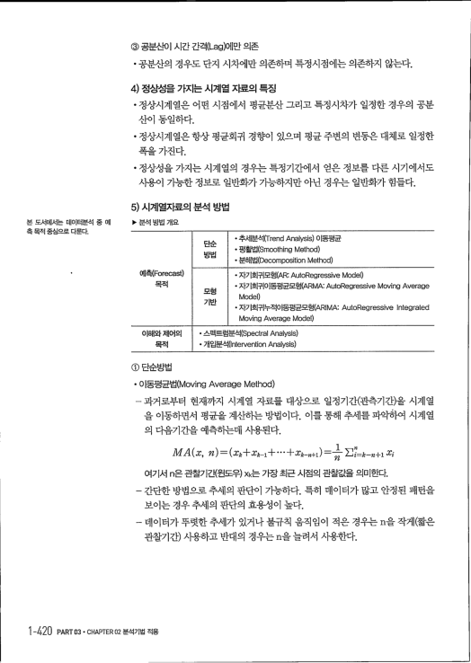
③ 공분산이 시간 간격（Lag）에만 의존

- 공분산의 경우도 단지 시차에만 의존하며 특정시점에는 의존하지 않는다．
4) 정상성을 가지는 시계열 자료의 특징

- 정상시계열은 어떤 시점에서 평균분산 그리고 특정시차가 일정한 경우의 공분
산이 동일하다．

- 정상시계열은 항상 평균회귀 경향이 있으며 평균 주변의 변동은 대쳬로 일정한
폭을 가진다．

- 정상성을 가지는 시계열의 경우는 특정기간에서 얻은 정보를 다른 시기에서도
사용이 가능한 정보로 일반화가 가능하지만 아닌 경우는 일반화가 힘들다． 5) 시계열자료의 분석 방법 본 도서에서는 데이터분석 중 0섧

> 분석 방법 개요 
측 목적 중심으로 다룬다．

- 추서隱랙筋rend Analysis) 이동평균 
- 평활법（Smoothing Method) 
- 분해법（Decomposition Method)
단순 방법 예측（Forecast)

- 자기회귀모형（AR: AutoRegressive Model) 
- 자기회귀이동펑균모형（ARMA: AutoRegressive Moving Average
목적 Model)

- 자기회귀누적이동펑균모형（ARIMA: AutoRegressive Integrated 
Moving Average Model) 聰 빤

- 스펙트럼분석（Spectral Analysis) 
- 개입분석ㅇntervention Analysis)
이해와제어의 목적 ① 단순방법

- 이동펑균법（Moving Average Method)
- 과거로부터 현재까지 시계열 자료를 대상으로 일정기간（관측기간）을 시계열
#### 을 이동하면서 평균을 계산하는 방법이다 . 이를 통해 추세를 파악하여 시계열
의 다음기간을 예측하는데 사용된다．

```python
긔JA(r, 8)=(r*＋心汁…＋心－,:,:)= i＞〕n
MA(x, n) (xk+xh_1+ +xk 
1)=- -- 
i=k-n+1 X
```
여기서 n은 관찰기긴（윈도우） Xk는 가장 최근 시점의 관찰값을 의미한다．

#### - 간단한 방법으로 추세의 판단이 가능하다 . 특히 데이터가 많고 안정된 패턴을
보이는 경우 추세의 판단의 효용성이 높다．

- 데이터가 뚜렷한 추세가 있거나 불규칙 움직임이 적은 경우는 끄을 작게（짧은
#### 관찰기간） 사용하고 반대의 경우는 II을 늘려서 사용한다 .
1 -420 PART 03. CHAPTER 02분석기법적용

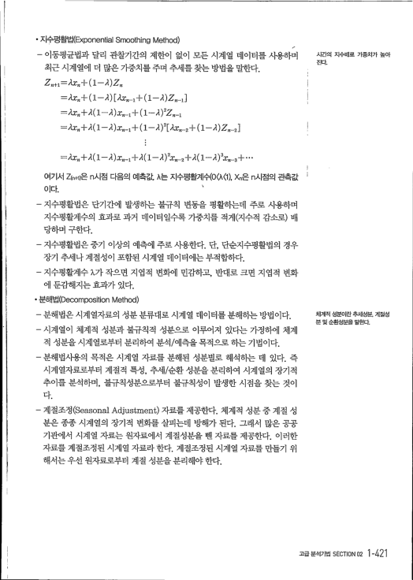
- 지수평활법（Exponential Smoothing Method)
- 이동평균법과 달리 관찰기간의 제한이 없이 모든 시계열 데이터를 사용하며 
최근 시계열에 더 많은 가중치를 주며 추세를 찾는 방법을 말한다．

#### Zn.i1= Ax,, + (1-A) Zn
#### =Ax,,+ (i- A) [Ax,,_1+ (i- A)Z,,_1]
#### = Ax,, + A (i- A) x:_1+ (1-A) 2Z,,_1
#### = Ax,,+A( 1- A)x,,-1+ (1-A)2[Ax,,_2+ (i- A)Z,,_2J
#### =Ax,, + A (1-A) x,,.1+ A (1- A )2x,,_2 +A (1- A )3x,,.3+…
#### 여기서 Z(n+i은 n시점 다음의 예측값, ㅅ는 지수평활계수《O(A<1), x,은 n시점의 관측값
이다． ,

- 지수평활법은 단기간에 발생하는 불규칙 변동을 평활하는데 주로 사용하며
지수평활계수의 효과로 과거 데이터일수록 가중치를 적게（지수적 감소로） 배 당하며 구한다．

#### - 지수평활법은 중기 이상의 예측에 주로 사용한다 . 단 , 단순지수평활법의 경우
장기 추세나 계절성이 포함된 시계열 데이터에는 부적함하다．

#### - 지수평활계수 入가 작으면 지엽적 변화에 민감하고 , 반대로 크면 지엽적 변화 
에 둔감해지는 효과가 있다．

- 분해법（Decomposition Method)
- 분해법은 시계열자료의 성분 분류대로 시계열 데이터를 분해하는 방법이다．
- 시계열이 쳬계적 성분과 불규칙적 성분으로 이루어져 있다는 가정하에 쳬계 
적 성분을 시계열로부터 분리하여 분적／예측을 목적으로 하는 기법이다．

#### - 분해법사용의 목적은 시계열 자료를 분해된 성분별로 해석하는 데 있다 . 즉
#### 시계열자료로부터 계절적 특정 , 추세／순환 성분을 분리하여 시계열의 장기적 
추이를 분석하며 , 불규칙성분으로부터 불규칙성이 발생한 시점을 찾는 것이 다．

#### - 계절조정（Seasonal Adjustment) 자료를 제공한다 . 쳬계적 성분 중 계절 성 
분은 종종 시계열의 장기적 변화를 살피는데 방해가 된다 . 그래서 많은 공공 기관에서 시계열 자료는 원자료에서 계절성분을 뺀 자료를 제공한다 . 이러한 자료를 계절조정된 시계열 자료라 한다 . 계절조정된 시계열 자료를 만들기 위 해서는 우선 원자료로부터 계절 성분을 분리해야 한다．

> 시간의 지수배로 가중치가 높아
> 진다．
> 체계적 성분이란 추세성분 . 계절성 
분 및 순환성분을 말한다．

> 고급분석기법 SECTION02 1-421
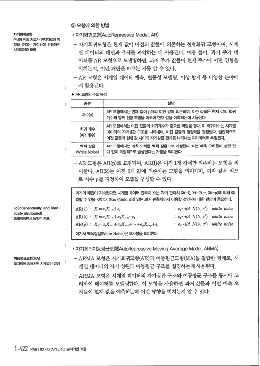
② 모형에 의한 방법

- 자기회귀모형（AutoRegressive Model, AR),
자기회귀모형 P시점 전의 자료가 헌재자료에 영 향을 준다는 가정하에 만들어진 시계열예측모형

#### - 자기회귀모형은 현재 값이 이전의 값들에 의존하는 선형회귀 모형이며 , 시계
#### 열 데이터의 패턴과 추세를 파악하는 데 사용된다 . 예를 들에, 과거 주가 데
이터를 AR 모형으로 모델링하면 , 과거 주가 값들이 현재 주가에 어떤 영향을

#### 미치는지 , 어떤 패턴을 따르는 지를 알 수 있다．
#### -AR 모형은 시계열 데이터 예측 , 변동성 모델링 , 이상 탐지 등 다양한 분야에
서 활용된다 .

l

>AR 모형의 주요 특징
종류 설명 차수（p) AR 모형에서는 현재 값이 p개의 이전 값에 의존하며 . 이전 값들은 현재 값의 회귀 계수와 함께 선형 조합을 이루어 헌재 값을 예측하는데 사용된다． AR 모형에서는 이전 값들의 회귀계수가 중요한 역할을 한다. 이 회귀계수는 시계열 회귀 계수 데이터의 자기상관 구조를 나타내며 , 이전 값들의 영향력을 결정한다. 일반적으로 (AR 계수） 이전 값들과 현재 값 사이의 자기상관 관계를 나타내는 파라미터로 추정된다． AR 모형에서는 예측 오차를 백색 잡음으로 가정한다. 이는 예측 오차들이 상관 관 백색 잡음 계 없이 독립적으로 발생한다는 가정을 의미한다． (White Noise)

#### -AR 모형은AR(p）로 표현되며 , AR(1）은 이전 1개 값에만 의존하는 모형을 의
#### 미한다 . AR(2）는 이전 2개 값에 의존하는 모형을 의미하며 , 이와 같은 식으
로 차수 p를 지정하여 모델을 구성할 수 있다． 과거의 패턴이 지속된다면 시계열 데이터 관측치 xt는과거 관측치 X(t-1). X(t-2)."·. X(t-p）에 의해 예 측할 수 있을 것이다. 어느 정도의 멀리 있는 과거 관측치까지 이용할 것인지에 대한 판단이 중요하다． iid(independently and iden- tically distributed) 독립적이면서 동일한 분포 AR(1) : 兀＇＝α1x'-1＋ㅌ＇ AR(2) : 치=a1X,_1+a2X/_2 +하 AR(p) : 지=a1X'_1+a2Xj_2+… +a夕x,_夕+ㅌ＇ 여기서 백색잡음《White Noise）은오차항을 의미한다．

- 자기회귀이동평균모형（AutoRegressive Moving Average Model, ARMA)
- ARMA모형은자기회귀모형（AR）과이동평균모형（MA）을결합한형태로 , 시
이동평균모형（MA) 오차항에 의해서만 시계열이 결정 계열 데이터의 자기 상관과 이동평균 구조를 설명하는데 사용된다．

- ARMA 모형은 시계열 데이터의 자기상관 구조와 이동평균 구조를 동시에 고
려하여 데이터를 모델링한다 . 이 모형을 사용하면 과거 값들과 이전 예측 오 차들이 현재 값을 예측하는데 어떤 영향을 미치는지 알 수 있다． 1-422 PART 03 ' CHAPTER 02분석기법적용

> : 
1--iid N (o, e2)

> white nofse
> : 하 -iid N (O, 군）
> white nofse
> : e--iid N (O, c2)
> z〃／zfte noise
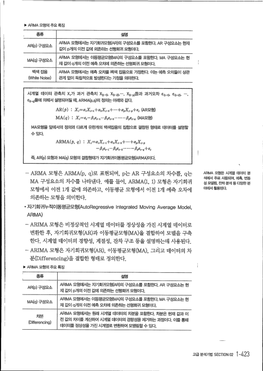
》ARMA 모형의 주요 특징 종류 설명 AR(p) 구성요소 ARMA 모형에서는 자기회귀모형（AR）의 구성요소를 포함힌다. AR 구성요소는현재 값이 p개의 이전 값에 의존하는 선형회귀 모형이다． MA(q) 구성요소 ARMA 모형에서는 이동펑균모형（MA）의 구성요소를 포함한다. MA 구성요소는 헌 재 값이 q개의 이전 예측오차에 의존하는 선형회귀 모형이다． 백색 잡음 ARMA 모형에서는 예측 도丘隱 백색 잡음으로 가정한다. 이는 예측 도차들이 상관 관계 없이 독립적으로 발생한다는 가정을 의미한다． (White Noise) 시계열 데이터 관측치 x콰 과거 관측치 )<It-i). Xlt_2), ' " ". 사-p）들과 과거오차 飾-1). C(1_2). …， C(tq）들에 의해서 설명되어질 때． ARMA(p,q）의 정의는 0脾ㅐ와같다． AR(p) : 지＝'1X_1+a2X1_2+… +a,X_ +톼 (AR모형） MA(q) : X＝ㅌ＇－β1톼－l－β2하－2－…－ 8pi-q (MA 형) MA모형을 앵게서의 정의와 다르게 유한개의 백색잡음의 집합으로 결합된 형태로 데이터를 설명할 수 있다． ARMA(p, q) : X= a1X1+a2X' 2+… +ct1,X,－夕 －β 1e_1-$2희－2-". －β pcj_q+ㅌ j 즉， AR(p) 모형과 MA(q) 모형의 결합형태가자기회귀이동평균모형（ARMA）이다．

- ARIVIA 모형은 ARMA(p, q）로 표현되며 , p는 AR 구성요소의 차수를 , q는 
MA 구성요소의 차수를 나타낸다 . 예를 들어 , ARMA(1, 1) 모형은 자기회귀 모형에서 이전 1개 값에 의존하고 , 이동평균 모형에서 이전 1개 예측 오차에 의존하는 모형을 의미한다．

- 자기회귀누적이동평균모형（AutoRegressive Integrated Moving Average Model,
ARIMA)

#### - ARIMA 모형은 비정상적인 시계열 데이터를 정상성을 가진 시계열 데이터로 
변환한 후 , 자기회귀모형（AR）과 이동평균모형（MA）을 결합하여 모델을 구축 한다 . 시계열 데이터의 경향성 , 계절성 , 잔차구조등을설명하는데 사용된다．

- ARIMA모형은자기회귀모형（AR) , 이동평균모형（MA) , 그리고데이터의 차 
분（Differencing）을 결합한 형태로 정의한다． I ARIMA 모형의 주요 특징 종류 설명 AR(p) 구성요소 사IMA 모형에서는 자기회귀모형（AR）의 구성요소를 포함힌다 . AR 구셩요소는 현 재 값이 p개의 이전 값에 의존하는 선형회귀 모형이다． MA(q）구셩요소 ARIMA 모형에서는 이동펑균모형（MA）의 구성요소를 포함한다. MA 구성요소는 헌 재 값이 q개의 이전 예측 오차에 의존하는 선형회귀 모형이다． ARIMA 모형에서는 원래 시계열 데이터의 차분을 포함힌다. 차분은 현재 값과 이 전 값의 차이를 계산하여 시계열 데이터의 경향성을 제거하는 과정이다 . 이를 통해 데이터를 정상성을 가진 시계열로 변환하여 모델링할 수 있다． 차분 (Differencing)

> ARMA 모형은 시계열 데이터 분 
석에서 주로 사용되며 . 예측 , 변동 성 모델링 , 잔차 분석 등 다양한 분 야에서 활용된다．

> l
> 고급분석기법 SECTION 02 1 -423
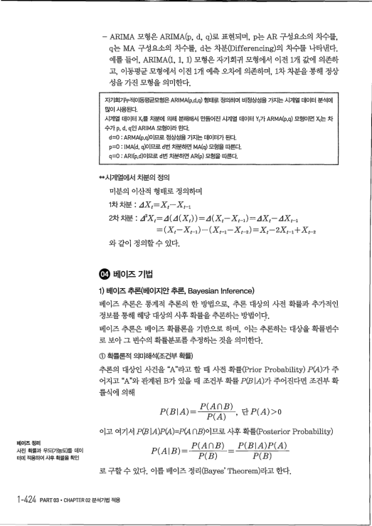
- ARIMA 모형은 ARIMA(p, d, q）로 표현되며 , p는 AR 구성요소의 차수를，
q는 MA 구성요소의 차수를 , d는 차분（Differencing）의 차수를 나타낸다． 예를 들어 , ARIMA(1, 1, 1) 모형은 자기회귀 모형에서 이전 1개 값에 의존하 고 , 이동평균모형에서 이전 1개 예측오차에 의존하며 , 1차차분을통해 정상 성을 가진 모형을 의미한다． 자기회기누적이동평균모형은 ARIMA(p,d.q) 형태루 정의하며 비정상성을 가지는 시계열 데이터 분석에 많이 사용된다． 시계열 데이터 지를 차분에 의해 분해해서 만들어진 시계열 데이터 쬐가 ARMA(p,q) 모형이면 xt는 차 수가p. d, q인ARIMA모형이라한다． d=O : ARMA(p.q）이므로 정상성을 가지는 데이터가 된다． p=O : IMA(d. q）이므로 d번 차분하면 MA(q) 모형을 따른다． q=0 : ARI(p.d)O峰로 d번 차분하면 AR(p) 모형을 따른다.

*＊시계열에서 차분의 정의 미분의 이산적 형태로 정의하며

### 1차 차분 : 」x궁＝xr- x什1
### 2차차분 : '12X'==1（겸（지）)＝」（x'－지-1)=匕1x궁－」兀t-1
#### = (X- X/_1) - (X1_1-X1_2) =Xr- 2Xr_r1+Xr_2
와 같이 정의할 수 있다． .

베이즈 기법 1) 베이즈추론（베이지안추론 , Bayesian Inference) 베이즈 추론은 통계적 추론의 한 방법으로 , 추론 대상의 사전 확률과 추가적인 정보를 통해 해당 대상의 사후 확률을 추론하는 방법이다． 베이즈 추론은 베이즈 확튤론을 기반으로 하며 , 이는 추론하는 대상을 확률변수 로 보아 그 변수의 확률분포를 추정하는 것을 의미한다． ① 확률론적 의미해석（조건부 확률） 추론의 대상인 사건을 " A " 라고 할 때 사전 확률（Prior Probability) PC4）가 주

#### 어지고 " A' " 와 관계된 B가 있을 때 조건부 확률 P（히A）가 주어진다면 조건부 확
률식에 의해

# P（좨A)= 譽묘B) , 단P(A)>.
#### 이고 여기서 ／〕（히A)P4)=P(A flB）이므로 사후 확률（Posterior Probability)
베이즈 정리

#### P(게β）=  P(A7-I딧β） = P (BIA)P(A)
7)1 r ' P（β） P（게 사전 확률과 우도（가능도）를 데이 터에 적용하여 사후 확률을 확인 로구할수 있다 . 이를베이즈 정리（台ayes' Theorem）라고한다． 1-424 PART 03. CHAPTER 02분석기법적용

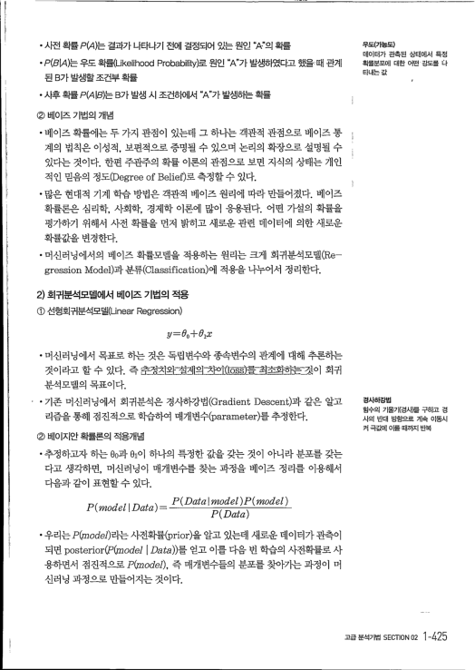
- 사전 확률 ／〕（겨）는 결과가 나타나기 전에 결정되어 있는 원인 "A’의 확률
- ／〕（테A）는 우도 확률《Likelihood Probability）로 원인 " A " 가 발생하였다고 했을：때 관계
된 B가 발생할조건부 확률

- 사후 확률 ／그（계B）는 B가 발생 시 조건하에서 " A " 가 발생하는 확률
② 베이즈 기법의 개념

- 베이즈 확률에는 두 가지 관점이 있는데 그 하나는 객관적 관점으로 베이즈 통
#### 계의 법칙은 이성적 , 보편적으로 증명될 수 있으며 논리의 확장으로 설명될 수
#### 있다는 것이다 . 한편 주관주의 확률 이론의 관점으로 보면 지식의 상태는 개인
적인 믿음의 정도（Degree of Belief）로 측정할 수 있다．

#### · 많은 현대적 기계 학습 방법은 객관적 베이즈 원리에 따라 만들어겼다 . 베이즈
#### 확률론은 심리학 , 사회학 , 경제학 이론에 많이 응용된다 . 어떤 가설의 확률을
평가하기 위해서 사전 확률을 먼저 밝히고 새로운 관런 데이터에 의한 새로운 확률값을 변경한다．

- 머신러닝에서의 베이즈 확률모델을 적용하는 원리는 크게 회귀분석모델（Re-
#### gression Model）과분류（Classification）에 적용을 나누어서 정리한다 .
2) 회귀분석모델에서 베이즈 기법의 적용 ① 선형회귀분석모델（니near Regression) Y=O。+01X

- 머신러닝에서 목표로 하는 것은 독립변수와 종속변수의 관계에 대해 추론하는
#### 것이라고 할 수 있다 . 즉 촌 치와’캘제의－치까（1b兩）름꺽筌화하큭r것이 회귀
분석모델의 목표이다． . · 기존 머신러닝에서 회귀분석은 경사하강법（Gradient Descent）과 같은 알고 리즘을 통해 점진적으로 학습하여 매개변수（parameter）를 추정한다． ② 베이지안 확률론의 적용개념

- 추정하고자 하는 0O과 o1이 하나의 특정한 값을 갖는 것이 아니라 분포를 갖는
#### 다고 생각하면 , 머신러닝이 매개변수를 찾는 과정을 베이즈 정리를 이용해서
다음과 같이 표현할수 있다．

#### )
#### Data)
" model)

#### P
- 우리는／〕(rn ode]）라는 사전확률（prior）을 알고 있는데 새로운 데이터가 관측이
되면 posterior(P(inodel 陶ata)）를 얻고 이를 다음 번 학습의 사전확률로 사

#### 용하면서 점진적으로 P(m ode]) , 즉 매개변수들의 분포를 찾아가는 과정이 머
신러닝 과정으로 만들어지는 것이다．

> 우도（가능도）
> 데이터가 관측된 상태에서 특정 
확률분포에 대한 어떤강도를 다

> 타내는 값
> 경사하강법
> 함수의 기울기（경사）를 구하고 경 
사의 반대 방향으로 계속 이동시 켜 극값에 이를 때까지 반복

> 고급분석기법 SECTION 02 1-425
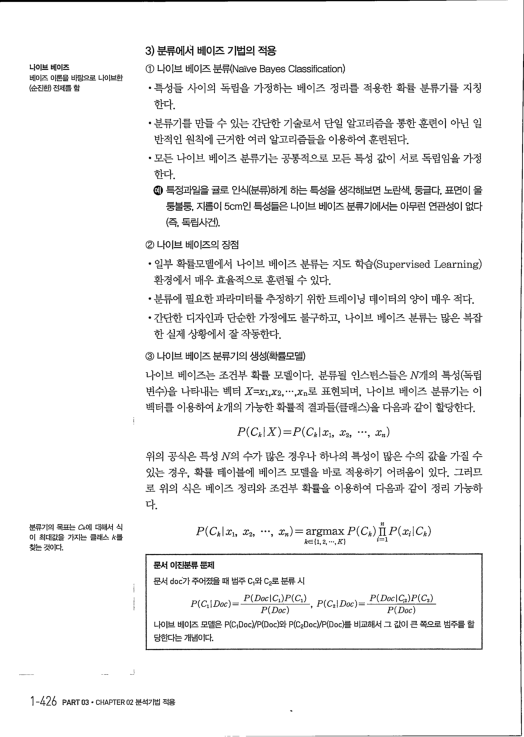
3) 분류에저 베이즈 기법의 적용 ① 나이브 베이즈 분류《Naxve Bayes C'assification) 나이브 베이즈 베이즈 이론을 바탕으로 나이브한

- 특성들 사이의 독립을 가정하는 베이즈 정리를 적용한 확률 분류기를 지칭
（순진한） 전저隱 함 한다．

- 분류기를 만들 수 있는 간단한 기술로서 단일 알고리즘을 통한 훈련이 아닌 일
반적인 원칙에 근거한 여러 알고리즘들을 이용하여 훈런된다．

- 모든 나이브 베이즈 분류기는 공통적으로 모든 특정 값이 서로 독립 임을 가정
#### 한다． 
.l 특정과일을 귤로 인식（분류）하게 하는 특성을 생각해보면 노란색 , 둥글다, 표면이 울 퉁불퉁 , 지름이 5cm인 특성들은 나이브 베이즈 분류기에서는 아무런 연관성이 없다 （측. 독립사건）.

② 나이브 베이즈의 장점

- 일부 확률모델에서 나이브 베이즈 분류는 지도 학습（Supervised Learning)
환경에서 매우 효율적으로 훈련될 수 있다．

- 분류에 필요한 파라미터를 추정하기 위한 트레이닝 데이터의 양이 매우 적다．
- 간단한 디자인과 단순한 가정에도 불구하고 , 나이브 베이즈 분류 := 많은 복잡
한 실제 상황에서 잘 작동한다． ③ 나이브 베이즈 분류기의 생성（확률모델） 나이브 베이즈는 조건부 확률 모델이다 . 분류될 인스턴스들은 N개의 특정（독립 변수）을 나타내는 벡터 Xx1,x2, … , Zㅍ로 표현되며 , 나이브 베이즈 분류기는 이 벡터를 이용하여 k개의 가능한 확률적 결과들（클래스）을 다음과 같이 할당한다 .

#### P(C써x)=P(C시x1, x2, ", x)
위의 공식은 특정 N의 수가 많은 경우나 하나의 특정이 많은 수의 값을 가질 수

#### 있는 경우 , 확률 테이블에 베이즈 모델을 바로 적용하기 어려움이 있다 . 그러므
로 위의 식은 베이즈 정리와 조건부 확률을 이용하여 다음과 같이 정리 가능하 다． 분류기의 목표는 ( 'kOㅔ 대해서 식 이 최대값을 가지는 클래스 k를

```python
P(Cklxl, x2, ", x,:)=argmaxP(C) ]IiP(x1IC力) 
i=1 
kE{1, 2, … ,K}
```
찾는것이다． 문서 이진분류 문제 문서 doc가주어쳤을 때 범주 （긔와 C2로 분류 시 ㅟ刀.() (C1 ?（이D..):

c) 나이브 베이즈 모델은 P(CtDoc)/P(Doc）와 P(C2Doc)/P(Doc）를 비교해서 그 값이 큰 쪽으로 범주를 할 당한다는 개념이다． 1-426 PART 03. CHAPTER 02분석기법적용

> c)
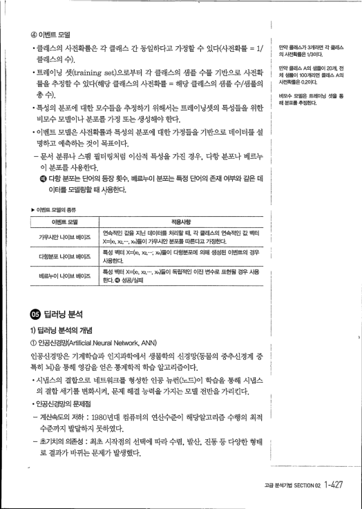
（乙 이벤트 모델

- 클래스의 사전확률은 각 클래스 간 동일하다고 가정할 수 있다（사전확률 = 1/
클래스의 수）.

- 트레이닝 셋（training set）으로부터 각 클래스의 샘플 수를 기반으로 사전확
률을 추정할 수 있다（해당 클래스의 사전확률 = 해당 클래스의 샘플 수／샘플의

#### 총수）.
- 특정의 분포에 대한 모수들을 추정하기 위해서는 트레이닝셋의 특정들을 위한
비모수 모델이나 분포를 가정 또는 생성해야 한다．

- 이벤트 모델은 사전확률과 특정의 분포에 대한 가정들을 기반으로 데이터를 설
명하고 예측하는 것이 목표이다．

- 문서 분류나 스팸 필터링처럼 이산적 특정을 가진 경우 , 다항 분포나 베르누
#### 이 분포를 사용한다． 
.l 다항 분포는 단어의 등장 횟수, 베르누이 분포는 특정 단어의 존재 여부와 같은 데 이터를모델링할 때 욕隱한다． 》 이벤트모델의 종류 I 이벤트모델 젝a사항 가우시안 나이브 베이즈 연속적인 값을 지닌 데이터를 처리할 때 . 각 클래스의 연속적인 값 벡터 X (xi, X2,"·, Xn）들이 가우시안분포를 따른다고 가정힌다． 다항분포 나이브 베이즈 특셩 벡터 ×＝(x1 ,x2,"; Xn）들이 다항분포에 의해 생성된 이벤트의 경우 사용한다． 베르누이 나이브 베이즈 특성 벡터 ×=(xl, X2,"·, Xn）들이 독립적인 이진 변수로 표현될 경우 사용 한다. cIl 성공／실패 .

딥러닝 분석 1) 딥러닝 분석의 개념 ① 인공신경망（Artificial , Neural Network, ANN) 인공신경망은 기계학습과 인지과학에서 생물학의 신경망（통물의 중추신경계 중 특히 뇌）을 통해 영감을 얻은 통계학적 학습 알고리즘이다．

- 시냅스의 결합으로 네트워크를 형성한 인공 뉴런（노드）이 학습을 통해 시냅스
의 결합 세기를 변화시켜 , 문제 해결 능력을 가지는 모델 전반을 가리킨다．

- 인공신경망의 문제점
- 계신賢도의 저하 : 1980년대 컴퓨터의 연산수준이 해당알고리즘 수행의 최적
#### 수준까지 발달하지 못하였다 .
- 초기치의 의존성 : 최초 시작점의 선택에 따라 수렴 , 발산 , 진동 등 다양한 형태 
로 결과가 바뀌는 문제가 발생했다．

> 만약 卽ㅐ스가 3개라면 각 클래스 
의 사전확률은 1/3이다．

> 만약 클래스 A의 샘플이 20개 , 전 
체 겯烽이 100개라면 클래스 A의

> 사전확률은02이다．
> 비모수 모델은 트레이닝 셋을 통 
해 분포를 추정한다．

> 고급분석기법 SECTION 02 ㅏ 
27

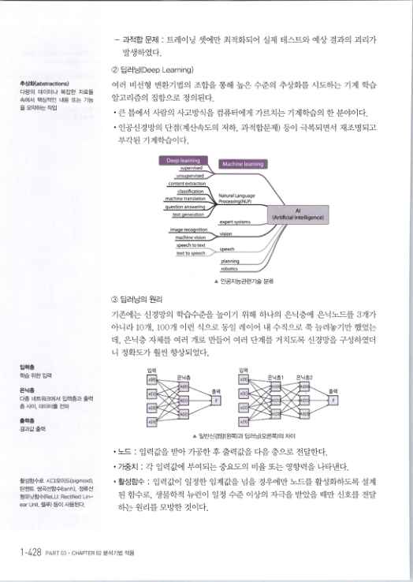
#### - 과적합 문제 : 트레이닝 셋에만 최적화되어 실제 테스트와 예상 결과의 괴리가
발생하였다． ② 딥러닝（Deep Learning) 여러 비선형 변환기법의 조합을 통해 높은 수준의 추상화를 시도하는 기계 학습 추상화（abstractions) 다량의 데이터나 복잡한 자료들 알고리즘의 집합으로 정의된다． 속에서 핵심적인 내용 또는 기능 을 요약하는 작업

- 큰 틀에서 사람의 사고방식을 컴퓨터에게 가르치는 기계학습의 한 분야이다．
- 인공신경망의 단점（계산속도의 저하 , 과적합문제） 등이 극복되면서 재조명되고
부각된 기계학습이다． Dee이ear nug 沁柚나1i1nt.1 earning 5U rvised unsu ervised content extraction 히ausification Natural Language Processin . (NLP) machine translation .uestion answerin.

∼糾뻐∼一 騙 ∼－＇뻐 Al (Artificial Intelligence) text · eneration expert systems image recognition , .

`,  vision macnine Vi5iOfl - 스Deech to text speech text to speech annin ▲ 인공자횃련기술 분류 ③ 딥러닝의 원리 기존에는 신경망의 학습수준흘 높이기 위해 하나의 은닉층에 은닉노드를 3개가 아니라 10개 , 100개 이런 식으로 동일 레이어 내 수직으로 쭉 늘려놓기만 했었는 데 , 은닉층 자쳬를 여러 개로 만들어 여러 단계를 거치도록 신경망을 구성하였더 니 정확도가 훨씬 향상되었다． 입력층 입력 학습 위한 입력 은닉층 다충 네트워크에서 입력충과 출력 충사이 . 데이터를 전파 츨력층 ．결과값 출력 ▲ 일반신경망（왼쪽）과 딥러닝（오른쪽）의 차이

- 노드 ' 입력값을받아가공한후출력값을다음층으로 전달한다．
#### · 가중치 : 각 입력값에 부여되는 중요도의 비율 또는 영향력을 나타낸다．
#### · 활성함수 : 입력값이 일정한 임계값을 넘을 경우에만 노드를 활성화하도록 설계
활성함수로 사그모이드《sigmoid), 탄젠트 쌍곡선함수＜tanh) . 정류선 된 함수로 , 생물학적 뉴런이 일정 수준 이상의 자극을 받았을 때만 신호를 전달 형유닛함수《ReLU: Rectified Lin- ear Unit , 렐루） 등《기 사용된다． 하는 원리를 모방한 것이다． ㅏ 28 PART03· CHAPTER 02분석기법적용 i

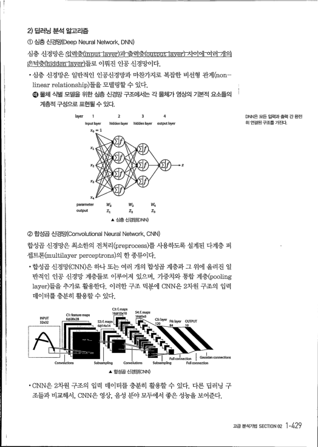
2) 딥러닝 분석 알고리즘 ① 심층 신경망（Deep Neural Network, DNN)

#### 심층 신경망은 십"력춧(i万ut1yeT)괴＝竇력층( utj5trtivbr)켜이에－여러쾌의
은늬瓮＜h沮ub1r1ㅍ호亘竗들로 이뤄진 인공 신경망이다．

#### · 심층 신경망은 일반적인 인공신경망과 마찬가지로 복잡한 비선형 관계（non-
linear relationship）들을 모델링할 수 있다． .I 물체 식별 모델을 위한 심층 신경망 구조에서는 각 물체가 영상의 기본적 요소들의 계층적 구성으로 표현될 수 있다． layer 1 2 3 4 input layer hidden layer Ndden layer output layer Xa == 1 w2 w3 w4 zl z2 z3 ▲ 심층 신경망（DNN) parameter output ② 합성곱 신경망（Convolutional Neural Network, CNN) 합성곱 신경망은 최소한의 전차리（preprocess）를 사용하도록 설계된 다계층 퍼 셉트론（multilayer perceptrons）의 한종류이다．

- 합성곱 신경망（CNN）은 하나 또는 여러 개의 합성곱 계층과 그 위에 올려진 일
반적인 인공 신경망 계층들로 이루어져 있으며 , 가중치와 통합 계층（pooling

#### layer）들을 추가로 활용한다 . 이러한 구조 덕분에 CNN은 2차원 구조의 입력
#### 데이터를 충분히 활용할 수 있다 .
Cl: f. maps 16@l0xl0 54:t maps 15@5x5 Cl: feature maps 6@28x28 -- - ㅣ - -, = CS:!aver -- S2 tmap치 麝＊ ．눕 '` "', ' ro"ayer uuirui

### INPUT
32x32 P －챙 6楓14u14 -．弱．볕拓뱃砲 ＇「＝〕 ·· ■■ .-- 84 10

### Subsampling 
Convolutions ▲ 합성곱 신경망（CNN) r4=I cOAnectl。

n - Gaussian c。nnecti。

ns Subsampling Full connection Convolutions

#### ·CNN은 2차원 구조의 입력 데이터를 충분히 활용할 수 있다 . 다른 딥러닝 구
조들과 비교해서 , CNN은 영상 , 음성 분야모두에서 좋은 성능을 보여준다．

> DNN은 모든 입력과 출력 간 완전
> 히 연결된 구조를 가진다．
> 고급분석기법 SECTION 02 1 -429
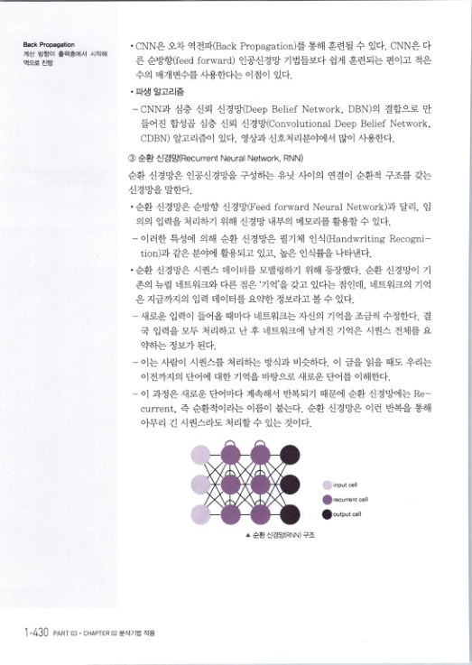
- CNN은 오차 역전파（Back Propagation）를 통해 훈련될 수 있다 . CNN은 다 
른 순방향（feed forward) 인공신경망 기법들보다 쉽게 훈련되는 편이고 적은 Back Propagation 계산 방향이 출력충에서 시작해 역으로 진행 수의 매개변수를 사용한다는 이점이 있다．

- 파생 알고리즘
-CNN과 심층 신뢰 신경망（Deep Belief Network, DBN）의 결합으로 만 들어진 합성곱 심층 신뢰 신경망（Convolutional Deep Belief Network, CDBN) 알고리즘이 있다 . 영상과 신호처리분야에서 많이 사용한다． ③ 순환 신경망（Recurrent Neural Network, RNN) 순환 신경망은 인공신경망을 구성하는 유닛 사이의 연결이 순환적 구조를 갖는 신경망을 말한다 .

#### · 순환 신경망은 순방향 신경망（Feed forward Neural Network）과 달리 , 임
의의 입력을 처리하기 위해 신경망 내부의 메모리를 활용할 수 있다．

- 이러한 특성에 의해 순환 신경망은 필기쳬 인식（Handwriting Recogni-
tion）과 같은 분야에 활용되고 있고 , 높은 인식률을 나타낸다．

#### · 순환 신경망은 시퀀스 데이터를 모델링하기 위해 등장했다 . 순환 신경망이 기
#### 존의 뉴럴 네트워크와 다른 점은 ' 기억 ' 을 갖고 있다는 점인데 , 네트워크의 기억
은 지금까지의 입력 데이터를 요약한 정보라고 볼 수 있다．

- 새로운 입력이 들어올 때마다 네트워크는 자신의 기억을 조금씩 수정한다 . 결
국 입력을 모두 처리하고 난 후 네트워크어I 남겨진 기억은 시퀀스 전쳬를 요 약하는 정보가 된다．

- 이는 사람이 시퀀스를 처리하는 방식과 비슷하다 . 이 글을 읽을 때도 우리는
이전까지의 단어에 대한 기 억을 바탕으로 새로운 단어를 이해한다．

- 이 과정은 새로운 단어마다 계속해서 반복되기 때문에 순환 신경망에는 Re-
current , 즉 순환적이라는 이름이 붙는다 . 순환 신경망은 이런 반복을 통해 아무리 긴 시퀀스라도 처리할 수 있는 것이다． ▲ 순환 신경망（RNN) 구조 1 -430 PART 03· CHAPTER 02분석기법적용

> input cell
> cel
> cell
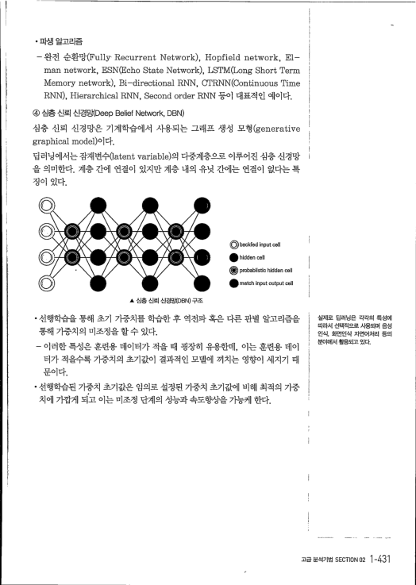
- 파생 알고리즘
#### -완j 순환망(Ful1y' Recurrent Network), Hopfield network, El-
man network, ESN(Echo State Network), LSTM(Long Short Term Memory network), Bi-directional RNN, CTRNN(Continuous Time RNN), Hierarchical RNN, Second order RNN 등이 대표적인 예이다． ④ 심층 신뢰 신경망（Deep Belief Network, DBN) 심층 신뢰 신경망은 기계학습에서 사용되는 그래프 생성 모형（generative graphical model）이다． 딥러닝에서는 잠재변수（latent variable）의 다중계층으로 이루어진 심층 신경망 을 의미한다 . 계층 간에 연결이 있지만 계층 내의 유닛 간에는 연결이 없다는 특 징이 있다．

#### 0 backfed input coil 
●hidden cell ⑩probablistic hidden cell input output cell ▲ 심층 신뢰 신경망（DBN) 구조

- 선행학습을 통해 초기 가중치를 학습한 후 역전파 혹은 다른 판별 알고리즘을
통해 가중치의 미조정을 할 수 있다．

#### - 이러한 특정은 훈련용 데이터가 적을 때 굉장히 유용한데 , 이는 훈린용 데이 
터가 적을수록 가중치의 초기값이 결과적인 모델에 끼치는 영향이 세지기 때 문이다．

- 선행학습된 가중치 초기값은 임의로 설정된 가중치 초기값에 비해 최적의 가중 
치에 가깝게 되고 이는 미조정 단계의 성능과 속도향상을 가능케 한다．

> 실제로 딥러닝은 각각의 특성에 
따라서 선택적으로 사용되며 음성 인식 . 화면인식 자연어처리 등의 분야에서 활용되고 있다．

> 고급분석기법 SECTION 02 1-431
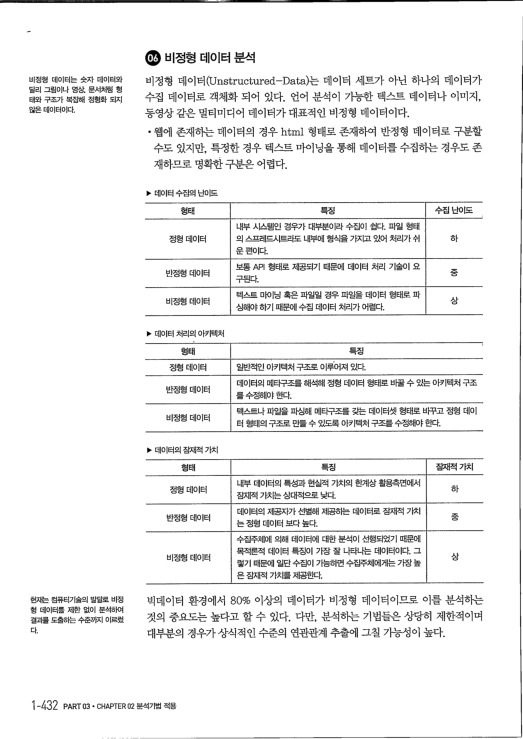
.

비정형 데이터 분석 비정형 데이터（Unstructured-Data）는 데이터 세트가 아닌 하나의 데이터가 비정형 데이터는 숫자 데이터와 달리 그림이나 영상. 문서처럼 형 태와 구조가 복잡해 정형화 되지 않은 데이터이다．

#### 수집 데이터로 객쳬화 되어 있다 . 언어 분석이 가능한 텍스트 데이터나 이미지，
동영상 같은 멀티미디어 데이터가 대표적인 비정형 데이터이다．

- 웹에 존재하는 데이터의 경우 html 형태로 존재하여 반정형 데이터로 구분할
#### 수도 있지만 , 특정한 경우 텍스트 마이닝을 통해 데이터를 수집하는 경우도 존
재하므로 명확한 구분은 어렵다．

> 데이터 수집의 난이도
형태 특징 수집 난이도 내부 시스템인 경우가 대부분이라 수집이 쉽다 . 파일 형태 의 스프레듸 트라도 내부에 형식을 가지고 있어 처리가 쉬 운 편이다． 하 정형 데이터 반정형 데이터 보통 API 형태로 저居되기 때문에 데이터 처리 기술이 요 구된다． 중 비정형 데이터 텍스트 마이닝 혹은 파일일 경우 파일을 데이터 형태로 파 싱해야 하기 때문에 수집 데이터 처리가 어렵다． 상 》 데이터 처리의 아키텍처 헝태 특징 정형 데이터 일반적인 아키텍처 구조로 이루어져 있다． 반정형 데이터 데이터의 메타구조를 해석해 정형 데이터 형태로 바꿀 수 있는 아키텍처 구조 를 수정해야 한다． 비정형 데이터 텍스트나 파일을 파싱해 메타구조를 갖는 데이터셋 형태로 바꾸고 정형 데이 터 형태의 구조로 만들 수 있도록 아키텍처 구조를 수정해야 한다．

> 데이터의 잠재적 가치
형Ell 특징 잠재적 가치 정형 데이터 내부 데이터의 특성과 헌실적 가치의 한계상 횔용측면에서 잠재적 가치는 상대적으로 낮다． 하 반정형 데이터 데이터의 저旺｝자가 선별해 제공하는 데이터로 잠재적 가치 는 정형 데이터 보다 높다． 중 수칩주체에 의해 데이터에 대한 분석이 선행되었기 ［대뮌게 목적론적 데이터 특징이 가장 잘 나타나는 데이터이다. 그 비정형 데이터 렇기 때문에 일단 수집이 가능하면 수집주체에게는 가장 높 은 잠재적 가치를 저隧톨힌ㅐ각． 빅데이터 환경에서 80% 이상의 데이터가 비정형 데이터이므로 이를 분석하는 헌자는 컴퓨터기술의 발달로 비정 형 데이터를 제한 없이 분석하여 결과를 도출하는 수준까지 이르렀

#### 것의 중요도는 높다고 할 수 있다 . 다만 , 분석하는 기법들은 상당히 제한적이며
대부분의 경우가상식적인 수준의 연관관계 추출에 그칠 가능성이 높다． 다． 1-432 PART 03· CHAPTER 02분석기법적용

> 상
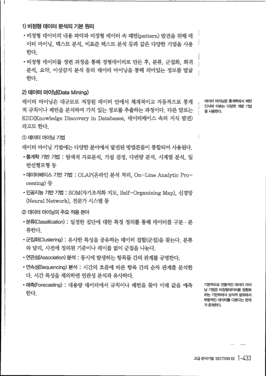
1) 비정형 데이터 분석의 기본 원리

- 비정형 데이터의 내용 파악과 비정형 데이터 속 패턴（pattern) 발견을 위해 데
#### 이터 마이닝 , 텍스트 분석 , 비표준 텍스트 분석 등과 같은 다양한 기법을 사용
한다．

#### · 비정형 데이터를 정련 과정을 통해 정형데이터로 만든 후 , 분류 , 군집화 , 회귀
#### 분석 , 요약 , 이상감지 분석 등의 데이터 마이닝을 통해 의미있는 정보를 발굴
한다． 2) 데이터 마이닝（Data Mining) 데이터 마이닝은 硼予모로 저장된 데이터 안에서 쳬계적이고 자동적으로 통계

#### 적 규칙이나 패턴을 분석하여 가치 있는 정보를 추출하는 과정이다 . 다른 말로는 
KDD(Knowledge Discovery in Databases , 데이터베이스 속의 지식 발견） 라고도 한다． ① 데이터 마이닝 기법 데이터 마이닝 기법에는 다양한 분야에서 발전된 방법론들이 통합되어 사용된다．

#### ·통계학 기반 기법 : 탐색적 자료분석 , 가설 검정 , 다변량 분석 , 시계열 분석 , 일
반선형모형 등

#### · 데이터베이스기반 기법 : OLAP（온라인 분석 처리 , On-Line Analytic Pro-
cessing) 등

#### · 인공지능 기반 기법 : SOM（자기조직화 지도 , Self-Organizing Map) , 신경망 
伽eural Network) , 전문가 시스템 등 ② 데이터 마이닝의 주요 적용 분야

#### · 분류（Classification) : 일정한 집단에 대한 특정 정의를 통해 데이터를 구분 · 분
류한다．

#### · 군집화(Clustering) : 유사한 특정을 공유하는 데이터 집합（군집）을 찾는다 . 분류 
와 달리 , 사전에 정의된 기준이나 레이블 없이 군집을 나눈다．

- 연관성（Association) 분석 : 동시에 발생하는 항목들 간의 관계를 규명한다；
- 연속성（Sequencing) 분석 : 시간의 흐름에 따른 항목 간의 순차 관계를 분석한 
다 . 시간특성을 제외하면 연관성 분석과유사하다．

- 예측〈Forecasting) : 대용량 데이터에서 규칙이나 패턴을 찾아 미래 값을 예측
한다．

> 데이터 마이닝은 통계학에서 패턴 
인식에 이르는 다양한 계량 기법

> 을사용힌다．
> 기본적으로 전통적오l데이터 마이 
닝 기법은 비정형데이터를 정형화 하는 기반하에서 상식적 범위에서 부분적인 데이터를 다룬다는 한계

> 가존재핸각．
> 고급분석기법 SECTION 02 1 -433
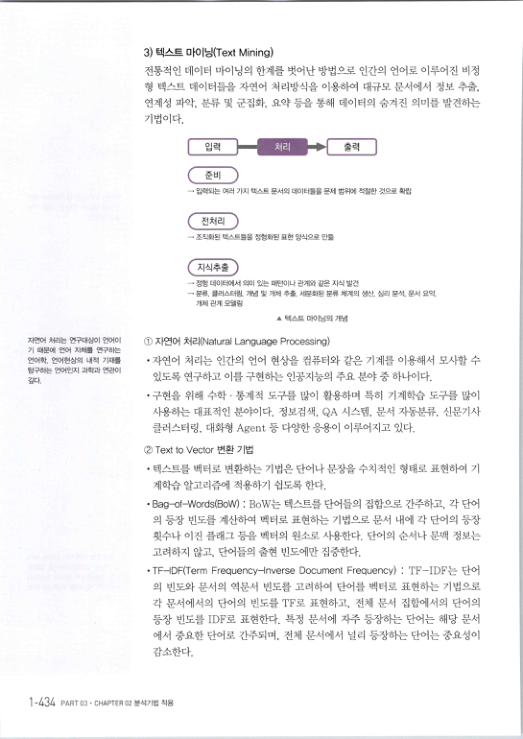
3) 텍스트 마이닝（Text Mining) 전통적인 데이터 마이닝의 한계를 벗어난 방법으로 인간의 언어로 이루어진 비정 형 텍스트 데이터들을 자연어 처리방식을 이용하여 騙구모 문서에서 정보 추출， 연계성 파악 , 분류 및 군집화 , 요약 등을 통해 데이터의 숨겨진 의미를 발견하는 기법이다．

#### ㅣ 입력 →커
출력 → 입력돠는 여러 가지 텍스트 문서의 데이터들을 문제 범위에 적절한 것으로 확립

- 조직화된 텍스트들을 정형화된 표현 양식으로 만듦
→ 정형 데이터에서 의미 있는 패턴이나 관계와 같은 지식 발견 → 분류 . 클러스터링 . 개념 및 개체 추출 . 세분화된 분류 체계의 생산 . 심리 분석 . 문서 요약． 개체 관계 모델링 ▲ 텍스트 마이닝의 개념 ① 자연어 처리（Natural Language Processing) 자연어 처리는 연구대상이 언어이 기 때문에 언어 자체를 연구하는

- 자연어 처리는 인간의 언어 현상을 컴퓨터와 같은 기계를 이용해서 모사할 수
언어학 . 언어현상의 내적 기재블 탐구하는 언어인지 과학과 연관이 있도록 연구하고 이를 구현하는 인공지능의 주요 분야 중 하나이다． 깊다．

#### · 구현을 위해 수학 · 통계적 도구를 많이 활용하며 특히 기계학습 도구를 많이
사용하는 대표적인 분야이다 . 정보검색 , QA 시스템 , 문서 자동분류 , 신문기사 클러스터링 , 대화형 Agent 등 다양한응용이 이루어지고 있다． ②Text to Vector 변환 기법

- 텍스트를 벡터로 변환하는 기법은 단어나 문장을 수치적인 형태로 표현하여 기
계학습 알고리즘에 적용하기 쉽도록 한다．

#### ·Bag-of-Words(BoW) : BOW는 텍스트를 단어들의 집합으로 간주하고 , 각 단어
의 등장 빈도를 계산하여 벡터로 표현하는 기법으로 문서 내에 각 단어의 등장 횟수나 이진 플래그 등을 벡터의 원소로 사용한다 . 단어의 순서나 문맥 정보는 고려하지 않고 , 단어들의 출현 빈도에만 집중한다 .

- TF-IDF(Term Frequency-Inverse Document Frequency) : TF-IDF는 단어
의 빈도와 문서의 역문서 빈도를 고려하여 단어를 벡터로 표현하는 기법으로 각 문서에서의 단어의 빈도를 TF로 표현하고 , 전쳬 문서 집합에서의 단어의

#### 등장 빈도를 IDF로 표현한다 . 특정 문서에 자주 등장하는 단어는 해당 문서
에서 중요한 단어로 간주되며 , 전체 문서에서 널리 등장하는 단어는 중요성이 감소한다． 1 -434 PART 03 ' CHAPTER 02분석기법적용

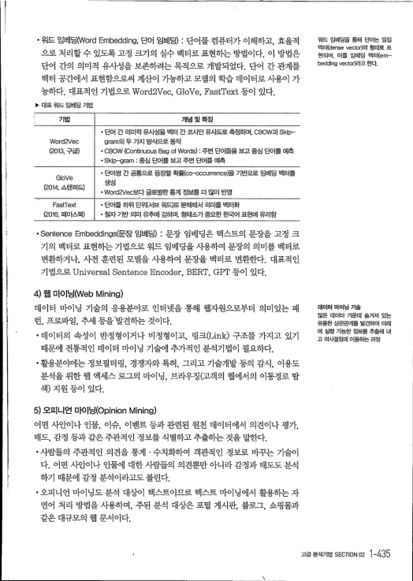
#### ' 워드 임베딩（Word Embedding , 단어 임베딩） : 단어를 컴퓨터가 이해하고 , 효율적 
으로 처리할 수 있도록 고정 크기의 실수 벡터로 표현하는 방법이다 . 이 방법은

#### 단어 간의 의미적 유사성을 보존하려는 목적으로 개발되었다 . 단어 간 관계를
벡터 공간에서 표현함으로써 계산이 가능하고 모델의 학습 데이터로 사용이 가

#### 능하다 . 대표적인 기법으로￦ord2\)ec, GloVe, FastText 등이 있다．
》 대표 워드 임베딩 기법 법 7 개념 및 특징

- 단어 간 의미적 유사성을 벡터 간코사인 유사도로 측정하며 , CBOW과Skip-
Word2Vec gram의 두 가지 방식으로 동작

- CBOW (Continuous Bag of Words) : 주변 단어들을 보고중심 단어를 예측
(2013 . 구글）

- 하dp-gram : 중심 단어를 보고주변 단어를 예측
- 단어쌍 간 공통으로 등장할 확틥co-occurrence》을 기반으로 임베딩 벡터를
GloVe 생성

- Word2Vec보다 글로벌한통계 정보를 더 많이 반영
(2014 , 스탠퍼드） (2016 , 페이스북）

- 단어를 하위 단위（서브 워드）로 분해해서 의미를 벡터화 
- 철자 기반 의미 유추에 강하며 . 형태소가 중요한 한국꺼 표현에 유리함
FastText

- Sentence Embeddings（문장 임베딩） : 문장 임베딩은 텍스트의 문장을 고정 크
기의 벡터로 표현하는 기법으로 워드 임베딩을 사용하여 문장의 의미를 벡터로 변환하거나 , 사전 훈련된 모델을 사용하여 문장을 벡터로 변환한다 . 대표적인 기법으로 Universal Sentence Encoder, BERT, GPT 등이 있다． 4) 웹 마이닝（Web Mining) 데이터 마이닝 기술의 응용분야로 인터넷을 통해 웹자원으로부터 의미있는 패 턴 , 프로파일 , 추세 등을“발견하는 것이다．

- 데이터의 속성이 반정형이거나 비정형이고 , 링크（Link) 구조를 가지고 있기
때문에 전통적인 데이터 마이닝 기술에 추가적인 분석기법이 필요하다．

- 활용분야에는 정보필터링 , 경챙자와특허 , 그리고 기술개발등의 감시 , 이용도
분석을 위한 웹 액세스 로그의 마이닝 , 브라우징（고객의 웹에서의 이동경로 탐 색） 지원 등이 있다． 5) 오피니언 마이닝（0pinion 贓ning) 어떤 사안이나 인물 , 이슈 , 이벤트 등과 관련된 원천 데이터에서 의견이나 평가， 태도 , 감정 등과 같은 주관적인 정보를 식별하고 추출하는 것을 말한다．

#### · 사람들의 주관적인 의견을 통계 · 수치화하여 객관적인 정보로 바꾸는 기술이 
다 . 어떤 사안이나 인물에 대한 사람들의 의견뿐만 아니라 감정과 태도도 분석 하기 때문에 감정 분적이라고도 불린다．

- 오피니언 마이닝도 분적 대상이 텍스트이므로 텍스트 마이닝에서 활용하는 자
연어 처리 방법을 사용하며 , 주된 분석 대상은 포털 게시판, 블로그 , 쇼핑몰과 같은 朗子모의 웹 문서이다．

> 워드 임베딩을 통해 단어는 밀집 
벡터（dense vector）의 형태로 표 현되며 . 이를 임베딩 벡터（em- bedding vecto ）라고 힌다．

> 데이터 마이닝 기술 
많은 데이터·가운데 숨겨져 있는 유용한 상관관계를 발견하여 미래

> 0뜁 실행 가능한 정보를 추출해 내 
고 의사결정에 이용하는 과정

> 고급분석기법 SECTION 02 1-435
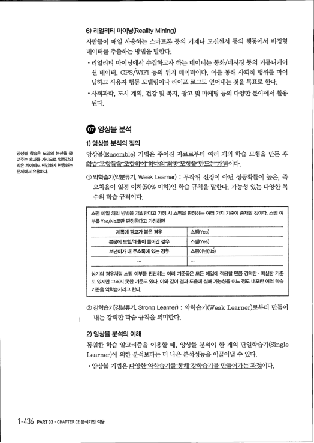
6) 리얼리티 마이닝（Reality Mining) 사람들이 매일 사용하는 스마트폰 등의 기계나 모션센서 등의 행동에서 비정형 데이터를 추출하는 방법을 말한다．

- 리얼리티 마이닝에서 수집하고자 하는 데이터는 통화／메시징 등의 커뮤니케이
션 데이터 , GPS/WiFi 등의 위치 데이터이다 . 이를 통해 사회적 행위를 마이 닝하고 사용자 행동 모델링이나 라이프 로그도 얻어내는 것을 목표로 한다．

#### · 사회과학 , 도시 계획 , 건강 및 복지 , 광고 및 마케팅 등의 다양한 분야에서 활용
된다． .

앙상블 분석 1) 앙상블 분석의 정의 앙상블（Ensemble) 기법은 주어진 자료로부터 여러 개의 학습 모형을 만든 후 앙상블 학습은 모델의 분산율 줄 여주는 효과를 가지므로 입력값의 작은 차이에도 민감하게 반응하는 문제에서 유용하다． 힘昔 모형들-G--조합희」 ＝하다의쬐종모혓흩＝민샐콰표가넉］이다．

#### ① 악학습기（약분류기 , Weak Learner) : 무작위 선정이 아닌 성공확률이 높은 , 즉
오차율이 일정 이하（50% 이하）인 학습 규칙을 말한다 . 가능성 있는 다양한 복 수의 학습 규칙이다． 스팸 메일 처리 방법을 개발한다고 가정 시 스팸을 판정하는 여러 가지 기준이 존재할 것이다. 스팸 여 부를 YeS/Nc〕로만 판정한다고 가정하면 저罔에광고가붙은경우 스팸（Yes) 본문에보험／대출이들어간경우 스팸（Yes) 보낸이가내주소록에았는경우 스팸아님（No) 상기의 경우처럼 스팸 여부를 판단하는 여러 기준들은 모든 메일에 적용할 만큼 강력한 . 확실한 기준 도 있지만 그러지 못한 기준도 있다. 이와 같이 결과 도출에 실패 가능성을 어느 정도 내포한 여러 宦洽 기준을 약학습기라고 한다． ② 강학습기（강분류기 , Strong Learner) : 약학습기（weak Learner）로부터 만들어 내는 강력한 학습 규칙을 의미한다． 2) 앙상블 분석의 이해

#### 동일한 학습알고리즘을 이용할 때 , 앙상블 분석이 한 개의 단일학습기（Single
Learner）에 의한 분석보다는 더 나은 분석성능을 이끌어낼 수 있다．

- 앙상블 기법은 다양軟약학습기름변톳해“깃콰습기曾모브瓮어기昔과첫］이다．
1 -436 PART 03· CHAPTER 02분석기법적용

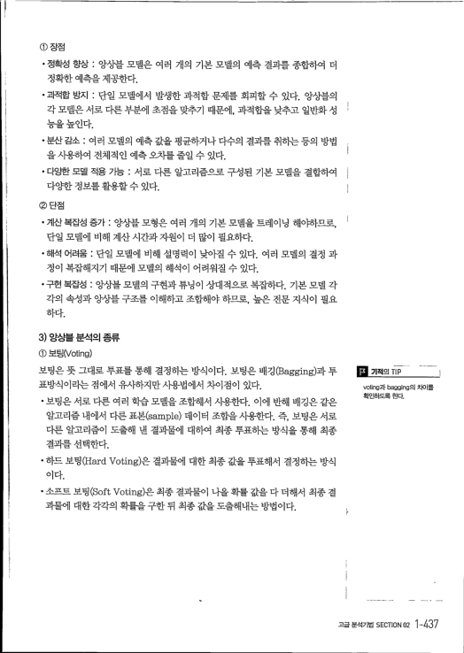
① 장점

#### · 정확성 향상 : 앙상블 모델은 여러 개의 기본 모델의 예측 결과를 종합하여 더 
정확한 예측을 제공한다．

#### ' 과적합 방지 : 탄일 모델에서 발생한 과적합 문제를 회피할 수 있다 . 앙상블의 
각 모델은 서로 다른 부분에 초점을 맞추기 때문에 , 과적합을 낮추고 일반화 성 능을 높인다．

- 분산 감소 : 여러 모델의 예측 값을 평균하거나 다수의 결과를 취하는 등의 방법 
을 사용하여 전쳬적인 예측 오차를 줄일 수 있다．

- 다양한 모델 적용 가능 : 서로 다른 알고리즘으로 구성된 기본 모델을 결합하여
다양한 정보를 활용할 수 있다． ② 단점

#### · 계산 복잡성 증가 : 앙상블 모형은 여러 개의 기본 모델을 트레이닝 해야하므로，
단일 모델에 비해 계산 시간과 자원이 더 많이 필요하다．

- 해석 어려움 : 단일 모델에 비해 설명력이 낮아질 수 있다 . 여러 모델의 결정 과
정이 복잡해지기 때문에 모델의 해석이 어려워질 수 있다．

#### · 구현 복잡성 : 앙상블 모델의 구현과 튜닝이 상대적으로 복잡하다 . 기본 모델 각
각의 속정과 앙상블 구조를 이해하고 조합해야 하므로 , 높은 전문 지식이 필요 하다． 3) 앙상블 분석의 종류 ① 보팅（Voting) 보팅은 뜻 그대로 투표를 통해 결정하는 방식이다 . 보팅은 배깅（Bagging）과 투 표방식이라는 점에서 유사하지만 사용법에서 차이점이 있다．

#### · 보팅은 서로 다른 여러 학습 모델을 조합해서 사용한다 . 이에 반해 배깅은 같은
#### 알고리즘 내에서 다른 표본（sample) 데이터 조합을 사용한다 . 즉 , 보팅은 서로 
다른 알고리즘이 도출해 낸 결과물에 대하여 최종 투표하는 방식을 통해 최종 결과를 선택한다． ' 하드 보팅（Hard Voting）은 결과물에 대한 최종 값을 투표해서 결정하는 방식 이다．

- 소프트 보팅（Soft Voting）은 최종 결과물이 나올 확률 값을 다 더해서 최종 결 
과물에 대한 각각의 확률을 구한 뒤 최종 값을 도출해내는 방법이다．

#### ㅣ
> voting과 bagging의 차이를 
확인하도록 한다．

> 고급분석기법 SECTION 02 1-437
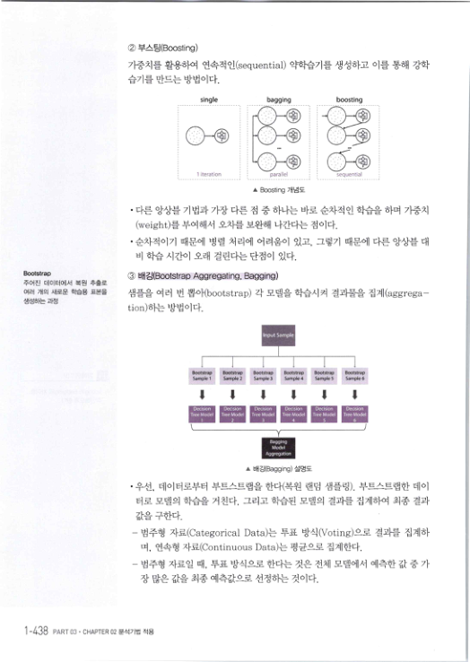
② 부스팅（Boosting) 가중치를 활용하여 연속적인（sequential) 약학습기를 생성하고 이를 통해 강학 습기를 만드는 방법이다． single bag嫩낑 1 iterati이1 ▲ Boostirtg 개념도

- 다른 앙상블 기법과 가장 다른 점 중 하나는 바로 순차적인 학습을 하며 가중치
(weight）를 부여해서 오차를 보완해 나간다는 점이다．

- 순차적이기 때문에 병렬 처리에 어려움이 있고 , 그렇기 때문에 다른 앙상블 대
비 학습 시간이 오래 걸린다는 단점이 있다． Bootstrap (3:) 배깅(Bootstrap Aggregating, Bagging) 주어진 데이터에서 복원 추출로 샘플을 여러 번 뽑아＜bootstrap) 각 모델을 학습시켜 결과물을 집계（aggrega- 여러 개의 새로운 학습용 표본을 생성하는 과정 tion）하는 방법이다． Inpul ‘緇n꽈기e

### Bootstrap 
Sample 3 I I :

Bootstrap Bootstrap Bootstrap Sample 4 SampleS SampleS I I

### Bootstrap 
Sample 1 恥otstrap Sample 2 I '

#### Dru｀沁n 
Tree Model 6 ` Y I 8aggng Model Aspjreyation Decision Tree Model 〕 Dcd5沁n Tree Mod미 Decision Tree M del 2 Decision Tree Model 4 Decision Tree Model 5 ▲ 배깅（Bagging) 설명도

- 우선 , 데이터로부터 부ㅌㅅㅌ랩을 한다（복원 랜덤 샘플링） . 부ㅌㅅㅌ랩한 데이
터로 모델의 학습을 거친다 . 그리고 학습된 모델의 결과를 집계하여 최종 결과 값을 구한다．

- 범주형 자료（Categorical Data）는 투표 방식（Voting）으로 결과를 집계하
며 , 연속형 자료（Continuous Data）는 평균으로 집계한다．

- 범주형 자료일 때 , 투표 방식으로 한다는 것은 전체 모델에서 예측한 값 중 가 
장 많은 값을 최종 예측값으로 선정하는 것이다． 1 -438 PART 03. CHAPTER 02분석기법적용

> boosting
### I
> 무
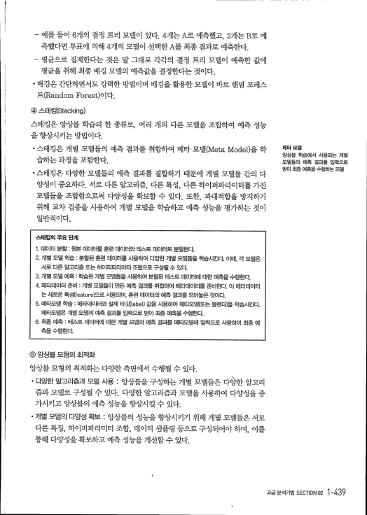
#### - 예를 들어 6개의 결정 트리 모델이 있다 . 4개는 A로 예측했고 , 2개는 B로 예
측했다면 투표에 의해 4개의 모델이 선택한A를 최종 결과로 예측한다．

- 평균으로 집계한다는 것은 말 그대로 각각의 결정 트리 모델이 예측한 값에
평균을 취해 최종 배깅 모델의 예측값을 결정한다는 것이다． ' 배깅은 간단하면서도 강력한 방법이며 배깅을 활용한 모델이 바로 랜덤 포레스 트（kandom Forest）이다． ④ 스태킹（Stacking) 스태킹은 앙상블 학습의 한 종류로 , 여러 개의 다른 모델을 조합하여 예측 성능 을 향상시키는 방법이다． ' 스태킹은 개별 모델들의 예측 결과를 취합하여 메타 모델（Meta Model）을 학 습하는 과정을 포함한다．

- 스태킹은 다양한 모델들의 예측 결과를 결합하기 때문에 개별 모델들 간의 다 
양성이 중요하다 . 서로 다른 알고리즘 , 다른특정 , 다른 하이퍼파라미터를 가진 모델들을 조합함으로써 다양성을 확보할 수 있다 , 또한, 과대적합을 방지하기 위해 교차 검증을 사용하여 개별 모델을 학습하고 예측 성능을 평가하는 것이

#### 일반적이다 .
스태킹의 주요 단계 1 . 데이터 분할 : 원본 데이터를 훈련 데이터와 테스트 데이터로 분할한다．

2. 개별 모델 학습 : 분할된 훈런 데이터를 사용하여 다양한 개벌 모델들을 학습시킨다. 이때 , 각 모델은 
서로 다른 알고리즘 또는 하이퍼파라미터 조합으로 구성될 수 있다．

3. 개별 모델 예측 : 학습된 개별 모델들을 사용하여 분할된 테스트 데이터에 대한 예측을 수행한다． 
4. 메타데이터 준비 : 개별 모델들0「만든 예측 결과를 취합하여 메타데이터를 준비한다. 이 메타데이터 
는 새로운특성(feature）으로 사용되며 , 훈련 데이터의 예측 결과를 모아놓은 것이다．

5. 메타모델 학습 : 메타데이터와 실제 타깃（tabel) 값을 사용하여 메타모델（또는 블렌더）을 학습시킨다．
메타모델은 개별 모델의 예측 결과를 입력으로 받아 최종 예측을 수행한다 .

6. 최종 예측 : 테스트 데이터에 대한 개별 모델의 예측 결과를 메타모델에 입력으로 사용하여 최종 예
측을수행한다． ⑤ 앙상블 모형의 최적화 앙상블 모형의 최적화는 다양한 측면에서 수행될 수 있다．

#### · 다잉한 알고리즘과 모델 ㅅ隱 : 앙상블을 구성히는 개별 모델들은 다숍한 알고리 
즘과 모델로 구성될 수 있다 . 다양한 알고리즘과 모델을 사용하여 다양성을 증 가시키고 앙상블의 예측 성능을 향상시킬 수 있다．

#### ' 개별 모델의 다양성 확보 : 앙상블의 성능을 향상시키기 위해 개별 모델들은 서로 
다른특징， 하이퍼파라미터 조합 , 데이터 샘플링 등으로구성되어야하며 , 이를 통해 다양성을 확보하고 예측 성능을 개선할 수 있다 .

> 머［타 모델
> 앙상블 학습에서 사용되는 개별 
모델들의 예측 결과를 입력으로 받아 최종 예측을수행하는 모델

> 고급분석기법 SECTION 02 1 -439
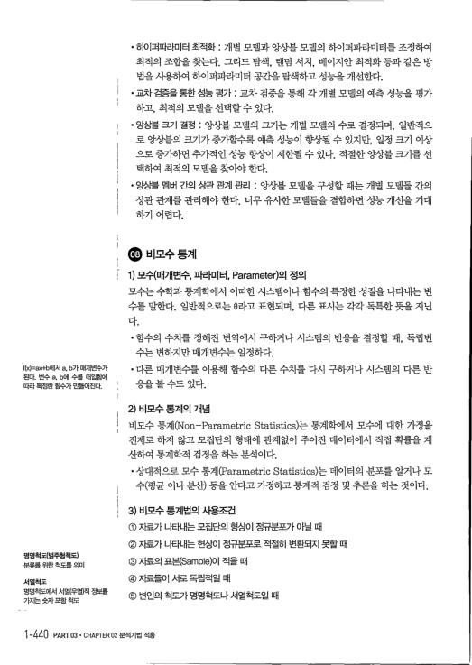
#### · 하이퍼파라미터 최적화 : 개별 모델과 앙상블 모델의 하이퍼파라미터를 조정하여
#### 최적의 조합을찾는다 . 그리드탐색 , 랜덤 서치 , 베이지안 최적화등과같은방
법을 사용하여 하이퍼파라미터 공간을 탐색하고 성능을 개선한다．

#### · 교차 검증을 통한 성능 평가 : 교차 검증을 통해 각 개별 모델의 예측 성능을 평가 
하고 , 최적의 모델을 선택할 수 있다．

#### · 앙상블 크기 결정 : 앙상블 모델의 크기는 개별 모델의 수로 결정되며 , 일반적으 
로 앙상블의 크기가 증가할수록 예측 성능이 향상될 수 있지만, 일정 크기 이상

#### 으로 증가하면 추가적인 성능 향상이 제한될 수 있다 . 적절한 앙상블 크기를 선
택하여 최적의 모델을 찾아야 한다．

- 앙상블 멤버 간의 상관 관계 관리 : 앙상블 모델을 구성할 때는 개별 모델들 간의
#### 상관 관계를 관리해야 한다 . 너무 유사한 모델들을 결합하면 성능 개선을 기대
#### 하기 어렵다 .
.

비모수통계

#### 1) 모수＜매개변수 , 파라미터 , Parameter）의 정의
모수는 수학과 통계학에서 어떠한 시스템이나 함수의 특정한 성질을 나타내는 변

#### 수를말한다 . 일반적으로는0라고표현되며 , 다른표시는각각독특한듯을지닌
다．

#### · 함수의 수치를 정해진 변역에서 구하거나 시스템의 반응을 결정할 때 , 독립변
수는 변하지만 매개변수는 일정하다．

- 다른 매개변수를 이용해 함수의 다른 수치를 다시 구하거나 시스템의 다른 반
f(x)=ax+b에서 a. b가 매개변수가 된다 . 변수 a. b0∥ 수를 대입함에 따라 특정한 함수가 만들《거진다． 응을 볼 수도 있다． 2) 비모수 통계의 개념 비모수 통계（Non-Parametric Statistics）는 통계학에서 모수에 대한 가정을 전제로 하지 않고 모집단의 형태에 관계없이 주어진 데이터에서 직접 확률을 계 산하여 통계학적 검정을 하는 분석이다．

- 상대적으로 모수 통계（Parametric Statistics）는 데이터의 분포를 알거나 모 
수（평균 이나분산） 등을 안다고 가정하고 통계적 검정 및 추론을 하는 것이다． 3) 비모수 통계법의 사용조건 ① 자료가 나타내는 모집단의 형상이 戮繼포가 아닐 때 ② 자료가 나타내는 현상이 정규분포로 적절히 변환되지 못할 때 명명척도（범주형척도） ③ 자료의 표본＜Sample）이 적을 때 분류를 위한 척도를 의미 ④ 자료들이 서로 독립적일 때 서열척도 명명척도에서 서열（우열）적 정보를 가지는숫자포함 척도 ⑤ 변인의 척도가 멍명척도나 서열척도일 때 1 -440 PART 03. CHAPTER 02분석기법적용

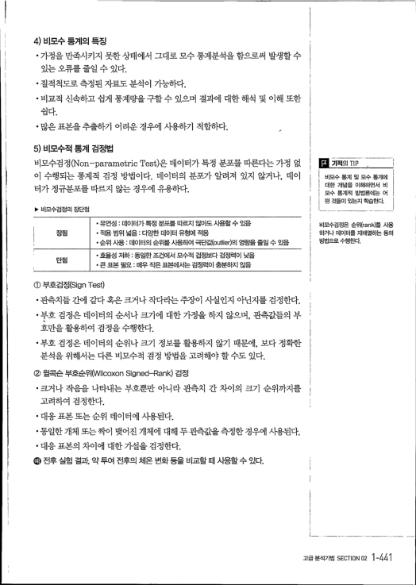
4) 비모수 통계의 특징

- 가정을 만족시키지 못한 상태에서 그대로 모수통계분석을 함으로써 발생할 수
있는 오류를 줄일 수 있다．

- 질적척도로 측정된 자료도 분석이 가능하다．
- 비교적 신속하고 쉽게 통계량을 구할 수 있으며 결과에 대한 해석 및 이해 또한
쉽다．

- 많은 표본을 추출하기 어려운 경우에 사용하기 적합하다． 
.

5) 비모수적 통계 검정법 비모수검정（Non-parametric Test）은 데이터가 특정 분포를 따른다는 가정 없

#### 이 수행되는 통계적 검정 방법이다 . 데이터의 분포가 알려져 있지 않거나 , 데이
터가 棚구분포를 따르지 않는 경우에 유용하다． 》 비모수검정의 짇단점 장점

- 유연성 : 데이터가 특정 분포를 따르지 않아도 사용할 수 있음
- 적용 범위 넓음 : 다양한 데이터 유형에 적용 
- 순위 사용 : 데이터의 순위를 사용하여 극단값（outlier）의 영향을 줄일 수 있음
단점

- 효율성 저하 : 동일한 조건에서 모수적 검정보다 검정력이 낮음
- 큰 표본 필요 : 매우 작은 표본에서는 검정력이 짊븐하지 않음
① 부호검정（Sign Test)

- 관측치들 간에 같다 혹은 크거나 작다라는 주장이 사실인지 아닌지를 검정한다．
#### · 부호 검정은 데이터의 순서나 크기에 대한 가정을 하지 않으며 , 관측값들의 부
호만을 활용하여 검정을 수행한다．

- 부호 검정은 데이터의 순위나 크기 정보를 활용하지 않기 때문에 , 보다 정확한
분적을 위해서는 다른 비모수적 검정 방법을 고려해야 할 수도 있다． ② 윌콕슨 부호순위（Wilcoxon Signed-Rank) 검정

- 크거나 작음을 나타내는 부호뿐만 아니라 관측치 간 차이의 크기 순위까지를
고려하여 검정한다．

- 대응 표본 또는 순위 데이터에 사용된다 .
- 동일한 개쳬 또는 짝이 맺어진 개쳬에 대해 두 관측값을 측정한 경우에 사떵될다．
- 대응 표본의 차이에 대한 가설을 검정한다．
cll 전후 실험 결과, 약 투여 전후의 체온 변화 등을 비교할 때 사용할 수 있다．

> ．헴기적의TIP 
…

> - 비모수통계및모수통계에
> - 대한 개념을 이해하면서 비 
l 모수 통계적 방법론에는 어

> 3 0j있뉘
> '힌다
"

> 비모수검정은 순위（rat가（詹 사용 
하게ㅘ 데이터를 재배열하는 등의 방법으로수행한다．

> ㅣ
> 고급분석기법 SECTION 02 1 -441
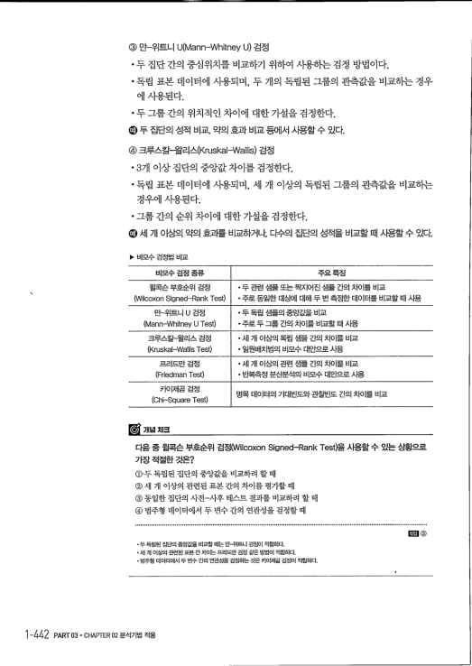
③ 만－위트니 U(Mann-Whitney U) 검정

- 두 집단 간의 중심위치를 비교하기 위하여 사용하는 검정 방법이다．
- 독립 표본 데이터에 사용되며 , 두 개의 독립된 그룹의 관측값을 비교하는 경우
에사용된다．

#### · 두 그룹 간의 위치적인 차이에 대한 가설을 검정한다． 
.l 두 집단의 성적 비교， 약의 효과 비교 등에서 사용할 수 있다． ④ 크루스칼‘왈리스（Kruskal-Wallls) 검정 .3개 이상 집단의 중앙값 차이를 검정한다．

- 독립 표본 데이터에 사용되며 , 세 개 이상의 독립된 그룹의 관측값을 비교하는
경우에 사용된다．

#### · 그룹 간의 순위 차이에 대한 가설을 검정한다． 
.l 세 개 이상의 약의 효과를 비교하거나, 다수의 집단의 성적을 비교할 때 사용할 수 있다．

> 비모수 검정법 비교
비모수 검정 종류 주요 특징 (Wilcoxon Signed-Rank Test)

- 두 곤봇크 샘플 또는짝지어진 수搢 간의 차이를 비교
윌콕슨 부호순위 검정

- 주로 동일한 대상에 대해 두 번 측정한 데이터를 비교할 때 사용
- 두 독립 샘플의 중앙값을 비교
만－위트니 U 검정

- 주로 두 그룹 간의 차이를 비교할 때 사용
(Mann-Whitney U Test) 크루스칼왈리스 검정 (Kruskal-Wallis Test)

- 세 개 이상의 독립 소搢 간의 차이를 비교
- 일원배치법의 비모수 대안으로 사용
프리드만 검정 (Friedman Test)

- 세 개 이상의 관련 소搢 간의 차이를 비교
- 반복측정 분산분석의 비모수 대안으로 사용
카이제곱 검정 (Chi-Square Test) 명목 데이터의 기대빈도와 관칠빈도 간의 차이를 비교 다음 중 윌콕슨 부호순위 검정（Witcoxon Signed-Rank Test）을 사용할 수 있는 상황으로 가장 적절한 것은？ ①·두 독립된 집단의 중앙값을 비교하려 할 때 ② 세 개 이상의 관련된 표본 간의 차이를 평가할 때 ③ 동일한 집단의 사전－사후 테스트 결과를 비교하려 할 때 (D 범주형 데이터에서 두 변수 간의 연관성을 검정할 때

- 두독립된 집단의 중앙값을 비교할 때는 만－위트니 검정이 적함하다．
- 세 개 이상의 괸런된 표본 간차이는프리드만 검정 같은 방법이 적합히다．
- 범주형 데이터에서 두 변수 간의 연관성을 검정하는 것은 카이저금 검정이 적합ㅎㅐ가．
1-442 PART 03· CHAPTER 02분석기법적용

> ㅁ래 ③
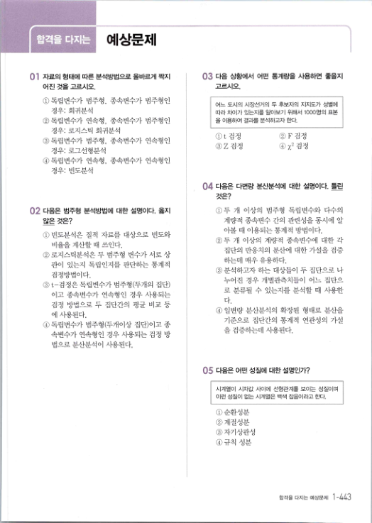
## 예상문제
03 다음 상황에서 어떤 통계량을 사용하면 좋을지 01 자료의 형태에 따른 분석방법으로 올바르게 짝지 고르시오． 어진 것을 고르시오． ①독립변수가 범주형 , 종속변수가 범주형인 어느 돠 의 시장선거의 두 후보차의 지자도가 성별에 경우： 회귀분석 ②독립변수가 연속형 , 종속변수가 범주형인 따라 차이가 있는지를 알아보기 위해서 1000명의 표본 을 이용하여 결과를 분석하고자 한다． 경우： 로지스틱 회귀분석 ③독립변수가 범주형 , 종속변수가 연속형인 경우 ' 로그선형분석 ④독립변수가 연속형 , 종속변수가 연속형인

#### cDt 검정 
③z 검정 ② F 검정 경우： 빈도분석 04 다음은 다변량 분산분석에 대한 설명이다 . 틀린 것은？ 02 다음은 범주형 분석방법에 대한 설명이다 . 옳지 ①두 개 이상의 범주형 독립변수와 다수의 않은 것은？ 계량적 종속변수 간의 관련성을 동시에 알 아볼 때 이용되는 통계적 방법이다． ②두 개 이상의 계량적 종속변수에 대한 각 집단의 반응치의 분산에 대한 가설을 검증 ① 빈도분석은 질적 자료를 대상으로 빈도와 비율을 계산할 때 쓰인다． ② 로지스틱분적은 두 범주형 변수까 서로 상 관이 있는지 독립인지를 판단하는 통계적 하는데 매우 유용하다． ③ 분석하고자 하는 대상들이 두 집단으로 나 검정방법이다． ③ t－검정은 독립변수가 범주형（두개의 집단） 이고 종속변수가 연속형인 경우 사용되는 검정 방법으로 두 집단간의 평균 비교 등 누어진 경우 개별관측치들이 어느 집단으 로 분류될 수 있는지를 분석할 때 사용한 다． ④ 일변량 분산분석의 확장된 형태로 분산을 기준으로 집단간의 통계적 연관성의 가설 을 검증하는데 사용된다 .

에사용된다． ④ 독립변수가 범주형（두개이상 집단）이고 종 속변수가 연속형 인 경우 사용되는 검정 방 법으로 분산분석이 사용된다 .

05 다음은 어떤 성질에 대한 설명인가？ 시계열이 시차값 사이에 선형관계를 보이는 성질이며 이런 성질이 없는 시계열은 백색 집음이라고 한다． ①순환성분 ② 계절성분 ③ 자기상관성 ④규칙 성분

> ④ x2 검정
> 합격을다지는예상문제 1-443
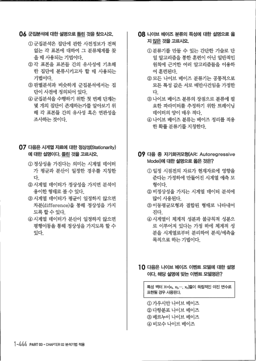
06 군집분석에 대한 설명으로 틀린 것을 찾으시오． 08 나이브 베이즈 분류의 특성에 대한 설명으로 옳 지 않은 것을 고르시오． ① 군집분석은 집단에 관한 사전정보가 전혀 없는 각 표본에 대하여 그 분류쳬계를 찾 을 때 사용되는 기법이다． ②각 표본을 표본들 간의 유사성에 기초해 한 집단에 분류시키고자 할 때 사용되는 ① 분류기를 만들 수 있는 간단한 기술로 단 일 알고리즘을 통한 훈런이 아닌 일반적인 원칙에 근거한 여러 알고리즘들을 이용하 여훈런된다． ② 모든 나이브 베이즈 분류기는 공통적으로 모든 특성 값은 서로 배반사건임을 가정한 기법이다． ③판별분석과 비슷하게 군집분석에서는 집 단이 사전에 정의되어 있다． ④ 군집분적을 수행하기 위한 첫 번째 단계는 몇 개의 집단이 존재하는가를 알아보기 위 해 각 표본들 간의 유사성 혹은 연관성을 조사하는 것이다． 다． ③ 나이브 베이즈 분류의 장점으로 분류에 필 요한 파라미터를 추정하기 위한 트레이닝 데이터의 양이 매우 적다． ④ 나이브 베이즈 분류는 베이즈 정리를 적용 한 확률 분류기를 지칭한다． 07 다뿐 시계열 자료에 대한 정상성（Stationarity) 에 대한 설명이다 . 틀린 것을 고르시오． 0' 다음 중 자기회귀모형（AR: Autoregressive Model）에 대한 설명으로 옳은 것은？ ① 정상성을 가진다는 의미는 시계열 데이터 가 평균과 분산이 일정한 경우를 지칭한 ① 일정 시점전의 자료가 현재자료에 영향을 준다는 가정하에 만들어진 시계열 예측 모 다． ② 시계열 데이터가 정상성을 가지면 분석이 용이한 형태로 볼 수 있다． ③시계열 데이터가 평균이 일정하지 않으면 차분（difference）을 통해 정상성을 가지 도록 할 수 있다． ④시계열 데이터가 분산이 일정하지 않으면 형이다． ②비정상성을 가지는 시계열 데이터 분적에 많이 사용된다． ③ 이동평균모형과 결합된 형태로 나타내어 진디ㅗ． ④시계열이 쳬계적 성분과 불규칙적 성분으 로 이루어져 있다는 가정 하에 쳬계적 성 분을 시계열로부터 분리하여 분석／예측을 목적으로 하는 기법이다． 평행이동을 통해 정상성을 가지도록 할 수 있다． 10 다뿐 나이브 베이즈 이벤트 모델에 대한 설명 이다 , 해당 설명에 맞는 이벤트 모델명은？ 특셩 벡터 X=(xi, x2, ··· , Xr）들이 독립적인 이진 변수로 표현될 경우 사용된다． ① 가우시안 나이브 베이즈 ② 다항분포 나이브 베이즈 ③ 베르누이 나이브 베이즈 ④ 비모수 나이브 베이즈 1-444 PART 03. CHAPTER 02분석기법적용

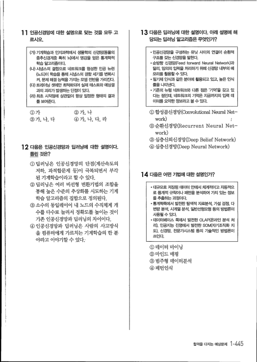
11 인공신경망에 대한 설명으로 맞는 것을 모두 고 13 다음은 딥러닝에 대한 설명이다 . 아래 설멍에 해 당되는 딥러닝 알고리즘은 무엇인가？ 르시오．

- 인공신경망을 구성하는 유닛 사이의 연결이 순환적 
구조를 갖는 신경망을 말한다．

- 순방향 신경망（Feed forward Neura' Network）과 
달리 , 임의의 입력을 처리하기 위해 신경망 내부의 메 모리를 흴용할 수 있다．

- 필기체 인식과 같은 분야에 흴용되고 있고， 높은 인식 
률을 나타낸다．

- 기존의 뉴럴 네트워크와 다른 점은 ' 기억'을 갖고 있 
다는 점인데 . 네트워크의 기억은 지금까지의 입력 데 이터를 요약한 정보라고 볼 수 있다． （가） 기계학습과 인지과학에서 생물학의 신경망（동물의 중추신경계중 특히 뇌）에서 영감을 얻은 통계학적 학습 알고리즘이다． （나） 시냅스의 결합으로 네트워크를 형성한 인공 뉴런 （노드）이 학습을 통해 시냅스의 결합 세기를 변화시 켜 , 문제 해결 능력을 가지는 모델 전반을 가리킨다． （다） 트레이닝 셋에만 최적화되어 실제 테스트와 예상결 과의 괴리가 발생하는 단점이 있다． （라） 최초 시착점에 상관없이 항상 일정한 형태의 결과 를보여준다． ① 합성곱신경망（Convolutional Neural Net- work) ②순환신경망（Recurrent Neural Net- work) ③ 심층신뢰신경망（Deep Belief Network)

- ④심층신경망①eep Neural Network)
①가 ③가 , 나 , 다 ② 가 , 나 ④가 , 나 , 다 , 라 12 다음은 인공신경망과 딥러닝에 대한 설명이다． 틀린 것은？ ①딥러닝은 인공신경망의 단점（계산속도의 저하 , 과적합문제 등）이 극복되면서 부각 된 기계학습이라고 할 수 있다． ②딥러닝은 여러 비선형 변환기법의 조합을

#### 14 다음은 어떤 기법에 대한 설명인가？
- 대규모로 저장된 데이터 안0BAl 체계적이고 자동적으 
로 통계적 규칙이나 패턴을 분석하여 가치 있는 정보 를 추출하는 과정이다．

- 통계학쪽에서 발전한 탐색적 자료분석 , 가설 검정 , 다 
변량 분석 , 시계열 분석 , 일반선형모형 등의 방법론이 사용될 수 있다．

- 데이터베이스 쪽에서 발전한 O냐｀P（온라인 분석 처
통해 높은 수준의 추상화를 시도하는 기계 학습 알고리즘의 집합으로 정의된다． ③소수의 동일레이어 내 노드의 수직쳬계 개 수를 다수로 늘려서 정확도를 높이는 것이 기존 인공신경망과 딥러닝의 차이이다． ④ 인공신경망과 딥러닝은 사람의 사고방식 을 컴퓨터에게 가르치는 기계학습의 한 분 야라고 이야기할 수 있다．· 리） , 인공지능 진영에서 발전한 SOM（자기조직화 지 도） , 신경망 , 전문가시스템 등의 기술적인 방법론이 쓰인다． ①데이터 마이닝 ② 마인드 매핑 ③ 범주형 데이터분석 ④ 패턴인식

> 합격을다지는예상문제 1-445
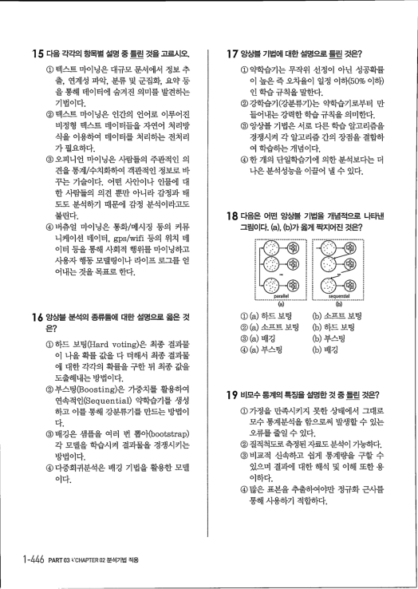
#### 1 5 다음 각각의 항목별 설명 중 틀린 것을 고르시오．
#### 17 앙상블 기법에 대한 설명으로 틀린 것은？
① 텍스트 마이닝은 대규모 문서에서 정보 추 출 , 연계성 파악 , 분류 및 군집화, 요약 등 을 통해 데이터에 숨겨진 의미를 발견하는 ① 약학습기는 무작위 선정이 아닌 성공확률 이 높은 즉 오차율이 일정 이하（50% 이하） 인학습 予칙을말한다． ②강학습기（강분류기）는 약학습기로부터 만 들어내는 강력한 학습 규칙을 의미한다． ③ 앙상블 기법은 서로 다른 학습 알고리즘을 기법이다． ②텍스트 마이닝은 인간의 언어로 이루어진 비정형 텍스트 데이터들을 자연어 처리방 식을 이용하여 데이터를 처리하는 전처리 가 필요하다． ③오피니언 마이닝은 사람들의 주관적인 의 견을 통계／수치화하여 객관적인 정보로 바 꾸는 기술이다 . 어떤 사안이나 인물에 대 한 사람들의 의견 뿐만 아니라 감정과 태 도도 분석하기 때문에 감정 분석이라고도 경쟁시켜 각 알고리즘 간의 장점을 결합하 여 학습하는 개넘이다． ④ 한 개의 단일학습기에 의한 분석보다는 더 나은 분석성능을 이끌어 낼 수 있다． 불린다． ④버츄얼 마이닝은 통화／메시징 등의 커뮤 니케이션 데이터 , gps/wifi 등의 위치 데 이터 등을 통해 사회적 행위를 마이닝하고 사용자 행동 모델링이나 라이프 로그를 얻

#### 一
계

# 鍔
어내는 것을 목표로 한다． ` par해이 (a) ① (a) 하드 보팅 ② (a) 소프트 보팅 ③ (a) 배깅 ④ (a) 부스팅 1 6 앙상블 분석의 종류들에 대한 설명으로 옳은 것 은？ ① 하드 보팅（Hard voting）은 최종 결과물 이 나을 확률 값을 다 더해서 최종 결과물 에 대한 각각의 확률을 구한 뒤 최종 값을 도출해내는 방법이다． ②부스팅（Boosting）은 가중치를 활용하여 1 , 비모수 통계의 특징을 설명한 것 중 틀린 것은？ 연속적인（Sequential) 약학습기를 생성 하고 이를 통해 강분류기를 만드는 방법이 ① 가정을 만족시키지 못한 상태에서 그대로 모수 통계분석을 함으로써 발생할 수 있는 오류를 줄일 수 있다． ② 질적척도로측정된 자료도분석이 가능하다． ③ 비교적 신속하고 쉽게 통계량을 구할 수 있으며 결과에 대한 해석 및 이해 또한 용 다． ③배깅은 샘플을 여러 번 뽑아（bootstrap) 각 모델을 학습시켜 결과물을 경챙시키는 방법이다． ④ 다중회귀분석은 배깅 기법을 활용한 모델 이하다． ④ 많은 표본을 추출하여야만 정규화 근사를 통해 사용하기 적합하다． 이다． 1 -446 PART 03`' CHAPTER 02분석기법적용

#### 一
一 刪

#### 鵬
一

> 刪
> sequenti이 
(b)

> (b) 소프트 보팅 
(b) 하드 보팅

> (b）부스팅
> (b）배깅
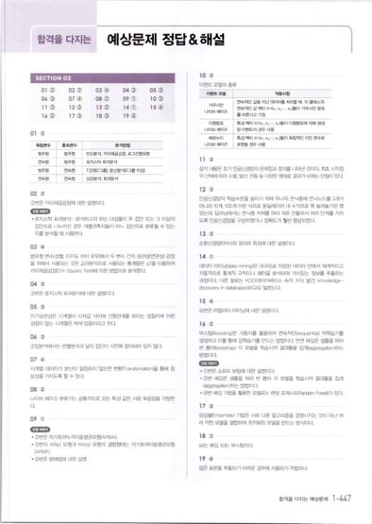
## 합격을다지는 
예상문제 정답＆해설 10 ③ SECTION 02 《기번l트 모델의 종샌 류 01 ② 04 ③ 02 ② 03 ④ 05 ③ lo ③ 15 ④ .볜峰모델 기 제르사항

### 7I시안 - 
나이브 베이즈 0S ② 06 （石：) 07 （軫 091D 14 <j:) 안속적인 값을 지닌 데이터를 처리할 때． 각 클래스의 11 （軫 12 ③ 13 ② 연속적인 값 벡터 ×=《x', X2.…. X,＞들이 가우시안 분포 를 따른다고 가정 17 ③ 18 （功 16 ② 19 ④ 다힝분포 특성 벡터 ×늬x1. x2...., xn）들이 다힝분포에 의해 생성 나이브 베이즈 된 이벤트의 경우 사용 01 ② 특성 벡터 ×=(x1. x2; , x,）들이 독립적인 이진 변수로 베르누이 나이브 베이즈 표현될 경우 사용 독립변수 종속변수 분석방법 범주형 범주형 빈도분석， 카이제곱검정． 로그선형모형 11 ③ ……… …… … …………………………… … 연속형 범주형 로지스틱 회귀분석 상기 나嚼은 초기 인공신경망의 문제정과 정와를 나타낸 겐기다. 최초 사작점 의 선택에 따라 수렴 . 발산. 진동 둥 다양한 형타l로 결과가 바뀌怜굿 단점이 있다． 범주형 연속형 T검정（2그룹）. 분산분석（2그룹 이상） 연속형 연속형 상관분석． 최귀분석 12 ③ … …… 02 ② 안공신경망의 학습수준을 높이기 위해 하나의 은닉층에 은닉노드를 3개가 아니라 10개 . 100개 이런 식으로 동일레이어 내 수직으로 쭉 늘려놓기만 했 ②번은 카이제곱검정에 대한 설명이다． 오답 미하기 었는데． 딥러닝에서는 은닉층 차체를 여러 개로 만들《거서 여러 단계를 거치 도록 인공신겅망을 구성하였더니 정확도가 훨씬 향상되었다，

- 로지스틱 회귀분석 : 분석하고자 하는 대상들이 두 집단 또는 그 이상의
집단으로 나뉘거진 경우 개별관측치들이 어느 집단으로 분류될 수 있는 자를 분석할 때 사용한다． 13 ②  .

②.

②. ... ....................................... .. ... .........

순환신경망（RNN）의 정와와 특징에 대한 설명이다， 03 ④ ……… ……………………… …… … ……∼ 범주형 변수《성별． 지지도 차이 유우）에서 두 변수 간의 상관성（연관성） 검정 을 위해서 사용돠는 것은 교차분석으로 사용되는 퉁계량은 x2을 이용하여 14 CD .. .... ......... ... .................. ....... .....……… ……… 데이터 마이닝（data mining）은 대규모로 저장된 데이터 안에서 체계적이고 자동적으로 통계적 규칙이나 패턴을 분석하여 가치있는 정보를 추출하는 과정이다. 다른 말로는 KDD（데이터베이스 속의 지식 발견 . knowledge- discovery in databases》라고도 일컫는다． 캐기처몹검정（0ii-Square Testy게 의한 방법으로 분석한다． 04 （功 … … ③번은로자스틱 회 분석에 대한 설명이다 is c) … ………………… …………」 05 ③ … ④번은 리얼리티 마이닝에 대한 설명이다． 자기상관성은 시계열o 시차값 사이에 선형관계를 보이는 성질이며 이런 성질이 없는 시계열은 백색 잡음이라고 힌다． 16 ② 「 …………… ∼…………… …………… 부스팅（Boosting》은 가중치를 활용하여 연속적인（sequential) 익학습기를 생성하고 이를 통해 강학습기를 만드는 방법이다． 반면 배깅은 싣搢을 여러 번 뽑아（bootstrap) 각 모델을 학습시켜 결과물을 집계（aggregation）하는 06 c) ………… ………」 군집분석에서는 판별분석과 달리 집단이 사전에 정의되어 있지 않다． 방법이다． 07 ④  .

④.

④ .

④ .

④ .

④ .. .... ... .... .. ..

.... . . . .

.... . ..

. . .. .... ........ .... ........ .... ..

. .. ..... . ..

오답 떠하기

- ①번은 소프트 보팅에 대한 설명이다．
시계열 데이터가 분산이 일정하지 않으면 변환（Transtomation》을 통해 정 상성을 가지도록 할 수 있다， 碣）번 배깅은 수搢을 여러 번 쁩아 각 모델을 학습시켜 결과물을 집계 (aggregation）하는 방법이다．

- ＜프：
보」 배깅 기법을 횔용한 모델로는 랜덤 포레스트｀ 「tbㄲ Fcred》가 있다． 08 （軫 … …… … 나이브 베이즈 분류기는 공통적으로 모든 특성 값은 서로 독립임을 가정한 다． 17 ③ 앙상블（Ensemble) 기법은 서로 다른 알고리즘을 경쟁시키는 것이 아닌 여 러 약한 모델을 결합하여 최적화된 모델을 만드는 방식이다． 09 CD 오답 피하기 18 c)  .

c) .

c) .

c) . .... .....................

- ②번은 자기회귀누적이동평균모형（／자IMA) 
- ③번의 AR(p) 모형과 MA(q) 모형의 결합형태는 자기회귀이동평균모형
(a＞는 배깅． (b）는 부스팅이다． (All궤｀納）

- ④번은 분해법에 대한 설명
19 ④ … 많은 표본을 추출하기 어려운 경우에 사용하기 적합하다．

> 합격을 다지는 예상문제 ㅣ 447

# PART 0zl
# 빅데이터 결과 해석
파트 소개 4과목은 분석모형을 어떻게 평가하고 개선하는지 , 분석결과를 어떻게 해석하고 활용하는지에 대한 내용입니다 . 개념적인 내용들이 많이 등장하므로 앞의 과목 들을 충실히 공부하였다면 암기를 통해서 충분히 높은 점수를 받을 수 있습니다．

## `