# CHAPTER 
01

# 분석모형 평가 및 개선
분석모형을 평가, 진단하고 개선하는 방법을 학습츌시다 . 지도학습과 비지도학습을 펑 가하는 기법을 비교해서 설명할 수 있어야 합니다 . 특히 , 오차행렬을 이용하여 분석 모 형의 정확도， 정밀도， 재현도를 계산하는 과정은 시험에서 중요한 비중을 차지하니 고 득점을 목표로 대비해야 합니다． 줄제 빈도 SECTION 01 - 75% SECTION 02 하 ) 25%

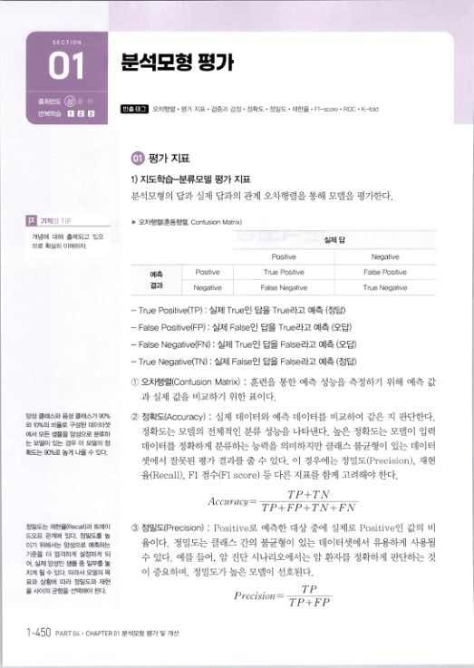
# SECTION 01
# 분석모형 평가
출제빈도 · 빈출 타｛그 오차행렬 · 평가 지표 · 검증과 검정 · 정확도 · 정밀도 · 재현을 · Fl-score ' ROC · K-told 반복학습 N .

.

#### ㅇ 평가 지표
1) 지도학습결류모델 평가 ㅈ區 분적모형의 답과 실제 답과의 관계 오차행렬을 통해 모델을 평가한다． .

기적의 지P

> 오차행렬（혼동행렬 , Confusion Matrix)
개념에 대해 출제되고 있으 므로 확실히 이해하자． Positive Positive True Positive 예측 결과 False Negative Negative

- True Positive(TP) : 실제 True인 답을 True라고 예측 （정답）
#### - False Positive(FP) : 실제 False인 답을 True라고 예측 （오답）
- False Negative(FN) : 실제 True인 답을 False라고 예측 （오답）
- True Negative(TN) : 실제 False인 답을 False라고 예측 （정답）
#### ① 오차행렬（Confusion Matrix) : 훈련을 통한 예측 성능을 측정하기 위해 예측 값
과 실제 값을 비교하기 위한 표이다．

#### ② 정확되Accuracy) : 실제 데이터와 예측 데이터를 비교하여 같은 지 판단한다．
양성 클래스와 음성 클래스가 90% 와 10％의 비율로 구성된 데이터셋 정확도는 모델의 전쳬적인 분류 성능을 나타낸다 . 높은 정확도는 모델이 입력 에서 모든 샘플을 양성으로 분류하 는 모델이 있는 경우 이 모델의 정 데이터를 정확하게 분류하는 능력을 의미하지만 클래스 불균형이 있는 데이터 확도는 9y％로 높게 나올 수 있다，

#### 셋에서 잘못된 평가 결과를 줄 수 있다 . 이 경우에는 정밀도（Precision) , 재현 
율（Recall), Fl 점수（Fl score) 등 다른 지표를 함께 고려해야 한다 .

#### . 
T/) 7`Zv llccuracy= T／〕＋FP+TN+FN

#### ③ 정밀도（Precision) : Positive로 예측한 대상 중에 실제로 Positive인 값의 비
정밀도는 재현율《Rec헤》과 트레이 드오프 관계에 있다 . 정밀도를 높 이기 위해서는 양성으로 예측하는 율이다 . 정밀도는 클래스 간의 불균형이 있는 데이터셋에서 유용하게 사웅될 기준을 더 엄격하게 설정하게 되 어 . 실제 양성인 생플 중 일부를 놓

#### 수 있다 . 예를 들어 , 암 진단 시나리오에서는 암 환자를 정확하게 판단하는 것
이 중요하며 , 정밀도가높은모델이 선호된다． 치게 될 수 있다 . 따라서 모델의 목 표와 상황에 따라 정밀도와 재현 율 사이의 균형을 선택해야 한다．

### - 
. .

TP Precision = T/J구FP 1 -450 PART 04' CHAPTER 01분석모형평가및개선

> 실제 답
> Negative
> False Positive
> True Negative
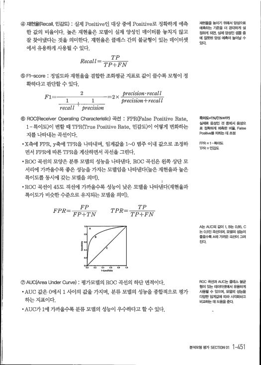
#### ④ 재현율（Rec헤 , 민감도） : 실제 Positive인 대상 중에 Positive로 정확하게 예측 
한 값의 비율이다 . 높은 재현율은 모델이 실제 양성인 데이터를 놓치지 않고 잘 찾아냈다는 것을 의미한다 . 재현율은 클래스 간의 불균형이 있는 데이터셋 에서 유용하게 사용될 수 있다．

#### - 
. .

TP Kecall = TP+FN ⑤Fl-score : 정밀도와 재현율을 결합한 조화평균 지표로 값이 클수록 모형이 정 확하다고 판단할 수 있다．

#### R1= 
2 =2)::

1 , 1

- 
夕recision + recall recalz 士 夕recision 夕recision· recalz ⑥ROC(Receiver Operating Characteristic) 곡선 : FPR(False Positive Rate, 1－특이도）이 변할 때 TPR(True Positive Rate , 민감도）이 어떻게 변화하는 지를 나타내는 곡선이다．

#### .x축에 FPR, y축에 TPR을 나타내며 , 임계값을 1'--0 범주 이내 값으로 조정하
면서 FPR에 따른 TPR을 계산하면서 곡선을 그린다．

#### ·ROC 곡선의 모양은 분류 모델의 성능을 나타낸다 . ROC 곡선은 왼쪽 상단 모
서리에 가까울수록 좋은 성능을 가지는 모델임을 나타낸다（높은 재현율과 높은

#### 특이도를 동시에 갖는 모델을 의미）.
- ROC 곡선이 45도 직선에 가까울수록 성능이 낮은 모델을 나타낸다（재현율과
#### 특이도가 비슷한 수준으로 유지되는 모델을 의미）.
# FPR= FPTN 
TPR= TF暢N

0. 
軫 조 샅 곁 橫

0. .*. 
0그 毓／ ㄸ6 (`.8 1뺨.

1-sP황u0dty

#### () AUC(Area Under Curve) : 평가모델의 ROC 곡선의 하단 면적이다．
#### ·AUC 값은 0에서 1 사이의 값을 가지며 , 분류 모델의 성능을 종합적으로 평가
하는 지표이다．

- AUC가 1에 가까울수록 분류 모델의 성능이 우수하다고 할 수 있다．
> 재현율을 높이기 위해서 양성으로
> 예측하는 기준을 더 관대하게 설
> 정하게 되면 , 실제 양성인 샘플 중
> 0뀜 잘못된 양성 예측이 늘《거날 수
> 있다．
> 특이도볍＝TN/(TN+FP)
> 실제로 음성인 것 중에서 음성으 
로 정확하게 예측한 비율 . F히se Positive를 피하는 데 초점

> FPR = 1 －특이도 
TPR = 민감도

> A는 AUC의 값이 1. B는 0.85. C 
는 0.5인 곡선이며 . 모델의 성능이 좋을수록 A에 가까운 곡선이 그려

> 진다．
> 。
> ROC 곡선과 AUC는 클래스 불균
> 형이 있는 데이터셋에서 듀용하게 
사용될 수 있으며 , 모델의 성능을

> 다양한 임계값에 때카 시각화하고 
비교하는 데 도움을 준다．

> 분석모형평가SECTION 01 1 -4！ㅟ
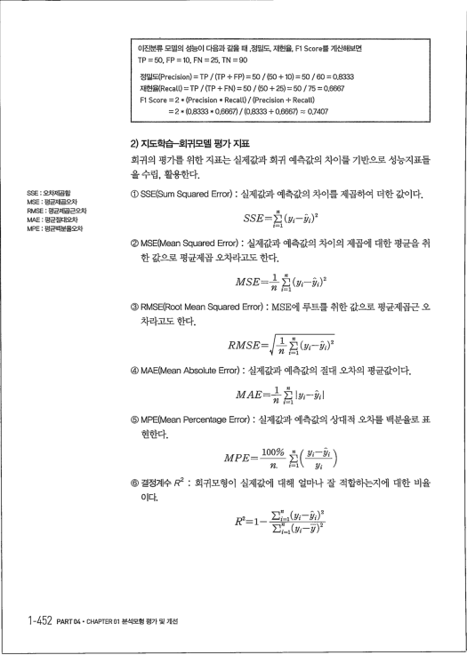
이진분류 모델의 성능이 다음과 같을 때 . 정밀도， 재현을, Fl Score를 계산해보면 TP = 50. FP = 10. FN = 25. TN = 90 정밀도(Precision) = TP / (TP + FP) = 50 /(50 + 10) = 50 / 60 = 0.8333 재현율(Reca11) = TP / (TP + FN) = 50 / (50 + 25) = 50 / 75 = 0.6667 Fl Score = 2 * (Precision * Recall) / (Precision + RecalL) = 2* (0.8333 * 0.6667) / (0.8333 + 0.6667) = 0.7407 2) 지도학습－회귀모델 평가 지표 회귀의 평가를 위한 지표는 실제값과 회귀 예측값의 차이를 기반으로 성능지표들

#### 을수립 , 활용한다．
①SSE(Sum Squared Error) : 실제값과 예측값의 차이를 제곱하여 더한 값이다． SSE : 오차제곱합 MSE : 평균제곱오차 RMSE : 평균제곱근오차 MAE = 펑균절대오차 MPE : 펑균백분율오차 SSE= : （跳－〃f)" i= ' ②MSE(Mean Squared Error) : 실제값과 예측값의 차이의 제곱에 대한 평균을 취 한 값으로 평균제곱 오차라고도 한다．

#### MSE=--fl i=i（跳－刃"
③RMSE(Root Mean Squared Error) : MSE에 루트를 취한 값으로 평균제곱근 오 차라고도 한다．

## RMSE=7증倉（7'－玭）"
④MAE(Mean Absolute Error) : 실제값과 예측값의 절대 오차의 평균값이다．

# MAE=뚫/1!ii-:iiI
#### ⑤MPE(Mean Percentage Error) : 실제값과 예측값의 상대적 오차를 백분율로 표
현한다．

## 挻PE= 100%
MPE= ( Yi-Y슥 n ' i=1 ` yi /

#### ⑥ 결정계수 /?2 : 회귀모형이 실제값에 대해 얼마나 잘 적합하는지에 대한 비율
이다． R2= 1

#### 2
2

>
, 7 ＾ 쾌 J

# 泳
泳 致 1 -452 PART 04. CHAPTER 01분석모형평가및개선

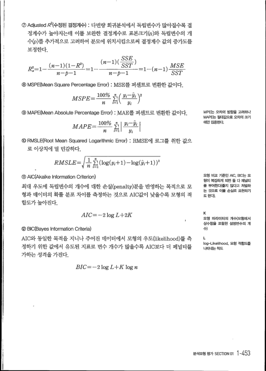
#### ⑦Adjusted R2（수정된 결정계수） : 다변량 회귀분석에서 독립변수가 많아질수록 결
정계수가 높아지는데 이를 보완한 결정계수로 표본크기伋그）와 독립변수의 개 수（p）를 추가적으로 고려하여 분모에 위치시킴으로써 결정계수 값의 증가도를 보정한다．

#### . 
. .  SSE.

## (i-,R2
#### MSE
R=

#### SS,T "
i SST

- 
- ⑧MSPE(Mean Square Percentage Error) : MSE를 퍼센트로 변환한 값이다．

# MSPE= ioo% 화 yi-.i )" 
n i=i ` yi /

#### ⑨MAPE(Mean Absolute Percentage Error) : MAE를 퍼센트로 변환한 값이다．
## 긔JAPE= 1009'
MAPE= o lyi 최 fl i=1 - 跳 ㅣ ⑩RMSLE(Root Mean Squared Logarithmic Error) : RMSE에 로그를 취한 값으 로 이상치에 덜 민감하다．

## RMSLE=/J_倉 (1og(y+i)-log(夕1+i))2
n ①：)AlC(Akaike Information Criterion) 최대 우도에 독립변수의 개수에 대한 손실（penalty）분을 반영하는 목적으로 모 형과 데이터의 확률 분포 차이를 측정하는 것으로 AIC값이 낮을수록 모형의 적 합도가높아진다．

#### AIC= -2 log L+2K
@)BIC(Bayes Information Criteria) AIC와 동일한 목적을 지니나 주어진 데이터에서 모형의 우도（likelihood）를 측 정하기 위한 값에서 유도된 지표로 변수 개수가 많을수록 AIC보다 더 페널티를 가하는 성격을 가진다．

#### BIC= -2 log L+K log n
> MPE는 오차의 방향을 고려하나 
MAPE는 절대값으로 오차의 크기

> 에만 집중흰빠．
> 모형 비교 기준인 /\IC. BIC는 모
> 형이 복잡하게 되면 둘 다 페널티 
를 부여한다《좋지 않다고 처벌하 는 것으로 이를 손실로 표현하기 도 힌다）.

> K
> 모형 파라미터의 개수（모형에서 
상수항을 포함한 설명변수의 개

> 수）
> L 
Iog-L嫩elihood . 모형 적합도를 나타내는척도

> 분석모형평가SECTION 01 1 -453
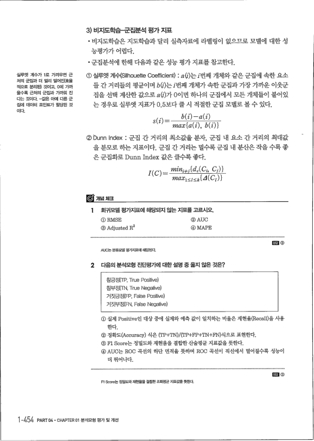
3) 비지도학습군집분석 평가 지표

- 비지도학습은 지도학습과 달리 실측자료에 라벨링이 없으므로 모델에 대한 성
능평가가 어렵다．

- 군집분석에 한해 다음과 같은 성능 평가 지표를 참고한다．
① 실루엣 계쉬Silhouette Coefficient) : 짜）는／번깨 개체와 같은 군집에 속한 요소 실루엣 계수가 1로 가까우면 근 처의 군집과 더 멀리 떨어진（효율 적으로 분리된） 것이고， 0에 가까 울수록 근처의 군집과 가까워 진 다는 것이다. －값은 아0ㅖ 다른 군 집에 데이터 포인트가 할당된 것 들 간 거리들의 평균이며 砬）는／번째 개쳬가 속한 군집과 가장 가까운 이웃군 집을 선택 계산한 값으로 ati）가 0이면 하나의 군집에서 모든 개쳬들이 붙어있

#### 는 경우로 실루엣 지표가 0.5보다 클 시 적절한 군집 모델로 볼 수 있다 .
이다． max{

#### ②Dunn Index : 군집 간 거리의 최소값을 분자 , 군집 내 요소 간 거리의 최대값 
을 분모로 하는 지표이다 . 군집 간 거리는 멀수록 군집 내 분산은 작을 수록 좋 은 군집화로 Dunn Index 값은 클수록 좋다 .

#### I/ /,,-  min쑤1{d ( C1, G)} 
" 盼7- max1<z드k { 4(C1)} 1 회귀모델 평가지표에 해당되지 않는 지표를 고르시오． ① RMSE ② AUC ③ Adjusted R2 ④ MAPE AUC는 분류모델 펑가ㅈ區에 해당된다． 2 다음의 분석모형 진단평가에 대한 설명 중 옳지 않은 것은？ 참긍정（TP. True Positive) 참부정（TN. True Negative) 거짓긍정（FP. False Positive) 거짓부정（FN, False Negative) ① 실제 Positive인 대상 중에 실제와 예측 값이 일치하는 비율은 재현율（Recall）을 사용 한다． ② 정확도（Accuracy) 식은 （中P+TN)/(TP+FP+TN+FN）식으로 표현한다． ③Fl Score는 정밀도와 재현율을 결합한 산술평균 지표값을 뜻한다． ④AUC는 ROC 곡선의 하단 면적을 뜻하며 RO(〕 곡선이 직선에서 멀어질수록 성능이 더 뛰어나다． Fl Score는 정밀도와재현율을 결합한 조화평균 지표값을 뜻한다． 1-454 PART 04- CHAPTER 01분석모형평가및개선

#### }
> 目래 ②
> 印
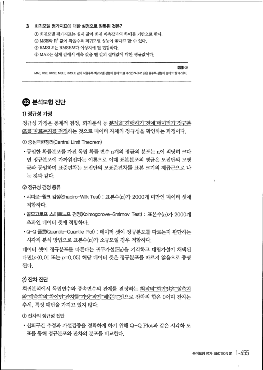
3 회귀모델 평가지표에 대한설명으로 잘못된 것은？ ① 회귀모델 평가지표는 실제 값과 회귀 예측값과의 차이를 기반으로 한다． ② MSE와R2 값이 작을수록 회귀모델 성능이 좋다고 할수 있다． ③ RMSLE는 RMSE보다 이상치에 덜 민감하다． @MAE는 실제 값에서 예측 값을 뺀 값의 절대값에 대한 평균값이다． MAE. MS티 RMSE. MSL云 RMSLㅌ 값이 직을수록 회귀모델 성능이 좋다고볼수 있으나 R2 값은 클수록 성능이 좋다고 할수 있다． 1) 정규성 가정 정규성 가정은통계적 검정 , 회귀분석 등쒼J음－친햇하기－천에ㅍ데의틔기二닝킁쑹 里를ㅍ띄르튼최貧戮정i하는 것으로 데이터 자쳬의 정규성을 확인하는 과정이다． ① 중심극한정리（Central Limit Theorem)

- 동일한 확률분포를 가진 독립 확률 변수 n개의 평균의 분포는 n이 적당히 크다
면 騙予분포에 가까워진다는 이론으로 이때 표본분포의 평균은 모집단의 모평 균과 동일하며 표준편차는 모집단의 모표준편차를 표본 크기의 제곱근으로 나 눈 것과 같다． ` ② 정규성 검정 종류

#### · 샤피로윌크 검정（Shapiro-Wilk Test) : 표본수（u）가 2000개 미만인 데이터 셋에
적합하다．

- 콜무ㅁ쿠ㅍ 스미르노프 검정（Kolmogorove-Smirnov Test) : 표본수여）가 2000개
초과인 데이터 셋에 적합하다．

#### ·Q-Q 플롯（Quantile-Quantile Plot) : 데이터 셋이 정규분포를 따르는지 판단하는
시각적 분석 방법으로 표본수4그）가 소규모일 경우 적함하다． 데이터 셋이 蔘子분포를 따른다는 귀무가설（Ho）을 기각하고 대립가설이 채택된 다면（p<0.0' 또는β=0.05) 해당 데이터 셋은 정규분포를 따르지 않음으로 증명 된다． 2) 잔차 진단 회귀분석에서 독립변수와 종속변수의 관계를 결정하는 혀점의긔쬐코은E［실측최 斅왜츰치의찌까이껏콰름끼징ㅍ촤쫴壅隨콤큇쑈1으로 잔차의 합은 0이며 잔차는 추세 , 특정 패턴을 가지고 있지 않다． ① 잔차의 정규성 진단

- 신뢰구간 추정과 가설검증을 정확하게 하기 위해 Q-(q Plot과 같은 시각화 도
표를 통해 정규분포와 잔차의 분포를 비교한다．

> j②
> 분석모형평가SECTION 01 1 -455
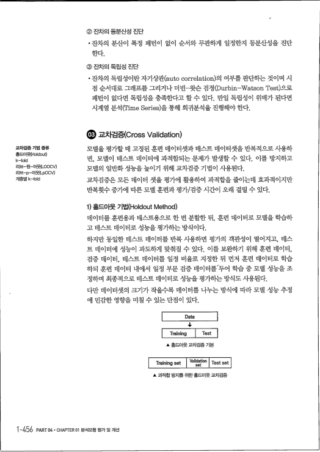
② 잔차의 등분산성 진단

- 잔차의 분산이 특정 패턴이 없이 순서와 무관하게 일정한지 등분산성을 진단
한다． ③ 잔차의 독립성 진단

- 잔차의 독립성이란 자기상관（auto correlation）의 여부를 판단하는 것이며 시
점 순서대로 그래프를 그리거나 더빈－왓슨 검정（Durbin-Watson Test）으로

#### 패턴이 없다면 독립성을 충족한다고 할 수 있다 . 만일 독립성이 위배가 된다면
시계열 분적（Time Series）을 통해 회귀분석을 진행해야 한다． .

교차검증《Cross Validation) 모델을 평가할 때 고정된 훈련 데이터셋과 데스트 데이터셋을 반복적으로 사용하 교차검증 기법 종류 홈드아웨 fold미」t) k-f히d 리브－원－아웃《LOOCV) 리브－p-OI :(LpOCV)

#### 면 , 모델이 테스트 데이터에 과적합되는 문제가 발생할 수 있다 . 이를 방지하고
모델의 일반화 성능을 높이기 위해 교차검증 기법이 사용된다． 교차검증은 모든 데이터 셋을 평가에 활용하여 과적합을 줄이는데 효과적이지만 계층별 k-fold 반복횟수 증가에 따른 모델 훈린과 평가／검증 시간이 오래 걸릴 수 있다． 1) 홀드아웃 기법（H이dout Method)

#### 데이터를 훈련용과 테스트용으로 한 번 분할한 뒤 , 훈련 데이터로 모델을 학습하
고 데스트 데이터로 성능을 평가하는 방식이다．

#### 하지만 동일한 테스트 데이터를 반복 사용하면 평가의 객관성이 떨어지고 , 데스
트 데이터에 성능이 과도하게 맞춰질 수 있다 . 이를 보완하기 위해 훈련 데이터，

#### 검증 데이터 , 테스트 데이터를 일정 비율로 지정한 뒤 먼저 훈련 데이터로 학습
하되 훈런 데이터 내에서 일정 부문 검증 데이터를‘투어 학습 중 모델 성능을 조 정하며 최종적으로 테스트 데이터로 성능을 평가하는 방식도 사용된다． 다만 데이터셋의 크기가 작을수록 데이터를 나누는 방식에 따라 모델 성능 추정

#### 에 민감한 영향을 미칠 수 있는 단점이 있다 .
# Data 
4, 1 Training Test ▲ 홀드아웃 교차검증 기본 Training set Vaildation set Test set ▲ 과적합 방지를 위한홀드아웃 교차검증 1-456 PART 04. CHAPTER 01 분석모형 평가및 개선


2) k-폴드 교차검증什-fold Cross Validation) k－폴드 교차검증 기법은 전쳬 데이터셋을 k개의 서브셋（폴드）으로 분리하여 그

#### 중에 k-i개를 훈련 데이터로 사용하고 i개의 서브셋은 검증 데이터로 사용한다．
테스트를 중복 없이 병행 진행한 후 각 반복의 평가 결과를 평균하여 모델의 최종 성능을 평가한다． → Accuracy1 → Accuracy2

- 
Accuracy3 → Accuracy4 → Accuracy드 ___그 Train set ..

Test set Ak꼴드 교차검증 예시 3) 리브－원ㅢ가웃 교차검증《Leave-One-Out Cross Validation, LOOCV) 리브－원－아웃 교차검증은 n개의 데이터에서 1개를 검증 데이터로 정하고 나머

#### 지 n-i개를 모두 학습에 사용하는 방법이다．
① 장점

#### · 매번 n-i개의 최대한 많은 데이터를 학습에 사용하므로 성능 편향이 적다．
- 적은 데이터에 대해서도 신뢰도 있는 성능을 보인다．
② 단점

- 데이터의 수만큼 반복해서 학습하므로 계산량이 매우 많다．
.i개의 데이터만으로 검증하기 때문에 검증 결과가 샘플에 따라 크게 달라진다．

#### 4) 리브－p－아읏 교차검증《Leave-p-Out Cross Validation)
리브－p－아웃은 리브－원－아웃 교자검증（LOOCV）을 일반화한 방식으로 , n개의

#### 데이터에서 p개를 검증 데이터로 정하고 나머지 n-p개를 모두 학습에 사용하는
방법이다．

#### 5) 계층별 k꼴드（Stratified k-fold) 교차검증
계층별 k－폴드는 불균형한 분포를 가진 데이터 집합을 위한 k－폴드 교차검증 방식이다 . 데이터 셋에서 특정 종류의 데이터의 비율이 많을 경우 각 폴드의 데 이터를 추출할 때 이 비율을 유지하면서 추출한다．

- 예를 들어 데이터셋에서 남자와 여자의 비율이 8:2인 경우 임의로 폴드의 데이
터를 추출하면 , 특정 폴드에는 남자 데이터만 과도하게 편중될 위험이 높아진

#### 다 . 이런 경우 각 폴드의 데이터가 남녀 비율을 8:2로 유지하도록 추출함으로
써 전체 데이터와 유사한 분포를 갖도록 한다．

> k－폴드 교차검중은 홀드아웃 기법 
보다 많은 계산 비용을 필요로 하 나. 더 안정적이다．

> p가 커질수록 연산량이 급격히 증
> 가할 수 있다．
> 분석모형평가SECTION 01 1 -457
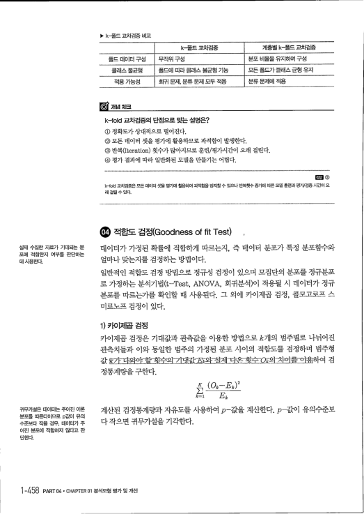
> k폴드 고i톼검증 비교
k－폴드 교차검증 계층별 (－폴드교차검증 폴드 데이터 구성 무작위구성 분포 비율을 유지하며 구성 클래스불균형 폴드에 따라 클래스 불균형 가능 모든 폴드가 클래스 균형 유지 적용 가능성 회귀 문제 . 분류 문제 모두 적용 분류 문제에 瑙 k-fold 교차검증의 단점으로 맞는 설명은？ ① 정확도가 상대적으로 떨어진다． ② 모든 데이터 셋을 평가에 활용하므로 과적함이 발생한다． ③ 반복（Iteration) 횟수가 많아지므로 훈련／평가시간이 오래 걸린다． ④ 평가 결과에 따라 일반화된 모델을 만들기는 어렵다． k-fold 교차검중은 모든 데이터 셋을 펑가에 활용하여 과적합을 방지할수 있으나 반복횟수 증가에 따른 모델 훈련과 평가／검증 시간이 오 래 걸릴 수 있다． .

적합도 검정（Goodness of fit Test)

#### 데이터가 가정된 확률에 적합하게 따르는지 , 즉 데이터 분포가 특정 분포함수와
실제 수집한 자료가 기대되는 분 포에 적합한지 여부를 판단하는 얼마나 맞는지를 검정하는 방법이다． 데사용한다． 일반적인 적합도 검정 방법으로 정규성 검정이 있으며 모집단의 분포를 정규분포

#### 로 가정하는 분석기법（t-Test, ANOVA , 회귀분석）이 적용될 시 데이터가 蔘子
#### 분포를 따르는가를 확인할 때 사용된다 . 그 외에 카이제곱 검정 , 콜I
7무3I A..

#### 미ㄹ토ㅍ 검정이 있다．
1) 카이제곱 검정 카이제곱 검정은 기대값과 관측값을 이용한 방법으로 k개의 범주별로 나뉘어진 관측치들과 이와 동일한 범주의 가정된 분포 사이의 적합도를 검정하며 범주형 값盛水다와ㅇ논할翌수：의－기댓값1；琵와”셀제촤손翌仝旦屎의夕凹를ㅌ뾔瓮하여 검 정통계량을 구한다． x 刀 臟 퍄 走

### ㅡ
E o

#### 계산된 검정통계량과 자유도를 사용하여 β－값을 계산한다 . β－값이 유의수준보
귀무가설은 데이터는 주어진 이론 분포를 따른다이므로 p값이 유의 다 작으면 귀무가설을 기각한다． 수준보다 작을 경우. 데이터가 주 어진 분포에 적합하지 않다고 판 단흔따． 1 -458 PART 04· CHAPTER 01분석모형평가및개선

> D ③
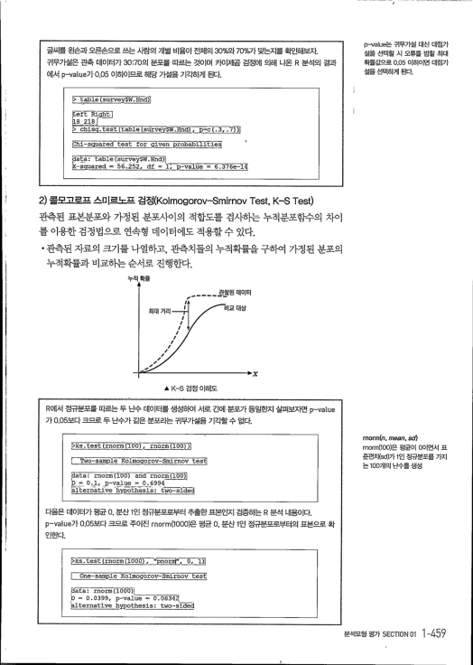
글씨를 왼손과 오른손으로 쓰는 사람의 개별 비율이 전체의 30%와 70％가 맞는지를 확인해보자． 귀무가설은 관측 데이터가 30:70의 분포를 따르는 것이며 카이저陪 검정에 의해 나온 R 분석의 결과 에서 p-value가 0.05 이하이므로 해당 가설을 기각하게 된다． b table (surve 》l Le눗珊r조f－∼－〕

9. 8 218 - 
0. ci仕sq.test (taSI石礪珏rvey$w.Hnd) ,- p=c(.3, .7 긔
巨i노－5quared test, for교ver1 probabf獅汪졀죠 ' data: ta호e (survey$W.Hnd끄 X-squared 緇 56.252, di . 1;_p- value 볍 6.376e-14

#### 2）콜c'-ri ㅍ 스미르노프 검정α（히mogorov-Smirnov Test, K-S Test)
관측된 표본분포와 가정된 분포사이의 적합도를 검사하는 누적분포함수의 차이 를 이용한 검정법으로 연속형 데이터에도 적용할 수 있다．

- 관측된 자료의 크기를 나열하고 , 관측치들의 누적확률을 구하여 가정된 분포의
누적확률과 비교하는 순서로 진행한다． 누적 확률 관찰된 데이터 / 비교 대상 ' "7181- / / / / / / / A K-S 검정 이해도 R에서 정규분포를 따르는 두 난수 데이터를 생성하여 서로 간에 분포가동일한지 살펴보따연 p-value 가 0.05보다 크므로 두 난수가 같은 분포라는 귀무가설을 기각할 수 없다． e盤(rnorm觸OO) , rnorm(l00) )i I Tvo-5淅｀ ，巨工rKolmogorov-Smirnov test

```python
data: rnorm(T0y－石nd rnorm(1죠0i 
0 = 0.1, n-value 鷺 0.6994 
alternative hypothesis: two-sided
```
다뿐 데이터가 펑균 0 , 분산 1인 정규분포로부터 추출한 표본인지 검증하는 R 분석 내용이다． p-value가 0.05보다 크므로 주어진 「norm(1000）은 평균 0 . 분산 1인 정규분포로부터의 표본으로 확 인한다． 'ks. test (rnorm陋d.T 그炡야펴뜨〔ㅍ丕［ㅍ l One-sample Kolmogorov＝眄矗 .irnov test

```python
aeta: rnorm(10d0이 
V = U .Ui9늬, P-value 졉＝ U.U8tMZ 
alternative hyp으thesis: two-s1珏a
```
> p-value는 귀무가설 대신 대립가 
설을 선택할 시 오류를 범할 최대 확률값으로 0.05 이하이면 대립가 설을 선택하게 된다．

> -
> rnorm(n, mean, Sd) 
rnorm(100）은 평균이 0이면서 표 준편차（Sd）가 1인 騙구분포를 가지 는 100개의 난수를생성

> 분석모형평가SECTION 01 1 -459
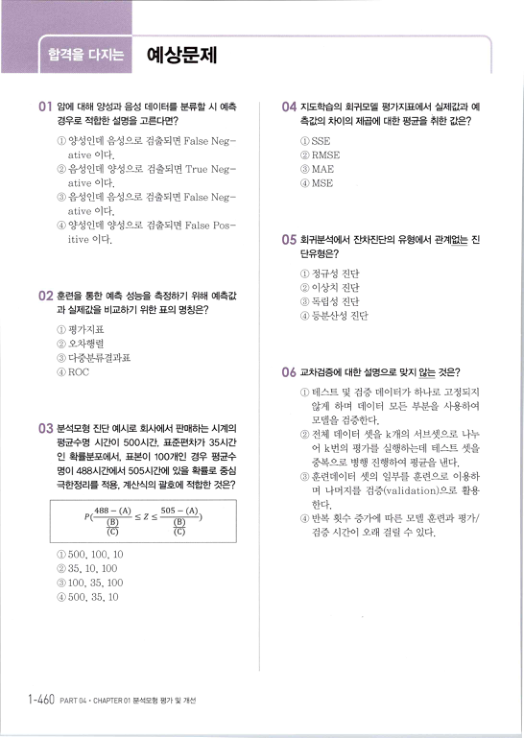
## 예상문제
0】 암에 대해 양성과 음성 데이터를 분류할 시 예측 04 지도학습의 회귀모델 평가지표에서 실제값과 예 경우로 적합한 설명을 고른다면？ 측값의 차이의 제곱에 대한 평균을 취한 값은？ ① 양성인데 음성으로 검출되면 False Neg- ative 이다． ② 음정인데 양성으로 검출되면 True Neg- ative 이다． ③ 음정인데 음성으로 검출되면 False Neg- ative 이다． ④ 양성인데 양성으로 검출되면 False Pos- itive 이다． ①SSE ②RMSE ③MAE ④MSE 05 회귀분석에서 진빠진단의 유형에서 관계없는 진 단유형은？ ① 정규성 진단 ② 이상치 진단 ③독립성 진단 ④ 등분산성 진단 02 훈련을 통한 예측 성능을 측정하기 위해 예측값 과 실제값을 비교하기 위한 표의 명칭은？ ① 평가지표 ② 오차행렬 ③ 다중분류결과표 ④ROC 06 교차검증에 대한 설명으로 맞지 않는 것은？ ① 테스트 및 검증 데이터가 하나로 고정되지 않게 하며 데이터 모든 부분을 사용하여 모델을 검증한다． ② 전체 데이터 셋을 k개의 서브셋으로 나누 03 분석모형 진단 예시로 회사에서 판매하는 시계의 평균수명 시간이 500시간 , 표준편차가 35시간 인 확률분포에서 , 표본이 100개인 경우 평균수 어 k번의 평가를 실행하는데 테스트 셋을 중복으로 병행 진행하여 평균을 낸다． ③훈련데이터 셋의 일부를 훈련으로 이용하 명이 488시긴나게서 505시간에 있을 확률로 중심 극한정리를 적용 , 계산식의 괄호에 적합한 것은？ 며 나머지를 검증（validation）으로 활용 한다． ④ 반복 횟수 증가에 따른 모델 훈련과 평가／ 검증 시간이 오래 걸릴 수 있다． 488 - (A)

- 
505 - (A) 드z드 〃（ (B ) (C) (C) ①500, 100, 10 ②35, 10, 100 ③100, 35, 100 @500, 35, 10 ㅏ 60 PART04 ' CHAPTER 01 분석모형 평가및 개선

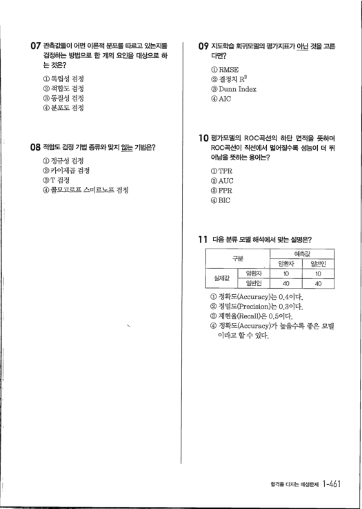
07 관측굡慢이 어떤 이론적 분포를 따르고 있는지를 0' 지도학습 회귀모델의 평가지표가 아닌 것을 고른 검정하는 방법으로 한 개의 요인을 대상으로 하 는 것은？ 다면？ ① RMSE ② 결정치 R2 ③Dunn Index ④AIC ①독립성 검정 ② 적합도 검정 ③동질성 검정 ④ 분포도 검정 10 평가모델의 ROC곡선의 하단 면적을 뜻하며 ROC곡선이 직선에서 멀어질수록 성능이 더 뛰 어남을 뜻하는 용어는？ 08 적합도 검정 기법 騙트와 맞지 않는 기법은？ ① 정규성 김정 ② 카이제곱 검정 ③T검정 ④콜무 고무ㅍ ㅅ미르노프 검정 ①TPR ②AUC ③FPR @ BIC 11 다음분류모델해석에서 맞는설멍은？ 구분 예측값 실제값 암횐자 10 10 ① 정확도（Accuracy）는 0.4이다． ② 정밀도（Precision）는 0.3이다． ③ 재현율（Recall）은 0.5이다． ④ 정확도（Accuracy）가 높을수록 좋은 모델 이라고 할 수 있다． ,,

> 암환자 
일반인

> 일빈峰：그 
40 40

> 합격을다지는예상문제 1 -461
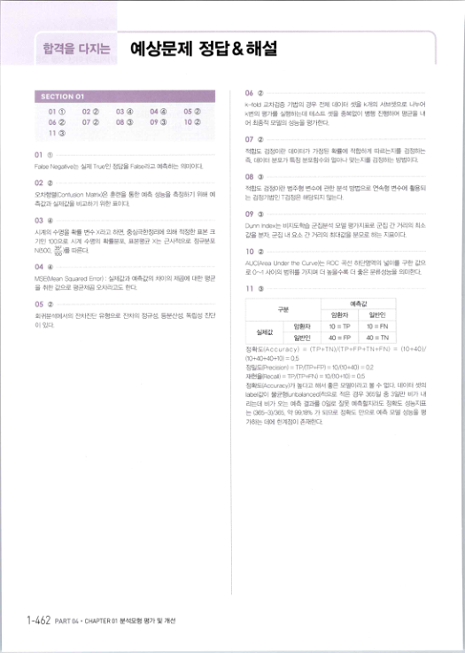
## 예상문제 정답＆해설
0612 SECTION 01 k-told 교차검증 기법의 경우 전체 데이터 셋을 k개의 서브셋으로 나누어 08 〈亘：) 04 c) 09 ③ olaD 05 ② 03 ④ 02121 k번의 평가를 실행하는데 테스트 셋을 중복없이 병행 진행하여 평균을 내 07 ② 1012 어 최종적 모델의 성능을 평가한다． 06121 11 ③ 0712 적합도 검정이란 데이터가 가정된 확률에 적합하게 따르는자를 검정하는 즉. 데이터 분포가 특정 분포함수와 얼마나 맞는지를 검정하는 방법이다． 01 1D False Negative는 실제 True인 정답을 False라고 예측하는 의미이다． 0812 0212 적합도 검정이란 범주형 변수에 관한 분석 방법으로 연속형 변수께 활용되 는 검정기법인 ㅜ검정은 해당되지 않는다． 드：톼행렬（Confusion Matrix）은 훈련을 통한 예측 성능을 측정하기 위해 예 측값과 실제값을 비교하기 위한 표이다． 09 《츨：l …… ∼……………………………………………∼－∼－……… 03 ④ ……………………………… …… Dunn Inde×는 비지도학습 군집분석 모델 평가지표로 군집 간 거리의 최소 시계의 수명을 확률 변수 ×라고 하면． 중삼극한정리0ㅔ 의해 적정한 표본 크 값을 분자 군집 내 요소 간 거리의 최대값을 분모로 하는 지표이다． 기인 100으로 시계 수명의 확률분포， 표본평균 ×는 근사적으로 정규분포 N(500, 끎를 따른다． 1012 AUC(Area Under the Curve）는 ROC 곡선 하단영역의 넓이를 구한 값으 로 0"A 사이의 범위를 가지며 더 높을수록 더 좋은 분류성능을 의미한다． 04 ④ …… … … …………… ………………………0 MSE(Mean Squared Error) : 실제값과 예측값의 차이의 처급에 대한 평균 을 취한 값으로 평균제곱 됴：톼라고도 한다． 11 ③ 구분 예측값 0512 회귀분석에서의 진따진단 유형으로 잔차의 정규성 . 등분산성 , 독립성 진단 이 있다． 실제값 암환자 10 = TP 10 = FN 일반인 40 = FP 40 = TN 정확도(Accu soy) = (TP+TN)/(TP+FP+TN+FN) = (10+40)!

(10+40+40+10) = 0.5 정밀(Precision) = TP/(TP+FP) = 101(10+40) = 0.2 H현율(Recall) = TP/0P+FN) = 101(10+10) = 0.5 정확도邑ccuracy）가 높다고 해서 좋은 모델이라고 볼 수 없다． 데이터 셋의 label값이 불균형（unbalanced）적으로 적은 경우 365일 중 3일만 비가 L서 리는데 비가 오는 예측 결과를 0일로 잘옷 예측할지라도 정확도 성능지표 는 (365-3)1365. 약 99.18% 가 되므로 정확도 만으로 예측 모델 성능을 평 가하는 데에 한계점이 존재한다． 1 -1.62 PART 04· CHAPTER 01 분석모형 평가및 개선

> 암환자 
일반인


# SECTION 02
# 분석모형 개선
출제빈도 @) 빈출 태그 과적합 방지 · 매개변수 최적화 · 초매개변수 · 성능평가지표 반복학습 ［· .

.

#### ㅇ 과대적합 방지
#### 훈련 시 높은 성능을 보이지만 , 테스트 데이터에서 낮은 성능을 보이는 과대적합 
．뀀 기적의 ㄲp 을 방지하고 , 일반화된 모델을 생성하기 위해 다음과 같은 방향 설정이 필요하다． 1) 모델 복잡도 조절 훈련 데이터를 더 많이 확보할 수 없다면 , 蔘予화＜L1/L2) , 드롭아웃 등의 기법을 활용해 모델이 흔련 데이터에 과도하게 적합되지 않도록 한다． ① 하이퍼파라미터 설정

- 학습 중 지속적으로 바뀌는 가중치와 달리 , 학습률이나 각 층의 뉴런 수 같은
하이퍼파라미터는 모델 구조와 학습 전략을 결정하며 , 그 값이 클수록 복잡도 나 과대적합 위험이 높아질 수 있으므로 신중하게 설정해야 한다． ② 드롭아웃《Dropout)

- 신경망 모델을 학습할 때 , 은닉층（중간층）의 일부 뉴런을 임의로 꺼서 사용하지
않고 학습하는 방법이다 . 이렇게 하면 모델이 특정 뉴런에 의존하지 않고 , 여러 뉴런을 골고루 사용하도록 유도된다．

- 훈련할 때는 일부 뉴런을 꺼서 학습하지만 , 테스트할 때는 모든 뉴런을 사용하
되 훈련 중 껐던 비율만큼 출력을 줄여서（곱해줘서） 일관성을 유지한다．

- 드롭아웃은 과대적합 방지에 효과적이지만 , 뉴런 수가 적을 경우 학습 속도가
느려질 수 있다． 2) .隱치 규제

#### 학습 과정에서 큰 가중치에 패널티를 부과해 모델이 과도한 복잡도를 갖지 않도 
록 제한한다 . 이와 같은 予제 방식에는 Li 규제（가중치 절댓값의 합）와 L2 규제 （가중치 제곱합）가 있으며 , 이를 통해 모델의 일반화 성능을 높일 수 있다． ① L2 규제

> 편향겯산 트레이드 오프
> 과소적합을 피하려면 모델이
> 충분히 복집해야 하고， 과대
> 적합을 피하려면 너무 복잡
> 하지 않아야 한다．
> 따라서 훈련 데이터에 잘 맞
> 추면서도 새로운 데이터에도 
잘 일반화할 수 있도록 , 모델

> 의 복잡도를 조절하여 편향 
과 분산 사이의 균형을 맞추 는 것이 중요하다．

> 과소적합 시 편향이 큼
> 과대적합 시 붕난이 큼
> 과적합을 방지하기 위해 회귀계수 
w가 커지지 않도록 ㅎ怜뜨 방법이다．

> 분석모형 개선 SECTION 02 1 -463
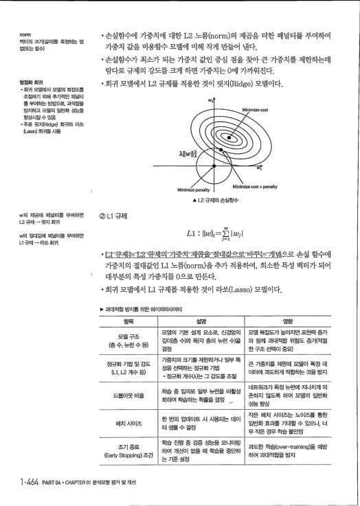
norm 벡터의 크기（길이）를 측정하는 방 법（또는 함수）

- 손실함수에 가중치에 대한 L2 노름（norm）의 제곱을 더한 페널티를 부여하여
가중치 값을 비용함수 모델에 비해 작게 만들어 낸다．

- 손실항수가 최소가 되는 가중치 값인 중심 점을 찾아 큰 가중치를 제한하는데
람다로 규제의 강도를 크게 하면 가중치는 0에 ' 가까워진다． 벌점화 회귀

- 홰 모델에서 모델의 복잡도를 
조절하기 위해 추가적인 패널티 를 부여하는 븐搢으로， 과적합을 방지하고 모델의 일반화 츤浩을 향상시킬 수 았음

- 주로 릿지（Ridge) 회귀와 라쏘 
(Lasso) 회귀를사용

- 회귀 모델에서 L2 규제를 적용한 것이 릿지（Ridge> 모델이다．
Minimize penalty Minimize cost+ penalty ▲ 〔2 구제와손실함수 ② Li 규제 w의 제곱에 페널티를 부여하면 L2 규제 → 릿지 회귀

## nz 
Li : IIwII1=珊WI' w의 절대馝게 페널티를 부여하면 L拓구제 → 라쏘 회귀

- E1큐제는－仁2하제의－가즛치－제몹貪愛대갔으르비珊눗긔념l으로 손실 함수에
#### 가중치의 절대값인 Li 노름（norm）을 추가 적용하여 , 희소한 특정 벡터가 되어
대부분의 특정 가중치를 0으로 만든다．

#### · 회귀 모델에서 Li 규제를 적용한 것이 라쏘（Lasso) 모델이다．
卜 과대적합 방지를 위한 하이퍼파라미터 항목 설명 영향 모델의 기본 설계 요소뢰 신경망의 모델구조 깊이（층 수）와 폭《각 층의 뉴런 수）을 （층 수, 뉴런 수 등） 결정 가중치의 크기를 제한하거나 일부 특 장규화 기법 및 강도 (Li, L2 계수 등） 성을 선택하는 장규화 기법

- 장규화 계＜窈）는 그 강도를 조절
드롭0淏 비율 ．학습 중 임의로 일부 뉴런을 비활성 화하여학습하는확률을결정 → 배치 사이즈 한 번의 업데이트 시 사용되는 데이 터 소搢 수 결정 학습 진행 중 검증 성능을 모니터링 조기종료 하여 개선이 없을 때 학습을 중단하 는 기준 설정 (Early Stopping) 조건 ㅑ 64 PART04· CHAPTER 01분석모형평가및개선

> 모델 복잡도가 높아지면 표현력 증가 
와 함께 과대적합 위험도 증가（적절

> 한 구조 선택이 중요）
> 큰 가중치를 제한해 모델이 특정 데
> 이터에 과도하게 적합하는 것을 방지
> 네트워크가 특정 뉴런에 지나치게 으I
> 존하지 않도록 하여 모델의 일반화
> 셩능 향상
> 작은 배치 사이즈는 노이즈를 통한
> 일반화 효과를 기대할 수 있으나. 너 
무 작은 경우 학습 불안정

> 과도한 힉滔(over-training）을 예방
> 하여 과대적합을 방지
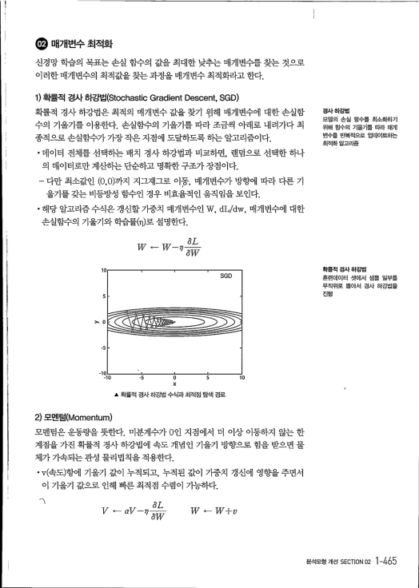
.

매개변수 최적화 신경망 학습의 목표는 손실 함수의 값을 최대한 낮추는 매개변수를 찾는 것으로 이러한 매개변수의 최적값을 찾는 과정을 매개변수 최적화라고 한다． 1) 확률적 경사 하강법（Stochastic Gradient Descent, SGD) 확률적 경사 하강법은 최적의 매개변수 값을 찾기 워해 매개변수에 대한 손실함

#### 수의 기울기를 이용한다 . 손실함수의 기울기를 따라 조금씩 아래로 내려가다 최
종적으로 손실함수가 가장 작은 지점에 도달하도록 하는 알고리즘이다．

#### · 데이터 전쳬를 선택하는 배치 경사 하강법과 비교하면 , 랜덤으로 선택한 하나
의 데이터로만 계산하는 단순하고 명확한 구조가 장점이다．

- 다만 최소값인 (0,0）까지 지그재그로 이동， 매개변수가 방향에 따라 다른 기
#### 울기를 갖는 비등방성 함수인 경우 비효율적인 움직임을 보인다 .
#### · 해당 알고리즘수식은 갱신할 가중치 매개변수인 ￦ , dL/dw , 매개변수에 대한
손실함수의 기울기와 학습률（끄）로 설명한다．

#### aI, 
W - W- ?1 0w 10 SGD 1。

－노 ㅎ 뺨 0 5 x 10 ▲ 확률적 경사 하강법 수식과 최적점 탐색 경로 2) 모멘텀（Momentum)

#### 모멘텀은 운동량을 뜻한다 . 미분계수가 0인 지점에서 더 이상 이동하지 않는 한
계점을 가진 확률적 경사 하강법에 속도 개념인 기울기 방향으로 힘을 받으면 물 쳬가 가속되는 관성 물리법칙을 적용한다．

#### · v（속도）항에 기울기 값이 누적되고 , 누적된 값이 가중치 갱신에 영향을 주면서 
이 기울기 값으로 인해 빠른 최적점 수렴이 가능하다．

#### W+v
#### V→
> 경사하강법
> 모델의 손실 함수를 최소화하기 
위해 함수의 기울기를 띠타 매개 변수를 반복적으로 업데이트하는

> 최적화 알고리즘
> 확률적 경사 하강법
> 훈련데이터 셋에서 샘플 일부를 
무작위로 뽑아서 경사 하강법을 진행

> 분석모형개선SECTION 02 ㅑ 65
0

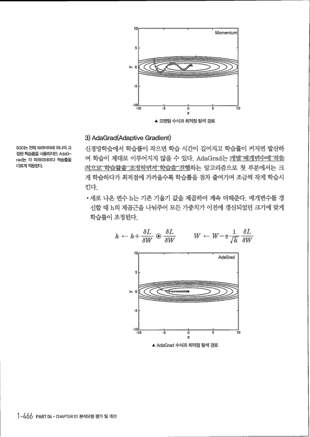
10 Momentum

> 0
-10 -10 -5 0 5 x ▲ 모멘텀 수식과 최적점 탐색 경로 3) AdaGrad(Adaptive Gradient) 신경망학습에서 학습률이 작으면 학습 시간이 길어지고 학습률이 커지면 발산하 SGD는 전체 파래ㅌ［에 하나의 고 정된 힉습률을사용하지만, AdaG- rad는 각 파라미터마다 학습률을

#### 여 학습이 제대로 이루어지지 않을 수 있다 . AdaGrad는 매聳mㅐ개벼수에－적＝읏즐
다르게 적용한다． 첨으로떽 습결鴦－조켱하며저－힉즙숄－히핵하는 알고리즘으로 첫 부분에서는 크 게 학습하다가 최적점에 가까울수록 학습 률 흘 점차 줄여가며 조금찍 작게 학습시 킨다．

- 새로 나온 변수 h는 기존 기울기 값을 제곱하여 계속 더해준다 . 매개변수를 갱
신할 때 h의 제 곱 근 을 나눠주어 모든 가중치기＝ 이전에 갱신되었던 크기에 맞게

#### - 
- 
az, → az』 Ii 눼 - Ii - ＝ㅉ＝ (& ===7 （가4/ （가1/

#### 1 
L w < - W-－〃芬급＝－ㅋ＝주주7 γ／z ｛가／l/ 10 ［.

-5 A AdaGrad 수식과 최적점 탐색 경로 1-4桶 PART 04* CHAPTER 01분석모형평가및개선

> 10
> AdaGrad
> 5
> 10
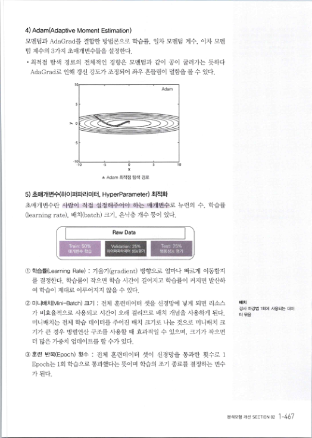
4) Adam(Adaptive Moment Estimation) 모멘텀과 AdaGrad를 결합한 방법론으로 학습률 , 일차 모멘텀 계수 , 이차 모멘 텀 계수의 3가지 초매개변수들을 설정한다．

- 최적점 탐색 경로의 전쳬적인 경향은 모멘텀과 같이 공이 굴러가는 듯하다
AdaGrad로 인해 갱신 강도가 조정되어 좌우 흔들림이 덜함을 볼 수 있다． 5 10 -s o x A Adam 최적점 탐색 경로 5) 초매개변수（하이퍼파라미터 , HyperParameter) 최적화 초매개변수란 사람이 직접 설정해주어야 하는 매개변수로 뉴런의 수 , 학습률 (learning rate) , 배치（batch) 크기 , 은닉층 개수 등이 있다． I Raw Data Validation: 25% 하이퍼파라미터 성능평가 Test: 75% 범용성능 평가 Train: 50% 애개변수 학습

#### ① 학습률(Learning Rate) : 기울기（gradient) 방향으로 얼마나 빠르게 이동할지 
를 결정한다 . 학습률이 작으면 학습 시간이 길어지고 학습률이 커지면 발산하 여 학습이 제대로 이루어지지 않을 수 있다．

#### ② 미니배치（Mini-Batch) 크기 : 전쳬 훈련데이터 셋을 신경망에 넣게 되면 리소스 
가 비효율적으로 사용되고 시간이 오래 걸리므로 배치 개념을 사용하게 된다． 미니배치는 전쳬 학습 데이터를 주어진 배치 크기로 나눈 것으로 미니배치 크 기가 큰 경우 병렬연산 구조를 사용할 때 효과적일 수 있으며 , 크기가 작으면 더 많은 가중치 업데이트를 할 수가 있다 .

#### ③훈련 반복（Epoch) 횟수 : 전쳬 훈련데이터 셋이 신경망을 통과한 횟수로 1
Epoch는 1회 학습으로 통과했다는 뜻이며 학습의 조기 종료를 결정하는 변수 가 된다．

> 배치
> 경사 하강법 1회에 사용되는 데이 
터 묶음

> 분석모형 개선 SECTION 02 1 -467
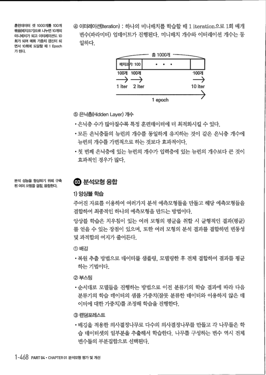
#### ④ 이터레이션价eration) : 하나의 미니배치를 학습할 때 1 iteration으로 1회 매개
훈런데이터 셋 1000개를 100개 묶믐《배ㅊ匡기）으로 나누연 10개의 변수（파라미터） 업데이트가 진행된다 . 미니배치 개수와 이터레이션 개수는 동 미내캐치가 되고 이터러I이션도 10 회가 되며 매회 가중치 갱신이 되 면서 10회에 도달할 때 1 Epoch 가 된다． 일하다． 총 1000개 배치크7 I: 100 ●

- - 
100개 100개

- 
--- 1 iter ' 2 iter 1 epoch ⑤ 은닉층《Hidden Layer) 개수

- 은닉층 수가 많아질수록 특정 훈런데이터에 더 최적화시킬 수 있다．
- 모든 은닉층들의 뉴런의 개수를 동일하게 유지하는 것이 같은 은닉층 개수에
뉴런의 개수를 가변적으로 하는 것보다 효과적이다．

- 첫 번째 은닉층에 있는 뉴런의 개수가 입력층에 있는 뉴런의 개수보다 큰 것이
효과적인 경우가 많다．

#### .분석모형
분석 성능을 향상하기 위해 구축 된 여러 모형을 결합. 융합한다．

#### 繃
1) 앙상블 학습 주어진 자료를 이용하여 여러가지 분적 예측모형들을 만들고 해당 예측모형들을 결합하여 최종적인 하나의 예측모형을 만드는 방법이다．

#### 앙상블 학습은 치우침이 있는 여러 모형의 평균을 취할 시 균형적인 결과（평균） 
를 얻을 수 있는 장점이 있으며 , 또힌r 여러 모형의 분석 결과를 결합하면 변동성 및 과적합의 여지가 줄어든다． ① 배깅

#### · 복원 추출 방법으로 데이터를 샘플링 , 모델링한 후 전쳬 결합하여 결과를 평균
하는 기법이다． ② 부스팅

- 순서대로 모델들을 진행하는 방법으로 이전 분류기의 학습 결과에 따라 다음
분류기의 학습 데이터의 샘플 가중치（잘못 분류한 데이터와 이용하지 않은 데 이터에 대한 가중치）를 조정해 학습을 진행한다． (3) 랜덤포레스트

- 배깅을 적용한 의사결정나무로 다수의 의사결정나무를 만들고 각 나무들은 학
습 데이터셋의 일부분을 추출해서 학습한다 . 나무를 구성하는 변수 역시 전쳬 변수들의 부분집합으로 선택된다． 1 -468 PART 04* CHAPTER 01분석모형평가및개선

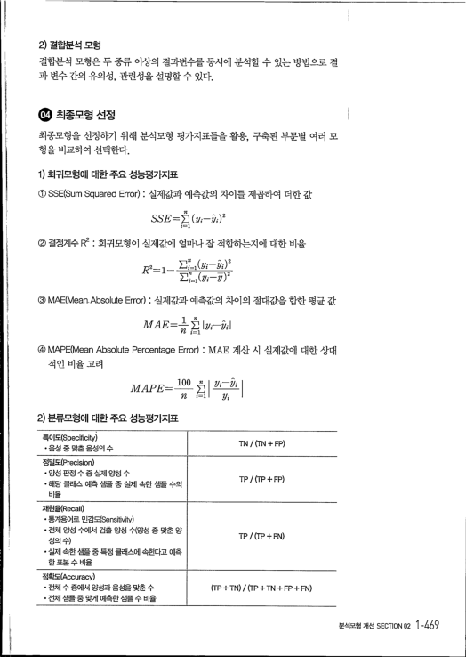
2) 결합분석 모형

#### 결합분석 모형은 두 종류 이상의 결과변수를 동시에 분석할 수 있는 방법으로 결 
과 변수 간의 유의성 , 관린성을 설명할 수 있다． .

최종모형 선정

#### 최종모형을 선정하기 위해 분석모형 평가지표들을 활용 , 구축된 부문별 여러 모 
형을 비교하여 선택한다． 1) 회귀모형에 대한 주요 성능평가지표 ①SSE(Sum Squared Error) : 실제값과 예측값의 차이를 제곱하여 더한 값

#### SSE=
J (yi-.,i)2

#### ② 결정계수 R2 : 회귀모형이 실제값에 얼마나 잘 적합하는지에 대한 비율
#### R2=1 긷； =1(跳_찬）. 2 
Z; =1(yi- )2 ③MAE(Meari. Absolute Error) : 실제값과 예측값의 차이의 절대값을 합한 평균 값

### MAE=뚫1I跳－刃
④MAPE(Mean Absolute Percentage Error) : MAE 계산 시 실제값에 대한 상대 적인 비율 고려

## MAPE=끄뜨 회 跳－최
RI i=1I 跳 』 2) 분류모형에 대한 주요 성능평가지표 특이도（Specificity)

- 음셩 중 맞춘 음성의 수 
TN / (TN + FP) 정밀도（Precision)

- 양성 판정 수 중 실제 양성 수 
- 해당 클래스 예측 수搢 중 실제 속흔艸搢 수의 
비율 TP I (TP + FP) 재현율《Recall)

- 통계용어로 민감도（Sensitivity) 
- 전체 양성 수에서 검출 양성 쉬양성 중 맞춘 양
TP / (IP + FN) 성의 수）

- 실제 속한 샘플 중 특정 클래스에 속한다고 예측 
한 표본 수 비율 정확도（Accuracy)

- 전체 수 중에서 양성과 음성을 맞춘 수 
- 전체 겯搢 중 맞게 예측한 츤搢 수 비율
(TP + TN) / (TP + TN + FP + FN)

> 분석모형개선SECTION02 1-4胛
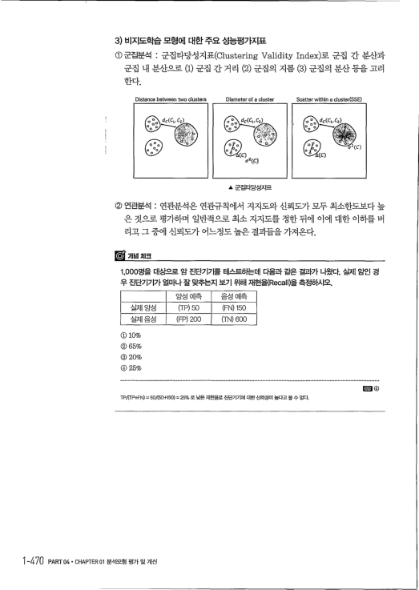
3) 비지도학습 모형에 대한 주요 성능평가지표

#### ① 군집분석 : 군집타당성지표（Clustering Validity Index）로 군집 간 분산과
군집 내 분산으로 (1) 군집 간 거리 (2) 군집의 지름 (3) 군집의 분산 등을 고려 한다． Distance between two clusters Diameter of a cluster

#### ㅣ
▲ 군집타당성지표

#### ② 연관분석 : 연관분석은 연관규칙에서 지지도와 신뢰도가 모두 최소한도보다 높 
은 것으로 평가하며 일반적으로 최소 지지도를 정한 뒤에 이에 대한 이하를 버 리고 그 중에 신뢰도가 어느정도 높은 결과들을 가져온다．

1. 000명을 대상으로 암 진단기기를 테스트하는데 다음과 같은 결과가 나왔다. 실제 암인 경 
우 진단기기가 얼마나 잘 맞추는지 보기 위해 재헌율《Rec헤）을 측정하시오． 양성 예측 음성 예측 실제 양성 (TP) 50 (FN) 150 실제 음성 (FP) 200 (TN) 600 @ 10% @)65% @)20% @ 25% TP/(TP+FN) = 501(50+150) = 25% 로 낮은재현율로 진단기기에 대한신뢰성이 높다고볼 수 없다． 1-470 PART04. CHAPTER01분석모형평가및개선

> Scatter within a cluster(SSE)
> E래 ④
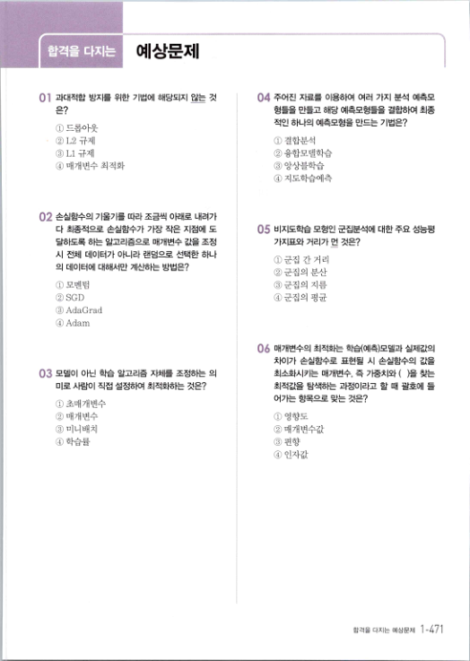
## 합격을 다지는 : 예상문제
04 주어진 자료를 이용하여 여러 가지 분석 예측모 0】 과대적합 방지를 위한 기법에 해당되지 않는 것 형들을 만들고 해당 예측모형들을 결합하여 최종 은？ 적인 하나의 예측모형을 만드는 기법은？ ①드롭아웃 ②L2 규제 ③ Li 규제 ④ 매개변수 최적화 ① 결합분석 ② 융합모델학습 ③ 앙상블학습 ④ 지도학습예측 02 손실함수의 기울기를 따라 조금씩 아래로 내려가 다 최종적으로 손실함수가 가장 작은 지점에 도 05 비지도학습 모형인 군집분석에 대한 주요 성능평 가지皿 거리가 먼 것은？ 달하도록 하는 알고리즘으로 매개변수 값을 조정 시 전체 데이터가 아니라 랜덤으로 선택한 하나 ①군집 간 거리 ② 군집의 분산 의 데이터에 대해서만 계신빠는 방법은？ ① 모멘텀 ②SGD ③AdaGrad ④Adam ③군집의 지름 ④군집의 평균 06 매개변수의 최적화는 학습《예측）모델과 실제값의 차이가 손실함수로 표현될 시 손실함수의 값을 03 모델이 아닌 학습 알고리즘 자체를 조정하는 의 최소화시키는 매개변수 , 즉 가중치와 ( ）을 찾는 미로 사람이 직접 설정하여 최적화하는 것은？ 최적값을 탐색하는 과정이라고 할 때 괄호에 들 어가는 항목으로 맞는 것은？ ① 초매개변수 ② 매개변수 ③ 미니배치 ④학습률 ① 영향도 ② 매개변수값 ③ 편향 ④ 인자값

> 합격을다지는예상문제 1-4기
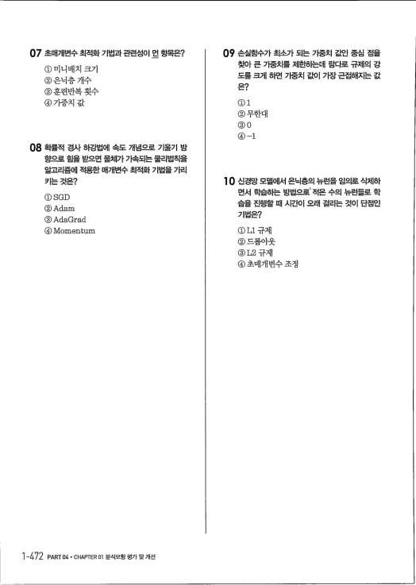
0' 손실함수가 최소가 되는 가중치 값인 중심 점을 07 초매개변수 최적화 기법과 관련성이 먼 힝목은？ 찾아 큰 가중치를 제한하는데 람다로 규제의 강 도를 크게 하면 가중치 값이 가장 근접해지는 값 ① 미니배치 크기 ② 은닉층 개수 ③ 훈런반복 횟수 ④ 가중치 값 은？

#### Di 
②무한대 ③ o ④ -1 08 확률적 겯싸 하강법에 속도 개념으로 기울기 방 향으로 힘을 받으면 물체가 가속되는 물리법칙을 알고리즘에 적용한 매개변수 최적화 기법을 가리 10 신경망 모델에서 은닉층의 뉴런을 임의로 삭제하 키는 것은？ 면서 학습하는 방법으로 ' 적은 수의 뉴런들로 학 ①SGD ②Adam ③AdaGrad ④Momentum 습을 진행할 때 시간이 오래 걸리는 것이 단점인 기법은？ ①Li규제 ②드롭아웃 ③L2규제 ④ 초매개변수 조정 1 -472 PART 04. CHAPTER 01분석모형평가및개선

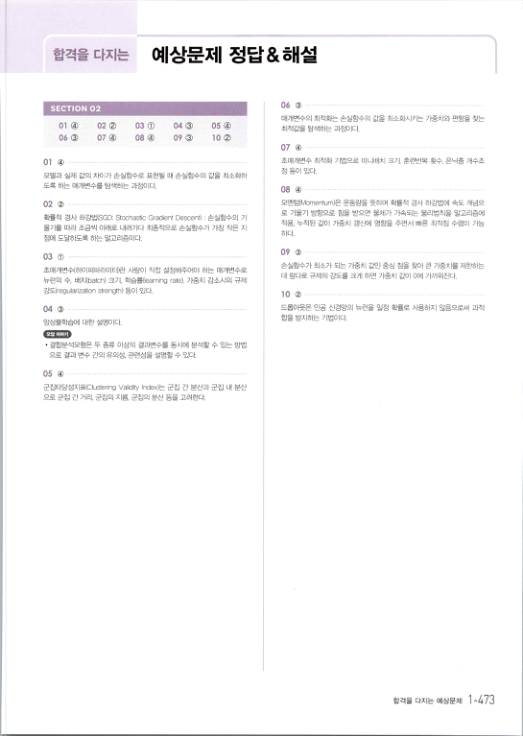
## 합격을다지는 
예상문제 정답＆해설 06 （功 ………………－………………………………………∼………… SECTION 02 매개변수의 최적화는 손실함수의 값을 최소화시키는 가중치와 편향을 찾는 최적값을 탐색하는 과정이다． 04 ③ 02 ② 07 ④ 03 ① 05 ④ lo （蘆） 0l ④ 06 ③ 08 ④ 09 @) 07 ④ …∼………∼… …………………………… ………………… 초매개변수 최적화 기법으로 미니배치 크기． 훈련반복 횟수. 은닉층 개수조 정 등이 있다． 모델과 실제 값의 채기가 손실함수로 표헌될 때 손실함수의 값을 최소화하 도록 하는 매개변수를 탐색하는 과정이다． 08 ④ …………… …… …… …… 모멘텀岫omentum）은 운동량을 뜻하며 확률적 경사 하강법에 속도 개념으 로 기울기 방향으로 함을 받으면 물체가 가속되는 물리법칙을 알고리즘에 02 ② ......................... ...................................................................................................

확률적 경사 하강법（SGD: Stochastic Gradient Descent) : 손실함수의 기 울기를 따라 조금씩 아래로 내려가다 촤종적으로 손실함수가 가장 작은 지 적용． 누적된 값이 가중치 갱신에 영향을 주면서 빠른 최적점 수렴이 가능 하다． 점0ㅔ 도달하도록 하는 알고리즘이다． 09 （軫 ....................................................................................................................................... .............

손실함수가 최소가 되는 가중치 긺인 중심 점을 찾아 큰 가중치를 제한하는 데 람다로 규제의 강도를 크게 하면 가중치 긺惻 00ㅔ 가까워진다． 초매개변수＜하이퍼파라미터）란 사람이 직접 설정해주어야 하는 매개변수로 뉴런의 수． 배치（batch) 크기 . 학습률〈<Iearning rate). 가중치 감소시의 규제 강도（regutarization strength) 등이 있다． 10 (2) ................................................................... . ..... ............ ... .... ... ............................ .............

드롭아웃은 인공 신경망의 뉴런을 일정 확률로 사용하지 않음으로쩌 과적 합을 방지ㅎ階 기법이다． 04 ③ .... ........ ....... .... ....................................................................................... .................................

앙상블학습에 대한 설명이다． 馝 ．·

- 결합분석모형은 두 종류 이상의 결과변수를 동시에 분석할 수 있는 방법 
으로 결과 변수 간의 유의성． 관련성을 설명할 수 있다． 05 ④ ……∼…∼……………－一…… ∼ ……－ ……………一 ………………… 군집타당성자표（이ustering Valk衆y Index）는 군집 간 분산과 군집 내 분산 으로 군십 간 거리． 군집의 지름． 군집의 분산 등을 고려한다．

> 합격을다지는예상문제 1-473